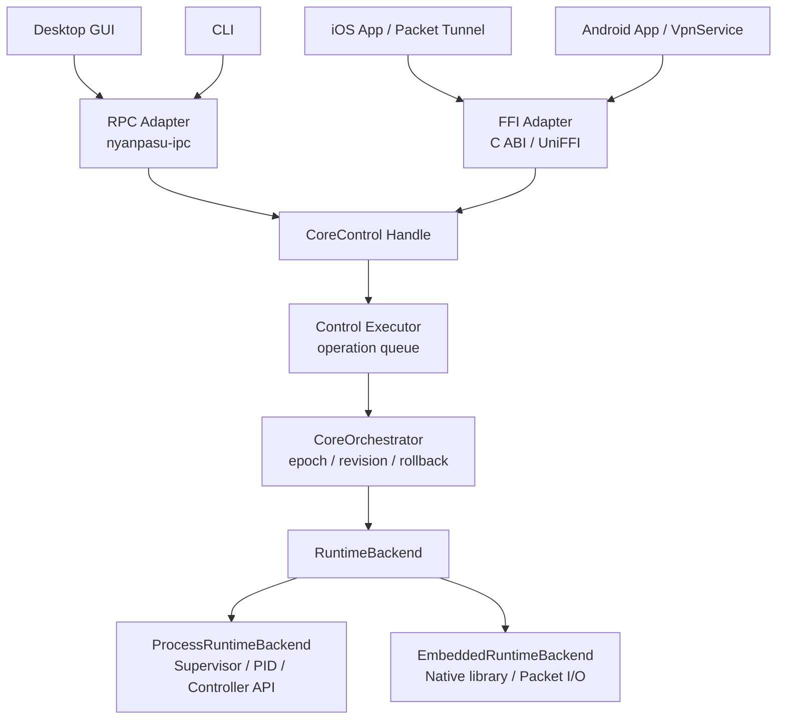
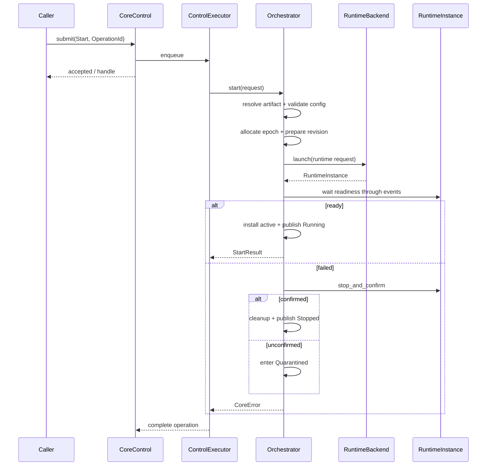
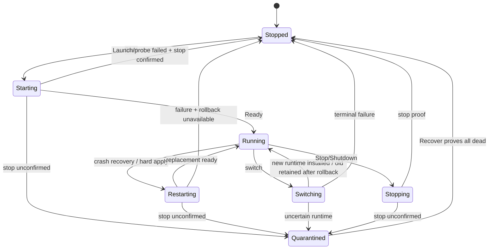

# Nyanpasu CoreManager 控制面与运行时后端解耦设计

- **日期**：2026-08-08
- **状态**：**Adopted with amendments（2026-08-12）** — 原稿正文保留为基线，下方修订记录为规范性裁定，与正文冲突处**以修订记录为准**
- **目标仓库**：`libnyanpasu/nyanpasu-runtime`
- **基线**：`main@0c67f56d78ce5165ae11c8118020fa86fe288e4f`
- **主要范围**：`nyanpasu-core-manager`、`nyanpasu-service-runtime`、`nyanpasu-ipc`
- **关联方向**：桌面提权服务、Android `VpnService`、iOS Packet Tunnel Provider、FFI/UniFFI

---

## 修订记录（2026-08-12，用户裁定；规范性）

依据：`docs/audit/2026-08-12-core-actor-audit-verification.md`（外部审计复核，事实全部过验）。app 侧集成设计（CoreActor v2 对外接口 / 状态机 / 与 service 的关系 / 时序图）见配套文档 `docs/design/2026-08-12-core-actor-v2-app-integration.md`。

| #   | 修订                                                                                                                                                                                                                                                                                                                                                                                                                                                             | 覆盖的原文                                             |
| --- | ---------------------------------------------------------------------------------------------------------------------------------------------------------------------------------------------------------------------------------------------------------------------------------------------------------------------------------------------------------------------------------------------------------------------------------------------------------------- | ------------------------------------------------------ |
| A1  | **BC 不是约束。** 删除 v1 wire 行为仿真与 legacy adapter 保真义务；仅保留**协议版本 fail-closed 门**（app 5-pre 已建：主版本比较，旧 daemon 拒绝进入并要求升级）。v1 endpoints / legacy error 文本 golden / `CoreManager` facade 兼容包装全部不做。                                                                                                                                                                                                              | G7、§19.2、§27、§28-PR-0 中 legacy golden 部分、§34-Q9 |
| A2  | **直接 change，check 内部化。** 调用方不再走 check→change 两步协议（该拆分本身是 TOCTOU：check 结论到 change 执行时已过期）。唯一 mutating 命令 `Reconcile`（含 §9.1 的 Start/Apply 语义合并）在事务内部执行校验：解析失败 → `CoreErrorKind::InvalidConfig`，语义/dry-run 失败 → `ConfigCheckFailed`，均发生在任何提交点之前 = 干净中止、零补偿。独立 `Check` 命令保留但**降格为咨询**（只读、semaphore 限并发、不进 mutating 队列），永远不是 change 的前置门。 | §9.1、§17.1/§17.2/§17.4                                |
| A3  | **每个操作事务化。** mutating 命令统一走十阶段事务信封：admission → idempotency → revision CAS → 内部 check → stage → classify → execute（停旧必须 `StopProof`，否则 `Quarantined`）→ verify → fallback/rollback → 原子 publish。边界情况清单与 contract tests 见审计报告 §3.2。                                                                                                                                                                                 | §17 整节的规范化                                       |
| A4  | **`CoreErrorKind` 基线 = R0（nyanpasu-runtime PR #390）。** §25 的 kind 表是 R0 wire 表的超集扩展（新增 `QueueFull` / `OperationConflict` / `Quarantined` / `StopUnconfirmed` 等）；#390 合并 + submodule pin bump 是本方向硬前置。                                                                                                                                                                                                                              | §25                                                    |
| A5  | **app 侧三项扩展**（本文档范围外，规范在配套文档）：① `CoreEndpointRouter`（app 内 CoreActor v2）负责 Local/Service endpoint 选择；② Local↔Service 是 **显式 controller handoff + `ControllerGeneration` fencing**，不是 backend 替换；③ `MacosDnsController` 归属各 host 的 orchestrator 固定阶段（start/stop/handoff），DNS 与生命周期同一事务。                                                                                                               | §8 拓扑的 app 侧延伸                                   |
| A6  | **实施顺序改判**：不做"兼容 seam → 新 actor → 删 seam"双轨。runtime 仓先行（PR-A ≈ 原 PR-1+2+3 合并；PR-B = service 成为 CoreControl RPC host），app 仓 lockstep 一次性切（PR-C），随后 PR-D（handoff+DNS）、PR-E（清算）。移动端 PR-6/7/8 顺延不变。                                                                                                                                                                                                            | §28                                                    |

---

## 1. 摘要

当前 `nyanpasu-core-manager` 已经不只是一个“启动和停止代理内核”的工具，而是同时承担了：

1. 代理内核生命周期管理；
2. epoch / generation / revision 管理；
3. 配置派生、校验、PATCH、reload、restart、switch 与 rollback；
4. 健康检查、崩溃恢复、死亡确认与 quarantine；
5. runtime 文件、PID 文件、socket、目录锁和日志归档；
6. 对 service 暴露状态、日志和控制接口。

其中，**事务编排、安全状态机和配置切换策略应继续由 CoreManager 统一拥有**；但外部进程、PID、文件路径、stdout/stderr、HTTP/Named Pipe/Unix Socket 等桌面运行机制，不应继续成为 CoreManager 公共模型的硬前提。

本文决定将现有结构演进为：

```text
CoreControl                 统一控制面语义
    │
    ▼
CoreOrchestrator            epoch / revision / rollback / switch / quarantine
    │
    ▼
RuntimeBackend              平台运行后端
    ├── ProcessRuntimeBackend       桌面外部进程
    └── EmbeddedRuntimeBackend      iOS / Android 嵌入式内核
```

RPC 与 FFI 都位于 `CoreControl` 之外：

- 桌面 service：`RPC Adapter -> CoreControl -> ProcessRuntimeBackend`
- Android：`JNI/UniFFI Adapter -> CoreControl -> EmbeddedRuntimeBackend`
- iOS：`Swift/UniFFI Adapter -> CoreControl -> EmbeddedRuntimeBackend`

本文明确不在第一阶段把 `CoreOrchestrator -> RuntimeBackend` 之间远程化。远程 runner 会把本地事务升级为分布式事务，引入 fencing、断线恢复、双 owner 和不确定提交等问题，当前没有足够收益。

---

## 2. 核心决策

| 编号 | 决策                                                                                    |
| ---- | --------------------------------------------------------------------------------------- |
| D1   | 保留 CoreManager 的配置事务、epoch、revision、switch、rollback 和 quarantine 语义。     |
| D2   | 把平台执行机制抽象为 `RuntimeBackend` / `RuntimeInstance`。                             |
| D3   | 对上定义平台无关的 `CoreControl`，service、RPC、FFI 都只消费该端口。                    |
| D4   | 状态模型不再要求 PID、runtime path 或本地 controller 地址；这些变为可选诊断信息。       |
| D5   | 引入 `OperationId` 作为控制请求的关联、幂等和事件追踪标识；它不是 Lease、Session 或锁。 |
| D6   | 状态变更操作由独立 control executor 串行执行，避免 RPC 断开直接取消事务。               |
| D7   | JSONL 日志归档属于 host/observability 层，不属于可移植的 CoreOrchestrator。             |
| D8   | 第一阶段不引入完整 actor 框架；使用有界 `mpsc + oneshot + watch/broadcast` 即可。       |
| D9   | 第一阶段不拆出大量新 crate；先建立模块边界，再按移动端编译依赖需要抽取。                |
| D10  | iOS/Android 使用嵌入式 backend；抽象控制面不能自动把仅提供 CLI 的内核变成可嵌入库。     |

---

## 3. 背景与现状

### 3.1 当前拓扑

当前实现大致为：

```text
nyanpasu-service-runtime
    └── CoreManagerService
            └── nyanpasu-core-manager::CoreManager
                    ├── Instance
                    │     ├── nyanpasu-utils::process::Supervisor
                    │     ├── readiness / liveness probe
                    │     ├── stdout/stderr parser
                    │     └── stop proof / orphan reap
                    ├── RuntimeConfigStore
                    ├── apply / switching / quarantine
                    ├── status watch
                    └── log broadcast + JSONL sink
```

当前分层已经比旧 service 直接管理进程明显更合理：

- service 负责 wire 类型、路径解析、binary 查找和 RPC 映射；
- CoreManager 负责编排；
- Instance 管理单 epoch；
- Supervisor 管理外部进程树。

问题不在于“CoreManager 代码很多”，而在于**领域编排和桌面执行机制仍然粘连**。

### 3.2 当前 CoreManager 中合理的重职责

以下工作必须由单一编排器拥有，不能下放给 RPC 客户端或分别复制到移动端：

- epoch 分配；
- revision CAS；
- source/effective config hash；
- `Noop / Patch / Reload / Restart / Switch` 分类；
- runtime 配置提交与 durability warning；
- PATCH/PUT 后验证；
- restart compensation；
- rollback；
- graceful switch 降级矩阵；
- stop 无法确认时 quarantine；
- 最终状态和 revision 原子发布。

这些行为共同构成安全关键的控制事务，不应拆散。

### 3.3 当前不适合成为通用 CoreManager 前提的职责

以下内容是 process backend 或 host policy：

- `binary_path`；
- 命令行参数和环境变量；
- PID、PID file 和进程树；
- stdout/stderr 管道；
- 进程 supervisor；
- runtime 目录、目录锁和 ACL；
- config 文件原子替换；
- Named Pipe / Unix Socket / HTTP controller；
- JSONL 文件归档和日志轮转。

这些假设在桌面端成立，但在 iOS/Android 嵌入式运行时并不成立。

---

## 4. 问题陈述

### P1. 公共模型被桌面进程语义污染

当前规格和状态包含：

```rust
binary_path: Utf8PathBuf
config_path: Utf8PathBuf
working_dir: Utf8PathBuf
pid_file: Option<Utf8PathBuf>
Running { pid: u32 }
runtime_path: Utf8PathBuf
```

移动端嵌入式内核没有独立可执行文件、PID、进程树或本地 controller socket，这些字段不应是可移植控制面的必填语义。

### P2. RPC 请求生命周期可能取消控制事务

若 HTTP/RPC handler 直接执行 `manager.apply_config(...).await`，客户端断开、请求超时或 handler future 被 drop，可能中断一个处于 stage、commit、stop、rollback 中间阶段的操作。

控制事务的生命周期必须属于服务端控制器，而不能属于某一条连接。

### P3. 当前 RPC 输入仍是同机文件路径

现有 start/apply 请求以 `PathBuf` 传入配置。该模型：

- 假设调用方与 service 共享文件系统；
- 允许提权 service 读取调用方指定路径；
- 无法自然映射到 iOS app extension 或 Android native runtime；
- 使配置内容、hash 与路径身份混在一起。

### P4. 日志归档属于 host policy

CoreManager 可以产生规范化 `LogFrame`，但是否写 JSONL、写到哪里、保留多少、是否使用平台日志系统，应由 service 或 mobile host 决定。

### P5. 移动端不能使用外部进程模型

- iOS Packet Tunnel Provider 不能依赖任意外部可执行文件；
- Android 最自然的模型是 `VpnService + JNI/FFI + native library`；
- 两端都需要把 TUN/packet flow 作为 host resource 注入 embedded backend。

### P6. 如果直接远程化底层 runner，会引入分布式事务

在 Orchestrator 与 RuntimeBackend 之间增加 RPC 后，需要处理：

- start 响应丢失但实际已启动；
- switch 中途断线；
- client 和 server 双 owner；
- stale manager 控制新 runtime；
- stop 返回不确定；
- operation fencing；
- rollback 期间 runner 重启。

当前无需承担这些复杂度。

---

## 5. 目标与非目标

### 5.1 目标

- **G1**：建立平台无关的 `CoreControl` 控制面。
- **G2**：保留并复用当前 CoreManager 的安全事务语义。
- **G3**：把外部进程机制封装为 `ProcessRuntimeBackend`。
- **G4**：允许实现不依赖 PID、文件路径和 controller socket 的 `EmbeddedRuntimeBackend`。
- **G5**：让同一套 start/apply/stop/switch/rollback 语义可被本地 Rust、RPC 和 FFI 使用。
- **G6**：控制操作不因 RPC/FFI 调用方取消而中断。
- **G7**：保持现有桌面 IPC wire 行为兼容，并提供新的 portable v2 协议。
- **G8**：明确 service、orchestrator、backend 和 mobile host 的安全边界。
- **G9**：用最少的新抽象完成第一轮改造，不提前实现未证明需要的远程 runner。

### 5.2 非目标

- 不在本设计中实现具体 mihomo/clash-rs 的移动端嵌入版本。
- 不承诺所有现有代理内核均可在 iOS/Android 嵌入。
- 不在第一阶段实现跨机器 RPC。
- 不在第一阶段实现 Orchestrator 与 Backend 分进程部署。
- 不实现 durable operation ledger；`OperationId` 幂等缓存先保持进程内。
- 不实现运行中进程的跨 service 重启 reattach；保持现有 orphan cleanup 语义。
- 不为了控制串行化引入 ractor/actix 等完整 actor 框架。
- 不在第一阶段一次性拆出多个新 crate。

---

## 6. 术语

| 术语                       | 定义                                                                     |
| -------------------------- | ------------------------------------------------------------------------ |
| **Proxy Core**             | mihomo、clash-rs、meow 等实际代理实现。                                  |
| **CoreControl**            | 面向 GUI、service、RPC、FFI 的平台无关控制端口。                         |
| **CoreOrchestrator**       | 管理 epoch、revision、apply、switch、rollback、quarantine 的领域编排器。 |
| **RuntimeBackend**         | 把代理内核运行在某个平台上的机制。                                       |
| **RuntimeInstance**        | 某次已启动 runtime 的句柄，对应当前 epoch 中的实际执行实体。             |
| **ProcessRuntimeBackend**  | 通过子进程、Supervisor、PID 和 controller API 运行代理内核。             |
| **EmbeddedRuntimeBackend** | 通过 native library/FFI 在当前 host 进程内运行代理内核。                 |
| **Host Adapter**           | service、Android `VpnService`、iOS Packet Tunnel Provider 等平台入口。   |
| **OperationId**            | 控制请求的唯一关联标识，用于幂等、查询和事件追踪。不是锁或租约。         |
| **RuntimeInstanceId**      | backend 分配的 opaque instance identity，不等价于 PID。                  |
| **StopProof**              | backend 对“该 runtime 已不能继续提供服务或占用资源”的确认。              |

> 本设计不把底层执行层命名为 “Kernel”，以避免和 Proxy Core/代理内核混淆；统一使用 `RuntimeBackend`。

---

## 7. 设计原则

### 7.1 策略与机制分离

- Orchestrator 决定**要达到什么状态**以及失败后如何补偿；
- Backend 决定**在当前平台如何运行、探测、应用和停止**。

### 7.2 单一事务所有者

一个 state-changing operation 从入队到终态都由控制器拥有。客户端断线只意味着收不到结果，不意味着事务被取消。

### 7.3 可移植模型不泄露平台资源

PID、fd、path、socket、Objective-C 对象和 JNI handle 不进入 portable RPC DTO。

### 7.4 死亡确认优先于“尽力停止”

任何 backend 都必须实现等价于当前 `stop_and_confirm_dead` 的语义。无法确认时进入 quarantine，不允许盲目启动冲突实例。

### 7.5 能力驱动，而不是按平台硬编码

是否支持 PATCH、reload、parallel instances、graceful switch、in-process control，应由 capability 组合决定。

### 7.6 兼容先行，物理拆分后置

先在现有 crate 中形成清晰模块边界；只有移动端编译依赖或独立复用确有需要时再拆 crate。

---

## 8. 目标架构



### 8.1 分层职责

| 层               | 负责                                                                  | 不负责                     |
| ---------------- | --------------------------------------------------------------------- | -------------------------- |
| Host Adapter     | 平台生命周期、权限、RPC/FFI、用户身份、artifact resolution、日志 sink | apply/switch/rollback 事务 |
| CoreControl      | 命令、OperationId、状态和事件的稳定语义                               | PID、文件路径、socket 细节 |
| Control Executor | 操作排队、串行化、幂等、取消隔离、shutdown gate                       | 具体平台启动机制           |
| CoreOrchestrator | epoch、revision、desired/observed state、配置事务、补偿、quarantine   | 子进程/JNI/Swift API       |
| RuntimeBackend   | prepare/check/launch/reconcile/stop proof、backend events             | RPC、用户配置管理、UI wire |
| Process Backend  | binary、CLI、Supervisor、PID、runtime dir、controller client          | 移动端 packet flow         |
| Embedded Backend | native handle、packet I/O、direct control、embedded shutdown          | 桌面 service 安装和 ACL    |

---

## 9. CoreControl 控制面

### 9.1 控制模型

控制面以命令和操作为中心：

```rust
pub struct CoreCommandEnvelope {
    pub operation_id: OperationId,
    pub command: CoreCommand,
}

pub enum CoreCommand {
    Start(StartRequest),
    Stop(StopRequest),
    Apply(ApplyRequest),
    Check(CheckRequest),
    Recover(RecoverRequest),
    Shutdown(ShutdownRequest),
}
```

`restart` 不必成为领域层独立原语，可表示为：

- 使用当前 desired spec 的 `Apply`/`Switch`；或
- 保留 convenience command，但内部转为同一编排路径。

### 9.2 OperationId

```rust
pub struct OperationId([u8; 16]);
```

语义：

- 由调用方生成，或由本地 convenience API 自动生成；
- 同一 `OperationId + 相同 payload digest` 返回同一 operation；
- 同一 `OperationId + 不同 payload` 返回 `OperationConflict`；
- 用于日志、事件、状态和 RPC 重试关联；
- 不代表对 CoreManager 的所有权；
- 不阻止其他 operation，只由 control executor 决定串行顺序；
- 第一阶段只做进程内 bounded cache，不做持久化。

### 9.3 Rust 侧 API 草案

```rust
pub trait CoreControl: Send + Sync {
    fn submit(
        &self,
        request: CoreCommandEnvelope,
    ) -> Result<OperationHandle, SubmitError>;

    fn status(&self) -> CoreStatus;

    fn subscribe_events(&self) -> CoreEventReceiver;

    fn subscribe_logs(&self) -> CoreLogReceiver;
}

pub struct OperationHandle {
    pub id: OperationId,
    // Rust convenience API；wire/FFI 不直接暴露 oneshot。
    result: tokio::sync::oneshot::Receiver<OperationResult>,
}
```

本地调用可以：

```rust
let result = control.submit(command)?.wait().await?;
```

RPC 可以立即返回 accepted，也可以在请求 deadline 内等待；无论调用方是否继续等待，后台 operation 都继续运行到安全终态。

### 9.4 Operation 状态

```rust
pub enum OperationState {
    Queued,
    Running,
    Succeeded(OperationResult),
    Failed(CoreError),
}
```

控制器维护有界的最近 operation cache，供：

- 重试幂等；
- RPC 查询；
- UI 展示失败原因；
- 断线后恢复结果。

缓存丢失不影响 core runtime 的最终状态；客户端应重新读取 `CoreStatus`。

---

## 10. Control Executor 与并发模型

### 10.1 为什么不继续让 RPC handler 直接调用 manager

长事务可能跨越：

```text
load -> validate -> stage -> commit -> stop -> launch -> probe -> verify -> rollback
```

若 handler future 被取消，事务可能停在中间阶段。控制面需要拥有 operation 的 task。

### 10.2 推荐实现

```text
CoreControlHandle
    │ bounded mpsc
    ▼
ControlExecutor task
    ├── mutable OrchestratorState
    ├── operation registry
    ├── status watch sender
    └── event broadcast sender
```

规则：

- `Start / Stop / Apply / Recover / Shutdown` 串行；
- `Check` 不改变 active state，可交给独立有界 semaphore 并发执行；
- status/read-only 查询直接读取 watch snapshot；
- operation queue 必须有界，满时返回 `QueueFull`；
- `Shutdown` 设置 closing latch，拒绝新 operation，等待或终止已有 operation 后关闭 backend；
- reply receiver 被 drop 时，executor 不取消 operation；
- executor panic 必须被 host 检测并转为 fatal service state。

### 10.3 是否使用 ractor

第一阶段不需要。

`mpsc + oneshot + watch + broadcast` 已经覆盖：

- mailbox；
- request/reply；
- snapshot；
- event fan-out；
- cancellation isolation。

若后续出现多 runtime、多 tenant、supervision tree 等需求，再评估 ractor。

---

## 11. CoreOrchestrator

### 11.1 应保留的职责

```text
- active desired spec
- active observed runtime
- epoch allocator
- config generation
- revision CAS
- change planning
- runtime artifact transaction
- start/restart/switch compensation
- rollback
- state publication
- quarantine / recovery gate
```

### 11.2 Orchestrator 状态草案

```rust
struct OrchestratorState {
    active: Option<ActiveRuntime>,
    last_desired: Option<DesiredCore>,
    next_epoch: u64,
    safety: SafetyState,
    closing: bool,
}

struct ActiveRuntime {
    epoch: u64,
    instance: Box<dyn RuntimeInstance>,
    desired: DesiredCore,
    revision: ConfigRevision,
    effective_capabilities: EffectiveCapabilities,
}
```

### 11.3 生命周期与安全状态分离

```rust
pub struct CoreStatus {
    pub lifecycle: CoreLifecycle,
    pub safety: SafetyState,
    pub health: Option<HealthStatus>,
    pub artifact: Option<CoreArtifactSummary>,
    pub revision: Option<ConfigRevision>,
    pub active_operation: Option<OperationSummary>,
    pub runtime: Option<RuntimeIdentity>,
}
```

```rust
pub enum SafetyState {
    Normal,
    Quarantined {
        uncertain_instances: Vec<RuntimeInstanceId>,
        reason: String,
    },
    Closing,
}
```

quarantine 不应只隐藏在下一次操作错误里，portable status 应明确暴露当前控制面是否被安全锁定。

### 11.4 可移植 runtime identity

```rust
pub struct RuntimeIdentity {
    pub instance_id: RuntimeInstanceId,
    pub process: Option<ProcessInfo>,
    pub control_transport: Option<ControlTransportInfo>,
}

pub struct ProcessInfo {
    pub pid: u32,
}
```

移动端 embedded runtime：

```text
instance_id = opaque UUID/counter
process = None
control_transport = InProcess
```

桌面 process runtime：

```text
instance_id = epoch/process identity
process = Some(pid)
control_transport = LocalIpc | Http
```

---

## 12. RuntimeBackend

### 12.1 最小接口

```rust
pub trait RuntimeBackend: Send + Sync {
    fn backend_kind(&self) -> RuntimeBackendKind;

    fn capabilities(&self, artifact: &ResolvedArtifact)
        -> BackendCapabilities;

    fn check(
        &self,
        request: RuntimeCheckRequest,
    ) -> BoxFuture<'static, Result<CheckReport, RuntimeError>>;

    fn launch(
        &self,
        request: RuntimeLaunchRequest,
    ) -> BoxFuture<'static, Result<Box<dyn RuntimeInstance>, RuntimeError>>;
}

pub trait RuntimeInstance: Send {
    fn identity(&self) -> RuntimeIdentity;

    fn subscribe(&self) -> RuntimeEventReceiver;

    fn reconcile(
        &mut self,
        request: RuntimeReconcileRequest,
    ) -> BoxFuture<'_, Result<RuntimeReconcileResult, RuntimeError>>;

    fn stop_and_confirm(
        self: Box<Self>,
        deadline: Duration,
    ) -> BoxFuture<'static, Result<StopProof, RuntimeError>>;
}
```

> 上述代码是边界草案，不要求第一版直接采用 `async_trait`、GAT 或某一种 BoxFuture 实现。

### 12.2 Backend 事件

```rust
pub enum RuntimeEvent {
    Started {
        identity: RuntimeIdentity,
    },
    Ready,
    HealthChanged(HealthStatus),
    Restarting {
        attempt: u32,
    },
    Exited {
        reason: RuntimeExitReason,
    },
    Log(Arc<LogFrame>),
}
```

Orchestrator 只消费标准事件，不解析 stdout/stderr。

### 12.3 StopProof

```rust
pub enum StopProof {
    Confirmed {
        instance_id: RuntimeInstanceId,
    },
    AlreadyStopped {
        instance_id: RuntimeInstanceId,
    },
}
```

`RuntimeError::StopUnconfirmed` 必须触发 quarantine。

不同 backend 的确认方式可以不同：

| Backend       | StopProof 来源                                                                         |
| ------------- | -------------------------------------------------------------------------------------- |
| Process       | Supervisor stop + process identity/PID record reaper + process tree death confirmation |
| Embedded      | shutdown API 成功 + event loop/join handle 终止 + native handle 作废                   |
| Future remote | runner fencing token + instance terminal state；不在本阶段实现                         |

### 12.4 Core-specific driver 是否单独抽象

概念上存在两类变化：

1. **CoreDriver**：配置格式、capability、change classification、control API；
2. **ExecutionBackend**：process/embedded 的启动和停止机制。

但第一阶段不立即定义两套 public trait。先由 `RuntimeBackend` 聚合这两类实现，避免在只有一个成熟实现时提前泛化。

当出现以下任一条件时再拆 `CoreDriver`：

- 同一 core driver 同时被 process 和 embedded backend 复用；
- 第二种 embedded core 需要共享通用 execution backend；
- 当前 `kind.rs/config/mihomo` 逻辑已能形成稳定的纯语义边界。

---

## 13. ProcessRuntimeBackend

### 13.1 当前代码映射

| 当前模块                              | 目标归属                                              |
| ------------------------------------- | ----------------------------------------------------- |
| `instance.rs`                         | `runtime/process/instance.rs`，实现 `RuntimeInstance` |
| `nyanpasu-utils::process::Supervisor` | 保持底层进程机制                                      |
| `kind.rs` 中 CLI 参数                 | process backend，未来可下沉 CoreDriver                |
| `health/probe.rs` controller probe    | process backend/control driver                        |
| PID file / orphan reap                | process backend                                       |
| `RuntimeConfigStore`                  | process backend 的 artifact store                     |
| local IPC / HTTP controller           | process backend 的 reconcile transport                |
| stdout/stderr parser                  | process backend，输出标准 `LogFrame`                  |
| JSONL `log_sink`                      | 移至 service host/可选 subscriber                     |

### 13.2 Process backend 配置

```rust
pub struct ProcessBackendOptions {
    pub runtime_dir: Utf8PathBuf,
    pub local_ipc_policy: LocalIpcPolicy,
    pub controller_template: Option<String>,
    pub control_timeout: Duration,
    pub stop_timeout: Duration,
}
```

这些字段不再出现在 portable `CoreControl` 请求中，而是在 service 构造 backend 时注入。

### 13.3 Artifact resolution

portable 控制请求不接受 raw binary path：

```rust
pub struct CoreArtifactRef {
    pub id: CoreArtifactId,
    pub expected_digest: Option<Digest>,
}
```

service host 使用受信任 resolver：

```text
CoreArtifactId
    -> manifest/install registry
    -> verified binary path
    -> version/distribution/capabilities
    -> ResolvedArtifact::Process
```

旧 IPC `CoreType` 由 legacy adapter 映射到 `CoreArtifactId`。

---

## 14. EmbeddedRuntimeBackend

### 14.1 运行模型

Embedded backend 不 spawn 外部程序，而是：

- 加载或静态链接 native core library；
- 创建 native runtime handle；
- 注入配置 bytes；
- 注入 packet I/O / TUN resource；
- 通过 direct API 探测、apply 和 shutdown；
- 将 native callbacks 归一化为 `RuntimeEvent`。

### 14.2 Host resource 不进入 portable DTO

Android TUN fd、iOS packet flow/回调对象属于 host-local capability，不能出现在 RPC JSON：

```rust
pub trait PacketIo: Send + Sync {
    fn read_packet(&self, buffer: &mut [u8]) -> IoResult<usize>;
    fn write_packet(&self, packet: &[u8]) -> IoResult<()>;
}
```

实际实现可以是：

- Android：基于 detached fd；
- iOS：Swift/Objective-C bridge 提供的 packet callback；
- 测试：in-memory packet channel。

`EmbeddedRuntimeBackend` 在构造时获得这些 host resources，而不是由普通 `StartRequest` 传入。

### 14.3 Embedded backend 的最小能力

第一版只要求：

- start；
- readiness；
- stop confirmation；
- log/event；
- full config restart。

PATCH、reload、parallel instance 和 graceful switch 都是可选能力。移动端第一版可安全降级到 hard restart，不应为了对齐桌面能力阻塞基础支持。

---

## 15. Capability 模型

### 15.1 三类能力

```text
ArtifactCapabilities    该内核构建本身支持什么
DriverCapabilities      当前 core adapter 能表达什么
BackendCapabilities     当前平台执行机制能做什么
```

最终能力：

```text
EffectiveCapabilities = Artifact ∩ Driver ∩ Backend
```

### 15.2 示例

```rust
pub struct BackendCapabilities {
    pub parallel_instances: bool,
    pub in_place_patch: bool,
    pub full_reload: bool,
    pub isolated_control_channel: bool,
    pub stop_proof: bool,
    pub direct_control: bool,
    pub log_stream: bool,
}
```

### 15.3 Graceful switch 条件

只有同时满足以下条件才允许 graceful switch：

1. backend 支持并行实例；
2. 每个实例具有隔离 control channel；
3. core driver 能构造安全的 zero-inbound bootstrap；
4. 配置没有不能安全重叠的监听面；
5. 新实例 readiness 可在不占用正式监听端口时完成；
6. 旧实例 stop 可确认；
7. full config restore 可验证。

否则返回 typed degradation reason 并执行 hard switch。

---

## 16. 配置模型

### 16.1 Portable ConfigInput

```rust
pub enum ConfigInput {
    Inline {
        bytes: Vec<u8>,
        media_type: ConfigMediaType,
        expected_digest: Option<Digest>,
    },
    Resource {
        id: ConfigResourceId,
        expected_digest: Option<Digest>,
    },
}
```

第一版 v2 RPC 至少支持 `Inline`。`Resource` 用于未来与 profile/config store 集成。

### 16.2 Legacy Path adapter

现有：

```text
config_file: PathBuf
```

兼容层执行：

```text
canonicalize
-> 安全校验
-> 限制大小
-> read bytes
-> compute digest
-> ConfigInput::Inline
```

portable CoreControl 从此不再看到调用方路径。

### 16.3 Revision

```rust
pub struct ConfigRevision {
    pub epoch: u64,
    pub generation: u64,
    pub source_hash: Digest,
    pub effective_hash: Digest,
}
```

`runtime_path` 从 portable revision 移除；process backend 可以在 diagnostics extension 中暴露，但不得作为 CAS token 的组成部分。

### 16.4 Runtime artifact store

Orchestrator 需要“可提交、可备份、可恢复”的抽象语义；process backend 可以继续使用现有 `RuntimeConfigStore`。

第一阶段不急于抽象通用 `StateStore`。embedded backend 可以在内存中持有 effective config，持久化 desired config 由 mobile host 负责。

---

## 17. 核心操作语义

### 17.1 Start



### 17.2 Apply

Apply 的语义继续保持：

```text
expected revision check
-> prepare desired config
-> classify change
-> commit desired runtime artifact
-> try cheapest reconcile path
-> verify observed state
-> fallback restart/switch
-> rollback on failure
-> publish actual running revision
```

结果仍应是 typed outcome：

```rust
pub enum ApplyOutcome {
    Noop,
    Patched,
    Reloaded,
    Restarted,
    Switched,
    RolledBack {
        failed_apply: String,
    },
}
```

`RolledBack` 是成功完成的控制事务，但 desired config 未生效；返回值必须包含当前实际 revision。

### 17.3 Stop

```text
set Stopping
-> backend.stop_and_confirm
-> Confirmed: cleanup + Stopped(User)
-> StopUnconfirmed: SafetyState::Quarantined
```

不得把 timeout 简单映射为“可能停止成功”。

### 17.4 Check

- 不读取或修改 active runtime；
- 由 backend/driver 对 config + artifact 做 dry run；
- 有界并发；
- 不进入 state-changing queue；
- 返回结构化 `CheckReport`，避免只返回无法分类的文本。

### 17.5 Recover

recover 仅清除能够重新证明安全的 quarantine：

```text
inspect uncertain runtime identity
-> backend-specific proof/reap
-> all confirmed dead: clear quarantine
-> any uncertain: keep quarantine and return details
```

### 17.6 Shutdown

- 设置 closing；
- 拒绝新 operation；
- 当前 mutating operation 必须运行到可补偿点；
- stop active runtime；
- flush/close host log sinks；
- 关闭事件通道；
- 返回最终 shutdown result。

---

## 18. 状态机



实现上 lifecycle 和 safety 可保持两个正交字段；图中 `Quarantined` 用于表达组合状态。

---

## 19. RPC 设计

### 19.1 RPC 所在位置

正确边界：

```text
RPC Client -> CoreControl RPC Adapter -> local CoreControl
```

暂不采用：

```text
CoreOrchestrator -> RPC -> remote RuntimeBackend
```

### 19.2 现有 IPC 兼容

保留现有端点和 wire：

```text
/core/start
/core/stop
/core/restart
/core/apply
/core/check
/core/recover
/status
/ws/events
```

现有 route handler 改为 legacy adapter：

1. 转换 `CoreType -> CoreArtifactId`；
2. 读取 `PathBuf -> ConfigInput::Inline`；
3. 生成 `OperationId`；
4. 调用 `CoreControl`；
5. 映射回旧错误文本、旧状态和旧 response。

### 19.3 Portable v2 协议

建议增加 versioned contract，而不是修改旧 wire：

```text
POST /v2/core/start
POST /v2/core/stop
POST /v2/core/apply
POST /v2/core/check
POST /v2/core/recover
GET  /v2/core/status
GET  /v2/core/operations/{operation_id}
WS   /v2/core/events
WS   /v2/core/logs
```

每个 mutating 请求包含：

```json
{
  "operation_id": "...",
  "...": "typed request fields"
}
```

### 19.4 RPC completion 模式

支持两种调用方式：

1. **wait**：handler 在自己的响应 deadline 内等待 operation；
2. **accepted**：立即返回 operation id，客户端通过 operation endpoint/event 获取结果。

无论哪种方式，operation 都由 executor 拥有。

### 19.5 事件顺序与重连

```rust
pub struct CoreEventEnvelope {
    pub sequence: u64,
    pub operation_id: Option<OperationId>,
    pub at: i64,
    pub event: CoreEvent,
}
```

- `sequence` 只保证单 controller 生命周期内单调；
- event stream 允许丢帧；
- 客户端发现 gap 后重新读取 `/status`；
- status 是事实来源，event 是增量提示；
- 日志和状态事件使用独立 channel，避免日志洪峰阻塞控制状态。

### 19.6 RPC 安全

- 继续使用 named pipe / Unix socket ACL；
- v2 不接受 raw binary path；
- v2 默认不接受任意 service-readable config path；
- 对 config bytes、operation queue、check 并发和日志帧设上限；
- secret 不进入 status、event、error debug；
- 客户端依据稳定 `error_kind` 分支，不依据人类文本。

---

## 20. FFI 设计

### 20.1 FFI 不是另一套业务控制面

FFI 只把同一个 `CoreControl` 暴露给 Swift/Kotlin：

```text
Swift/Kotlin -> FFI Adapter -> CoreControl -> Orchestrator -> EmbeddedBackend
```

### 20.2 推荐 ABI

底层保持窄 C-like ABI：

```c
core_result_t nyanpasu_core_create(
    const uint8_t* options,
    size_t options_len,
    const core_callbacks_t* callbacks,
    core_handle_t** out_handle);

core_result_t nyanpasu_core_submit(
    core_handle_t* handle,
    const uint8_t* command,
    size_t command_len,
    operation_id_t* out_operation);

core_result_t nyanpasu_core_get_status(
    core_handle_t* handle,
    owned_buffer_t* out_status);

core_result_t nyanpasu_core_shutdown(core_handle_t* handle);
void nyanpasu_core_destroy(core_handle_t* handle);
```

DTO 可使用稳定 JSON/CBOR bytes，typed UniFFI wrapper 可在其上生成。

### 20.3 FFI 生命周期规则

- Rust 拥有 Tokio runtime 和 control executor；
- Swift/Kotlin 只持 opaque handle；
- native callback 不在 Rust 核心锁内调用；
- callback 进入有界队列，慢 UI 不得阻塞 runtime；
- `destroy` 只在 `shutdown` 或 force-abort 语义明确后释放；
- handle generation 防止 use-after-free/stale callback；
- panic 不跨 FFI 边界；
- 所有返回 buffer 具有明确的 free 函数；
- FFI 不暴露 Rust borrow、future、trait object 或 channel 类型。

### 20.4 UniFFI 使用建议

UniFFI 可以作为 Swift/Kotlin bindings 生成器，但不应决定核心对象模型。底层语义仍以：

```text
opaque handle + command DTO + event callback + explicit shutdown
```

为准，以便未来更换生成器或补充手写平台桥接。

---

## 21. Android 适配

### 21.1 推荐拓扑


### 21.2 生命周期映射

| Android 生命周期                  | CoreControl 行为                                         |
| --------------------------------- | -------------------------------------------------------- |
| 用户授权并启动 `VpnService`       | 创建 control/backend，注入 TUN fd                        |
| `onStartCommand` / explicit start | submit Start                                             |
| 配置变化                          | submit Apply                                             |
| `onRevoke` / stop action          | submit Stop/Shutdown                                     |
| service 进程终止                  | native handle 销毁；下次由 persisted desired config 重建 |

### 21.3 注意事项

- TUN fd 通过 host-local 构造参数注入，不进入普通 RPC；
- backend 必须明确 fd ownership，避免 Java 和 native 双重 close；
- foreground service notification 属于 Android host 层；
- service 可选择独立 process，但 Rust 控制面语义不变；
- 第一版不要求 graceful switch；
- 日志默认进入 Android logging 或有界 in-memory sink，不默认写桌面式 JSONL。

---

## 22. iOS 适配

### 22.1 推荐拓扑


### 22.2 生命周期映射

| Packet Tunnel Provider | CoreControl 行为                                                    |
| ---------------------- | ------------------------------------------------------------------- |
| `startTunnel`          | 创建 backend，注入 packet flow，submit Start，ready 后完成 callback |
| provider message       | status/query/apply command adapter                                  |
| `stopTunnel`           | submit Shutdown，并在 deadline 内完成 provider stop callback        |
| extension 被系统终止   | 下次 startTunnel 从 shared desired config 重建                      |

### 22.3 注意事项

- 不依赖任意外部 executable；
- 代理内核必须可编译为 iOS-compatible static library/framework；
- Packet flow bridge 需要严格背压，不能在 Swift callback 中无限排队；
- extension 内存和后台运行预算要求日志、缓存和 operation history 有界；
- App 与 extension 的通信属于 iOS host adapter，不应复用桌面 named pipe RPC；
- shared App Group 只保存 desired config/必要状态，不保存 native handle。

---

## 23. 日志与可观测性

### 23.1 日志责任拆分

```text
RuntimeBackend
    -> 产生规范化 LogFrame
CoreControl
    -> broadcast LogFrame
Host Adapter
    -> 选择一个或多个 sink
```

host sink 示例：

- desktop service：rotating JSONL + tracing + WebSocket；
- Android：logcat + optional ring buffer；
- iOS：os_log + bounded in-memory diagnostics；
- tests：in-memory collector。

### 23.2 从 CoreManager 移出的内容

- log directory 创建；
- JSONL sink task；
- rotation；
- file retention；
- log path status accessor。

CoreManager 只保证：

- backend 日志被标准化；
- frame 有大小上限；
- fan-out 不阻塞 control path；
- lag 有可观测计数。

### 23.3 Metrics

建议至少记录：

```text
core_operation_total{kind,outcome}
core_operation_duration_seconds{kind}
core_runtime_restarts_total
core_quarantine_total
core_probe_failures_total
core_event_lag_total
core_log_dropped_total
core_backend_stop_unconfirmed_total
```

---

## 24. 持久化与恢复

### 24.1 第一阶段语义

- Orchestrator active state：内存；
- Operation registry：内存、有界、不持久化；
- process runtime artifacts：继续由 `RuntimeConfigStore` 管理；
- process service 启动：继续 sweep/reap orphan，不 reattach；
- mobile desired config：由 App/Provider host 的配置系统持久化；
- mobile runtime handle：绝不持久化。

### 24.2 为什么不立即抽象通用 StateStore

桌面 runtime 文件事务和移动端 app config persistence 的语义不同。过早统一会产生最低公共分母接口。

当需要以下能力时再引入 `DesiredStateStore`：

- service 重启后自动恢复运行；
- mobile provider 自动恢复上一配置；
- durable operation audit；
- 多 controller 故障转移。

---

## 25. 错误模型

```rust
pub enum CoreErrorKind {
    AlreadyRunning,
    NotStarted,
    RevisionConflict,
    ArtifactNotFound,
    ArtifactUntrusted,
    InvalidConfig,
    ConfigCheckFailed,
    Unsupported,
    BackendUnavailable,
    ApplyFailed,
    RollbackFailed,
    StopUnconfirmed,
    Quarantined,
    OperationConflict,
    QueueFull,
    ShuttingDown,
    Internal,
}

pub struct CoreError {
    pub kind: CoreErrorKind,
    pub message: String,
    pub retryable: bool,
    pub operation_id: Option<OperationId>,
    pub details: Option<ErrorDetails>,
}
```

要求：

- `message` 可变，不作为程序分支条件；
- `kind` 稳定；
- secret/path 等敏感信息经过 redaction；
- `StopUnconfirmed` 和 `RollbackFailed` 明确标记安全影响；
- legacy adapter 保留已有错误文本兼容。

---

## 26. Crate 与模块布局

### 26.1 第一阶段：不拆 crate

```text
crates/nyanpasu-core-manager/src/
├── control/
│   ├── mod.rs              # CoreControl handle / commands / OperationId
│   ├── executor.rs         # queue + operation registry
│   └── event.rs
├── orchestrator/
│   ├── mod.rs
│   ├── apply.rs
│   ├── switching.rs
│   ├── publish.rs
│   └── quarantine.rs
├── runtime/
│   ├── mod.rs              # RuntimeBackend / RuntimeInstance
│   └── process/
│       ├── mod.rs
│       ├── instance.rs
│       ├── store.rs
│       ├── probe.rs
│       └── logs.rs
├── model/
│   ├── spec.rs
│   ├── state.rs
│   └── error.rs
└── lib.rs
```

### 26.2 后续按真实依赖抽取

当移动端开始构建时，建议目标拓扑：

```text
nyanpasu-core-control
    portable DTO / CoreControl trait / events / errors

nyanpasu-core-manager
    CoreOrchestrator / operation executor / backend interfaces

nyanpasu-core-runtime-process
    desktop process backend

nyanpasu-core-ffi
    C ABI / UniFFI wrapper

nyanpasu-ipc
    desktop RPC adapter

nyanpasu-service-runtime
    privileged host / artifact resolver / logging / ACL
```

抽取条件：移动端 crate 必须能依赖 portable control types，而不编译 process、axum、Windows service 或 Unix socket 代码。

---

## 27. 兼容性策略

### 27.1 Rust API

保留 `CoreManager` 作为 facade：

```rust
impl CoreManager {
    pub async fn start(&self, spec: InstanceSpec) -> Result<(), Error> {
        // compatibility wrapper:
        // legacy spec -> portable request -> generated OperationId -> wait
    }
}
```

内部逐步改为 `CoreControlHandle`。

### 27.2 IPC

- v1 endpoints 和 payload 不变；
- v1 `PathBuf` 在 service adapter 内读取；
- v1 `CoreType` 在 service adapter 内解析 artifact；
- v1 status 继续映射 desktop PID；
- v2 才暴露 portable status、operation 和 artifact identity。

### 27.3 行为兼容

第一轮 backend 抽取必须保证：

- start readiness 语义不变；
- restart policy/backoff 不变；
- stop proof 不变；
- apply outcome 不变；
- graceful switch 降级矩阵不变；
- quarantine gate 不变；
- runtime config hash/revision 不变；
- existing tests 全量复用。

---

## 28. 实施计划

### PR-0：基线与行为冻结

- 为现有 start/stop/restart/apply/check/recover 建立 golden/contract tests；
- 增加 RPC handler cancellation 测试；
- 记录当前 state/event sequence；
- 不改架构。

**验收**：后续重构能证明 wire 和状态语义未漂移。

### PR-1：Portable model 与 OperationId

- 新增 portable `CoreStatus`、`ConfigRevision`、`RuntimeIdentity`；
- PID/path 移入 optional diagnostics；
- 新增 `CoreCommandEnvelope` 和 `OperationId`；
- 现有 manager API 继续可用。

**验收**：model 不依赖 `PathBuf`、PID 或 controller host 才能表达 Running。

### PR-2：Control Executor

- 新增有界 command queue；
- state-changing operation 串行执行；
- operation registry 与幂等冲突检测；
- handler 取消不再取消 operation；
- check 保留有界并发。

**验收**：主动 drop caller future 后，operation 仍完成或回滚到安全状态。

### PR-3：RuntimeBackend 边界

- 定义 `RuntimeBackend` / `RuntimeInstance`；
- 当前 `Instance` 包装为 process runtime instance；
- Orchestrator 不直接依赖 Supervisor；
- stop proof contract tests。

**验收**：现有 process lifecycle tests 经 backend contract 运行。

### PR-4：Process-specific 资源迁移

- `RuntimeConfigStore`、PID、controller、probe、stdout parser 移入 process backend；
- JSONL sink 移至 service host；
- portable manager 去除 runtime dir/log dir 必填假设。

**验收**：构造一个不需要 runtime directory 的 fake embedded backend。

### PR-5：RPC v2

- 增加 artifact/config-bytes/operation/status/events v2 contract；
- v1 变成 compatibility adapter；
- 错误 kind 与 operation query；
- event sequence 和 resync。

**验收**：v1 wire golden 全绿，v2 不暴露 raw binary/config path。

### PR-6：Embedded fake backend

- in-memory embedded runtime；
- direct control；
- fake packet I/O；
- start/apply/restart/stop/quarantine contract tests。

**验收**：完整 Orchestrator 测试不依赖外部进程。

### PR-7：Android backend

- JNI/UniFFI wrapper；
- `VpnService` host；
- TUN fd ownership；
- lifecycle integration tests。

### PR-8：iOS backend

- Swift wrapper；
- Packet Tunnel Provider host；
- packet flow bridge；
- provider message adapter；
- extension lifecycle tests。

---

## 29. 测试策略

### 29.1 Orchestrator 单元测试

- revision CAS；
- apply classification outcome；
- rollback；
- switch compensation；
- operation idempotency；
- queue full；
- shutdown gate；
- quarantine/recover；
- stale runtime events 不得污染新 epoch。

### 29.2 RuntimeBackend contract tests

所有 backend 必须通过统一测试：

```text
launch -> ready
launch failure -> no leaked instance
unexpected exit -> terminal/restart event
stop -> StopProof
stop timeout -> StopUnconfirmed
log bounds
event closure
double stop behavior
handle drop behavior
```

### 29.3 Cancellation 测试

- drop RPC response future；
- abort caller task；
- disconnect WebSocket；
- service shutdown 与 apply 并发；
- operation reply channel closed；
- executor 仍完成补偿。

### 29.4 兼容测试

- v1 request/response golden；
- legacy error text；
- old CoreState projection；
- requested core type echo；
- logs/status event ordering。

### 29.5 移动端测试

- FFI handle misuse；
- callback after shutdown；
- double free/double close；
- Android fd ownership；
- iOS provider stop deadline；
- memory pressure下 bounded queue；
- packet bridge backpressure。

---

## 30. 安全分析

### 30.1 必须保持的安全属性

- runtime owner 唯一；
- stop 无法确认时禁止启动冲突 runtime；
- service 不执行客户端提供的任意 binary path；
- artifact identity 可与 manifest/digest 对接；
- effective config 为 manager/backend 私有副本；
- secret 不进入 status/log/error；
- runtime directory 继续防 symlink/reparse/ACL 绕过；
- operation queue 和 config payload 有资源上限；
- RPC caller 不能通过断开连接绕过 rollback；
- FFI panic 和 stale handle 不跨边界扩散。

### 30.2 新增攻击面

| 攻击面                     | 缓解                                                  |
| -------------------------- | ----------------------------------------------------- |
| operation replay           | OperationId + payload digest 冲突检测 + bounded cache |
| queue exhaustion           | bounded queue + per-client rate limit                 |
| config payload exhaustion  | hard size cap + streaming/hash validation（必要时）   |
| event/log flood            | 独立有界 channel + lag/drop 指标                      |
| arbitrary artifact         | trusted resolver + manifest/digest verification       |
| FFI stale callback         | handle generation + shutdown token + callback gate    |
| mobile packet backpressure | bounded ring / explicit drop or flow-control policy   |

---

## 31. 性能与资源约束

- control queue：有界；
- operation result cache：有界 + TTL/LRU；
- event ring 与 log ring 分离；
- `LogFrame` 继续 Arc fan-out；
- embedded callback 不复制超大 payload；
- config bytes 只在必要阶段保留，source/effective 大对象使用 Arc/Bytes；
- process backend 继续使用 manager-owned stable runtime config；
- mobile 默认关闭磁盘 JSONL；
- readiness/liveness 不并发重入同一 runtime；
- `Check` 使用 semaphore，拒绝而不是无限排队。

第一版不规定所有数值，但每个上限必须可配置并有安全默认值。

---

## 32. 备选方案

### A. 保持现状，仅在移动端重写一个 manager

**拒绝。** 会复制 apply/switch/rollback/quarantine 语义，长期必然漂移。

### B. 把所有 CoreManager 逻辑移入 service

**拒绝。** 移动端没有同一 service 形态，而且会把可复用领域逻辑重新绑定到提权 host。

### C. 只抽一个 spawn/kill RPC runner

**暂不采用。** 这会在 Orchestrator 和 runtime 之间制造分布式事务，而移动端仍需另一套 embedded 逻辑。

### D. 直接将现有 CoreManager 编译到移动端，用大量 cfg

**拒绝。** `binary_path/PID/runtime_dir/controller socket` 等公共假设仍会污染 API，cfg 只隐藏编译问题，不解决模型问题。

### E. 立即拆成 5–6 个新 crate

**暂不采用。** 先通过模块和 trait 验证边界；移动端开始依赖 portable types 时再抽取。

### F. 使用完整 actor framework 重写

**暂不采用。** 当前需求可由简单 control executor 满足，避免迁移风险和额外运行时语义。

---

## 33. 风险与缓解

### R1. Backend API 过度抽象

**缓解**：第一版只覆盖现有 process backend 与 fake embedded backend 的共同最小集；不提前抽 CoreDriver。

### R2. Orchestrator 与 Backend 重复维护状态

**缓解**：Backend 只报告 observed runtime；desired state、epoch 和 revision 只由 Orchestrator 拥有。

### R3. Control executor 引入新的消息样板

**缓解**：只为 state-changing operation 使用；status/log 保持 watch/broadcast；不引入 actor framework。

### R4. 日志 sink 移出后 service shutdown 顺序复杂

**缓解**：Host 明确执行：停止接受请求 -> controller shutdown -> drain log subscriber -> sink flush -> release runtime ownership。

### R5. 移动端内核不可嵌入

**缓解**：Artifact capability 明确标注 execution mode；移动端支持按 core 单独交付，不假设桌面 binary 可直接复用。

### R6. FFI 绑定工具升级破坏

**缓解**：底层维持稳定 handle/DTO ABI；UniFFI 仅作为生成层。

### R7. v1/v2 长期双轨

**缓解**：v1 仅是 adapter，不复制领域逻辑；设置明确 deprecation window，但不在本设计中强制移除日期。

---

## 34. 开放问题

1. 第一种移动端 embedded core 选择哪一个，其 native API 是否足以支持 reload/PATCH？
2. Android 与 iOS 是否共用同一个 Rust packet I/O trait，还是分别实现 backend-specific bridge？
3. `OperationId` completed cache 的默认容量和 TTL 应是多少？
4. v2 config 是否只支持 inline bytes，还是首版即支持 `ConfigResourceId`？
5. mobile provider 是否需要 durable desired-state auto-resume？
6. portable status 是否需要公开 redacted control transport，还是仅放 diagnostics endpoint？
7. `CoreControl` portable types 是否在 PR-1 即抽成独立 crate，还是等 PR-6 mobile branch 开始？本文建议后者。
8. process backend 的 core-specific config planner 是否在 backend 抽取时一并独立为 `CoreDriver`？本文建议先不拆。
9. desktop GUI 何时迁移到 artifact ID 与 config bytes v2 wire？
10. 是否需要让 RPC accepted operation 支持显式 cancel？若支持，只有在 Orchestrator 定义的安全取消点才能生效。

---

## 35. 验收标准

### 架构验收

- [ ] `CoreOrchestrator` 不直接依赖 `Supervisor`、PID 或 stdout/stderr。
- [ ] portable `CoreStatus` 能表达无 PID、无 path 的 embedded runtime。
- [ ] `RuntimeBackend` 可由 fake embedded implementation 完整驱动。
- [ ] service 只通过 `CoreControl` 控制 runtime。
- [ ] JSONL sink 不再由 portable manager 生命周期强制拥有。

### 行为验收

- [ ] 现有 process backend start/stop/apply/switch tests 全绿。
- [ ] stop unconfirmed 仍进入 quarantine。
- [ ] apply rollback 后返回实际 revision。
- [ ] graceful switch 降级矩阵不回归。
- [ ] RPC caller 取消不取消后台 transaction。
- [ ] 同一 OperationId 重试不会重复执行相同操作。

### 兼容验收

- [ ] v1 IPC endpoint、payload 和 legacy error 文本不变。
- [ ] desktop CoreState/PID 映射不变。
- [ ] v2 不要求调用方提供 binary path 或 service-local config path。

### 移动端验收

- [ ] Android fake/real backend 可通过 injected TUN fd 启停。
- [ ] iOS fake/real backend 可在 Packet Tunnel Provider 生命周期内启停。
- [ ] FFI shutdown 后无 callback/use-after-free。
- [ ] embedded backend 不依赖 runtime directory、PID file 或 local controller socket。

---

## 36. 最终建议

本设计的目标不是让 CoreManager 机械地“少写一些代码”，而是把当前已验证的复杂事务能力变成 Nyanpasu 跨平台 runtime 的核心资产。

最终边界应为：

```text
CoreControl
    统一命令、OperationId、状态、事件和错误

CoreOrchestrator
    统一 epoch、revision、apply、switch、rollback、quarantine

RuntimeBackend
    统一 launch、reconcile、health、logs、stop proof

Host Adapter
    分别承载 service RPC、Android VpnService、iOS Packet Tunnel 和 FFI
```

桌面端继续使用外部进程 backend；移动端使用嵌入式 backend。两者复用相同控制事务，但不强行共享不合适的 PID、路径和 socket 模型。

应优先完成的最小闭环是：

```text
OperationId + Control Executor
    -> RuntimeBackend boundary
    -> Process backend 兼容实现
    -> Fake embedded backend
    -> RPC v2 / FFI adapter
```

在此之前，不建议远程化 RuntimeBackend，也不建议一次性拆分大量 crate。

---

## 附录 A：当前代码到目标层的映射

| 当前路径/类型                        | 目标                                                     |
| ------------------------------------ | -------------------------------------------------------- |
| `nyanpasu-core-manager::CoreManager` | public facade；内部转为 `CoreControl + CoreOrchestrator` |
| `manager/mod.rs`                     | orchestrator state + operation execution                 |
| `manager/apply.rs`                   | orchestrator apply transaction                           |
| `manager/switching.rs`               | orchestrator switch transaction                          |
| `manager/quarantine.rs`              | safety state/recovery                                    |
| `instance.rs`                        | process runtime instance                                 |
| `health/*`                           | backend health driver；portable 只保留 health result     |
| `config/runtime_store.rs`            | process backend runtime artifact store                   |
| `config/mihomo/*`                    | 初期 backend/core-specific planner；后续可抽 CoreDriver  |
| `log_sink.rs`                        | service/mobile host observability sink                   |
| `CoreManagerService`                 | `CoreControlService` / RPC legacy adapter                |
| `nyanpasu-ipc::IpcOperation`         | v1 contract + 新增 v2 CoreControl contract               |
| `CoreStartReq.config_file`           | v1 adapter 输入；portable v2 使用 ConfigInput            |
| `CoreSpec.binary_path`               | process resolver 输出，不进入 portable request           |
| `CoreState::Running { pid }`         | legacy desktop projection；portable 使用 RuntimeIdentity |
| `ConfigRevision.runtime_path`        | process diagnostics，不进入 portable revision            |

## 附录 B：实现基线参考

本文基于以下实现位置进行设计：

- `crates/nyanpasu-core-manager/src/manager/mod.rs`
- `crates/nyanpasu-core-manager/src/manager/apply.rs`
- `crates/nyanpasu-core-manager/src/manager/switching.rs`
- `crates/nyanpasu-core-manager/src/instance.rs`
- `crates/nyanpasu-core-manager/src/spec.rs`
- `crates/nyanpasu-core-manager/src/state.rs`
- `crates/nyanpasu-core-manager/src/config/runtime_store.rs`
- `crates/nyanpasu-core-manager/src/log_sink.rs`
- `crates/nyanpasu-service-runtime/src/server/manager_bridge.rs`
- `nyanpasu_ipc/src/api/contract.rs`
- `nyanpasu_ipc/src/api/core/start.rs`
- `nyanpasu_ipc/src/api/core/apply.rs`
