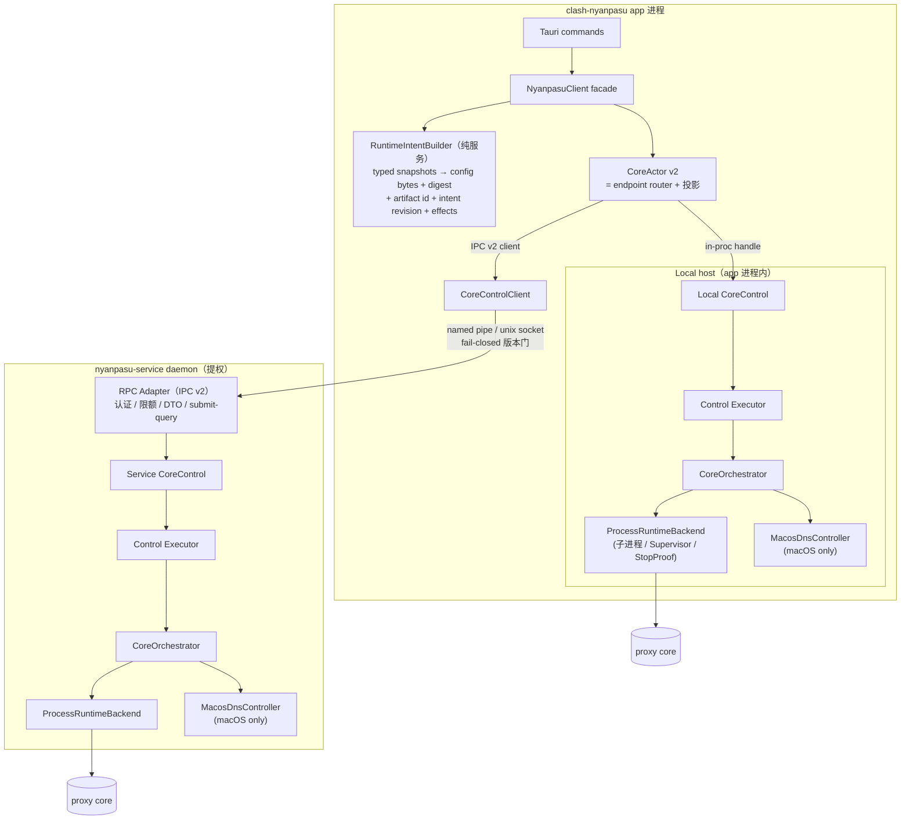
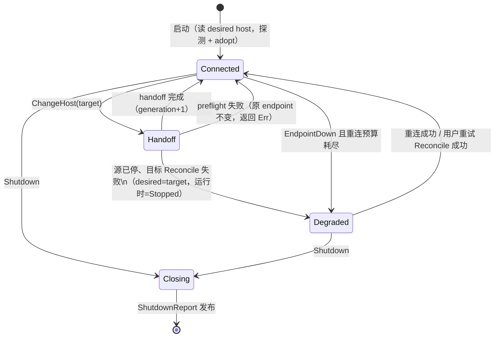
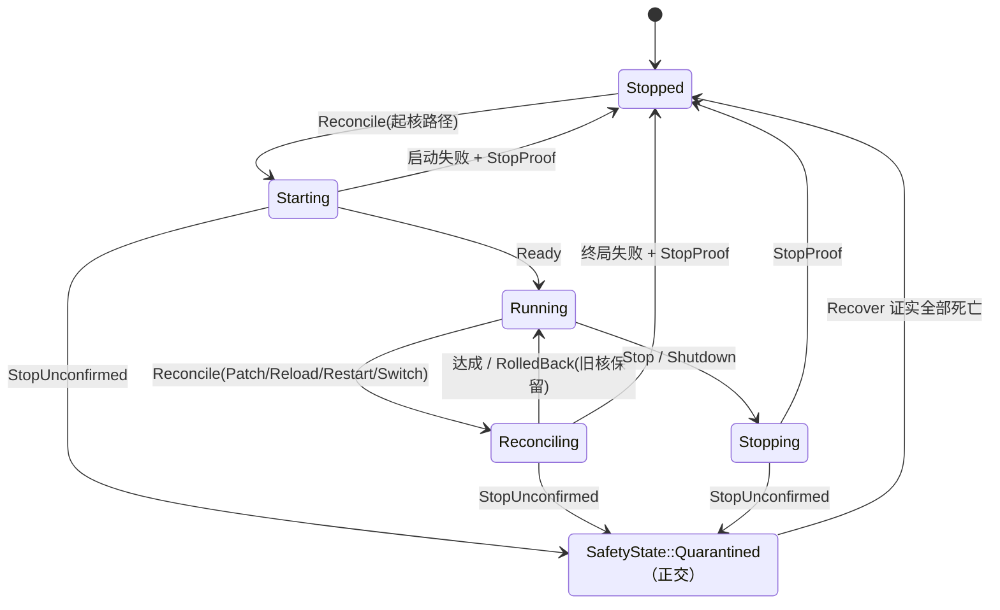
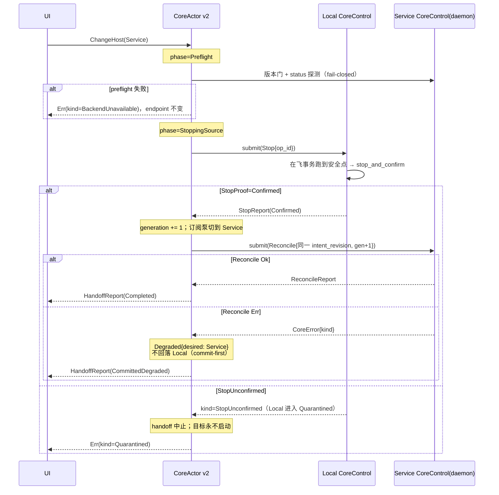
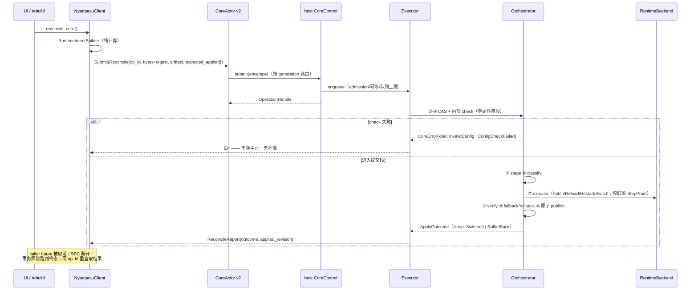
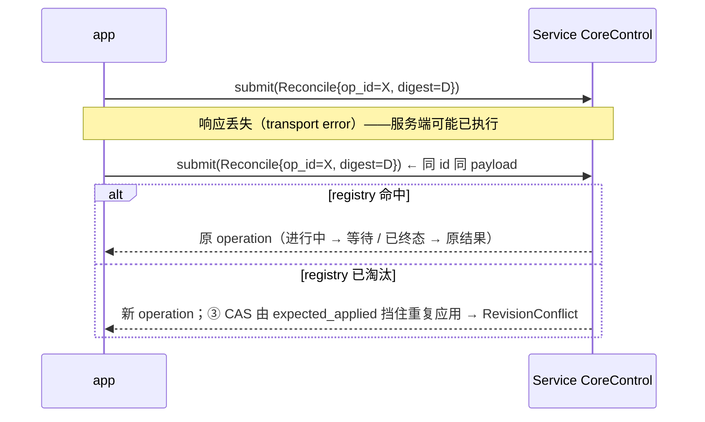
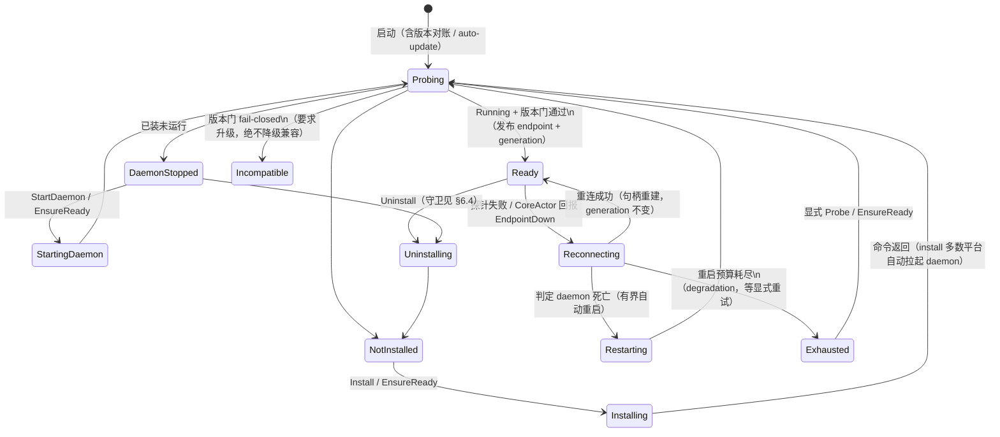
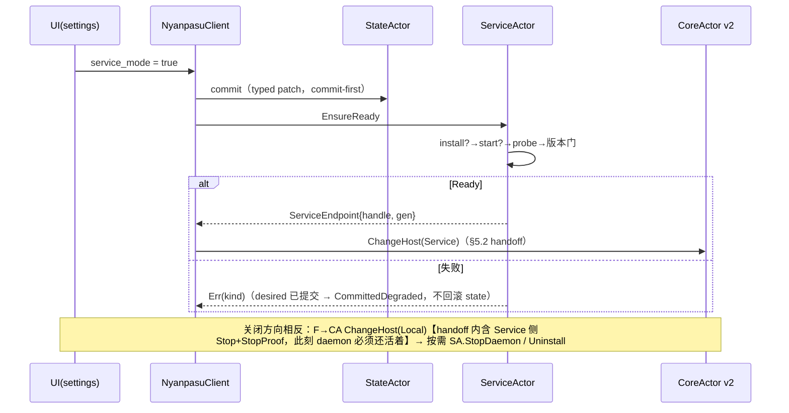
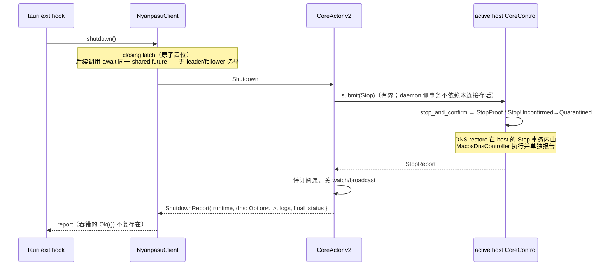

# CoreActor v2 与控制面集成设计（app 侧）

- **日期**：2026-08-12
- **状态**：Design / Adopted direction（PR-C/PR-D 的规范基础）
- **仓库**：`libnyanpasu/clash-nyanpasu`（app 侧）；控制面本体见 `2026-08-08-core-manager-control-plane-runtime-backend-design.md`（含 2026-08-12 修订记录，下称"控制面设计"）
- **裁定来源**：`docs/audit/2026-08-12-core-actor-audit-verification.md`
- **一句话**：CoreActor 从"生命周期与事务所有者"降格为 **endpoint 路由 + 状态投影**；生命周期真相、事务、补偿、quarantine 全部只存在于各 host 的 `CoreControl`（Local = app 进程内嵌，Service = daemon 进程内）。

---

## 1. 角色再定义

|               | 旧 CoreActor（5a/5b 形态，已否决）                                                                     | **CoreActor v2**                                                    |
| ------------- | ------------------------------------------------------------------------------------------------------ | ------------------------------------------------------------------- |
| 生命周期真相  | 自持（`running`/`CoreStatusView`/`FaithfulLifecycle` 三份影子）                                        | **不持有**。转发 host `CoreControl` 的 canonical `CoreStatus`       |
| 事务          | caller 持租约跨 check/promote/apply/run 多步                                                           | **不参与**。一次 `submit(Reconcile)`，事务由 host executor 独占     |
| Local/Service | `CoreBackend` enum 变体互换（`replace_backend`）                                                       | **两个对等控制器**之间的显式 handoff                                |
| 拥有的状态    | backend 槽位、revision 影子、latch、hint                                                               | **仅**：活跃 endpoint、`ControllerGeneration`、订阅任务、投影 watch |
| 消息面        | Check/PublishPromoted/ApplyPromoted/PublishApplied/Run/Stop/SetBackend/RefreshStatus/RunningIdentity/… | **4 条**：Submit / ChangeHost / EndpointEvent / Shutdown            |

删除清单与保留资产以审计报告 §4 为准，本文不重复。

---

## 2. 总体拓扑



要点：

- **同一套 `CoreControl` 实现两处实例化**。Service 不是 backend 变体，是"另一台完整控制器 + RPC host"（审计 §2.3；复核证据：旧模型下双核并存无任何状态可表达）。
- app 只在两个位置感知 Local/Service 差别：CoreActor 的 endpoint 槽位、以及 handoff 协议。事务语义两侧逐字相同——contract tests 同一套跑两个 host。
- `RuntimeIntentBuilder` 是纯服务：从 typed snapshots 派生 intent，无 I/O、无全局读；`RunType::default()` 一类隐式输入随之消灭。

---

## 3. CoreActor v2 对外接口

### 3.1 Facade 面（Tauri commands 唯一入口）

```rust
impl NyanpasuClient {
    /// 唯一的运行时收敛入口：build intent → submit(Reconcile) → 等待或返回句柄。
    /// 覆盖旧 start / restart / apply / change-core 四条路径。
    pub async fn reconcile_core(&self) -> Result<ReconcileReport, CoreError>;

    /// 换核 = 携带新 artifact 的 Reconcile，无专用事务。
    pub async fn update_core(&self, core: CoreArtifactId) -> Result<ReconcileReport, CoreError>;

    pub async fn stop_core(&self) -> Result<StopReport, CoreError>;
    pub async fn recover_core(&self) -> Result<RecoverReport, CoreError>;

    /// 显式 Local↔Service 所有权转移（§5）。
    pub async fn change_execution_host(&self, host: ExecutionHost)
        -> Result<HandoffReport, CoreError>;

    /// 咨询性校验（§0 降格裁定）：只读、限并发、非任何 change 的前置门。
    pub async fn check_config(&self, input: ConfigInput) -> Result<CheckReport, CoreError>;

    /// watch 同步读，零 mailbox。
    pub fn core_status(&self) -> CoreStatusProjection;
    pub fn subscribe_core_events(&self) -> CoreEventStream;

    /// 结构化关停（§7）；幂等，followers 等待同一 shared future。
    pub async fn shutdown(&self) -> ShutdownReport;
}
```

调用方错误处理**只依据 `CoreError.kind`**（R0 的 typed `CoreErrorKind`，控制面设计 §25 + 修订 A4）；`message` 仅供展示。

### 3.2 Actor 消息面（内部，`CoreClient` 包装）

```rust
enum CoreActorMessage {
    /// 转发到活跃 endpoint。经 mailbox 是为了与 ChangeHost 串行——
    /// handoff 期间不可能有 submit 落到错误的 host（构造性，非门禁）。
    Submit {
        envelope: CoreCommandEnvelope,          // operation_id + Reconcile/Stop/Recover
        reply: RpcReplyPort<Result<OperationHandle, CoreError>>,
    },
    ChangeHost {
        target: ExecutionHost,
        reply: RpcReplyPort<Result<HandoffReport, CoreError>>,
    },
    /// 订阅泵回注：来自活跃 endpoint 的 status/event 帧。
    /// 携带 generation，stale 帧直接丢弃（§5.3）。
    EndpointEvent { generation: ControllerGeneration, event: CoreEventEnvelope },
    /// 连接丢失：进入重连；期间 Submit 返回 kind=BackendUnavailable（retryable）。
    EndpointDown { generation: ControllerGeneration },
    Shutdown { reply: RpcReplyPort<ShutdownReport> },
}
```

**没有**的东西即设计：无 Acquire/Release、无 guard 校验、无 Run/SetBackend、无 RefreshStatus/RefreshHint——status 由 endpoint 推（Local: watch 直连；Service: event stream + gap 时重读 `/v2/core/status`），读取无副作用。

### 3.3 Actor 状态

```rust
struct CoreActorState {
    endpoint: EndpointSlot,
    generation: ControllerGeneration,       // 单调，app 侧分配（OQ-1）
    status_tx: watch::Sender<CoreStatusProjection>,
    events_tx: broadcast::Sender<CoreEventEnvelope>,
    subscription: Option<JoinHandle<()>>,   // 每个 endpoint 一条泵任务，换 endpoint 时 abort+重建
}

enum EndpointSlot {
    Connected { host: ExecutionHost, control: EndpointHandle },
    HandingOff { from: ExecutionHost, to: ExecutionHost, phase: HandoffPhase },
    Degraded { desired: ExecutionHost, reason: CoreError },   // 不偷偷回落（§5.2）
}

enum EndpointHandle {
    Local(CoreControlHandle),        // in-proc
    Service(CoreControlClient),      // IPC v2
}
```

注意与旧设计的对照：`CoreStatusProjection` 是 host `CoreStatus` 的**逐字段投影**（前端 DTO 裁剪），不是第二份真相——没有任何字段由 CoreActor 自行推导。

---

## 4. 内部状态机

### 4.1 CoreActor（路由层）



不变量：

- **I-R1**：任一时刻至多一个 `Connected` endpoint；`HandingOff` 期间 Submit 返回 `kind=OperationConflict("handoff in progress")`（retryable）。
- **I-R2**：`Degraded` 是诚实终态而非过渡遮掩——commit-first：desired host 已提交，运行时未达成，绝不静默改回 Local（对应旧 5d "fail-open-to-Local" 语义的**废除**；用户可见 degradation + 显式重试）。
- **I-R3**：路由层**永不**合成生命周期状态。`synthetic_stopped` 一类构造在 v2 无对应物；投影 watch 只发布来自 host 的 `CoreStatus`（P0-2 的结构性修复）。

### 4.2 Host 内 Orchestrator（真相层；控制面设计 §18，此处含 safety 正交轴）



`Quarantined` 期间一切 mutating 命令返回 `kind=Quarantined`；这是 P0-1"旧核失控仍装新 backend"的结构性修复——**没有 StopProof 就没有下一任 owner**。

---

## 5. 与 nyanpasu-service 的关系

### 5.1 契约

| 维度   | 规定                                                                                                                                                          |
| ------ | ------------------------------------------------------------------------------------------------------------------------------------------------------------- |
| 层次   | service = **CoreControl 的 RPC host**（认证/限额/DTO/submit-query），不是 runtime backend                                                                     |
| wire   | IPC **v2 only**（`/v2/core/*`，控制面设计 §19.3）；v1 删除（修订 A1）；**协议版本 fail-closed 门保留**——版本不匹配 → 拒绝 + 要求升级，绝不降级兼容            |
| 错误   | 全部经 typed `CoreErrorKind`（R0 #390 基线 + 扩展 kind）；禁止字符串嗅探                                                                                      |
| 事务   | daemon 内 executor 拥有 operation；**app 断线/退出不取消事务**（控制面设计 D6/G6）                                                                            |
| 幂等   | 响应丢失 → 同 `OperationId` 重查/重发，daemon 从 registry 返回原结果（替代 5×250ms 盲重试）                                                                   |
| 状态   | daemon `CoreStatus` 是 Service host 唯一真相；event 是增量提示，seq gap → 重读 status                                                                         |
| 生存期 | daemon 生存期 ⊃ app 生存期。app 重启后 reconnect + **adopt**（读 status、恢复订阅、对账 generation），不重建事实                                              |
| DNS    | Service 模式的 DNS 覆写由 **daemon 内 MacosDnsController** 在其 orchestrator 的 start/stop/handoff 固定阶段施加/恢复；app 侧零 DNS 职责（S1–S4 接缝的消灭点） |

### 5.2 Local↔Service = 显式 handoff（不是 SetBackend）



对应审计 §六时序的九步收敛；`ControllerGeneration` 的用途恰好三个：stale 事件过滤（§3.2）、拒绝双 owner（host 拒收旧 gen 的 mutating 命令）、handoff 原子推进标记。它与 `OperationId`（一次命令）、`RuntimeInstanceId`（一个 runtime）、`ConfigRevision`（一份配置）互不混用。

### 5.3 Reconcile 事务（直接 change + 内部 check + error_kind）



### 5.4 响应丢失的幂等恢复（替代盲重试）



两层兜底（registry + CAS）保证"至多生效一次"；`RevisionConflict` 时 app 重读 status 对账即可。

---

## 6. ServiceActor —— daemon 作为被管理资源（2026-08-13 增补）

`CoreControl` 运行在 daemon **里面**，管不了 daemon 自己的安装与存活——这层职责必然留在 app 侧，且按 CLAUDE.md §8 分类只能是 actor：长生命周期可变状态（安装/运行/版本/兼容/连接句柄）+ 后台任务（健康观察、重连）+ 必须串行的提权外部命令（install/uninstall 不可交错）。现状反例（refactor/core-manager-actor @ 2a247cca 核实，2026-08-13）：`core/service/ipc.rs:28-30` 三个进程级 statics（`IPC_STATE`/`KILL_FLAG`/`HEALTH_CHECK_RUNNING`）、`control.rs:101,229,324` 三处裸 `spawn_health_check`、七个自由函数入口、`utils/init/mod.rs:251` 游离的启动期 auto-update——全部被 ServiceActor 吸收。

### 6.1 职责边界

| 拥有                                                                                                                                                         | 不拥有                                                    |
| ------------------------------------------------------------------------------------------------------------------------------------------------------------ | --------------------------------------------------------- |
| daemon 安装/卸载/启动/停止/更新（mailbox 串行；提权命令逐条有界 await，子进程本身不可取消——如实记录，5d R4/R5 残余的延续）                                   | **核生命周期**（`CoreControl` 的，永不越界）              |
| 健康/兼容观察循环：探针**自带 timeout**（5d 存活资产 `OsServiceProbe` 语义）；fail-closed 版本门在此评定（5-pre `ServiceCompat` 资产迁入）                   | `CoreStatus` 真相（不做第二份投影）                       |
| `CoreControlClient` 句柄的构造/验证/重建——**Service endpoint 的供给者**，经 watch 发布 `(handle, generation)`，CoreActor 只消费（§2 图中 RPCC 的存活归此处） | 路由决策（CoreActor 持句柄路由）                          |
| 启动期版本对账（**保留**"版本落后自动 `update_service()`(UAC)"既有产品语义）                                                                                 | DNS（各 host 的 `MacosDnsController`）                    |
| daemon 死亡的**有界自动重启 + 耗尽 latch**（镜像 5a recovery-exhausted：预算耗尽 → degradation → 等显式重试）                                                | desired state（commit-first，desired 只来自 state actor） |

### 6.2 状态机



### 6.3 消息面与投影

```rust
enum ServiceActorMessage {
    /// 幂等收敛到 Ready：按需 install → start → probe → 版本门。
    EnsureReady { reply: RpcReplyPort<Result<ServiceEndpoint, CoreError>> },
    Install     { reply: RpcReplyPort<Result<(), CoreError>> },
    Update      { reply: RpcReplyPort<Result<(), CoreError>> },
    Uninstall   { reply: RpcReplyPort<Result<(), CoreError>> },   // 守卫见 §6.4
    StartDaemon { reply: RpcReplyPort<Result<(), CoreError>> },
    StopDaemon  { reply: RpcReplyPort<Result<(), CoreError>> },
    Probe       { reply: RpcReplyPort<ProbeOutcome> },            // 显式探测；探针自带 timeout
    EndpointDown { generation: ControllerGeneration },            // CoreActor 回报
}

/// watch 投影（UI 设置页 + CoreActor 消费）；daemon 状态 ≠ 核状态。
struct ServiceHostStatus {
    install: InstallState,            // NotInstalled | Installed | Installing | Uninstalling
    daemon:  DaemonState,             // Stopped | Starting | Ready | Reconnecting | Exhausted
    compat:  ServiceCompat,           // Compatible{version} | Incompatible{..} | Unknown
    endpoint: Option<(CoreControlClient, ControllerGeneration)>,
}
```

### 6.4 与 CoreActor 的编排（config 驱动；desired 由编排送达而非 watch 订阅）

desired 不由 ServiceActor 订阅 config watch 自取——否则它与 handoff 抢同一事件（5d/5e 跨文档矛盾的成因正是两个所有者并发响应同一变更）。commit-first 之后由 facade 编排显式定序：



- **Uninstall 双层守卫**：①编排定序（只有 handoff 完成后才可达）；②SA 自查 daemon status 无 owned runtime，违反 → `Err(kind=AlreadyRunning)`。卸载不可逆，两层都过才发提权命令。
- **编排非原子，如实声明**：步骤间崩溃留下的是**良性状态**（daemon 装好且 idle、host 仍 Local），无损坏、无双 owner，下次 reconcile 收敛——不为此加补偿事务。
- app 关停时 SA 只需停观察循环（自身无外部副作用），在 CoreActor 之后关闭。
- 移动端对应：SA 是桌面专属 Host Adapter 组件；Android/iOS 的对应物是 `VpnService` / Packet Tunnel Provider host 胶水，不复用。

### 6.5 吸收的现状代码

| 现状（本分支核实）                                                        | 去向                                                               |
| ------------------------------------------------------------------------- | ------------------------------------------------------------------ |
| `control.rs` 七入口（install/update/uninstall/start/stop/restart/status） | SA 消息面（mailbox 串行替代 5d 的 facade `ControlAdmission` 设想） |
| `ipc.rs:28-30` 三 statics + 三处 `spawn_health_check`                     | SA 内部状态 + 单一观察循环（statics 删除）                         |
| `utils/init/mod.rs:251` 启动 auto `update_service()`                      | SA 启动期对账（产品语义保留）                                      |
| 5-pre `ServiceCompat` fail-closed 门                                      | SA compat 评定（版本门唯一实现点）                                 |
| 5d `OsServiceProbe`（探针内部有界）                                       | SA 探针                                                            |

---

## 7. 关停（结构化，无选举）



- 取代旧 `ControlAdmission` + leader/follower + `Notify` 选举 + 多文档预算求和的全部机制：**shared-future 幂等**天然无丢唤醒（followers await 同一 future，不经 `Notify` 注册窗口）；剩余步骤幂等，重跑无害。
- Service 模式默认行为維持现状：app 退出停核、daemon 存活（OQ-2 留给产品裁定"退出保活"选项）。
- 有界性由**每个外部 I/O 自带 deadline** 组合而成（控制面设计 §17.6），不再有跨文档预算算术。

---

## 8. DNS 归属（app 侧视角）

- app 进程**零 DNS 职责**。`MacosDnsController` 各 host 一份，在其 orchestrator 的固定阶段被调用（start 尾部施加 / stop 头部恢复 / handoff 的源 Stop 内恢复）。
- 记录形态按审计 §三：`DnsOverrideRecord{interface, previous, applied, owner_generation, runtime_epoch, state}`，host 持久化 + 启动 orphan reconcile；apply/restore 一律 read-back 推进，`Err` 不推断副作用缺席。
- 机制层（`networksetup` 值比较 vs `scutil` `State:` 键结构性归属）是该组件内部实现选择，由 Phase-0 spike 决定（验收判据：写键后 `scutil --dns` 首选解析器变更；删键后恢复；重启后键不存在）。接口不受影响。
- Local 模式的写权限问题（非 admin 账户）继承自 5e §9 的分析，作为 `MacosDnsController` 的已知限制记录（OQ-3）。

---

## 9. 开放问题

| #    | 问题                                                                                                             | 现状                                                                                    |
| ---- | ---------------------------------------------------------------------------------------------------------------- | --------------------------------------------------------------------------------------- |
| OQ-1 | `ControllerGeneration` 的分配与持久化（app 侧单调计数是否够；daemon 重启后 gen 对账）                            | 第一阶段：app 分配 + 双方内存持有 + status 暴露；跨重启审计留待 durable ledger 需求出现 |
| OQ-2 | Service 模式 app 退出是否停核（现行为：停）                                                                      | 默认保留现行为；"退出保活"作为产品选项另议                                              |
| OQ-3 | Local 模式 macOS DNS 写权限（非 admin 静默失败）                                                                 | `MacosDnsController` 已知限制；若产品裁定"TUN DNS 需要 Service"则整块消失               |
| OQ-4 | daemon 重启丢 operation registry                                                                                 | 第一阶段接受：status 为事实源 + CAS 兜底（§5.4）                                        |
| OQ-5 | `check_config` 咨询命令的前端入口保留范围                                                                        | 仅 profile 编辑器"验证配置"；不接任何自动化路径                                         |
| OQ-6 | ServiceActor 自动重启预算（次数/退避/耗尽判据）与观察循环形态（保留轮询 vs 改 daemon event stream + 断连才探测） | 数值随 PR-D 计划定；v2 事件流可用后倾向后者                                             |
