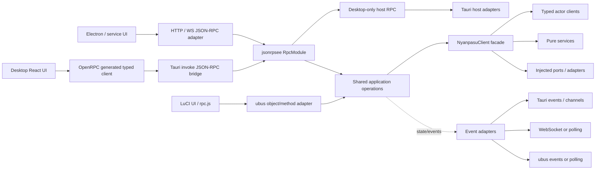

# 软件内部 RPC 与 Tauri IPC 解耦设计

**日期：** 2026-09-24
**状态：** 研究方案；OpenAPI 对照 probe 与 JSON-RPC/OpenRPC internal RPC probe 已完成，OpenRPC 进入首选验证路线，尚未接入生产 API
**范围：** 首要目标是在不破坏既有 Tauri command/event 契约的前提下，建立不依赖 Tauri 的软件内部 RPC/application API，并把 Tauri IPC 作为一个 transport 接入。HTTP/WebSocket、Unix socket、Electron 和 OpenWrt/LuCI 是后续可能评估的 transport/host，不属于当前 probe 的实现目标或验收条件。

## 1. 结论摘要

当前最合适的方向不是先把现有 command/event 原样搬进某个框架，而是先把应用操作和领域事件从 Tauri 边界抽出来，再选择内部 RPC contract 和 dispatcher。当前 probe 只验证 Rust RPC core、OpenRPC contract 和 Tauri IPC adapter 的接缝。

建议目标：

1. 将可复用能力收敛到 Tauri-free 的 NyanpasuClient 应用 facade、typed actor clients、pure services 和 ports。
2. 旧 Tauri bindings 继续由 Specta 维护；新 API 以 OpenRPC/JSON Schema 为契约来源，Rust DTO 的生成或 Serde 兼容验证必须与该 spec 对齐。
3. 将 **JSON-RPC 2.0 + OpenRPC** 作为当前首选验证路线：`openrpc.json` 做唯一契约，jsonrpsee 手动注册方法并做 method-list drift 检查；不采用 Rust API 注解生成契约的路线。
4. 第一版新增统一 JSON-RPC dispatcher 和 Tauri IPC adapter，保留旧 commands、旧 events、旧 hooks 和旧 bindings；新旧调用共享 Tauri-free application operations/streams。
5. 当前阶段先证明 commands 与领域 events 都能脱离 Tauri handler/sink，并经内部 JSON-RPC 核心调用。HTTP/WS、UDS、Electron、OpenWrt/LuCI 暂作未来可替换 transport 的评估方向，不做本轮验收。
6. 窗口、托盘、剪贴板、对话框、通知、快捷键、桌面更新器等仍属于 Host API；本轮事件 probe 只覆盖共享领域订阅，不把桌面生命周期信号强行塞入内部 RPC。

**当前判断：** JSON-RPC/OpenRPC 路线适合作为内部 RPC 候选，贴近现有 command 语义，也绕开 Utoipa 的 handler/type 标注。当前 probe 已验证 unary in-process dispatch、jsonrpsee subscription、Tauri Channel-shaped forwarding、前端 Channel wrapper 和 unsubscribe 生命周期。它尚不是生产 Tauri command，也未接入真实 `NyanpasuClient`。OpenRPC 官方 TS generator 需要小型后处理且不生成 subscription lifecycle；生产前应优先评估项目自有的轻量 client/template。

OpenAPI + Axum + Utoipa + Orval 保留为已验证对照路线；其 spec/client/hooks 生成更顺手，但需要在 Rust handler 上维护 API 标注，和用户希望避免重复契约声明的偏好不符。下一步先按 contract-first OpenRPC 深化真实 application operation 和领域订阅，验证 DTO schema、Tauri IPC adapter 和取消生命周期后再评估是否定案。不要依赖 openrpsee 成为硬架构前提，也暂不引入 ConnectRPC/Protobuf 的迁移成本。

## 2. 现状基线

调查对象是当前仓库：

- backend/tauri/src/ipc.rs 当前检索到约 101 个 tauri::command。它们既有配置、profiles、proxies、runtime 等应用功能，也有桌面宿主操作。
- backend/tauri/src/specta_export.rs 通过 Tauri-Specta 收集 commands/events，并以 tauri_specta_query::CommandSet 生成 React/TanStack Query 相关 bindings。
- frontend/interface/src/ipc/bindings.ts 直接调用 Tauri invoke 和 events。现有生成层不只有 DTO，还包括函数包装、错误包装、query/mutation options 和事件绑定。
- frontend/nyanpasu 还直接使用 Tauri clipboard、dialog、fs、notification、process、updater 等插件。按本轮目标，这些 JS plugin 调用需要移出前端，转成后端 IPC 能力；LuCI 暂不实现剪贴板、文件选择和确认框。
- 前端另有 `@tauri-apps/api/event` 与 `webviewWindow` 调用，它们不是 plugin 包，但也不能直接复用于 LuCI；窗口交互要成为桌面 host adapter，事件需按 Tauri Channel 与 LuCI polling/ubus events 分别适配。
- NyanpasuClient 和 composition root 仍位于 backend/tauri；需核实其中 Tauri runtime 使用和真实依赖图，才能建立非 Tauri 启动路径。
- nyanpasu-ipc 已用于 GUI/client 与后台 service 的 HTTP/JSON 通信，并覆盖命名管道/类 Unix socket 和 WebSocket events。它偏 service-control，不等同于整套前端应用 API。

当前插件调用边界初步盘点：

| 现有前端能力      | 当前代码用途                                              | 桌面迁移边界                                                               | LuCI 首版                            |
| ----------------- | --------------------------------------------------------- | -------------------------------------------------------------------------- | ------------------------------------ |
| clipboard-manager | 上下文菜单、core secret、system service 控制中的复制/粘贴 | 独立 `desktop.v1.clipboard.*` IPC host methods，由 Tauri Rust adapter 实现 | 按用户决定不支持                     |
| dialog            | profile 删除确认、profile editor 确认、tray icon 文件选择 | `desktop.v1.dialog.*` IPC host methods；返回仅限必要结果                   | 确认框与文件选择不支持               |
| fs                | file drop 读取用户拖入的文本文件                          | 桌面 IPC 请求后由 FS adapter 读取；限定允许路径/大小                       | 本地文件读取/选择不支持              |
| notification      | `utils/notification.ts` 的用户通知                        | 桌面 IPC host method；是否需要应用层通知事件另行定义                       | 尚未纳入 LuCI API                    |
| process           | tray 菜单与 about 页面重启桌面应用                        | 桌面 IPC host method，限于 Tauri 启动环境                                  | 不适用                               |
| updater           | 桌面应用更新检查/下载/安装                                | 桌面 updater adapter，不作为共享 domain RPC                                | OpenWrt 软件包升级另行走系统维护流程 |
| os、shell         | package.json 声明；当前源码未检索到 plugin import         | 生产移除前通过完整构建与动态加载再确认可删                                 | 未纳入 LuCI API                      |

目标是去除前端 `@tauri-apps/plugin-*` 直接调用，不是把所有插件统一塞进共享业务 RPC。desktop host methods 可复用同一 invoke JSON-RPC transport，但只由桌面构建注册；新 LuCI client 不公开这些方法。前端 Tauri window/event 使用也要从页面业务代码隔离，但它们不等同于本轮 plugin removal。

所以 command 迁移不能只是给旧函数加 wrapper。新入口必须调用 Tauri-free 应用操作；含 AppHandle、窗口、全局配置或直接 plugin 调用的旧 command 要先拆分应用职责与 Host API。前端仅保留一个低层 Tauri `invoke` host transport；Tauri plugin 能力需在后端适配，不能由应用 RPC 暴露任意插件调用。

## 3. 先区分协议、描述标准、实现和 client generator

| 层                     | 候选                                     | 作用                                                             | 是否解决全部目标                                                          |
| ---------------------- | ---------------------------------------- | ---------------------------------------------------------------- | ------------------------------------------------------------------------- |
| wire protocol          | JSON-RPC 2.0                             | 定义 request/response/error envelope 和 method 调用              | 不定义项目 API schema，也不提供 Tauri/ubus adapter                        |
| RPC API 描述           | OpenRPC                                  | 描述 JSON-RPC methods、参数、结果、错误和 API 信息；JSON 格式    | 不实现 Rust server，也不保证任意 generator 都生成合适的 client            |
| Rust method dispatcher | jsonrpsee                                | 实现 Rust JSON-RPC methods；可与 HTTP/WS server feature 分开使用 | 不自带项目专用 TS client、React Query hooks、UDS listener 或 ubus adapter |
| DTO 类型导出           | Specta                                   | Rust 类型导出到 TypeScript                                       | 不等同于 method catalog、OpenRPC spec 或完整 client                       |
| transport/client       | Tauri bridge、HTTP/WS、UDS、ubus adapter | 把具体平台消息接到共享应用操作                                   | 每类边界仍需实现和安全设计                                                |

OpenRPC 与 OpenAPI 的关系是“JSON-RPC 接口描述标准”与“HTTP API 描述标准”的对应关系。OpenRPC 可以以 openrpc.json 存档或由 rpc.discover 返回；其官方工具包括 TypeScript client generator 和 JSON Schema typings。规范本身不强制 contract-first 或 code-first。OpenRPC 官方规范：[OpenRPC Specification](https://spec.open-rpc.org/)。

## 4. 候选比较

| 方案                                | 机器可读 spec / client generation                                                                                  | Rust + TS                                                                | Tauri IPC                                                                                                            | UDS                                                             | LuCI/ubus                                   | 本项目评价                                                                                                                                |
| ----------------------------------- | ------------------------------------------------------------------------------------------------------------------ | ------------------------------------------------------------------------ | -------------------------------------------------------------------------------------------------------------------- | --------------------------------------------------------------- | ------------------------------------------- | ----------------------------------------------------------------------------------------------------------------------------------------- |
| **jsonrpsee + OpenRPC**             | OpenRPC 描述 methods/params/results/errors；官方 generator 可生成 TS method client，但需对点分隔 method 名做后处理 | Rust handlers 手动注册；DTO/schema 一致性需 contract-first 校验          | 单一 invoke bridge 传完整 JSON-RPC envelope；自定义 transport 已在 P0 跑通                                           | 仍需 UDS adapter 或复用 nyanpasu-ipc                            | ubus adapter 调用共享 application operation | **当前首选验证路线**；避免 Rust handler 注解，但 generator 与事件适配不是开箱即用                                                         |
| **OpenAPI + Axum + Utoipa + Orval** | Axum route metadata 生成 OpenAPI JSON；Orval 从 OpenAPI 生成 TS models/client、React Query hooks                   | Rust handler/DTO 与 TS 生成链完整；Rust DTO 需 `ToSchema` 等 schema 注解 | 没有官方 Tauri transport；可用自定义 mutator + invoke bridge，或在 Rust 内直接 dispatch Axum/Tower request，均需验证 | HTTP server 可绑定 UDS，但不是自动配置；也可复用现有 IPC 作代理 | 仍需 ubus adapter                           | 当前最强的 spec/client-generation 替代路线；HTTP API 生态最好，但接口需建模成 HTTP resource/action，而不是 JSON-RPC method                |
| **Aide + Axum + Orval**             | Aide 提供 Axum API-aware router 并生成 OpenAPI；同样可接 Orval                                                     | 类似 Utoipa，但使用 Schemars/OperationInput/Output 契约                  | 同上                                                                                                                 | 同上                                                            | 同上                                        | 是 Utoipa 的真实替代品；两者选一个即可。Utoipa 更贴近仓库自带 axum 的路由组合方式；Aide 可作为 spike 对照，避免同时采用两套 schema derive |
| **ConnectRPC + Protobuf**           | `.proto` 是契约；Connect/gRPC/gRPC-Web Rust runtime、反射和 TS client 代码生成；TS 可接 Connect-Query              | Rust/TS 代码生成一体化，不依赖手写 Specta method catalog                 | 无标准 Tauri transport；需将 Connect HTTP request 映射到 invoke/内部 Tower service                                   | 需 HTTP/2/UDS listener 或自定义 adapter                         | 仍需 ubus adapter                           | 若能接受 Protobuf 成为唯一契约，类型/客户端生成最一致；connect-rust 仍处于 pre-1.0，且迁移成本高                                          |
| **oRPC + Rust**                     | oRPC 的强项是 TS contract-first 与 TS client                                                                       | Rust 实现需要和 TS contract 同步                                         | custom link 可走 invoke                                                                                              | 自定义                                                          | ubus adapter                                | 不适合目前 Rust 为真实实现、Specta 已是类型来源的现状，除非契约所有权转到 TS                                                              |
| **tarpc / quic-rpc + Specta**       | Rust service/client 可类型化；OpenRPC/TS method client 需另补                                                      | Rust 强，TS 需额外生成方案                                               | 自定义 adapter                                                                                                       | 可插拔/自定义                                                   | 需映射                                      | 更适合 Rust-to-Rust IPC；并未减少 TS/LuCI 边界工作                                                                                        |
| **rspc**                            | 曾有 Specta typed API 集成                                                                                         | Rust + TS 曾很契合                                                       | 可适配                                                                                                               | 自行适配                                                        | 自行适配                                    | 上游已标明不再维护，不选作新基础                                                                                                          |

**建议排序：**

1. 深化 contract-first OpenRPC + jsonrpsee，先接入真实 Tauri-free 应用操作并加 schema/wire 兼容校验；OpenRPC 是唯一契约源。
2. 保留 OpenAPI/Orval P0 作为 client/hooks 生成质量对照。若 OpenRPC client 的维护性差于预期，再复盘 OpenAPI，但不以新增 Rust handler 注解作为默认解法。
3. 不把 `openrpsee` 当作必需依赖；jsonrpsee method macro 也会引入 Rust API 定义，和当前避免重复注解的目标冲突。
4. 只有 contract-first OpenRPC 在复杂 DTO 或 hook 生成上无法维持时，再讨论 Protobuf/ConnectRPC 等改变契约所有权的路线。

### 4.1 OpenAPI 路线的关键差异

Utoipa 的 `OpenApiRouter` 将带有 `#[utoipa::path]` 的 Axum handler 注册到路由时同步收集 OpenAPI metadata；`OpenApi` 可以序列化为 JSON。Orval 可以从这份 spec 生成 typed fetch client、models 和 TanStack Query hooks。这条链的优势是 client/tooling 生态较成熟，spec JSON 和 HTTP client 都是广泛采用的形态。

代价是 API 形状要从 `profiles.activate` 一类 method call 设计成 HTTP endpoint，例如 `POST /profiles/{id}/activate`；OpenAPI 不是通用 RPC 描述。Tauri 不应为了复用 HTTP client 而默认启动 loopback listener。可以为 Orval 的 mutator 写 Tauri invoke bridge，或在 Tauri Rust command 内把请求映射成 Tower/Axum `Request` 并进程内 dispatch；这两个方案都不是 Utoipa/Orval 开箱支持。P0 探针已确认进程内 dispatch 和自定义 invoke mutator 可行，完整生产 command、取消/streaming、真实应用错误映射仍需后续验证。LuCI 仍应使用 rpcd/ubus façade，不直接调用 Axum API。

#### OpenAPI P0 探针结果（2026-09-24）

探针位于 `docs/probes/openapi-p0/`，只实现 mock profile 查询和激活，不修改生产 commands、hooks 或 bindings。结果：

- Utoipa-Axum 从已注册的 Axum routes 生成 OpenAPI 3.1 JSON；同一份路由可用 Tower `oneshot` 在进程内 dispatch，无需启动监听端口。
- 新增的 Tauri 形状 bridge DTO（HTTP method、URI、headers、JSON body/response）可将 request 交给同一个 Axum router，并返回 status、headers、body。
- Orval 可从生成的 OpenAPI JSON 产出 TypeScript models、client 和 TanStack Query v5 hooks；自定义 mutator 让生成调用通过注入的 dispatch 执行，Tauri host adapter 再将 dispatch 接到 `invoke("api_dispatch")`。
- 探针覆盖 GET query 参数、POST JSON body、结构化错误、Tauri invoke 类型检查和 TanStack invalidation helper 生成。query invalidation helper 会生成，但 mutation 与 query 的自动关联/失效规则仍需项目自行设计。
- Tauri `invoke` 不支持中断已发出的 Rust command；探针只能在派发前处理 abort signal。大响应使用 JSON/UTF-8 body 并设 1 MiB 限制；streaming/events 仍需独立接口。

这是协议、spec/client generation 和 transport seam 的可行性证明，不代表已接入真实 Tauri command，也不证明当前 `NyanpasuClient` 已能在 Tauri 之外启动。生产集成和 OpenWrt/LuCI 的 ubus adapter、ACL、打包及设备资源仍未验证。详细运行方式见探针 README。

Aide 是另一个 Axum/OpenAPI code-first 方案：提供 API-aware routing 和 OpenAPI 文档构造，但要求 API schema 类型满足其 OperationInput/Output 等约束。项目可在 spike 中比较 Utoipa 的 `ToSchema` derive 与 Aide 的 Schemars/operation 集成，不建议两套文档元数据并存。

### 4.2 其他相关方案的边界

- **`jsonrpsee-ts`：** 从 jsonrpsee RPC trait 生成 `rpckit` schema，并通过 `ts-rs` 导出 TypeScript；它不是 OpenRPC spec generator，也不提供完整的 TanStack Query hooks。需要额外 `ts-rs` 类型 derive，不能自动消除 DTO/API schema 的双重描述。
- **OpenRPC contract-first：** 可以将 `openrpc.json` 作为唯一 spec，官方 generator 可生成 TypeScript client；它规避 Rust trait 到 OpenRPC 的小型工具依赖，但 Rust handlers / DTO 仍需实现和一致性检查。可评估 Typify 从 JSON Schema 生成 Rust DTO，不过复杂 JSON Schema 到 Rust 的映射不是无损转换，必须验证 Serde wire compatibility。
- **Poem + poem-openapi：** 可从 Rust API 定义实现 OpenAPI v3 服务；这意味着引入/改用 Poem HTTP 框架，和项目现有 Axum 依赖相比缺少明显收益，暂不优先。
- **`rspc`：** 类型方向曾与 Specta 很契合，但其上游已明确不再维护。

## 5. OpenRPC 与 Rust 代码的契约工作流

### 5.1 当前采用 contract-first OpenRPC 做下一轮验证

用户明确不希望为 OpenAPI 在 Rust handlers/types 上增加大量 API 标注。基于这个偏好，下一轮以仓库中的 `openrpc.json` 为唯一 API 契约源；Rust 手动注册实现方法，OpenRPC generator 生成 TS method client。Rust registration 不再兼任第二份 schema 定义：测试校验注册方法与 spec 方法集相同，DTO wire shapes 需要单独做 schema validation/兼容测试。

```text
openrpc.json (authoritative)
       ├── TypeScript client generation
       ├── rpc.discover (runtime returns the same document)
       ├── Rust jsonrpsee registration checked against method names
       └── schema/wire compatibility checks
```

**P0 结果（`docs/probes/openrpc-p0/`）：** jsonrpsee 0.26.0 的 `RpcModule::raw_json_request` 可直接对 JSON-RPC envelope 进行进程内 dispatch 和订阅。探针以 `server-core` feature 注册并调用，无需启用 HTTP server；测试确认 method registry 等于 OpenRPC methods、wire response/error、`rpc.discover`、订阅通知与 unsubscribe 均可工作。Rust 侧用 Tokio channel 模拟 Tauri Channel sink；前端 smoke 则实例化真实 `@tauri-apps/api/core` `Channel`，mock Tauri invoke runtime，验证 `rpc_subscribe` 和 unsubscribe 消息形状及 Channel callback 清理。OpenRPC generator 能生成 unary client；subscription lifecycle 由项目 wrapper 补充。探针仍未运行真实 Tauri command，也未接入真实 `NyanpasuClient`。

生成工具目前有明确工程限制：默认 TS 模板把点分隔 method name 写成非法 TypeScript 成员；by-name 参数的 validator 接收形状与其 wrapper 生成的调用形状不匹配。探针通过小型 postprocessor 将成员改为字符串索引并使用 by-position params 后跑通 typecheck/smoke。自定义 transport 还需继承 `@open-rpc/client-js` 未从公共入口导出的内部 Transport 类型，因此这一条不能不加审查地直接提升为生产实现。下一步应比较自有的小型 client/template（生成规范 method wrappers/types，transport 是显式参数）和对官方 generator 的固定后处理；不要将生成器当前原样输出视为可用产物。

OpenRPC contract-first 避免了 Utoipa 风格的 Rust handler/schema 注解，但不会自动同步 Rust DTO。P0 只检查 method names 及代表性 wire response，没有覆盖所有 Serde edge cases。当前仓库仍用 Specta 生成旧 bindings；不把 Specta 再作为新 RPC 的第二份 schema 源。接入真实 DTO 前，需选择从 OpenRPC JSON Schema 生成 Rust DTO，或为典型 payload 加 schema validation 和 Serde serialization tests。

### 5.2 维护与依赖风险判断（截至 2026-09-24）

| 依赖                  | 可观察情况                                                                                                                                                                                                       | 风险判断                                                                                                                                                  |
| --------------------- | ---------------------------------------------------------------------------------------------------------------------------------------------------------------------------------------------------------------- | --------------------------------------------------------------------------------------------------------------------------------------------------------- |
| jsonrpsee             | 最新 release 为 0.26.0（2025-08-11），距离评估日期约 13 个月；但仓库在 2026 年仍有 issue/PR 和 Unreleased changelog 项，README 列出 polkadot-sdk、subxt、Trin 等使用项目；上游仍把 1.0 作为 tracking milestone。 | **中等风险，不能称为弃坑，也不能视为稳定 1.0。** 发布周期偏慢、仍处于 0.x，公开 API 可能在未来 minor release 变化；近期仓库活动和实际采用情况是正面信号。 |
| `@open-rpc/generator` | 当前 probe pin 到 2.1.1（2025-10）；项目体量较小。P0 实际发现点分隔 method 名生成非法 TypeScript、by-name 参数 runtime validation 错配。                                                                         | **客户端生成模板风险偏高。** OpenRPC 文档标准可靠性与生成器可靠性要分开评估；可以继续用标准，但生产可采用项目自有薄 client/template 和生成校验。          |
| openrpsee             | crates.io/docs.rs 有 0.1.1（2026-07-05）；功能专注于 jsonrpsee trait -> OpenRPC metadata / rpc.discover。公开仓库规模很小，且该版本依赖 jsonrpsee 0.24，而本评估时 jsonrpsee 最新为 0.26。                       | **生成链高风险。** 版本并非长期未更新，但项目规模、兼容跨度和用户面不足以支撑把它当成关键构建链依赖；先 spike，暂不作为架构前提。                         |

因此要把协议风险和实现库风险分开：JSON-RPC/OpenRPC 的标准不会因某一个 Rust crate 暂停发版而失效；但 jsonrpsee 0.x 的 API 演进和 openrpsee 的低成熟度会影响工程成本。建议 pin 精确版本、让 crate 类型留在 RPC adapter 内、不给 application facade 暴露 jsonrpsee 类型，并保持替换 dispatcher 的路径。若连续若干发布周期没有 release、CI 修复或维护者响应，再重新评估，而不是仅凭当前 release 间隔判定弃坑。

另有一位参与 jsonrpsee 维护的贡献者在 2026 年 4 月公开表示将离开 Parity 并尝试交接相关工作；这不能证明维护会中断，但应列入 bus-factor / 维护者连续性风险检查。仓库在此后仍有 2026 年 issue/PR 活动。

### 5.3 契约产物与一致性约束

本轮先固定以下数据流：

```text
openrpc.json (authoritative)
       ├── TypeScript client/types
       ├── Rust DTOs or generated schema bindings
       ├── server method registry checks / skeletons
       └── documentation and compatibility diff
```

Rust server handlers 仍须实现，但不需要 Rust server scaffold generator。禁止同时编辑 Rust RPC trait/macro definitions 与 `openrpc.json` 并把二者当作契约真源。每次生成后 CI 应验证生成产物无 diff，并测试 method registry 与 OpenRPC 完全一致；后续还要把 request/result/error JSON 样本对照 schema。OpenRPC JSON Schema 是客户端/文档契约，Serde 是 Rust wire encoding，实现差异必须由测试捕捉。

## 6. 推荐架构



边界约束：

1. NyanpasuClient 是应用 facade，显式持有 typed actor clients、pure services 和 ports；不使用全局 registry 或 Tauri types。
2. RPC handlers 仅解析 request、调用 facade、映射错误和 response；不放业务编排。
3. Tauri bridge、HTTP/WS、可能的 UDS adapter 负责各自 framing、调用者身份和安全边界。
4. LuCI adapter 为 rpcd/ubus 定义 object/method/ACL，映射到共享应用操作。LuCI 的 /admin/ubus 调用模型是 session/object/method/args，不是通用 nyanpasu.v1 method 的直通通道。
5. 共享业务 API 与桌面 Host API 分开建模。前端只经 IPC 调用明确的 `desktop.v1.*` host methods；这些 methods 由 Tauri-only adapter 提供，不加入 LuCI/shared-domain client。LuCI 初版明确不实现用户剪贴板、文件选择和确认对话框。

应用操作可以共享，但不要求不同 transport 的 wire protocol 完全一样。若选择 JSON-RPC，Tauri/HTTP 共用 JSON-RPC API；若选择 OpenAPI，则 Tauri bridge 和 HTTP server 共用 HTTP route contract。LuCI 仍使用 ubus 语义，并通过 adapter 调用共享应用操作。

## 7. 新 API 命名与契约（提案）

共享业务方法名显式、稳定、带版本：

```text
nyanpasu.v1.settings.get
nyanpasu.v1.settings.patch
nyanpasu.v1.profiles.list
nyanpasu.v1.profiles.activate
nyanpasu.v1.core.getStatus
nyanpasu.v1.proxies.select
nyanpasu.v1.logs.openSession
nyanpasu.v1.logs.querySession
nyanpasu.v1.logs.closeSession
```

Tauri-only capability 可在单独的 `desktop.v1.*` 命名空间经同一 IPC bridge 暴露，例如通知、重启桌面进程或桌面文件/更新能力。它们只由 Tauri host adapter 注册；LuCI client 不生成也不调用这些方法。剪贴板、文件选择和确认对话框按当前决定在 LuCI 首版不支持。

- wire method name 显式固定，不依赖 Rust 函数名或宏隐式拼接。
- 这些是逻辑操作示例；若选择 OpenAPI，需将它们重新表达为稳定的 HTTP path/method 和 `operationId`，不能直接把 JSON-RPC method name 填进单一 `/rpc` endpoint。
- 新方法统一使用命名 request DTO 和稳定 response DTO。
- 不暴露 actor message、Tauri State、AppHandle、内部错误或任意 JSON 执行入口。
- 破坏兼容时新增 v2 namespace，不改变 v1 语义。
- JSON-RPC 的 rpc. 前缀保留给系统扩展；rpc.discover 是 OpenRPC 定义的 discovery 方法。
- OpenRPC 文档需为每个 method 提供 summary/description、params/result schema、error codes、examples、deprecated 状态及 tags。
- mutation 用 request/response；已提交但后续副作用失败的操作返回结构化 MutationOutcome，不要让 UI 将它当作“完全没执行”并重复操作。
- 方法权限由 transport 授权决定，不以 client 自报 platform 为准。

## 8. Command 到新 API 的迁移方式

不做机械一对一迁移。先做 inventory，再定义面向产品的 v1 API：

| 旧 command 类别                                          | 新 API 方向                        | 设计检查                                           |
| -------------------------------------------------------- | ---------------------------------- | -------------------------------------------------- |
| config 读取/patch                                        | settings.get / settings.patch      | 核对旧 IVerge wire model 与领域 DTO 的差异         |
| profile 增删改、激活、排序                               | profiles.*                         | 结合 revision、幂等和事务边界决定保留/合并         |
| core 状态和生命周期                                      | core.*                             | 区分桌面 sidecar、桌面 service 和 OpenWrt procd    |
| proxies、provider、Clash API                             | proxies.* / clash.*                | 避免将第三方 core 的所有 endpoint 当作稳定应用 API |
| runtime config/inspection                                | runtime.*                          | 保持不同快照和数据体量的语义                       |
| logs                                                     | logs.*                             | 使用 session、分页或 cursor，避免单次大响应        |
| 窗口、托盘、系统代理、快捷键、dialog、clipboard、updater | Host API                           | 由各平台适配或不支持，不作为 OpenWrt domain RPC    |
| service install/start/stop                               | 平台部署 API                       | 桌面 service 与 procd 不是相同应用操作             |
| webview local storage                                    | 前端 storage 或明确的 settings API | 不把 Tauri webview 存储远程化                      |

inventory 至少记录旧签名/DTO、序列化与错误、所有前端调用、query key/invalidation、副作用/权限、平台依赖、目标方法、迁移决定和新旧 API 共享的应用操作。

首批建议选择一条代表性 unary application operation 和一条代表性 domain stream（当前 probe 用 profile list/activate 与 Clash events）；先验证契约、Rust dispatch、Tauri IPC bridge 与 typed frontend client。不镜像全部约 101 个 commands。外部 transport 暂不参与首批筛选或验收。

## 9. 第一版新旧并行规则

首版对 command/API surface 只做加法：

1. 保留现有 command 名、签名、返回、错误行为、事件名、capability 与生成绑定。
2. 新增 `openrpc.json`、generated client 和新 hooks，不覆盖 frontend/interface/src/ipc/bindings.ts。
3. 仅新增薄 Tauri IPC bridge：`rpc_dispatch` 处理 unary JSON-RPC，`rpc_subscribe` 通过 Tauri Channel 转发 JSON-RPC notifications；它们只负责编解码、stream forwarding 与生命周期，不承载业务逻辑。
4. 新旧入口尽可能调用同一个 Tauri-free application operation；若先抽取内部逻辑，旧 command 外部行为保持不变。
5. 不直接包装旧 command 函数为 RPC handler，避免把 Tauri State/AppHandle 带进新接口。
6. 旧 command/event hooks 第一阶段不迁移。新 client/hooks 先用于一条 vertical slice。
7. 按用户要求移除前端直接使用的 Tauri plugin JS APIs，改调后端 IPC host methods；旧 commands 的弃用/删除另做迁移计划，首版不动。
8. 桌面 Host API 通过后端 adapter 映射到 Tauri 插件/平台 API；LuCI 首版明确不实现剪贴板、文件选择、确认框。该约束不等于把这些操作做成共享 domain RPC。

## 10. TypeScript client、hooks 和事件

当前 Tauri-Specta 生成层不仅生成类型，也提供 command wrapper、query/mutation options 和 events。新接口至少要具备：

- Rust request/response/error DTO 与所选 contract 的 schema 对齐；
- 从 `openrpc.json` 确定的 methods 和输入/输出签名；
- 可重复生成的 TypeScript typed client；
- 传输抽象与 Tauri invoke transport；
- React Query queryOptions、mutationOptions、稳定 query key、invalidations；
- 统一但可区分 transport rejection、JSON-RPC error、业务错误及 degraded mutation；
- 领域事件的 typed subscription client；当前由 Tauri Channel 承载内部 JSON-RPC notification。窗口等 desktop lifecycle signals 保留 Tauri host adapter。其他 transport 后续按需适配。

OpenAPI P0 已验证 Orval 可生成 models/client/TanStack Query v5 hooks，但用户不希望 Utoipa API 注解成为契约维护负担。OpenRPC P0 已生成 method client 并在后处理后接入自定义 transport；它不生成 React Query hooks，也不自动定义 query key、mutation invalidation 或项目错误包装。query/mutation metadata 应随 OpenRPC method metadata 或项目统一模板生成，不得在多个文件重复分类。

保留现有 clash-ws snapshot、sequence 和 gap recovery 语义。加法迁移时旧 Tauri event 暂时保留兼容；新 RPC hooks 改订阅内部 JSON-RPC notification，再由 Tauri Channel 承载 stream。不要让已迁移的通用 hooks 继续直接依赖 Tauri `listen`，也不要把有序高频流降级成不可靠通知。

### 10.1 Event API 与跨宿主边界

现有 Tauri `listen` / `emit` 可以继续用于桌面版，但应封装在 Tauri host 的 `EventClient` adapter 中，不让通用 React hooks 直接依赖 `@tauri-apps/api/event`。它们不是 Tauri plugin，但仍是 Tauri 专属 API。Tauri 官方将事件定义为异步、仅 JSON payload、没有返回值的动态通信机制；长时间或连续数据流推荐使用 Tauri Channel。[Tauri event 与 Channel 文档](https://v2.tauri.app/develop/calling-rust/)

OpenRPC 可以描述无返回值的 JSON-RPC notification，但这通常表达客户端到服务端的一次性通知；它本身不统一服务端主动推送的订阅生命周期、重连/恢复和各宿主的 stream transport。jsonrpsee 有 subscription/pub-sub 能力，`RpcModule::raw_json_request` 也能在进程内返回通知接收流；但跨 HTTP 客户端的实时订阅仍需要有生命周期的连接和 subscribe/unsubscribe 语义。Tauri 单次 `invoke` bridge 不能直接承载一个长期返回流；若 Tauri 侧要复用 jsonrpsee subscription，必须由 host adapter 把该流桥接到 Tauri Channel。这个桥接属于传输实现，不作为通用 OpenRPC contract 的一部分。[OpenRPC notification 描述](https://spec.open-rpc.org/)、[jsonrpsee `RpcModule` subscription 文档](https://docs.rs/jsonrpsee/latest/jsonrpsee/struct.RpcModule.html)

| 现有事件/信号                                              | 建议分类与适配                                                                                                                                       | 迁移约束                                                                                                  |
| ---------------------------------------------------------- | ---------------------------------------------------------------------------------------------------------------------------------------------------- | --------------------------------------------------------------------------------------------------------- |
| `clash-ws-event`（connections/logs/traffic/memory）        | 加法阶段保留旧 Tauri event；新 hooks 调内部 JSON-RPC subscription，Tauri adapter 用 Channel 转发 notification。WS 和 LuCI polling 是未来可选 adapter | 维持当前 sequence、snapshot、bounded buffer 和 gap recovery；不能改成无序、无恢复的 fire-and-forget event |
| `nyanpasu://mutation`                                      | 桌面低频 cache invalidation 可由 host EventClient 转发；同一 UI 内的 mutation 优先根据 mutation response 做本地 invalidation                         | 只有跨窗口/跨客户端状态同步确有需要时，才定义共享的状态 revision/event                                    |
| `storage-value-changed`                                    | 如果指 WebView 本地 KV，留在 browser/desktop storage adapter；如果是后端共享存储变化，再定义 domain event                                            | 不把 Tauri WebView storage event 自动升级为 OpenRPC 方法                                                  |
| `scheme-request-received` 与 pending deep link             | 桌面 deep-link host signal，经 Tauri adapter 转给 UI                                                                                                 | 保留启动时 drain pending request 与去重逻辑；LuCI 没有相同的桌面 deep-link 生命周期                       |
| `window-ready`、window resize/fullscreen、`update_systray` | Tauri window/tray lifecycle signal                                                                                                                   | 只留在 desktop host adapter；不属于共享 API 或 LuCI 事件                                                  |

共享业务 hooks 依赖窄的、按领域类型化的订阅 port，例如：

```ts
interface ClashWsEventClient {
  subscribe(onEvent: (event: ClashWsEvent) => void): Promise<() => void>
}
```

不要先设计一个强行覆盖所有平台的通用 event broker。只有需要断线恢复的 domain stream 才增加 cursor/sequence、snapshot 或 replay contract；平台生命周期事件按各自 host adapter 实现。本阶段只验证 Tauri IPC adapter；若后续做 LuCI，首个版本可用 polling + revision/snapshot，再按实时性需求评估 ubus events。桌面 Host API 和未迁移的旧 bindings 可继续使用 Tauri event API；新的共享领域 hooks 依赖内部 RPC subscription。未来若切换宿主，迁移边界放在 adapter，而不是要求 Tauri event wire protocol 本身跨平台。Tauri 官方将 event system 定位为小数据量推送，并指出高频异步事件处理可能乱序；有序、高吞吐数据推荐 Channel。[Tauri event 与 Channel 文档](https://v2.tauri.app/develop/calling-frontend/)

### 10.2 将领域事件迁移为 JSON-RPC subscriptions

对需要从 Tauri `emit` / `listen` 解耦的领域流，不应将事件改成普通 JSON-RPC call；应定义显式 subscription、notification 和 unsubscribe，并由 Tauri IPC adapter 将通知流交给前端。jsonrpsee 的 `RpcModule::register_subscription` 提供订阅方法、通知方法和取消方法注册；这是 jsonrpsee pub/sub 扩展，不是 JSON-RPC 2.0 基础协议自带的 stream transport。[jsonrpsee subscription API](https://docs.rs/jsonrpsee/latest/jsonrpsee/struct.RpcModule.html)

以 Clash 状态流为例，wire 形状可按下例设计（名称仅为提案）：

```json
{"jsonrpc":"2.0","id":1,"method":"nyanpasu.v1.clash.subscribe","params":{"afterSequence":120}}
{"jsonrpc":"2.0","id":1,"result":"subscription-id"}
{"jsonrpc":"2.0","method":"nyanpasu.v1.clash.event","params":{"subscription":"subscription-id","result":{"sequence":121,"update":{"kind":"log_appended","data":{}}}}}
{"jsonrpc":"2.0","id":2,"method":"nyanpasu.v1.clash.unsubscribe","params":{"subscription":"subscription-id"}}
```

具体迁移约束：

1. **OpenRPC 契约：** 在 `openrpc.json` 描述 subscribe 的参数/返回、server notification payload 和 unsubscribe 参数；OpenRPC 不原生表达“哪一个订阅会产生哪一种通知”及 transport 生命周期，必要时用明确的 `x-` extension 标注关联。当前 TS generator 不负责生成完整 subscription lifecycle，因此需要项目自己的 typed `subscribeClashEvents()` wrapper，或生成器模板扩展；不能只凭已有 unary client 生成结果宣称事件链已打通。
2. **jsonrpsee 实现：** 将 subscribe/notification/unsubscribe 名称显式注册到 `RpcModule`，订阅源从 Clash actor client / 领域 stream 获取，不在 handler 中重新访问全局事件 sink。对进程内 dispatch，可用 `raw_json_request` 得到首个 JSON-RPC response 和后续通知接收流。
3. **Tauri transport：** unary methods 继续走 `rpc_dispatch`。订阅走 Tauri-only 的 `rpc_subscribe` stream adapter：前端建立 Channel，adapter 将 JSON-RPC subscription 的后续 notification envelope 逐条转发到该 Channel；取消前端订阅时必须取消后端 stream/task。Probe 已验证 `raw_json_request(subscribe)` 后通过同一 `RpcModule` 的后续 `rpc_dispatch(unsubscribe)` 可以关闭通知流，并验证前端 `Channel` adapter 的消息与取消形状；Rust 侧使用 Tokio mpsc 模拟 Channel sink，没有执行真实 Tauri `#[tauri::command]`。生产集成仍需核实 native Channel 丢弃/关闭行为和 task 清理。这里的 Channel 只在 transport 层承载 JSON-RPC stream，不需要 `emit/listen`，但 adapter 本身仍依赖 Tauri。
4. **Standalone/Electron transport（未来可选）：** 如后续需要，再在持久 WebSocket JSON-RPC 连接上接入同一组 subscription methods，并验证关闭连接/取消订阅时的清理；这不属于当前 probe。
5. **LuCI transport（未来可选）：** 如后续需要 LuCI，首个实现可用 ubus snapshot/revision polling；之后再评估 ubus event adapter。该适配与当前 Tauri IPC probe 无关。
6. **新旧并行：** 按第一版只做加法，后端暂时同时发旧 Tauri event 与新 JSON-RPC subscription；新 hooks 切到 typed subscription client，并对照 sequence/payload。迁移完成后再单独移除旧事件及 Specta event binding。

此迁移只适用于领域事件。窗口 ready/resize、托盘变化、deep link 等桌面宿主信号即使能放进 `desktop.v1.*` JSON-RPC subscription，也不会因此适用于 LuCI；除非桌面 IPC 统一确有需要，否则保留在 desktop host adapter 更简单。WebView 本地 storage 变化也不应变成后端订阅。

## 11. 后续 transport 备选（非当前 probe 范围）

### Tauri

- JSON-RPC 路线：一次 invoke 携带完整 JSON-RPC 2.0 request（以 JSON string 作为 bridge payload），Rust bridge 交给进程内 jsonrpsee method dispatcher 并返回 JSON-RPC response string。P0 对 request/response 都设 1 MiB 上限；生产值应按日志、配置和代理数据等 payload 评估，subscription stream 使用独立通道。
- 前端应用代码不再直接调用 `@tauri-apps/plugin-*`；Tauri `invoke` 是低层 host transport。每个桌面 plugin capability 需审查能否由 Rust backend adapter 提供，或是否应从共享产品能力中排除。
- OpenAPI 选项：Orval custom mutator 将 HTTP verb/path/query/body 编成一次 invoke；Rust bridge 在进程内调用 Axum/Tower router，或映射到共享操作。该适配不是 Utoipa/Orval 自带能力，需验证其长期维护成本。
- 不默认启动 loopback HTTP server；若采用则需单独评估监听地址、认证、CORS、生命周期与端口占用。
- bridge 的 allowlist/authz 必须显式定义；只有一个 bridge command 不代表所有 methods 都可无条件调用。
- 既有 commands 继续可用。

### HTTP / WebSocket

- JSON-RPC 选项：Electron/浏览器确需直连后端时，将相同 method module 接到 jsonrpsee server。
- 当前进程内 dispatcher 使用 `server-core`，不拉取 HTTP server；启用 HTTP/WS 时再通过 transport feature 添加 listener 依赖。
- OpenAPI 选项：由 Axum 提供 OpenAPI 描述的 HTTP routes，并从同一路由元数据导出/提供 OpenAPI JSON。
- 届时设计认证、origin/CORS、超时、请求大小、并发、地址绑定、事件策略和进程生命周期。
- 默认不监听局域网接口。
- Electron renderer 可经主进程代理；是否运行独立 Rust daemon 是部署选择。

### Unix socket

- jsonrpsee dispatcher 不等于自带 UDS listener；Axum/HTTP over UDS 也需要配置支持 Unix domain socket 的 listener。
- 先评估现有 nyanpasu-ipc 是否能承载或代理应用 API。
- 若必须直接使用裸 UDS，单独定义 framing、最大消息长度、并发、socket 权限/文件模式及错误行为；不要把临时 length-prefix 实现说成标准支持。

### OpenWrt ubus / LuCI

- LuCI 调用 rpcd 暴露的 ubus methods，依赖 session 和 ACL；按 least privilege 定义 method 集。
- 通过 package spike 比较 native ubus binding、rpcd plugin、rpcd 到本地 service adapter 三条路径。
- Rust 操作映射到 ubus object/method；不要求 ubus 暴露 JSON-RPC envelope。
- 状态先用 polling + snapshot/revision；若实时性要求明确再使用 ubus events。
- 单独验证目标 OpenWrt 架构的 Rust toolchain、libc、依赖、内存和存储约束。

## 12. 分阶段实施和验收

### Phase 0：API inventory

盘点所有旧 commands、前端调用点、query/mutation/events、权限、副作用和平台依赖；分成应用操作、Host API、service-control API。

**验收：** 得到候选 v1 method list、排除列表和 command-to-operation 映射。

### Phase 1：标准与生成链 spike

为 OpenAPI、JSON-RPC/OpenRPC（必要时 ConnectRPC）各实现同一组小型可比 vertical slice：一个查询、一个 mutation、一种连续数据场景。先对照契约和 client generation，再比较 transport；不得把只成功生成 DTO 当作整条链已通过。

截至 2026-09-24，OpenAPI P0 已验证 Utoipa spec 导出、Orval client/hooks 生成、Tauri-shaped mutator 和无监听端口 Axum dispatch。JSON-RPC/OpenRPC internal RPC probe 已验证 jsonrpsee unary/subscription in-process dispatch、`rpc.discover`、method registry 对齐、OpenRPC TS unary client、自定义 Tauri invoke transport、前端 Channel subscription wrapper 和 unsubscribe 流程。Rust 侧以 Tokio channel 模拟 Tauri Channel sink，前端使用真实 `@tauri-apps/api/core` Channel 并 mock Tauri invoke runtime；尚未注册真实 Tauri command，也未连接真实 application operation。OpenRPC generator 需要方法名/类型 import 后处理，by-name params 在其 TS validator 中有缺陷；probe 使用 by-position。外部 transport 未实现且不属于当前验收。

- 新旧调用都进入同一 Tauri-free operation；
- JSON-RPC/OpenRPC：已完成 mock unary + subscription slice；下一步接入真实 Tauri-free application operation，验证真实 DTO/schema、参数编码、错误映射、native Tauri Channel 生命周期和新旧 command/event 共用操作；
- OpenAPI 候选：已完成小型 mock slice。后续需用真实 Tauri-free application operation 替换 mock，并验证 command 接线、错误映射、取消和连续数据边界；
- ConnectRPC 候选（若后续重新比较）：`.proto` 可生成 Rust 服务接口和 TS client；评估其 Tauri IPC adapter 成本；
- 通过 schema validation 与实际 request/response 样本校验 generated schemas；
- 量化 TanStack hooks 所需额外模板和维护代码；
- 检查各 generator 输出质量、依赖更新频率、许可证和 build pipeline；
- 暂不做 HTTP、UDS、Electron、LuCI/ubus 或 OpenWrt package 验证；这些需要有明确的后续目标后再单独立项。

**阶段性判断：** OpenRPC/jsonrpsee 优先进入真实调用链验证；这不是最终架构定案。OpenAPI/Orval 作为生成质量对照保留。只允许一个权威 contract source；不能以“已经能生成 DTO 类型”替代 methods 与 TS client 对齐验收。

### Phase 2：Tauri-free application graph

按首批 API 调用链迁移必要应用操作和 composition root，不扩展到无关 command。避免 RPC handler 中直接使用 globals 或 raw ActorRef。

### Phase 3：增量 RPC 发布

发布 v1 allowlist、OpenRPC spec、typed client 和新 hooks；旧 commands/hooks 保持原状，新旧入口共享操作逻辑。

### Phase 4：LuCI/OpenWrt

完成设备 runtime/package/procd、rpcd/ubus adapter、ACL、LuCI host/events，并明确桌面功能不适用范围。

## 13. 风险和决策

- **OpenRPC 有标准，不代表 client generation 细节都成熟：** P0 已发现官方 generator 对点分隔 method 名、by-name 参数和可插拔 Tauri transport 的限制；升级 generator 时需回归后处理脚本，也可改成项目自有薄 client 模板。
- **jsonrpsee 的发布/稳定性：** 截至本文日期，0.26.0 发布已有约 13 个月，仓库仍有后续活动且 v1.0 仍在 roadmap。隔离 crate API、pin 版本，并将升级验证列入依赖维护。
- **Rust/OpenRPC schema drift：** method set 有 P0 registry test；request/result/error schema 和复杂 Serde DTO 仍需更多对照。openrpsee 0.1.1 仍不作为生成前提；契约真源是 OpenRPC 文件。
- **OpenAPI 和 HTTP API 的错配：** Utoipa/Orval 的生成链更成熟，但 OpenAPI 描述 HTTP API。不要为了生成 client 而把 method semantics 塞进单一 `POST /rpc` endpoint；先验证真实 REST/action endpoints 是否自然表达应用操作，以及 Tauri invoke bridge 是否可维护。
- **Tauri 内部 dispatch 并非现成生成器能力：** OpenAPI/Connect generated client 通常发 HTTP 请求。若不启动本地 HTTP listener，须维护自定义 invoke mutator / in-process HTTP adapter；这一层的错误、query 参数、取消和 streaming 映射要实际验证。
- **Protobuf 迁移成本：** ConnectRPC 能把 API/DTO 的生成链做得更一致，但它要求新的 proto contract/source of truth，并带来 Serde/Specta DTO 与现有生成绑定迁移成本；且 connect-rust 当前 pre-1.0。
- **spec drift：** code-first 和 spec-first 二选一作为唯一真源；用 CI 检查产物更新与实际 method 注册。
- **跨 transport 不等于一个 wire 协议打天下：** 共享 application operations；ubus、Tauri IPC 和 HTTP adapter 可保留各自宿主认证/协议。
- **RPC 不自动解耦后端：** 若 application graph 仍依赖 Tauri，增加 OpenRPC 也不能让程序跑在 OpenWrt。
- **前端迁移包括 hooks 和 plugins：** 单一 invoke wrapper 只是 transport bridge，不等于 LuCI UI 适配完成。
- **权限要显式化：** Tauri capability、HTTP authentication 与 ubus ACL 不可互相替代。

## 14. 待确认假设

本草案按这些当前默认值编写：

1. 先以 profile list/activate 和 Clash event stream 验证一条 unary、一条订阅调用链，不全量复制约 101 个 commands。
2. Rust DTO 作为实现类型而非新 API 的契约真源；旧 Tauri bindings 继续用 Specta，新 RPC TS unary client 从 OpenRPC 生成；subscription lifecycle 由窄的项目 wrapper 生成或维护，并验证 Rust Serde wire shape；暂不把 contract owner 改为 TS 或 Protobuf。
3. 本阶段唯一需要验证的外部边界是 Tauri IPC：unary 调用通过 `rpc_dispatch`，subscription notification 通过 `rpc_subscribe` + Tauri Channel。HTTP/WS、UDS、Electron 和 LuCI/ubus 不作为当前目标或验收条件。
4. command/hooks/events/bindings 保持兼容并新增 RPC；前端 Tauri plugin JS API 迁移到后端 host adapter 是另一条并行工作，不属于当前 RPC probe 验收。未来 LuCI 的本地剪贴板、文件选择和确认框按用户此前决定不支持。

下一步待确认：首批真实 operation 和 subscription 的 DTO/schema 对齐；native Tauri `#[tauri::command]` 与 `Channel` 的关闭/取消行为；新旧入口是否能共用真实 Tauri-free application operation。当前 probe 不声明 Electron、LuCI 或 OpenWrt 已可适配。

## 15. 参考资料

- [OpenRPC Specification](https://spec.open-rpc.org/)
- [OpenRPC documentation](https://www.open-rpc.org/docs)
- [OpenRPC Generator](https://github.com/open-rpc/generator)
- [OpenRPC JavaScript/TypeScript client](https://github.com/open-rpc/client-js)
- [OpenRPC typings](https://github.com/open-rpc/typings)
- [openrpsee documentation](https://docs.rs/openrpsee/latest/openrpsee/)
- [openrpsee repository and generation approach](https://github.com/zcash/openrpsee)
- [jsonrpsee documentation](https://docs.rs/jsonrpsee/latest/jsonrpsee/)
- [jsonrpsee-ts documentation](https://docs.rs/jsonrpsee-ts/latest/jsonrpsee_ts/)
- [jsonrpsee releases](https://github.com/paritytech/jsonrpsee/releases)
- [jsonrpsee changelog](https://github.com/paritytech/jsonrpsee/blob/master/CHANGELOG.md)
- [jsonrpsee current issues and 2026 activity](https://github.com/paritytech/jsonrpsee/issues)
- [jsonrpsee maintainer handoff discussion](https://github.com/paritytech/jsonrpsee/pull/1627)
- [openrpsee 0.1.1 docs and dependency metadata](https://docs.rs/openrpsee/latest/openrpsee/)
- [JSON-RPC 2.0 Specification](https://www.jsonrpc.org/specification)
- [Specta documentation](https://docs.rs/specta/latest/specta/)
- [ConnectRPC Rust implementation](https://github.com/connectrpc/connect-rust)
- [ConnectRPC TypeScript implementation](https://github.com/connectrpc/connect-es)
- [Connect-Query](https://github.com/connectrpc/connect-query-es)
- [Utoipa OpenAPI library](https://docs.rs/utoipa/latest/utoipa/)
- [Utoipa Axum integration](https://docs.rs/utoipa-axum/latest/utoipa_axum/)
- [Orval OpenAPI client and React Query generator](https://orval.dev/docs/guides/basics/)
- [Aide OpenAPI and Axum integration](https://docs.rs/aide/latest/aide/axum/)
- [Poem OpenAPI](https://docs.rs/poem-openapi/latest/poem_openapi/)
- [Typify JSON Schema to Rust types](https://docs.rs/typify/latest/typify/)
- [rspc repository and maintenance notice](https://github.com/specta-rs/rspc)
- [Tauri: Calling Rust from the Frontend](https://v2.tauri.app/develop/calling-rust/)
- [Tauri: Inter-Process Communication](https://v2.tauri.app/concept/inter-process-communication/)
- [LuCI rpc.js API](https://openwrt.github.io/luci/jsapi/rpc.js.html)
- [OpenWrt rpcd documentation](https://openwrt.org/docs/guide-developer/rpcd)
- [OpenWrt ubus documentation](https://openwrt.org/docs/techref/ubus)
