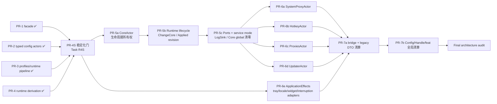

# Clash Nyanpasu Actor 迁移路线图 v3（稳定化优先）

**日期：** 2026-07-13  
**状态：** Implementing（S01～S09 已完成/工作区已验证；S10 pending；不得宣告 PR-4S 完成）

**范围基线：** `main @ 9886aacc750b691d6abc893808ddaaf9dfb6a538`（`fix(proxy): resolve provider-owned proxies (#4954)`；已包含 PR-4 `#4932`；S01 `daf872d9`；S02 `807f1733`；S03 工作区已验证；S04 工作区已验证：`CoreLifecycleLease` / 统一 lifecycle mutex / change_core lease span / updater stop-swap-restart；S05 Applied-based patch compensation 工作区已验证；S06 prepared mirrors / three-domain saga 工作区已验证；S07 profile materialization transactions / durable `Profiles.revision` / import fetch-before-commit / startup+periodic reconcile 工作区已验证；S08 `MutationOutcome` wire / Specta / frontend / import 终态协议 工作区已验证；S09 instance-owned `RebuildCoordinator` + test-only `fake-core` process matrix 工作区已验证）
**取代：** `actor-migration-roadmap.md` v2  
**权威顺序：** 已批准 design/spec > 本 roadmap > task card > implementation plan > 实现注释

---

## 0. 路线图定位

v2 已正确完成 profiles 域和 runtime 派生链的方向性迁移，但把“代码已合并”过早等同于“阶段已验收”。PR-1～PR-4 合并后仍存在跨锁域竞态、回滚读模型失真、typed state 与 legacy mirror 的幽灵失败、profile 状态与物化文件分裂、测试访问真实用户目录等问题。

v3 将迁移顺序改为：

```text
PR-1～PR-4 已合并
        ↓
PR-4S 稳定化门（必须完成）
        ↓
PR-5 CoreActor 三段式迁移
        ↓
PR-6 外围 actor / effect adapter
        ↓
PR-7 兼容层与全局清算
        ↓
最终架构验收
```

**原则：PR-4S 之前禁止开始 PR-7 清算；PR-5 可以只做设计和预研，不得在未关闭稳定化缺陷时合并生命周期切换。**

---

## 1. 锁定原则

### 1.1 服务分类保持不变

- 长生命周期可变状态、进程、定时器、watcher、下载、缓存、系统副作用：actor service。
- 纯计算、校验、patch、schema migration、runtime 构建：pure service。
- Tauri、文件系统、OS、网络、进程、日志：port / adapter。
- `NyanpasuClient` 是 facade，不是 service locator。

### 1.2 三种运行状态必须区分

后续实现不得再用一个 `RuntimeState` 同时表达三个事实：

1. **Desired**：用户已经提交的配置意图；
2. **Promoted**：已通过目标核心检查并晋升到产品文件的 runtime；
3. **Applied**：运行中的核心最后一次确认接受的 runtime。

四条 runtime 读 IPC 继续读取 Promoted，patch compensation 与运行态健康判断必须读取 Applied。

### 1.3 commit-first，但不伪装成回滚

普通配置 mutation 采用：

```text
validate → persist desired state → commit → reconcile side effects
```

副作用失败返回 `CommittedDegraded`，不得将已提交状态伪装成普通 `Err`。只有具有明确 all-or-nothing 契约的操作允许补偿回滚，例如：

- `change_core`；
- profile add 的初始文件创建；
- remote refresh 的文件与元数据双写；
- API-first patch 的即时运行态补偿。

原 v2 中“未来统一 ack-driven rollback”改判为：**ack 驱动 applied-state tracking、reconcile 与健康上报；不对普通 desired config 做通用回滚。**

### 1.4 bridge 的失败边界

过渡 bridge 必须满足：

- 所有可失败转换在 typed persistence 之前 prepare；
- typed persistence 之后的 mirror apply 必须不可失败；
- 跨三个 typed 域的 legacy patch 必须使用 version-checked saga；
- 任何部分提交必须结构化上报，不得只返回普通字符串错误。

### 1.5 跨资源事务必须显式设计恢复

YAML 状态、profile 文件、runtime 产品文件、进程和 OS 副作用不能假装处于单一数据库事务中。每条跨资源路径必须明确：

- 权威数据；
- prepare 点；
- commit 点；
- compensation；
- 崩溃恢复；
- 可观察 outcome。

### 1.6 测试绝不访问真实用户目录

测试图必须完全由注入的 `PathResolver` / `RuntimePaths` / fake adapters 构造。单元测试和集成测试禁止调用真实 `dirs::app_config_dir()`、真实系统代理、真实快捷键和真实核心二进制，除非是显式标记、隔离执行的手工 smoke job。

### 1.7 产物检查边界

unchecked candidate 必须位于应用私有 candidate 目录，使用不可预测名称、独占创建和受限权限。异常退出后的残留必须可清理。产品文件、Promoted store 和 checksum/revision 必须对应同一份字节。

### 1.8 验收证据属于实现的一部分

“手工验证”必须附：

- commit / build；
- OS；
- 核心类型；
- 测试步骤；
- 结果；
- 日志或 artifact。

未留下证据的 checklist 不计为阶段关闭。

---

## 2. 当前状态（2026-07-13）

| 阶段                         | 合并状态 |   v3 验收状态 | 仍需处理                                                                                                                                                                                                                                            |
| ---------------------------- | -------: | ------------: | --------------------------------------------------------------------------------------------------------------------------------------------------------------------------------------------------------------------------------------------------- |
| PR-1 `NyanpasuClient` facade |       ✅ |   ⚠️ 条件通过 | S09 已关闭 process-global rebuild bridge 与不可重装测试图；结果语义与 PR-5/6 residual global desired-state isolation 仍待后续阶段                                                                                                                   |
| PR-2a/2b typed config actors |       ✅ |   ⚠️ 条件通过 | S06 已关闭 mirror ghost Err 与三域 partial commit；仍需 SessionState 持久化策略复核                                                                                                                                                                 |
| PR-3-pre① snapshot store     |       ✅ |            ✅ | 保持纯逻辑与 contract tests                                                                                                                                                                                                                         |
| PR-3-pre② runtime executor   |       ✅ |       ✅/观察 | legacy parity 的已批准偏差持续登记                                                                                                                                                                                                                  |
| PR-3 profiles 域切换         |       ✅ |   ⚠️ 条件通过 | S07 已补齐 profile 文件/状态事务 + import fetch-before-commit；S08 已将 crate-internal degradation 与 post-commit rebuild 合并为公共 `MutationOutcome`；已发生回归的 contract tests 继续固化                                                        |
| PR-4 runtime 派生化          |       ✅ |     ❌ 未闭环 | S03/S04 已补齐 promoted/applied + 统一 lifecycle lease；S05 已补齐 D6 Applied compensation；S09 已去全局化 dispatcher 并补齐 process-level fake-core matrix；仍待 smoke/ledger closeout（S10）                                                      |
| **PR-4S 稳定化门**           |       ⏳ | 进行中/未完成 | S01～S09 已完成/工作区已验证；S10 pending；不得宣告 PR-4S 完成。`REGEN_BRIDGE`/OnceCell first-install-wins 已删除；S09 不再是 full-suite red contract。S10 负责 ledger CI gate、三平台 smoke/evidence、final review disposition 与 PR-4S closeout。 |
| PR-5 CoreActor               |   未开始 |             — | 必须在 PR-4S 后实施                                                                                                                                                                                                                                 |
| PR-6 外围 actors/effects     |   未开始 |             — | 必须在 PR-5 生命周期稳定后实施                                                                                                                                                                                                                      |
| PR-7 清算                    |   未开始 |             — | 只允许删除，不再承载行为迁移                                                                                                                                                                                                                        |

当前“已合并工作量”约为原 v2 的一半以上，但“纯净端态验收”仍未过半。剩余阶段控制的是风险最高的进程生命周期、OS 副作用和兼容层清算。

---

## 3. PR-1～PR-4 缺陷与回归台账

| ID    | 来源   | 缺陷                                                                                           | 责任阶段                                                                                                                                                                                                                                                                                            |
| ----- | ------ | ---------------------------------------------------------------------------------------------- | --------------------------------------------------------------------------------------------------------------------------------------------------------------------------------------------------------------------------------------------------------------------------------------------------- |
| S-R1  | PR-4   | `change_core` 仅持 `rebuild_gate`，未与所有 `CoreManager::run_core()` 调用共享完整生命周期锁域 | PR-4S / S04 已关闭（`CoreLifecycleLease` + 统一 lifecycle mutex；change_core 全程持有 lease 至 rollback 结束；updater stop/swap/restart 同锁域）                                                                                                                                                    |
| S-R2  | PR-4   | 深层 rollback 恢复产品文件但未恢复 runtime read model                                          | PR-4S / S03 已关闭（transaction snapshot 同步恢复 product/Promoted/Applied）                                                                                                                                                                                                                        |
| S-R3  | PR-2   | actor 先 `upsert`，再 mirror；mirror 失败导致“已提交但返回 Err”                                | PR-4S / S06 已关闭（fallible prepare-before-persist；infallible in-memory apply-after-persist；prepare failure 零提交）                                                                                                                                                                             |
| S-R4  | PR-2   | legacy `IVerge` patch 顺序写三个 actor，无 version check 与 compensation                       | PR-4S / S06 已关闭（manager-level expected-version CAS；Application→Session→Clash saga；reverse compensation；structured `PartialCommit`）                                                                                                                                                          |
| S-R5  | PR-1/4 | process-global `REGEN_BRIDGE` first-install-wins，通道无界，测试图不可重装                     | PR-4S / S09 已关闭（instance-owned capacity-1 coalescing `RebuildCoordinator` + Weak worker + direct typed requests + explicit shutdown；生产 exit 经 `cleanup_processes` 调用 `client.shutdown()`）。PR-5/6 residual：legacy `Config`/`CoreManager` global 仍非 full graph desired-state isolation |
| S-R6  | PR-3   | profiles 状态先提交、文件后操作；warning 仅日志，调用方可能得到 `Ok`                           | PR-4S / S07+S08 已关闭：事务 + crate-internal degradation + 公共 `MutationOutcome`/`committed_degraded` wire；import 改为 fetch-before-commit                                                                                                                                                       |
| S-R7  | PR-3   | remote refresh 文件已更新而元数据 persist 失败时缺少文件恢复                                   | PR-4S / S07 已关闭（file-first promote → state CAS → complete/compensate；**仅** manual/scheduled refresh；import 不走此路径）                                                                                                                                                                      |
| S-R8  | PR-4   | D6 compensation 以 Promoted 代替 Applied，不能删除新增键，缺少 patch serialization             | S05 已关闭；Applied owner/gate 迁入 CoreActor 留给 PR-5b                                                                                                                                                                                                                                            |
| S-R9  | PR-4   | candidate 位于共享 temp、名称可预测、权限与崩溃清理不足                                        | PR-4S                                                                                                                                                                                                                                                                                               |
| S-R10 | PR-4   | rollback 单测写真实用户 runtime 产品路径                                                       | PR-4S                                                                                                                                                                                                                                                                                               |
| S-R11 | PR-3   | migration、specta wire、本地导入、remote options、mixed-port 即时性发生过回归                  | PR-4S contract suite                                                                                                                                                                                                                                                                                |
| S-R12 | 文档   | roadmap 多章节指标和状态互相冲突，已合并 PR 仍标“进行中”                                       | PR-4S 文档收尾                                                                                                                                                                                                                                                                                      |
| S-R13 | PR-2/6 | `feat::patch_verge` 在配置提交前执行多组 OS/UI 副作用，失败后无法完整撤销                      | PR-6a/6b/6e；PR-4S 固化 outcome 契约                                                                                                                                                                                                                                                                |
| S-R14 | PR-4   | PR-4 五项真实环境 smoke 没有可审计完成记录                                                     | PR-4S 验收                                                                                                                                                                                                                                                                                          |

PR-4S 必须解决 S-R1～S-R12、S-R14；S-R13 的行为迁移留给 PR-6，但 PR-4S 必须先定义统一的 `CommittedDegraded` 与 effect health 协议。

---

## 4. 修正后的依赖图



### 并行性

- PR-4S 是单一原子稳定化门，内部允许按 commit lane 并行开发，但只允许一个 PR 整体合并。
- PR-5a/5b/5c 严格串行。
- PR-6a～6d 可在 PR-5c 后并行；PR-6e 可在 PR-4S 后预先开发，但最终接线不得早于 PR-5c。
- PR-7 只能做删除、调用点切换收尾和 denylist，不再引入新行为模型。

---

## 5. 新增 Task R4S — PR-1～PR-4 稳定化门

**目标：** 在继续 actor 化之前，修复已合并架构的事务、回滚、路径、测试和回归保护缺陷，建立可验证的 desired/promoted/applied 模型。

**分支建议：** `fix/pr4s-actor-migration-stabilization`  
**设计：** `docs/superpowers/specs/2026-07-13-pr4s-actor-migration-stabilization/design.md`  
**任务卡：** `docs/superpowers/specs/2026-07-13-pr4s-actor-migration-stabilization/task.md`

### R4S 强制交付物

1. `RuntimePaths` 全量注入，candidate/product 不再通过全局 dirs 解析；
2. 私有 candidate 目录、随机名、权限、RAII cleanup、启动残留清理；
3. `RuntimeLifecycleState { promoted, applied }` + revision/hash；
4. 全换核事务和任意 start/restart/stop 共享生命周期 lease；
5. rollback 同时恢复 product、Promoted、Applied 和 selected core；
6. D6 patch gate + Applied-based compensation + 键删除能力；
7. prepared mirror：可失败转换在 typed commit 前，commit 后 apply 不可失败；
8. legacy 三域 patch 的 version-checked saga；
9. profile materialization prepare/finalize/compensate；warning 进入 wire；
10. bounded/coalescing rebuild channel；去除 first-install-wins 测试污染；
11. PR-3/4 回归 contract suite；
12. fake-core failure-injection 与可追溯三平台 smoke 记录；
13. roadmap 状态和 grep 指标自动生成或 CI 校验。

### S05 disposition（已完成；不关闭 PR-4S）

- `PatchCompensationPlan` 从 **Applied** 快照生成显式 `Set` / `Remove` 操作；`Remove` 是 transport-independent 的领域操作，禁止用 JSON `null` 表达删除。
- instance-owned `clash_patch_gate` 将 API-first patch、desired persist、rebuild/check/promote、apply/restart 与补偿保序，并固定获取 `patch_gate → rebuild_gate → CoreLifecycleLease`。
- `RuntimeSnapshot` 保留 exact product bytes 及 hash；补偿在 rebuild/lifecycle exclusion 内以私有 Applied candidate 直接 apply，不晋升或覆盖 product。
- revision fence 不匹配时拒绝 stale compensation。补偿后的状态矩阵为 `Promoted = P3`、`Applied = P1`：产品/read model 保持最新已晋升 P3，运行核恢复 P1。
- IPC 仅解析 DTO 并调用 facade；S05 set/remove、unknown-Applied、revision-conflict、exclusion、exact-bytes 和 P3/P1 tests green。

### S06 disposition（已完成；不关闭 PR-4S）

- Application / Session / Clash bridge 在 typed persistence 前执行 fallible `prepare(next)`，完成转换与序列化；persist 成功后的 `PreparedLegacyMirror::apply()` 仅更新内存 legacy projection，不返回 `Result`、不执行 IO。
- `PersistentStateManager::replace_if_version` 在 manager/coordinator 层执行 expected-version CAS；actor 通过 `ReplacePreparedIfVersion` 提交 prepared state，CAS conflict 不应用 mirror，也不覆盖并发 typed 更新。
- legacy `IVerge` patch/replace 固定按 Application → Session → Clash 提交；失败时按已提交域的逆序补偿，并继续收集全部 compensation conflict/error。
- `PartialCommit` 结构化保留 `primary_error`、`committed_domains`、`compensated_domains`、`failed_compensations`；失败项区分 version conflict、domain error 与 `LegacyStateUncertain`。
- legacy finalizer 失败或副作用结果不确定时，即使 typed reverse compensation 全部成功，仍返回 `PartialCommit` 并触发 reconciliation，不降格为普通 `Err`。
- `PrepareReplace`、`ReplacePreparedIfVersion` 和 `PreparedTypedReplace<T>` 是 legacy mirror/saga 的迁移期协议，不是最终 actor API。它们保留到 PR-7a；当 legacy `IVerge` 路由、运行期 mirror 和三域补偿 saga 删除后同步移除。
- manager/coordinator 的 `replace_if_version` CAS primitive 与 legacy mirror 解耦，不随上述协议自动删除。PR-7a 应按剩余生产调用决定：仍需非 legacy 条件写入时收敛为直接携带 typed state 的 `ReplaceIfVersion { expected_version, state }`；无调用方时删除 actor/client conditional protocol，但可保留 manager CAS 供领域内部使用。
- S06 tests 以 oneshot/mpsc channel 与 release barrier 固定交错，不使用 sleep；prepare 零提交、manager CAS、第二/第三域失败、逆序补偿、并发 conflict、finalizer uncertainty 与 structured `PartialCommit` 均已验证。S09 已完成；S10 仍 pending。

### S07 disposition（已完成；不关闭 PR-4S）

- `Profiles.revision` 是 server-owned、可持久化的 durable state generation，专供 materialization journal / recovery 使用；与 `PersistentStateManager` 的 process-local MVCC version 严格分离，不得从后者派生。
- 每次 forward 或 compensating state commit 前 `bump_revision()`；journal 写入 expected `Profiles` 快照上的 durable revision、operation id、managed path 与 content hash，不保存敏感完整内容。
- 协议固定：
  - **state-first**：`prepare(next) → state CAS → promote → complete/compensate`（Add、ReplaceDefinition、成功后的 Remote import、Delete 的 cleanup 准备阶段）；
  - **file-first**：`prepare(next) → promote → state CAS → complete/compensate`（**仅** manual/scheduled Remote refresh、External Mirror 同步）；
  - **cleanup**：`prepare(next) → state CAS → activate → retry`（Delete / 替换旧路径；active path 与 hash reuse fence）；
  - **reconcile**：启动与周期性恢复，先于 watcher 与 mutation 生效；
  - **import fetch-before-commit**：`validate → in-memory PendingImport → fetch/validate → CommitImported`；成功才一次 state-first（真实 bytes）；取消/失败零 state/file。
- 操作映射：Add / ReplaceDefinition → state-first（slot 变化时附带 resource；旧 path 可附 cleanup）；**Remote import → actor-owned fetch-before-commit，成功后一次 state-first + 既有 journal recovery**（**禁止** `add empty placeholder → refresh → delete compensation`；**不**新增 import journal/schema/field heuristics）；Delete → state commit 为权威 + durable cleanup；RefreshRemote（手动/定时）/ External Mirror → file-first 不变；`ReconcileMaterializations` 串行执行 recovery。
- **已修正的 superseded state-first journal 规则：** 当 `profiles.revision > journal.revision` 且路径仍 active 时，若 target 仍处于 pre-promote（备份字节），必须 `compensate` 并丢弃 staged forward content，**绝不可 promote** 到更新的 committed revision。仅 target 已匹配 journal hash 时，`StatePromoting` 可 `complete`，`StatePrepared` 可 `discard`。
- 启动与 actor-owned 周期任务都会 `reconcile(loaded profiles)`；malformed journal 隔离、unreferenced artifact sweep、cleanup fence（active path / hash mismatch / already-absent）均有 deterministic tests。
- `ProfileDegradation{phase,code,message}` 仍仅 crate-internal（`Cleanup`/`Reconcile` × `JournalInvalid`/`MaterializationDeferred`/`CleanupDeferred`）；S08 已将其映射到公共 wire，不改变 actor 内部存储形状。
- S07 failure/crash/cleanup/fence/**import cancellation-restart-materialization** tests green；S09 已完成；S10 仍 pending。

### S08 disposition（已完成；不关闭 PR-4S）

- 公共终态 wire 仅为 `MutationOutcome<T> { Applied { value } | CommittedDegraded { value, degradations } }`；`Degradation { phase, code, message, retryable }`；`DegradationPhase` 为 snake_case 枚举。**无** `_v1` alias，**无** legacy `RebuildOutcome`。
- create/import 单位 outcome 为 `MutationOutcome<ProfileId>`；其余 profile mutation 为 `MutationOutcome<()>`。facade 在 commit 后合并 S07 profile degradations 与 post-commit rebuild degradation，再由 `from_parts`/`extend_degradations` 产出 Applied / CommittedDegraded。
- **H1 retained-forward：** state-first promote 失败且 compensating state CAS 也失败时，forward head 保持可恢复，mutation 返回 `Ok(CommittedDegraded)`（crate-internal `MaterializationDeferred` → public `profile_materialization` / `materialization_deferred`），不得把已提交 uid 抹成 hard `Err`。
- **H2 auto-activation（post-commit only）：** create/import 在 facade 共用 `try_auto_activate_if_none` / `set_current_if_none`；`Ok(None)` 保持 Applied；hard failure → `SystemEffect` / `profile_auto_activation_failed` 的 committed-degraded，并**保留**已提交 `ProfileId`。激活不是 import 的 pre-commit 步骤。
- **Import 终态协议：** actor-owned fetch-before-commit；validation + fetch 在任何 durable placeholder 之前；cancel before commit → discard、零 state/file；success → 一次 state-first（真实 bytes + 既有 materialization journal recovery）；**无**新 import journal/schema/field heuristics；**不再**使用 add-empty-placeholder→refresh→delete；pre-commit 失败为普通 `Err`，post-commit 降级才进 `committed_degraded`。manual/scheduled remote refresh 保持 file-first。
- **Runtime rebuild 相位保真显式延期：** 当前 `rebuild_running_config()` 只有不透明 `Result`，facade 统一映射为粗粒度且真实的 `RuntimeBuild` / `runtime_rebuild_failed`（retryable）。**禁止**伪造 RuntimeCheck/Promote/Apply 精度；该精度不在 S08 范围，也不冒充 S09 工作。
- 前端：`unwrapResult` 穷尽返回 `T`；`MutationCache.onSuccess` 仅识别 `committed_degraded` 并仍走 success/invalidation；toast 本地化 phase/code（en/zh-cn/zh-tw/ru/ko），`message` 仅详细/日志。
- Specta 生成并冻结 `MutationOutcome`/`Degradation`/`DegradationPhase`；bindings freshness contract 拒绝 `RebuildOutcome` 与 legacy status tag。
- 验证真相：focused S08 tests / build / clippy 通过（含 import cancellation-safe 与 facade H1/H2）。full workspace green **不得**在 S10 最终 QA 前宣称；历史 red contract 中的 `REGEN_BRIDGE` two-client isolation 已由 S09 关闭，不得再当作稳定 red。network 类 flaky 与 PR-5/6 residual global-state rebuild 类失败须如实记录——**不得**伪装为 S08/S09 未关，也不得据此宣告 PR-4S 完成。S09 已完成；S10 仍 pending。

### S09 disposition（已完成；不关闭 PR-4S）

- **`REGEN_BRIDGE` / `OnceCell` 已删除**。不再存在 process-global first-install-wins rebuild dispatcher；历史 “S09 `REGEN_BRIDGE` two-client isolation is the only stable full-suite red contract” 陈述作废。
- **instance-owned capacity-1 coalescing `RebuildCoordinator`**：background dirty 为 `mpsc` 容量 1 + receiver-side coalesce window；`try_send` 满则合并；request/reply regeneration 直接调用 typed facade 方法，不经进程静态 dispatcher。
- **Weak worker**：`start_rebuild_worker` 仅捕获 `Weak` client graph，upgrade 后调用 `rebuild_running_config()`，避免 Arc 环；`Drop` 仅 best-effort 关停，**显式 `shutdown().await`** 才等待 worker 退出。
- **生产 exit 集成**：`cleanup_processes` 在 core/widget teardown 前从 Tauri managed state 取 `NyanpasuClient` 并 `client.shutdown().await`；不引入新的 process-global client lookup。
- **Coordinator / clone / dirty 隔离与 paused-time shutdown tests**：`s09_two_client_graphs_are_independent`、`s09_clones_share_one_coordinator`、`s09_legacy_call_sites_use_supplied_client`；coordinator 单元测试用 `tokio::time::pause/advance` 验证 coalesce、shutdown 等待 in-flight、coalesce 中途 shutdown 跳过 rebuild、shutdown 后 dirty 为空操作。
- **test-only `fake-core` package 协议（最终 disposition）**：取代早期 illustrative CLI flags（`--check-ok/--start-fail` 等）。最终协议为 **real core argv shapes** + **`FAKE_CORE_*` env**：
  - check：`-t -d <app_dir> -f <config>`；
  - start：mihomo / clash-rs / premium argv；
  - TCP READY/RELEASE barrier（`FAKE_CORE_READY_ADDR`）；无 barrier 且无 `START_EXIT` 则 fail-fast exit 2；
  - 动态 hold/http 端口（`0` = ephemeral，READY 帧回报 `hold=` / `http=`）；
  - exact `PUT /configs` 与 `PATCH /configs` 状态注入（`FAKE_CORE_APPLY_STATUS`）；严格 env；`ScopedChild` RAII reap；
  - **never packaged** as production sidecar/resource（workspace member + tauri **dev-dependency** only；`publish = false`）。
- **`cfg(test)` `ProcessCoreLifecycleAdapter`**：TempDir `RuntimePaths`；禁止 `CoreManager::global()` / real sidecar / 真实用户目录；仅链接于测试。
- **process matrix（工作区已验证；非全 workspace 宣称绿）**：
  - check fail → product/Promoted/Applied 不变；
  - immediate start fail → 无 child leak；
  - apply HTTP 500 after promote → Promoted 新、Applied 旧/None；
  - fixed-port hold conflict + stop 后释放；
  - lifecycle lease serialization（barrier/oneshot，无 sleep）；
  - clean stop / `ScopedChild` reap；
  - two graph PID/port/path isolation；
  - real-process `change_core`：new-core start failure + old-core rollback success。
- **prebuild 要求**：跨 crate 测试须 `cargo build -p fake-core`（或 `cargo test -p fake-core`）；`CARGO_BIN_EXE_fake-core` 仅同包 integration test 自动设置；discovery：`NYANPASU_FAKE_CORE` → current_exe profile sibling → `$CARGO_TARGET_DIR/{debug|release}/fake-core`；缺失时错误文案含稳定 `PREBUILD_COMMAND`。
- **平台限制**：fake-core 为 std-only 跨平台协议实现；Windows service-mode / TUN 权限路径仍属 S10 手工 smoke，不在 process matrix 自动化范围。
- **PR-5/6 residuals**：legacy `Config` / `CoreManager::global()` 仍存在；`change_core` 等路径仍可能触碰 legacy desired-state mirrors——**不是** full graph desired-state isolation。S09 shutdown 只拆除 rebuild worker，不停止 desired-state actors / system proxy / OS resources。
- **S10 仍负责**：architecture ledger CI gate、Windows/macOS/Linux smoke/evidence、PR-4 review final disposition 表、roadmap closeout 与 PR-4S 完成宣告。S09 单独完成**不得**宣告 PR-4S 完成。

### R4S 退出判据

- 四个 unresolved PR-4 review finding 有代码和测试处置；
- 任何换核失败分支均满足产品文件、Promoted、Applied、selected core 一致；
- actor mirror 失败不能产生“状态已提交但普通 Err”；
- profile add/refresh 的文件故障有确定 compensation；import cancel/fail 零 state/file 且无 placeholder delete；
- 全部自动测试零访问真实用户配置目录；
- #4893、#4916、#4917/#4920、#4921 对应回归 fixture 通过；
- PR-4 的五项 smoke 全部附可审计记录；
- `cargo test --workspace --all-features`、前端 build/typecheck、bindings freshness 全绿。

---

## 6. PR-5 — Core 生命周期迁移（三段式）

### 6.1 PR-5a — CoreActor 生命周期所有权

**范围：**

- `CoreActor` 独占 `Instance::{Child,Service}`、状态、重启退避和生命周期串行；
- typed `CoreClient` 暴露 `status/start/stop/restart/recover`；
- `restart_sidecar`、startup 和 health recovery 全部走 facade/client；
- 禁止 actor 外直接持有 child/process state；
- `Recover` 使用 actor 内 delayed self-message，不使用裸线程递归。

**退出：** 除 legacy adapter 内部外无 `CoreManager::run_core()` 直接调用。

### 6.2 PR-5b — Runtime lifecycle 与换核事务

**范围：**

- CoreActor 消费 `RuntimeRevision`；
- `CheckConfig/ApplyConfig/RestartWith/ChangeCore` 进入同一 mailbox；
- 成功 apply/start 后发布 Applied revision；
- `ChangeCoreOutcome` 结构化表达新核错误、rollback 状态和最终运行状态；
- API-first patch 由 CoreActor 串行，并以 Applied snapshot 补偿；
- runtime health 事件经 `UiEventSink` 发布。

**退出：** desired/promoted/applied 不再依赖 legacy CoreManager 推断。

### 6.3 PR-5c — 端口、service mode 与日志

**范围：**

- restart/change-core 固定时序：`stop → resolve ports → mirror consumers → build/check/promote → start`；
- fixed port 被旧核占用的场景自动化测试；
- `RunType` 由 typed Application snapshot 参数化；
- `LogSink` 注入 CoreActor，`get_clash_logs` 走 CoreClient；
- service-mode IPC 全部走 facade；
- 删除 `CoreManager::global()` 和 `Logger::global()` 写端。

---

## 7. PR-6 — 外围 actor 与 application effects

### 7.1 PR-6a `SystemProxyActor`

- 独占 system proxy、auto-launch、guard timer 和 PAC；
- 接收 `Reconcile(desired_revision, desired_state)`；
- 返回/发布 `EffectStatus { desired_revision, applied_revision, health }`；
- 删除 `Sysopt::global()`。

### 7.2 PR-6b `HotkeyActor`

- 独占快捷键注册表和 OS shortcut adapter；
- callback 只调用 facade API，不反向依赖 `feat::*`；
- 删除 KV/verge 双读桥和 `Hotkey::global()`。

### 7.3 PR-6c `ProxiesActor`

- 独占 proxy cache、checksum、订阅、select；
- 核心 revision 变化触发 refresh/reconnect；
- tray 与 IPC 只走 ProxiesClient；
- 删除 `ProxiesGuard::global()`。

### 7.4 PR-6d `UpdaterActor`

- 独占 manifest、下载任务和进度；
- 完成的新核心通过 CoreClient 交付；
- 删除 `UpdaterManager::global()`。

### 7.5 PR-6e `ApplicationEffects`

此阶段不新建无必要的 god-actor。采用：

- pure `ApplicationEffectPlan::diff(before, after)`；
- 窄 `ApplicationEffectsPort`；
- Tauri/locale/tray/widget/connection-interruption concrete adapter；
- facade 在配置 commit 后发起 reconcile，并返回/发布结构化 degradation；
- 将 `feat::patch_verge` 中 tray、locale、logger refresh、widget、connection interruption 编排迁出。

主线程限制由 adapter 处理，不允许业务层 import Tauri。

---

## 8. PR-7 — 清算（只做删除与最终切换）

### 8.1 PR-7a — bridge 与 legacy wire 清算

删除：

- `bridge/` 全部运行期 mirror/reseed；
- `state/mirror.rs`，包括 `PreparedLegacyMirror`、各 legacy bridge trait 和 `PreparedTypedReplace<T>`；
- Application / Session / Clash actor 与 typed client 中仅为 legacy mirror/saga 服务的 `PrepareReplace`、`ReplacePreparedIfVersion`、`prepare_replace()` 和 `replace_prepared_if_version()`；
- `NyanpasuClient` 中的 `PreparedConfigDomain`、`CommittedConfigDomain`、legacy 三域 saga、reverse compensation 和 legacy `PartialCommit` reconciliation 路径；
- `run_legacy_*`、`route_verge_patch`、`patch_verge_entrypoint`；
- legacy `IVerge`/`IClashTemp` IPC DTO；
- process-global rebuild dispatcher；
- 所有 `TODO/FIXME(actor-migration)`。

清算顺序固定为：先将最后的 production caller 从 legacy `IVerge` patch/replace 路由迁出，再删除三域 saga/finalizer，随后删除 prepared mirror 类型和 actor/client 消息，最后简化三个 actor 的普通 commit 路径。`PersistentStateManager::replace_if_version` 不属于 legacy bridge：若仍有非 legacy 条件写入调用，actor 消息改为直接携带 typed state 的 `ReplaceIfVersion { expected_version, state }`；若无生产调用，则删除 actor/client conditional API。验收时 `rg` 不得再命中 `PreparedLegacyMirror|PreparedTypedReplace|PrepareReplace|ReplacePreparedIfVersion|apply_legacy_verge_.*_saga`。

### 8.2 PR-7b — Config / Handle / feat 清算

删除：

- `Config::global()`、`Draft<T>`、legacy ManagedState；
- `Handle::global()`、`consts::app_handle()`；
- `feat.rs` 编排中心；
- 最后残留的 service-locator API。

PR-7b 完成后，允许保留的进程级静态值只能是 immutable constant / lookup table / feature flag，并进入显式 allowlist。

---

## 9. 统一 outcome 与健康模型

建议 wire / domain 结果：

```rust
pub enum MutationOutcome<T> {
    Applied { value: T },
    CommittedDegraded {
        value: T,
        degradations: Vec<Degradation>,
    },
}

pub struct Degradation {
    pub phase: DegradationPhase,
    pub code: String,
    pub message: String,
    pub retryable: bool,
}
```

`DegradationPhase` 至少覆盖：

- `LegacyMirror`（仅 PR-7 前）；
- `ProfileMaterialization`；
- `RuntimeBuild`；
- `RuntimeCheck`；
- `RuntimePromote`；
- `RuntimePublish`；
- `RuntimeApply`；
- `CoreRollback`；
- `SystemEffect`；
- `UiEffect`。

前端对 committed-degraded 仍视为 mutation success，但展示可本地化的 phase/code，并保留详细 error chain 到日志。

---

## 10. 自动化验收矩阵

| 场景                                     | 自动化要求                                          |
| ---------------------------------------- | --------------------------------------------------- |
| candidate check 失败                     | product/promoted/applied 均保持旧值                 |
| product promote 成功、store publish 失败 | 明确权威和 recovery；不得静默                       |
| apply 失败                               | promoted 新、applied 旧，outcome degraded           |
| change_core 新核 start 失败              | 生命周期 lease 阻止并发 restart                     |
| rollback rebuild 失败                    | 恢复旧 product + promoted + applied                 |
| rollback old-core restart 失败           | 最终状态结构化为 stopped/degraded                   |
| actor mirror prepare 失败                | typed state 不提交                                  |
| mirror apply                             | 设计为不可失败，并有单测证明                        |
| 三域 patch 第二域失败                    | 第一域 version-checked compensation                 |
| profile add 文件 finalize 失败           | state 回滚或明确 materialization error，不返回裸 Ok |
| remote refresh metadata persist 失败     | 恢复旧文件                                          |
| delete 文件 cleanup 失败                 | state 保持删除，持久 cleanup job + warning          |
| 并发 patch                               | patch gate 保序，补偿不覆盖更新的 revision          |
| 测试路径                                 | 所有 product/candidate/profile 路径都在 TempDir     |
| migration 回归                           | IPv6、legacy defaults、local/remote wire fixtures   |
| mixed-port                               | fixed/random、端口占用、立即生效                    |

---

## 11. CI 与文档门

新增/加强：

1. `architecture-ledger` 脚本生成：
   - `Config::*()` 调用数；
   - `::global()` 调用数；
   - actor-migration TODO；
   - bridge 文件；
   - legacy DTO 引用；
   - 测试中的真实 dirs 调用。
2. 生成结果与 roadmap committed snapshot diff；不一致则 CI fail。
3. PR 模板要求填写：
   - design 决策；
   - failure matrix；
   - automated tests；
   - manual smoke evidence；
   - residual bridge ledger。
4. 未解决的 review thread 不得在无 disposition 记录时合并；若延期，必须进入 roadmap 风险台账并指定负责阶段。

---

## 12. 最终成功判据

迁移完成必须同时满足：

- 所有 mutable state 有单一 actor/manager owner；
- 所有进程与长期任务由 actor 监督；
- facade API 不暴露 raw actor refs/service lookup；
- Tauri、OS、FS、network、process 全部在 adapters 后；
- runtime desired/promoted/applied 可观测且 revision 一致；
- 普通配置 mutation 使用 committed/degraded，不伪装回滚；
- all-or-nothing operation 有测试覆盖的 compensation；
- `Config::global()`、服务 `::global()`、bridge、legacy DTO、`feat.rs` 为零；
- 测试零访问真实用户目录；
- Windows/macOS/Linux 真实打包 smoke 有可审计记录；
- roadmap 指标由自动化生成，不再靠手工数字。

---

## 13. 明确延期项

以下不阻塞 actor migration v3 完成：

- snapshot graph UI；
- runtime incremental subtree rebuild；
- 跨进程分布式事务；
- generic event-sourcing；
- 为单一 adapter 过度抽象通用框架。

任何延期项不得被用作保留 mutable global、隐藏兼容层或跳过失败恢复设计的理由。
