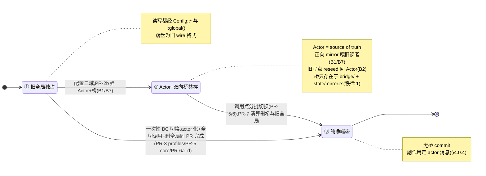
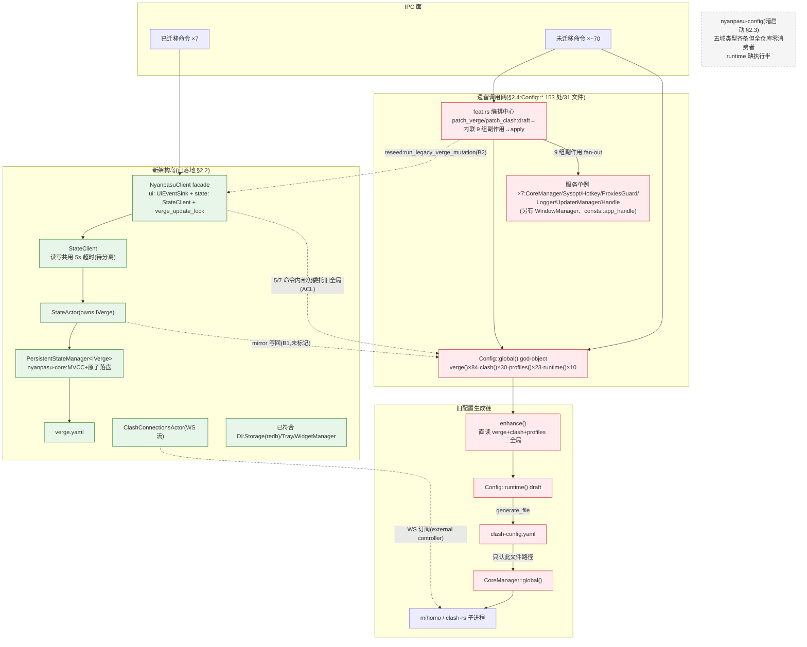
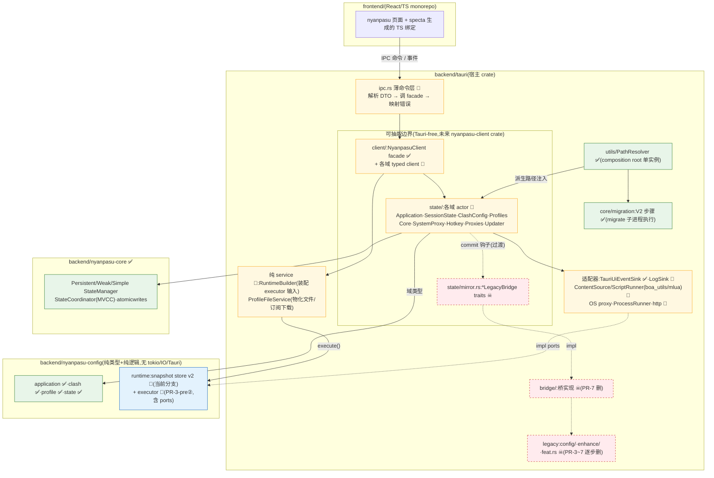
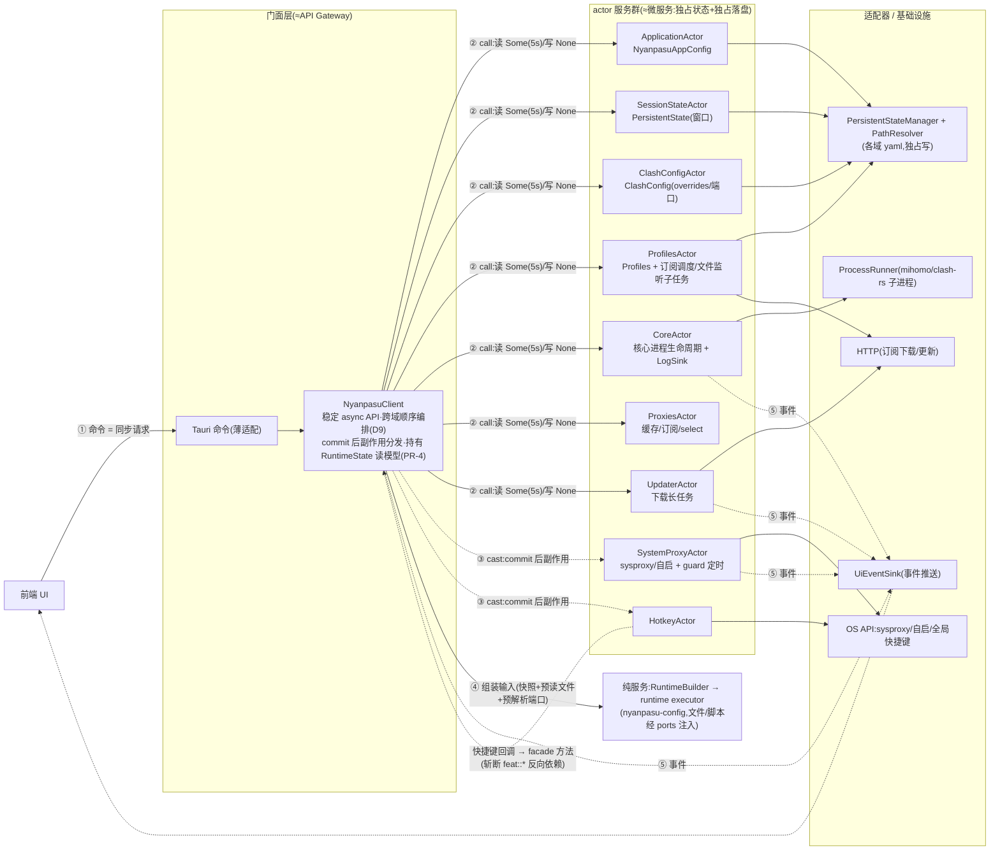
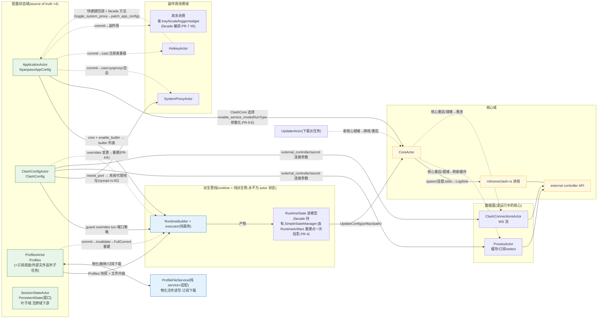
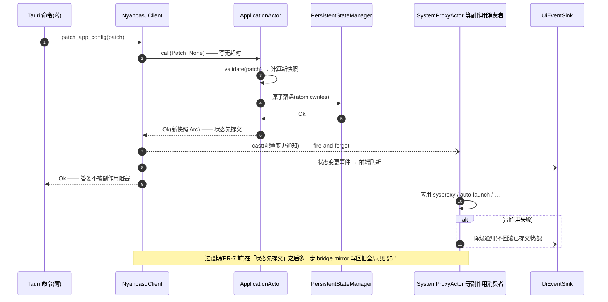
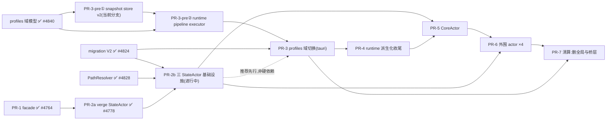
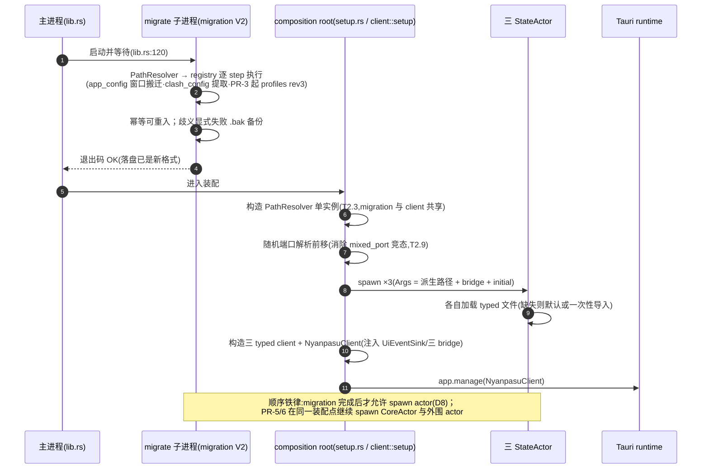
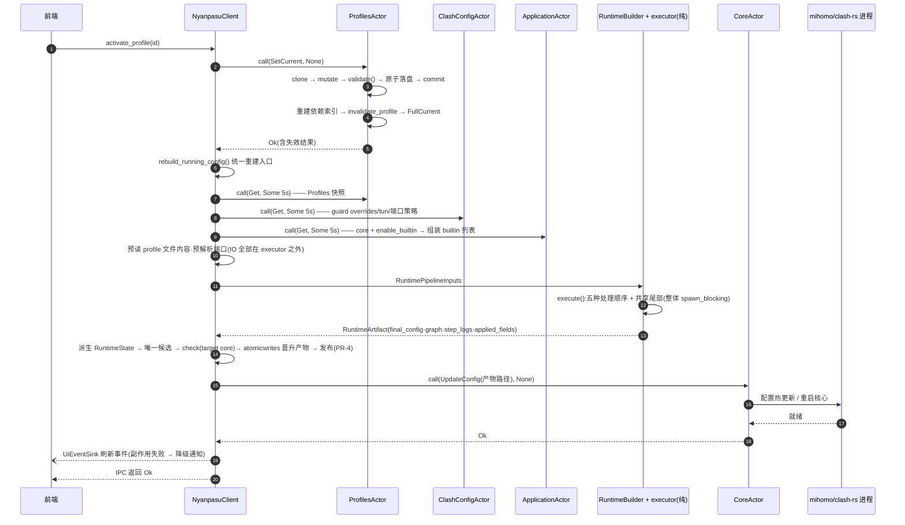
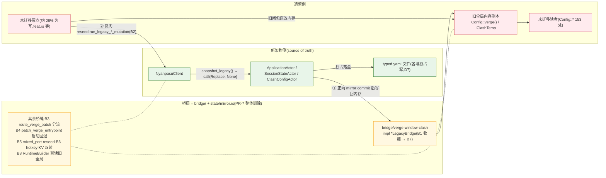

# Clash Nyanpasu Actor 迁移路线图(v2,基于代码库实测修正)

**日期:** 2026-07-04
**基准:** 分支 `refactor/runtime-snapshot-store-v2` @ `d0b3cf6ac`(= main `b5b168627` + snapshot store v2)
**来源:** 外部审查文档(ChatGPT 深度分析,PR-1~PR-7 拆分)+ 仓库既有设计文档 + 三份代码库实测报告(nyanpasu-config/core 地图、tauri 新架构面、遗留全局调用网络)
**定位:** 修正并取代外部文档的迁移拆分,作为后续实施的唯一路线图。所有断言均带 `file:line` 证据。

**关联文档:**

- `docs/superpowers/specs/2026-06-27-three-stateactors-nyanpasu-config-design.md` — PR-2b 蓝图(已批准)
- `docs/superpowers/specs/2026-06-28-nyanpasu-config-profiles-type-migration-design.md` — PR-3 前置(已实施)
- `docs/design/profile-composition-clean-design.md` / `profile-patch-interface.md` — profiles 域模型(已实施)
- `docs/design/profile-tauri-migration-guide.md` — PR-3 逐命令迁移指南
- `docs/design/profile-snapshot-store-migration.md` — snapshot store v2 迁移说明(§6 清单 1–5 已实施)

---

## 1. 迁移原则(已锁定,回应 BC 决策)

采纳「**可迁移的破坏性改动优先于兼容层**」(CLAUDE.md §11),具体化为三条铁律:

1. **运行期共存只允许出现在独立桥层。** 所有新旧双向同步代码集中在 `backend/tauri/src/bridge/`(实现)+ `state/mirror.rs`(Tauri-free trait),逐条标 `TODO(actor-migration)`,注明删除条件;**PR-7 整体清零**。桥层之外的任何文件不得出现新旧互写逻辑。
2. **数据兼容只走 migration V2 一次性迁移。** 新类型(`nyanpasu-config`)永不解析旧 wire 格式(#4840 已确立);所有落盘格式转换注册为 `core/migration/` 的 step,在 actor spawn **之前**(migrate 子进程内)执行完毕。
3. **前端 BC 与后端同 PR 落地。** specta/TS 绑定的破坏性变更(如 `current: string[] → string|null`)随后端切换同步更新,不留 `*_v1` 命令别名;确实阻塞时别名必须标 `TODO(actor-migration)` 并给删除条件。

> **现状违规项(需在 PR-2b 收敛):** 目前存在 **5 处未标记的桥接缝**,散落在桥层之外(见 §5 台账)。全仓库只有 1 处合规标记(`core/hotkey.rs:199`)。

### 1.1 单个配置域的迁移生命周期(图示)

三条铁律对应两种推进模式:**配置三域**(verge 应用配置/窗口会话/clash overrides)调用点多,走「桥接共存 → 分批切换 → PR-7 清算」;**profiles 与服务单例域**调用面可一次覆盖,走「同 PR 一次性 BC 切换」,不建桥。任何模式下,落盘格式转换都只走 migration V2(spawn 前,铁律 2)。

---

## 2. 现状地图(实测,2026-07-04)

### 2.1 已合并 / 进行中

| 阶段                  | 内容                                                           | 状态                  | 证据                                         |
| --------------------- | -------------------------------------------------------------- | --------------------- | -------------------------------------------- |
| **PR-1**              | `NyanpasuClient` facade(ACL)                                   | ✅ 已合并             | `8d22e2596` (#4764),commit 标题自带 `[PR-1]` |
| **PR-2a**             | verge 配置接入 ractor `StateActor`                             | ✅ 已合并             | `f903be837` (#4778)                          |
| 基建                  | `PathResolver`                                                 | ✅ 已合并             | `1085d36c7` (#4828),`utils/path.rs:40`       |
| 基建                  | **migration 子系统 V2**(store/runner/registry + 3 模块)        | ✅ **已合并**(squash) | `5ae2c004a` (#4824),`core/migration/`        |
| 基建                  | nyanpasu-core 状态管理器(MVCC/持久化)                          | ✅ 已合并             | #3656,`nyanpasu-core/src/state/`             |
| **PR-3 前置(域模型)** | profiles clean 组合域模型 + 三份迁移文档                       | ✅ 已合并             | `ee197a55e` (#4840)                          |
| **PR-3-pre①**         | runtime snapshot store v2(图/失效/归档)                        | ✅ 已合并             | `ffd80168` (#4868)                           |
| **PR-3-pre②**         | runtime pipeline executor(执行半:五顺序/八 tag/三 BuiltinStep) | ✅ 已合并             | `356864d5` (#4877)                           |
| **PR-2b**             | 三 StateActor 基础设施                                         | ✅ 已合并             | `95c4ca8a` (#4869)                           |

> ⚠️ **进度账本更正:** 本地 `.ccg` 任务状态(「migration V2 待推送 review-fix」)已过期——#4824 已 squash 合并进 main;本地 `refactor/migration-service-v2` 分支(3 个 pre-squash 提交)可以删除,该任务可关闭。

> ✅ **PR-3(profiles 域切换,T07–T11)已合并**——#4889(`a655ebbdf`)完成 profiles `ProfilesActor` + facade + IPC BC + 前端单值 `current` 适配,#4890(`fb400591d`)完成 legacy 清算(删 `config/profile/**`、`Config::profiles()`、`ProfilesJobGuard`、legacy enhance 管线 ~4300 行)。design §16 判据 1–8 取证见 `task.md` T11(活体启动半 + 前端全功能为用户手动清单)。

### 2.2 新架构已落地面(tauri 侧)

- **Actor ×2:** `StateActor`(拥有 `PersistentStateManager<IVerge>` + `VergeMirror`,消息 `GetVerge/PatchVerge/ReplaceVerge`,`state/verge.rs:34,73`);`ClashConnectionsActor`(WS 流,`core/clash/ws.rs:609`)。
- **Facade:** `NyanpasuClient { ui: Arc<dyn UiEventSink>, state: StateClient, verge_update_lock }`(`client/mod.rs:19-30`),`client::setup()` 在 `setup.rs:13` app.manage。
- **Profiles IPC 面已全部切换:** 当前 17 条 profile 命令均为薄 Tauri adapter,经 `NyanpasuClient`/typed `ProfilesClient` 进入 `ProfilesActor`;其余域的 legacy IPC 迁移按后续 PR 台账推进。
- **读写超时未分离:** `STATE_RPC_TIMEOUT = 5s` 读写共用(`client/state.rs:16`),spec §7 要求「写无超时、读 5s」尚未实施。
- **桥层已建立:** `bridge/` 与 `state/mirror.rs` 已存在;剩余 `Config`/`CoreManager` 使用隔离在已登记的 runtime/core bridge,并按 PR-4/PR-5 清偿。

### 2.3 nyanpasu-config / nyanpasu-core(域层)

- **`nyanpasu-config` 已承载生产 profile/runtime 流量:** tauri 通过 `ProfilesActor` 持有 profile 域状态,并由 `RuntimeBuilder` 消费其快照生成运行配置。该 crate 继续保持域类型与纯服务边界,基础设施副作用由 tauri 侧 ports/adapters 注入。
- 五个域模块齐备:`application`(`NyanpasuAppConfig` 实测 32 字段 + Patch;spec 记 38 已过时)、`clash`(`ClashConfig`/overrides/端口策略)、`profile`(clean 组合模型全套 + validate/sanitize/依赖索引/分层 patch)、`state`(`PersistentState{window_state}`)、`runtime`(见下)。
- **runtime 模块 = 数据结构 + 失效计算,无执行器**:`ConfigSnapshotsBuilder` 自述为「pure recorder for the pipeline executor」(`runtime/snapshot.rs:354`);`BuiltinStepKind{GuardOverrides,WhitelistFieldFilter,Finalizing}` 仅是 tag(`:72`);**没有任何代码读 profile 文件、应用 Overlay、跑 JS/Lua、合并 proxies、过滤 whitelist**。失效机制 `invalidate_profile()`(`runtime/invalidation.rs:38`)已实现,重建策略锁定为整图全量重建 current(`SnapshotRebuild::FullCurrent`)。
- **`nyanpasu-core` 已承载生产流量:** `PersistentStateManager<IVerge>` 是现 StateActor 的持久层(`client/state.rs:51`);manager 家族(Persistent/WeakPersistent/Simple/PersistentBuilt)+ `StateCoordinator` MVCC(prepare/commit/rollback、ack 订阅、`with_pending_state` 效果钩子、atomicwrites 原子落盘)完整,测试 ~92 项。

### 2.4 遗留面(待拆除)

- **`Config::*()` 共 118 处 / 29 文件**(含少量误计,同行多符号共现按行计数低于逐符号求和;2026-07-12 PR-4 rebase 后重算):`verge()` 90/27 文件、`clash()` 29/13、`profiles()` 0/0(PR-3 已清零)、`runtime()` 0/0(PR-4 已清零);`generate()` 0 处(PR-4 已清零;仅 3 处历史注释提及,不计入遗留面)。热点:`feat.rs` 22、`bridge/verge.rs` 15、`utils/resolve.rs` 10、`core/sysopt.rs` 9、`client/rebuild.rs` 8。
- **`::global()` 单例 8 个:** `Config`(`config/core.rs:23`)、`CoreManager`(`core/clash/core.rs:387`)、`Sysopt`(`core/sysopt.rs:60`)、`Hotkey`(`core/hotkey.rs:169`)、`ProxiesGuard`(`core/clash/proxies.rs:204`)、`Logger`(`core/logger.rs:12`)、`UpdaterManager`(`core/updater/mod.rs:143`)、`Handle`(`core/handle.rs:33`);另有 `WindowManager`(`window.rs:30`)、`consts::app_handle()`(`consts.rs:54`,第二个 AppHandle 全局)。
- **`enhance::enhance()` 直读三个全局**(`enhance/mod.rs:22`):`Config::clash().latest()` + `Config::verge().latest()`(clash_core/tun/builtin/clash_fields 四字段)+ `Config::profiles().latest()`;产物写入 `Config::runtime().draft()`(`config/core.rs:88`)→ `generate_file` 落 `clash-config.yaml`(`:70`)→ CoreManager 只认这个文件路径(`core/clash/core.rs:97,605`)。
- **`feat.rs` = 编排中心**:`patch_verge`(`feat.rs:310`)在 draft→apply 之间内联 9 组副作用(service/tun/auto-launch/sysproxy/hotkey/locale/tray/logger/widget);`patch_clash`(`:229`)同构。这正是「commit 后副作用」模型要取代的形态。
- **已符合 DI 的先例(不需再迁):** `Storage`(redb,Tauri manage)、`WidgetManager`、`TrayState`/`Tray`(薄适配)、`ClashConnectionsActor`。

### 2.5 现状架构图(§2.2–2.4 一图速览)

> 图注:绿 = 已落地新架构面;红 = 待拆遗留面;灰虚线 = 暗启动(零消费者)。核心子进程本身不迁移,只换持有者(PR-5 起归 CoreActor)。

---

## 3. 对外部方案(ChatGPT PR-1~7)的修正

| #   | 原建议                                                                                               | 修正                                                                                                                                                                                                                                                                                                             | 依据                                                                              |
| --- | ---------------------------------------------------------------------------------------------------- | ---------------------------------------------------------------------------------------------------------------------------------------------------------------------------------------------------------------------------------------------------------------------------------------------------------------- | --------------------------------------------------------------------------------- |
| C1  | PR-2 建单一 `NyanpasuStateActor`,消息含 `GetProfiles/ApplyProfilesOp/PatchClashBase/GenerateRuntime` | **三个独立对等 Actor**(Application/SessionState/ClashConfig),profiles 单独成 actor(PR-3),runtime 是**派生物**不进任何 actor 状态                                                                                                                                                                                 | 已批准 spec D2/D9;避免 god-actor 复刻 `Config` god-object(`config/core.rs:15-48`) |
| C2  | PR-2 渐进式「先迁 theme/language/log level 少量字段」                                                | **已被现实超越**:`route_verge_patch`(`client/state.rs:120`)已把全部纯配置字段走 Actor;剩余是 14 个 `LegacySideEffects` 字段,靠「commit 后副作用」模型整体迁移,配套 **IVerge 字段映射表(100% 覆盖 + 覆盖率单测)**                                                                                                 | #4778 已合并;spec §11                                                             |
| C3  | 「兼容旧 schema:LegacyVergeCompat loader + `LegacyCompatibilityFields`」                             | **否决(BC 决策)**:新类型不加旧字段兼容位;IVerge-only 字段(实测 ~44 vs 新 32)逐项显式归属〔App\|Session\|Clash\|丢弃〕;落盘转换全走 migration V2                                                                                                                                                                  | #4840 确立「新类型不兼容旧 wire」;spec D3/D8                                      |
| C4  | PR-3「保留旧 schema conversion」                                                                     | **否决**:conversion 只存在于 migration V2 step(Value 层操作),运行代码零兼容                                                                                                                                                                                                                                      | `profile-tauri-migration-guide.md` §6                                             |
| C5  | PR-4(RuntimeBuilder)排在 PR-3 之后                                                                   | **依赖反转(本文档最重要的修正)**:runtime 派生化的「数据结构半」已提前落地(snapshot store v2);「执行半」(pipeline executor)**必须先于 PR-3 的 tauri 切换**——profiles.yaml 一旦迁移为新 schema,旧 `enhance()`(消费 legacy `Profiles`)立即失读,应用无法生成运行配置                                                 | `enhance/mod.rs:22` 直读 legacy profiles;新类型拒绝旧格式                         |
| C6  | (未提及)                                                                                             | **补齐遗漏工作项:** SessionState(窗口)与 ClashConfig 域的一次性数据搬迁(D8)、字段映射表交付物、读写分离超时、Tauri-free 可抽取边界(未来 `nyanpasu-client` crate)、mixed_port reseed 竞态(`lib.rs:390-398`)、`tasks/jobs/profiles.rs` 定时订阅任务、`ConnectionInterruptionService`、PAC、service-mode IPC 命令组 | spec §4-10;实测报告                                                               |
| C7  | `Logger` → LogActor 或 BufferService                                                                 | **降级为注入式 sink**:100 条环形缓冲(`core/logger.rs:12`)唯一写者是 CoreManager stdio 循环 → 作为 `LogSink` 注入 CoreActor,读端 `get_clash_logs` 走 client;不单独立 actor                                                                                                                                        | 实测:单写单读,无生命周期                                                          |
| C8  | `WindowManager/tray` → UiActor façade                                                                | 维持**适配器**判定:`Tray` 已是 Tauri-managed 薄适配(`core/tray/mod.rs:36`);`WindowManager` 归 UI 适配层,不 actor 化;`server::SERVER_PORT`(`Lazy<u16>`)属可接受的进程级常量                                                                                                                                       | CLAUDE.md §7 例外条款                                                             |
| C9  | PR-7 只删 `Config::global()` + `Handle::global()`                                                    | **扩大清算范围**:同时删除 `bridge/` 全部桥、`Draft/ManagedState`、`run_legacy_*_mutation`/`route_verge_patch`/`patch_verge_entrypoint`、`consts::app_handle()`、legacy 四类型,并解散 `feat.rs` 编排                                                                                                              | 用户 BC 决策:「流程结束后完全移除」                                               |

---

## 4. 修正后的 PR 路径

### 4.0 端态架构总览(迁移终点)

本节四张图描述 PR-7 完成后的目标形态;§4.1 起的 PR 路径即通往此形态的施工顺序。图中消息名为示意,以各 PR spec 为准。

#### 4.0.1 目标模块图

> 图例:✅ 已落地 · 🔄 进行中 · 📐 待实施 · ☠ 过渡产物,PR-7 前后删除。「可抽取边界」内只允许依赖 `nyanpasu-config` + `nyanpasu-core` + `ractor`(2026-06-27 spec §5);未来抽 crate = 机械搬移 `state/` + `client/`。

#### 4.0.2 端态运行时架构与通信模型(参考微服务通信)

通信语义对照(为什么像微服务、哪里不像):

| 本架构                       | 微服务类比                  | 语义                                                                                      |
| ---------------------------- | --------------------------- | ----------------------------------------------------------------------------------------- |
| `NyanpasuClient` facade      | API Gateway / BFF           | 唯一入口;跨域编排只在此层顺序进行(D9),**禁止 actor↔actor 同步调用环**                     |
| 每个 actor                   | 一个微服务                  | 独占可变状态 + 「私有数据库」(各域 yaml 文件);外界只能发类型化消息                        |
| `call`(RpcReplyPort)         | 同步 RPC                    | 读 `Some(5s)` 可超时降级;写 `None` 无超时,事务必须成败分明(写 handler 禁无界 I/O,spec §7) |
| `cast`                       | 异步消息 / 领域事件         | commit 后副作用、失效通知;失败 → 降级通知,**不回滚已提交状态**                            |
| `UiEventSink`                | 事件总线 → 客户端推送       | 后端主动通知前端刷新(PR-7 起全量接管 `Handle::global()` 职责)                             |
| migration V2(migrate 子进程) | init job / schema migration | actor spawn 之前一次性完成落盘格式迁移(铁律 2)                                            |
| composition root(`setup.rs`) | 装配 / 部署编排             | 构造 PathResolver → spawn 全部 actor → 装配 facade → `app.manage`(时序见 §4.2 末)         |
| 本质差异                     | —                           | 全部进程内:消息类型化零序列化、无网络分区,故写路径敢用无超时 RPC                          |

#### 4.0.3 actor/service 关系视图(数据依赖与触发链)

§4.0.2 是「分层通道」视角(谁经什么通道说话);本图是「服务协作」视角:各 actor/纯服务之间**逻辑上**谁消费谁的数据、谁的 commit 触发谁。物理上所有跨域边都经 `NyanpasuClient` 顺序编排或 cast 分发(D9),actor 之间零直接调用——本图省略 facade 中转:

> 读图规则:**实线 = 数据依赖**(快照/产物作为输入,经 facade `call` 取数或传参);**虚线 = 触发链**(commit 后 `cast`/事件,失败降级不回滚)。`HotkeyActor→ApplicationActor→SystemProxyActor` 构成一条**异步**环(回调→patch→cast),不违反「无同步调用环」约束。`SessionStateActor` 刻意无出边——窗口态是叶子域,仅被窗口适配层消费。

#### 4.0.4 端态写路径时序(「commit 后副作用」模型)

此模型取代 feat.rs 在 draft→apply 之间内联 9 组副作用的旧形态(§2.4),是 PR-6a 的第一个消费场景:

### 4.1 依赖图

**并行性:** PR-2b(tauri + bridge)与 PR-3-pre②(纯 nyanpasu-config)零文件重叠,**可并行推进**。PR-3 对 PR-2b 无硬依赖(executor 输入显式,取数点可暂用旧全局),但推荐 PR-2b 先合——`ClashConfigActor` 就位后 RuntimeBuilder 的 overrides 输入直接来自新域类型,免一次返工。

### 4.2 PR-2b — 三 StateActor 基础设施(已合并,#4869)

**目标:** 按已批准 spec 建 `ApplicationActor`/`SessionStateActor`/`ClashConfigActor` + 三 typed client + 双向桥,`NyanpasuClient` 暴露三域 API;旧全局保持一致可读;**不**在本 PR 切换 153 处调用点。

**可执行任务:**

| #     | 任务                                                                                                                                                                                                                                                                                                                                                                                                                                  | 关键落点                                                               | 验证                                                               |
| ----- | ------------------------------------------------------------------------------------------------------------------------------------------------------------------------------------------------------------------------------------------------------------------------------------------------------------------------------------------------------------------------------------------------------------------------------------- | ---------------------------------------------------------------------- | ------------------------------------------------------------------ |
| T2.1  | **先分析后实现:** 产出 `docs/architecture/legacy-iverge-call-network.md`——153 处调用清单(按 accessor/域/热点分组)+ IVerge(~44 字段)→〔App\|Session\|Clash\|丢弃〕映射表 **100% 覆盖** + 分批切换建议(注:spec 记字段数 40/38,实测 44/32,以逐项清点为准)                                                                                                                                                                                | 新文档                                                                 | 映射覆盖率单测(枚举 IVerge 字段名断言全部归属)                     |
| T2.2  | 提交 2026-06-27 spec 文件(当前 untracked);把三 StateActor 设计入库                                                                                                                                                                                                                                                                                                                                                                    | `docs/superpowers/specs/`                                              | git tracked                                                        |
| T2.3  | **PathResolver 提升到 composition root**:`client::setup` 改为接收注入的 `PathResolver`(替代 `dirs::nyanpasu_config_path()`,`client/state.rs:36`);migration `Ctx` 与 client 共享同一实例                                                                                                                                                                                                                                               | `setup.rs`/`client/mod.rs`                                             | 单实例断言;`dirs::` 在 state/client 路径零残留                     |
| T2.4  | **migration V2 增量 step ×2**(在 `core/migration/modules/`):① `app_config` 新 revision:`window_size_state` 从 `verge.yaml` 搬到独立 session-state 文件,并从 verge.yaml 剥离该键;② 新模块 `clash_config`:从裸 `IClashTemp` Mapping 提取 typed `ClashConfig` overrides 文件                                                                                                                                                             | `modules/app_config.rs`、新 `modules/clash_config.rs`、`registry.rs:4` | fixtures 往返测试(仿 `runner.rs:366` 的 1.6.1→2.0 端到端);幂等重入 |
| T2.5  | `state/mirror.rs`:三个 Tauri-free trait `VergeLegacyBridge`/`WindowLegacyBridge`/`ClashLegacyBridge`(`mirror` 正向 + `snapshot_legacy` 反向,`mockall::automock`)                                                                                                                                                                                                                                                                      | 新文件                                                                 | trait 无 `tauri::*`/`crate::config` import                         |
| T2.6  | `bridge/`:三个具体实现(触碰 `IVerge`/`IClashTemp`),**各只镜像自己字段**;把现有 `legacy_verge_mirror()`(`client/mod.rs:134`)收编进来;逐条标 `TODO(actor-migration)`                                                                                                                                                                                                                                                                    | 新 `bridge/{verge,window,clash}.rs`                                    | 双向 round-trip 测试                                               |
| T2.7  | **三 Actor**:`state/{application,session_state,clash_config}.rs`,同构 `Get/Patch/Replace` + `RpcReplyPort`,Args 注入 `{PathResolver 派生路径, bridge, initial}`;Application/Clash 用 `PersistentStateManager<T>`;**Session 的 manager 选型(Persistent vs WeakPersistent)在实施时确认**——窗口态 best-effort 语义与 `WeakPersistentStateManager`(`nyanpasu-core/.../weak_persistent_state.rs:155`)吻合,但 spec D4 写的是泛型 Persistent | 新 3 文件                                                              | 每 actor:mock bridge + tempdir spawn,断言三消息;不 sleep           |
| T2.8  | **三 client + facade 方法**:`get/patch_app_config`、`get/patch_clash_config`、`get/patch_session_state`、`run_legacy_{verge,clash}_mutation`;**读写分离超时**(读 `Some(5s)` 每域常量、写 `None`),替换统一 `STATE_RPC_TIMEOUT`                                                                                                                                                                                                         | `client/{application,session_state,clash_config}.rs`、`client/mod.rs`  | 断言写路径 `call(_, None)`、读路径超时可返回错误                   |
| T2.9  | **composition root 重排**(`lib.rs`/`setup.rs`):顺序 = PathResolver → (migration 已在子进程完成,`lib.rs:120`) → spawn 三 actor → 构造 facade → manage;**消除 mixed_port 竞态**:把随机端口解析(`utils/resolve.rs:170-177`)挪到 actor spawn 之前,或保留一次显式 reseed 并标 TODO(现状 `lib.rs:390-398`)                                                                                                                                  | `lib.rs:362-398`                                                       | 启动冒烟;顺序断言测试                                              |
| T2.10 | **`route_verge_patch` 三域化**:IVerge patch(IPC 入参暂不变)→ 分解为 App/Session/Clash 三个 patch 分发;`patch_verge_entrypoint`(`feat.rs:120`)改走新 facade;旧 `StateActor`/`StateClient`(IVerge 版)退役,`verge.yaml` 由 ApplicationActor 独占写(被 reseed 包住的旧 `save_file` no-op 化,D7)                                                                                                                                           | `client/state.rs:120`、`feat.rs:120`、`state/verge.rs` 删除            | 编译零引用;行为冒烟                                                |

**成功判据**(spec §15 摘要):三 actor 经 composition root spawn;facade 无 service-locator API;写 `call(_,None)`/读 `call(_,Some)` 有断言;commit 后旧全局一致;字段映射 100%;`state/`+`client/` 无 `tauri::*`/`crate::config::Config` import;`cargo build`+`test` 绿。

**明确不做:** 切换 153 处旧调用(留给 PR-5/6/7 按域分批)、profiles/runtime actor 化、删任何旧全局。

#### PR-2b 合并后的启动时序(composition root,对应 T2.9)

### 4.3 PR-3-pre① — snapshot store v2 收尾(已合并,#4868)

**目标:** 把 `d0b3cf6ac` 提为 PR 并合并。代码已完成(OperatorTag 六变体、`SnapshotNodeKey`、`SnapshotBaseline`、`invalidate_profile`、archive v2、+18 测试)。

**剩余可执行任务:** ① 自查 `snapshot-persistence` feature 默认关闭、v1/malformed 归档解码必失败的测试在位(已有);② 提 PR、过 review;③ 合并后在 `profile-snapshot-store-migration.md` 状态行更新。

### 4.4 PR-3-pre② — runtime pipeline executor(纯,nyanpasu-config;已合并,#4877)

**目标:** 补上 snapshot store 缺失的「执行半」:给定 Profiles 快照 + 文件内容 + overrides,真正执行处理管线,产出最终配置 + snapshot 图 + 步骤日志。**这是 PR-3 的硬前置(修正 C5)。**

**可执行任务:**

| #     | 任务                                                                                                                                                                                                                                                                                                                                                  | 说明                                                                                      |
| ----- | ----------------------------------------------------------------------------------------------------------------------------------------------------------------------------------------------------------------------------------------------------------------------------------------------------------------------------------------------------- | ----------------------------------------------------------------------------------------- |
| T3p.1 | 定义执行器输入 ports(crate 内 trait,调用方实现):`ProfileContentSource`(按 `ManagedProfilePath` 读物化文件内容——保持 crate 无 IO)、`ScriptRunner`(`run(runtime: ScriptRuntime, source: &str, config: ConfigValue) -> Result<(ConfigValue, Vec<LogEntry>)>`)                                                                                            | tauri 侧适配现有 `enhance/script/{js,lua,runner}.rs` 的 boa/lua 运行器                    |
| T3p.2 | 实现五种处理顺序(clean-design §7.1–7.5):FileConfig-as-current、FileConfig-as-member(scoped result,不跑 global)、Composition with base、Composition clean-seed(`proxies: []`)、`extend_proxies_from` 11 条追加规则                                                                                                                                     | 每步经 `ConfigSnapshotsBuilder::push/attach_independent_branch` 记录,tag 用新六变体       |
| T3p.3 | 实现三个 BuiltinStep 的真实逻辑:`GuardOverrides` = 应用 `ClashGuardOverrides`(对应旧 `HANDLE_FIELDS` overlay);`WhitelistFieldFilter` = `Profiles.valid` + `enable_clash_fields` 语义(对应旧 `use_keys`/whitelist);`Finalizing` = 旧 `use_tun`/`use_include_all_proxy_groups`/`use_cache`/`use_sort` 的去留逐项决策(tun 参数来自 `ClashConfig` 域输入) | 决策点:哪些旧 `use_*` 进 executor、哪些留 tauri finalize——实施时以「确定性、无 IO」为准绳 |
| T3p.4 | 内建增强脚本(`meta_hy_alpn.js`/`meta_guard.js`/`config_fixer.js`/`clash_rs_comp.lua`,按 `ClashCore` bitflags 门控,`enhance/chain.rs:145`)建模为**调用方组装的 builtin transform 列表参数**,executor 保持纯                                                                                                                                            | 不把 core 类型判断埋进 executor                                                           |
| T3p.5 | 输出类型 `RuntimeArtifact { final_config: ConfigValue, graph: ConfigSnapshotsGraph, step_logs(以 SnapshotNodeKey 锚定), applied_fields }` —— 覆盖旧 `IRuntime{config, exists_keys, postprocessing_output}` 三元组的消费需求(前端 `get_postprocessing_output` 依赖脚本日志)                                                                            | 不引入 StepId(设计非目标),日志锚定用 `node_key()`                                         |
| T3p.6 | 测试:五顺序 golden 测试(对照 clean-design §6.1 YAML 示例)、与失效机制的集成(`invalidate_profile` → FullCurrent 重建)、**与旧 `enhance()` 行为对照 fixtures**(同输入产出等价配置,防语义漂移——tauri 迁移指南 §7.4 列为最高风险)                                                                                                                         | `cargo test -p nyanpasu-config` 全绿                                                      |

> **勘误(2026-07-04,executor 设计定稿,详见 `docs/superpowers/specs/2026-07-04-runtime-pipeline-executor-design.md` §19):**
> ① T3p.1 的 `ScriptRunner` 单 `run` 方法不够——Overlay `filter__` 内嵌 per-item Lua,需另加 `eval_item_predicate`/`eval_item_expr` 两方法;
> ② T3p.2 「六变体」实为**八变体**:新增 `BareRoot` 与 `BuiltinTransform`,且 `GlobalTransform`/`BuiltinStep` 的 `selected_profile_id` Option 化(bare 模式);
> ③ T3p.5 所称 `get_runtime_exists_keys` 实名 `get_runtime_exists`(`ipc.rs:433-436`);
> ④ T3p.3 Finalizing 已裁定:stage-2 45 键过滤 + tun + include-all + cache + sort 全入 executor,advice 除外;
> ⑤ 补遗:bare 模式(`current=None`)是 executor 显式目标——旧 `enhance()` 无激活配置仍产出裸配置,启动路径依赖之。

### 4.5 PR-3 — profiles 域切换(tauri,BC)

**目标:** tauri 接入 `nyanpasu-config`,profiles 域一次性切换:数据迁移 + `ProfilesActor` + 全部 profile IPC 重写(BC)+ `enhance()` 替换为 executor + 删除 legacy profiles 类型。**不留新旧双轨。**

**可执行任务**(逐命令签名草图见 `profile-tauri-migration-guide.md` §5,此处为工程序列):

| #    | 任务                                                                                                                                                                                                                                                                                                                                                                               | 关键落点                                  |
| ---- | ---------------------------------------------------------------------------------------------------------------------------------------------------------------------------------------------------------------------------------------------------------------------------------------------------------------------------------------------------------------------------------- | ----------------------------------------- |
| T3.1 | `backend/tauri/Cargo.toml` 加 `nyanpasu-config`;specta 导出新类型(嵌套 tagged enum **逐 variant 单独命名导出**,规避 specta 2.x 递归内联限制)                                                                                                                                                                                                                                       | Cargo.toml、`lib.rs` specta builder       |
| T3.2 | migration V2 `profiles` 模块新增 revision 3:legacy `profiles.yaml` → clean schema(Value 层;映射规则 = guide §6:type 映射、`chain→transforms/global_transforms`、multi-current→`CompositionConfig{base:Some(a), extend:[b,c]}`、URL-file→Remote、`extra.expire:0→None`、`update_interval→update_interval_minutes`);**迁移前写 `.bak` 备份,任何歧义显式失败**(带 uid+字段路径)       | `modules/profiles.rs`、fixtures           |
| T3.3 | `ProfilesActor` + `ProfilesClient`:拥有 `PersistentStateManager<Profiles>`;消息按事务流程(clone→mutate→`validate()`→原子持久化→commit→重建 `ProfileDependencyIndex`→reconcile);消息集 = `Get/Add/Delete(引用保护)/Reorder(ByList)/PatchMetadata/PatchRemoteOptions/ReplaceDefinition/SetCurrent/SetGlobalTransforms/Replace`                                                       | `state/profiles.rs`、`client/profiles.rs` |
| T3.4 | `ProfileFileService`(纯 service + 适配器):物化文件读/写/删、订阅下载(http client 注入)、路径来自 PathResolver;Remote 更新器写入前校验目标非意外符号链接(design §9)                                                                                                                                                                                                                 | 新 service 文件                           |
| T3.5 | `RemoteUpdateScheduler` + External Symlink/Mirror watcher:定时订阅刷新(取代 `core/tasks/jobs/profiles.rs`)、外部文件监听(design §10);实现为 ProfilesActor 的子任务或独立 actor,commit 后按 diff reconcile                                                                                                                                                                          | `state/profiles.rs` 子任务                |
| T3.6 | **IPC 全量 BC 切换**(13 条,guide §5):`patch_profiles_config` 拆为 `activate_profile` + `set_global_transforms`;`patch_profile` 拆为 metadata/options/definition 三层;`delete_profile` 引用保护(拒删被 current/base/extend/transforms 引用者);`view/read/save_profile_file` 对 Composition 返回 `ProfileHasNoFile`;前端 TS + UI 同步(`current` 单值化、多选交互改 Composition 管理) | `ipc.rs`、前端                            |
| T3.7 | `enhance()` → `RuntimeBuilder`(pure service,组装 executor 输入:Profiles 快照 + 文件内容 + `ClashGuardOverrides` + builtin 列表;PR-2b 已合则从 `ClashConfigActor`/`ApplicationActor` 取数,否则暂读旧全局并标 TODO);`Config::generate()` 改调 RuntimeBuilder,产物仍写 `Config::runtime()`(runtime 全删留给 PR-4,控制本 PR 半径)                                                      | `enhance/` 重写为适配层                   |
| T3.8 | **删除 legacy**:`config/profile/**` 全目录、`ManagedState<Profiles>`、`Config::profiles()` accessor、`ProfilesBuilder/ProfileBuilder`、`ProfilesJobGuard`                                                                                                                                                                                                                          | 编译期保证零残留                          |
| T3.9 | 测试:migration fixtures(覆盖 guide §6 全规则 + design §18 第 24-27 条)、actor 事务/引用保护/重排、调度 reconcile、IPC 集成、前端冒烟                                                                                                                                                                                                                                               | —                                         |

**验证:** `grep -r "Config::profiles()"` 零命中;旧 profiles.yaml 样本经 migrate 子进程 → 新 schema → 应用可启动并生成运行配置;前端 profiles 页全功能可用。

### 4.6 PR-4 — runtime 派生化收尾

**目标:** 消灭「可写的 runtime 状态」:删 `Config::runtime()`/`IRuntime`,runtime 成为纯派生快照。

**可执行任务:** ① 存放点 = facade 持有 `SimpleStateManager<Option<RuntimeState>>`——**改判(2026-07-12,PR-4 spec D4/§12):不保存完整 `RuntimeArtifact`**,重建时一次派生只读 `RuntimeState { config, exists_keys, postprocessing_output }`;graph / step_logs **明确放弃**(YAGNI:无现实消费者,四读 IPC 与 PR-5 核心消费只需产物与读模型;图谱/诊断需求出现时 post-PR-5 再引入),`client.rebuild_running_config()` 统一重建入口;② `clash-config.yaml` 降级为「产物」:唯一候选文件 → 核心二进制 check(与 builder 同源的显式 target core)→ atomicwrites 晋升 → 发布 manager——产物与发布状态任何时刻只含已检查配置;③ 四条 IPC(`get_runtime_config/yaml/exists/postprocessing_output`)改读 facade manager,wire 保形;④ `feat::patch_clash` 的 runtime 内存 patch 删除,四字段并入 rebuild 输入,IPC 层 API-first + 失败补偿(spec D6);⑤ 重建/换核/legacy 更新统一 `rebuild_gate` 事务域:`change_core` 编排迁 facade(强回滚),legacy 成对调用改组合桥操作(spec D7);⑥ 删 `Config::runtime()`、`IRuntime`、`Config::generate()`/`generate_file()`。
**验证:** `grep "Config::runtime\(\)"` 零命中;`enhance_profiles` IPC 行为不变;check 失败时产物与 manager 双双保旧。
**状态:** ✅ 已实施(2026-07,分支 `refactor/pr4-runtime-derivation`,PR 号合并后回填)。详见 `docs/superpowers/specs/2026-07-12-pr4-runtime-derivation-cleanup-design.md`。

### 4.7 PR-5 — CoreManager → CoreActor

**目标:** 核心进程生命周期 actor 化,消费显式 runtime 快照。

**可执行任务:** ① 消息集 `Status/Start/Stop/Restart/ChangeCore/UpdateConfig(产物路径)/CheckConfig/ChangeDns(mac)`(request/reply,写无超时);`Recover` 用 actor 内部消息重入替代裸 spawn;② `Instance::{Child,Service}`(`core/clash/core.rs:70`)与 `run_lock` 收进 actor state(串行化天然取代 `tokio::Mutex`);③ `RunType` 决策参数化——`enable_service_mode` 来自 `ApplicationClient` 快照传参,替代 `RunType::default()` 内读 `Config::verge()`(`:51-67`);④ stdio 日志循环写入注入的 `LogSink`(收编 `Logger::global()` 写端,修正 C7),`get_clash_logs` 走 client;⑤ 调用方切换:`feat::restart_clash_core/update_core_config`、`ipc::restart_sidecar/enhance_profiles`、service-mode 命令组(`ipc.rs:925-1000`)、`client.get_core_status` 去委托化;⑥ 删 `CoreManager::global()`。

⑦ C-M4 端口生命周期编排:restart/change-core 时序 stop → resolve ports → mirror API/sysproxy consumers → build/check/promote → start;验收含 fixed-port 被旧核占用场景的测试。

**验证:** 核心启停/换核/配置热更新冒烟;`grep "CoreManager::global"` 零命中。

#### 配置生效闭环时序(PR-3/4/5 汇合)

从「用户切换 profile」到「核心进程吃到新配置」的端到端链路。PR-3 建立 ProfilesActor + RuntimeBuilder/executor 接线(彼时产物仍写 `Config::runtime()` + 文件,由旧 CoreManager 消费);PR-4 换 artifact 存放点;PR-5 换消费者——闭环在 PR-5 合并后完整成形:

### 4.8 PR-6 — 外围 actor 批次(可拆 4 个小 PR)

| 子 PR                 | 现状                                                                                                                  | 目标形态                                                                                                             | 关键点                                                                   |
| --------------------- | --------------------------------------------------------------------------------------------------------------------- | -------------------------------------------------------------------------------------------------------------------- | ------------------------------------------------------------------------ |
| 6a `SystemProxyActor` | `Sysopt`(`core/sysopt.rs:60`):cur/old sysproxy、auto_launch、guard 循环;重度读 `Config::verge()`(7 处)                | actor:拥有代理/自启状态 + guard 定时任务;输入 = AppConfig 快照订阅或显式参数;PAC(`core/pac.rs`)归入                  | commit 后副作用模型的第一个消费者(`patch_app_config` post-commit → cast) |
| 6b `HotkeyActor`      | `Hotkey`(`core/hotkey.rs:169`):注册表 + AppHandle;`HotkeyFunc::execute` 直调 `feat::*`(`:102`);唯一 TODO 标记(`:199`) | actor + 全局快捷键适配 trait;execute 改发 `NyanpasuClient` 方法(斩断反向依赖);KV-storage 桥收敛                      | 主线程约束走适配器                                                       |
| 6c `ProxiesActor`     | `ProxiesGuard`(`core/clash/proxies.rs:204`):缓存+checksum+broadcast                                                   | actor:缓存/订阅/select;tray/proxies 与 IPC(`get_proxies/mutate_proxies/select_proxy/update_proxy_provider`)走 client | broadcast → actor 订阅消息或保留 tokio broadcast 为实现细节              |
| 6d `UpdaterActor`     | `UpdaterManager`(`core/updater/mod.rs:143`):manifest+`DashMap` 下载实例                                               | actor:长任务下载 + 进度事件经 `UiEventSink`                                                                          | `update_core/inspect_updater` IPC 走 client                              |

每个子 PR 结束条件:对应 `::global()` 删除,调用方全部走 client/注入。

### 4.9 PR-7 — 清算(兼容层归零)

**目标:** 兑现「流程结束后完全移除」。逐项删除并以 grep 断言零残留:

1. `bridge/` 全目录 + `state/mirror.rs` traits + 三 actor 的 bridge 注入位(改为直接无桥 commit);
2. `run_legacy_*_mutation`、`route_verge_patch`、`patch_verge_entrypoint`、`lib.rs` reseed 段;
3. `Config::global()` + `Draft<T>`(`config/draft.rs`)+ `core/state.rs ManagedState`;
4. legacy 类型:`IVerge`(`config/nyanpasu/`)、`IClashTemp`(`config/clash/`)——IPC DTO 换 `NyanpasuAppConfigPatch`/`ClashConfigPatch`(前端 TS 同步);
5. `Handle::global()` → `UiEventSink` 全量接管(`refresh_*`/`notice_message`/`update_systray*`/`emit` 全部调用点盘点后切换);`consts::app_handle()`(widget 取用点 `feat.rs:409` 改注入);
6. `feat.rs` 解散:编排逻辑上移为 facade 方法(`toggle_system_proxy` 等)+ actor post-commit 副作用;
7. 终检:CLAUDE.md §16 checklist + `grep -rn "::global()" backend/tauri/src` 仅剩允许的常量类例外(`SERVER_PORT` 等)。

---

## 5. 兼容层台账(唯一允许的桥,全部有删除条件)

| #   | 桥                                      | 位置                                     | 方向                | 状态                                                           | 删除条件(负责 PR)                                                                                        |
| --- | --------------------------------------- | ---------------------------------------- | ------------------- | -------------------------------------------------------------- | -------------------------------------------------------------------------------------------------------- |
| B1  | `VergeMirror` / `legacy_verge_mirror()` | `state/verge.rs:11`、`client/mod.rs:134` | Actor→旧全局(内存)  | **在用,未标记**                                                | PR-2b 收编进 `bridge/verge.rs` 并标 TODO;PR-7 删除                                                       |
| B2  | `run_legacy_verge_mutation()`           | `client/mod.rs:63`                       | 旧写点→Actor reseed | **在用,未标记**                                                | 最后一个 LegacySideEffects 字段迁完(PR-6 末)即删                                                         |
| B3  | `route_verge_patch`                     | `client/state.rs:120`                    | patch 分流          | **在用,未标记**                                                | PR-2b 三域化;PR-6 后无 Legacy 路由可走,PR-7 删                                                           |
| B4  | `patch_verge_entrypoint`                | `feat.rs:120`                            | 早期启动回退        | **在用,未标记**                                                | composition root 保证 client 先于一切调用方就绪后删(PR-7)                                                |
| B5  | mixed_port 启动 reseed                  | `lib.rs:390-398`                         | 旧启动写→Actor      | **在用,未标记**                                                | PR-2b T2.9 消除或标记;PR-7 前删                                                                          |
| B6  | hotkey KV/verge 双读                    | `core/hotkey.rs:199`                     | 存储桥              | ✅ 已标记                                                      | PR-6b                                                                                                    |
| B7  | 三域 `*LegacyBridge`(mirror+reseed)     | 未来 `bridge/{verge,window,clash}.rs`    | 双向                | PR-2b 新建                                                     | PR-7 整体删除                                                                                            |
| B8  | RuntimeBuilder 暂读旧全局取数           | PR-3 T3.7                                | 输入装配            | **作废**(PR-2b #4869 已合并,取数走 typed client;PR-3 spec §19) | PR-4 已清偿 runtime draft 写入;残余仅 `CoreManager` check/apply/restart 桥(`client/core_bridge.rs`,PR-5) |

**规则:** 台账之外不得新增桥;每条桥的代码处必须有 `TODO(actor-migration)` + 删除条件注释。

**2026-07-11 PR-3(profiles 域切换,T07–T11)收尾登记:** #4889(`a655ebbdf`)/#4890(`fb400591d`)已合并。**B8 输入装配面归零**——RuntimeBuilder 取数经 typed client/facade,无旧全局输入装配残留;B8 残余与上表一致 = `Config::runtime()` draft 写入(`client/mod.rs` regenerate,TODO 标记)+ `CoreManager::apply_config` 桥(`client/core_bridge.rs`,TODO 标记),随 PR-4/PR-5 清偿。当前 `TODO/FIXME(actor-migration)` 注释账本 **17 处**,全属 verge/clash/window/core/runtime 桥(PR-4/5/6 负责),**profiles 域桥已在 T07/T08/T10 清尽**。逐处枚举见 `docs/superpowers/specs/2026-07-04-pr3-profiles-domain-switch-tauri/task.md` T11 判据 7。

**2026-07-12 PR-4 收尾登记:** B8 的 runtime draft 写入桥已删除;`TODO/FIXME(actor-migration)` 台账 17 → 21(逐处枚举见 PR-4 spec §7 对账;新增桥面 = LegacyCoreBridge check/restart、facade change_core 的 verge/Logger 触点,PR-5/6 清偿)。`RebuildOutcome` 降级模型为过渡语义,终态方向见 §6 新增行。

### 5.1 桥接双向数据流(图示)

> 图注:被 reseed 包住的旧写点不再自己 `save_file()`(D7,no-op 化),typed 文件只有 Actor 一个写者。**落盘格式转换不在此图中**——它只发生在 migration V2(actor spawn 之前,铁律 2)。PR-7 删除整个黄色桥层后,①② 两条流消失,只剩「actor 独占落盘 + 无桥 commit」。

---

## 6. 风险与开放问题

| 风险                                                                                                         | 缓解                                                                                                                         |
| ------------------------------------------------------------------------------------------------------------ | ---------------------------------------------------------------------------------------------------------------------------- |
| **executor 行为漂移**(旧 `enhance` 链语义复杂:HANDLE*FIELDS overlay、builtin gate、use*\* 收尾)              | T3p.6 golden 对照 fixtures:同输入断言与旧 `enhance()` 产出等价;guide §7.4 已列为最高风险                                     |
| **specta 嵌套 tagged enum 的 TS 推导**                                                                       | T3.1 逐 variant 命名导出;CI 检查 TS 产物 diff                                                                                |
| **前端 `current` 单值化改造量**(多选 UI → Composition 管理)                                                  | 前后端同 PR;先做「多选创建 Composition」的最小交互,完整管理界面后续迭代                                                      |
| profiles 迁移不可逆                                                                                          | T3.2 强制 `.bak` 备份 + 歧义显式失败(不静默丢弃)                                                                             |
| IVerge-only 字段静默丢失                                                                                     | T2.1 映射表 100% + 覆盖率单测(spec §11)                                                                                      |
| 写无超时下 handler 挂起                                                                                      | 不变式:写 handler 禁无界 I/O;引入网络时内部自管 timeout(spec §7)                                                             |
| SessionState manager 选型未定(Persistent vs Weak)                                                            | T2.7 实施时确认;窗口几何高频写建议 Weak(best-effort),需在 spec 勘误                                                          |
| 双 AppHandle 全局(`Handle` + `consts`)                                                                       | PR-7 一并清除;期间新代码禁用二者                                                                                             |
| `.ccg` 任务账本过期(migration V2 实已合并)                                                                   | 关闭该任务;删除本地 `refactor/migration-service-v2` 分支                                                                     |
| 降级模型(`RebuildOutcome`)为过渡语义                                                                         | TODO(post-PR-7):state 层异步 ack 就绪后,配置应用失败改走 ack 驱动 rollback,取代降级上报(用户决策 2026-07-11,PR-4 spec D2)    |
| change_core 语义残余（成功路径 verge 持久化失败仅 log;回滚后 manager 暂持新核态;旧核重启失败=核停+复合错误） | PR-5 CoreActor 引入结构化 ChangeCoreOutcome/degraded 上报时一并解决（2026-07-12 复审裁决,维持 PR-4 spec §5.2/§5.4 原文语义） |
| D6 补偿为尽力语义（patch_clash_config 并发无串行门;新增键无法补偿移除,受 4 字段 DTO 约束基本不可达）         | 后续按需引入 patch 串行门/整份 prev 回推;登记于 2026-07-12 复审（不改 PR-4）                                                 |

---

## 7. 与外部方案的差异速查

| 外部方案                           | 本路线图                                                          |
| ---------------------------------- | ----------------------------------------------------------------- |
| PR-2 = 单一 StateActor 装五域消息  | PR-2b = 三对等 Actor;profiles 独立 PR-3;runtime 永不为 actor 状态 |
| PR-2 渐进字段(theme/language 先行) | 纯字段已全量走 actor(#4778);按副作用模型整体迁移 + 字段映射表     |
| 兼容 = LegacyCompat loader 常驻    | 兼容 = migration V2 一次性(数据)+ bridge/ 双向桥(运行期,PR-7 删)  |
| PR-3 保留旧 schema conversion      | 零运行期 conversion;clean 模型已合并(#4840)                       |
| PR-4(RuntimeBuilder)在 PR-3 后     | executor(PR-3-pre②)**先于** PR-3;PR-4 只剩收尾删除                |
| PR-6 含 LogActor/ServerActor       | Logger→注入 sink(随 PR-5);server 端口常量保留                     |
| PR-7 删两个全局                    | PR-7 删**全部**桥层 + 四 legacy 类型 + feat.rs 解散               |

---

_本文档由代码库实测(2026-07-04)修订;实施中若与已批准 spec 冲突,以 spec + 本文档勘误流程为准。_
