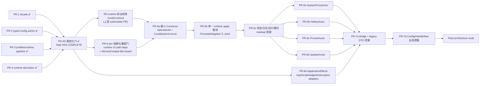

# Clash Nyanpasu Actor 迁移路线图 v3（稳定化优先）

**日期：** 2026-07-13
**状态修订：** 2026-08-02（§6 按**简化设计**整体重写：R0 → PR-5-pre → 5a → 5b → 5c；取代原 engine-first 表述；权威 spec `docs/superpowers/specs/2026-08-01-pr5-core-actor/`）
**状态：** Implementing（**PR-4S / S10 稳定化 COMPLETE**；S01～S10 已完成；手工 smoke `E-01`…`E-11` **PASS**——maintainer attestation 2026-07-18，权威 `smoke-evidence.md`，raw per-field artifacts 未保留；target-tip multi-OS CI PASS @ `10c837cd…` run 29635372676 / Q-09…Q-11；cleanup-tip multi-OS CI PASS @ `8909566c…` run 29638274786 / Q-18…Q-20；review thread-gate 已满足；**PR-5a UNLOCKED**；**PR-5 简化设计与任务卡就绪（2026-08-01 定稿，2026-08-02 §6 对齐重写；未实施）**。R-01…R-18 与 PR-5/6/7 仍未完成；**不得**宣告整条 actor migration 完成）

**范围基线：** `main @ 9886aacc750b691d6abc893808ddaaf9dfb6a538`（`fix(proxy): resolve provider-owned proxies (#4954)`；已包含 PR-4 `#4932`；S01 `daf872d9`；S02 `807f1733`；S03 工作区已验证；S04 工作区已验证：`CoreLifecycleLease` / 统一 lifecycle mutex / change_core lease span / updater stop-swap-restart；S05 Applied-based patch compensation 工作区已验证；S06 prepared mirrors / three-domain saga 工作区已验证；S07 profile materialization transactions / durable `Profiles.revision` / import fetch-before-commit / startup+periodic reconcile 工作区已验证；S08 `MutationOutcome` wire / Specta / frontend / import 终态协议 工作区已验证；S09 instance-owned `RebuildCoordinator` + test-only `fake-core` process matrix 工作区已验证）
**取代：** `actor-migration-roadmap.md` v2  
**权威顺序：** 已批准 design/spec > 本 roadmap > task card > implementation plan > 实现注释

---

## 0. 路线图定位

v2 已正确完成 profiles 域和 runtime 派生链的方向性迁移，但把“代码已合并”过早等同于“阶段已验收”。PR-1～PR-4 合并后仍存在跨锁域竞态、回滚读模型失真、typed state 与 legacy mirror 的幽灵失败、profile 状态与物化文件分裂、测试访问真实用户目录等问题。

v3 将迁移顺序改为：

```text
PR-1～PR-4 已合并
        ↓
PR-4S 稳定化门（必须完成）
        ↓
R0 runtime 协议收敛（上游 submodule，可与下一步并行）
        ↓
PR-5 CoreActor 四段式迁移（5-pre → 5a → 5b → 5c）
        ↓
PR-6 外围 actor / effect adapter
        ↓
PR-7 兼容层与全局清算
        ↓
最终架构验收
```

**原则：PR-4S 之前禁止开始 PR-7 清算；PR-5 可以只做设计和预研，不得在未关闭稳定化缺陷时合并生命周期切换。**

---

## 1. 锁定原则

### 1.1 服务分类保持不变

- 长生命周期可变状态、进程、定时器、watcher、下载、缓存、系统副作用：actor service。
- 纯计算、校验、patch、schema migration、runtime 构建：pure service。
- Tauri、文件系统、OS、网络、进程、日志：port / adapter。
- `NyanpasuClient` 是 facade，不是 service locator。

### 1.2 三种运行状态必须区分

后续实现不得再用一个 `RuntimeState` 同时表达三个事实：

1. **Desired**：用户已经提交的配置意图；
2. **Promoted**：已通过目标核心检查并晋升到产品文件的 runtime；
3. **Applied**：运行中的核心最后一次确认接受的 runtime。

四条 runtime 读 IPC 继续读取 Promoted，patch compensation 与运行态健康判断必须读取 Applied。

### 1.3 commit-first，但不伪装成回滚

普通配置 mutation 采用：

```text
validate → persist desired state → commit → reconcile side effects
```

副作用失败返回 `CommittedDegraded`，不得将已提交状态伪装成普通 `Err`。只有具有明确 all-or-nothing 契约的操作允许补偿回滚，例如：

- `change_core`；
- profile add 的初始文件创建；
- remote refresh 的文件与元数据双写；
- API-first patch 的即时运行态补偿。

原 v2 中“未来统一 ack-driven rollback”改判为：**ack 驱动 applied-state tracking、reconcile 与健康上报；不对普通 desired config 做通用回滚。**

### 1.4 bridge 的失败边界

过渡 bridge 必须满足：

- 所有可失败转换在 typed persistence 之前 prepare；
- typed persistence 之后的 mirror apply 必须不可失败；
- 跨三个 typed 域的 legacy patch 必须使用 version-checked saga；
- 任何部分提交必须结构化上报，不得只返回普通字符串错误。

### 1.5 跨资源事务必须显式设计恢复

YAML 状态、profile 文件、runtime 产品文件、进程和 OS 副作用不能假装处于单一数据库事务中。每条跨资源路径必须明确：

- 权威数据；
- prepare 点；
- commit 点；
- compensation；
- 崩溃恢复；
- 可观察 outcome。

### 1.6 测试绝不访问真实用户目录

测试图必须完全由注入的 `PathResolver` / `RuntimePaths` / fake adapters 构造。单元测试和集成测试禁止调用真实 `dirs::app_config_dir()`、真实系统代理、真实快捷键和真实核心二进制，除非是显式标记、隔离执行的手工 smoke job。

### 1.7 产物检查边界

unchecked candidate 必须位于应用私有 candidate 目录，使用不可预测名称、独占创建和受限权限。异常退出后的残留必须可清理。产品文件、Promoted store 和 checksum/revision 必须对应同一份字节。

### 1.8 验收证据属于实现的一部分

“手工验证”必须附：

- commit / build；
- OS；
- 核心类型；
- 测试步骤；
- 结果；
- 日志或 artifact。

未留下证据的 checklist 不计为阶段关闭。

---

## 2. 当前状态（2026-07-18）

| 阶段                         | 合并状态 | v3 验收状态 | 仍需处理                                                                                                                                                                                                                                                                                                                                                                                                                                                                                                              |
| ---------------------------- | -------: | ----------: | --------------------------------------------------------------------------------------------------------------------------------------------------------------------------------------------------------------------------------------------------------------------------------------------------------------------------------------------------------------------------------------------------------------------------------------------------------------------------------------------------------------------- |
| PR-1 `NyanpasuClient` facade |       ✅ | ⚠️ 条件通过 | S09 已关闭 process-global rebuild bridge 与不可重装测试图；结果语义与 PR-5/6 residual global desired-state isolation 仍待后续阶段                                                                                                                                                                                                                                                                                                                                                                                     |
| PR-2a/2b typed config actors |       ✅ | ⚠️ 条件通过 | S06 已关闭 mirror ghost Err 与三域 partial commit；仍需 SessionState 持久化策略复核                                                                                                                                                                                                                                                                                                                                                                                                                                   |
| PR-3-pre① snapshot store     |       ✅ |          ✅ | 保持纯逻辑与 contract tests                                                                                                                                                                                                                                                                                                                                                                                                                                                                                           |
| PR-3-pre② runtime executor   |       ✅ |     ✅/观察 | legacy parity 的已批准偏差持续登记                                                                                                                                                                                                                                                                                                                                                                                                                                                                                    |
| PR-3 profiles 域切换         |       ✅ | ⚠️ 条件通过 | S07 已补齐 profile 文件/状态事务 + import fetch-before-commit；S08 已将 crate-internal degradation 与 post-commit rebuild 合并为公共 `MutationOutcome`；已发生回归的 contract tests 继续固化                                                                                                                                                                                                                                                                                                                          |
| PR-4 runtime 派生化          |       ✅ | ⚠️ 条件闭环 | S03/S04 已补齐 promoted/applied + 统一 lifecycle lease；S05 已补齐 D6 Applied compensation；S09 已去全局化 dispatcher 并补齐 process-level fake-core matrix；S10 smoke + tip/cleanup CI 已 PASS；PR-5/6 residual globals 仍待后续阶段                                                                                                                                                                                                                                                                                 |
| **PR-4S 稳定化门**           |       ✅ |     ✅ 完成 | S01～S10 已完成。手工 smoke `E-01`…`E-11` **PASS**（maintainer attestation 2026-07-18；权威 `docs/superpowers/specs/2026-07-13-pr4s-actor-migration-stabilization/smoke-evidence.md`；raw per-field artifacts 未保留）；tip multi-OS CI PASS @ `10c837cd…` run 29635372676（Q-09…Q-11）；cleanup-tip multi-OS CI PASS @ `8909566c0bb759f562d420af4b9672469920fc21` run 29638274786（Q-18…Q-20）；review thread-gate 已满足；`REGEN_BRIDGE`/OnceCell first-install-wins 已删除。**PR-5a UNLOCKED**。R-01…R-18 未清零。 |
| PR-5 CoreActor               |   未开始 |           — | **已解锁**；**简化设计**/任务卡就绪（2026-08-01 定稿，2026-08-02 §6 对齐）；阶段序 R0 → PR-5-pre → 5a → 5b → 5c；权威 spec `docs/superpowers/specs/2026-08-01-pr5-core-actor/`                                                                                                                                                                                                                                                                                                                                        |
| PR-6 外围 actors/effects     |   未开始 |           — | 必须在 PR-5 生命周期稳定后实施                                                                                                                                                                                                                                                                                                                                                                                                                                                                                        |
| PR-7 清算                    |   未开始 |           — | 只允许删除，不再承载行为迁移                                                                                                                                                                                                                                                                                                                                                                                                                                                                                          |

当前“已合并工作量”约为原 v2 的一半以上，但“纯净端态验收”仍未过半。剩余阶段控制的是风险最高的进程生命周期、OS 副作用和兼容层清算。

---

## 3. PR-1～PR-4 缺陷与回归台账

| ID    | 来源   | 缺陷                                                                                           | 责任阶段                                                                                                                                                                                                                                                                                            |
| ----- | ------ | ---------------------------------------------------------------------------------------------- | --------------------------------------------------------------------------------------------------------------------------------------------------------------------------------------------------------------------------------------------------------------------------------------------------- |
| S-R1  | PR-4   | `change_core` 仅持 `rebuild_gate`，未与所有 `CoreManager::run_core()` 调用共享完整生命周期锁域 | PR-4S / S04 已关闭（`CoreLifecycleLease` + 统一 lifecycle mutex；change_core 全程持有 lease 至 rollback 结束；updater stop/swap/restart 同锁域）                                                                                                                                                    |
| S-R2  | PR-4   | 深层 rollback 恢复产品文件但未恢复 runtime read model                                          | PR-4S / S03 已关闭（transaction snapshot 同步恢复 product/Promoted/Applied）                                                                                                                                                                                                                        |
| S-R3  | PR-2   | actor 先 `upsert`，再 mirror；mirror 失败导致“已提交但返回 Err”                                | PR-4S / S06 已关闭（fallible prepare-before-persist；infallible in-memory apply-after-persist；prepare failure 零提交）                                                                                                                                                                             |
| S-R4  | PR-2   | legacy `IVerge` patch 顺序写三个 actor，无 version check 与 compensation                       | PR-4S / S06 已关闭（manager-level expected-version CAS；Application→Session→Clash saga；reverse compensation；structured `PartialCommit`）                                                                                                                                                          |
| S-R5  | PR-1/4 | process-global `REGEN_BRIDGE` first-install-wins，通道无界，测试图不可重装                     | PR-4S / S09 已关闭（instance-owned capacity-1 coalescing `RebuildCoordinator` + Weak worker + direct typed requests + explicit shutdown；生产 exit 经 `cleanup_processes` 调用 `client.shutdown()`）。PR-5/6 residual：legacy `Config`/`CoreManager` global 仍非 full graph desired-state isolation |
| S-R6  | PR-3   | profiles 状态先提交、文件后操作；warning 仅日志，调用方可能得到 `Ok`                           | PR-4S / S07+S08 已关闭：事务 + crate-internal degradation + 公共 `MutationOutcome`/`committed_degraded` wire；import 改为 fetch-before-commit                                                                                                                                                       |
| S-R7  | PR-3   | remote refresh 文件已更新而元数据 persist 失败时缺少文件恢复                                   | PR-4S / S07 已关闭（file-first promote → state CAS → complete/compensate；**仅** manual/scheduled refresh；import 不走此路径）                                                                                                                                                                      |
| S-R8  | PR-4   | D6 compensation 以 Promoted 代替 Applied，不能删除新增键，缺少 patch serialization             | S05 已关闭；Applied owner/gate 迁入 CoreActor 留给 PR-5b                                                                                                                                                                                                                                            |
| S-R9  | PR-4   | candidate 位于共享 temp、名称可预测、权限与崩溃清理不足                                        | PR-4S                                                                                                                                                                                                                                                                                               |
| S-R10 | PR-4   | rollback 单测写真实用户 runtime 产品路径                                                       | PR-4S                                                                                                                                                                                                                                                                                               |
| S-R11 | PR-3   | migration、specta wire、本地导入、remote options、mixed-port 即时性发生过回归                  | PR-4S contract suite                                                                                                                                                                                                                                                                                |
| S-R12 | 文档   | roadmap 多章节指标和状态互相冲突，已合并 PR 仍标“进行中”                                       | PR-4S 文档收尾                                                                                                                                                                                                                                                                                      |
| S-R13 | PR-2/6 | `feat::patch_verge` 在配置提交前执行多组 OS/UI 副作用，失败后无法完整撤销                      | PR-6a/6b/6e；PR-4S 固化 outcome 契约                                                                                                                                                                                                                                                                |
| S-R14 | PR-4   | PR-4 五项真实环境 smoke 没有可审计完成记录                                                     | PR-4S / S10 已关闭：`E-01`…`E-11` **PASS**（maintainer attestation 2026-07-18；权威 `smoke-evidence.md`；raw per-field artifacts 未保留）；cleanup-tip CI PASS @ `8909566c…` run 29638274786（Q-18…Q-20）                                                                                           |

PR-4S 必须解决 S-R1～S-R12、S-R14；S-R13 的行为迁移留给 PR-6，但 PR-4S 必须先定义统一的 `CommittedDegraded` 与 effect health 协议。

---

## 4. 修正后的依赖图


```mermaid
flowchart LR
  P1["PR-1 facade ✅"] --> S
  P2["PR-2 typed config actors ✅"] --> S
  P3["PR-3 profiles/runtime pipeline ✅"] --> S
  P4["PR-4 runtime derivation ✅"] --> S

  S["PR-4S 稳定化门 ✅\nTask R4S COMPLETE"] --> R0["R0 runtime 协议收敛\nCoreErrorKind\n(上游 submodule PR)"]
  S --> P5P["PR-5-pre 依赖与兼容门\nruntime v2 path deps\n+ ServiceCompat fail-closed"]
  R0 --> P5A
  P5P --> P5A["PR-5a 最小 CoreActor\nOperationId + CoreBackend enum"]
  P5A --> P5B["PR-5b 单一 runtime apply 管线\nPromoted/Applied 入 actor"]
  P5B --> P5C["PR-5c 状态/日志/运行模式\nresidual 清理"]

  P5C --> P6A["PR-6a SystemProxyActor"]
  P5C --> P6B["PR-6b HotkeyActor"]
  P5C --> P6C["PR-6c ProxiesActor"]
  P5C --> P6D["PR-6d UpdaterActor"]
  S --> P6E["PR-6e ApplicationEffects\ntray/locale/widget/interruption adapters"]

  P6A --> P7A
  P6B --> P7A
  P6C --> P7A
  P6D --> P7A
  P6E --> P7A
  P7A["PR-7a bridge + legacy DTO 清算"] --> P7B["PR-7b Config/Handle/feat 全局清算"]
  P7B --> FINAL["Final architecture audit"]
```

### 并行性

- PR-4S 是单一原子稳定化门，内部允许按 commit lane 并行开发，但只允许一个 PR 整体合并。
- R0 是 `nyanpasu-runtime` **上游 submodule** 的独立 PR，可与 PR-5-pre 并行开发，二者互不阻塞；但 PR-5a 消费 typed `CoreErrorKind` 之前，R0 必须先合并并 bump submodule。R0 在用户授权 push 之前只做 submodule 内本地提交。
- PR-5-pre/5a/5b/5c 严格串行，各自独立 PR，每个合并后 `main` 保持 shippable。
- PR-6a～6d 可在 PR-5c 后并行；PR-6e 可在 PR-4S 后预先开发，但最终接线不得早于 PR-5c。
- PR-7 只能做删除、调用点切换收尾和 denylist，不再引入新行为模型。

---

## 5. 新增 Task R4S — PR-1～PR-4 稳定化门

**目标：** 在继续 actor 化之前，修复已合并架构的事务、回滚、路径、测试和回归保护缺陷，建立可验证的 desired/promoted/applied 模型。

**分支建议：** `fix/pr4s-actor-migration-stabilization`  
**设计：** `docs/superpowers/specs/2026-07-13-pr4s-actor-migration-stabilization/design.md`  
**任务卡：** `docs/superpowers/specs/2026-07-13-pr4s-actor-migration-stabilization/task.md`

### R4S 强制交付物

1. `RuntimePaths` 全量注入，candidate/product 不再通过全局 dirs 解析；
2. 私有 candidate 目录、随机名、权限、RAII cleanup、启动残留清理；
3. `RuntimeLifecycleState { promoted, applied }` + revision/hash；
4. 全换核事务和任意 start/restart/stop 共享生命周期 lease；
5. rollback 同时恢复 product、Promoted、Applied 和 selected core；
6. D6 patch gate + Applied-based compensation + 键删除能力；
7. prepared mirror：可失败转换在 typed commit 前，commit 后 apply 不可失败；
8. legacy 三域 patch 的 version-checked saga；
9. profile materialization prepare/finalize/compensate；warning 进入 wire；
10. bounded/coalescing rebuild channel；去除 first-install-wins 测试污染；
11. PR-3/4 回归 contract suite；
12. fake-core failure-injection 与可追溯三平台 smoke 记录；
13. roadmap 状态和 grep 指标自动生成或 CI 校验。

### S05–S10 disposition（压缩状态交叉引用；S10 已关闭稳定化门）

| Step | Status                                                | Summary（一行）                                                                                                                                                | Residual / deferred                                                                                                                                    | Spec cross-ref                                                                                       |
| ---- | ----------------------------------------------------- | -------------------------------------------------------------------------------------------------------------------------------------------------------------- | ------------------------------------------------------------------------------------------------------------------------------------------------------ | ---------------------------------------------------------------------------------------------------- |
| S05  | 已完成/工作区已验证；S10 后稳定化门关闭               | Applied-based `Set`/`Remove` compensation + instance-owned patch gate + revision fence + private candidate direct apply（P3/P1）                               | PR-5b：gate / Applied owner 迁入 CoreActor mailbox                                                                                                     | `design.md` §6.7 / D6；`task.md` S05                                                                 |
| S06  | 已完成/工作区已验证；S10 后稳定化门关闭               | Fallible prepare-before-persist；infallible in-memory apply；manager CAS；Application→Session→Clash saga + reverse compensation；structured `PartialCommit`    | PR-7a：随 legacy mirror/saga 删除 `PrepareReplace` / `ReplacePreparedIfVersion` / `PreparedTypedReplace`；manager CAS 可保留                           | `design.md` §6.8–6.9 / D7–D8；`task.md` S06                                                          |
| S07  | 已完成/工作区已验证；S10 后稳定化门关闭               | Durable `Profiles.revision`；state-first / file-first / cleanup / reconcile；import fetch-before-commit；startup+periodic recovery；crate-internal degradation | 公共 wire 已由 S08 映射；手工 smoke **PASS**（权威 `smoke-evidence.md`）；稳定化 closeout 由 S10 完成                                                  | `design.md` §6.10 / D9；`task.md` S07                                                                |
| S08  | 已完成/工作区已验证；S10 后稳定化门关闭               | 公共 `MutationOutcome` / `Degradation` wire + Specta/frontend；H1/H2；import 终态；粗粒度 `RuntimeBuild` rebuild 映射                                          | RuntimeCheck/Promote/Apply 相位保真延期；full workspace green 经 S10 tip + cleanup-tip CI 宣称                                                         | `design.md` §6.11 / §9；`task.md` S08；`smoke-evidence.md` A-proxy only                              |
| S09  | 已完成/工作区已验证；S10 后稳定化门关闭               | 删除 `REGEN_BRIDGE`/OnceCell；instance-owned capacity-1 `RebuildCoordinator`；test-only `fake-core` process matrix；生产 `client.shutdown()`                   | PR-5/6 residual：legacy `Config`/`CoreManager` global（非 full graph isolation）；service-mode / TUN / true-core UI 的 S10 手工 `E-01`…`E-11` **PASS** | `design.md` §6.12–6.13 / §8.5；`task.md` S09；`smoke-evidence.md` E-records **PASS**（attestation）  |
| S10  | **COMPLETE** — PR-4S 稳定化门关闭；**PR-5a UNLOCKED** | Review disposition Path A；residual ledger R-01…R-18（非零）；tip CI Q-09…Q-11；cleanup-tip CI Q-18…Q-20 @ `8909566c…` run 29638274786；smoke E-01…E-11 PASS   | 不实现 CoreActor/effects/PR-7；不宣称 residual 清零或整条 actor migration 完成                                                                         | `review-disposition.md`；`residual-ledger.md`；`smoke-evidence.md` Q-09…Q-11 / Q-18…Q-20 / E-01…E-11 |

### R4S 退出判据

- 四个 unresolved PR-4 review finding 有代码和测试处置；
- 任何换核失败分支均满足产品文件、Promoted、Applied、selected core 一致；
- actor mirror 失败不能产生“状态已提交但普通 Err”；
- profile add/refresh 的文件故障有确定 compensation；import cancel/fail 零 state/file 且无 placeholder delete；
- 全部自动测试零访问真实用户配置目录；
- #4893、#4916、#4917/#4920、#4921 对应回归 fixture 通过；
- PR-4 的五项 smoke 全部附可审计记录；
- `cargo test --workspace --all-features`、前端 build/typecheck、bindings freshness 全绿。

---

## 6. PR-5 — Core 生命周期迁移（简化设计；R0 + 四段式；2026-08-02 重写）

> **修订说明（2026-08-02）**：本节此前为 "engine-first 四段式"，描述 `CoreEngine` trait / `LocalCoreEngine` / `ServiceCoreEngine`、actor 层延迟 `Recover` 二次恢复、`ChangeCoreReport` 专用 wire，以及 A1–A8 / B1–B5 / C1–C6 编号。该设计已被**简化设计**取代，本节按新 spec 整体重写。
> 简化依据：`backend/nyanpasu-runtime` submodule（tag `v2.0.0-rc.1`）里的 `nyanpasu-core-manager` / `nyanpasu-service` 已经具备 manager、状态机、有界恢复、配置应用分类与回滚能力。PR-5 因此只新增**一层应用事务协调**，不在 `clash-nyanpasu` 里重做一遍。
> **语义权威**：`docs/superpowers/specs/2026-08-01-pr5-core-actor/design.md`（设计正文）与同目录 `task.md`（任务清单：R0 / P1–P2 / A1–A3 / B1–B4 / C1–C4）。
> **release-gate**：dev 渠道接受 rc.1；**stable 渠道发布前 submodule 须 bump 到上游正式 v2.0.0**。

### 6.总览 — 核心收敛

PR-5 **只**新增三样东西：

1. `CoreActor` —— GUI 进程内的核心所有权、运行后端选择、Promoted / Applied 状态、跨步骤事务排他；
2. 取消安全的 `OperationId` / `CoreOperationGuard` —— 替代 `rebuild_gate`、`clash_patch_gate` 和 legacy lifecycle mutex；
3. 封闭 `CoreBackend` enum —— `{ Local, Service, #[cfg(test)] Test }`。

**明确不新增**：`CoreEngine` trait / `CoreEngineFactory`、`EngineStatus` / `EngineRevision` / `ApplyReport` / `EngineError` 等类型镜像、actor 层第二层自动恢复、actor 持有的 clash-api client、`ChangeCoreReport` 专用 wire。

### 6.R0 — `nyanpasu-runtime` 协议收敛（上游 submodule PR）

**性质：** 这是 `backend/nyanpasu-runtime` **上游仓库**的独立 PR，不是 `clash-nyanpasu` 的 PR。实施时只在 submodule 内建本地分支并本地提交；**未经用户显式授权不得 push，也不得在本仓库 bump submodule 指针**。

**范围：**

- `nyanpasu-core-metadata` 增加 `CoreErrorKind` enum，serde 字符串保持现有 `error_kind` 值；
- `nyanpasu-core-manager::Error::kind()` 返回该 enum，durability wrapper 递归返回 source kind；
- service error envelope 与 IPC client 复用同一 enum，v2 wire golden 不变；
- 不新建 crate，不引入通用 `CoreEngine` trait。

**退出：** manager / service / client 不再各自维护第二份 error-kind match 或字符串表；v2 wire golden 全绿；submodule bump 后 clash app 可直接消费 typed kind。

**依赖关系：** R0 与 PR-5-pre **可并行**，互不阻塞（PR-5-pre 只做依赖切换与兼容门，不消费 typed kind）。PR-5a 若要消费 typed `CoreErrorKind`，必须先合并 R0 并 bump submodule。

### 6.0 PR-5-pre — 依赖与 daemon 兼容门（不引入 CoreActor）

**实施计划：** `docs/superpowers/plans/2026-08-01-pr5-pre.md`

**范围：**

- workspace 依赖 `nyanpasu-utils` / `nyanpasu-ipc` 由 git 切至 submodule path 依赖；`[workspace] exclude = ["nyanpasu-runtime"]`；删除 `[patch."…nyanpasu-service.git"]` 块并清掉失效注释；更新 Cargo.lock；
- **只切这两个 crate**。`nyanpasu-core-manager` / `nyanpasu-core-metadata` / `clash-api` 的 workspace 条目**推迟到 PR-5a 的首个真实消费者**——leader 裁定 D1=A（2026-08-02），是对 task.md P1 卡"四个 crate"措辞的**有意偏离**：无人引用的 `[workspace.dependencies]` 条目不进入 Cargo.lock 解析图，属死文本；且 `nyanpasu-core-metadata` 本就随 ipc v2 传递进来；保持依赖/体积增量完全可归因于这一次切换；
- `StatusInfo` specta 面扩宽 + additive compat 字段的 bindings regen；
- **`ServiceCompat` 主版本 fail-closed 门禁**：v1.4.5 的 `/status` 是 v2 结构的严格子集、必然静默解码成功，所以门禁必须是**显式 semver 主版本比较**，且必须先于任何 `/core/*` 调用存在；旧 v1 daemon 永不进入 Service backend；
- **保留启动时自动版本对比 + `update_service()` 语义**（`2.0.0-rc.1 > 1.4.5` 会自动触发升级；兼容门只是用户拒绝或升级失败时的 fail-closed 兜底）；
- 记录发布二进制体积变化。

**退出：**

- `cargo metadata` exit 0；Cargo.lock 零 `nyanpasu-*` git source、`nyanpasu-utils` 单份；
- workspace tests 绿；bindings fresh；
- **architecture ledger gate 绿**——允许且仅允许 `migration_markers` +1（兼容门接在 legacy `IpcState` seam 上的那条 `TODO(actor-migration)` 注释），snapshot 相应重写后 gate 必须 exit 0；其余四项指标不得变动；
- v1.4.5 fixture 下没有 `/core/*` 请求；
- 本阶段不引入 CoreActor。

### 6.1 PR-5a — 最小 CoreActor + `OperationId` + backend enum（A1–A3）

**范围：**

- **A1 `CoreBackend`**：封闭 enum `{ Local, Service, #[cfg(test)] Test }`，**不定义 `CoreEngine` trait / factory**。`Local` 直接包装 `nyanpasu_core_manager::CoreManager`，构造 `ManagerOptions` 时**显式写出 `LocalIpcPolicy::Disable`**（上游默认值已是 `Disable`，显式化是为了让安全门在 app 侧可见可审）；`Service` 使用实例化的 `nyanpasu_ipc::client::Client`，禁止 `service_default()`。只实现 check / start / apply / stop / restart / recover 与状态、日志订阅所需方法；Local 的 apply 结果转换为现有 `CoreApplyData`，**不定义 `ApplyReport`**；
- **A2 取消安全 `OperationId`**：ID 由共享的 `CoreClient` 在发送 `AcquireOperation` **之前**预分配，并先构造 pending `CoreOperationGuard`，消除"actor 已登记 active、调用 future 先被取消"的窗口。actor 维护 active operation + FIFO waiters；`ReleaseOperation` 同时承担"释放 active"与"取消 waiter"；mutation 校验 active `OperationId`，不匹配返回 `StaleOperation`；status / log / lifecycle read 不需要 guard；shutdown 拒绝全部 waiters 后关闭 backend。**不实现 TTL、auto-steal、watchdog、续期或心跳**；
- **A3 接入现有生命周期 seam**：先让 `CoreClient` / `CoreOperationGuard` 实现既有 `CoreLifecyclePort` / `CoreLifecycleLease` 兼容 seam，使 rebuild / change-core 调用点在 5a 暂不重写；旧 trait 名不得扩散到新代码。setup 注入 `CoreClient`，start / stop / restart / status 改走 actor；
- **恢复策略**：自动恢复完全由 runtime / daemon 负责（manager 已按 `InstanceOptions` 做有界 Supervisor 重启 + 指数退避）。**actor 不配置第二层 `RecoverPolicy`，不发 delayed `Recover{attempt}`**；它只观察最终状态，在 Supervisor / daemon 最终放弃后发布一次 `core_recovery_exhausted` degradation，并在用户显式重试时调用 `recover` / `restart`。删除 legacy `CoreManager::lifecycle_lock` 与裸线程递归 recover。

**退出：** operation 测试覆盖 FIFO、等待取消、刚获批取消、stale `ReleaseOperation`、wrong-id mutation、shutdown drain；Local / Service 基本生命周期 parity 测试；legacy core 生命周期不再被新调用点使用。

### 6.2 PR-5b — 单一 runtime apply 管线（B1–B4）

**范围：**

- **B1 Promoted / Applied 入 actor**：`CheckAndPromote` 在 `CoreOperationGuard` 下校验 candidate hash、dry-run、原子 promote 并推进 Promoted；`ApplyPromoted` / `StartPromoted` 按 backend outcome 推进 Applied。`CoreClient` 通过 watch snapshot 暴露 lifecycle（读状态不发 mailbox RPC），删除 `NyanpasuClient` 侧独立的 `RuntimeLifecycleStore` 与 `publish_promoted` / `publish_applied` / `restore_promoted`；四条 runtime 读 IPC 继续读 Promoted；
- **B2 `CoreOperationGuard` 替换 app locks**：所有 rebuild / regenerate / start / change-core 在读取 snapshots **之前**取得 guard，事务结束后释放；删除 `rebuild_gate`；保留 rebuild worker 的 capacity-1 coalesce，构建期间发生的新 commit 触发下一次 rebuild；
- **B3 删除 API-first patch 与补偿层**：所有运行配置变更统一走 runtime 的 full-config `apply_config`，由 runtime 自行决定 `PATCH /configs` / `PUT /configs` / same-epoch restart / core switch / rollback。`patch_running_config` 改为 typed desired commit + 统一 rebuild/apply；删除 `RunningConfigPatchPort`、`LegacyRunningConfigPatchBridge`、`clash_patch_gate`、`ControllerBinding` 与 actor 内 clash-api client cache、`config_patch_from_mapping`、GUI 侧 patch compensation plan/fence。其余 proxies / connections / ws / tray 等直接 clash-api 消费者留给 PR-6；
- **B4 简化 ChangeCore**：换核降级为**普通 commit-first mutation**——`ApplicationClient::patch(core = new)` 后复用统一 apply 管线。runtime 若返回 `RolledBack`，则保留 desired 新核与 Promoted 新配置、返回 `CommittedDegraded { phase: CoreRollback }`，**不执行第二套应用层回滚事务**。删除 legacy verge draft/discard、rollback rebuild、product bytes restore、old-core 第二次 restart 与 `ChangeCoreReport` 专用 wire；前端复用通用 `RuntimeApplyReport` / `MutationOutcome` 展示 degraded。
  > 这**取代**了原 OQ-3 关于 `MutationOutcome<ChangeCoreReport>` 五分支映射的裁定——该裁定已被简化设计取代。

**退出：** `rg 'rebuild_gate|clash_patch_gate|RunningConfigPatchPort|LegacyRunningConfigPatchBridge'` 为 0；apply parity 覆盖 Noop / Patched / Reloaded / Restarted / Switched / RolledBack（Warning 是正交标志，不是 outcome）；change-core rollback 测试断言 desired=new、Promoted=new、Applied=old；两个并发 rebuild 不重叠，后一个在 FIFO 后读取最新 snapshot。

### 6.3 PR-5c — 必要清理，不做指标驱动半迁移（C1–C4）

**范围：**

- **C1 状态与日志**：backend status / events 投影到 actor 的 watch snapshot，status read 不走 mailbox RPC；actor 维护 100 条 `LogFrame` 环形缓冲（直接复用 `nyanpasu-core-metadata::LogFrame`，**不定义 `LogSink` trait**，manager 的 JSONL sink 保持原样），`get_clash_logs` 从 raw 渲染、可 additive 暴露 frames；删除 legacy `Logger` global；
- **C2 运行模式**：`RunType = { Normal, Service }`（`Elevated` 的 `todo!()` 删除）。app config / service control 完成后**显式**调用 `set_mode` / `reconcile_mode`，该操作照常排队取得 `CoreOperationGuard`；删除 `pending_run_type` 设计、`core/service/ipc.rs` 的 statics 与 5 s 轮询线程。service install / update / uninstall 保持独立的具体 `ServiceController`，**不迁入 CoreActor、不引入完整 `ServiceControlPort`**（除非测试确实需要替换 OS command runner）；**保留启动时自动版本对比 + `update_service()` 语义**；
- **C3 macOS DNS**：actor 内用小型 `MacosDnsGuard` 与 start / stop 保序，Service backend 走 IPC `set_dns`；**非 macOS 不定义空的 `NetworkDnsPort` 抽象**；
- **C4 residual 与 smoke**：删除真正已失去调用者的 core / service / logger 文件与 globals；**Updater 不增加 `attach_core_port` 半迁移桥**——完整注入仍由 PR-6d 完成，PR-5 允许保留一个有明确 owner 和 remove condition 的 residual；更新 roadmap / ledger，**不以 `CoreManager::global() == 0` 作为牺牲边界的硬指标**。

**退出：** smoke 1 = Local 模式 patch / restart / core-switch rollback；smoke 2 = Windows v1 daemon 自动升级后进入 v2 Service 模式，拒绝升级时 fail-closed 回 Local；smoke 3 = macOS TUN 开关与 DNS 恢复；fixed-port 占用作为**自动化集成测试**，不要求单独手工 smoke；`test_real_dirs == 0`。

### 6.4 阶段规划必答项（2026-08-02 审查遗留）

以下四项在 2026-08-02 的对抗性审查中被记录，**不阻塞本节定稿**，但对应阶段的实施计划**必须**给出明确答案后才能开工：

| ID    | 必答项                                                                                                                                                                                                                                                       | 责任阶段        |
| ----- | ------------------------------------------------------------------------------------------------------------------------------------------------------------------------------------------------------------------------------------------------------------ | --------------- |
| RQ-01 | 完整的 **post-commit failure matrix**：commit **前**失败一律返回 `Err`；commit **后**失败一律映射为 `MutationOutcome` 的 degraded phase。必须逐项覆盖 operation acquire 超时、build 失败、check 失败、promote 失败、revision 冲突、IPC 连接丢失、apply error | PR-5b 计划      |
| RQ-02 | **engine revision 的 app 侧处理**：Local 的 `RevisionId` 与 Service 的 `RevisionIdInfo` 如何存储、刷新、重连后对账、冲突如何解；以及 `expected_revision` 的 CAS 语义——`None` 表示无条件应用，**仅允许出现在首次 start**                                      | PR-5a / 5b 计划 |
| RQ-03 | apply parity 矩阵必须包含 **`Noop`**；`Warning` 视为与 outcome **正交的标志位**，不得当成一个 outcome 分支                                                                                                                                                   | PR-5b 计划      |
| RQ-04 | `begin_operation` 必须有**调用侧有限超时**；等待中的 waiter 经既有 `ReleaseOperation` drop 路径取消。**不引入 TTL、auto-steal 或 watchdog**                                                                                                                  | PR-5a 计划      |

---

## 7. PR-6 — 外围 actor 与 application effects

### 7.1 PR-6a `SystemProxyActor`

- 独占 system proxy、auto-launch、guard timer 和 PAC；
- 接收 `Reconcile(desired_revision, desired_state)`；
- 返回/发布 `EffectStatus { desired_revision, applied_revision, health }`；
- 删除 `Sysopt::global()`。

### 7.2 PR-6b `HotkeyActor`

- 独占快捷键注册表和 OS shortcut adapter；
- callback 只调用 facade API，不反向依赖 `feat::*`；
- 删除 KV/verge 双读桥和 `Hotkey::global()`。

### 7.3 PR-6c `ProxiesActor`

- 独占 proxy cache、checksum、订阅、select；
- 核心 revision 变化触发 refresh/reconnect；
- tray 与 IPC 只走 ProxiesClient；
- 删除 `ProxiesGuard::global()`。

### 7.4 PR-6d `UpdaterActor`

- 独占 manifest、下载任务和进度；
- 完成的新核心通过 CoreClient 交付；
- 删除 `UpdaterManager::global()`。

### 7.5 PR-6e `ApplicationEffects`

此阶段不新建无必要的 god-actor。采用：

- pure `ApplicationEffectPlan::diff(before, after)`；
- 窄 `ApplicationEffectsPort`；
- Tauri/locale/tray/widget/connection-interruption concrete adapter；
- facade 在配置 commit 后发起 reconcile，并返回/发布结构化 degradation；
- 将 `feat::patch_verge` 中 tray、locale、logger refresh、widget、connection interruption 编排迁出。

主线程限制由 adapter 处理，不允许业务层 import Tauri。

---

## 8. PR-7 — 清算（只做删除与最终切换）

### 8.1 PR-7a — bridge 与 legacy wire 清算

删除：

- `bridge/` 全部运行期 mirror/reseed；
- `state/mirror.rs`，包括 `PreparedLegacyMirror`、各 legacy bridge trait 和 `PreparedTypedReplace<T>`；
- Application / Session / Clash actor 与 typed client 中仅为 legacy mirror/saga 服务的 `PrepareReplace`、`ReplacePreparedIfVersion`、`prepare_replace()` 和 `replace_prepared_if_version()`；
- `NyanpasuClient` 中的 `PreparedConfigDomain`、`CommittedConfigDomain`、legacy 三域 saga、reverse compensation 和 legacy `PartialCommit` reconciliation 路径；
- `run_legacy_*`、`route_verge_patch`、`patch_verge_entrypoint`；
- legacy `IVerge`/`IClashTemp` IPC DTO；
- process-global rebuild dispatcher；
- 所有 `TODO/FIXME(actor-migration)`。

清算顺序固定为：先将最后的 production caller 从 legacy `IVerge` patch/replace 路由迁出，再删除三域 saga/finalizer，随后删除 prepared mirror 类型和 actor/client 消息，最后简化三个 actor 的普通 commit 路径。`PersistentStateManager::replace_if_version` 不属于 legacy bridge：若仍有非 legacy 条件写入调用，actor 消息改为直接携带 typed state 的 `ReplaceIfVersion { expected_version, state }`；若无生产调用，则删除 actor/client conditional API。验收时 `rg` 不得再命中 `PreparedLegacyMirror|PreparedTypedReplace|PrepareReplace|ReplacePreparedIfVersion|apply_legacy_verge_.*_saga`。

### 8.2 PR-7b — Config / Handle / feat 清算

删除：

- `Config::global()`、`Draft<T>`、legacy ManagedState；
- `Handle::global()`、`consts::app_handle()`；
- `feat.rs` 编排中心；
- 最后残留的 service-locator API。

PR-7b 完成后，允许保留的进程级静态值只能是 immutable constant / lookup table / feature flag，并进入显式 allowlist。

---

## 9. 统一 outcome 与健康模型

建议 wire / domain 结果：

```rust
pub enum MutationOutcome<T> {
    Applied { value: T },
    CommittedDegraded {
        value: T,
        degradations: Vec<Degradation>,
    },
}

pub struct Degradation {
    pub phase: DegradationPhase,
    pub code: String,
    pub message: String,
    pub retryable: bool,
}
```

`DegradationPhase` 至少覆盖：

- `LegacyMirror`（仅 PR-7 前）；
- `ProfileMaterialization`；
- `RuntimeBuild`；
- `RuntimeCheck`；
- `RuntimePromote`；
- `RuntimePublish`；
- `RuntimeApply`；
- `CoreRollback`；
- `SystemEffect`；
- `UiEffect`。

前端对 committed-degraded 仍视为 mutation success，但展示可本地化的 phase/code，并保留详细 error chain 到日志。

---

## 10. 自动化验收矩阵

| 场景                                     | 自动化要求                                          |
| ---------------------------------------- | --------------------------------------------------- |
| candidate check 失败                     | product/promoted/applied 均保持旧值                 |
| product promote 成功、store publish 失败 | 明确权威和 recovery；不得静默                       |
| apply 失败                               | promoted 新、applied 旧，outcome degraded           |
| change_core 新核 start 失败              | `CoreOperationGuard` 阻止并发 restart               |
| rollback rebuild 失败                    | 恢复旧 product + promoted + applied                 |
| rollback old-core restart 失败           | 最终状态结构化为 stopped/degraded                   |
| actor mirror prepare 失败                | typed state 不提交                                  |
| mirror apply                             | 设计为不可失败，并有单测证明                        |
| 三域 patch 第二域失败                    | 第一域 version-checked compensation                 |
| profile add 文件 finalize 失败           | state 回滚或明确 materialization error，不返回裸 Ok |
| remote refresh metadata persist 失败     | 恢复旧文件                                          |
| delete 文件 cleanup 失败                 | state 保持删除，持久 cleanup job + warning          |
| 并发 patch                               | patch gate 保序，补偿不覆盖更新的 revision          |
| 测试路径                                 | 所有 product/candidate/profile 路径都在 TempDir     |
| migration 回归                           | IPv6、legacy defaults、local/remote wire fixtures   |
| mixed-port                               | fixed/random、端口占用、立即生效                    |

---

## 11. CI 与文档门

新增/加强：

1. `architecture-ledger` 脚本生成：
   - `Config::*()` 调用数；
   - `::global()` 调用数；
   - actor-migration TODO；
   - bridge 文件；
   - legacy DTO 引用；
   - 测试中的真实 dirs 调用。
2. 生成结果与 roadmap committed snapshot diff；不一致则 CI fail。
3. PR 模板要求填写：
   - design 决策；
   - failure matrix；
   - automated tests；
   - manual smoke evidence；
   - residual bridge ledger。
4. 未解决的 review thread 不得在无 disposition 记录时合并；若延期，必须进入 roadmap 风险台账并指定负责阶段。

---

## 12. 最终成功判据

迁移完成必须同时满足：

- 所有 mutable state 有单一 actor/manager owner；
- 所有进程与长期任务由 actor 监督；
- facade API 不暴露 raw actor refs/service lookup；
- Tauri、OS、FS、network、process 全部在 adapters 后；
- runtime desired/promoted/applied 可观测且 revision 一致；
- 普通配置 mutation 使用 committed/degraded，不伪装回滚；
- all-or-nothing operation 有测试覆盖的 compensation；
- `Config::global()`、服务 `::global()`、bridge、legacy DTO、`feat.rs` 为零；
- 测试零访问真实用户目录；
- Windows/macOS/Linux 真实打包 smoke 有可审计记录；
- roadmap 指标由自动化生成，不再靠手工数字。

---

## 13. 明确延期项

以下不阻塞 actor migration v3 完成：

- snapshot graph UI；
- runtime incremental subtree rebuild；
- 跨进程分布式事务；
- generic event-sourcing；
- 为单一 adapter 过度抽象通用框架。

任何延期项不得被用作保留 mutable global、隐藏兼容层或跳过失败恢复设计的理由。
