# PR-5 CoreActor 迁移路线图（专项）

**日期：** 2026-08-04
**范围：** R0 + PR-5-pre + PR-5a…5e
**与既有文档的关系：**

- `docs/design/actor-migration-roadmap.md` §6 是**全局路线图**里的 PR-5 段，只给阶段划分与依赖。
- `docs/superpowers/specs/2026-08-01-pr5-core-actor/{design,task}.md` 是**权威 spec**。
- **本文是 PR-5 的专项路线图**：把已落地的结构用时序图 / 状态机图 / 消息图画出来，作为拆分 PR 的审查索引。**本文不新增设计决策**；任何与 spec 冲突之处以 spec 为准。

> **状态标注约定**：✅ 已实施且阶段门已关闭　🟡 规划中、尚未定稿　⛔ 未开工
>
> | 阶段 | 状态 | 备注 |
> | --- | --- | --- |
> | R0 上游协议 | ✅ | 上游 PR #390 OPEN / MERGEABLE，**未合并** |
> | PR-5-pre | ✅ | |
> | PR-5a | ✅ | 阶段审 96/100 |
> | PR-5b | ✅ | 阶段审三轮闭合 |
> | PR-5c | ✅ | 阶段审 92/100 |
> | PR-5d | 🟡 | v8，对抗审 **REJECT 47/100** |
> | PR-5e | 🟡 | v2，对抗审 **REJECT 43/100**，且 fixture 硬前置未解 |

---

## 1. 阶段依赖

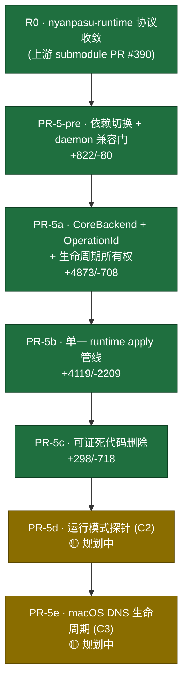

**耦合方向是单向的**：5e 依赖 5d（拆 DNS 要在控制动作前、重施加要挂在收敛尾部、恢复要进 `Shutdown` 臂），**5d 不依赖 5e**。

---

## 2. 所有权模型

PR-5 的核心是把三类可变状态从进程级全局收进 `CoreActor`：

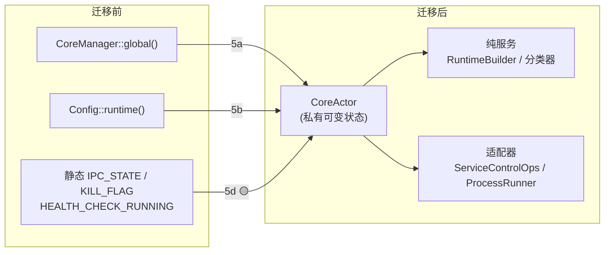

---

## 3. 状态机

### 3.1 `OperationGate` — 操作许可（5a，✅）

**不是 actor 级互斥**：它只发放 FIFO 的 operation ID 并校验受守卫消息；持有许可期间 actor 仍然处理其它消息。

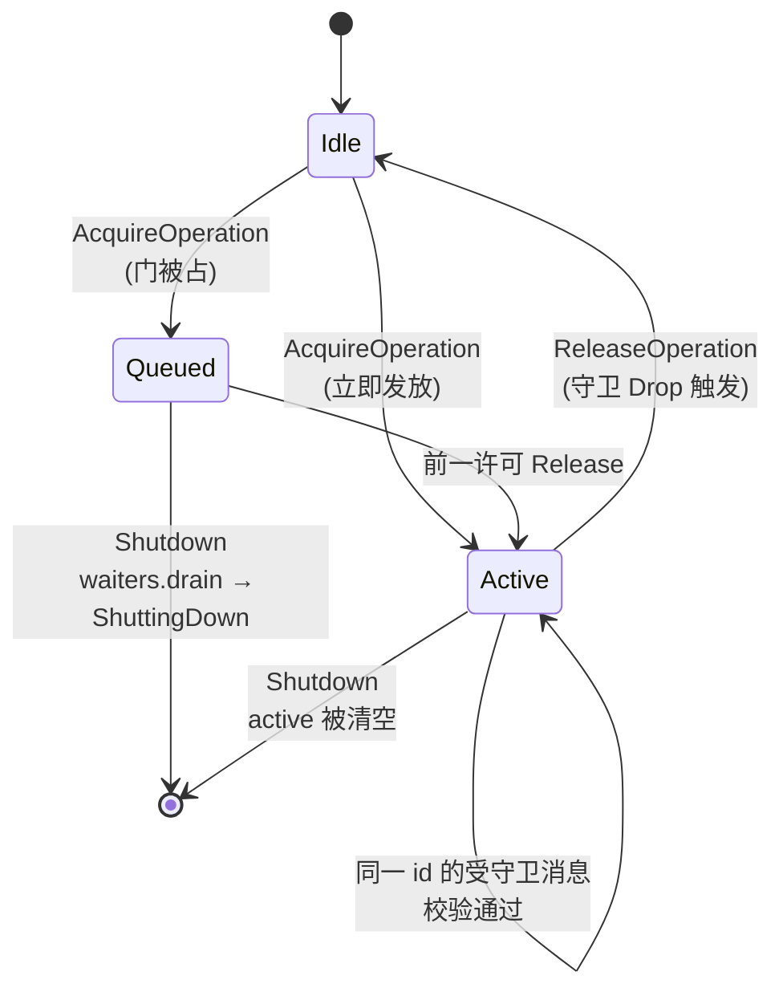

> **构造性死锁警告**：`acquire` 只在**另一条 `ReleaseOperation` 消息被处理时**才发放。ractor 逐条串行处理消息，因此**在 `handle()` 内部 await 取门永远等不到**。actor 内部新增的受守卫操作必须**携带调用方已持有的 `OperationId`**，不得自取。

### 3.2 后端槽位 `BackendSlot`（5a，✅）

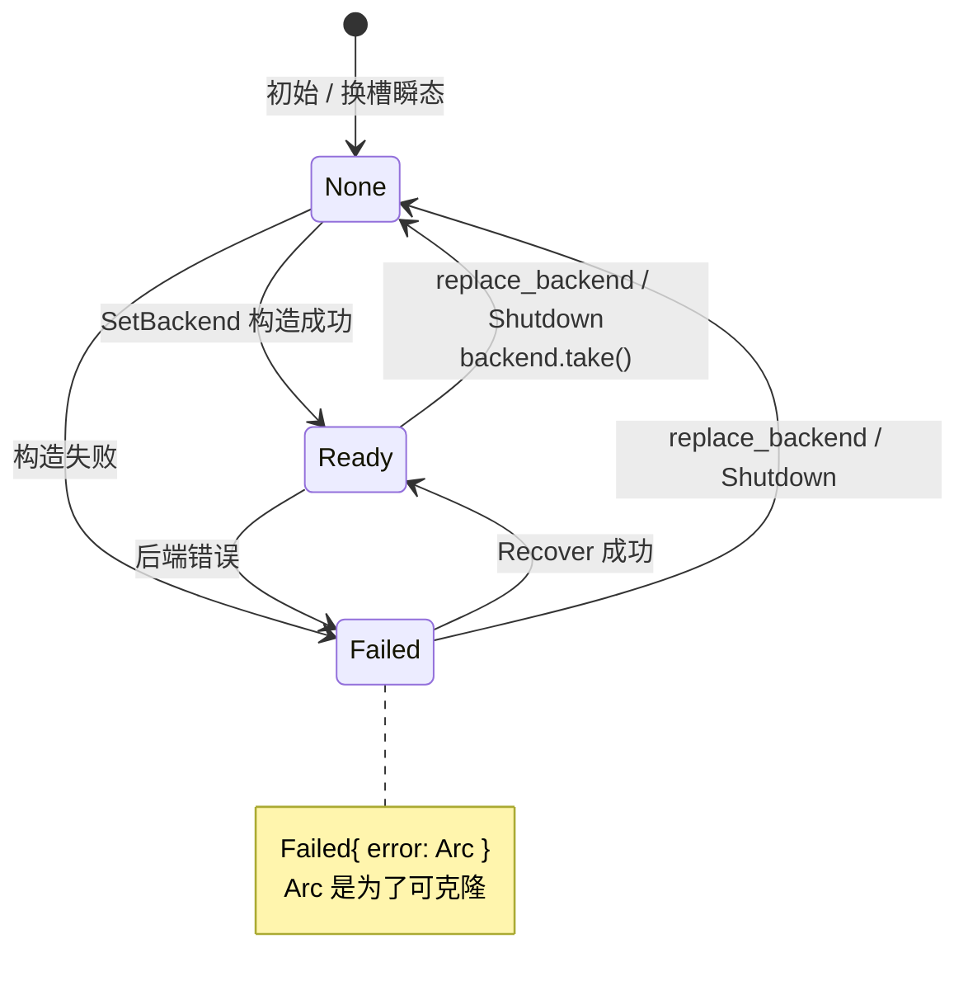

`CoreBackend` 本身是**封闭 enum**（`Local` / `Service` / `Test`），**不是 trait**——这是经用户批准的简化设计，属记录在案的对 ports-and-adapters 的有意偏离。

### 3.3 `ControlAdmission` — 关停准入（5d v8，🟡 规划中）

v8 把它拆成**两个正交维度**，因为 v7 用单一 `Closed` 同时表示「拆除完成」和「leader 不在了」，导致取消路径上拆除被永久跳过且无上报。

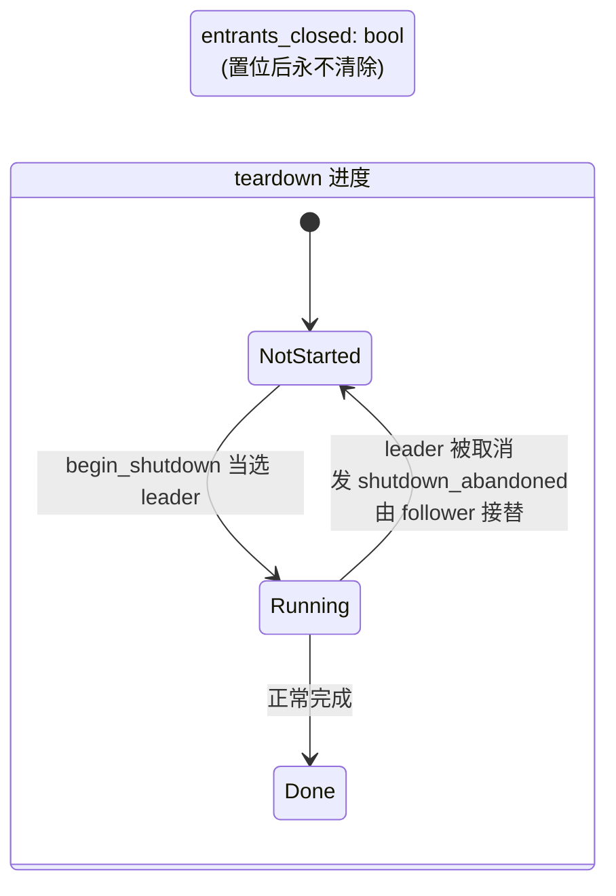

> **⚠️ 本状态机在 v8 审查中被判仍有丢唤醒竞态（D-B1）**：follower 取得 `Follower(n)` 之后、注册 `notified()` 之前若发生取消，`notify_waiters()` 打在零注册者上，follower 随后注册到孤儿 `n`，而复查判据 `is_teardown_done()` 只认 `Done`、不认 `NotStarted` ⇒ **永久挂起**。**待修，勿按本图实施。**

### 3.4 `DnsOverride`（5e，🟡 规划中）

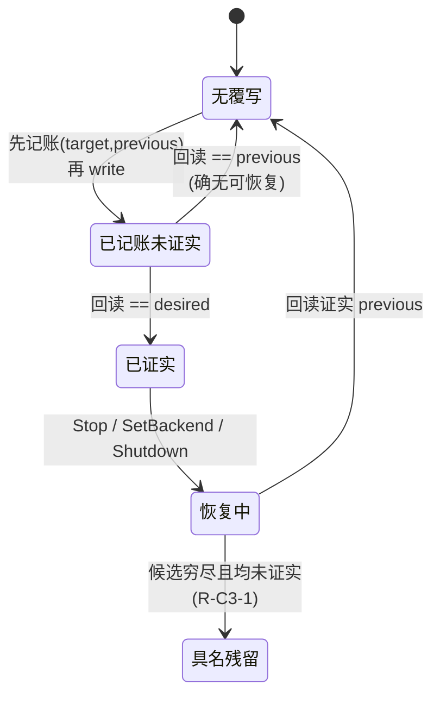

> **⚠️ 五行消歧表在 v2 审查中被判在多条可达路径上丢失归属（E-B1/E-B2）**，且超时的 Service 写会在 daemon 可能稍后执行的情况下清掉守卫。**待修。**

---

## 4. CoreActor 消息图（5a/5b，✅）

14 条消息，按**是否需要 reply** 与**是否受守卫**分类：

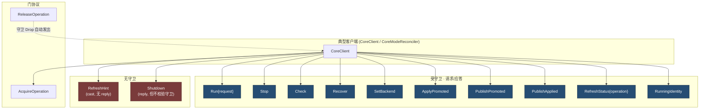

**错误面**（`CoreActorError`）：`StaleOperation` / `NoBackend` / `Backend` / `ShuttingDown` / `LifecycleInvariant`。
**门错误面**（`OperationError`）：`AcquireTimeout` / `ShuttingDown`。

> `LifecycleInvariant` 恰两 kind（`PromotedRegression` / `AppliedWithoutPromoted`），存在的唯一理由是让「不变量破坏」在类型上可 `matches!` 判别，从而**永不被误当作可降级的失败**。

---

## 5. 关键时序

### 5.1 取消安全的操作许可（5a，✅）

`OperationId` 由 client **预分配**，因此「取门请求超时」与「取门成功但调用方消失」可以区分。

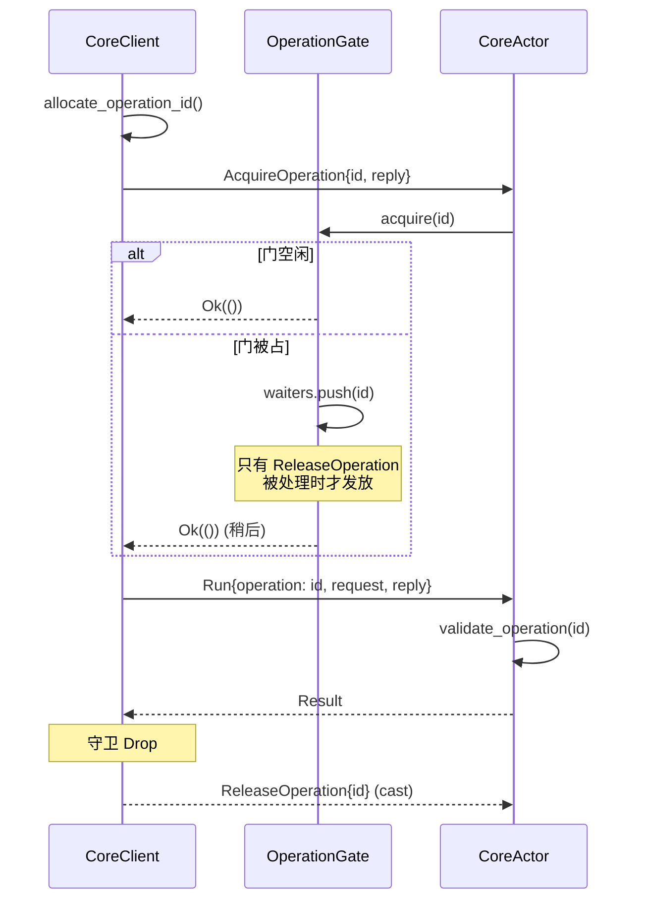

### 5.2 runtime apply — commit-first（5b，✅）

**先提交状态，再触发副作用；post-commit 失败报降级，不伪装成回滚。**

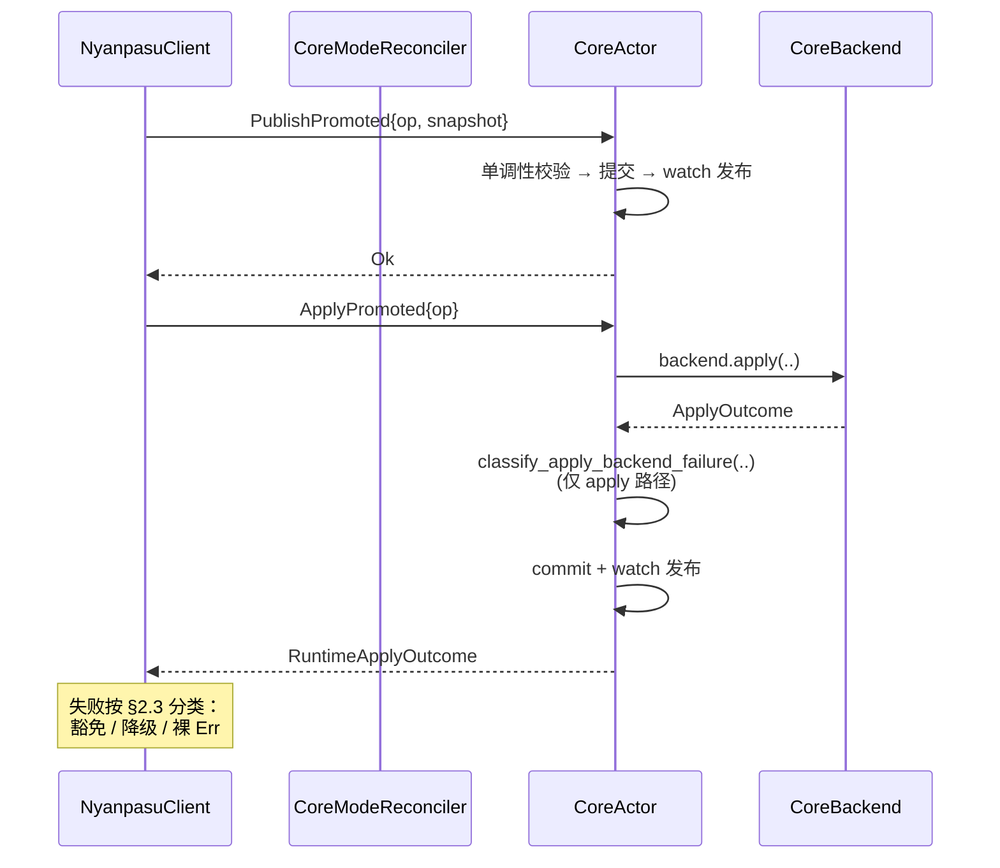

### 5.3 服务控制统一序列（5d，🟡 规划中）

**六个入口共用一处实现 `run_control_sequence`**，S1/S2 是留给 5e 的空槽。

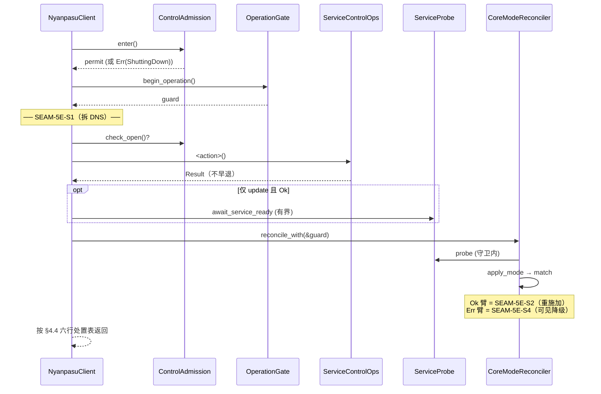

### 5.4 关停（5d v8，🟡 规划中）

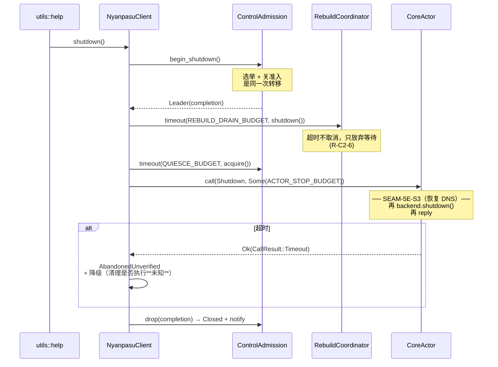

**复合上界** = `REBUILD_DRAIN_BUDGET + QUIESCE_BUDGET + ACTOR_STOP_BUDGET`（**被 await 的时间之和，不是墙钟上界**）。

> **撤回 `stop(None)` 升级**：ractor 的 `listen_in_priority` 把 Stop 端口排在普通消息端口之前，因此强制停止会抢在排队的 `Shutdown` 之前终止 actor，跳过全仓唯一的 `backend.shutdown()` 调用点（该 actor 无 `post_stop`）。**已核实**：`CoreClientInner::drop` 在两条已发布退出路径上都不触发（tao 的 `EventLoop::run` 返回 `!` 并以 `process::exit` 收尾），所以升级在退出路径上不买到任何东西。

---

## 6. 已关闭的阶段门

| 阶段 | 门禁证据 |
| --- | --- |
| PR-5-pre | 387 应用测试绿；bindings 仅 `StatusInfo` 扩宽 + `ServiceStatusInfo` |
| PR-5a | 50/50 计划测试 + 437/438 库测试；ledger `CoreManager::global` 16→1 |
| PR-5b | 467 passed / 0 failed / 1 ignored；bindings 差异恰为预言的四项 |
| PR-5c | 466 passed / 0 failed / 1 ignored；clippy exit 0；ledger 41 passed；快照 blob 逐字节未变 |

---

## 7. 未决

1. **PR-5d / PR-5e 均未定稿**（REJECT 47 / 43）。发现清单见 `docs/superpowers/plans/2026-08-04-pr5d-v8-pr5e-v2-review-findings.md`。
2. **PR-5e 有硬前置**：真机 fixture 未取得前不进入实施。
3. **R0 上游 PR #390 未合并**；submodule pin 移动待授权。
4. **smoke 3（macOS TUN/DNS）本机不可验证**，须随 5e 一并处置。
