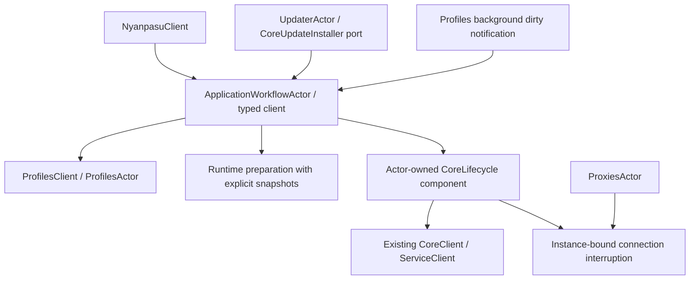

# PR-6 计划：通过 runtime apply options 解耦 profiles 与 core lifecycle

日期：2026-09-13。基线：`feat/pr6-proxies-updater-interruption @ 102304fdd`。

状态：已实施并完成回归验证。设计基于目标分支的源码和原有测试契约；执行记录见第 9 节。

## 1. 目标、假设与边界

应用层决定一次配置应用需要打断哪些连接；`core_lifecycle` 负责在正确的执行阶段对绑定的源内核实例执行打断。profiles 的验证、选择和条件自动激活属于 profiles 领域及应用层编排。

本计划采用以下假设：

- 保持 PR 当前行为，包括选择提交、runtime apply、连接打断之间的串行关系；不改成“只应用最后一次选择”。
- 显式激活、取消选择、create/import 后的条件自动激活均参与这条编排路径。
- profile 内容更新继续触发现有 rebuild 路径；只有实际 current 变化才按 `on_profile_change` 打断。
- mode-bearing patch 保持现有语义：再次提交相同 mode 仍按 `on_mode_change` 处理，不顺带改成差异驱动。
- 保持 facade 的业务方法、IPC DTO、持久化 `BreakConnectionStrategy` 和已有 degradation code。内部类型与调用路径完整迁移，不留旧 client 的转发别名。

必要范围包括：现有准入队列的归属、profile/mode 编排、runtime 输入绑定、连接打断执行，以及受队列迁移影响的 updater/dirty/recovery/shutdown 接线。网络下载、代理缓存、服务恢复算法、配置 schema、Tauri UI 行为及其他 PR-6 effects 功能不在本次重写范围。

本计划不依赖 `feat/pr6-effect-plan` 等 effects 分支。连接打断是一次动作的后续操作，不加入可重复执行的 `ApplicationEffectPlan::full()`。effects 分支的文件归属约束针对其自己的任务；本计划针对用户明确要求调整的 interruption 分支。

## 2. 已确认的耦合与时序契约

| 位置                                        | 当前行为                                                           | 本次处理                                             |
| ------------------------------------------- | ------------------------------------------------------------------ | ---------------------------------------------------- |
| `client/core_lifecycle/mod.rs`              | `ActivateProfile` / `AutoActivateProfile` 进入 lifecycle 消息协议  | 移到应用层 typed workflow 协议                       |
| `client/core_lifecycle/workflow.rs`         | 读取 current、提交 profile、读取切换策略、映射 profile degradation | 移到应用层 profile 编排                              |
| 同文件 `reconcile()`                        | 每次重新读取 profiles、clash、application                          | 显式选择本轮输入；profile apply 使用提交报告中的快照 |
| `client/mod.rs`                             | facade 直接调用 lifecycle 的 profile 方法                          | facade 调用应用层 typed client                       |
| `state/profiles/actor.rs`                   | actor 内原子实现 `SetCurrentIfNone`，返回 `CommitReport`           | 保持状态所有权与条件提交原子性                       |
| `core/proxies.rs`                           | 选择代理后通过同一 source capability 按组或全部打断                | 保持 actor 所有权，复用 scope 与执行函数             |
| `core_lifecycle/tests/connection_policy.rs` | 明确验证后续 profile 提交不能越过待完成的打断                      | 保留行为断言，随编排迁移测试归属                     |

单独改为 `profiles.set_current().await; lifecycle.reconcile(options).await` 不满足这些契约：两次 RPC 之间可以提交其他选择，且现有 reconcile 可能读取另一份 profiles。将 scope 放进可合并的 dirty 通知，也会丢失动作与配置之间的对应关系。

## 3. 架构决策：提升现有准入队列

把现有 `CoreLifecycleActor` 的队列与 tracked operation task 提升为 `ApplicationWorkflowActor`，typed client 使用 `ApplicationWorkflowClient`。复用当前队列实现和生命周期规则，只保留这一套应用级互斥准入。



角色分类：

- **Actor service：** `ApplicationWorkflowActor` 独占队列、active task、dirty/recovery 调度、关闭状态及完整工作流。Profile 状态仍属于 `ProfilesActor`，代理状态仍属于 `ProxiesActor`。
- **Actor 内部组件：** `core_lifecycle` 保留内核操作与恢复状态的实现，作为应用 workflow 独占的字段存在，不再启动另一套上层 lifecycle actor。它不是 pure service；其可变状态随整个 workflow 移入唯一的 tracked task，再随完成消息归还。
- **Pure computation：** 从动作结果和用户策略解析 `ConnectionScope`，以及按连接 chains 匹配代理组。使用普通函数即可。
- **Adapter / port：** runtime 构建和发布、源实例 API、二进制安装继续通过明确注入的边界访问基础设施。

这次提升必须伴随真实的模块边界：`core_lifecycle` 不再引用 `ProfilesClient`、`ProfileId`、`CommitReport`，不再决定 profile 自动激活或读取 `on_profile_change`。只改 actor 名称而保留原来的 profile 分支不算完成。

全部原 lifecycle 请求，包括宿主变更、内核选择、二进制替换、恢复 tick、dirty tick 和 shutdown，都由应用 workflow 的同一队列准入。不能只把 profile 请求迁移到新 actor 而让其他内核变更保留独立队列。

不提供通用 closure 消息、服务查询接口、共享 mutex gate 或调用方持有的跨 RPC permit。`NyanpasuClient` 不被反向注入 actor；runtime preparation 也不回调应用 workflow actor。

## 4. Options、context 与输入契约

### 4.1 调用方声明策略

接口草图，字段可见性限制在 backend 内部：

```rust
#[derive(Default)]
pub struct RuntimeApplyOptions {
    pub interrupt_connections: Option<ConnectionScope>,
}

pub enum ConnectionScope {
    All,
    ProxyGroup { name: String },
}
```

`None` 表示不请求打断。`All` 和 `ProxyGroup` 对应目标 PR 已有能力；不提前增加连接 ID 列表、谓词回调、策略注册表或未来 scope。

| 动作                                          | 应用层解析结果                                            |
| --------------------------------------------- | --------------------------------------------------------- |
| current 实际改变且 `on_profile_change = true` | `Some(All)`                                               |
| 同一 profile 重选、自动激活未胜出、策略关闭   | `None`                                                    |
| 普通 profile 内容 rebuild、dirty rebuild      | `None`                                                    |
| patch 含 mode 且 `on_mode_change = true`      | `Some(All)`，保持原有重复提交语义                         |
| proxy 选择策略为 Off / All / ProxyGroup       | 分别为 `None` / `Some(All)` / `Some(ProxyGroup { name })` |

scope 类型和执行函数放入一个共享的窄模块，例如 `core/connections.rs`。它不拥有队列、缓存或后台任务。代理选择仍由 `ProxiesActor` 串行处理，不转发给 application workflow。

### 4.2 执行方建立 context

`RuntimeApplyContext` 是单次 operation 内部使用的执行对象，由已准入的 workflow 通过 core component 建立，携带 operation identity 和准备好的打断信息。它不由 UI 提供，不可持久化，不作为可复制的重试任务。

打断信息绑定 scope 和源实例状态，必须区分：

- 本次未请求打断；
- 源内核已确认停止；
- 持有源内核的可撤销 `ApiClient`；
- 源状态或 capability 不可用，保留错误供提交后决定是否报告降级。

源 capability 仍在配置提交前获取。执行关闭时只能使用该 capability；不能用 controller URL 代替实例身份，也不能在失败后获取当前实例的 capability 重试。

Profile 的预检查用于避免已知 no-op 时查询 API；是否真的发生切换最终以 `ProfilesActor` 原子提交结果为准。当前 `set_current` 的 `affects_current` 来自 `CurrentChanged` 判断，可在这个专用调用路径上使用；不能把任意 `CommitReport.affects_current` 等同于 profile 选择发生变化。条件自动激活继续调用 `set_current_if_none`，不以独立的 get/set 替代。

context 随 active operation 存活；提交被拒绝或操作为 no-op 时丢弃。已成功应用后消费一次打断信息，不把它保存为下一次 dirty/recovery 的默认选项。

### 4.3 固定本次配置输入

应用 workflow 使用 profile `CommitReport.snapshot`，加上本轮明确取得的 clash/application 快照构建 runtime。构建完成后，向 core component 交付 `PreparedRuntime` 与 `RuntimeApplyContext`：前者包含实际生成的 runtime snapshot 及同一份 clash 输入导出的 local IPC 设置，后者绑定本次打断。

- 不允许传了 profile revision，构建时却重新无条件读取最新 profiles。
- `RuntimeRevisionAllocator` 由同一 application workflow 独占，所有构建路径共用一个递增源。Profile 持久化 revision 与 runtime revision 不是同一个版本空间。
- 保持 publish/promoted/applied 的既有区别：发布成功不等于内核已应用，只有真实 apply 结果才能绑定 applied instance。
- 这些是各配置 actor 的独立快照，不声称跨域原子读取。Profile 快照固定选择与结构；引用文件内容仍按既有构建时读取语义处理，本次不增加文件内容 MVCC。
- 后台变更只发送 dirty 信号；在出队执行时读取最新输入。运行中的变更保留下一轮 dirty，不携带或重放旧的 interruption context。

迁出当前 `RuntimeBuildPort` 的 profile 输入组装，使其位于应用层 runtime preparation 模块。对于二进制替换、宿主恢复等内部仍需“在此阶段构建最新 runtime”的路径，注入窄 `RuntimePreparationPort`，返回已准备的 runtime 数据；具体实现通过 typed config clients 读取输入和调用现有构建 adapter。该 port 不允许修改 profile、分发 facade 请求或等待上层 actor。

Profile 路径使用确定的提交快照准备产物；上述内部路径在原来的执行阶段准备最新产物。两者最终共用 core component 的 apply 实现。避免为了移除 `ProfilesClient` 而重写服务恢复和安装流程。

## 5. 单次 profile 应用的顺序

1. **准入。** 应用 actor 分配 operation identity；后续互斥工作保持排队。
2. **预检查。** 获取 profile 选择状态和本次策略；需要时建立绑定源实例的 context。
3. **提交。** 通过 `ProfilesClient::set_current` 或 `set_current_if_none` 完成原子状态操作。失败时不构建、不 reconcile、不打断。
4. **判断提交结果。** 无实际切换时丢弃打断请求；自动激活未胜出直接结束。已有 profile materialization degradation 保留。
5. **构建并应用。** 使用提交报告的 profile 快照；在同一 active operation 中准备、发布并应用 runtime。
6. **打断。** Apply 成功且仍需打断时使用原 source capability。确认 Started/Restarted/Switched 已替换源实例，或源已停止时，无须额外关闭连接。
7. **结算。** 应用层映射 profile/mode 对应的 degradation code，执行既有 UI 通知并返回 `MutationOutcome`；结算完成后才准入下一项。

构建或 reconcile 失败保留已提交状态并报告降级，不打断。连接关闭失败同样返回 committed-degraded，不回滚、不自动重复动作。Create/import 已提交的新 `ProfileId` 必须在自动激活失败时保留。

队列满、关闭中或 uncertain 状态的拒绝发生在 profile 提交前。调用方超时或取消等待不释放 active operation；沿用 operation ID 查询和有限完成历史。内核变更结果不确定时保持现有停止准入规则；普通连接关闭失败按现有降级语义结算。

## 6. 实施步骤与验证点

### 任务 1：锁定基线和边界

- [x] 从目标分支建立实现 worktree，例如 `refactor/pr6-runtime-apply-options`；再次记录目标 SHA 与工作区状态。
- [x] 初始化 pinned submodule；按根 `AGENTS.md` 仅复用 sidecar/resources，使用独立 Cargo target 和 Rust-only frontendDist 占位文件。仅在前端或绑定检查确实需要时安装 pnpm 依赖。
- [x] 运行基线 lifecycle、profile facade、proxies、updater 测试，记录失败是否已存在，不提前修改失败断言。
- [x] 清点生产环境的 lifecycle 调用及 profile 选择提交入口，包含 updater installer、dirty、recovery 和退出路径。

验证：得到可复用的基线结果与入口清单；明确本次不修改其他 effects 分支。

### 任务 2：定义并接入共用 scope 与执行逻辑

- [x] 增加 `RuntimeApplyOptions` 和 `ConnectionScope`，通过策略门与代理组回归测试验证 profile/mode/proxy 的策略映射。
- [x] 提取 `interrupt_connections(source, scope)`：All 关闭全部；ProxyGroup 查询源实例 connections，仅关闭 chains 包含该组的 ID。
- [x] 每次查询和关闭保留 `ApiClient` 自身的撤销检查；保留现有“遇到首个错误返回”的行为，不附带改变批量失败处理。
- [x] ProxiesActor 接入共用 scope/函数；保持选择成功、打断失败、缓存刷新失败的独立结果处理。

验证：原 proxies 回归通过；增加/保留 Off 无额外调用、组匹配、源撤销、成功选择不因后续失败变成提交失败的测试。

### 任务 3：提升队列并完整迁移接线

- [x] 新增 `client/application_workflow`，迁入 actor/client、bounded queue、tracked task、完成通知、dirty/recovery 调度和 shutdown admission。
- [x] core lifecycle 改为 actor 独占的内部组件；应用层消息负责 profile/mode 工作流，core 消息仍表达明确的内核动作。
- [x] 迁移 `NyanpasuClient`、bootstrap、runtime inspection、updater 的 `CoreUpdateInstaller` 实现和测试 fixture。
- [x] 将 dirty receiver 和 recovery timer 交给新 actor；保留 dirty 合并、恢复预算、人工停止后的恢复抑制与 uncertain 行为。
- [x] 队列拒绝、关闭和 operation 完成仍正确通知 binary installer observer；staging artifact 的所有权持续到安装真实结束。
- [x] 移除旧 `CoreLifecycleClient` 和旧 actor 准入路径；facade 的 `core_lifecycle_status()` 继续给出有界操作状态，内部引用直接更新，不添加兼容转发类型。

验证：队列上限、超时、取消、panic/uncertain、重复 shutdown、安装互斥和恢复测试保持原断言。检查生产路径只存在一个相关准入队列。

### 任务 4：迁出 profile/mode 编排，接入显式输入与 context

- [x] 将 `ActivateProfile` / `AutoActivateProfile` 的业务分支迁到应用 workflow；保留 ProfilesActor 的原子条件提交。
- [x] 将 mode 的策略解析、patch 提交、领域 degradation 映射迁到同一应用编排层；调用同一个 runtime apply 机制。
- [x] 实现执行期 context，在提交前捕获 source；后续从提交结果决定是否消费。
- [x] Profile 构建使用 `CommitReport.snapshot`；Clash/application 输入和 local IPC 设置来自本轮记录的快照。
- [x] Runtime preparation 从 lifecycle 中迁出；普通 reconcile、dirty、安装与恢复使用窄 port 取得适当阶段的最新 runtime。
- [x] Core component 统一处理 apply 结果、实例替换判断和 source-bound interruption，返回通用结果；应用层映射 `profile_interruption_failed` / `mode_interruption_failed`。
- [x] 审计所有 profile post-commit 入口：普通编辑保留 rebuild-only，create/import 的自动激活进入新队列，避免重复 rebuild 或打断。

验证：lifecycle 中没有 profile 类型/提交调用/策略判断；profile/mode 业务断言通过；输入捕获测试证明应用的是本次提交的选择。

### 任务 5：补齐跨操作回归并清理迁移残留

- [x] 将通过 typed client 执行的编排、内核执行、源实例与恢复回归测试一起迁到 `application_workflow::tests`，保持完整调用图验证。
- [x] 按下一节矩阵增加缺失测试，使用 Notify、oneshot、RPC barrier 和注入端点，不使用 sleep。
- [x] 删除本次迁移产生的未使用 imports/helpers 和旧路径；更新现有 connection-policy 文档中的所有权描述。
- [x] 不改动架构规则文件；若实施过程中确需改变规则，必须同步 `AGENTS.md` 与 `CLAUDE.md`。
- [x] 执行最终检查，记录命令、结果和真实环境限制；审查每个改动是否归属于本次调用路径。

验证：所有相关测试及静态检查通过，没有 facade 反向依赖、通用 callback、共享 actor state lock 或隐藏兼容路径。

## 7. 关键测试矩阵

| 场景                                               | 必须证明                                                                           |
| -------------------------------------------------- | ---------------------------------------------------------------------------------- |
| 激活 A、重选 A、取消选择                           | 仅实际切换触发策略；顺序保持 reconcile 后 close                                    |
| 创建/导入后的自动激活                              | 无 current 时原子选中；已有 current 时不打断；失败保留新 ProfileId                 |
| 无效 ProfileId、不可选 transform、删除当前 profile | 维持 domain 拒绝；无 reconcile/close                                               |
| 编辑当前 profile / 后台刷新                        | 正常 rebuild；不继承 profile-switch interruption                                   |
| Profile 或 mode 策略关闭                           | 不为打断获取 capability，不执行 close                                              |
| 重复提交相同 mode                                  | 保持原 mode-bearing 请求语义                                                       |
| 输入绑定                                           | 提交 A 后让读取端可见另一份 profiles，仍使用 A 的提交快照；settings 与构建输入一致 |
| profile B 在 A 的 close 等待中到达                 | B 尚未提交；释放 A 后顺序为 apply A、close A、apply B、close B                     |
| mode/host/binary replacement 在 close 中到达       | 不能越过 active operation；安装产物存活到真实完成                                  |
| dirty/recovery 在 apply/close 中到达               | 不并行执行；按既有队列规则继续；旧 interruption 不被重放                           |
| 构建/发布/reconcile 失败                           | 状态保留，返回对应降级，不 close；promoted/applied 区分不变                        |
| 源已停止 / 源身份未知                              | 前者无需 close；后者在应用成功且需要打断时报告降级                                 |
| 同 URL 下实例替换、capability 撤销、凭据变化       | 不向替代实例发 close，不重新获取 capability 重试                                   |
| close 失败                                         | committed-degraded，保留 profile/mode 提交；代理路径仍尝试原有缓存刷新             |
| Group scope                                        | 只关闭 chains 包含指定组的连接 ID，其他连接不受影响                                |
| 调用方超时/取消                                    | 工作流继续持有准入；最终按 operation identity 结算，不重复执行                     |
| queue full / shutdown / uncertain                  | 未准入 profile 不提交；正确结算 pending installer observer                         |
| recovery 和 shutdown 完整回归                      | 人工停止抑制、宿主恢复、预算、等待 active task 与重复退出行为不变                  |

## 8. 验证命令与交付

基线与实施后的定向检查，以目标分支实际存在的测试为准；队列迁移后增加新模块过滤器：

```powershell
cargo test --manifest-path backend/Cargo.toml -p clash-nyanpasu --lib --all-features client::core_lifecycle::tests
cargo test --manifest-path backend/Cargo.toml -p clash-nyanpasu --lib --all-features client::profiles
cargo test --manifest-path backend/Cargo.toml -p clash-nyanpasu --lib --all-features core::proxies
cargo test --manifest-path backend/Cargo.toml -p clash-nyanpasu --lib --all-features core::updater
cargo test --manifest-path backend/Cargo.toml -p clash-nyanpasu --lib --all-features client::application_workflow::tests
```

最终检查覆盖 facade 和其他受接线影响的测试，不只运行上述过滤器：

```powershell
cargo test --manifest-path backend/Cargo.toml -p clash-nyanpasu --lib --all-features
cargo clippy --manifest-path backend/Cargo.toml --all-targets --all-features
cargo fmt --manifest-path backend/Cargo.toml --all -- --check
pnpm lint:architecture-ledger
git diff --check
```

检查迁出结果：

```powershell
rg -n 'ProfilesClient|ProfileId|CommitReport|ActivateProfile|AutoActivateProfile|on_profile_change|on_mode_change|set_current' backend/tauri/src/client/core_lifecycle
rg -n 'CoreLifecycleClient|CoreLifecycleActor' backend/tauri/src
```

上述两项源码检查在完成迁移后应无匹配，历史文档不在搜索范围。如果 facade 返回类型意外影响导出的绑定，先核实是否必要；确需 wire 改动时才追加 binding 导出、interface build、TypeScript 与前端 lint。架构台账若因路径迁移改变，使用脚本重生成，不手改计数。

实施任务是验证检查点，不等于每项单独提交。最终按可独立构建和完整审阅的边界组织原子提交；队列迁移、生产接线与旧入口移除必须一起完成，不能留下双准入版本。当前 PR 已有远端分支，本计划不授权改写或强推已有提交。

交付应包括：实现 diff、更新后的连接策略文档、测试结果和迁移审查。本次交付包含应用代码迁移和本文执行记录。

## 9. 执行记录（2026-09-13）

- 实现分支：`refactor/pr6-runtime-apply-options`，基于 `102304fdd`。
- Worktree：`G:/Programs/Rust/.ccg/clash-nyanpasu/pr6-runtime-apply`。独立安装 pnpm 依赖，独立 Cargo target；只有 sidecar/resources 链接主 checkout，frontendDist 使用 Rust-only 占位文件。
- `ApplicationWorkflowActor` 复用原有准入和 tracked task 实现。Profile/mode 业务与 degradation 映射位于应用层；`CoreLifecycleWorkflow` 作为独占组件保留内核操作和恢复状态。
- `RuntimePreparation` 独占 revision allocator。Profile 路径使用提交报告快照，mode 路径使用 patch 返回的 clash 快照；默认 reconcile、dirty、恢复和安装通过 `RuntimePreparationPort` 取得最新输入。
- `RuntimeApplyOptions` 在提交前解析，`RuntimeApplyContext` 保存源 capability 和 operation identity。`PreparedRuntime` 与 context 分别传入一次 apply，无需额外聚合 DTO。连接 scope 与执行逻辑由 core lifecycle 和 ProxiesActor 共用。
- 原有测试通过 typed client 操作队列，因此全部迁到 application workflow 测试目录；没有为目录归属新增只重复实现的组件测试。Profile/mode 的简单策略条件由业务行为测试覆盖。

验证结果：

| 检查                                         | 结果                                                                                                       |
| -------------------------------------------- | ---------------------------------------------------------------------------------------------------------- |
| 修改前全量库测试                             | 552 passed、1 failed、1 ignored；唯一失败为 `export_typescript_bindings` 找不到 `pnpm.cmd`，业务回归均通过 |
| 迁移后的原有 workflow 回归                   | 53 passed                                                                                                  |
| 最终全量库测试，all features                 | 560 passed、0 failed、1 ignored，包含 7 个新增测试                                                         |
| Workspace Clippy，all targets / all features | 通过；保留基线已有的无关 warning                                                                           |
| Rustfmt 与 diff 空白检查                     | 通过                                                                                                       |
| 架构台账 gate                                | 通过，快照不变                                                                                             |
| TypeScript 绑定导出                          | 通过；生成文件与基线完全一致，无前端 wire 改动                                                             |
| 旧入口与 profile 耦合搜索                    | 旧 CoreLifecycleActor/Client 无引用；core_lifecycle 无 profile 类型、选择提交或切换策略判断                |

新增回归覆盖：不获取无用 source capability；调用方取消后的准入持有与 dirty 不重放；关闭/队列满时未提交的 profile 被拒绝；profile close 与 mode/host/binary 工作的互斥；后续状态变化不替换已提交构建输入；构建或发布失败保留提交并跳过 reconcile/close。原有 mode 测试另补充重复提交同一 mode 的断言。

Windows 环境仅提供 `pnpm.exe`，绑定导出测试要求 `pnpm.cmd`。在 worktree 的 gitignored `backend/tauri/tmp/tools/pnpm.cmd` 放置透传到已安装 pnpm 的 launcher，并只在验证命令的 PATH 前置该目录；没有修改测试实现或项目配置。全量测试真实执行 pnpm/Prettier，未跳过导出检查。

日志位于 gitignored `backend/tauri/tmp/{baseline-tests,workflow-tests,final-library-tests,clippy,architecture-gate}.log`。验证使用注入的端点/安装 adapter 和测试 HTTP 服务；未进行真实 GUI、内核进程或管理员服务安装的人工 smoke test。
