# ApplicationWorkflow 选择性 TCC、降级收敛与通知隔离：完整设计实施计划 v2

日期：2026-09-14  
状态：设计稿，未实施；代码片段是目标接口草图，不表示当前仓库已经存在这些 API。  
依据：用户提供的 Fabel 计划 [F]、DeepSeek Harness 分析 [D]，以及本轮三条指导原则。本文以附件记载的固定基线为设计起点，不声称重新验证了当前 main、远端 PR 状态或用户本地工作区。

> **核心决策：复用 nyanpasu-state 的状态事务；只让关键运行态参与应用侧 TCC；确定性且不可自动恢复的关键失败优先拒绝/回退；已知安全、允许延后、可重试的失败可以保留 desired 并降级；大多数副作用在提交后通知或协调，GUI、托盘永不决定源配置提交。**

## 0. 来源、范围与术语

[F] `2026-09-14-application-workflow-tcc.md`，见 `../superpowers/plans/2026-09-14-application-workflow-tcc.md`。  
[D] `2026-09-14-deepseek-harness-state-model.md`，见 `../superpowers/reports/2026-09-14-deepseek-harness-state-model.md`。

“来源结论”表示附件明确写出的内容；“本稿决策/修订”是结合用户要求后的新设计，不能倒过来声称是两份材料的共同原意。Harness 的实现细节以 [D] 的源码分析为依据，本稿没有再次独立审计 Harness。

### 0.1 基线记录

| 对象                | 附件记载的基线                     | 本次使用方式                                              |
| ------------------- | ---------------------------------- | --------------------------------------------------------- |
| main                | `260e743db`                        | 仅作 Fabel 计划的工作区记录                               |
| 栈 A，#5249 → #5250 | `3f23543f5`                        | 复用 workflow、tracked task、源实例断连与关闭骨架         |
| 栈 B，#5266 → #5270 | `85215762e`                        | 复用 EffectPlan、owners、UI adapters 与现有 stale fencing |
| state               | `backend/nyanpasu-core/src/state/` | 复用 prepare → persist → CAS → 通知机制                   |
| submodule           | Fabel 记录了 gitlink 与工作树漂移  | T0 重新记录，绝不 reset/覆盖已有变更                      |

不把两条栈的测试数量相加，不把“mergeable”当作集成验证；具体构建命令、协议版本与 `/core/check` 接线在 T0/T4 对固定集成基线核对。[F §0.1、§6]

### 0.2 本轮范围

覆盖 ApplicationConfig、ClashConfig（包括 overrides 子结构）、Profiles 的源状态修改，以及关键 runtime 的应用/取消、受管文件保存、可重试降级、外围通知、启动、关闭、显式恢复、订阅下载提交、IPC 状态表达与旧编排清理。

不引入新的源配置总表、第四份可写聚合 store、通用事务 DAG、分布式事务框架、事件日志式配置存储或通用插件事务系统。窗口位置等 SessionState 保留自己的持久化一致性，但不参加应用 runtime TCC。外部编辑文件不属于本应用可回滚资源。

## 1. 两份材料如何合并

### 1.1 采纳与舍弃

| 来源              | 采纳                                                                                                 | 不直接照搬                                                                                             |
| ----------------- | ---------------------------------------------------------------------------------------------------- | ------------------------------------------------------------------------------------------------------ |
| Fabel [F §1–§3]   | state 为源配置协调器；workflow 为应用参与者；只读句柄防止 RPC 等待环；Try 到最终决策期间保持单执行域 | 把系统代理/PAC/guard/自启/快捷键全部纳入全局 Required；任一 Degraded 即整笔回退                        |
| Fabel [F §4–§6]   | 显式候选输入；候选端口与确认端口分离；Profiles staged 内容；文件 journal；新建与自动激活两个成功边界 | 按 `(domain, change.id)` 当作尝试身份；只取 `.applied` 做 checkpoint；恢复时见 `RolledBack` 就视为成功 |
| DS [D §0、§2、§3] | Prepare-heavy；desired/applied 分离；未知结果有名字；有界 reconcile；提交后观察者失败不回滚          | 将所有 runtime 失败一律改成提交后降级；把“异步”当作不能进入 prepare 的充分理由                         |
| DS [D §1.3、§1.5] | 临时资源在产生处登记清理；最新视图覆盖旧视图；不相关变化无工作                                       | 引入无界事件日志；把完整事件日志的连续序列要求套在可以合并的快照通知上                                 |

**本稿不是 B（全回退）或 C（全提交后协调）的折中拼接，而是先按资源职责划定提交边界，再在关键边界内按结果和安全性决定拒绝还是延期。**

### 1.2 对 DS 推论的限定

[D §1.2] 自身描述了异步 setup 后同步 publish。因此“发布点不要 await GUI/OS”并不推出“prepare 永远不能 await 可补偿的关键运行态”。本稿允许少量关键 runtime 的受跟踪 Try，代价是域写入占用时间；读取由 StateSnapshot 解耦。

同样，dry-run 只能证明检查时的条件。端口探测不等于预留，语法检查不保证真实进程启动或权限提升成功。不能宣称把“所有永久错误”都前移后，就无需实际 apply 的失败策略。这是本稿的推导，不是对 Harness 所有操作的事实判断。

### 1.3 必须明确修订的实现点

| 编号 | 材料中的处理                                                      | 本稿修订及原因                                                                                                                  |
| ---- | ----------------------------------------------------------------- | ------------------------------------------------------------------------------------------------------------------------------- |
| C1   | `(domain, change.id)` 结算；同时承认失败不消耗版本 [F §2.3、§3.1] | 尝试必须唯一。每次 mutation 创建捕获 `OperationId` 的薄参与适配器；旧回执只能命中旧适配器上下文                                 |
| C2   | subscriber 入队前组装全部 CandidateInputs [F §5.1]                | 其余两域在 workflow **实际准入后**读取，否则等待期间可能已被前一笔提交改变                                                      |
| C3   | checkpoint 固定取 `store.applied`、排除 pending [F §5.2、§9]      | checkpoint 来自最后一次真实成功的 apply receipt；inspection 尚未到达不能使恢复基线倒退。T4 固化“已应用但 inspection 缺失”的测试 |
| C4   | 恢复请求返回 `RolledBack` 也视为恢复成功 [F §5.4]                 | B→A 的恢复被下层回滚，可能仍停在 B。必须验证实际内容、core、宿主和运行意图匹配 A                                                |
| C5   | Profiles CAS 后仍有 promote/complete [F §4.3]                     | 需要成功的文件发布必须在 state Confirm 前完成；Confirm 后只能剩可重试清理。否则会提前丢 checkpoint、提前放行                    |
| C6   | `on_rolled_back` 入队并等待就不会阻塞 Drop [F §2.1]               | 等待消息回执同样可能阻塞。关键操作由 tracked task 结算；Drop 最多发出取消信号，不同步等待外部 IO                                |
| C7   | 纯 diff 改掉相同 mode 重提的断连语义 [F D-6]                      | 本次保留原动作语义，使用 typed hint；重构不是产品行为变更的授权                                                                 |
| C8   | `applied < desired` 自动触发重试 [D §3]                           | 未收敛还必须区分 Deferred、WaitingDependency、Blocked、RecoveryRequired；永久错误/未知结果不进入自动重试                        |
| C9   | 独立域 saga 每次都触发 Try，“语义正确” [F Phase 2]                | 不能保证复合操作的原子性或中间配置有效。旧多域入口单独迁移，不能冒充一个 TCC                                                    |
| C10  | 参与通知的效果可能在 Try 时成功即进入 applied                     | `applied_revision` 只在该 owner 的真实目标成功时推进；接收/尝试序号与 applied 不混用                                            |

例：事务前运行 A；Try 成功运行 B；写文件失败；Cancel 请求恢复 A；底层报告“这次请求 RolledBack”。这只能说明恢复请求失败后恢复到它自己的前态，通常仍是 B，不能宣布应用已回到 A。

## 2. 核心不变量与失败策略

### 2.1 四类工作，三种一致性机制

| 类别                   | 内容                                                              | 时机                           | 失败处理                                                 |
| ---------------------- | ----------------------------------------------------------------- | ------------------------------ | -------------------------------------------------------- |
| 源配置与受管文件       | Profiles / Application / Clash overrides、必要内容文件            | state 事务内                   | 验证拒绝；持久化失败取消；必要恢复失败明确上报           |
| 关键运行态             | 当前 runtime、显式切核/宿主切换、影响当前运行的 profile/overrides | prepare 内做必要检查及单次 Try | 确定性关键失败优先回退；满足安全延期条件时可降级提交     |
| 外围状态效果           | OS 代理/PAC/guard、快捷键、自启                                   | 提交后按完整 desired 协调      | 可重试则有界重试；永久失败阻塞该效果并告警；不撤回源配置 |
| 观察者与一次性后续动作 | GUI、托盘、locale/logger/widget 通知；成功操作的源实例断连        | Confirm 后                     | GUI/托盘失败永不回滚；一次性断连不自动重放               |

围绕同一个 owner 的局部回退仍允许，例如快捷键替换失败时尽量保留旧注册集合。这是 owner 的局部一致性，不是让 ApplicationWorkflow 为全部 OS 状态建立全局 checkpoint。

### 2.2 不要只根据 `retryable: bool` 决策

关键 Try 的延期提交必须同时满足：

```text
可延期 = 错误被类型化判定为可重试
      && 本次操作已终止，结果不是 Unknown
      && 有已知安全的运行基线或已确认停止状态
      && 本条命令允许保存 desired 后延后应用
      && 新目标没有确定性无效项
      && 后续收敛路径与预算已经定义
```

`CoreErrorKind::Internal`、超时、丢回执不能默认归类为 transient。旧 `retryable` 字段只作参考输入，关键判断由能观察实际结果的 runtime adapter 返回结构化结论。

### 2.3 默认命令策略

| 操作                                        | 默认策略                | 说明                                                                    |
| ------------------------------------------- | ----------------------- | ----------------------------------------------------------------------- |
| 显式切核、切执行宿主、激活/取消当前 profile | `MustApply`             | 运行中必须确认目标生效才提交；用户拒绝 UAC 直接拒绝，不能后台反复弹窗   |
| 普通 runtime 参数/overrides 保存            | `AllowDeferredWhenSafe` | 已知临时失败且旧运行态安全，才允许保存并标为 Deferred                   |
| 影响当前 runtime 的受管内容更新             | `AllowDeferredWhenSafe` | 构建/检查永久失败仍不覆盖已接受内容；临时运行时失败可保留有效新 desired |
| 不影响当前运行的 profile 元数据、未选中项   | `SaveOnly`              | 只做领域与本地资源检查，不启动 core                                     |
| 仅 GUI/托盘/普通应用设置                    | `SaveThenNotify`        | 验证通过即提交，外围执行异步                                            |
| 用户已明确停止 core 后的普通保存/选择       | `SavedInactive`         | 保存经检查的目标，不隐式启动，不用重试循环对抗 Stop 意图                |

策略由命令/影响分类固定给出，不由前端自由传一个“忽略所有错误”的参数。

### 2.4 完整失败矩阵

| 场景                                              | 源配置                                               | 应用执行                          | 用户可见结果                           |
| ------------------------------------------------- | ---------------------------------------------------- | --------------------------------- | -------------------------------------- |
| schema / 引用 / 脚本 / 序列化 / 确定性 check 失败 | 不提交                                               | 丢弃候选、清理临时资源            | Rejected，说明未保存                   |
| 检查服务暂不可达，尚未触碰运行态                  | 默认拒绝；仅明确允许“未完成运行检查”的保存路径可延期 | 不伪装成检查通过                  | Rejected 或明确 Deferred               |
| 关键 Try 失败，旧状态已确认恢复，错误永久         | 不提交                                               | 使用确认后的旧 receipt            | Rejected / RolledBack                  |
| 关键 Try 失败，错误 transient，策略 MustApply     | 不提交                                               | 保留/恢复旧状态                   | Rejected，可由用户重试                 |
| 关键 Try transient，允许延期且安全                | 提交有效 desired                                     | applied 仍是旧目标，标记 Deferred | CommittedDegraded，后续有界收敛        |
| 关键操作未知                                      | 不因它而批准候选提交                                 | 保持执行域隔离，查询操作后恢复    | RecoveryRequired / 操作进行中          |
| Try 成功、持久化失败                              | 不批准新的源状态成功                                 | Cancel 恢复事务前实际执行基线     | Rejected；恢复不明则 RecoveryRequired  |
| 已提交后外围效果失败                              | 保持新配置                                           | owner 重试/Blocked                | 已保存，部分设置未生效                 |
| 已提交后 GUI/托盘失败（包括永久错误）             | 保持新配置                                           | 通知 dirty/Blocked，可重新渲染    | 已保存，界面刷新失败                   |
| deferred runtime 在后续重试时发现永久错误         | 保持已提交 desired                                   | 停止自动重试，保留安全 applied    | Blocked；用户修正或发起新的“还原”patch |
| 任一补偿/存储恢复无法确认                         | 不声称“全部已回滚”                                   | 记录受影响资源，限制新操作        | RecoveryRequired                       |

提交之后的“还原”是一笔新的、受版本条件约束的源配置修改，不是回到旧事务里调用 Cancel。首版不自动反向 patch 整个旧聚合快照，以免覆盖更新的合法修改。

## 3. 架构与所有权

### 图 1 · 组件边界与依赖方向

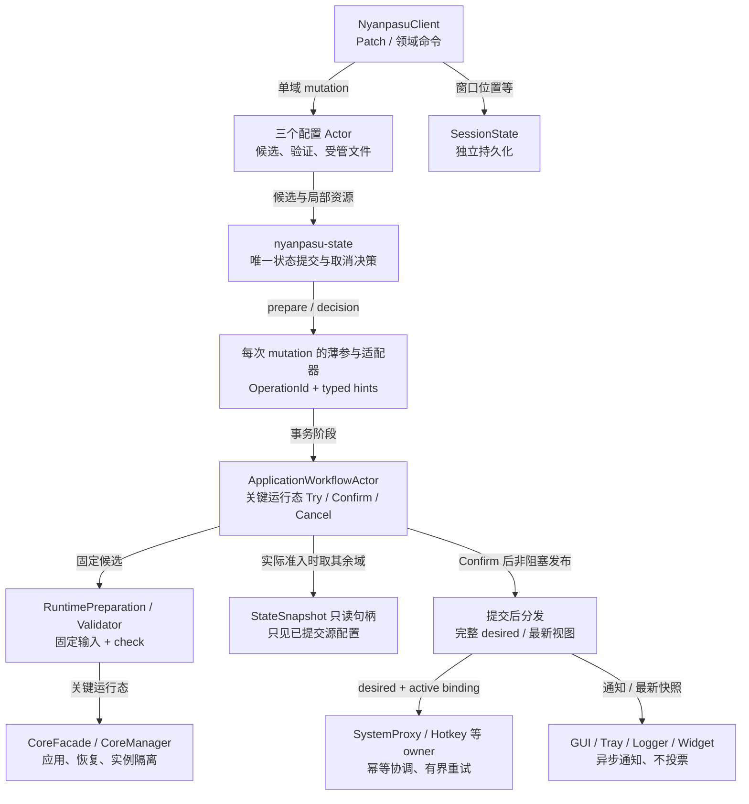

Workflow 不写源配置，不向正在等待 ACK 的配置 Actor 发 Get/Patch RPC；外围 owner 不是 state Required 参与者。

### 3.1 所有权约束

源配置仍由三个域的 PersistentStateManager 单写；ApplicationWorkflow 没有配置写 client，没有 NyanpasuClient 反向依赖。读取只用 StateSnapshot；候选来自该笔 StateChange 与 typed metadata。

Workflow 对 state 是一个必要参与者，对内部 runtime 是执行协调者；这两个角色不矛盾，但不创建第二个“源配置提交点”。参与者维护的 pending transaction/checkpoint 是临时执行上下文，不是第四份配置权威。

三域每笔行为相关 mutation 在 prepare 中进入同一执行域；在这一条事务结算前，其他域不能发布会改变同一 runtime 输入的状态。SessionState 不依赖该执行域。只读接口返回当前已提交快照，不能经忙碌 Actor 的 Get RPC 排队。

### 3.2 每次 mutation 的薄参与适配器

本稿选择**每笔 mutation 一个适配器**，而不是让固定 subscriber 使用 `(domain, version)` 查询旁路 map：

```text
配置 Actor 收到 typed command
  → 分配 OperationId（失败也不复用）
  → 构造候选、typed hints、可选 staged resources
  → 构造 ApplicationMutationParticipant<T>
  → 交给 state 的本次变更入口
```

该适配器捕获固定 OperationId、领域标识、动作提示、暂存内容句柄与 workflow sender。state 对同一参与者 Arc 调用三个阶段，迟到回调自然携带原 OperationId。由此不必把 nyanpasu-core 依赖反向指向应用的 CoreManager OperationId 类型。

需要给现有 manager/coordinator 补一个“单次参与者”入口，将它与已有 subscribers 一起参与**同一个** state transaction；不使用临时 add/remove 全局订阅者的方式，避免取消后泄漏注册。具体名称可为 `replace_if_version_with_participant`，名称是本稿提议，不是已存在接口。

### 3.3 结算不是普通通知

`on_committed/on_rolled_back` 向 workflow 投递结算信号；GUI、托盘不注册进这两个钩子的阻塞链。必要的源状态决定另有只读 DecisionHandle（§4.2），避免一次通知取消/丢失使 AwaitDecision 永久挂起或错误选择 Cancel。

Confirm/Cancel 是当前事务的控制消息，绕过普通工作 FIFO，按 OperationId 匹配。它们是幂等的：同决定重复投递返回已有结算；不同决定冲突要查权威决定，不能“最后到达者获胜”。结算记录有界，但进行中的上下文不能被环形历史淘汰。

### 3.4 外围通知不互相阻塞

保留 existing owners 与窄 adapters，但去掉“一个大顺序 loop 因 PAC 网络等待把 GUI 卡在后面”的接线。按固定依赖分为 system-proxy/guard、hotkey/autolaunch、visual 三组；不引入动态 DAG。

visual 内 locale 先于 tray；system-proxy 内代理先于 guard。各组由自己的 owner/串行任务维护顺序，互相不等待。快速发布完整 desired/最新视图后就可返回 mutation；执行失败通过状态流报告。

## 4. 最小协议与 state 补强

### 4.1 三种身份不能混用

| 身份                              | 作用                                                   | 禁止用途                              |
| --------------------------------- | ------------------------------------------------------ | ------------------------------------- |
| `OperationId`                     | 一次 mutation/运行任务的生命期，三个阶段与暂存资源关联 | 不代替源配置 CAS 版本                 |
| 每域 `Version / StateChangeId`    | 本域源状态 CAS 与变化顺序                              | 不作为失败尝试唯一 ID，不跨域比较大小 |
| 会话内发布序号 / `EffectRevision` | 排序已发布视图和 owner 的最新 desired                  | 不用“收到/尝试过”冒充“成功应用”       |

UI 重连/应用重启时同时携带 session identity 与序号，先建立新会话的完整快照；不能拿新进程从 1 开始的序号与旧进程的 500 比大小。复用已有 session/generation 标识；没有时才新增一个会话 nonce。

### 4.2 state 核心只补必要契约

[F §2.3] 的“不改 nyanpasu-core”不作为 v2 约束。最小修改为：

**单次参与者入口。** 将当前 candidate、其参与者和原有 state 事务绑定，不复制 prepare/commit/rollback 算法。

**权威决定句柄。** 每次 state transaction 分配只读 `DecisionHandle` 给本次参与者；coordinator/transaction 独占写端。状态可为 `Undecided / Committed { version } / Aborted`。CAS 成功与写 Committed 之间不能插入 await；Abort 在回滚通知前记录。该句柄只证明源状态提交决定，不证明外部资源已经恢复，也不证明多文件耐久性。

**结构化持久化/恢复结果。** 不能把文件恢复失败压成普通验证失败。继续复用条件替换路径的 recovery 机制；普通 upsert 的持久化一致性也统一到带条件与恢复的路径。若文件 promotion/YAML 需要同一局部提交步骤，在现有 prepare 与 CAS 之间组合这些持久化操作，失败通过原 journal 补偿，而不是另建状态事务。

**关键清理不能依赖同步 Drop。** Drop 只触发取消/告警，不同步 block_on 等待 core/OS；state 的 mutation task 和 workflow 的 application task 在正常关闭时显式等待。未知持久化结果记录为需恢复，不能因为内存未 CAS 就断言磁盘没变。

### 4.3 应用接口草图

下面是目标边界，不要求逐字实现：

```rust
// 每次请求创建；OperationId、文件资源与 hints 由此稳定绑定。
struct ApplicationMutationParticipant<T> {
    operation_id: OperationId,
    domain: ConfigDomain,
    hints: MutationHints,
    staged: Option<PreparedProfileResources>,
    workflow: ApplicationWorkflowClient,
    _state: std::marker::PhantomData<T>,
}

enum WorkflowMessage {
    Try { operation_id: OperationId, change: DomainChange },
    Confirm { operation_id: OperationId },
    Cancel { operation_id: OperationId },
    RetryLatest { kind: ReconcileKind },
    Recover,
    Close,
    // 继续复用已有非配置维护消息、状态查询、完成消息。
}

enum RuntimePrepareOutcome {
    Applied(RuntimeApplyReceipt),
    Deferred { baseline: KnownRuntimeState, cause: RetryableCause },
    SavedInactive,
    Rejected { cause: ApplyFailure, restored: KnownRuntimeState },
    RecoveryRequired(RecoveryContext),
}
```

`MutationHints` 是小型强类型结构，保留 request 中的 mode 意图、显式激活类型、content touched/resource token；不是 `Any` service locator 或无类型参数袋。资源 handle 不只由配置版本定位。

### 4.4 对 ACK 的映射

| Try 结果                             | state ACK       | 之后                                  |
| ------------------------------------ | --------------- | ------------------------------------- |
| Applied / 无关键操作 / SavedInactive | `Ack::Ok`       | state 持久化，等待决定                |
| 已满足安全延期条件的 Deferred        | `Ack::Degraded` | 允许提交；Confirm 后建立 retry target |
| 确定拒绝，必要恢复完成               | `Ack::Rejected` | Abort；Cancel 幂等结算                |
| 内部错误/恢复失败/Unknown            | `Ack::Failed`   | 不批准提交；workflow 保留恢复上下文   |

结构化 cause/status 由 operation receipt 保留，不从 `Ack::Degraded(String)` 的文案反向解析控制逻辑。Closing 不实现“跳过 Required”的 `is_shutdown=true`；普通新变更返回 Rejected。

## 5. 通用事务流程与并发保证

### 图 2 · 单域修改的通用决策流程

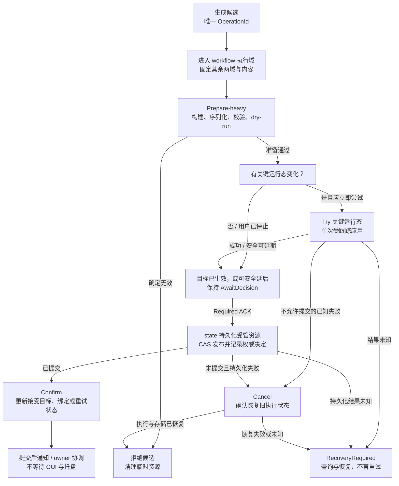

安全延期要求：typed retryable + 操作已终止 + 安全基线 + 命令允许延期 + 尚有重试策略；不是见 retryable=true 就提交。

### 图 3 · ApplicationWorkflow 事务生命周期

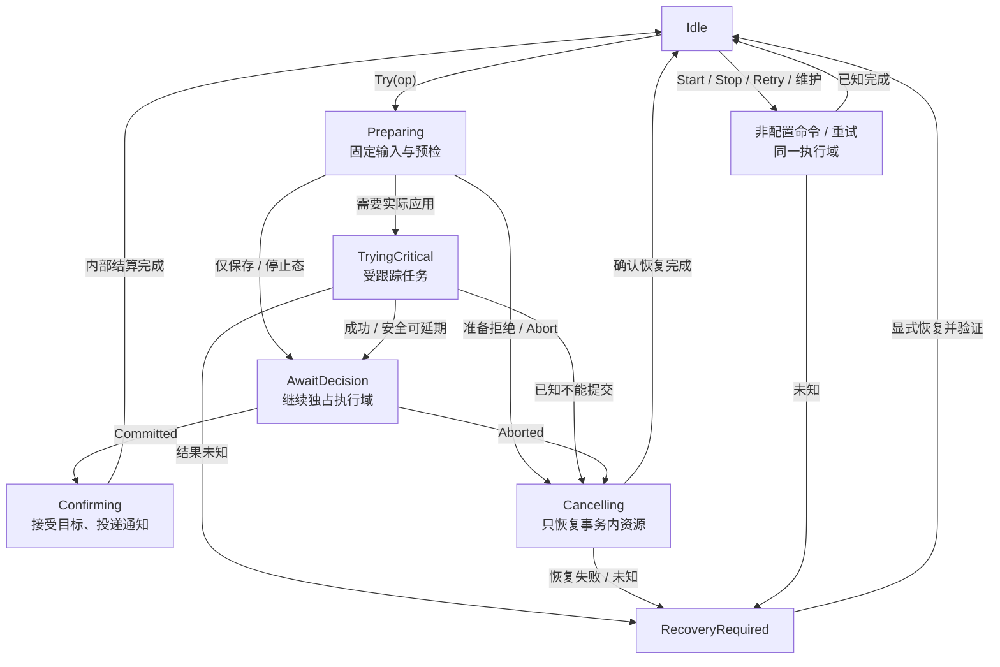

Confirm/Cancel 不排普通 FIFO；按 OperationId 定位当前事务。Closing 是正交 admission 标志，不能覆盖尚未结算的状态。

### 5.1 实际执行顺序

1. 配置域在自己的单写者中构造 candidate 与资源；预序列化能前移的字节，生成唯一操作身份。
2. state 调用本次 Required 参与者；workflow 有界准入。正在处理其他事务时，只排应用工作，普通读取不中断。
3. **真正取得执行域后**，加载其他两域 committed snapshots；修改域使用 StateChange 的 before/current；固定这次构建用到的 profile 内容。
4. 纯影响分类；Prepare-heavy 构建、检查与能力验证。未完成检查不等于验证通过。
5. 对关键 runtime 执行一次 tracked Try；不在 Try 操作普通系统设置/GUI。根据 §2.2 决定 Applied、Deferred、Rejected 或 Unknown。
6. 准许提交时保留 runtime checkpoint 与原重试状态，进入 AwaitDecision。直到 state 的持久化/CAS 决定出来，不放行下一项冲突工作。
7. Committed：Confirm 接受 desired；Applied 分支接受真实 binding；Deferred 分支保持旧 binding 并注册目标差距。快速投递外围目标、视图及合适的后续动作，结算。
8. Aborted：先等待本次已发起操作的真实终态，再恢复事务前实际运行基线/受管资源；成功后才释放执行域。GUI 没参与 Try，无 GUI 回滚可做。

### 5.2 具体的跨域陈旧输入问题

A 修改 Application，B 同时修改 Profiles。B 可以提前得到自己的 Profiles candidate，但不能在等待 workflow 时就把旧 Application 固定进 CandidateInputs。A Confirm 后 B 才准入，B 必须读取 A 已提交的 Application。

域内串行不能自动保证跨域采样正确；“准入后取其余快照”是必要规则。后台订阅提交和前台 patch 均遵守，不能留绕过者。

### 5.3 checkpoint 是实际基线，不一定等于旧 desired

允许降级后，可能存在 `desired=10, applied=8`。新事务 11 的 Try 成功，随后持久化失败，Cancel 应恢复实际基线 8，并保留原本追赶 desired 10 的状态；不能重建配置 10 并假装那是事务开始时实际运行状态。

恢复 receipt 记录实际 runtime 字节/摘要、core spec、宿主、运行/停止意图、local IPC 设置及原成功 binding。恢复可产生**新的**实例 generation；验证的是目标内容/身份/宿主/意图，而不是要求新 generation 等于旧 generation。

### 5.4 Applied、accepted 与 inspection

Try 内 core 已成功应用是事实，不能因为源配置尚未 Confirm 就把这个事实藏成“没发生”。操作状态显示 `AppliedPendingCommit`；外围依赖只消费**已接受且不处于 transition 的 binding**。

有效配置 inspection 可以晚于 apply 回执。它补充诊断，不决定是否拥有恢复所需 receipt。T4 为此建立独立 `last_confirmed_runtime_receipt()` 读取边界，既不盲取 promoted，也不盲取旧 applied。

### 5.5 超时与 admission

分开 admission 等待、可取消预检、已提交 core 操作的结果查询、state 决定等待和 GUI/OS 通知超时。预算作为私有常量/测试注入先落地，不预设每一项都能在“典型 2 秒”完成，也不统一硬塞 180 秒。

观察等待超时只影响响应，不会把实际 core 操作变成已取消。配置候选尚未准许提交时发生 ACK 超时，state 可以选 Abort，但 workflow 必须在原操作完成/确认后再恢复。未知状态只限制相关关键执行域，非相关 GUI 仍能显示诊断与恢复入口。

### 图 13 · 调用者超时与迟到完成

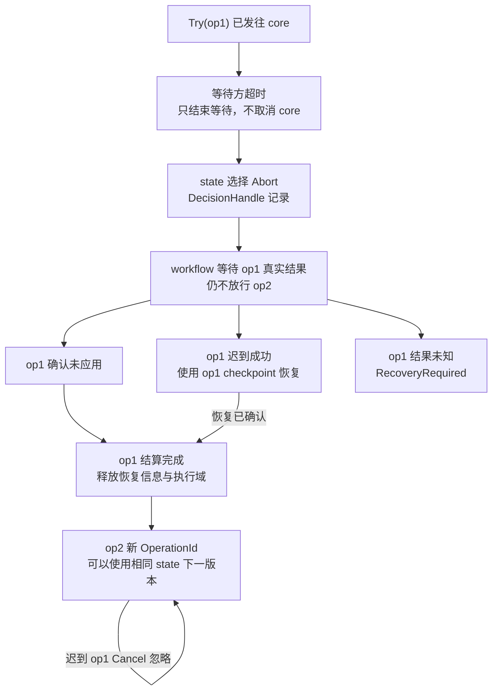

失败尝试的配置版本可以复用，但 OperationId 绝不可复用；回执与暂存资源按操作身份定位。

### 5.6 runtime 产物文件不是源状态提交点

公开 runtime YAML 是派生产物，不与实际 apply 事实混为一谈。Try 使用私有候选/inline bytes；source Confirm 后可发布对应已接受产物。公开产物写入失败记录 `runtime_product_publish_failed` 并重试，不回滚已经成功提交的源配置和实际 runtime。

`Promoted` 只在产物文件真正发布后推进；`AppliedReceipt` 只在 core 确认后推进。两者允许暂时不同。若现有 `bind_applied` 必须依赖 `promoted` 已存在，T4 要拆开这个内部约束，不能为了适配旧 store 顺序把未写成的文件报告为已发布。

派生产物写入使用同一串行发布路径并检查目标身份，避免旧异步写覆盖更新产物。失败时用于恢复的 runtime receipt 必须保留；源配置所引用的外部资源若已不可用，不能保证重新应用旧字节必然成功，恢复失败仍进入 RecoveryRequired。

## 6. 三类配置修改流程

### 6.1 ApplicationConfig

### 图 4 · Patch ApplicationConfig

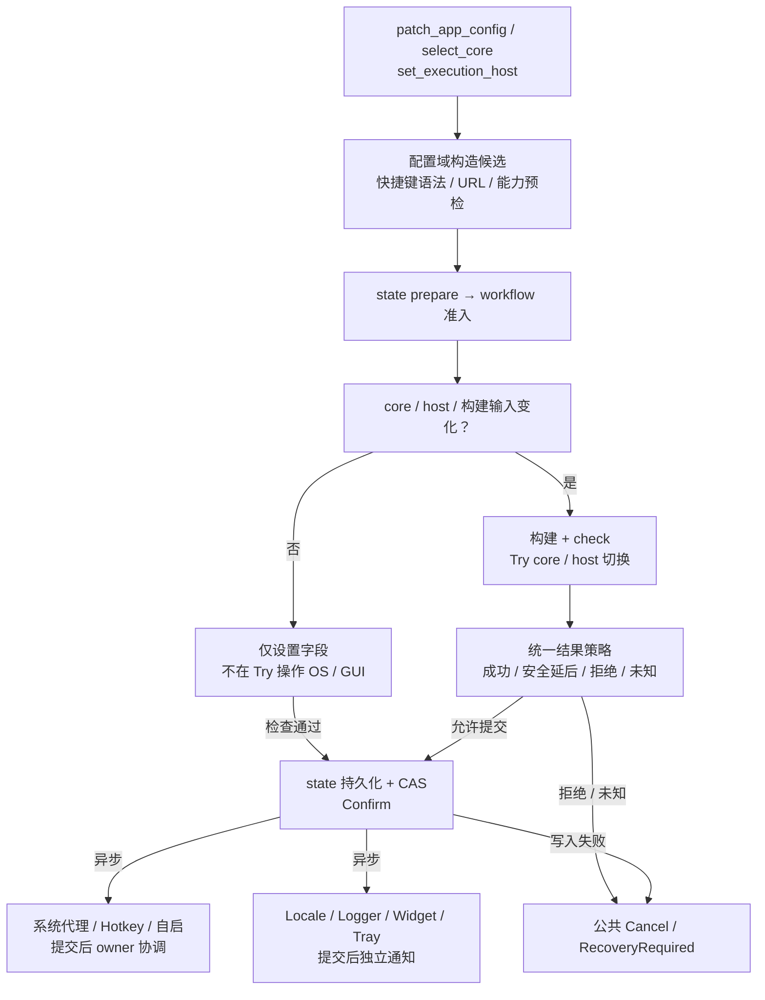

显式换核、换宿主默认 MustApply；UAC 拒绝不重试弹窗。普通保存不得隐式启动用户已停止的 core。

`select_core`、`set_execution_host` 改回 facade → Application 域 typed mutation，不能在 workflow 内 patch Application 后，再由 subscriber 回调 workflow 形成等待环。Workflow 只接收该笔候选并执行其关键部分。

纯设置 patch（语言、托盘、自启、快捷键、系统代理开关等）在验证后进入短事务：prepare 不等待 OS 设置执行；state 提交；Confirm 投递完整 desired。无效快捷键语法、无效 URL 等可提前拒绝；已经存有旧的非法配置时，不相关字段修改不能因此全部被阻断。

显式切核和宿主切换默认 MustApply。能力检查、二进制就绪、权限前置条件尽可能提前；UAC 拒绝视为用户拒绝，不自动重试。切换失败要核实旧宿主/实例是否仍可用，不能只根据错误名判断没有副作用。安装服务/下载二进制属于独立维护动作，不隐式藏进一次普通设置 patch；其不可逆资源不归整笔配置回退。

系统代理 checkbox 表示用户 desired，状态附注显示 OS 是否实际生效。GUI 可以反映两者差距，不应在外围效果失败后把 checkbox 静默改回旧值。

### 6.2 ClashConfig / ClashOverridesConfig

### 图 5 · Patch ClashConfig / ClashOverridesConfig

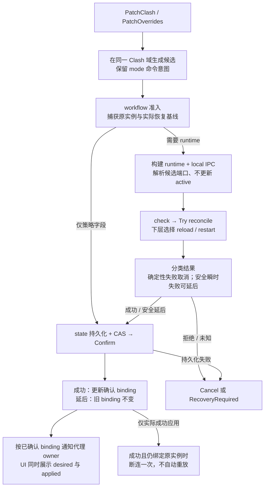

mode 重复提交语义保持 #5250，用 typed hint 保留；不为了纯 diff 简化而悄悄改变用户操作行为。

保持 overrides 属于同一源配置域，不因事务化另建一份持久化表。普通 Clash patch 和 overrides patch 共用 mutation wrapper，改变的是候选构造函数。

RuntimeImpact 覆盖所有实际构建依赖，不只复制原 `runtime_apply_kind` 的字段白名单。控制通道和运行配置由同一个候选输入决定，交给一次 reconcile，由下层选择 reload/restart；不在应用层先调用一套 ControlChannel，再调用另一套 rebuild。

端口分为候选解析、实际执行回执、被应用层接受的 active binding。`resolve_candidate` 只复用已确认指纹并探测变化字段，不更新共享 active cache；`confirm` 只能接收对应目标实际成功的 receipt。Deferred 提交不会把新候选端口写成 active。

系统代理与 SelfProxyPortSource 从已接受、可用的运行 binding 取端口；没有运行实例时返回 unavailable/None，不能仅因为上次用过 7890 就仍声称它在监听。core 自身停机/换宿主后也必须触发 binding 状态更新，不只配置 patch 会影响它。

Try/恢复期间，为防止旧 guard 或旧异步 OS 写反复安装过时端点，可复用 SystemProxy owner 的窄生命周期暂停/恢复机制：transition 时暂停依赖 runtime 的新写入，结算后基于真实 binding 协调。它只是依赖 fencing，不把 PAC、所有 OS 设置的快照纳入源配置 TCC。

保留相同 mode 重提的既有命令语义：通过 `mode_requested` 等 typed hint 产生一次性动作。纯配置差异为零不代表动作请求为空。动作只在提交与实际应用均成功后执行，绑定原实例；源实例已被替换就跳过。Deferred 路径不把旧断连请求放进自动重试队列，记录该动作未执行；后续恢复不对新实例补发旧动作。

### 6.3 Profiles

### 图 6 · Patch Profiles 与订阅更新

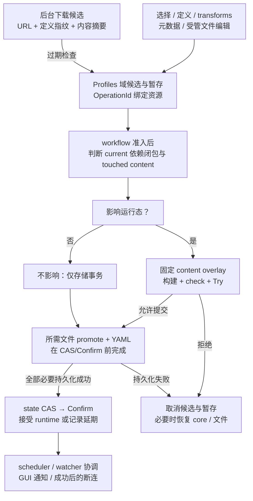

新建/导入与条件自动激活是两笔事务。外部编辑的源文件不归应用所有，只对其内容摄取与 runtime 接受负责。

保留领域命令而不是强制整个 Profiles 都变成泛型 Patch：`SetCurrent`、`SetCurrentIfNone`、metadata、definitions、transforms、受管文件编辑、订阅刷新均有各自验证。

影响判断由 current 的依赖闭包、闭包内 definition 差异和**实际内容触碰**共同决定。仅比较 `ProfileItem` 元数据会漏掉“同一路径文件内容改变”；typed `touched/content_digest/resource` 信息必须进入候选上下文。保守地多算可以，不能漏算当前依赖内容。

后台下载仍可在应用执行域外并发，提交前复核 URL/定义指纹。过期下载丢弃自己的暂存文件，不写盘、不误覆盖较新定义。Try 构建使用本轮固定的内容集合；变化项来自 staged bytes，其他依赖固定为本轮读取结果。无需引入持久化文件 MVCC。

新建/导入成功后，条件自动激活单独运行：先保留 ProfileId，再尝试 SetCurrentIfNone；第二笔失败不删除已导入资料。不能以队列外 Get 后 Set 替代原子条件检查。

**本轮不得把 `save_profile_file` 留成可绕过状态事务的受管文件写口，再声称 Profiles 已完整事务化。** 受管编辑纳入 T6；外部编辑无法回滚外部源，但摄取固定内容并接受为 runtime 的过程走同一串行工作域。若外部内容无效，保留 last-good runtime 并显示 `external_source_rejected`，不宣称磁盘外部文件也已回退。

## 7. Profiles 本地资源与提交点

### 图 7 · 候选文件资源生命周期

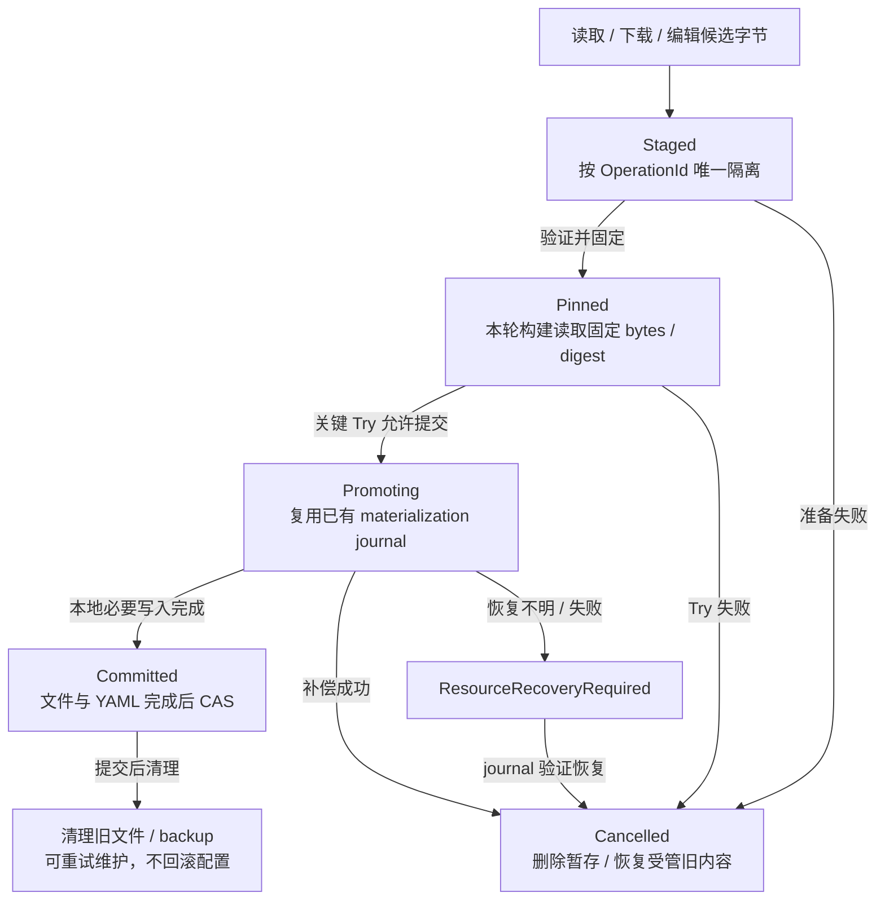

不只用 candidate.revision 命名暂存：失败尝试可复用版本。不能在 Confirm 后再执行会使提交失败的必要 promote。

### 7.1 存储顺序

针对需要修改受管文件的操作，目标顺序为：

```text
prepare resource / stage（登记清理）
    → candidate + 固定 overlay
    → state prepare / workflow critical Try
    → 完成受管文件 promotion + YAML 持久化（已有 journal 保护）
    → CAS 源状态 + 写权威 Committed 决定
    → Confirm
    → 旧文件/backup 清理与 scheduler/watch 通知
```

YAML 和资源 promotion 的内部先后以现有 journal 的恢复协议为约束；无论采用何种局部顺序，**不能在整个必要持久化仍可能失败时提前给 workflow 发最终 Confirm**。将这些必要写入组合在现有 state prepare 与 CAS 之间，而不是在 CAS 后另建一个补偿事务来掩盖提交点问题。

若当前 manager 无法注入这一局部持久化步骤，T2 扩展其单次变更持久化边界，复用既有 coordinator 和条件恢复，不暴露让任意业务绕过状态提交的 write 接口。

### 7.2 失败和取消

Prepare 失败只清理暂存。持久化中途失败由现有 journal 恢复已动过的受管文件/YAML，并由 workflow 恢复其 Try 改过的关键 runtime。两种恢复都要有结果，不能因为其中一项成功就声称整笔已恢复。

已提交后的 backup 清理失败是维护降级，可重试；不能为删除一个旧临时文件而回滚新配置。相同操作的 cleanup 必须幂等，已清理时再收到取消不影响其他操作资源。

编辑器保存、订阅刷新与内部 promotion 产生的文件事件要携带/识别内部来源或内容指纹，避免 watcher 又把同一提交当成外部修改重新触发循环。

### 7.3 明确不保证的隔离与耐久性

不承诺多文件断电原子性，也不承诺外部进程看不到文件 promotion 的瞬时顺序。复用 journal 进行启动恢复；源状态读者只看 committed snapshot；runtime 构建只读固定输入。没有新增持久化协调日志时，进程在关键 Try 后崩溃的窗口仍然存在，按 §11 的真实状态探测和启动协调处理。

## 8. 外围效果：提交后协调，而不是扩大 TCC

### 8.1 保留窄 API，删除全局 effects checkpoint 计划

不采纳 [F §5.5] 将 `ApplicationEffectsPort` 全面改成 `{try_apply, rollback, post_commit, shutdown}`。保留外围执行/关闭边界，增加必要的非阻塞提交或 watch 入口即可；`apply` 在独立 owner/受跟踪任务中执行。

必要的关键事务只持有 core/host/runtime receipt 和本地候选资源；不会因托盘刷新、PAC 拉取、快捷键注册或自启失败而回滚 core。

### 8.2 逐类策略

| Owner/动作        | 提交前                               | 提交后失败策略                                                          | 是否牵连全局配置回退 |
| ----------------- | ------------------------------------ | ----------------------------------------------------------------------- | -------------------- |
| SystemProxy / PAC | URL 与平台能力纯预检                 | 网络瞬时失败重试；保留安全旧设置或已有合法 fallback；权限等错误 Blocked | 否                   |
| ProxyGuard        | 间隔校验                             | 基于最后确认可用 proxy 状态；依赖未就绪时 WaitingDependency             | 否                   |
| Hotkey            | 语法、重复声明、明确不可支持组合预检 | 局部替换、失败尽量保留旧注册；冲突提示用户修正，不无限重试              | 否                   |
| AutoLaunch        | 平台能力检查                         | 失败标记 owner 状态；单独重试或提示权限                                 | 否                   |
| Locale / Logger   | 枚举与参数验证                       | 通知结果告警，不阻止配置提交                                            | 否                   |
| Widget            | 参数验证                             | 按 desired 起停；启动失败 owner 状态降级，关闭时等待实际进程清理        | 否                   |
| GUI / Tray        | 不执行 GUI                           | 合并刷新、读取最新视图、独立告警                                        | 从不                 |
| 连接打断          | 保留 source capability 与动作意图    | 提交且应用成功后至多一次尝试；失败告警，不自动补发                      | 从不                 |

PAC fallback 指向应用已确认的手动代理端点，不等于把流量改为外网 DIRECT；没有有效 active endpoint 时不能安装一个候选端口。fallback 生效也不代表原 PAC 目标已成功，状态必须区分实际 fallback 与未满足的 desired。

### 8.3 失败的时间决定报告位置

异步通知尚未执行时，mutation 返回“源配置已提交，通知已排队”，不能宣称所有效果 Applied。后续失败通过订阅状态事件/inspect 接口呈现，不能改写已经发出的 RPC 结果。

为了减少 wire 改动，可保留 MutationOutcome 的提交成功/降级概念，附带 commit revision、runtime status 与 notifications_pending；也可迁移成等价的 CommitReceipt。T9 必须同步前端文案，使 `committed` 不等于“全部副作用已完成”。不要靠无类型错误字符串表达状态机。

## 9. 有界重试、差距与 owner 状态

### 图 8 · 可重试降级的收敛生命周期

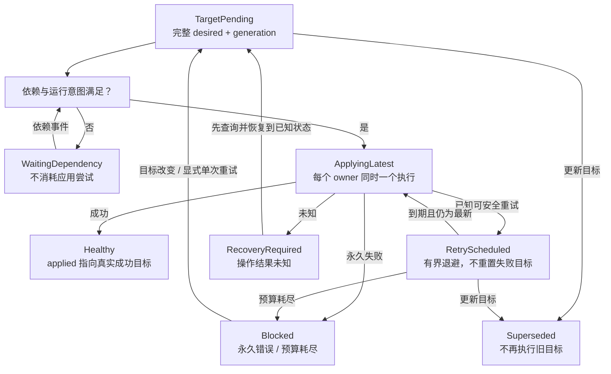

desired 与 applied 的差距只是“未收敛”，不是无限重试许可证；不相关配置保存不重置该 owner 的预算。

### 9.1 状态投影

建议在现有 `EffectStatus`/runtime 状态上明确这些含义，而不是再建一个通用工作流引擎：

```rust
enum ReconcileHealth {
    Healthy,
    Pending,
    Deferred { retry_at: Option<Instant> },
    WaitingDependency,
    Blocked { reason: String },
    RecoveryRequired { operation_id: OperationId },
}

struct ReconcileStatus {
    desired_revision: EffectRevision,
    applied_revision: Option<EffectRevision>,
    last_observed_revision: EffectRevision, // 只用于丢弃迟到状态
    health: ReconcileHealth,
    attempts: u32,
}
```

这些字段按 runtime 或 effect kind 的目标使用。一个语言变化不应自动增加 SystemProxy 的 desired 目标代际；完整源配置更新只为输入确实改变的 owner 产生新目标，或显式要求一次 retry。语义相同但流程需执行的一次性动作另走 ActionContext。

“已收到新 revision”“已开始尝试”“成功应用新目标”是三件事。即使失败，也要更新 last_observed 以拒绝旧成功覆盖较新失败；但 applied 仍指向真实成功目标。不要用 tray 的尝试计数冒充系统设置的 applied revision。

### 9.2 实际调度规则

每个效果种类最多一个活动执行、一个合并后的最新目标和一个重试计时。runtime 的重试复用 ApplicationWorkflow 的执行域，外围的重试归对应 owner/现有调度组件；没有 facade 第二份 retry map。

初始可选预算：一次初始尝试后最多三次自动重试，延迟基线 1、5、30 秒，并允许小幅抖动；这是本稿的工程默认值，不来自 Harness，也不是性能承诺。通过测试时钟验证，不在用户界面写预计完成时间。

以下事件不重置某 owner 的自动预算：窗口移动、其他配置域的不相关保存、同一失败目标的重复广播。目标内容真正变化可以创建新目标；用户显式 RetryNow 允许一次受控探测，不顺带无限补满自动预算。

重复保存相同的相关字段，如果该目标尚未成功，不能仅因为 diff 为空就跳过。可视为显式请求该目标一次重新评估/尝试；永久 Blocked 不自动循环。WaitingDependency 因为没有实际尝试，不消耗应用预算，但依赖等待也应在 UI 可见。

### 9.3 Superseded 与在途任务

“只追最新”只适用于未执行的 desired reconcile/通知，不适用于已接受且未结算的 TCC。已发生副作用的旧操作不能直接丢 future。

owner 先使旧执行达到可确认终态或安全取消点，再处理最新目标。迟到旧失败只更新自己的历史，不能安排旧目标重试；迟到旧成功不能清除最新目标的失败状态。实现不必依赖持久化事件日志，只需保留最新目标、活动任务与少量结果历史。

同一目标的 retry 优先复用仍适用的已校验 runtime bytes；输入、二进制能力或端口条件变了必须重建/重检。重新执行脚本得到的新产物不能不经校验就假装是上一次检查过的字节。

### 9.4 提交后的永久错误

延后应用的目标在未来可能暴露未能预见的永久失败；停止自动重试并显示 desired/applied 差距。这时不能给原事务发 Cancel。用户“还原至上次可用配置”通过 facade 发起**新的**单域或明确复合修复命令，并检查预期源版本；不得旧任务后台回写整份旧配置覆盖用户的新修改。

## 10. GUI、托盘与状态事件生命周期

### 图 9 · GUI / Tray 通知生命周期

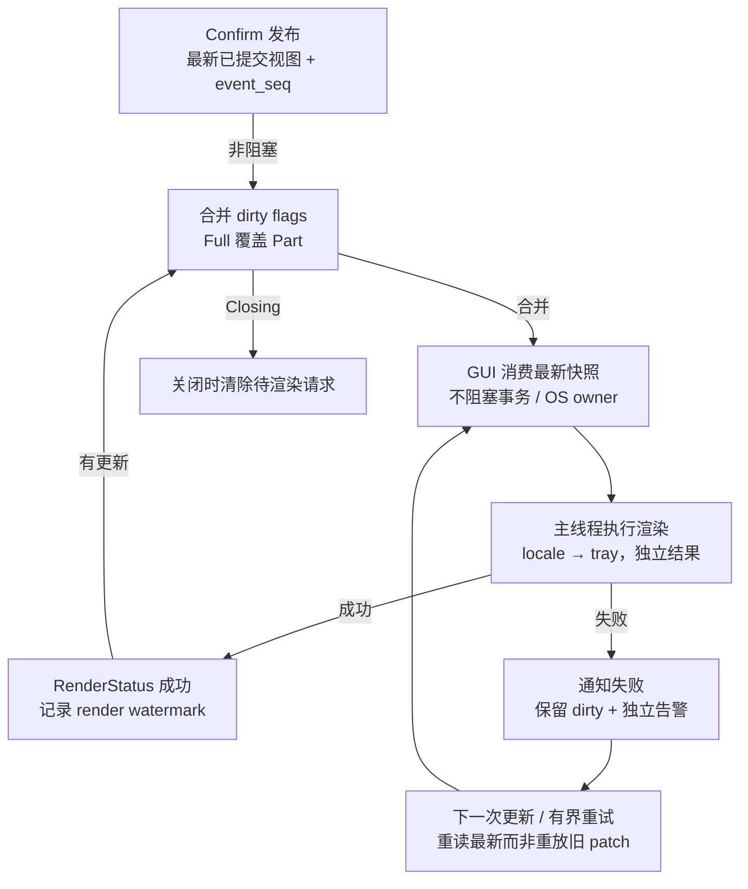

非重试型 GUI 故障也不回滚源配置。异步失败通过状态事件报告，不能追改已返回的 mutation 结果。

Confirm 只把最新一致视图/dirty flags 放入可合并的通道；不等待渲染，不把 GUI 返回值转成 Required vote。UI 正常展示 desired 与 actual/health，不能只用 checkbox 推断 core 或 OS 已成功。

Full tray refresh 必须覆盖 Part。一个失败的 Full 不能被稍后的成功 Part 清除；保持 full_pending，直到实际全量刷新成功。可以继续复用栈 B 已有 Full/Part 语义，但不再让多套 facade/executor map 争夺重试所有权。

通知内容携带完整投影视图或让消费者读取最新只读视图，不发送可能丢失累积含义的配置 delta。前端按同一 session 内更高 event_seq 接受快照。我们用的是可合并的快照通知，因此可以跳过中间序号；不能照搬事件日志的“任何 seq 缺口都是损坏”。[D §1.5 的规则来自另一种载体]

耗时的 PAC、热键操作不占 GUI 消费路径。GUI 失败只影响 GUI 的 dirty/health；错误处理链本身不能再阻塞源状态或反向回调 patch。

## 11. 启动、关闭与恢复

### 11.1 正常启动

### 图 10 · 启动与崩溃后重新协调

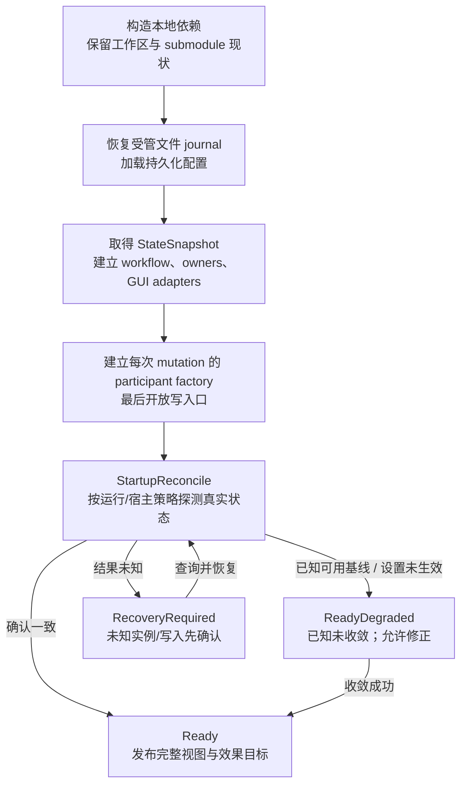

加载不是一次用户 patch。启动失败不得回滚为默认配置；不直接假定重启已杀死 service 中的旧进程。

先恢复本应用受管文件 journal 并加载磁盘配置，再取得只读句柄；然后建立 workflow、runtime adapters、效果 owners、GUI adapters，最后开放普通写入。

每次 mutation 的参与适配器在真实用户/后台提交时构造；加载 manager 本身不需要触发关键 Try。避免原初始化通知在 GUI 尚未安装时造成伪失败或直接启动 widget。

StartupReconcile 是无本次源修改的独立命令：读取加载后的 desired，检查/探测实际运行状态，按启动及宿主策略协调，随后 full notify。失败不把用户磁盘配置重置为默认。已知安全但尚未完全生效为 ReadyDegraded；有未知进程或存储状态时，先进入恢复流程。

Random port 的结果只更新运行 binding，不再被 legacy startup sync 写回源配置引发第二次 rebuild。

### 11.2 崩溃后的第一轮检查

进程重启不等于 service core 已退出。必须查询宿主、实例 generation、运行配置身份与可恢复操作结果；无法证明某进程归属时不启动可能冲突的第二个实例。

磁盘加载结果是重启后的 desired 来源；没有持久化应用事务日志时，不能精确重建上一进程每一项未回执动作，本稿不承诺跨崩溃 exactly-once。依靠现有 manager/journal 恢复、真实状态探测与最新目标协调。一次性断连不在启动时重放。

系统代理恢复只针对已知由应用拥有/接管的设置；不能覆盖第三方设置并声称“还原”。原有退出恢复机制的限制保留，无法确认时显示状态并提供显式恢复动作。

### 11.3 正常退出

### 图 11 · 正常退出与关闭中的在途事务

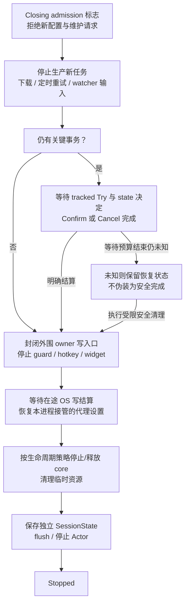

不在 Drop 中同步等待远端副作用；强制退出只能报告清理未完成，不保证系统代理或服务进程已经恢复。

Closing 是正交标志，不销毁当前 AwaitDecision 上下文。拒绝新配置和维护操作，停产后台新任务，但处理当前事务的决定/完成消息。已准入 Try 不因用户关窗口而被直接 abort。

源配置事务与关键运行任务结算后，封闭外围 owner 的新写入入口，停 guard/注册/widget，并等待已发起的 OS 写明确结束，再恢复本进程拥有的系统代理。不能仅发一个 cancel token 就假设阻塞系统调用已经终止。

core 按明确的 app/service 生命周期策略停止或释放；最后保存独立 SessionState 并 flush/停止 actor。GUI 不可用不会阻止安全退出；未知外部写或实例不能被超时转换成“已安全清理”。强制退出作为未完成清理报告，而不是成功恢复报告。

### 11.4 RecoveryRequired

### 图 12 · 结果未知与确定性恢复

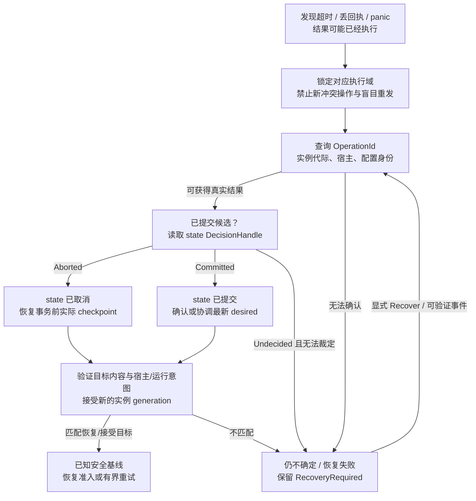

恢复 B→A 时底层 RolledBack 可能仍留下 B。成功条件是实际目标匹配 A，不是枚举名字叫 RolledBack。

RecoveryRequired 是有名字、有上下文的状态，不是“一律让用户重启”。上下文至少保留操作身份、阶段、源提交决定、已知实际 binding、目标/恢复基线和上次错误。

Recovery 先查询原操作与真实实例，再根据 state DecisionHandle 选择方向：源已取消则恢复原实际基线；源已提交则确认/协调已提交目标；决定无法确认则继续隔离，不擅自任选一个方向。

只有验证运行目标内容、宿主、权限所有权、运行/停止意图以及必要存储状态后才恢复准入。恢复成功可获得新的 binding generation；不能要求旧 PID 或旧 generation 原样回来。外围 owner 的未知写只隔离该 owner，除非它直接妨碍关键网络/进程安全。

## 12. 实施任务与提交依赖

### 图 14 · 实施依赖与集成顺序

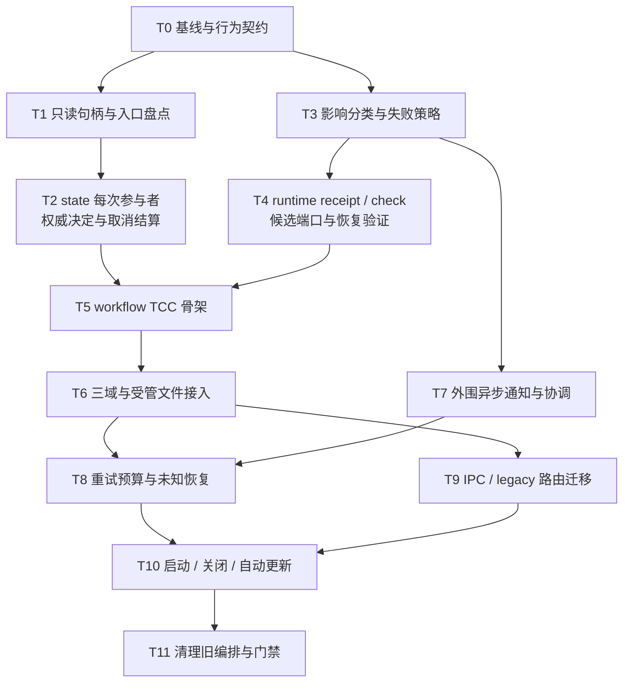

各提交有自己的受控测试；只有全部源写入口迁移完成，才删除 facade gate、after_commit rebuild 和重复 retry map。

### T0 · 固定集成基线与失败策略契约

**改动范围：** 工作区记录、两栈集成、现有 tests/docs。  
**工作：** 记录 HEAD、branch、dirty files 与 submodule gitlink/工作树；在用户指定现有工作区建立实施分支，不另开 worktree、不 reset 既有变更。实际集成两栈，修复 workflow/core_lifecycle 接线；检查 artifact、bindings 与 ledger。用本稿 §2 的规则替代冲突政策。  
**完成条件：** 固定集成 SHA；编译与基线测试真实执行并记录；已知原有失败和新增失败分开，不叠加两栈宣称的测试计数。

### T1 · 读写路径与领域命令盘点

**依赖：** T0。  
**主要文件：** `client/{application,clash_config,profiles,mod}.rs`、`state/{application,clash_config,profiles}/...`、`application_workflow/preparation.rs`。  
**工作：** facade 读取改 StateSnapshot；列出所有前台/后台源写口；workflow 内源配置写入列入删除清单；实际准入后采样其余域。SessionState 不调用应用 reconcile。  
**完成条件：** 受控 barrier 挂起 prepare 时，getter 仍可直接返回旧快照；不依赖“必须在 10ms 内”这种机器相关阈值。静态检查 workflow 无配置写 client/RPC 回源依赖。

### T2 · state 单次参与者、权威决定及局部持久化结算

**依赖：** T1。  
**主要文件：** `nyanpasu-core/src/state/{ack,coordinator,transaction,manager/*}.rs`。  
**工作：** 单次 participant overload；DecisionHandle 在 CAS/Abort 原子阶段写入；传播结构化持久化/恢复错误；将单域必要资源写入放在现有 prepare→CAS 边界；避免关键回滚依赖同步 Drop。manager 常规写入统一条件替换与恢复语义。  
**完成条件：** 同一 state 版本上的两个失败尝试回调仍属于不同 OperationId；CAS 成功后通知丢失仍能判定 Committed；存储恢复失败不会返回“干净拒绝”；不新增第二套 prepare/commit 算法。

### T3 · 纯影响分类与 FailureDisposition

**依赖：** T0。  
**主要文件：** `client/effects/plan.rs`、新增窄 `application_workflow/{impact,policy}.rs` 或等价模块。  
**工作：** 复用 struct-patch；覆盖 Application 的 core/host/build 输入、Clash/runtime 输入、Profiles 依赖闭包与内容 touched；保留命令 hints；实现 MustApply/AllowDeferredWhenSafe/SaveOnly 等静态策略。  
**完成条件：** 单字段覆盖；输入为空与实际效果目标未收敛分开；不相关字段不重试；Unknown 不进入 retryable 自动分支。

### T4 · RuntimeValidator、实际 receipt 与候选端口

**依赖：** T3。  
**主要文件：** `client/ports.rs`、`runtime.rs`、`application_workflow/{ports,adapters,preparation}.rs`、`core/actor_v2/facade.rs`。  
**工作：** 接线固定基线中实际可用的 check 能力，不猜测 `/core/check` 版本；check 缺失/不可用给出明确结果。build 接收显式候选端口/内容；保留结构化 Reconciled/RolledBack/Unknown；提取与 inspection 解耦的 RuntimeApplyReceipt；实现恢复目标校验。  
**完成条件：** check 与 apply 使用同一待提交字节；候选端口从不污染 active；pending inspection 场景恢复到最近真实成功目标；恢复 RolledBack 留在错误目标时必不报成功。

### T5 · Workflow 选择性 TCC 骨架

**依赖：** T2、T4。  
**主要文件：** `application_workflow/{mod,workflow,tests}/...` 与薄 participant。  
**工作：** Preparing/TryingCritical/AwaitDecision/Confirming/Cancelling/RecoveryRequired；复用 tracked task 与 OperationId；结算消息不走普通 FIFO；DecisionHandle 兜住通知丢失；Closing 不覆盖活动事务；取消等真实完成再恢复。  
**完成条件：** 两域并发、迟到 Cancel、通知丢失、prepare 超时、保存失败等在 fake ports 下确定性测试通过；此时先不改变外围效果语义。

### T6 · 三个域与受管文件接入

**依赖：** T5。  
**主要文件：** `state/application.rs`、`state/clash_config.rs`、`state/profiles/actor.rs`、`service/profile_file.rs`、构建内容源。  
**工作：** 每次 mutation 创建适配器；Application/Clash 用统一入口；Profiles staged overlay 按 OperationId 隔离；内容触碰纳入影响分类；受管编辑与后台刷新同路；必要资源发布在 Confirm 前完成；导入/自动激活仍两笔事务。  
**完成条件：** 新受管内容构建时可见、公开源视图提交前不变；文件发布失败阻止 Confirm 并完成补偿；自有 watcher 事件不回环；不存在受管文件直接写盘绕过口。

### T7 · 外围通知与 owner 调和

**依赖：** T3；生产换线需 T5。  
**主要文件：** `effects/{executor,ports,status}.rs`、`system_proxy/*`、`hotkey/*`、`ui_effects/*`。  
**工作：** 普通效果全部移出 Required；固定分组异步调度，不让 PAC 阻塞 GUI；完整 desired 与 active binding；owner 局部一致性；GUI 合并最新快照，Full 覆盖 Part。删除 Fabel 的全局 OS checkpoint 任务，不新增一个 Actor 对每种无状态 adapter 包装。  
**完成条件：** 卡住 PAC/GUI 均不阻塞源配置提交和其他组通知；GUI 永久失败不触发任何源配置 Cancel；旧效果结果不能覆盖新状态。

### T8 · 未收敛状态、预算与显式恢复

**依赖：** T6、T7。  
**主要文件：** runtime/effect status、workflow 调度、现有 owner 调度。  
**工作：** runtime 同样纳入 desired/applied gap；WaitingDependency/Blocked/RecoveryRequired 分离；预算、退避、显式 RetryNow；未知先查；新的还原命令只经 facade 发版本约束的正向 patch。  
**完成条件：** 同值保存未收敛目标仍会评估；不相关保存不重置预算；预算耗尽停止；旧目标不能自动回写源状态；Stopped 意图不被重试对抗。

### T9 · IPC、前端与 legacy 入口换线

**依赖：** T6；状态展示依赖 T8。  
**主要文件：** `client/mod.rs`、`bridge/verge.rs`、`ipc.rs`、frontend bindings/MutationCache。  
**工作：** 明确 Committed 不代表 notifications 已执行；同步 receipt 和状态事件。legacy 只做字段转换，不保留第二套 effect gate。单行为域请求可转换为 typed mutation。真正跨 Application/Clash 的旧请求在任何写入前识别：首版迁移调用方到明确的分域操作；不能逐域 TCC 后仍宣称原复合请求原子。

若产品必须保留跨域原子修改，则把“复合源事务协议”列成额外范围和独立设计门，不夹带本稿；不能用 nested TCC 或逐域补偿冒充完成。混合 SessionState 的请求同样不能偷偷部分成功而返回一个笼统失败。  
**完成条件：** 旧 UI 调用清单全部处理；无 unsupported 多域请求在中间才发现；transport timeout 显示可查询操作而非“未保存”；异步 GUI 告警显示在独立状态区。

### T10 · 启动、关闭、后台源与恢复生命周期

**依赖：** T8、T9。  
**主要文件：** setup/lib、workflow shutdown/recovery、profile scheduler/watchers、owner shutdown。  
**工作：** 按 §11 的顺序组装；StartupReconcile；合并关闭路径；停止新生产者并等待活动事务；恢复已有真实进程；受控处理外部文件摄取与订阅完成回执。  
**完成条件：** 在 Try、AwaitDecision、Cancel、外围 IO 各阶段触发 Close 都有确定结果；service 残留实例不导致重复启动；random-port startup 不二次 patch 源配置。

### T11 · 删除重复机制、全回归和文档交付

**依赖：** 所有前置。  
**主要文件：** `effects/mod.rs`、facade after_commit、旧 dirty/rebuild 接线、roadmap、spec、ledger。  
**工作：** 全部入口迁移后才删除 `commit_and_reconcile` mutex、facade retry map、源提交后的重复 rebuild 和旧启动 effects 管线；保留仍服务于 owner 并发/外部事件的 fencing。所有相关文档使用同一失败矩阵。  
**完成条件：** Rust 相关全测试、clippy/fmt、TypeScript/types、架构门禁、fake-core 矩阵均真实记录；GUI smoke 覆盖语言、托盘、热键、代理、启动退出。不能只记录“源码可合并”。

### 12.1 建议 PR 切分

| PR                  | 内容               | 审核主题                                    |
| ------------------- | ------------------ | ------------------------------------------- |
| 集成与协议基础      | T0–T2              | 源事务仍唯一、尝试身份/决定可靠、读取不阻塞 |
| 关键 runtime 参与者 | T3–T5              | selective TCC、typed 失败、恢复正确性       |
| 三域与文件入口      | T6 + T9 的后端部分 | 所有受管写路径完整接入、提交点准确          |
| 通知和重试状态      | T7–T8 + T9 前端    | GUI 零投票、gap 收敛、状态诚实              |
| 生命周期与清理      | T10–T11            | 启停恢复、无回归、无重复编排                |

切分不要求逐一立即向生产发布；在新旧写入口尚未统一时，不删除保护旧入口的 gate。任何临时 bridge 必须注明删除条件，不让它变成永久第三套协调器。

## 13. 验收矩阵

全部先用 fake core、fake OS adapters、临时目录、受控 oneshot/barrier 与虚拟时钟。不能触碰真实系统代理或用户配置。性能/超时默认值单独实测，正确性测试不依赖 wall-clock 运气。

| #   | 场景                                    | 必须验证                                                       |
| --- | --------------------------------------- | -------------------------------------------------------------- |
| V01 | 无效 YAML/脚本/引用                     | 无源提交、无真实 apply、暂存已清理                             |
| V02 | dry-run 通过，真实端口绑定失败          | 按真实结果策略拒绝/延期，不把 check 当 apply 成功              |
| V03 | 关键确定性失败且下层恢复成功            | 配置不提交，applied 仍为正确恢复目标                           |
| V04 | 恢复 B→A 返回 RolledBack 且仍在 B       | 不报恢复成功，进入需恢复状态                                   |
| V05 | 普通 runtime transient + 已确认安全基线 | 允许 Deferred；desired 前进、applied 不虚增                    |
| V06 | 同样 transient 用于 MustApply 激活      | 不提交，保留旧选择与运行基线                                   |
| V07 | Try 成功、源 YAML 写失败                | Cancel 恢复实际基线；写入恢复异常单独上报                      |
| V08 | 事务前 desired=10/applied=8，11 失败    | 回到 8；保留追赶 10 的状态/预算                                |
| V09 | inspection 缺失但 apply 回执成功        | checkpoint 使用最新真实成功内容，不退回较旧 applied            |
| V10 | 候选端口解析成功、后续失败              | active cache 不变；代理不指向候选端口                          |
| V11 | 没有运行实例/显式 Stopped               | 不启核、不伪造 active endpoint、retry 不对抗用户 Stop          |
| V12 | 新核成功、PAC 失败                      | 配置保持提交，runtime 不回滚，PAC 独立降级                     |
| V13 | 无效 hotkey 语法                        | 提交前拒绝；不相关修改不因旧非法值被阻断                       |
| V14 | OS 快捷键部分注册失败                   | 局部 owner 一致性与状态告警，不全局回退                        |
| V15 | 托盘永久渲染失败                        | 配置提交不受影响，不锁 workflow                                |
| V16 | PAC 阻塞，GUI 更新                      | GUI 独立进行，mutation 不等待两者完成                          |
| V17 | Full tray 失败后 Part 成功              | Full 仍 outstanding，不能误报全量健康                          |
| V18 | 异步旧成功晚于新失败                    | 不清除新失败/新 retry 状态                                     |
| V19 | 同域版本复用，旧 Cancel 迟到            | 只匹配旧 OperationId，不能取消新尝试                           |
| V20 | 跨域并发 A 后 B                         | B 准入时使用 A Confirm 后的其他域快照                          |
| V21 | 同值保存且未收敛                        | 至少重新评估相应目标，不因 diff 空直接声称成功                 |
| V22 | 窗口移动/无关保存                       | 不重置网络/热键等失败预算，不触发错误全量重试                  |
| V23 | 自动重试预算耗尽                        | Blocked，停止自动循环；显式单次 retry 可观察                   |
| V24 | ACK 超时后 Try 迟到成功                 | 先确认真实结果再恢复；op2 不提前进入                           |
| V25 | CAS 后 Confirm 通知丢失                 | DecisionHandle 仍证明 Committed，不能错误 Cancel               |
| V26 | 取消通知丢失/重复                       | 由权威决定收敛，重复取消幂等，不靠历史版本猜测                 |
| V27 | Profiles 同路径仅内容改变               | touched/digest 触发必要构建，不漏判                            |
| V28 | Profiles stage 新字节                   | Try 读取新 bytes；正式配置视图仍旧，失败清理正确               |
| V29 | 文件 promote 失败                       | Confirm 不得提前发生；必要存储与 runtime 恢复都有结果          |
| V30 | 导入成功自动激活失败                    | 保留 ProfileId，激活事务单独失败                               |
| V31 | 订阅结果过期                            | 只丢弃其自身候选；不覆盖新来源/新内容                          |
| V32 | 受管编辑 / 内部 watcher                 | 同入口，无重复 dirty apply 回环                                |
| V33 | 外部文件不可接受                        | 外部源不被改回；last-good runtime 保留，状态诚实               |
| V34 | deferred retry 后永久失败               | 停止重试，不给已提交旧事务 Cancel，不覆写新源配置              |
| V35 | 未知操作/丢远端回执                     | 先 query/recover，不盲目重发或并发 rollback                    |
| V36 | 各状态关闭                              | AwaitDecision 保留、OS 在途写结算后再 restore，无晚到重装      |
| V37 | service 存活且 GUI 重启                 | 先探测身份与配置，不默认旧进程已死                             |
| V38 | UI 会话切换与通知跳号                   | 新 session 全量初始化；同 session higher-seq；允许快照合并跳号 |
| V39 | 重复 mode 命令                          | 既有动作语义保留；断连绑定源实例且不加入 retry/full            |
| V40 | legacy 真正跨域请求                     | 写前识别与迁移，不部分应用后再称整个请求未保存                 |

## 14. 决策清单（本稿已给定默认，不再 B/C 二选一）

| 决策               | v2 默认                                                                    |
| ------------------ | -------------------------------------------------------------------------- |
| D0 事务模式        | 关键 runtime 选择性 TCC + 外围 post-commit 协调/通知                       |
| D1 源配置所有权    | state/领域 Actor；workflow 无源写入口                                      |
| D2 PAC 失败        | URL 非法预检拒绝；实际网络/OS 错误为外围降级，不全局回退                   |
| D3 Hotkey 部分失败 | owner 局部保持/恢复旧注册；不扩大源事务                                    |
| D4 显式切宿主      | 关键 MustApply；权限取消不后台重试                                         |
| D5 文件编辑        | 受管编辑本轮接入；外部源只能摄取，不承诺回滚外部文件                       |
| D6 相同 mode       | 保留原动作语义，typed hint；延期不自动重放断连                             |
| D7 GUI/Tray        | 永不 Required；Commit/Confirm 不等待渲染                                   |
| D8 state 核心修改  | 少量：单次参与者、权威决定、明确存储恢复结果；不重建引擎                   |
| D9 唯一尝试身份    | 每次 mutation 的 OperationId，配置版本只管 CAS                             |
| D10 回退成功定义   | 真实状态匹配恢复目标；不能按 RolledBack 名字判定                           |
| D11 预算           | 初始少量有界重试；无关保存不重置；永久/未知禁止自动重试                    |
| D12 跨域原子修改   | 不由独立 TCC 冒充；先迁移旧调用方，真实需求另做复合协议                    |
| D13 崩溃保证       | 不新增应用事务持久日志；启动检查和 journal 恢复，不宣称跨崩溃 exactly-once |

## 15. Roadmap §1.3 替换建议

> ### 1.3 选择性 TCC 与提交后收敛
>
> 源配置 mutation 复用 nyanpasu-state 的 prepare、persist、CAS 与终态决定。Prepare 承担候选构建、序列化、领域/能力检查，并对少量关键运行态执行单次受跟踪 Try。
>
> 对确定性不可恢复的关键失败，优先拒绝候选并恢复事务前实际运行基线。对明确允许延期、操作结果已知、安全基线可用且有收敛路径的临时失败，可以返回 Degraded ACK，保存 desired 并通过有界 reconcile 收敛。结果未知必须先查询/恢复，不视为可重试成功。
>
> 普通系统效果与 GUI/托盘在提交后消费完整 desired 或最新视图；它们不是源状态 Required 参与者。其失败只影响相应效果状态，绝不回滚已提交源配置。一次性动作只在成功提交和成功应用后执行，绑定原实例，不进入自动 reconcile。
>
> Workflow 的事务占用保持到 state 的权威决定及必要结算完成；不向等待 ACK 的配置 Actor 回发 RPC，不在内部修改源配置。相同目标未收敛时不能因 diff 为空跳过；不可重试与未知目标不进入无界重试。

同步更新两栈 effect spec、runtime apply options 文档、错误面和本计划实施记录。不得让设计文档一处说“所有失败回退”、另一处仍说“所有失败只降级”。

## 16. 实施记录模板

每个任务记录以下信息，不用未经运行的测试数量填充：

| 任务   | 实施 SHA / 基线                                                                                                                                                                                        | 实际验证命令与结果                                                                                                                  | 设计偏离与原因                                                                                                              | 尚未验证                                                                        |
| ------ | ------------------------------------------------------------------------------------------------------------------------------------------------------------------------------------------------------ | ----------------------------------------------------------------------------------------------------------------------------------- | --------------------------------------------------------------------------------------------------------------------------- | ------------------------------------------------------------------------------- |
| T0     | 集成于 `ed5eff0cd`（M1 `63f16307c` = main `66a7028af` + 栈 A `3f23543f5`；M2 = M1 + 栈 B `85215762e`）；随后两栈由上游 squash 并入 main，分支 rebase 后只剩本文档提交，**T1+ 基线 = main@`2e606c816`** | 本机 Windows 全矩阵已真实执行并通过（§16.1）；draft PR #5294 三平台 CI：首跑 Ubuntu 单测在栈 A 自带的时序竞争用例上抖动，重跑后全绿 | 1 处 helper 路径修正 + ledger 快照再生（上游以等价拼写自行解决，rebase 后不再需要）；两栈失败语义未调和，分歧登记表见 §16.1 | runtime 4 个 real-core `#[ignore]` 用例；GUI smoke；栈 A 的 queued 时序竞争未修 |
| T1–T11 | 待实施                                                                                                                                                                                                 | 待执行                                                                                                                              | 无                                                                                                                          | 代码与 GUI smoke                                                                |

本交付已经完成文档综合与图表制作；未修改项目仓库，未执行项目 Rust/前端测试。接口草图、重试预算和 PR 切分均为本稿建议，应按上面的任务门禁落实与验证。

### 16.1 T0 实施记录（2026-09-15，本机 Windows）

执行依据：`.claude/plan/application-workflow-tcc-t0.md`（未入库的执行计划）。决策 D-T0-1 … D-T0-6 全部取默认；D-T0-5（push + draft PR 取三平台 CI）已执行，见"三平台 CI"一节；之后按用户指示 rebase 到已合并两栈的 main，见"rebase"一节。

#### 基线（S0，只读核验）

| 项        | 值                                                                                                                                                                          |
| --------- | --------------------------------------------------------------------------------------------------------------------------------------------------------------------------- |
| 基线      | `main` @ `66a7028af`（已跟踪改动无；未跟踪 9 个 status 条目 / 79 个文件，含 `.claude/`，全程未动）                                                                          |
| submodule | `backend/nyanpasu-runtime` gitlink `a7e44026a`（v2.0.0-rc.8）= 工作树 HEAD，工作树干净；嵌套 `nyanpasu-utils` `cd6c9d382`                                                   |
| 两栈 tip  | A `feat/pr6-proxies-updater-interruption` = `3f23543f5`（#5249→#5250）；B `feat/pr6-ui-effects` = `85215762e`（#5266→#5270）；与规划期一致                                  |
| 干跑      | `git merge-tree --write-tree main A` 干净，树 `25ecae323`；M1 提交前的索引树与之相同                                                                                        |
| 工具      | rustc 1.100.0-nightly (0fc141305 2026-09-11)、cargo 1.100.0-nightly (3c0b53475)、pnpm 12.4.1、deno 2.9.6、node 26.8.1、git 2.55.0                                           |
| 前置产物  | `pnpm install --frozen-lockfile` 0（lockfile 未变）；`pnpm -F interface build` 0；`pnpm prepare:check` 0（nyanpasu-service 按 rc.8 manifest 重下 v2.0.0-rc.8，其余 cached） |

#### 集成形状与提交

```text
main@66a7028af ── M1 63f16307c (merge A) ── M2 ed5eff0cd (merge B + 修正 + ledger 再生) ── D1 (docs)
                        \                          \
                         3f23543f5                  85215762e
```

| 提交                          | 内容                                                 | 冲突                                           | 手写部分（`git show --remerge-diff`）                                                                      |
| ----------------------------- | ---------------------------------------------------- | ---------------------------------------------- | ---------------------------------------------------------------------------------------------------------- |
| M1 `63f16307c`                | `--no-ff --no-commit` 合并栈 A，37 文件 +4268/−1793  | 无                                             | 无（纯 3-way；ledger 快照与 bindings.ts 均无需再生）                                                       |
| M2 `ed5eff0cd` = **集成 SHA** | `--no-ff --no-commit` 合并栈 B，48 文件 +11858/−1636 | 仅 `scripts/architecture-ledger.snapshot.json` | `backend/tauri/src/client/effects/mod.rs` +4/−2；`scripts/architecture-ledger.snapshot.json` 再生（22 行） |

两个 merge 都以 `-c submodule.recurse=false` 执行；gitlink 在 M1、M2 均保持 `a7e44026a`（`git diff --cached --submodule=log` 为空）。M2 最初以 `8f21551a4` 提交，codex 审计指出提交说明中"两栈都降低了 migration_markers"不准确（B 实际净增 1 个 FIXME），随即 `git commit --amend` 仅修正说明，树与父提交不变（`ed5eff0cd`）；§5 验证在 `8f21551a4` 上执行，其树与 `ed5eff0cd` 相同。

#### 集成修正清单（T0 代码改动的全部）

| #   | 文件                                             | 修正                                                                                                                                                                      | 证据                                                                                                                                                                                                                                                                                                                                                                                                         |
| --- | ------------------------------------------------ | ------------------------------------------------------------------------------------------------------------------------------------------------------------------------- | ------------------------------------------------------------------------------------------------------------------------------------------------------------------------------------------------------------------------------------------------------------------------------------------------------------------------------------------------------------------------------------------------------------ |
| 1   | `backend/tauri/src/client/effects/mod.rs:28,228` | `Self::map_runtime_rebuild_degradation(&error)` → `application_workflow::profiles::map_runtime_rebuild_degradation(&error)`（`use super::{…}` 加 `application_workflow`） | 栈 A 删除了 `NyanpasuClient::map_runtime_rebuild_degradation`（main `client/mod.rs:951`）并搬到 `application_workflow/profiles.rs:127`（`pub(in crate::client)`；phase/code/message/retryable 四个字段完全相同，codex 已逐字段核对）；M1 树 `git grep` 无该关联函数定义；栈 B 树仅此一处调用。按计划 S4 第 1 步在首次构建前修正，故未捕获编译器报错文本；修正后 `cargo build --all-targets --all-features` 0 |

计划预留的其余修正范围（`ClientSetupArgs`/`with_parts` 调用点、fixture 参数、模块声明、命令签名）均未触发：M2 树一次构建通过。codex 另比对了 B 的意图 diff（`3ac93c122..85215762e`）与落地 diff（`63f16307c..ed5eff0cd`）在 `client/mod.rs`、`setup.rs`、`core/mod.rs`、`ipc.rs`、`bridge/verge.rs` 五个文件上逐行一致。

#### ledger 快照三组值（逐 key，非减法推算）

| key               | main `66a7028af`                                                                         | main+A（M1）              | final（M2）                                       | 说明                                                                                                  |
| ----------------- | ---------------------------------------------------------------------------------------- | ------------------------- | ------------------------------------------------- | ----------------------------------------------------------------------------------------------------- |
| config_calls      | 100（verge 78 / clash 22）                                                               | 100（同）                 | 83（verge 64 / clash 19）                         | 全部来自 B（B 单独亦为 83）                                                                           |
| service_globals   | 41（Handle 10, Self 8, Sysopt 8, WindowManager 8, Hotkey 3, UpdaterManager 3, Logger 1） | 38（去 UpdaterManager 3） | 22（Self 8, WindowManager 8, Handle 5, Logger 1） | A 去 UpdaterManager；B 去 Sysopt 8、Hotkey 3、Handle 10→5；两栈作用域不重叠，codex 按源码逐处点数确认 |
| migration_markers | 12（TODO 9 / FIXME 3）                                                                   | 11（TODO 9 / FIXME 2）    | 12（TODO 9 / FIXME 3）                            | A 去 1 个 FIXME（原 `client/clash_api.rs:37`），B 加 1 个 FIXME（`feat.rs:157`）；B 单独 13 = 9/4     |
| legacy_dto_refs   | 321（IVerge 186, VergeLegacyBridge 19, …）                                               | 321（同）                 | 319（IVerge 183, VergeLegacyBridge 20, 其余同）   | 全部来自 B                                                                                            |
| test_real_dirs    | 0                                                                                        | 0                         | 0                                                 | —                                                                                                     |

M1 边界：`pnpm lint:architecture-ledger` 对栈 A 携带的快照精确命中，未再生。M2 边界：`deno run -A scripts/architecture-ledger.ts --write-snapshot` 后 gate 精确通过。

#### bindings.ts

M1：`export_typescript_bindings` 后 `git diff --exit-code -- frontend/interface/src/ipc/bindings.ts` 为 0（零漂移）。M2：自动合并结果与导出结果逐字节相同，零漂移，未再生。

#### 验证矩阵（真实执行；命令、退出码、`test result:` 原样）

M1 `63f16307c`（提交前）：

| 命令                                                                                                                | rc      | 结果                                                                                                                                                                                        |
| ------------------------------------------------------------------------------------------------------------------- | ------- | ------------------------------------------------------------------------------------------------------------------------------------------------------------------------------------------- |
| `cargo build --manifest-path backend/Cargo.toml --all-targets --all-features`                                       | 0       | 64 warning（仓库 clippy/rustc 门禁无 `-D warnings`）；3 条 `did not finalize incremental compilation session directory … 拒绝访问 (os error 5)` note，见失败登记                            |
| `cargo test --manifest-path backend/Cargo.toml -p clash-nyanpasu --all-features --lib client::application_workflow` | 0       | `test result: ok. 60 passed; 0 failed; 0 ignored; 0 measured; 504 filtered out`                                                                                                             |
| `… --lib core::updater`                                                                                             | 0       | `test result: ok. 13 passed; 0 failed; 0 ignored; 0 measured; 551 filtered out`                                                                                                             |
| `… --lib export_typescript_bindings`                                                                                | 101 → 0 | 首跑 panic `failed to spawn pnpm exec prettier: program not found`（环境，见失败登记）；加 `pnpm.cmd` 垫片后 `test result: ok. 1 passed; 0 failed; 0 ignored; 0 measured; 563 filtered out` |
| `git diff --exit-code -- frontend/interface/src/ipc/bindings.ts`                                                    | 0       | 零漂移                                                                                                                                                                                      |
| `pnpm typecheck`                                                                                                    | 0       | interface / nyanpasu / utils 三个 tsc 均通过                                                                                                                                                |
| `pnpm lint:architecture-ledger`                                                                                     | 0       | 精确命中栈 A 携带的快照                                                                                                                                                                     |
| `cargo fmt --manifest-path backend/Cargo.toml --all -- --check`                                                     | 0       |                                                                                                                                                                                             |
| `cargo clippy --manifest-path ./backend/Cargo.toml --all-targets --all-features`（提交钩子同命令预热）              | 0       | 0 error                                                                                                                                                                                     |

M2 `ed5eff0cd`（提交前，树 = `8f21551a4`）：

| 命令                                                                                            | rc  | 结果                                                                           |
| ----------------------------------------------------------------------------------------------- | --- | ------------------------------------------------------------------------------ |
| `cargo build --manifest-path backend/Cargo.toml --all-targets --all-features`                   | 0   | 69 warning；仅需上表 1 处修正                                                  |
| `deno run -A scripts/architecture-ledger.ts --write-snapshot` + `pnpm lint:architecture-ledger` | 0   | 精确通过                                                                       |
| `… -p clash-nyanpasu --all-features --lib export_typescript_bindings`                           | 0   | `test result: ok. 1 passed; 0 failed; 0 ignored; 0 measured; 695 filtered out` |
| `git diff --exit-code -- frontend/interface/src/ipc/bindings.ts`                                | 0   | 自动合并 = 导出                                                                |
| `cargo fmt --manifest-path backend/Cargo.toml --all`（之后 `git diff` 仅 `effects/mod.rs`）     | 0   | B 树本身 rustfmt 干净                                                          |
| workspace clippy（钩子预热）                                                                    | 0   | 86 warning / 0 error                                                           |

集成 SHA（S5，V1–V10，2026-09-15 10:13–10:19，树 = `ed5eff0cd`）：

| #   | 命令                                                                                                           | rc    | 结果                                                                                                                                                                                                                                                                                                                                                                                                                                                                                                                                                                                                                                                                                                                                          |
| --- | -------------------------------------------------------------------------------------------------------------- | ----- | --------------------------------------------------------------------------------------------------------------------------------------------------------------------------------------------------------------------------------------------------------------------------------------------------------------------------------------------------------------------------------------------------------------------------------------------------------------------------------------------------------------------------------------------------------------------------------------------------------------------------------------------------------------------------------------------------------------------------------------------- |
| V1  | `pnpm -r build`                                                                                                | 0     | frontend/nyanpasu `built in 10.10s`（重写 `backend/tauri/tmp/dist`）                                                                                                                                                                                                                                                                                                                                                                                                                                                                                                                                                                                                                                                                          |
| V2  | `cargo build --manifest-path backend/Cargo.toml --all-targets --all-features`                                  | 0     |                                                                                                                                                                                                                                                                                                                                                                                                                                                                                                                                                                                                                                                                                                                                               |
| V3  | `pnpm test`（= `cargo test --all-features` 全 workspace + ledger deno 测试 + clash-ws node 测试）              | 0     | 逐 crate（Windows）：`boa_utils` `ok. 16 passed`；`clash_nyanpasu_lib` `ok. 695 passed; 0 failed; 1 ignored`；`clash_nyanpasu` bin 0；`fake_core` lib `ok. 7 passed`；`fake-core` `tests/protocol.rs` `ok. 13 passed`；`nyanpasu_config` `ok. 147 passed`；`nyanpasu_core` `ok. 100 passed`；`nyanpasu_helper` `ok. 3 passed`；`nyanpasu_egui` ×3、`nyanpasu_macro`、`tauri_plugin_deep_link` 0；doc-tests 全 0（`nyanpasu_config` 1 ignored）；`deno test scripts/architecture-ledger_test.ts` 33 passed；`node --test scripts/clash-ws-state.test.mjs` 4 pass / 0 fail。对照 main@66a7028af CI Windows（lib 532 / 1 ignored、config 147、core 100、fake-core 7+13、helper 3、boa 16）：仅 lib 计数变化（+163，两栈自带用例；不做 A/B 相加） |
| V4  | `git diff --exit-code -- frontend/interface/src/ipc/bindings.ts`（V3 之后）                                    | 0     |                                                                                                                                                                                                                                                                                                                                                                                                                                                                                                                                                                                                                                                                                                                                               |
| V5  | `pnpm lint`                                                                                                    | **1** | `run-s lint:*` 在首项 `lint:prettier`（rc 2）中止。失败文件全部是未跟踪条目：`.claude/**` 53 个 md/json（其中 5 个非 JSON 的 fixture 报 SyntaxError）、`docs/audit/2026-09-04-signature-transposition-audit.md`、`docs/superpowers/plans/2026-09-12-chain-editor-cross-column-drag.md`、以及 D1 前尚未格式化的本文档；**已跟踪文件 0 个 warn**（`git ls-files -z \| xargs -0 pnpm exec prettier --check`：仅 13 个 `.gitkeep`/`.gitignore`/`.py`/`.jsonl` 的 "No parser could be inferred"，是显式传参时 prettier 的固有行为）。逐项：`lint:oxlint` 0、`lint:deno` 0、`lint:architecture-ledger` 0、`lint:styles` 0、`lint:ts` 0、`lint:clippy` 0（86 warning / 0 error）、`lint:rustfmt` 0                                                   |
| V6  | `pnpm typecheck`                                                                                               | 0     |                                                                                                                                                                                                                                                                                                                                                                                                                                                                                                                                                                                                                                                                                                                                               |
| V7  | `cargo test --manifest-path backend/nyanpasu-runtime/Cargo.toml -p clash-api --all-features --test named_pipe` | 0     | `test result: ok. 4 passed; 0 failed; 0 ignored`                                                                                                                                                                                                                                                                                                                                                                                                                                                                                                                                                                                                                                                                                              |
| V8  | `… -p nyanpasu-ipc --all-features --test roundtrip`                                                            | 0     | `test result: ok. 14 passed; 0 failed; 0 ignored`                                                                                                                                                                                                                                                                                                                                                                                                                                                                                                                                                                                                                                                                                             |
| V9  | `… -p nyanpasu-core-manager --all-features --test windows_controller_access --test control_channel`            | 0     | `control_channel`: `ok. 2 passed; 0 failed; 2 ignored`（`real_clash_rs_channel_changes`、`real_mihomo_channel_changes` 需真核）；`windows_controller_access`: `ok. 3 passed; 0 failed; 2 ignored`（`real_clash_rs_host_permissions`、`real_mihomo_native_permissions` 需 `CLASH_RS_BIN`/`MIHOMO_BIN`）——4 个 ignored 用例记为"未验证"                                                                                                                                                                                                                                                                                                                                                                                                         |
| V10 | `git status --short`；`git submodule status`                                                                   | —     | 只剩 9 个未跟踪条目；gitlink `a7e44026a`，submodule 工作树干净                                                                                                                                                                                                                                                                                                                                                                                                                                                                                                                                                                                                                                                                                |

#### 失败登记（四类）

1. 历史失败且证据匹配：本机无（#5250 的 macOS `fake-core` 用例无法在 Windows 复现，归"尚未验证"）。
2. 新增失败且归因源码：**0**。
3. 未定性的集成失败：0。
4. 环境/工具链：
   - `export_typescript_bindings` 本机首跑失败：测试在 Windows 下 spawn `pnpm.cmd`（`backend/tauri/src/specta_export.rs:214-222`，main 同样如此，非两栈引入），本机 pnpm 由 scoop 安装只有 `pnpm.exe` shim。处置：仅在本会话验证脚本的 PATH 前加临时 `pnpm.cmd` 垫片后重跑通过；未改仓库、未改机器环境。注意该测试失败前已把未格式化导出写入 bindings.ts，需 `git restore` 后重跑。
   - `pnpm lint` 全仓 prettier 被未跟踪文件拖累（见 V5），已跟踪文件全部通过。
   - `did not finalize incremental compilation session directory … 拒绝访问 (os error 5)` note：M1 阶段 a-build 3 条、bindings 测试构建 4 条（`nyanpasu_egui`/`nyanpasu_helper`/`nyanpasu_macro`/`fake_core`），编译与测试结果不受影响；M2 起以 `CARGO_INCREMENTAL=0` 运行后为 0 条。
   - 磁盘：执行前 G 盘仅 2.7G 空闲，见环境处置。

#### 多模型审计

- codex（session `01a09f66-2f12-7892-a4db-3584306d9ed5`，只读源码审计，未跑构建）：**PASS**，无需代码补丁。Q1 helper 搬家四字段逐一相同；Q2 五个双栈文件的落地 diff 与 B 意图 diff 逐行一致，`select_proxy` → `MutationOutcome` 在 `ipc.rs`、托盘、前端 `use-clash-proxies.ts` 均未丢弃结果；Q3 ledger 各 key 按源码点数成立；Q4 提交结构合规。发现：P2 关闭时序窗口（已登记到下表，归 T10）；P3 M2 提交说明措辞（已 amend 修正）。另指出 B 的 hotkey mode 操作（`client/hotkey/mod.rs:197`）经 `client/mod.rs:697-708` 走 A 的 workflow，因而带 A 的中断/降级语义并绕过 B 的 effect gate——属已登记的双路径模型，非漏改。
- antigravity（前端侧，只读）：APPROVE（97/100）。Q1 六个改签名命令（`selectProxy`、`fetchLatestCoreVersions`、`inspectUpdater`、`patchVergeConfig`、`getHotkeys`、`setHotkeys`）在 `use-clash-proxies.ts`、`use-clash-cores.ts`、`core-manager-card.tsx`、`use-settings.ts`、`use-hotkeys.ts` 中消费一致、`MutationOutcome` 未被折叠，PASS；Q2 两栈 query key 不相交，`clash_core` 变更经 `getVergeConfig` 失效正确联动，PASS；Q3 标记后续前端任务（非 T0，两栈各自 PR 已带入）：`core-manager-card.tsx` 图标按钮缺 `aria-label`（L241/L426/L444）、`CoreItem` 按钮内嵌可点击元素、`UpdateProgressBar` 无 `role="progressbar"`、更新轮询无卸载取消与上限；Q4 称本地缺 `pnpm test`——不成立：V3 已跑 `pnpm test`，且本仓库前端没有 vitest 套件（`pnpm test` = cargo + deno ledger + node clash-ws）。

#### 冲突政策裁定（D-T0-4）与分歧登记表

v2 §2 管后续实现；集成后的 T0 代码除上表 1 处必要集成修正外**保留两栈既有失败行为**；T0 不声称已满足选择性 TCC。

| 既有行为（集成基线保留）                                                                                                                                                                                                                                      | v2 权威 / 归属任务                       |
| ------------------------------------------------------------------------------------------------------------------------------------------------------------------------------------------------------------------------------------------------------------- | ---------------------------------------- |
| A：overrides / profile 选择先提交后应用，失败报降级或 `Err`（`client/application_workflow/{workflow,profiles}.rs`）                                                                                                                                           | 命令级 `MustApply` / 安全延期；T3–T6     |
| B：提交后 runtime rebuild 失败转为 `CommittedDegraded`（`client/effects/mod.rs` facade gate）                                                                                                                                                                 | 类型化失败分类、关键 runtime 参与；T3–T6 |
| B：返回前等待外围效果执行（gate 已释放）                                                                                                                                                                                                                      | 提交后独立通知分组；T7                   |
| 既有 `retryable` 标志与 retry map                                                                                                                                                                                                                             | 有界重试、永久/未知分类；T8              |
| 启动回灌与重复编排：`setup.rs` 组合根建 owners/executor；`utils/resolve.rs` `reconcile_core` / `reconcile_application_effects` / 托盘刷新；`lib.rs` 经 `replace_verge_config` 回灌 typed state                                                                | T10/T11                                  |
| 两套 mutation 串行化并存：B facade gate（commit + runtime reconcile 期间持锁）与 A 在 workflow 内经 actor client 提交；A 写入可绕过 B 的 before/after 采样与外围 dispatch                                                                                     | T5/T7                                    |
| 托盘刷新双路径：A `application_workflow/workflow.rs` 直调 `UiEventSink::update_systray_part()`；B 经 `TrayRefresher`（不进 executor 记账）                                                                                                                    | T7/T11                                   |
| 关闭时序窗口（codex 新增）：`utils/help.rs` 的 cleanup 先 `shutdown_application_effects()`、`shutdown_logs()`，再 `shutdown_core()`（后者才关 A 的 updater 与 workflow 准入）；期间 updater 可进入安装、workflow 可直调 UI 刷新并绕过 executor 的 closed 标志 | 关闭准入与排空/停止分离；T10             |

roadmap §1.3、两栈 spec/plan 的政策改写按 v2 §15 归 T11。分类口径：B 引入的是 SystemProxy/Hotkey **actor** + locale/logger/widget/tray **adapters**，不是一个 "UI effects actor"。

#### v1 计划（`../superpowers/plans/2026-09-14-application-workflow-tcc.md`）中已失效的断言（原文不改）

- `260e743db` 非当前 main（实际基线 `66a7028af`）。
- "gitlink `99dfd97ea` / 工作树 `028d3a02d` 漂移"已不存在（main 在 #5281/#5282 推进到 `a7e44026a`，工作树一致）。
- "栈 B 的 facade 仍调用 `self.inner.core_lifecycle.*`"无据；真实断点是 helper 搬家（见修正清单）。
- "≥535 + B 用例"的测试计数无效；各 crate 计数以本记录验证矩阵为准，不做两栈相加。
- `cargo test --lib` 漏掉 fake-core 集成套件与 runtime 套件；本记录用 `pnpm test`（全 workspace `cargo test --all-features`）+ runtime 三个目标套件。
- GitHub "mergeable" ≠ 可编译；#5250 的 CONFLICTING 标记是陈旧的。
- "先合并、再补 fix 提交"不合 AGENTS.md §18；修正放进 M2 merge 内，用 `--remerge-diff` 审计。
- v1 的全局 Required 回退方向已被 v2 §2 取代。

#### 环境处置（不属于代码变更）

- 磁盘：经用户确认删除 `G:/Programs/Rust/.ccg/clash-nyanpasu/{clippy-target,fresh-target,tgt-nightly,ft2,ft3}`（2026-08-02/03 排除法实验遗留的 cargo 缓存）；M1 构建后再次见底，经用户确认 `cargo clean -p clash-nyanpasu`（移除 5987 文件 / 90.4GiB，只删 app crate 自身产物）；此后所有 cargo 步骤 `CARGO_INCREMENTAL=0`。
- `pnpm.cmd` 垫片（见失败登记）。
- 提交钩子（lint-staged：workspace clippy + `cargo fmt --all` + prettier/tsc）在两次 merge 提交前先以同命令预热，钩子真实通过，未用 `--no-verify`。
- 代理环境变量（`HTTP_PROXY`/`HTTPS_PROXY`/`all_proxy`）保持原样；`boa_utils` 网络用例通过。
- D1 三份文档按仓库 lint 要求 `prettier --write`（v1 计划与 DeepSeek 报告仅表格分隔行与列对齐等空白变化，内容未改）。

#### 三平台 CI（S6 / D-T0-5，draft PR #5294）

分支推送后以 draft PR #5294（https://github.com/libnyanpasu/clash-nyanpasu/pull/5294）触发 `ci.yml`，run 34924386237。被测树是 PR merge commit `7990f7bd0` = head `a72ce63de`（D1，其父即集成 SHA `ed5eff0cd`）+ 当时的 main `732da1846`（比本地基线多 #5291 clap 升级与 manifest 更新），**不等于** `ed5eff0cd` 的树。

| Job                        | 首跑                                                  | `gh run rerun --failed` 后 |
| -------------------------- | ----------------------------------------------------- | -------------------------- |
| Lint ×3、Build Tauri ×3    | 全部通过                                              | —                          |
| Unit Test (macos-latest)   | 通过；#5250 的已知 fake-core 用例**未再现**           | 通过                       |
| Unit Test (windows-latest) | 通过                                                  | 通过                       |
| Unit Test (ubuntu-latest)  | **失败**：lib `690 passed; 1 failed; 1 ignored`，见下 | 通过                       |

Ubuntu 首跑失败用例：`client::application_workflow::tests::queued_installation_timeout_is_settled_when_shutdown_or_uncertainty_rejects_it`（栈 A 带来），`tests/mod.rs:1053` 最后一行断言 `assertion failed: client.status().queued.is_empty()`。定性（读源码，非猜测）：`application_workflow/mod.rs` 的 `Completed` 处理先 `settle()` 发出 shutdown waiter 的回执，重算 `status.queued` 的 `publish()` 要到该 handler 末尾的 `drive()` 才执行；测试 `panic=false`（shutdown）分支在 `shutdown.await` 醒来后没有 barrier 就读 status，落入该窗口即失败（`panic=true` 分支有 `barrier`，安全）。B 未触及 `shutdown_core`、`application_workflow/`、`core/updater/`，合并不引入它；栈 A 自己的 PR run 在 Ubuntu 上此用例通过过，重跑亦通过 → **栈 A 自带的非确定性时序竞争，不属 T0 修复范围**，登记为 A 的后续小修（settle waiter 前先 `publish()`，或测试读 status 前加 barrier；归 T5 workflow actor 工作或独立 PR）。

#### rebase 到已合并两栈的 main（2026-09-15）

本记录提交前，上游已把两栈以 squash 提交并入 main：`cfe0b7119`(#5249)、`3f671f22f`(#5266)、`d48898254`(#5250)、`da9a2cd94`(#5267)、`5351cf911`(#5268)、`d39520601`(#5269)、`2e606c816`(#5270)。对照 `ed5eff0cd`：

- 非文档差异仅 `backend/tauri/src/client/effects/mod.rs`（上游用 `use super::{…, application_workflow::profiles::map_runtime_rebuild_degradation, runtime}` + 裸调用解决同一个断点，语义相同）与 main 独有的 `frontend/nyanpasu/package.json`、`manifest/version.json`、`pnpm-lock.yaml`（#5292 filesize 升级、manifest 更新）。
- `scripts/architecture-ledger.snapshot.json` 与上游逐字节相同，§16.1 三组值对 main@`2e606c816` 仍成立。

处置：`git rebase --onto origin/main ed5eff0cd feat/pr6-application-workflow-tcc`，M1/M2 因内容已在 main 而被丢弃，分支只剩本文档提交；PR #5294 随之 force-push（用户同意）。`63f16307c` / `ed5eff0cd` 不再在分支上，仅作本记录与 PR 时间线中的历史引用。**T1–T11 的起始基线改为 main@`2e606c816`**（含两栈与上游的断点修复）。

#### 尚未验证

- runtime `nyanpasu-core-manager` 4 个 `#[ignore]` real-core 用例（见 V9）。
- GUI smoke。
- 栈 A 的 `queued_installation_timeout_…` 时序竞争尚未修复（见 CI 一节）。

## 附录 A. 图表索引

1. 组件边界与依赖方向。
2. 单域修改通用决策流程。
3. Workflow TCC 生命周期。
4. Patch ApplicationConfig。
5. Patch ClashConfig / Overrides。
6. Patch Profiles 与订阅提交。
7. 候选文件资源生命周期。
8. 可重试降级的收敛生命周期。
9. GUI / Tray 通知生命周期。
10. 启动与崩溃后重新协调。
11. 正常退出及在途事务结算。
12. 结果未知与确定性恢复。
13. 调用者超时与迟到完成。
14. 实施依赖图。

## 附录 B. 与原计划任务的对应

| Fabel 原任务          | v2 处理                                                   |
| --------------------- | --------------------------------------------------------- |
| T0 集成基线           | 保留，改为实际验证而非推定测试数                          |
| T1 读路径             | 保留，并规定其他域实际准入后采样                          |
| T2 影响分类           | 保留，补 content touched、命令 hints 和错误策略           |
| T3 端口分离           | 保留，绑定真实成功 receipt 和运行可用性                   |
| T4 effects checkpoint | 删除全局 checkpoint；改为外围独立协调与状态               |
| T5 workflow 骨架      | 保留，按唯一 OperationId 与权威决定结算                   |
| T6 Try/Confirm/Cancel | 缩小到关键 runtime 与本地资源，加入安全延期               |
| T7 注册顺序           | 改为每次 mutation 的薄参与者；加载不触发 Try              |
| T8 facade 换线        | 保留；增加诚实的异步 notification receipt 与 legacy 边界  |
| T9 staged 内容        | 保留，资源按 OperationId；必要 promotion 不得晚于 Confirm |
| T10 关闭恢复          | 保留，未知不等于重启即可清零                              |
| T11 文档门禁          | 保留，并采用统一的选择性失败矩阵                          |

DS 方案 C 中的 Prepare-heavy、full desired、watermark、gap 重试和确定性恢复被保留；“所有 runtime apply 都后移”和“彻底删除 runtime Cancel”不采纳。两份文档在此处的分歧由本轮用户要求与本稿明确决策解决，而不是假定它们原本一致。
