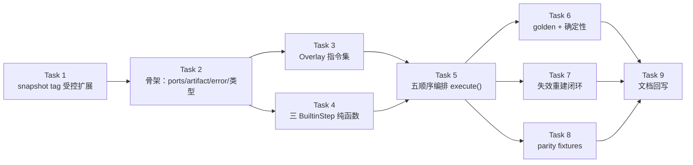
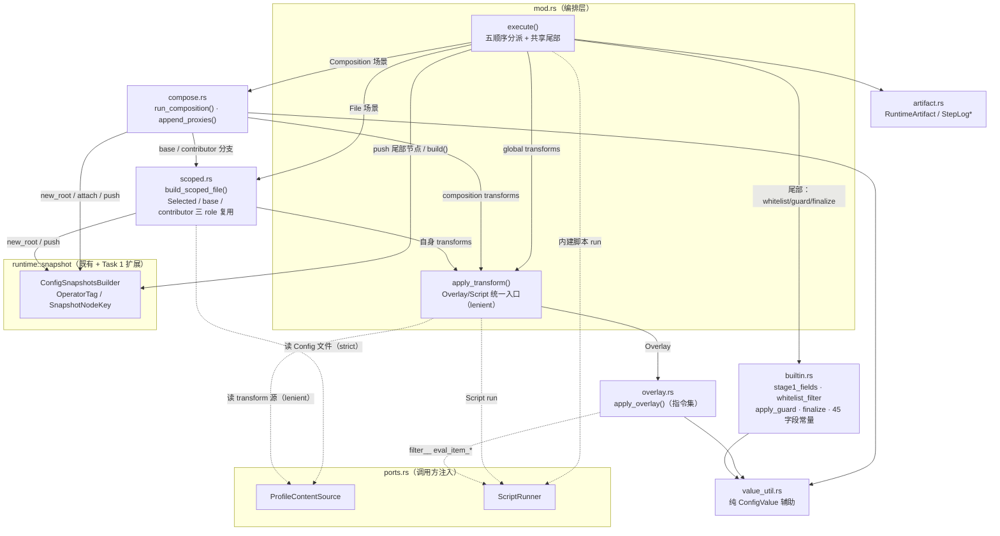
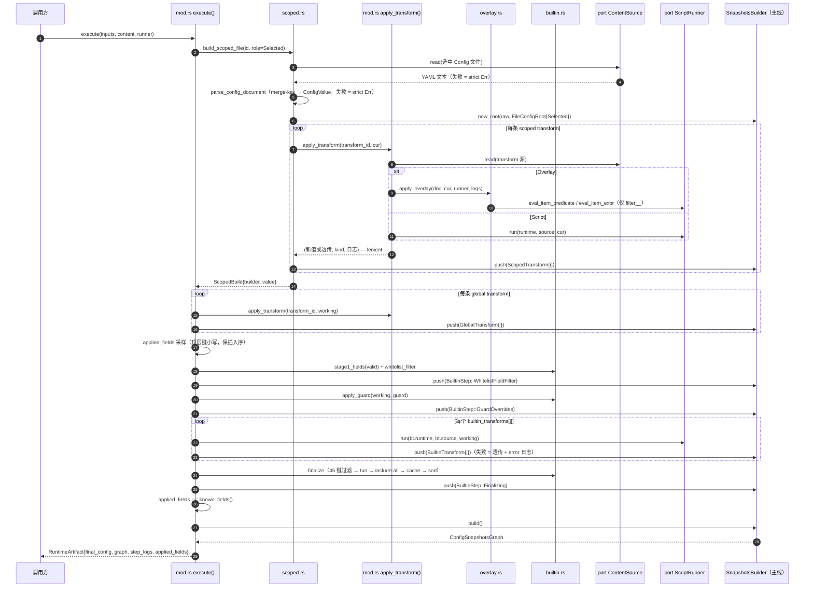
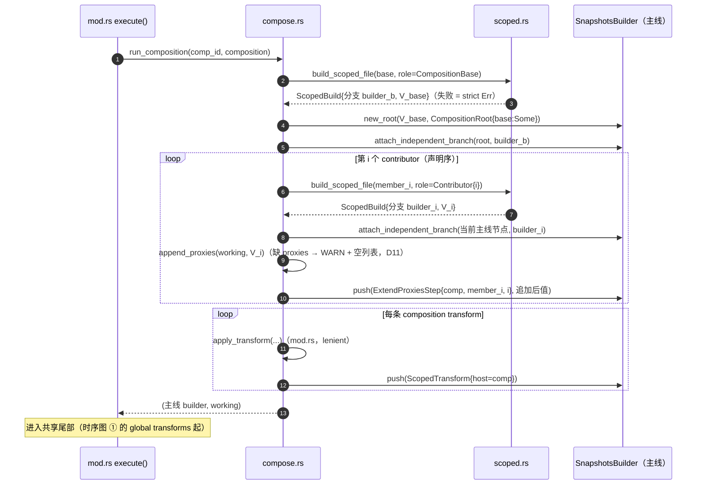
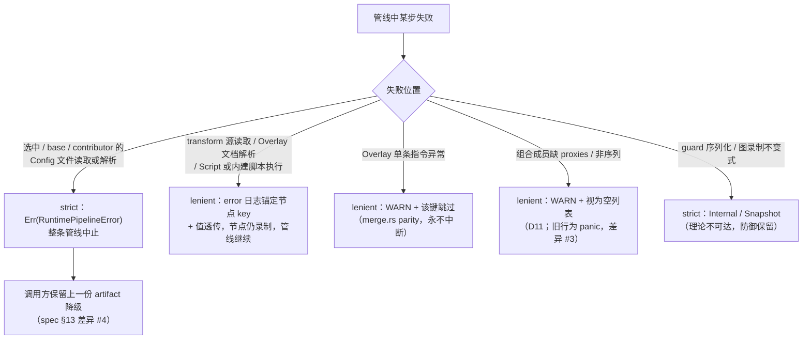

# Runtime Pipeline Executor Implementation Plan（PR-3-pre②）

> **For agentic workers:** REQUIRED SUB-SKILL: Use superpowers:subagent-driven-development (recommended) or superpowers:executing-plans to implement this plan task-by-task. Steps use checkbox (`- [ ]`) syntax for tracking.

**Goal:** 在 `nyanpasu-config` 内落地纯 runtime pipeline executor：给定已验证 `Profiles` 快照 + 注入 ports，执行 clean-design §7.1–7.5 五种处理顺序与最终阶段，产出 `RuntimeArtifact{final_config, graph, step_logs, applied_fields}`；`backend/tauri/**` 提交面零改动。

**Architecture:** 权威设计 = `docs/superpowers/specs/2026-07-04-runtime-pipeline-executor-design.md`（下称 **spec**，语义决策一律以其为准，本计划只做落地拆分）。先做 snapshot tag 受控扩展（spec §8.2），再自底向上：ports/类型骨架 → Overlay 指令集 → 三 BuiltinStep 纯函数 → 五顺序编排与录制 → golden/失效/parity 测试 → roadmap 勘误回写。行为基线 = 旧 `backend/tauri/src/enhance/`（spec §4.3 十七步实测），故意差异封闭于 spec §13 台账（15 条）。并行执行协调文件：`.claude/plan/runtime-pipeline-executor-parallel.md`（波次调度、worktree/合并协议、任务卡）。

**Tech Stack:** Rust、serde / serde_json / serde_yaml_ng（含 `Value::apply_merge`，已核实 fork 保留）、indexmap、thiserror、specta、既有 `runtime::{snapshot, value}`。**不新增任何依赖**。

## Global Constraints

- 只改 `backend/nyanpasu-config/src/runtime/**` 与两份文档（Task 9）。`backend/tauri/**`、其它 crate、`Cargo.toml` **零提交改动**。
- executor 纯度红线（spec §10.2）：`executor/` 内禁止 `tokio`、`std::fs`/`std::net`、`std::time`、随机数、`cfg(target_os = ...)`、用 `HashSet`/`HashMap` **迭代序**决定输出；容器一律 `IndexMap`/`IndexSet`/`Vec`。禁止 `unwrap`/`panic!` 于非测试代码（静态字面量构造用手写无 panic 形式）。
- 不新增全局单例 / 可变 static（CLAUDE.md §7）。
- parity 默认；输出差异必须能对到 spec §13 台账条目，否则视为 bug。
- 每个 task 结束：`cargo test -p nyanpasu-config` 必须绿；Task 1 与 Task 8 额外跑 `cargo test -p nyanpasu-config --features snapshot-persistence`。
- 每个 task 至少一次提交（信息见各 task Step）。
- 并行执行规则：任务依赖固定为 DAG `T1 → T2 → (T3 ‖ T4) → T5 → (T6 ‖ T7 ‖ T8) → T9`；仅同一波（wave）内的任务可并行；每个任务只允许改动其独占文件集（见 Module Diagrams「Parallel Execution Waves」）；所有 cargo 命令必须在 `backend/` 目录下执行（cargo 工作区根 = `backend/Cargo.toml`，或加 `--manifest-path backend/Cargo.toml`）。

**与 spec 的三处实施细化**（写代码时以本计划为准，Task 9 一并回写 spec 勘误行）：

1. `OperatorTag::BuiltinTransform.name` 与 `BuiltinTransform{name, source}` 用 `String`（spec §8.2/§6.1 写的 `Arc<str>`）——`OperatorTag`/`SnapshotNodeKey` 派生 `specta::Type`，`String` 免去 `Arc<str>` 的 specta 兼容风险。
2. `RuntimePipelineError` 增加 `Internal(String)` 变体（spec §9.2 未列）——承接「理论不可达」的 guard 序列化失败，维持零 panic。
3. 新增两个 spec §5 未列的文件：`executor/value_util.rs`（路径遍历/对象重建纯辅助）与 `executor/tests/support.rs`（`MapContentSource`/`FakeScriptRunner`/Profiles 构造器）。

---

## File Structure

修改（既有）：

- `backend/nyanpasu-config/src/runtime/mod.rs` — 加 `pub mod executor;`
- `backend/nyanpasu-config/src/runtime/snapshot.rs` — tag 扩展 + 测试适配（Task 1）
- `backend/nyanpasu-config/src/runtime/invalidation.rs` — `tag_references_any_profile` 两臂改 + 两臂增 + 1 新测试（Task 1）

新建（`backend/nyanpasu-config/src/runtime/executor/`）：

- `mod.rs` — 输入类型、`ExecutionTarget`、`execute()`、`apply_transform`、`parse_config_document`、`LogSink`
- `ports.rs` — `PortError`、`ProfileContentSource`、`ScriptRunner`、`ScriptRunOutcome`
- `artifact.rs` — `RuntimeArtifact`、`StepLog`、`StepLogEntry`、`StepLogLevel`
- `error.rs` — `RuntimePipelineError`
- `value_util.rs` — `empty_object`/`clean_seed`/`obj_get`/`obj_insert`/`get_at`/`replace_at`/`remove_at`/`deep_merge_value`/`parse_dotted_path`
- `overlay.rs` — Overlay 指令集（旧 `use_merge` 对位）
- `scoped.rs` — scoped FileConfig 分支（三 role 复用）
- `compose.rs` — composition seed + 11 条追加规则
- `builtin.rs` — 45 字段常量 + Whitelist/Guard/Finalizing（tun/include-all/cache/sort）
- `tests/{mod,support}.rs` 与全部空测试 stub `tests/{overlay,builtin,compose,orders,golden,invalidation,parity}.rs` —— **全部由 Task 2 一次性创建**；`tests/mod.rs` 自 Task 2 起全量声明所有测试模块，此后**冻结**（Task 3–8 只填充各自 stub，不再改 `tests/mod.rs`）
- `tests/fixtures/{sub_a.yaml,sub_b.yaml}` —— Task 2 创建（共享 fixture，Task 6/8 只读消费）；其余 `tests/fixtures/*.yaml` 由 Task 6/8 给出全文

文档（Task 9）：`docs/design/actor-migration-roadmap.md`、`docs/superpowers/specs/2026-07-04-runtime-pipeline-executor-design.md`。

**关键 import 路径**（已核实）：`crate::profile::*`（mod.rs 全量重导出）；guard/tun 类型**无**顶层重导出，必须 `crate::clash::config::overrides::ClashGuardOverrides`、`crate::clash::config::tun_stack::TunStack`。

---

## Module Diagrams（实施参照）

语义权威仍是 spec（参与者级图见 spec §7.5 / §12.1–12.5）；本节把这些图细化到 **executor 模块级**（函数签名与各 Task 的 Interfaces 一致），并补 Task 依赖与失败策略两张流程图。实施中若与 spec 冲突，以 spec 为准并回报。

### Task 依赖图



T3 ⟂ T4 可并行；T6 / T7 / T8 互不依赖（各自只新增测试文件），可并行，但均须在 T5 之后。

### Parallel Execution Waves

调度单一参照：波次表 + 独占文件矩阵 + 各波 gate。同波任务文件两两无交集（已逐对核对）。所有路径省略前缀 `backend/nyanpasu-config/src/runtime/`；所有 gate 在 `backend/` 目录下执行。

| Wave | 任务         | 独占文件（提交面）                                                                                                                                                                                                                                                                                              | 波 gate（在 `backend/` 下）                                                   |
| ---- | ------------ | --------------------------------------------------------------------------------------------------------------------------------------------------------------------------------------------------------------------------------------------------------------------------------------------------------------- | ----------------------------------------------------------------------------- |
| W1   | T1           | `snapshot.rs`、`invalidation.rs`                                                                                                                                                                                                                                                                                | `cargo test -p nyanpasu-config` + `--features snapshot-persistence`           |
| W2   | T2           | `mod.rs`（runtime）；`executor/{mod,ports,artifact,error,value_util}.rs`；占位 `executor/{overlay,scoped,compose,builtin}.rs`；`executor/tests/{mod,support}.rs`；全部测试空 stub `executor/tests/{overlay,builtin,compose,orders,golden,invalidation,parity}.rs`；`executor/tests/fixtures/{sub_a,sub_b}.yaml` | `cargo test -p nyanpasu-config`                                               |
| W3   | T3 ‖ T4      | T3: `executor/overlay.rs`、`executor/tests/overlay.rs`；T4: `executor/builtin.rs`、`executor/tests/builtin.rs`                                                                                                                                                                                                  | 每任务 gate → 合并后波 gate `cargo test -p nyanpasu-config`                   |
| W4   | T5           | `executor/{scoped,compose}.rs`、`executor/mod.rs`（追加 `execute`）、`executor/tests/{compose,orders}.rs`                                                                                                                                                                                                       | `cargo test -p nyanpasu-config`                                               |
| W5   | T6 ‖ T7 ‖ T8 | T6: `executor/tests/golden.rs`、`executor/tests/fixtures/{build_groups,global_fix}.yaml`；T7: `executor/tests/invalidation.rs`；T8: `executor/tests/parity.rs`、`executor/tests/fixtures/parity_{single,merged,bare}_expected.yaml`                                                                             | 每任务 gate（T8 额外 `--features snapshot-persistence`）→ 合并后双命令波 gate |
| W6   | T9           | `docs/design/actor-migration-roadmap.md`、spec 状态行                                                                                                                                                                                                                                                           | 双 cargo 命令 + 纯度 grep（spec §16 #7）+ `git status backend/tauri` 干净     |

补充规则：

- `tests/mod.rs` 仅 T2 拥有，T2 之后冻结；`executor/mod.rs` 仅 T5 允许追加 `execute`；`backend/tauri/**` 属提交面禁区（T8 临时 harness 必须在跑 gate 与提交前 revert）。
- 波内单任务 gate 失败 → 原地重试/修复，不阻塞兄弟任务合并；连续 2 次失败 → 停下上报，不得扩大文件所有权。
- 合并冲突 = 协调 bug：先对照本矩阵定位越权编辑，禁止顺手改非本任务文件。

### executor 模块依赖图

实线 = 模块内调用；虚线 = 经 port 出纯度边界。`error.rs`（`RuntimePipelineError`）与 `artifact.rs` 的日志类型为纯类型层，被多数模块引用，图中仅保留输出边。



### 模块级时序图 ①：Selected FileConfig 全程（细化 spec §12.2）



Bare 变体（⑤）：跳过 build_scoped_file，`new_root({}, BareRoot)` 后直接从「每条 global transform」起复用同一尾部，`selected_profile_id = None`。

### 模块级时序图 ②：Composition with base（compose / scoped 协作，细化 spec §12.3）



Clean-seed 变体（④）：`base = None` 时 `new_root(clean_seed = {proxies: []}, CompositionRoot{base:None})`，无 base 分支，其余同上。

### 失败策略流程图（spec D7 / §10.1 分层）



---

## Task 1: snapshot tag 受控扩展

**Files:**

- Modify: `backend/nyanpasu-config/src/runtime/snapshot.rs`（`OperatorTag`/`SnapshotNodeKey`/`node_key()` + tests）
- Modify: `backend/nyanpasu-config/src/runtime/invalidation.rs`（`tag_references_any_profile` + 1 新测试）

**Interfaces:**

- Produces（后续 task 依赖的确切形状）:
  - `OperatorTag::GlobalTransform { selected_profile_id: Option<ProfileId>, transform_profile_id: ProfileId, transform_kind: TransformKind, step_index: u32 }`
  - `OperatorTag::BuiltinStep { selected_profile_id: Option<ProfileId>, step: BuiltinStepKind }`
  - `OperatorTag::BareRoot`（单元变体）
  - `OperatorTag::BuiltinTransform { selected_profile_id: Option<ProfileId>, name: String, step_index: u32 }`
  - `SnapshotNodeKey::{GlobalTransform{selected_profile_id: Option<ProfileId>, step_index}, Builtin{selected_profile_id: Option<ProfileId>, step}, BareRoot, BuiltinTransform{selected_profile_id: Option<ProfileId>, step_index}}`

- [ ] **Step 1: 写失败测试（snapshot.rs 的 `mod tests` 末尾追加）**

```rust
    #[test]
    fn operator_tag_bare_root_and_builtin_transform_round_trip() {
        round_trip_tag(OperatorTag::BareRoot);
        round_trip_tag(OperatorTag::BuiltinTransform {
            selected_profile_id: Some(pid("selected")),
            name: "verge_hy_alpn".to_string(),
            step_index: 0,
        });
        round_trip_tag(OperatorTag::BuiltinTransform {
            selected_profile_id: None,
            name: "config_fixer".to_string(),
            step_index: 1,
        });

        // node_key 丢弃展示性 name 字段。
        let a = OperatorTag::BuiltinTransform {
            selected_profile_id: None,
            name: "a".to_string(),
            step_index: 2,
        };
        let b = OperatorTag::BuiltinTransform {
            selected_profile_id: None,
            name: "b".to_string(),
            step_index: 2,
        };
        assert_eq!(a.node_key(), b.node_key());
        assert_eq!(OperatorTag::BareRoot.node_key(), SnapshotNodeKey::BareRoot);
    }

    #[test]
    fn operator_tag_optional_selected_is_forward_compatible_with_v2_wire() {
        // 旧 v2 wire 中 selected_profile_id 是裸字符串；Option 化后必须解码为 Some。
        let tag: OperatorTag = serde_json::from_value(json!({
            "kind": "builtin_step",
            "data": { "selected_profile_id": "sel", "step": "finalizing" }
        }))
        .unwrap();
        assert_eq!(
            tag,
            OperatorTag::BuiltinStep {
                selected_profile_id: Some(pid("sel")),
                step: BuiltinStepKind::Finalizing,
            }
        );

        let tag: OperatorTag = serde_json::from_value(json!({
            "kind": "global_transform",
            "data": {
                "selected_profile_id": "sel",
                "transform_profile_id": "t",
                "transform_kind": { "type": "overlay" },
                "step_index": 0
            }
        }))
        .unwrap();
        assert!(matches!(
            tag,
            OperatorTag::GlobalTransform { selected_profile_id: Some(_), .. }
        ));
    }
```

- [ ] **Step 2: 跑测试确认编译失败**

Run: `cargo test -p nyanpasu-config operator_tag_bare_root`
Expected: FAIL —— `no variant or associated item named 'BareRoot'`

- [ ] **Step 3: 实现类型变更**

`snapshot.rs` 中 `OperatorTag`（现 79-113 行）改为：

```rust
pub enum OperatorTag {
    FileConfigRoot {
        profile_id: ProfileId,
        role: ConfigExecutionRole,
    },
    /// `base: None` is the clean seed (`proxies: []`).
    CompositionRoot {
        profile_id: ProfileId,
        base: Option<ProfileId>,
    },
    ExtendProxiesStep {
        composition_id: ProfileId,
        contributor_profile_id: ProfileId,
        contributor_index: u32,
    },
    ScopedTransform {
        host_profile_id: ProfileId,
        role: ConfigExecutionRole,
        transform_profile_id: ProfileId,
        transform_kind: TransformKind,
        step_index: u32,
    },
    /// `selected_profile_id: None` = bare 模式（current 为空，spec §2 目标 6）。
    GlobalTransform {
        selected_profile_id: Option<ProfileId>,
        transform_profile_id: ProfileId,
        transform_kind: TransformKind,
        step_index: u32,
    },
    BuiltinStep {
        selected_profile_id: Option<ProfileId>,
        step: BuiltinStepKind,
    },
    /// current = None 的裸配置管线根（spec §8.2）。
    BareRoot,
    /// 内建增强脚本步骤；`name` 为展示性字段，`node_key()` 丢弃。
    BuiltinTransform {
        selected_profile_id: Option<ProfileId>,
        name: String,
        step_index: u32,
    },
}
```

`node_key()` 追加两臂（既有 `GlobalTransform`/`BuiltinStep` 臂的 `selected_profile_id.clone()` 对 `Option` 原样可用，不动）：

```rust
            Self::BareRoot => SnapshotNodeKey::BareRoot,
            Self::BuiltinTransform {
                selected_profile_id,
                step_index,
                ..
            } => SnapshotNodeKey::BuiltinTransform {
                selected_profile_id: selected_profile_id.clone(),
                step_index: *step_index,
            },
```

`SnapshotNodeKey`（现 168-193 行）同步：`GlobalTransform.selected_profile_id` 与 `Builtin.selected_profile_id` 改 `Option<ProfileId>`，末尾追加：

```rust
    BareRoot,
    BuiltinTransform {
        selected_profile_id: Option<ProfileId>,
        step_index: u32,
    },
```

- [ ] **Step 4: 适配 snapshot.rs 既有测试构造器**

测试模块内 `global_transform`/`builtin_step` 两个 helper 包 `Some`：

```rust
    fn global_transform(
        selected_profile_id: &str,
        transform_profile_id: &str,
        transform_kind: TransformKind,
        step_index: u32,
    ) -> OperatorTag {
        OperatorTag::GlobalTransform {
            selected_profile_id: Some(pid(selected_profile_id)),
            transform_profile_id: pid(transform_profile_id),
            transform_kind,
            step_index,
        }
    }

    fn builtin_step(selected_profile_id: &str, step: BuiltinStepKind) -> OperatorTag {
        OperatorTag::BuiltinStep {
            selected_profile_id: Some(pid(selected_profile_id)),
            step,
        }
    }
```

同一测试模块内 `operator_tag_global_transform_round_trips_and_key_drops_transform_identity` 等使用处不需要改（走 helper）。

- [ ] **Step 5: 演示测试改为规范序（spec §8.3 / D4）**

`selected_file_config_processing_order_is_scoped_global_builtin` 整体替换为（Whitelist→Guard→BuiltinTransform→Finalizing）：

```rust
    #[test]
    fn selected_file_config_processing_order_is_scoped_global_builtin() {
        let mut builder = ConfigSnapshotsBuilder::new_root(
            value(json!({ "step": "file" })),
            selected_file_root("selected"),
        );
        builder
            .push(
                scoped_transform(
                    "selected",
                    ConfigExecutionRole::Selected,
                    "scoped",
                    TransformKind::Overlay,
                    0,
                ),
                value(json!({ "step": "scoped" })),
            )
            .unwrap();
        builder
            .push(
                global_transform("selected", "global", TransformKind::Overlay, 0),
                value(json!({ "step": "global" })),
            )
            .unwrap();
        builder
            .push(
                builtin_step("selected", BuiltinStepKind::WhitelistFieldFilter),
                value(json!({ "step": "whitelist" })),
            )
            .unwrap();
        builder
            .push(
                builtin_step("selected", BuiltinStepKind::GuardOverrides),
                value(json!({ "step": "guard" })),
            )
            .unwrap();
        builder
            .push(
                OperatorTag::BuiltinTransform {
                    selected_profile_id: Some(pid("selected")),
                    name: "config_fixer".to_string(),
                    step_index: 0,
                },
                value(json!({ "step": "builtin_transform" })),
            )
            .unwrap();
        builder
            .push(
                builtin_step("selected", BuiltinStepKind::Finalizing),
                value(json!({ "step": "final" })),
            )
            .unwrap();

        let graph = builder.build().unwrap();
        assert!(matches!(
            &graph.nodes[0].tag,
            OperatorTag::FileConfigRoot {
                role: ConfigExecutionRole::Selected,
                ..
            }
        ));
        assert!(matches!(&graph.nodes[1].tag, OperatorTag::ScopedTransform { .. }));
        assert!(matches!(&graph.nodes[2].tag, OperatorTag::GlobalTransform { .. }));
        assert!(matches!(
            &graph.nodes[3].tag,
            OperatorTag::BuiltinStep {
                step: BuiltinStepKind::WhitelistFieldFilter,
                ..
            }
        ));
        assert!(matches!(
            &graph.nodes[4].tag,
            OperatorTag::BuiltinStep {
                step: BuiltinStepKind::GuardOverrides,
                ..
            }
        ));
        assert!(matches!(&graph.nodes[5].tag, OperatorTag::BuiltinTransform { .. }));
        assert!(matches!(
            &graph.nodes[6].tag,
            OperatorTag::BuiltinStep {
                step: BuiltinStepKind::Finalizing,
                ..
            }
        ));
    }
```

- [ ] **Step 6: invalidation.rs 适配 + 新测试**

`tag_references_any_profile`（现 125-158 行）中两臂替换、两臂新增：

```rust
        OperatorTag::GlobalTransform {
            selected_profile_id,
            transform_profile_id,
            ..
        } => {
            selected_profile_id
                .as_ref()
                .is_some_and(|id| profiles.contains(id))
                || profiles.contains(transform_profile_id)
        }
        OperatorTag::BuiltinStep {
            selected_profile_id, ..
        } => selected_profile_id
            .as_ref()
            .is_some_and(|id| profiles.contains(id)),
        OperatorTag::BareRoot => false,
        OperatorTag::BuiltinTransform {
            selected_profile_id, ..
        } => selected_profile_id
            .as_ref()
            .is_some_and(|id| profiles.contains(id)),
```

`invalidation.rs` 测试模块追加：

```rust
    #[test]
    fn invalidate_marks_builtin_transform_nodes_of_selected() {
        let current = pid("current");
        let mut builder = ConfigSnapshotsBuilder::new_root(
            Arc::new(ConfigValue::try_from(json!({ "a": 1 })).unwrap()),
            selected_file_root("current"),
        );
        builder
            .push(
                OperatorTag::BuiltinTransform {
                    selected_profile_id: Some(current.clone()),
                    name: "config_fixer".to_string(),
                    step_index: 0,
                },
                Arc::new(ConfigValue::try_from(json!({ "a": 2 })).unwrap()),
            )
            .unwrap();
        let graph = builder.build_stored().unwrap();

        let invalidation = invalidate_profile(
            &current,
            ProfileCategory::Config,
            Some(&current),
            &ProfileDependencyIndex::default(),
            Some(&graph),
        );

        assert!(invalidation.stale_node_keys.contains(
            &SnapshotNodeKey::BuiltinTransform {
                selected_profile_id: Some(current.clone()),
                step_index: 0,
            }
        ));
    }
```

- [ ] **Step 7: 全量回归**

Run: `cargo test -p nyanpasu-config && cargo test -p nyanpasu-config --features snapshot-persistence`
Expected: PASS（含既有 archive v2 往返、v1 拒绝、六类失效场景）

- [ ] **Step 8: Commit**

```bash
git add backend/nyanpasu-config/src/runtime/snapshot.rs backend/nyanpasu-config/src/runtime/invalidation.rs
git commit -m "refactor(nyanpasu-config): extend snapshot operator tags for executor recording"
```

---

## Task 2: executor 骨架（ports / artifact / error / 输入类型 / 测试支撑）

**Files:**

- Modify: `backend/nyanpasu-config/src/runtime/mod.rs`
- Create: `backend/nyanpasu-config/src/runtime/executor/{mod,ports,artifact,error,value_util}.rs`
- Create: `backend/nyanpasu-config/src/runtime/executor/{overlay,scoped,compose,builtin}.rs`（最小占位，仅注释；Task 3–5 重写）
- Create: `backend/nyanpasu-config/src/runtime/executor/tests/{mod,support}.rs`
- Create: `backend/nyanpasu-config/src/runtime/executor/tests/{overlay,builtin,compose,orders,golden,invalidation,parity}.rs`（空 stub；Task 3–8 填充）
- Create: `backend/nyanpasu-config/src/runtime/executor/tests/fixtures/{sub_a.yaml,sub_b.yaml}`（共享 fixture；Task 6/8 只读消费）

**Interfaces:**

- Consumes: Task 1 的 tag 形状；`crate::profile::*`；`crate::clash::config::overrides::ClashGuardOverrides`；`crate::clash::config::tun_stack::TunStack`
- Produces（后续全部 task 依赖）:
  - `execute` **尚不存在**（Task 5 落地）；本 task 只产类型与 ports
  - `ProfileContentSource::read(&self, &ManagedProfilePath) -> Result<String, PortError>`
  - `ScriptRunner::{run(&self, ScriptRuntime, &str, &ConfigValue) -> ScriptRunOutcome, eval_item_predicate(&self, &str, &ConfigValue) -> Result<bool, PortError>, eval_item_expr(&self, &str, &ConfigValue) -> Result<ConfigValue, PortError>}`
  - `RuntimeArtifact { final_config: Arc<ConfigValue>, graph: ConfigSnapshotsGraph, step_logs: Vec<StepLog>, applied_fields: IndexSet<String> }`
  - `RuntimePipelineInputs<'a> { profiles, target, guard, whitelist_enabled, tun, builtin_transforms }`、`ExecutionTarget::{Selected(ProfileId), Bare}`、`GuardInputs{overrides, ports}`、`ResolvedPortBindings{mixed_port, port, socks_port, external_controller}`、`TunParams{enable, flavor, windows_fake_ip_filter}`、`TunFlavor::{ClashRs, Standard{stack}}`、`BuiltinTransform{name: String, runtime, source: String}`
  - value_util: `empty_object()`、`clean_seed()`、`obj_get(&ConfigValue, &str) -> Option<&ConfigValue>`、`obj_insert(&ConfigValue, &str, ConfigValue) -> ConfigValue`、`parse_dotted_path(&str) -> Vec<String>`、`get_at(&ConfigValue, &[String]) -> Option<&ConfigValue>`、`replace_at(&ConfigValue, &[String], ConfigValue) -> Option<ConfigValue>`、`remove_at(&ConfigValue, &[String]) -> Option<ConfigValue>`、`deep_merge_value(Option<&ConfigValue>, &ConfigValue) -> ConfigValue`
  - 测试支撑：`support::{MapContentSource, FakeScriptRunner, RunReply, PredicateReply, ExprReply, managed_file_source, config_file_item, overlay_item, script_item, composition_item, profiles_with}`

- [ ] **Step 1: runtime/mod.rs 挂模块**

```rust
pub mod executor;
pub mod invalidation;
pub mod snapshot;
pub mod value;
```

- [ ] **Step 2: `executor/ports.rs`（完整文件）**

```rust
//! Caller-implemented ports. The executor performs no IO of its own.

use crate::{
    profile::{ManagedProfilePath, ScriptRuntime},
    runtime::value::ConfigValue,
};

use super::artifact::StepLogEntry;

pub type PortError = Box<dyn std::error::Error + Send + Sync + 'static>;

/// Reads the text content of a materialized profile file.
///
/// Adapters may pre-load every needed path into a map so the whole pipeline
/// runs without blocking (spec §6.3).
pub trait ProfileContentSource {
    fn read(&self, path: &ManagedProfilePath) -> Result<String, PortError>;
}

/// Mirrors the legacy `ProcessOutput = (Result<Mapping>, Logs)`: logs are
/// returned even when the script fails (enhance/utils.rs:114-119 parity).
pub struct ScriptRunOutcome {
    pub result: Result<ConfigValue, PortError>,
    pub logs: Vec<StepLogEntry>,
}

/// Script execution port.
///
/// Adapter obligations (spec §6.2):
/// 1. `run` MUST return an order-stable config — mihomo's dns policy depends
///    on mapping order (legacy lua runner's `correct_original_mapping_order`).
/// 2. Temp files, module loaders and thread hops are adapter-internal.
/// 3. `eval_item_*` carry legacy `use_merge` Lua-only semantics.
/// 4. Identical inputs must produce identical replies (determinism contract).
pub trait ScriptRunner {
    fn run(&self, runtime: ScriptRuntime, source: &str, config: &ConfigValue) -> ScriptRunOutcome;

    /// Overlay `filter__` string filter / `when` predicate.
    fn eval_item_predicate(&self, expr: &str, item: &ConfigValue) -> Result<bool, PortError>;

    /// Overlay `filter__` `when + expr` replacement value.
    fn eval_item_expr(&self, expr: &str, item: &ConfigValue) -> Result<ConfigValue, PortError>;
}
```

- [ ] **Step 3: `executor/artifact.rs`（完整文件）**

```rust
//! Executor output model (spec §9).

use std::sync::Arc;

use indexmap::IndexSet;
use serde::{Deserialize, Serialize};

use crate::runtime::{
    snapshot::{ConfigSnapshotsGraph, SnapshotNodeKey},
    value::ConfigValue,
};

/// 1:1 with the legacy `LogSpan` wire shape (enhance/utils.rs:18-25).
#[derive(Debug, Clone, Copy, PartialEq, Eq, Serialize, Deserialize, specta::Type)]
#[serde(rename_all = "lowercase")]
pub enum StepLogLevel {
    Log,
    Info,
    Warn,
    Error,
}

#[derive(Debug, Clone, PartialEq, Serialize, Deserialize, specta::Type)]
pub struct StepLogEntry {
    pub level: StepLogLevel,
    pub message: String,
}

impl StepLogEntry {
    pub fn new(level: StepLogLevel, message: impl Into<String>) -> Self {
        Self {
            level,
            message: message.into(),
        }
    }

    pub fn warn(message: impl Into<String>) -> Self {
        Self::new(StepLogLevel::Warn, message)
    }

    pub fn error(message: impl Into<String>) -> Self {
        Self::new(StepLogLevel::Error, message)
    }
}

/// Logs anchored to a semantic node position; no StepId (spec D8).
#[derive(Debug, Clone, PartialEq, Serialize, Deserialize, specta::Type)]
pub struct StepLog {
    pub key: SnapshotNodeKey,
    pub entries: Vec<StepLogEntry>,
}

/// Covers every consumer of the legacy `IRuntime` triple (spec §9.3).
/// Not `specta::Type` as a whole: `final_config` is projected via `to_json()`
/// by the tauri DTO layer (spec D14).
#[derive(Debug, Clone, PartialEq)]
pub struct RuntimeArtifact {
    pub final_config: Arc<ConfigValue>,
    pub graph: ConfigSnapshotsGraph,
    pub step_logs: Vec<StepLog>,
    pub applied_fields: IndexSet<String>,
}
```

- [ ] **Step 4: `executor/error.rs`（完整文件）**

```rust
//! Structural failures only; transform-level failures go to step logs (spec D7).

use thiserror::Error;

use crate::{
    profile::{ManagedProfilePath, ProfileId},
    runtime::snapshot::SnapshotBuildError,
};

use super::ports::PortError;

#[derive(Debug, Error)]
pub enum RuntimePipelineError {
    #[error("selected profile {0} not found")]
    SelectedProfileNotFound(ProfileId),

    #[error("selected profile {0} is not a Config")]
    SelectedProfileNotConfig(ProfileId),

    #[error("composition {composition} member {member} invalid: {reason}")]
    CompositionMemberInvalid {
        composition: ProfileId,
        member: ProfileId,
        reason: String,
    },

    #[error("read profile {profile} content at {path}: {source}")]
    ContentSource {
        profile: ProfileId,
        path: ManagedProfilePath,
        #[source]
        source: PortError,
    },

    #[error("parse profile {profile} as config: {message}")]
    ParseProfile { profile: ProfileId, message: String },

    #[error(transparent)]
    Snapshot(#[from] SnapshotBuildError),

    /// Theoretically unreachable invariant breaks (e.g. guard serialization).
    #[error("internal executor invariant: {0}")]
    Internal(String),
}
```

- [ ] **Step 5: `executor/value_util.rs`（完整文件）**

```rust
//! Pure ConfigValue helpers. Path semantics mirror legacy `find_field`
//! (enhance/merge.rs:27-48): mapping segment = string key, sequence segment =
//! parsed index; anything else fails the lookup.

use std::sync::Arc;

use indexmap::IndexMap;

use crate::runtime::value::{ConfigObject, ConfigValue};

pub(super) fn empty_object() -> ConfigValue {
    ConfigValue::Object(Arc::new(IndexMap::new()))
}

/// Clean seed for base-less compositions: `{ proxies: [] }` (clean-design §7.4).
pub(super) fn clean_seed() -> ConfigValue {
    let mut map: ConfigObject = IndexMap::new();
    map.insert(
        Arc::from("proxies"),
        ConfigValue::Array(Arc::from(Vec::<ConfigValue>::new())),
    );
    ConfigValue::Object(Arc::new(map))
}

pub(super) fn obj_get<'a>(value: &'a ConfigValue, key: &str) -> Option<&'a ConfigValue> {
    value.as_object_arc().and_then(|map| map.get(key))
}

/// Top-level insert/overwrite. A non-object root is replaced by a fresh
/// object, matching legacy Mapping semantics (the working config is a map).
pub(super) fn obj_insert(value: &ConfigValue, key: &str, entry: ConfigValue) -> ConfigValue {
    let mut map: ConfigObject = value
        .as_object_arc()
        .map(|map| (**map).clone())
        .unwrap_or_default();
    map.insert(Arc::from(key), entry);
    ConfigValue::Object(Arc::new(map))
}

pub(super) fn parse_dotted_path(path: &str) -> Vec<String> {
    path.split('.').map(str::to_string).collect()
}

pub(super) fn get_at<'a>(root: &'a ConfigValue, segments: &[String]) -> Option<&'a ConfigValue> {
    let mut current = root;
    for segment in segments {
        current = match current {
            ConfigValue::Object(map) => map.get(segment.as_str())?,
            ConfigValue::Array(items) => items.get(segment.parse::<usize>().ok()?)?,
            _ => return None,
        };
    }
    Some(current)
}

/// Copy-on-write replace; `None` when the path does not fully exist.
pub(super) fn replace_at(
    root: &ConfigValue,
    segments: &[String],
    new_value: ConfigValue,
) -> Option<ConfigValue> {
    let Some((head, rest)) = segments.split_first() else {
        return Some(new_value);
    };
    match root {
        ConfigValue::Object(map) => {
            let current = map.get(head.as_str())?;
            let replaced = replace_at(current, rest, new_value)?;
            let mut next = (**map).clone();
            next.insert(Arc::from(head.as_str()), replaced);
            Some(ConfigValue::Object(Arc::new(next)))
        }
        ConfigValue::Array(items) => {
            let index = head.parse::<usize>().ok()?;
            let current = items.get(index)?;
            let replaced = replace_at(current, rest, new_value)?;
            let mut next: Vec<ConfigValue> = items.to_vec();
            next[index] = replaced;
            Some(ConfigValue::Array(Arc::from(next)))
        }
        _ => None,
    }
}

/// Removes the value at the path (map key or sequence index); `None` when the
/// path does not fully exist.
pub(super) fn remove_at(root: &ConfigValue, segments: &[String]) -> Option<ConfigValue> {
    let (head, rest) = segments.split_first()?;
    match root {
        ConfigValue::Object(map) => {
            if rest.is_empty() {
                if !map.contains_key(head.as_str()) {
                    return None;
                }
                let mut next = (**map).clone();
                next.shift_remove(head.as_str());
                return Some(ConfigValue::Object(Arc::new(next)));
            }
            let current = map.get(head.as_str())?;
            let removed = remove_at(current, rest)?;
            let mut next = (**map).clone();
            next.insert(Arc::from(head.as_str()), removed);
            Some(ConfigValue::Object(Arc::new(next)))
        }
        ConfigValue::Array(items) => {
            let index = head.parse::<usize>().ok()?;
            if rest.is_empty() {
                if index >= items.len() {
                    return None;
                }
                let mut next: Vec<ConfigValue> = items.to_vec();
                next.remove(index);
                return Some(ConfigValue::Array(Arc::from(next)));
            }
            let current = items.get(index)?;
            let removed = remove_at(current, rest)?;
            let mut next: Vec<ConfigValue> = items.to_vec();
            next[index] = removed;
            Some(ConfigValue::Array(Arc::from(next)))
        }
        _ => None,
    }
}

/// Legacy `override_recursive` value rule (enhance/merge.rs:8-24): object
/// into object = per-key deep merge preserving unmentioned siblings; anything
/// else = wholesale replace (sequences included).
pub(super) fn deep_merge_value(existing: Option<&ConfigValue>, data: &ConfigValue) -> ConfigValue {
    match (
        existing.and_then(ConfigValue::as_object_arc),
        data.as_object_arc(),
    ) {
        (Some(current), Some(incoming)) => {
            let mut merged = (**current).clone();
            for (key, value) in incoming.iter() {
                let previous = merged.get(key.as_ref()).cloned();
                merged.insert(key.clone(), deep_merge_value(previous.as_ref(), value));
            }
            ConfigValue::Object(Arc::new(merged))
        }
        _ => data.clone(),
    }
}
```

- [ ] **Step 6: `executor/mod.rs`（本 task 版本：类型 + 解析 + LogSink；`execute` 留 Task 5）**

```rust
//! Pure runtime pipeline executor: the "execution half" of the runtime
//! snapshot store (spec: docs/superpowers/specs/2026-07-04-runtime-pipeline-executor-design.md).

mod artifact;
mod builtin;
mod compose;
mod error;
mod overlay;
mod ports;
mod scoped;
mod value_util;

#[cfg(test)]
mod tests;

use std::sync::Arc;

use indexmap::IndexMap;

pub use artifact::{RuntimeArtifact, StepLog, StepLogEntry, StepLogLevel};
pub use error::RuntimePipelineError;
pub use ports::{PortError, ProfileContentSource, ScriptRunOutcome, ScriptRunner};

use crate::{
    clash::config::{overrides::ClashGuardOverrides, tun_stack::TunStack},
    profile::{
        ProfileDefinition, ProfileId, Profiles, ScriptRuntime, TransformDefinition, TransformKind,
    },
    runtime::{
        snapshot::SnapshotNodeKey,
        value::ConfigValue,
    },
};

pub struct RuntimePipelineInputs<'a> {
    /// Snapshot that already passed `Profiles::validate()` (spec §4.2).
    pub profiles: &'a Profiles,
    pub target: ExecutionTarget,
    pub guard: GuardInputs<'a>,
    /// `ClashConfig.enable_clash_fields`: gates both whitelist passes.
    pub whitelist_enabled: bool,
    pub tun: TunParams,
    /// Pre-gated and ordered by the caller against `ClashCore` (spec D3).
    pub builtin_transforms: &'a [BuiltinTransform],
}

#[derive(Debug, Clone, PartialEq)]
pub enum ExecutionTarget {
    Selected(ProfileId),
    /// current = None: legacy bare-config path (spec §4.3).
    Bare,
}

pub struct GuardInputs<'a> {
    /// Serialized to kebab-case top-level keys and force-inserted (spec D6).
    pub overrides: &'a ClashGuardOverrides,
    /// Ports resolved by the caller — port probing IO never enters here.
    pub ports: ResolvedPortBindings,
}

#[derive(Debug, Clone, Default, PartialEq)]
pub struct ResolvedPortBindings {
    pub mixed_port: u16,
    /// Legacy `port` (HTTP) key; absent when `None`.
    pub port: Option<u16>,
    pub socks_port: Option<u16>,
    /// `host:port`; absent when `None`.
    pub external_controller: Option<String>,
}

#[derive(Debug, Clone, Copy, PartialEq)]
pub struct TunParams {
    pub enable: bool,
    pub flavor: TunFlavor,
    /// Platform conditional as input: caller passes `cfg!(windows)` (spec §7.4).
    pub windows_fake_ip_filter: bool,
}

/// Caller derives from (core, tun_stack), including the legacy
/// Premium+Mixed→Gvisor downgrade (tun.rs:58-60); executor stays core-free.
#[derive(Debug, Clone, Copy, PartialEq)]
pub enum TunFlavor {
    ClashRs,
    Standard { stack: TunStack },
}

#[derive(Debug, Clone, PartialEq)]
pub struct BuiltinTransform {
    /// Display name recorded in the `BuiltinTransform` tag (e.g. "verge_hy_alpn").
    pub name: String,
    pub runtime: ScriptRuntime,
    pub source: String,
}

/// YAML text → `<<:` merge-key expansion → ConfigValue (spec D13; parity with
/// legacy `help::read_merge_mapping`, utils/help.rs:45-57).
pub(crate) fn parse_config_document(text: &str) -> Result<ConfigValue, String> {
    let mut value: serde_yaml_ng::Value =
        serde_yaml_ng::from_str(text).map_err(|error| error.to_string())?;
    value.apply_merge().map_err(|error| error.to_string())?;
    ConfigValue::try_from(value).map_err(|error| format!("{error:?}"))
}

/// Accumulates step logs keyed by semantic node position (spec D8).
#[derive(Default)]
struct LogSink(IndexMap<SnapshotNodeKey, Vec<StepLogEntry>>);

impl LogSink {
    fn extend(&mut self, key: SnapshotNodeKey, entries: Vec<StepLogEntry>) {
        if entries.is_empty() {
            return;
        }
        self.0.entry(key).or_default().extend(entries);
    }

    fn into_step_logs(self) -> Vec<StepLog> {
        self.0
            .into_iter()
            .map(|(key, entries)| StepLog { key, entries })
            .collect()
    }
}

/// Shared transform application (scoped / composition / global). Lenient by
/// design: every failure passes the config through and logs (spec D7). The
/// `TransformKind::Overlay` placeholder on defensive paths is display-only —
/// `node_key()` drops the kind.
pub(crate) fn apply_transform(
    profiles: &Profiles,
    content: &dyn ProfileContentSource,
    runner: &dyn ScriptRunner,
    transform_id: &ProfileId,
    current: &Arc<ConfigValue>,
) -> (Arc<ConfigValue>, TransformKind, Vec<StepLogEntry>) {
    let mut entries = Vec::new();

    let Some(item) = profiles.items.get(transform_id) else {
        entries.push(StepLogEntry::error(format!(
            "transform {transform_id} not found, passthrough"
        )));
        return (current.clone(), TransformKind::Overlay, entries);
    };
    let ProfileDefinition::Transform { transform } = &item.definition else {
        entries.push(StepLogEntry::error(format!(
            "profile {transform_id} is not a transform, passthrough"
        )));
        return (current.clone(), TransformKind::Overlay, entries);
    };

    let kind = transform.kind();
    let path = transform.source().materialized().file.clone();
    let text = match content.read(&path) {
        Ok(text) => text,
        Err(error) => {
            entries.push(StepLogEntry::error(format!(
                "read transform {transform_id} source at {path} failed, passthrough: {error}"
            )));
            return (current.clone(), kind, entries);
        }
    };

    match transform {
        TransformDefinition::Overlay(_) => match parse_config_document(&text) {
            Ok(document) => {
                let next = overlay::apply_overlay(&document, (**current).clone(), runner, &mut entries);
                (Arc::new(next), kind, entries)
            }
            Err(message) => {
                entries.push(StepLogEntry::error(format!(
                    "parse overlay {transform_id} failed, passthrough: {message}"
                )));
                (current.clone(), kind, entries)
            }
        },
        TransformDefinition::Script(script) => {
            let outcome = runner.run(script.runtime, &text, current);
            entries.extend(outcome.logs);
            match outcome.result {
                Ok(next) => (Arc::new(next), kind, entries),
                Err(error) => {
                    // Parity: enhance/utils.rs:118 — error log + passthrough.
                    entries.push(StepLogEntry::error(error.to_string()));
                    (current.clone(), kind, entries)
                }
            }
        }
    }
}
```

本 task 中 `mod builtin; mod compose; mod overlay; mod scoped;` 先以最小占位文件落地（仅注释，无项目符号），Task 3–5 填充：

```rust
//! Filled by later plan tasks.
```

- [ ] **Step 7: 测试支撑 `executor/tests/mod.rs` + `executor/tests/support.rs` + 全部空 stub + 共享 fixtures**

`tests/mod.rs`（**全量激活，一次写死；本 task 之后冻结，Task 3–8 不得再改此文件**）：

```rust
mod support;

mod overlay;        // Task 3 填充
mod builtin;        // Task 4 填充
mod compose;        // Task 5 填充
mod orders;         // Task 5 填充
mod golden;         // Task 6 填充
mod invalidation;   // Task 7 填充
mod parity;         // Task 8 填充
```

同时创建七个空测试 stub `tests/{overlay,builtin,compose,orders,golden,invalidation,parity}.rs`，内容统一为一行注释（空模块可编译；crate 无 `deny(warnings)`，过渡期 dead_code 警告可接受）：

```rust
//! Filled by later plan tasks.
```

并创建两个共享 fixture（Task 6/8 只读消费，正文如下）：

`tests/fixtures/sub_a.yaml`:

```yaml
proxies:
  - name: a1
    type: ss
    server: a.example.com
    port: 443
rules:
  - MATCH,DIRECT
dns:
  enable: true
```

`tests/fixtures/sub_b.yaml`:

```yaml
proxies:
  - name: b1
    type: vmess
    server: b.example.com
    port: 8080
custom-field: dropped-by-scope
```

`tests/support.rs`（完整文件）：

```rust
//! Test doubles and Profiles literal builders. Pure values only (CLAUDE.md §13).

use std::collections::HashMap;

use crate::profile::{
    ConfigDefinition, CompositionConfig, FileConfig, LocalBinding, ManagedProfilePath,
    MaterializedFile, OverlayTransform, ProfileDefinition, ProfileId, ProfileItem,
    ProfileMetadata, ProfileSource, Profiles, ScriptRuntime, ScriptTransform,
    TransformDefinition,
};
use crate::runtime::executor::{
    PortError, ProfileContentSource, ScriptRunOutcome, ScriptRunner, StepLogEntry,
};
use crate::runtime::value::ConfigValue;

pub fn pid(value: &str) -> ProfileId {
    ProfileId(value.to_owned())
}

pub struct MapContentSource(pub HashMap<ManagedProfilePath, String>);

impl MapContentSource {
    pub fn from_pairs(pairs: &[(&str, &str)]) -> Self {
        Self(
            pairs
                .iter()
                .map(|(path, content)| {
                    (
                        ManagedProfilePath::new(*path).expect("test path must be managed"),
                        (*content).to_string(),
                    )
                })
                .collect(),
        )
    }
}

impl ProfileContentSource for MapContentSource {
    fn read(&self, path: &ManagedProfilePath) -> Result<String, PortError> {
        self.0
            .get(path)
            .cloned()
            .ok_or_else(|| format!("no content for {path}").into())
    }
}

pub enum RunReply {
    Replace(serde_json::Value, Vec<StepLogEntry>),
    Fail(String, Vec<StepLogEntry>),
}

pub enum PredicateReply {
    Fixed(bool),
    ByItem(fn(&ConfigValue) -> bool),
    Fail(String),
}

pub enum ExprReply {
    Fixed(serde_json::Value),
    Fail(String),
}

/// Replays scripted outcomes; unknown sources echo the input config, unknown
/// predicates return `true`, unknown exprs echo the item.
#[derive(Default)]
pub struct FakeScriptRunner {
    pub runs: HashMap<String, RunReply>,
    pub predicates: HashMap<String, PredicateReply>,
    pub exprs: HashMap<String, ExprReply>,
}

impl ScriptRunner for FakeScriptRunner {
    fn run(&self, _runtime: ScriptRuntime, source: &str, config: &ConfigValue) -> ScriptRunOutcome {
        match self.runs.get(source) {
            Some(RunReply::Replace(json, logs)) => ScriptRunOutcome {
                result: Ok(ConfigValue::try_from(json.clone()).expect("fake run json")),
                logs: logs.clone(),
            },
            Some(RunReply::Fail(message, logs)) => ScriptRunOutcome {
                result: Err(message.clone().into()),
                logs: logs.clone(),
            },
            None => ScriptRunOutcome {
                result: Ok(config.clone()),
                logs: Vec::new(),
            },
        }
    }

    fn eval_item_predicate(&self, expr: &str, item: &ConfigValue) -> Result<bool, PortError> {
        match self.predicates.get(expr) {
            Some(PredicateReply::Fixed(value)) => Ok(*value),
            Some(PredicateReply::ByItem(judge)) => Ok(judge(item)),
            Some(PredicateReply::Fail(message)) => Err(message.clone().into()),
            None => Ok(true),
        }
    }

    fn eval_item_expr(&self, expr: &str, item: &ConfigValue) -> Result<ConfigValue, PortError> {
        match self.exprs.get(expr) {
            Some(ExprReply::Fixed(json)) => {
                Ok(ConfigValue::try_from(json.clone()).expect("fake expr json"))
            }
            Some(ExprReply::Fail(message)) => Err(message.clone().into()),
            None => Ok(item.clone()),
        }
    }
}

pub fn managed_file_source(file: &str) -> ProfileSource {
    ProfileSource::Local {
        binding: LocalBinding::Managed {
            materialized: MaterializedFile {
                file: ManagedProfilePath::new(file).expect("test path must be managed"),
                updated_at: None,
            },
        },
    }
}

fn metadata(uid: &str) -> ProfileMetadata {
    ProfileMetadata {
        name: uid.to_owned(),
        desc: None,
    }
}

pub fn config_file_item(uid: &str, file: &str, transforms: &[&str]) -> ProfileItem {
    ProfileItem {
        uid: pid(uid),
        metadata: metadata(uid),
        definition: ProfileDefinition::Config {
            config: ConfigDefinition::File(FileConfig {
                source: managed_file_source(file),
                transforms: transforms.iter().map(|t| pid(t)).collect(),
            }),
        },
    }
}

pub fn composition_item(
    uid: &str,
    base: Option<&str>,
    extend: &[&str],
    transforms: &[&str],
) -> ProfileItem {
    ProfileItem {
        uid: pid(uid),
        metadata: metadata(uid),
        definition: ProfileDefinition::Config {
            config: ConfigDefinition::Composition(CompositionConfig {
                base: base.map(pid),
                extend_proxies_from: extend.iter().map(|m| pid(m)).collect(),
                transforms: transforms.iter().map(|t| pid(t)).collect(),
            }),
        },
    }
}

pub fn overlay_item(uid: &str, file: &str) -> ProfileItem {
    ProfileItem {
        uid: pid(uid),
        metadata: metadata(uid),
        definition: ProfileDefinition::Transform {
            transform: TransformDefinition::Overlay(OverlayTransform {
                source: managed_file_source(file),
            }),
        },
    }
}

pub fn script_item(uid: &str, file: &str, runtime: ScriptRuntime) -> ProfileItem {
    ProfileItem {
        uid: pid(uid),
        metadata: metadata(uid),
        definition: ProfileDefinition::Transform {
            transform: TransformDefinition::Script(ScriptTransform {
                source: managed_file_source(file),
                runtime,
            }),
        },
    }
}

pub fn profiles_with(
    current: Option<&str>,
    global_transforms: &[&str],
    valid: &[&str],
    items: Vec<ProfileItem>,
) -> Profiles {
    Profiles {
        current: current.map(pid),
        global_transforms: global_transforms.iter().map(|t| pid(t)).collect(),
        valid: valid.iter().map(|v| (*v).to_string()).collect(),
        items: items.into_iter().map(|item| (item.uid.clone(), item)).collect(),
    }
}
```

- [ ] **Step 8: 骨架冒烟测试（support.rs 末尾）**

```rust
#[cfg(test)]
mod smoke {
    use super::*;

    #[test]
    fn map_content_source_reads_and_misses() {
        let source = MapContentSource::from_pairs(&[("a.yaml", "proxies: []")]);
        let path = ManagedProfilePath::new("a.yaml").unwrap();
        assert_eq!(source.read(&path).unwrap(), "proxies: []");
        let missing = ManagedProfilePath::new("b.yaml").unwrap();
        assert!(source.read(&missing).is_err());
    }

    #[test]
    fn parse_config_document_applies_yaml_merge_keys() {
        let text = "base: &base\n  a: 1\nmerged:\n  <<: *base\n  b: 2\n";
        let value = crate::runtime::executor::parse_config_document(text).unwrap();
        assert_eq!(
            value.to_json(),
            serde_json::json!({ "base": { "a": 1 }, "merged": { "a": 1, "b": 2 } })
        );
    }
}
```

- [ ] **Step 9: 跑测试 + Commit**

Run: `cargo test -p nyanpasu-config executor`
Expected: PASS（2 个 smoke 测试）

```bash
git add backend/nyanpasu-config/src/runtime/mod.rs backend/nyanpasu-config/src/runtime/executor/
git commit -m "feat(nyanpasu-config): scaffold runtime pipeline executor ports and artifact types"
```

---

## Task 3: Overlay 指令集（旧 `use_merge` 对位）

**Files:**

- Rewrite: `backend/nyanpasu-config/src/runtime/executor/overlay.rs`
- Rewrite: `backend/nyanpasu-config/src/runtime/executor/tests/overlay.rs`（Task 2 已建空 stub，本 task 填充；`tests/mod.rs` 已全量激活，勿改）

**Interfaces:**

- Consumes: `value_util::*`、`ScriptRunner::{eval_item_predicate, eval_item_expr}`、`StepLogEntry`
- Produces: `pub(super) fn apply_overlay(overlay: &ConfigValue, config: ConfigValue, runner: &dyn ScriptRunner, logs: &mut Vec<StepLogEntry>) -> ConfigValue`

语义权威 = spec §7.3 表 + 旧 `enhance/merge.rs`。**永不失败**：一切异常路径 = WARN/ERROR 日志 + 该键跳过。指令键整体小写化（含路径），裸键保留大小写（怪癖原样保留，spec D10）。`when`/`expr` 错误路径按下面代码实现后，须逐分支对照 `merge.rs` 源码确认（spec 开放问题 #1）；若发现出入，以旧代码为准修正实现与测试并在 PR 描述记录。

- [ ] **Step 1: 写失败测试 `tests/overlay.rs`（完整文件）**

```rust
use serde_json::json;

use super::support::{ExprReply, FakeScriptRunner, PredicateReply};
use crate::runtime::executor::overlay::apply_overlay;
use crate::runtime::executor::StepLogLevel;
use crate::runtime::value::ConfigValue;

fn value(json: serde_json::Value) -> ConfigValue {
    ConfigValue::try_from(json).unwrap()
}

fn apply(overlay: serde_json::Value, config: serde_json::Value) -> (serde_json::Value, Vec<(StepLogLevel, String)>) {
    apply_with(overlay, config, &FakeScriptRunner::default())
}

fn apply_with(
    overlay: serde_json::Value,
    config: serde_json::Value,
    runner: &FakeScriptRunner,
) -> (serde_json::Value, Vec<(StepLogLevel, String)>) {
    let mut logs = Vec::new();
    let result = apply_overlay(&value(overlay), value(config), runner, &mut logs);
    (
        result.to_json(),
        logs.into_iter().map(|entry| (entry.level, entry.message)).collect(),
    )
}

#[test]
fn prepend_and_append_splice_sequences() {
    let (result, logs) = apply(
        json!({ "prepend-rules": ["r0"], "append__rules": ["r9"] }),
        json!({ "rules": ["r1", "r2"] }),
    );
    assert_eq!(result, json!({ "rules": ["r0", "r1", "r2", "r9"] }));
    assert!(logs.is_empty());
}

#[test]
fn prepend_missing_or_non_sequence_field_warns_and_skips() {
    let (result, logs) = apply(json!({ "prepend__rules": ["r0"] }), json!({ "a": 1 }));
    assert_eq!(result, json!({ "a": 1 }));
    assert_eq!(logs.len(), 1);
    assert_eq!(logs[0].0, StepLogLevel::Warn);

    let (result, logs) = apply(json!({ "append__a": ["x"] }), json!({ "a": 1 }));
    assert_eq!(result, json!({ "a": 1 }));
    assert_eq!(logs.len(), 1);
}

#[test]
fn override_replaces_nested_paths_including_sequence_index() {
    // 对位旧 test_override（merge.rs:436-476）。
    let (result, logs) = apply(
        json!({ "override__a.f.0": "wow", "override__b": 7 }),
        json!({ "a": { "f": [123, 456] }, "b": 1 }),
    );
    assert_eq!(result, json!({ "a": { "f": ["wow", 456] }, "b": 7 }));
    assert!(logs.is_empty());
}

#[test]
fn override_missing_path_warns_and_does_not_create() {
    let (result, logs) = apply(json!({ "override__x.y": 1 }), json!({ "a": 1 }));
    assert_eq!(result, json!({ "a": 1 }));
    assert_eq!(logs.len(), 1);
}

#[test]
fn bare_key_deep_merges_maps_and_replaces_sequences() {
    // 对位旧 test_override_recursive（merge.rs:1031-1071）：
    // 映射深合并保留兄弟键；序列整体替换；缺失键插入。
    let (result, logs) = apply(
        json!({ "a": { "b": { "c": 2 } }, "f": ["wow"], "new": true }),
        json!({ "a": { "b": { "c": 1, "keep": 9 }, "sib": 3 }, "f": [123, 456] }),
    );
    assert_eq!(
        result,
        json!({
            "a": { "b": { "c": 2, "keep": 9 }, "sib": 3 },
            "f": ["wow"],
            "new": true
        })
    );
    assert!(logs.is_empty());
}

#[test]
fn directive_keys_are_lowercased_but_bare_keys_preserve_case() {
    // 怪癖原样保留（spec §13 前注、merge.rs:248 vs :310-312）：
    // 指令路径被小写化 → 找不到混合大小写字段 → WARN 跳过；裸键保留大小写。
    let (result, logs) = apply(
        json!({ "APPEND__Rules.Sub": ["x"], "BareKey": 1 }),
        json!({ "Rules": { "Sub": ["a"] } }),
    );
    assert_eq!(result, json!({ "Rules": { "Sub": ["a"] }, "BareKey": 1 }));
    assert_eq!(logs.len(), 1);
    assert_eq!(logs[0].0, StepLogLevel::Warn);
}

#[test]
fn filter_string_predicate_retains_and_removes_on_error() {
    let mut runner = FakeScriptRunner::default();
    runner.predicates.insert(
        "keep_big".to_string(),
        PredicateReply::ByItem(|item| {
            item.to_json().get("n").and_then(|n| n.as_i64()).unwrap_or(0) > 1
        }),
    );
    runner
        .predicates
        .insert("boom".to_string(), PredicateReply::Fail("lua error".to_string()));

    let (result, logs) = apply_with(
        json!({ "filter__proxies": "keep_big" }),
        json!({ "proxies": [{ "n": 1 }, { "n": 2 }] }),
        &runner,
    );
    assert_eq!(result, json!({ "proxies": [{ "n": 2 }] }));
    assert!(logs.is_empty());

    // 求值错误 = 项被移除 + WARN（parity）。
    let (result, logs) = apply_with(
        json!({ "filter__proxies": "boom" }),
        json!({ "proxies": [{ "n": 1 }] }),
        &runner,
    );
    assert_eq!(result, json!({ "proxies": [] }));
    assert_eq!(logs.len(), 1);
}

#[test]
fn filter_when_variants_expr_override_merge_remove() {
    let mut runner = FakeScriptRunner::default();
    runner
        .predicates
        .insert("hit".to_string(), PredicateReply::Fixed(true));
    runner
        .predicates
        .insert("miss".to_string(), PredicateReply::Fixed(false));
    runner
        .exprs
        .insert("rewrite".to_string(), ExprReply::Fixed(json!({ "n": 99 })));

    // when + expr
    let (result, _) = apply_with(
        json!({ "filter__items": { "when": "hit", "expr": "rewrite" } }),
        json!({ "items": [{ "n": 1 }] }),
        &runner,
    );
    assert_eq!(result, json!({ "items": [{ "n": 99 }] }));

    // when(miss) → 原样
    let (result, _) = apply_with(
        json!({ "filter__items": { "when": "miss", "expr": "rewrite" } }),
        json!({ "items": [{ "n": 1 }] }),
        &runner,
    );
    assert_eq!(result, json!({ "items": [{ "n": 1 }] }));

    // when + override（字面替换，不经求值）
    let (result, _) = apply_with(
        json!({ "filter__items": { "when": "hit", "override": { "fixed": true } } }),
        json!({ "items": [{ "n": 1 }] }),
        &runner,
    );
    assert_eq!(result, json!({ "items": [{ "fixed": true }] }));

    // when + merge（存在键深合并、缺失键插入）
    let (result, _) = apply_with(
        json!({ "filter__items": { "when": "hit", "merge": { "a": { "b": 2 }, "add": 1 } } }),
        json!({ "items": [{ "a": { "b": 1, "keep": 3 } }] }),
        &runner,
    );
    assert_eq!(result, json!({ "items": [{ "a": { "b": 2, "keep": 3 }, "add": 1 }] }));

    // when + remove（点路径含末尾序列索引 / 映射键）
    let (result, _) = apply_with(
        json!({ "filter__items": { "when": "hit", "remove": ["good.should_remove", "test.1"] } }),
        json!({ "items": [{ "good": { "should_remove": 1, "keep": 2 }, "test": [10, 20, 30] }] }),
        &runner,
    );
    assert_eq!(
        result,
        json!({ "items": [{ "good": { "keep": 2 }, "test": [10, 30] }] })
    );
}

#[test]
fn filter_merge_non_mapping_value_is_invalid_filter() {
    // merge.rs:153 arm guard: non-mapping `merge` matches no arm; the `_` arm
    // warns once and never evaluates `when` (a Fail reply would log if it ran).
    let mut runner = FakeScriptRunner::default();
    runner.predicates.insert(
        "hit".to_string(),
        PredicateReply::Fail("must not run".to_string()),
    );
    let (result, logs) = apply_with(
        json!({ "filter__items": { "when": "hit", "merge": 42 } }),
        json!({ "items": [{ "n": 1 }] }),
        &runner,
    );
    assert_eq!(result, json!({ "items": [{ "n": 1 }] }));
    assert_eq!(logs.len(), 1);
    assert_eq!(logs[0].0, StepLogLevel::Warn);
    assert!(logs[0].1.contains("invalid filter"));
}

#[test]
fn filter_non_mapping_merge_falls_through_to_remove() {
    // Legacy arm order: an unmatched merge guard falls through to the remove arm.
    let mut runner = FakeScriptRunner::default();
    runner
        .predicates
        .insert("hit".to_string(), PredicateReply::Fixed(true));
    let (result, _) = apply_with(
        json!({ "filter__items": { "when": "hit", "merge": 42, "remove": ["drop"] } }),
        json!({ "items": [{ "drop": 1, "keep": 2 }] }),
        &runner,
    );
    assert_eq!(result, json!({ "items": [{ "keep": 2 }] }));
}

#[test]
fn filter_merge_on_non_mapping_item_keeps_item() {
    // Legacy panics (merge.rs:163 unwrap); never-fail keeps the item (spec §13 #15).
    let mut runner = FakeScriptRunner::default();
    runner
        .predicates
        .insert("hit".to_string(), PredicateReply::Fixed(true));
    let (result, logs) = apply_with(
        json!({ "filter__rules": { "when": "hit", "merge": { "extra": 1 } } }),
        json!({ "rules": ["MATCH,DIRECT"] }),
        &runner,
    );
    assert_eq!(result, json!({ "rules": ["MATCH,DIRECT"] }));
    assert!(logs.iter().any(|(level, message)| *level == StepLogLevel::Warn
        && message.contains("target item is not a mapping")));
}

#[test]
fn filter_remove_entries_respect_item_shape() {
    // merge.rs:186/221: string paths → mapping items only; numeric → sequence items only.
    let mut runner = FakeScriptRunner::default();
    runner
        .predicates
        .insert("hit".to_string(), PredicateReply::Fixed(true));

    // String "0" on a sequence item: legacy logs invalid and keeps the item.
    let (result, logs) = apply_with(
        json!({ "filter__groups": { "when": "hit", "remove": ["0"] } }),
        json!({ "groups": [["a", "b"]] }),
        &runner,
    );
    assert_eq!(result, json!({ "groups": [["a", "b"]] }));
    assert!(logs.iter().any(|(level, message)| *level == StepLogLevel::Warn
        && message.contains("non-mapping item")));

    // Numeric index on a mapping item: legacy logs invalid and keeps the item.
    let (result, logs) = apply_with(
        json!({ "filter__items": { "when": "hit", "remove": [0] } }),
        json!({ "items": [{ "0": "keep" }] }),
        &runner,
    );
    assert_eq!(result, json!({ "items": [{ "0": "keep" }] }));
    assert!(logs.iter().any(|(level, message)| *level == StepLogLevel::Warn
        && message.contains("non-sequence item")));

    // Numeric index on a sequence item still removes (legacy parity).
    let (result, _) = apply_with(
        json!({ "filter__groups": { "when": "hit", "remove": [0] } }),
        json!({ "groups": [["a", "b"]] }),
        &runner,
    );
    assert_eq!(result, json!({ "groups": [["b"]] }));
}

#[test]
fn filter_sequence_composes_and_invalid_filter_warns() {
    let mut runner = FakeScriptRunner::default();
    runner.predicates.insert(
        "gt1".to_string(),
        PredicateReply::ByItem(|item| item.to_json().as_i64().unwrap_or(0) > 1),
    );
    runner.predicates.insert(
        "lt3".to_string(),
        PredicateReply::ByItem(|item| item.to_json().as_i64().unwrap_or(9) < 3),
    );

    let (result, _) = apply_with(
        json!({ "filter__nums": ["gt1", "lt3"] }),
        json!({ "nums": [1, 2, 3] }),
        &runner,
    );
    assert_eq!(result, json!({ "nums": [2] }));

    let (result, logs) = apply(json!({ "filter__nums": 42 }), json!({ "nums": [1] }));
    assert_eq!(result, json!({ "nums": [1] }));
    assert_eq!(logs.len(), 1);
}

#[test]
fn overlay_non_mapping_document_warns_and_passes_through() {
    let (result, logs) = apply(json!(["not", "a", "map"]), json!({ "a": 1 }));
    assert_eq!(result, json!({ "a": 1 }));
    assert_eq!(logs.len(), 1);
}
```

- [ ] **Step 2: 跑测试确认失败**

Run: `cargo test -p nyanpasu-config executor::tests::overlay`
Expected: FAIL —— `apply_overlay` 不存在（占位文件）

- [ ] **Step 3: 实现 `overlay.rs`（完整文件）**

```rust
//! Overlay (= legacy Merge chain item) directive semantics.
//! Authority: spec §7.3 table; legacy source enhance/merge.rs. Never fails:
//! every abnormal path logs and skips that key (merge.rs:242-318 parity).

use std::sync::Arc;

use crate::runtime::value::ConfigValue;

use super::{
    artifact::StepLogEntry,
    ports::ScriptRunner,
    value_util::{deep_merge_value, get_at, parse_dotted_path, remove_at, replace_at},
};

pub(super) fn apply_overlay(
    overlay: &ConfigValue,
    mut config: ConfigValue,
    runner: &dyn ScriptRunner,
    logs: &mut Vec<StepLogEntry>,
) -> ConfigValue {
    let Some(entries) = overlay.as_object_arc() else {
        logs.push(StepLogEntry::warn("overlay document is not a mapping, skipped"));
        return config;
    };

    // IndexMap iteration = document order (parity with Mapping iteration).
    for (key, value) in entries.iter() {
        // Legacy quirk kept verbatim (merge.rs:248): directive matching and
        // the remainder path are lowercased; bare keys preserve case.
        let lowered = key.to_ascii_lowercase();
        if let Some(field) = strip_any(&lowered, &["prepend__", "prepend-"]) {
            config = splice_sequence(config, field, value, true, logs);
        } else if let Some(field) = strip_any(&lowered, &["append__", "append-"]) {
            config = splice_sequence(config, field, value, false, logs);
        } else if let Some(field) = lowered.strip_prefix("override__") {
            config = override_path(config, field, value, logs);
        } else if let Some(field) = lowered.strip_prefix("filter__") {
            config = filter_path(config, field, value, runner, logs);
        } else {
            config = bare_key_merge(config, key, value);
        }
    }
    config
}

fn strip_any<'a>(key: &'a str, prefixes: &[&str]) -> Option<&'a str> {
    prefixes.iter().find_map(|prefix| key.strip_prefix(prefix))
}

fn splice_sequence(
    config: ConfigValue,
    field: &str,
    value: &ConfigValue,
    prepend: bool,
    logs: &mut Vec<StepLogEntry>,
) -> ConfigValue {
    let Some(to_merge) = value.as_array_arc() else {
        logs.push(StepLogEntry::warn(format!(
            "merge value for `{field}` is not a sequence, skipped"
        )));
        return config;
    };
    let segments = parse_dotted_path(field);
    let Some(target) = get_at(&config, &segments) else {
        logs.push(StepLogEntry::warn(format!("field `{field}` not found, skipped")));
        return config;
    };
    let Some(existing) = target.as_array_arc() else {
        logs.push(StepLogEntry::warn(format!(
            "field `{field}` is not a sequence, skipped"
        )));
        return config;
    };

    let items: Vec<ConfigValue> = if prepend {
        to_merge.iter().cloned().chain(existing.iter().cloned()).collect()
    } else {
        existing.iter().cloned().chain(to_merge.iter().cloned()).collect()
    };
    replace_at(&config, &segments, ConfigValue::Array(Arc::from(items))).unwrap_or(config)
}

fn override_path(
    config: ConfigValue,
    field: &str,
    value: &ConfigValue,
    logs: &mut Vec<StepLogEntry>,
) -> ConfigValue {
    let segments = parse_dotted_path(field);
    match replace_at(&config, &segments, value.clone()) {
        Some(next) => next,
        None => {
            // Legacy: override does NOT create missing paths (merge.rs:292-304).
            logs.push(StepLogEntry::warn(format!("field `{field}` not found, skipped")));
            config
        }
    }
}

/// Bare key: deep-merge for maps, wholesale replace otherwise, insert when
/// absent (merge.rs:8-24, 310-312). Original key case preserved.
fn bare_key_merge(config: ConfigValue, key: &Arc<str>, data: &ConfigValue) -> ConfigValue {
    let existing = config
        .as_object_arc()
        .and_then(|map| map.get(key.as_ref()))
        .cloned();
    let merged = deep_merge_value(existing.as_ref(), data);
    super::value_util::obj_insert(&config, key.as_ref(), merged)
}

fn filter_path(
    config: ConfigValue,
    field: &str,
    filter: &ConfigValue,
    runner: &dyn ScriptRunner,
    logs: &mut Vec<StepLogEntry>,
) -> ConfigValue {
    let segments = parse_dotted_path(field);
    let Some(target) = get_at(&config, &segments) else {
        logs.push(StepLogEntry::warn(format!("field `{field}` not found, skipped")));
        return config;
    };
    let Some(existing) = target.as_array_arc() else {
        logs.push(StepLogEntry::warn(format!(
            "field `{field}` is not a sequence, skipped"
        )));
        return config;
    };

    let filtered = apply_filter(existing.to_vec(), filter, runner, logs);
    replace_at(&config, &segments, ConfigValue::Array(Arc::from(filtered))).unwrap_or(config)
}

fn apply_filter(
    items: Vec<ConfigValue>,
    filter: &ConfigValue,
    runner: &dyn ScriptRunner,
    logs: &mut Vec<StepLogEntry>,
) -> Vec<ConfigValue> {
    match filter {
        // Sequence of filters: composable multi-pass (merge.rs do_filter).
        ConfigValue::Array(filters) => filters
            .iter()
            .fold(items, |acc, sub| apply_filter(acc, sub, runner, logs)),
        // String: Lua boolean predicate; eval error removes the item (parity).
        ConfigValue::String(expr) => items
            .into_iter()
            .filter(|item| match runner.eval_item_predicate(expr, item) {
                Ok(keep) => keep,
                Err(error) => {
                    logs.push(StepLogEntry::warn(format!(
                        "filter expr failed, item removed: {error}"
                    )));
                    false
                }
            })
            .collect(),
        ConfigValue::Object(actions) => {
            let Some(ConfigValue::String(when)) = actions.get("when") else {
                logs.push(StepLogEntry::warn("invalid filter: missing `when`"));
                return items;
            };
            // Action selection mirrors the legacy match-arm order and typed
            // guards (merge.rs:122-231): an action whose guard fails falls
            // through to the next arm; when nothing matches, the `_` arm
            // warns once without evaluating `when` per item.
            enum FilterAction<'a> {
                Expr(&'a str),
                Override(&'a ConfigValue),
                Merge(&'a ConfigValue),
                Remove(&'a Arc<[ConfigValue]>),
            }
            let action = if let Some(ConfigValue::String(expr)) = actions.get("expr") {
                FilterAction::Expr(expr.as_ref())
            } else if let Some(replacement) = actions.get("override") {
                FilterAction::Override(replacement)
            } else if let Some(merge) = actions
                .get("merge")
                .filter(|value| value.as_object_arc().is_some())
            {
                FilterAction::Merge(merge)
            } else if let Some(ConfigValue::Array(paths)) = actions.get("remove") {
                FilterAction::Remove(paths)
            } else {
                logs.push(StepLogEntry::warn("invalid filter: no action"));
                return items;
            };
            items
                .into_iter()
                .map(|item| {
                    let hit = match runner.eval_item_predicate(when, &item) {
                        Ok(hit) => hit,
                        Err(error) => {
                            logs.push(StepLogEntry::warn(format!(
                                "filter `when` failed, treated as false: {error}"
                            )));
                            false
                        }
                    };
                    if !hit {
                        return item;
                    }
                    match &action {
                        FilterAction::Expr(expr) => match runner.eval_item_expr(expr, &item) {
                            Ok(next) => next,
                            Err(error) => {
                                logs.push(StepLogEntry::warn(format!(
                                    "filter `expr` failed, item kept: {error}"
                                )));
                                item
                            }
                        },
                        FilterAction::Override(replacement) => (*replacement).clone(),
                        FilterAction::Merge(merge) => {
                            // Legacy panics on non-mapping items (merge.rs:163
                            // `as_mapping_mut().unwrap()`); never-fail keeps
                            // the item instead (spec §13 #15).
                            if item.as_object_arc().is_none() {
                                logs.push(StepLogEntry::warn(
                                    "filter `merge` target item is not a mapping, item kept",
                                ));
                                return item;
                            }
                            deep_merge_value(Some(&item), merge)
                        }
                        FilterAction::Remove(paths) => remove_from_item(item, paths, logs),
                    }
                })
                .collect()
        }
        _ => {
            logs.push(StepLogEntry::warn("invalid filter value, skipped"));
            items
        }
    }
}

fn remove_from_item(
    item: ConfigValue,
    paths: &Arc<[ConfigValue]>,
    logs: &mut Vec<StepLogEntry>,
) -> ConfigValue {
    let mut current = item;
    for path in paths.iter() {
        match path {
            ConfigValue::String(dotted) => {
                // Legacy applies string paths to mapping items only
                // (merge.rs:186 `key.is_string() && item.is_mapping()`).
                if current.as_object_arc().is_none() {
                    logs.push(StepLogEntry::warn(format!(
                        "remove path `{dotted}` on non-mapping item, skipped"
                    )));
                    continue;
                }
                let segments = parse_dotted_path(dotted);
                match remove_at(&current, &segments) {
                    Some(next) => current = next,
                    None => logs.push(StepLogEntry::warn(format!(
                        "remove path `{dotted}` not found, skipped"
                    ))),
                }
            }
            ConfigValue::Number(index) => {
                // Legacy numeric removal applies to sequence items only
                // (merge.rs:221 `Value::Sequence(list) if key.is_i64()`).
                if !matches!(current, ConfigValue::Array(_)) {
                    logs.push(StepLogEntry::warn(
                        "remove index on non-sequence item, skipped",
                    ));
                    continue;
                }
                let removed = index
                    .as_u64()
                    .map(|index| index.to_string())
                    .and_then(|segment| remove_at(&current, &[segment]));
                match removed {
                    Some(next) => current = next,
                    None => logs.push(StepLogEntry::warn("remove index invalid, skipped")),
                }
            }
            _ => logs.push(StepLogEntry::warn("invalid remove entry, skipped")),
        }
    }
    current
}
```

- [ ] **Step 4: 对照 `merge.rs` 复核错误分支（spec 开放问题 #1）**

打开 `backend/tauri/src/enhance/merge.rs` 通读 `do_filter`（99-238 行）与 `run_expr`（62-97 行），逐分支核对：字符串谓词错误→移除、`when` 错误→按假、`expr` 错误→保留原项。若与上面实现不符，改实现与测试对齐旧代码，并把最终行为回填 spec §7.3 表（Task 9 一并提交）。

- [ ] **Step 5: 跑测试 + Commit**

Run: `cargo test -p nyanpasu-config executor::tests::overlay`
Expected: PASS（14 个测试）

```bash
git add backend/nyanpasu-config/src/runtime/executor/
git commit -m "feat(nyanpasu-config): implement overlay transform directive semantics"
```

---

## Task 4: 三 BuiltinStep 纯函数（whitelist / guard / finalizing）

**Files:**

- Rewrite: `backend/nyanpasu-config/src/runtime/executor/builtin.rs`
- Rewrite: `backend/nyanpasu-config/src/runtime/executor/tests/builtin.rs`（Task 2 已建空 stub，本 task 填充；`tests/mod.rs` 已全量激活，勿改）

**Interfaces:**

- Consumes: `value_util::{obj_get, obj_insert}`、`GuardInputs`/`TunParams`/`TunFlavor`（mod.rs）、`RuntimePipelineError::Internal`
- Produces:
  - `pub(super) const HANDLE_FIELDS: [&str; 9]` / `DEFAULT_FIELDS: [&str; 5]` / `OTHERS_FIELDS: [&str; 31]`
  - `pub(super) fn known_fields() -> impl Iterator<Item = &'static str>`（45 键，DEFAULT++HANDLE++OTHERS 序）
  - `pub(super) fn stage1_fields(valid: &[String]) -> Vec<String>`
  - `pub(super) fn whitelist_filter(config: &ConfigValue, allow: &[String], enabled: bool) -> ConfigValue`
  - `pub(super) fn apply_guard(config: &ConfigValue, guard: &GuardInputs<'_>) -> Result<ConfigValue, RuntimePipelineError>`
  - `pub(super) fn finalize(config: &ConfigValue, tun: &TunParams, whitelist_enabled: bool) -> ConfigValue`

- [ ] **Step 1: 写失败测试 `tests/builtin.rs`（完整文件）**

```rust
use serde_json::json;

use crate::clash::config::{overrides::ClashGuardOverrides, tun_stack::TunStack};
use crate::runtime::executor::builtin::{
    apply_guard, finalize, known_fields, stage1_fields, whitelist_filter,
};
use crate::runtime::executor::{GuardInputs, ResolvedPortBindings, TunFlavor, TunParams};
use crate::runtime::value::ConfigValue;

fn value(json: serde_json::Value) -> ConfigValue {
    ConfigValue::try_from(json).unwrap()
}

/// 固定 secret 的守卫输入（默认构造的 secret 是随机 uuid，测试必须反序列化固定值）。
pub fn fixed_overrides() -> ClashGuardOverrides {
    serde_yaml_ng::from_str(
        "log-level: info\nallow-lan: false\nmode: rule\nsecret: golden-secret\nunified-delay: true\ntcp-concurrent: true\nipv6: false\n",
    )
    .unwrap()
}

fn tun_off() -> TunParams {
    TunParams {
        enable: false,
        flavor: TunFlavor::Standard { stack: TunStack::Gvisor },
        windows_fake_ip_filter: false,
    }
}

#[test]
fn known_fields_are_exactly_45() {
    assert_eq!(known_fields().count(), 45);
    assert!(known_fields().any(|f| f == "proxies"));
    assert!(known_fields().any(|f| f == "external-controller"));
    assert!(known_fields().any(|f| f == "global-client-fingerprint"));
}

#[test]
fn stage1_fields_take_valid_intersect_others_plus_default_and_never_handle() {
    // field.rs:67-77 对位：valid∩OTHERS(小写) ++ DEFAULT；HANDLE 永不在内。
    let fields = stage1_fields(&[
        "DNS".to_string(),              // ∈ OTHERS（大小写不敏感）
        "not-a-clash-field".to_string(), // 静默丢弃
        "mode".to_string(),             // ∈ HANDLE → 不进 stage-1
    ]);
    assert!(fields.contains(&"dns".to_string()));
    assert!(fields.contains(&"proxies".to_string()));
    assert!(!fields.contains(&"not-a-clash-field".to_string()));
    assert!(!fields.contains(&"mode".to_string()));
}

#[test]
fn whitelist_filter_keeps_only_allowed_and_is_noop_when_disabled() {
    let config = value(json!({ "proxies": [], "mode": "rule", "custom": 1 }));
    let allow = vec!["proxies".to_string()];
    assert_eq!(
        whitelist_filter(&config, &allow, true).to_json(),
        json!({ "proxies": [] })
    );
    assert_eq!(whitelist_filter(&config, &allow, false), config);
}

#[test]
fn guard_inserts_override_keys_and_resolved_ports() {
    let overrides = fixed_overrides();
    let guard = GuardInputs {
        overrides: &overrides,
        ports: ResolvedPortBindings {
            mixed_port: 7890,
            port: None,
            socks_port: Some(7891),
            external_controller: Some("127.0.0.1:9090".to_string()),
        },
    };
    let result = apply_guard(&value(json!({ "mode": "from-profile", "rules": [] })), &guard)
        .unwrap()
        .to_json();

    // typed overrides 覆盖 profile 值（绕过白名单，无条件插入）。
    assert_eq!(result["mode"], json!("rule"));
    assert_eq!(result["log-level"], json!("info"));
    assert_eq!(result["allow-lan"], json!(false));
    assert_eq!(result["ipv6"], json!(false));
    assert_eq!(result["secret"], json!("golden-secret"));
    assert_eq!(result["unified-delay"], json!(true));
    assert_eq!(result["tcp-concurrent"], json!(true));
    // 预解析端口。
    assert_eq!(result["mixed-port"], json!(7890));
    assert_eq!(result["socks-port"], json!(7891));
    assert_eq!(result["external-controller"], json!("127.0.0.1:9090"));
    assert!(result.get("port").is_none()); // None → 不插键
    // 非守卫键不动。
    assert_eq!(result["rules"], json!([]));
}

#[test]
fn tun_disabled_without_tun_key_is_untouched() {
    let config = value(json!({ "proxies": [] }));
    let result = finalize(&config, &tun_off(), false).to_json();
    assert!(result.get("tun").is_none());
}

#[test]
fn tun_disabled_with_existing_tun_key_forces_enable_false() {
    let config = value(json!({ "tun": { "enable": true, "stack": "system" } }));
    let result = finalize(&config, &tun_off(), false).to_json();
    assert_eq!(result["tun"]["enable"], json!(false));
    assert_eq!(result["tun"]["stack"], json!("system")); // 既有键不动
    assert!(result.get("dns").is_none()); // 关闭时不做 dns 收尾
}

#[test]
fn tun_enabled_standard_appends_defaults_and_dns() {
    let params = TunParams {
        enable: true,
        flavor: TunFlavor::Standard { stack: TunStack::Gvisor },
        windows_fake_ip_filter: true,
    };
    let config = value(json!({ "tun": { "stack": "system" }, "dns": { "nameserver": ["1.1.1.1"] } }));
    let result = finalize(&config, &params, false).to_json();

    assert_eq!(result["tun"]["enable"], json!(true));
    assert_eq!(result["tun"]["stack"], json!("system")); // append 不覆盖用户值
    assert_eq!(result["tun"]["dns-hijack"], json!(["any:53"]));
    assert_eq!(result["tun"]["auto-route"], json!(true));
    assert_eq!(result["tun"]["auto-detect-interface"], json!(true));
    // dns 收尾：enable 覆盖写；nameserver 用户值保留；缺省键补齐。
    assert_eq!(result["dns"]["enable"], json!(true));
    assert_eq!(result["dns"]["nameserver"], json!(["1.1.1.1"]));
    assert_eq!(result["dns"]["enhanced-mode"], json!("fake-ip"));
    assert_eq!(result["dns"]["fake-ip-range"], json!("198.18.0.1/16"));
    assert_eq!(result["dns"]["fallback"], json!([]));
    assert_eq!(
        result["dns"]["fake-ip-filter"],
        json!(["dns.msftncsi.com", "www.msftncsi.com", "www.msftconnecttest.com"])
    );
}

#[test]
fn tun_enabled_clash_rs_uses_device_branch_and_no_windows_filter() {
    let params = TunParams {
        enable: true,
        flavor: TunFlavor::ClashRs,
        windows_fake_ip_filter: false,
    };
    let result = finalize(&value(json!({})), &params, false).to_json();
    assert_eq!(result["tun"]["enable"], json!(true));
    assert_eq!(result["tun"]["device-id"], json!("dev://utun1989"));
    assert_eq!(result["tun"]["auto-route"], json!(true));
    assert!(result["tun"].get("stack").is_none());
    assert!(result["tun"].get("dns-hijack").is_none());
    assert!(result["dns"].get("fake-ip-filter").is_none());
}

#[test]
fn finalize_applies_include_all_cache_sort_and_stage2_filter() {
    // include-all（mod.rs:163-248 对位）+ cache + sort + stage-2 过滤。
    let config = value(json!({
        "custom-unknown": 1,
        "proxies": [ { "name": "Proxy1" }, { "name": "Proxy2" } ],
        "proxy-providers": { "provider1": {} },
        "proxy-groups": [
            { "name": "GLOBAL", "type": "select", "include-all": true, "proxies": ["DIRECT"] },
            { "name": "Plain", "type": "select", "proxies": ["DIRECT"] }
        ],
        "mode": "rule"
    }));

    // whitelist_enabled = true：stage-2 过滤删掉 custom-unknown。
    let result = finalize(&config, &tun_off(), true).to_json();
    assert!(result.get("custom-unknown").is_none());
    let groups = result["proxy-groups"].as_array().unwrap();
    let global = groups.iter().find(|g| g["name"] == "GLOBAL").unwrap();
    assert!(global.get("include-all").is_none());
    let proxies: Vec<&str> = global["proxies"].as_array().unwrap().iter().map(|p| p.as_str().unwrap()).collect();
    assert_eq!(proxies, vec!["Proxy1", "Proxy2", "provider1", "DIRECT"]);
    // cache：无 profile 键 → 插入缺省。
    assert_eq!(result["profile"], json!({ "store-selected": true, "store-fake-ip": false }));
    // sort：mode(HANDLE) 在 profile(OTHERS) 前，proxies(DEFAULT) 最后段。
    let keys: Vec<&str> = result.as_object().unwrap().keys().map(String::as_str).collect();
    let pos = |k: &str| keys.iter().position(|x| *x == k).unwrap();
    assert!(pos("mode") < pos("profile"));
    assert!(pos("profile") < pos("proxies"));

    // whitelist_enabled = false：未知键保留且按原相对序追尾（差异 #2）。
    let kept = finalize(&config, &tun_off(), false).to_json();
    assert_eq!(kept["custom-unknown"], json!(1));
    let keys: Vec<&str> = kept.as_object().unwrap().keys().map(String::as_str).collect();
    assert_eq!(*keys.last().unwrap(), "custom-unknown");
}

#[test]
fn cache_does_not_merge_into_existing_profile_key() {
    let config = value(json!({ "profile": { "do-not-override": true } }));
    let result = finalize(&config, &tun_off(), false).to_json();
    assert_eq!(result["profile"], json!({ "do-not-override": true }));
}
```

- [ ] **Step 2: 跑测试确认失败**

Run: `cargo test -p nyanpasu-config executor::tests::builtin`
Expected: FAIL —— `builtin` 占位无符号

- [ ] **Step 3: 实现 `builtin.rs`（完整文件）**

```rust
//! WhitelistFieldFilter / GuardOverrides / Finalizing (spec §7.4).
//! Constants transplanted verbatim from enhance/field.rs:4-56.

use std::sync::Arc;

use indexmap::IndexMap;

use crate::runtime::value::{ConfigObject, ConfigValue};

use super::{
    error::RuntimePipelineError,
    value_util::{obj_get, obj_insert},
    GuardInputs, TunFlavor, TunParams,
};

pub(super) const HANDLE_FIELDS: [&str; 9] = [
    "mode",
    "port",
    "socks-port",
    "mixed-port",
    "allow-lan",
    "log-level",
    "ipv6",
    "secret",
    "external-controller",
];

pub(super) const DEFAULT_FIELDS: [&str; 5] = [
    "proxies",
    "proxy-groups",
    "proxy-providers",
    "rules",
    "rule-providers",
];

pub(super) const OTHERS_FIELDS: [&str; 31] = [
    "dns",
    "tun",
    "ebpf",
    "hosts",
    "script",
    "profile",
    "payload",
    "tunnels",
    "auto-redir",
    "experimental",
    "interface-name",
    "routing-mark",
    "redir-port",
    "tproxy-port",
    "iptables",
    "external-ui",
    "bind-address",
    "authentication",
    "tls",
    "sniffer",
    "geox-url",
    "listeners",
    "sub-rules",
    "geodata-mode",
    "unified-delay",
    "tcp-concurrent",
    "enable-process",
    "find-process-mode",
    "skip-auth-prefixes",
    "external-controller-tls",
    "global-client-fingerprint",
];

/// 45-key full whitelist, DEFAULT ++ HANDLE ++ OTHERS (field.rs:58-65 order).
pub(super) fn known_fields() -> impl Iterator<Item = &'static str> {
    DEFAULT_FIELDS
        .into_iter()
        .chain(HANDLE_FIELDS)
        .chain(OTHERS_FIELDS)
}

/// Stage-1 list: (valid ∩ OTHERS, lowercased) ++ DEFAULT; HANDLE never
/// included — guarded fields must not come from profile output (field.rs:67-77).
pub(super) fn stage1_fields(valid: &[String]) -> Vec<String> {
    let mut fields: Vec<String> = valid
        .iter()
        .map(|field| field.to_ascii_lowercase())
        .filter(|field| OTHERS_FIELDS.contains(&field.as_str()))
        .collect();
    fields.extend(DEFAULT_FIELDS.iter().map(|field| (*field).to_string()));
    fields
}

pub(super) fn whitelist_filter(config: &ConfigValue, allow: &[String], enabled: bool) -> ConfigValue {
    if !enabled {
        return config.clone();
    }
    let Some(map) = config.as_object_arc() else {
        return config.clone();
    };
    let filtered: ConfigObject = map
        .iter()
        .filter(|(key, _)| allow.iter().any(|allowed| allowed.as_str() == key.as_ref()))
        .map(|(key, value)| (key.clone(), value.clone()))
        .collect();
    ConfigValue::Object(Arc::new(filtered))
}

/// Legacy HANDLE overwrite (enhance/mod.rs:110-116): typed overrides + caller
/// resolved ports force-inserted at top level, bypassing stage-1 whitelist.
pub(super) fn apply_guard(
    config: &ConfigValue,
    guard: &GuardInputs<'_>,
) -> Result<ConfigValue, RuntimePipelineError> {
    let raw = serde_json::to_value(guard.overrides)
        .map_err(|error| RuntimePipelineError::Internal(format!("encode guard overrides: {error}")))?;
    let entries = ConfigValue::try_from(raw)
        .map_err(|error| RuntimePipelineError::Internal(format!("convert guard overrides: {error:?}")))?;

    let mut next = config.clone();
    if let Some(map) = entries.as_object_arc() {
        for (key, value) in map.iter() {
            next = obj_insert(&next, key.as_ref(), value.clone());
        }
    }

    next = obj_insert(
        &next,
        "mixed-port",
        ConfigValue::Number(serde_json::Number::from(guard.ports.mixed_port)),
    );
    if let Some(port) = guard.ports.port {
        next = obj_insert(&next, "port", ConfigValue::Number(serde_json::Number::from(port)));
    }
    if let Some(port) = guard.ports.socks_port {
        next = obj_insert(
            &next,
            "socks-port",
            ConfigValue::Number(serde_json::Number::from(port)),
        );
    }
    if let Some(controller) = &guard.ports.external_controller {
        next = obj_insert(
            &next,
            "external-controller",
            ConfigValue::String(Arc::from(controller.as_str())),
        );
    }
    Ok(next)
}

/// Finalizing composite node (spec §7.4): stage-2 filter → tun → include-all
/// → cache → sort. One recorded node; changed_fields shows the net effect.
pub(super) fn finalize(config: &ConfigValue, tun: &TunParams, whitelist_enabled: bool) -> ConfigValue {
    let full: Vec<String> = known_fields().map(str::to_string).collect();
    let mut next = whitelist_filter(config, &full, whitelist_enabled);
    next = apply_tun(&next, tun);
    next = apply_include_all(&next);
    next = apply_cache(&next);
    apply_sort(&next)
}

fn object_of(value: Option<&ConfigValue>) -> ConfigObject {
    value
        .and_then(ConfigValue::as_object_arc)
        .map(|map| (**map).clone())
        .unwrap_or_default()
}

fn append_default(map: &mut ConfigObject, key: &str, value: ConfigValue) {
    if !map.contains_key(key) {
        map.insert(Arc::from(key), value);
    }
}

fn string_value(text: &str) -> ConfigValue {
    ConfigValue::String(Arc::from(text))
}

fn string_list(items: &[&str]) -> ConfigValue {
    ConfigValue::Array(Arc::from(
        items.iter().map(|item| string_value(item)).collect::<Vec<_>>(),
    ))
}

/// enhance/tun.rs:26-109 对位；`revise!` = 覆盖写、`append!` = 缺键补。
fn apply_tun(config: &ConfigValue, params: &TunParams) -> ConfigValue {
    let existing = obj_get(config, "tun");
    if !params.enable && existing.is_none() {
        return config.clone();
    }

    let mut tun = object_of(existing);
    tun.insert(Arc::from("enable"), ConfigValue::Bool(params.enable));
    if params.enable {
        match params.flavor {
            TunFlavor::ClashRs => {
                append_default(&mut tun, "device-id", string_value("dev://utun1989"));
                append_default(&mut tun, "auto-route", ConfigValue::Bool(true));
            }
            TunFlavor::Standard { stack } => {
                append_default(&mut tun, "stack", string_value(stack.as_ref()));
                append_default(&mut tun, "dns-hijack", string_list(&["any:53"]));
                append_default(&mut tun, "auto-route", ConfigValue::Bool(true));
                append_default(&mut tun, "auto-detect-interface", ConfigValue::Bool(true));
            }
        }
    }

    let mut next = obj_insert(config, "tun", ConfigValue::Object(Arc::new(tun)));
    if params.enable {
        next = apply_tun_dns(&next, params.windows_fake_ip_filter);
    }
    next
}

fn apply_tun_dns(config: &ConfigValue, windows_fake_ip_filter: bool) -> ConfigValue {
    let mut dns = object_of(obj_get(config, "dns"));
    dns.insert(Arc::from("enable"), ConfigValue::Bool(true));
    append_default(&mut dns, "enhanced-mode", string_value("fake-ip"));
    append_default(&mut dns, "fake-ip-range", string_value("198.18.0.1/16"));
    append_default(
        &mut dns,
        "nameserver",
        string_list(&["114.114.114.114", "223.5.5.5", "8.8.8.8"]),
    );
    append_default(
        &mut dns,
        "fallback",
        ConfigValue::Array(Arc::from(Vec::<ConfigValue>::new())),
    );
    if windows_fake_ip_filter {
        append_default(
            &mut dns,
            "fake-ip-filter",
            string_list(&["dns.msftncsi.com", "www.msftncsi.com", "www.msftconnecttest.com"]),
        );
    }
    obj_insert(config, "dns", ConfigValue::Object(Arc::new(dns)))
}

/// enhance/mod.rs:163-248 对位。
fn apply_include_all(config: &ConfigValue) -> ConfigValue {
    let mut names: Vec<String> = Vec::new();
    if let Some(proxies) = obj_get(config, "proxies").and_then(ConfigValue::as_array_arc) {
        for proxy in proxies.iter() {
            if let Some(ConfigValue::String(name)) =
                proxy.as_object_arc().and_then(|map| map.get("name"))
            {
                names.push(name.to_string());
            }
        }
    }
    if let Some(providers) = obj_get(config, "proxy-providers").and_then(ConfigValue::as_object_arc) {
        names.extend(providers.keys().map(|key| key.to_string()));
    }

    let Some(groups) = obj_get(config, "proxy-groups").and_then(ConfigValue::as_array_arc) else {
        return config.clone();
    };
    let rebuilt: Vec<ConfigValue> = groups
        .iter()
        .map(|group| {
            let Some(map) = group.as_object_arc() else {
                return group.clone();
            };
            let include_all = matches!(map.get("include-all"), Some(ConfigValue::Bool(true)));
            if !include_all || !map.contains_key("name") {
                return group.clone();
            }
            let existing: Vec<String> = map
                .get("proxies")
                .and_then(ConfigValue::as_array_arc)
                .map(|seq| {
                    seq.iter()
                        .filter_map(|value| match value {
                            ConfigValue::String(name) => Some(name.to_string()),
                            _ => None,
                        })
                        .collect()
                })
                .unwrap_or_default();

            let mut proxies: Vec<ConfigValue> =
                names.iter().map(|name| string_value(name)).collect();
            proxies.extend(
                existing
                    .iter()
                    .filter(|name| !names.contains(name))
                    .map(|name| string_value(name)),
            );

            let mut next = (**map).clone();
            next.insert(Arc::from("proxies"), ConfigValue::Array(Arc::from(proxies)));
            next.shift_remove("include-all");
            ConfigValue::Object(Arc::new(next))
        })
        .collect();
    obj_insert(config, "proxy-groups", ConfigValue::Array(Arc::from(rebuilt)))
}

/// enhance/mod.rs:250-261 对位：已有 `profile` 键不合并。
fn apply_cache(config: &ConfigValue) -> ConfigValue {
    if obj_get(config, "profile").is_some() {
        return config.clone();
    }
    let mut profile: ConfigObject = IndexMap::new();
    profile.insert(Arc::from("store-selected"), ConfigValue::Bool(true));
    profile.insert(Arc::from("store-fake-ip"), ConfigValue::Bool(false));
    obj_insert(config, "profile", ConfigValue::Object(Arc::new(profile)))
}

/// field.rs:115-147 对位：已知键固定 HANDLE++OTHERS++DEFAULT 序；未知键保持
/// 原相对序追尾（修复旧 HashSet 乱序，spec §13 #2）。
fn apply_sort(config: &ConfigValue) -> ConfigValue {
    let Some(map) = config.as_object_arc() else {
        return config.clone();
    };
    let mut next: ConfigObject = IndexMap::new();
    for key in HANDLE_FIELDS.into_iter().chain(OTHERS_FIELDS).chain(DEFAULT_FIELDS) {
        if let Some(value) = map.get(key) {
            next.insert(Arc::from(key), value.clone());
        }
    }
    for (key, value) in map.iter() {
        if !next.contains_key(key.as_ref()) {
            next.insert(key.clone(), value.clone());
        }
    }
    ConfigValue::Object(Arc::new(next))
}
```

- [ ] **Step 4: 跑测试 + Commit**

Run: `cargo test -p nyanpasu-config executor::tests::builtin`
Expected: PASS（11 个测试）

```bash
git add backend/nyanpasu-config/src/runtime/executor/
git commit -m "feat(nyanpasu-config): implement builtin whitelist/guard/finalizing steps"
```

---

## Task 5: 五顺序编排与录制（scoped / compose / execute）

**Files:**

- Rewrite: `backend/nyanpasu-config/src/runtime/executor/{scoped,compose}.rs`
- Modify: `backend/nyanpasu-config/src/runtime/executor/mod.rs`（追加 `execute`）
- Rewrite: `backend/nyanpasu-config/src/runtime/executor/tests/{compose,orders}.rs`（Task 2 已建空 stub，本 task 填充；`tests/mod.rs` 已全量激活，勿改）

**Interfaces:**

- Consumes: Task 2/3/4 全部；`ConfigSnapshotsBuilder`、`OperatorTag`、`ConfigExecutionRole`、`BuiltinStepKind`
- Produces:
  - `pub fn execute(inputs: &RuntimePipelineInputs<'_>, content: &dyn ProfileContentSource, runner: &dyn ScriptRunner) -> Result<RuntimeArtifact, RuntimePipelineError>`
  - `scoped::ScopedBuild { builder: ConfigSnapshotsBuilder, value: Arc<ConfigValue> }`
  - `scoped::build_scoped_file(profiles, content, runner, logs, profile_id, role) -> Result<ScopedBuild, RuntimePipelineError>`
  - `compose::run_composition(profiles, content, runner, logs, composition_id, composition) -> Result<(ConfigSnapshotsBuilder, Arc<ConfigValue>), RuntimePipelineError>`
  - `compose::append_proxies(working, member_value, member_id, logs) -> ConfigValue`（`pub(super)`，供 11 条规则单测）

- [ ] **Step 1: 写失败测试 `tests/orders.rs`（完整文件）**

```rust
use serde_json::json;

use super::support::*;
use crate::clash::config::tun_stack::TunStack;
use crate::runtime::executor::{
    execute, BuiltinTransform, ExecutionTarget, GuardInputs, ResolvedPortBindings,
    RuntimePipelineError, RuntimePipelineInputs, StepLogLevel, TunFlavor, TunParams,
};
use crate::runtime::snapshot::{BuiltinStepKind, ConfigExecutionRole, OperatorTag};
use crate::profile::{Profiles, ScriptRuntime};

pub fn base_inputs<'a>(
    profiles: &'a Profiles,
    target: ExecutionTarget,
    overrides: &'a crate::clash::config::overrides::ClashGuardOverrides,
    builtin_transforms: &'a [BuiltinTransform],
) -> RuntimePipelineInputs<'a> {
    RuntimePipelineInputs {
        profiles,
        target,
        guard: GuardInputs {
            overrides,
            ports: ResolvedPortBindings {
                mixed_port: 7890,
                port: None,
                socks_port: None,
                external_controller: None,
            },
        },
        whitelist_enabled: true,
        tun: TunParams {
            enable: false,
            flavor: TunFlavor::Standard { stack: TunStack::Gvisor },
            windows_fake_ip_filter: false,
        },
        builtin_transforms,
    }
}

fn overrides() -> crate::clash::config::overrides::ClashGuardOverrides {
    super::builtin::fixed_overrides()
}

#[test]
fn selected_file_config_records_canonical_mainline() {
    // §7.1：root → scoped → global → whitelist → guard → builtin-transform → finalizing
    let profiles = profiles_with(
        Some("sub-a"),
        &["global-fix"],
        &["dns"],
        vec![
            config_file_item("sub-a", "sub-a.yaml", &["normalize"]),
            overlay_item("normalize", "normalize.yaml"),
            overlay_item("global-fix", "global-fix.yaml"),
        ],
    );
    let content = MapContentSource::from_pairs(&[
        ("sub-a.yaml", "proxies:\n  - name: a1\nrules: [r1]\ndns: { enable: true }\n"),
        ("normalize.yaml", "append__rules: [r-scoped]\n"),
        ("global-fix.yaml", "append__rules: [r-global]\n"),
    ]);
    let ov = overrides();
    let builtins = vec![BuiltinTransform {
        name: "config_fixer".to_string(),
        runtime: ScriptRuntime::JavaScript,
        source: "builtin-src".to_string(),
    }];
    let inputs = base_inputs(&profiles, ExecutionTarget::Selected(pid("sub-a")), &ov, &builtins);

    let artifact = execute(&inputs, &content, &FakeScriptRunner::default()).unwrap();

    let tags: Vec<_> = artifact.graph.nodes.iter().map(|node| &node.tag).collect();
    assert!(matches!(tags[0], OperatorTag::FileConfigRoot { role: ConfigExecutionRole::Selected, .. }));
    assert!(matches!(tags[1], OperatorTag::ScopedTransform { step_index: 0, .. }));
    assert!(matches!(tags[2], OperatorTag::GlobalTransform { step_index: 0, .. }));
    assert!(matches!(tags[3], OperatorTag::BuiltinStep { step: BuiltinStepKind::WhitelistFieldFilter, .. }));
    assert!(matches!(tags[4], OperatorTag::BuiltinStep { step: BuiltinStepKind::GuardOverrides, .. }));
    assert!(matches!(tags[5], OperatorTag::BuiltinTransform { step_index: 0, .. }));
    assert!(matches!(tags[6], OperatorTag::BuiltinStep { step: BuiltinStepKind::Finalizing, .. }));
    assert_eq!(artifact.graph.nodes.len(), 7);

    // 语义断言：scoped + global 追加都生效，guard 覆盖 mode。
    let config = artifact.final_config.to_json();
    assert_eq!(config["rules"], json!(["r1", "r-scoped", "r-global"]));
    assert_eq!(config["mode"], json!("rule"));
    assert_eq!(config["mixed-port"], json!(7890));

    // applied_fields：全局变换后采样(proxies/rules/dns)，确定序。
    let applied: Vec<&str> = artifact.applied_fields.iter().map(String::as_str).collect();
    assert_eq!(applied, vec!["proxies", "rules", "dns"]);
}

#[test]
fn composition_with_base_matches_recording_contract() {
    // §7.3 + spec §8.1：base/成员分支独立嫁接，extend 主线推进。
    let profiles = profiles_with(
        Some("all"),
        &[],
        &[],
        vec![
            config_file_item("base", "base.yaml", &[]),
            config_file_item("member", "member.yaml", &[]),
            composition_item("all", Some("base"), &["member"], &[]),
        ],
    );
    let content = MapContentSource::from_pairs(&[
        ("base.yaml", "proxies:\n  - name: b1\nrules: [r1]\n"),
        ("member.yaml", "proxies:\n  - name: m1\nextra: dropped\n"),
    ]);
    let ov = overrides();
    let inputs = base_inputs(&profiles, ExecutionTarget::Selected(pid("all")), &ov, &[]);

    let artifact = execute(&inputs, &content, &FakeScriptRunner::default()).unwrap();
    let config = artifact.final_config.to_json();

    // 11 条规则：只提取 proxies、按序追加、不合并其他字段、不去重。
    let names: Vec<&str> = config["proxies"].as_array().unwrap().iter()
        .map(|p| p["name"].as_str().unwrap()).collect();
    assert_eq!(names, vec!["b1", "m1"]);
    assert_eq!(config["rules"], json!(["r1"]));
    assert!(config.get("extra").is_none());

    // 图形状（对齐 snapshot.rs composition 测试期望形态）。
    let nodes = &artifact.graph.nodes;
    let root = artifact.graph.root_id as usize;
    assert!(matches!(&nodes[root].tag, OperatorTag::CompositionRoot { base: Some(_), .. }));
    let root_children = nodes[root].next.as_deref().unwrap();
    assert_eq!(root_children.len(), 3); // base 分支根、member 分支根、extend 步
    let base_branch = root_children[0] as usize;
    assert!(matches!(
        &nodes[base_branch].tag,
        OperatorTag::FileConfigRoot { role: ConfigExecutionRole::CompositionBase { .. }, .. }
    ));
    let member_branch = root_children[1] as usize;
    assert!(matches!(
        &nodes[member_branch].tag,
        OperatorTag::FileConfigRoot { role: ConfigExecutionRole::CompositionContributor { .. }, .. }
    ));
    let extend = root_children[2] as usize;
    assert!(matches!(&nodes[extend].tag, OperatorTag::ExtendProxiesStep { contributor_index: 0, .. }));
}

#[test]
fn composition_without_base_starts_from_clean_seed() {
    // §7.4：clean seed = {proxies: []}，不隐式注入其他字段。
    let profiles = profiles_with(
        Some("clean"),
        &[],
        &[],
        vec![
            config_file_item("member", "member.yaml", &[]),
            composition_item("clean", None, &["member"], &[]),
        ],
    );
    let content = MapContentSource::from_pairs(&[("member.yaml", "proxies:\n  - name: m1\n")]);
    let ov = overrides();
    let inputs = base_inputs(&profiles, ExecutionTarget::Selected(pid("clean")), &ov, &[]);

    let artifact = execute(&inputs, &content, &FakeScriptRunner::default()).unwrap();

    let root = artifact.graph.root_id as usize;
    assert!(matches!(
        &artifact.graph.nodes[root].tag,
        OperatorTag::CompositionRoot { base: None, .. }
    ));
    assert_eq!(artifact.graph.nodes[root].snapshot.config, json!({ "proxies": [] }));
    let names: Vec<&str> = artifact.final_config.to_json()["proxies"].as_array().unwrap()
        .iter().map(|p| p["name"].as_str().unwrap()).collect();
    assert_eq!(names, vec!["m1"]);
}

#[test]
fn bare_target_reuses_shared_tail_with_none_selected() {
    // §7.1 场景⑤：BareRoot → global(选中=None) → 尾部四步；产出可用裸配置。
    let profiles = profiles_with(None, &["global-fix"], &[], vec![overlay_item("global-fix", "g.yaml")]);
    let content = MapContentSource::from_pairs(&[("g.yaml", "injected: { a: 1 }\n")]);
    let ov = overrides();
    let inputs = base_inputs(&profiles, ExecutionTarget::Bare, &ov, &[]);

    let artifact = execute(&inputs, &content, &FakeScriptRunner::default()).unwrap();

    let tags: Vec<_> = artifact.graph.nodes.iter().map(|node| &node.tag).collect();
    assert!(matches!(tags[0], OperatorTag::BareRoot));
    assert!(matches!(tags[1], OperatorTag::GlobalTransform { selected_profile_id: None, .. }));
    assert!(matches!(tags[2], OperatorTag::BuiltinStep { selected_profile_id: None, step: BuiltinStepKind::WhitelistFieldFilter }));

    let config = artifact.final_config.to_json();
    assert_eq!(config["mode"], json!("rule"));            // guard 生效
    assert_eq!(config["mixed-port"], json!(7890));
    assert!(config.get("injected").is_none());            // whitelist 过滤了非法注入
    assert_eq!(config["profile"]["store-selected"], json!(true)); // cache 生效
}

#[test]
fn script_transform_failure_is_lenient_with_anchored_error_log() {
    let profiles = profiles_with(
        Some("sub-a"),
        &[],
        &[],
        vec![
            config_file_item("sub-a", "sub-a.yaml", &["boom"]),
            script_item("boom", "boom.js", ScriptRuntime::JavaScript),
        ],
    );
    let content = MapContentSource::from_pairs(&[
        ("sub-a.yaml", "proxies: []\n"),
        ("boom.js", "explode"),
    ]);
    let mut runner = FakeScriptRunner::default();
    runner.runs.insert(
        "explode".to_string(),
        RunReply::Fail("script exploded".to_string(), vec![]),
    );
    let ov = overrides();
    let inputs = base_inputs(&profiles, ExecutionTarget::Selected(pid("sub-a")), &ov, &[]);

    let artifact = execute(&inputs, &content, &runner).unwrap();

    // 透传：scoped 节点值 == root 值。
    assert_eq!(
        artifact.graph.nodes[1].snapshot.config,
        artifact.graph.nodes[0].snapshot.config
    );
    // error 日志锚定在该 ScopedTransform 节点键上。
    let scoped_key = artifact.graph.nodes[1].key.clone();
    let log = artifact.step_logs.iter().find(|log| log.key == scoped_key).unwrap();
    assert!(log.entries.iter().any(|entry| entry.level == StepLogLevel::Error));
}

#[test]
fn missing_selected_content_is_strict_error() {
    let profiles = profiles_with(Some("sub-a"), &[], &[], vec![config_file_item("sub-a", "missing.yaml", &[])]);
    let content = MapContentSource::from_pairs(&[]);
    let ov = overrides();
    let inputs = base_inputs(&profiles, ExecutionTarget::Selected(pid("sub-a")), &ov, &[]);

    let error = execute(&inputs, &content, &FakeScriptRunner::default()).unwrap_err();
    assert!(matches!(error, RuntimePipelineError::ContentSource { .. }));
}

#[test]
fn applied_fields_keep_prefilter_known_keys_and_drop_unknown_even_unfiltered() {
    // D9：采样点在全局变换后；∩45 无条件（enable_filter=false 时 config 保留
    // 未知键但 applied_fields 不列——旧 mod.rs:155-157 怪癖保留）。
    let profiles = profiles_with(
        Some("sub-a"),
        &[],
        &[],
        vec![config_file_item("sub-a", "sub-a.yaml", &[])],
    );
    let content = MapContentSource::from_pairs(&[
        ("sub-a.yaml", "mode: from-profile\ncustom-unknown: 1\nproxies: []\n"),
    ]);
    let ov = overrides();
    let mut inputs = base_inputs(&profiles, ExecutionTarget::Selected(pid("sub-a")), &ov, &[]);
    inputs.whitelist_enabled = false;

    let artifact = execute(&inputs, &content, &FakeScriptRunner::default()).unwrap();

    // mode ∈ HANDLE ⊂ 45 → 计入(即使 stage-1 会滤掉它——采样在过滤前)；
    // custom-unknown ∉ 45 → 不计入，但 config 里保留(whitelist 关闭)。
    assert!(artifact.applied_fields.contains("mode"));
    assert!(artifact.applied_fields.contains("proxies"));
    assert!(!artifact.applied_fields.contains("custom-unknown"));
    assert_eq!(artifact.final_config.to_json()["custom-unknown"], json!(1));
}
```

- [ ] **Step 2: 写失败测试 `tests/compose.rs`（完整文件，11 条规则单元级）**

```rust
use serde_json::json;

use super::support::pid;
use crate::runtime::executor::compose::append_proxies;
use crate::runtime::executor::StepLogLevel;
use crate::runtime::value::ConfigValue;

fn value(json: serde_json::Value) -> ConfigValue {
    ConfigValue::try_from(json).unwrap()
}

#[test]
fn append_extracts_only_proxies_in_order_without_dedup() {
    // 规则 5/7/8/9/10：按序追加、只取 proxies、不并其他字段、不去重。
    let mut logs = Vec::new();
    let working = value(json!({ "proxies": [{ "name": "a" }], "rules": ["r1"] }));
    let member = value(json!({ "proxies": [{ "name": "a" }, { "name": "b" }], "rules": ["r2"] }));
    let result = append_proxies(&working, &member, &pid("m"), &mut logs).to_json();
    assert_eq!(
        result,
        json!({ "proxies": [{ "name": "a" }, { "name": "a" }, { "name": "b" }], "rules": ["r1"] })
    );
    assert!(logs.is_empty());
}

#[test]
fn member_without_proxies_warns_and_contributes_nothing() {
    // D11（旧 merge_profiles 此处 panic，差异 #3）。
    let mut logs = Vec::new();
    let working = value(json!({ "proxies": [] }));
    let member = value(json!({ "rules": [] }));
    let result = append_proxies(&working, &member, &pid("m"), &mut logs).to_json();
    assert_eq!(result, json!({ "proxies": [] }));
    assert_eq!(logs.len(), 1);
    assert_eq!(logs[0].level, StepLogLevel::Warn);
}

#[test]
fn working_without_proxies_creates_list_then_appends() {
    let mut logs = Vec::new();
    let working = value(json!({ "rules": [] }));
    let member = value(json!({ "proxies": [{ "name": "m" }] }));
    let result = append_proxies(&working, &member, &pid("m"), &mut logs).to_json();
    assert_eq!(result, json!({ "rules": [], "proxies": [{ "name": "m" }] }));
}

#[test]
fn non_sequence_working_proxies_warns_and_skips() {
    let mut logs = Vec::new();
    let working = value(json!({ "proxies": 3 }));
    let member = value(json!({ "proxies": [{ "name": "m" }] }));
    let result = append_proxies(&working, &member, &pid("m"), &mut logs).to_json();
    assert_eq!(result, json!({ "proxies": 3 }));
    assert_eq!(logs.len(), 1);
}
```

- [ ] **Step 3: 跑测试确认失败**

Run: `cargo test -p nyanpasu-config executor::tests::orders executor::tests::compose`
Expected: FAIL —— `execute`/`append_proxies` 不存在

- [ ] **Step 4: 实现 `scoped.rs`（完整文件）**

```rust
//! Scoped FileConfig branch: parse + own transforms; reused for the selected
//! file, composition base and contributors (clean-design §7.1/§7.2).

use std::sync::Arc;

use crate::{
    profile::{ConfigDefinition, ProfileDefinition, ProfileId, Profiles},
    runtime::snapshot::{ConfigExecutionRole, ConfigSnapshotsBuilder, OperatorTag},
};

use super::{
    apply_transform, parse_config_document, LogSink,
    error::RuntimePipelineError,
    ports::{ProfileContentSource, ScriptRunner},
};
use crate::runtime::value::ConfigValue;

pub(super) struct ScopedBuild {
    pub builder: ConfigSnapshotsBuilder,
    pub value: Arc<ConfigValue>,
}

pub(super) fn build_scoped_file(
    profiles: &Profiles,
    content: &dyn ProfileContentSource,
    runner: &dyn ScriptRunner,
    logs: &mut LogSink,
    profile_id: &ProfileId,
    role: ConfigExecutionRole,
) -> Result<ScopedBuild, RuntimePipelineError> {
    let member_error = |reason: &str| match &role {
        ConfigExecutionRole::Selected => RuntimePipelineError::SelectedProfileNotConfig(profile_id.clone()),
        ConfigExecutionRole::CompositionBase { composition_id }
        | ConfigExecutionRole::CompositionContributor { composition_id, .. } => {
            RuntimePipelineError::CompositionMemberInvalid {
                composition: composition_id.clone(),
                member: profile_id.clone(),
                reason: reason.to_string(),
            }
        }
    };

    let item = profiles.items.get(profile_id).ok_or_else(|| match &role {
        ConfigExecutionRole::Selected => RuntimePipelineError::SelectedProfileNotFound(profile_id.clone()),
        _ => member_error("member not found"),
    })?;
    let ProfileDefinition::Config {
        config: ConfigDefinition::File(file),
    } = &item.definition
    else {
        return Err(member_error("not a direct FileConfig"));
    };

    let path = file.source.materialized().file.clone();
    let text = content
        .read(&path)
        .map_err(|source| RuntimePipelineError::ContentSource {
            profile: profile_id.clone(),
            path: path.clone(),
            source,
        })?;
    let raw = parse_config_document(&text).map_err(|message| RuntimePipelineError::ParseProfile {
        profile: profile_id.clone(),
        message,
    })?;

    let mut value = Arc::new(raw);
    let mut builder = ConfigSnapshotsBuilder::new_root(
        value.clone(),
        OperatorTag::FileConfigRoot {
            profile_id: profile_id.clone(),
            role: role.clone(),
        },
    );

    for (index, transform_id) in file.transforms.iter().enumerate() {
        let (next, kind, entries) = apply_transform(profiles, content, runner, transform_id, &value);
        let tag = OperatorTag::ScopedTransform {
            host_profile_id: profile_id.clone(),
            role: role.clone(),
            transform_profile_id: transform_id.clone(),
            transform_kind: kind,
            step_index: index as u32,
        };
        logs.extend(tag.node_key(), entries);
        builder.push(tag, next.clone())?;
        value = next;
    }

    Ok(ScopedBuild { builder, value })
}
```

（注意：`scoped.rs` 的 `use super::{...}` 列表**不含** `value_util`——该文件用不到它。）

- [ ] **Step 5: 实现 `compose.rs`（完整文件）**

```rust
//! Composition seed + extend_proxies_from (clean-design §7.3–7.5, 11 rules).

use std::sync::Arc;

use crate::{
    profile::{CompositionConfig, ProfileId, Profiles},
    runtime::snapshot::{ConfigExecutionRole, ConfigSnapshotsBuilder, OperatorTag},
    runtime::value::ConfigValue,
};

use super::{
    apply_transform, LogSink,
    artifact::StepLogEntry,
    error::RuntimePipelineError,
    ports::{ProfileContentSource, ScriptRunner},
    scoped::build_scoped_file,
    value_util::{clean_seed, obj_get, obj_insert},
};

pub(super) fn run_composition(
    profiles: &Profiles,
    content: &dyn ProfileContentSource,
    runner: &dyn ScriptRunner,
    logs: &mut LogSink,
    composition_id: &ProfileId,
    composition: &CompositionConfig,
) -> Result<(ConfigSnapshotsBuilder, Arc<ConfigValue>), RuntimePipelineError> {
    // 规则 1/2：Some(base) → scoped base 起步；None → clean seed。
    let (mut builder, mut working) = match &composition.base {
        Some(base_id) => {
            let base = build_scoped_file(
                profiles,
                content,
                runner,
                logs,
                base_id,
                ConfigExecutionRole::CompositionBase {
                    composition_id: composition_id.clone(),
                },
            )?;
            let working = base.value.clone();
            let mut builder = ConfigSnapshotsBuilder::new_root(
                working.clone(),
                OperatorTag::CompositionRoot {
                    profile_id: composition_id.clone(),
                    base: Some(base_id.clone()),
                },
            );
            builder.attach_independent_branch(builder.root_node_id(), base.builder)?;
            (builder, working)
        }
        None => {
            let seed = Arc::new(clean_seed());
            let builder = ConfigSnapshotsBuilder::new_root(
                seed.clone(),
                OperatorTag::CompositionRoot {
                    profile_id: composition_id.clone(),
                    base: None,
                },
            );
            (builder, seed)
        }
    };

    // 规则 5/6：按声明序；成员先完成 scoped 解析与自身 transforms。
    for (index, member_id) in composition.extend_proxies_from.iter().enumerate() {
        let contributor_index = index as u32;
        let member = build_scoped_file(
            profiles,
            content,
            runner,
            logs,
            member_id,
            ConfigExecutionRole::CompositionContributor {
                composition_id: composition_id.clone(),
                contributor_index,
            },
        )?;
        builder.attach_independent_branch(builder.current_node_id(), member.builder)?;

        let tag = OperatorTag::ExtendProxiesStep {
            composition_id: composition_id.clone(),
            contributor_profile_id: member_id.clone(),
            contributor_index,
        };
        let mut entries = Vec::new();
        working = Arc::new(append_proxies(&working, &member.value, member_id, &mut entries));
        logs.extend(tag.node_key(), entries);
        builder.push(tag, working.clone())?;
    }

    // composition 自身 transforms：host=composition、role=Selected（composition
    // 只能被选中，不能作为成员——validate 保证）。
    for (index, transform_id) in composition.transforms.iter().enumerate() {
        let (next, kind, entries) = apply_transform(profiles, content, runner, transform_id, &working);
        let tag = OperatorTag::ScopedTransform {
            host_profile_id: composition_id.clone(),
            role: ConfigExecutionRole::Selected,
            transform_profile_id: transform_id.clone(),
            transform_kind: kind,
            step_index: index as u32,
        };
        logs.extend(tag.node_key(), entries);
        builder.push(tag, next.clone())?;
        working = next;
    }

    Ok((builder, working))
}

/// 规则 3/4/7/8/9/10 + D11 宽容化（缺 proxies → WARN + 空；工作配置缺键 →
/// 建列表；非序列 → WARN + 跳过，保留用户数据）。
pub(super) fn append_proxies(
    working: &ConfigValue,
    member: &ConfigValue,
    member_id: &ProfileId,
    logs: &mut Vec<StepLogEntry>,
) -> ConfigValue {
    let extracted: Vec<ConfigValue> = match obj_get(member, "proxies") {
        Some(value) => match value.as_array_arc() {
            Some(items) => items.to_vec(),
            None => {
                logs.push(StepLogEntry::warn(format!(
                    "member {member_id} `proxies` is not a sequence, contributed nothing"
                )));
                Vec::new()
            }
        },
        None => {
            logs.push(StepLogEntry::warn(format!(
                "member {member_id} has no `proxies`, contributed nothing"
            )));
            Vec::new()
        }
    };

    match obj_get(working, "proxies") {
        Some(value) => match value.as_array_arc() {
            Some(items) => {
                let mut next = items.to_vec();
                next.extend(extracted);
                obj_insert(working, "proxies", ConfigValue::Array(Arc::from(next)))
            }
            None => {
                logs.push(StepLogEntry::warn(
                    "working config `proxies` is not a sequence, append skipped",
                ));
                working.clone()
            }
        },
        None => obj_insert(working, "proxies", ConfigValue::Array(Arc::from(extracted))),
    }
}
```

- [ ] **Step 6: `mod.rs` 追加 `execute`（在 `apply_transform` 之后）**

```rust
use indexmap::IndexSet;
use crate::runtime::snapshot::{
    BuiltinStepKind, ConfigExecutionRole, ConfigSnapshotsBuilder, OperatorTag,
};

/// Executes the full pipeline for one target (spec §7.1 table + shared tail).
/// Strict on structural failures, lenient on transform failures (spec D7).
pub fn execute(
    inputs: &RuntimePipelineInputs<'_>,
    content: &dyn ProfileContentSource,
    runner: &dyn ScriptRunner,
) -> Result<RuntimeArtifact, RuntimePipelineError> {
    let mut logs = LogSink::default();

    let (mut builder, mut working, selected) = match &inputs.target {
        ExecutionTarget::Bare => {
            let empty = Arc::new(value_util::empty_object());
            (
                ConfigSnapshotsBuilder::new_root(empty.clone(), OperatorTag::BareRoot),
                empty,
                None,
            )
        }
        ExecutionTarget::Selected(id) => {
            let item = inputs
                .profiles
                .items
                .get(id)
                .ok_or_else(|| RuntimePipelineError::SelectedProfileNotFound(id.clone()))?;
            let ProfileDefinition::Config { config } = &item.definition else {
                return Err(RuntimePipelineError::SelectedProfileNotConfig(id.clone()));
            };
            match config {
                crate::profile::ConfigDefinition::File(_) => {
                    let scoped = scoped::build_scoped_file(
                        inputs.profiles,
                        content,
                        runner,
                        &mut logs,
                        id,
                        ConfigExecutionRole::Selected,
                    )?;
                    (scoped.builder, scoped.value, Some(id.clone()))
                }
                crate::profile::ConfigDefinition::Composition(composition) => {
                    let (builder, value) = compose::run_composition(
                        inputs.profiles,
                        content,
                        runner,
                        &mut logs,
                        id,
                        composition,
                    )?;
                    (builder, value, Some(id.clone()))
                }
            }
        }
    };

    // 共享尾部（spec §7.1）：global → 采样 → whitelist → guard → builtin×N → finalizing
    for (index, transform_id) in inputs.profiles.global_transforms.iter().enumerate() {
        let (next, kind, entries) =
            apply_transform(inputs.profiles, content, runner, transform_id, &working);
        let tag = OperatorTag::GlobalTransform {
            selected_profile_id: selected.clone(),
            transform_profile_id: transform_id.clone(),
            transform_kind: kind,
            step_index: index as u32,
        };
        logs.extend(tag.node_key(), entries);
        builder.push(tag, next.clone())?;
        working = next;
    }

    // applied_fields 采样（spec D9）：此刻顶层键，小写，保持插入序。
    let mut applied_fields: IndexSet<String> = working
        .as_object_arc()
        .map(|map| map.keys().map(|key| key.to_ascii_lowercase()).collect())
        .unwrap_or_default();

    let stage1 = builtin::stage1_fields(&inputs.profiles.valid);
    working = Arc::new(builtin::whitelist_filter(&working, &stage1, inputs.whitelist_enabled));
    builder.push(
        OperatorTag::BuiltinStep {
            selected_profile_id: selected.clone(),
            step: BuiltinStepKind::WhitelistFieldFilter,
        },
        working.clone(),
    )?;

    working = Arc::new(builtin::apply_guard(&working, &inputs.guard)?);
    builder.push(
        OperatorTag::BuiltinStep {
            selected_profile_id: selected.clone(),
            step: BuiltinStepKind::GuardOverrides,
        },
        working.clone(),
    )?;

    for (index, builtin_transform) in inputs.builtin_transforms.iter().enumerate() {
        let outcome = runner.run(builtin_transform.runtime, &builtin_transform.source, &working);
        let tag = OperatorTag::BuiltinTransform {
            selected_profile_id: selected.clone(),
            name: builtin_transform.name.clone(),
            step_index: index as u32,
        };
        let mut entries = outcome.logs;
        let next = match outcome.result {
            Ok(value) => Arc::new(value),
            Err(error) => {
                // Parity: builtin errors are swallowed with a log (mod.rs:136-141),
                // now retained instead of discarded (spec §13 #7).
                entries.push(StepLogEntry::error(error.to_string()));
                working.clone()
            }
        };
        logs.extend(tag.node_key(), entries);
        builder.push(tag, next.clone())?;
        working = next;
    }

    working = Arc::new(builtin::finalize(&working, &inputs.tun, inputs.whitelist_enabled));
    builder.push(
        OperatorTag::BuiltinStep {
            selected_profile_id: selected.clone(),
            step: BuiltinStepKind::Finalizing,
        },
        working.clone(),
    )?;

    // 旧 mod.rs:155-157 对位：∩45 无条件；IndexSet 保序（差异 #1）。
    applied_fields.retain(|key| builtin::known_fields().any(|field| field == key));

    let graph = builder.build()?;
    Ok(RuntimeArtifact {
        final_config: working,
        graph,
        step_logs: logs.into_step_logs(),
        applied_fields,
    })
}
```

- [ ] **Step 7: 全量跑测试 + Commit**

Run: `cargo test -p nyanpasu-config`
Expected: PASS（orders 7 + compose 4 + 既有全部）

```bash
git add backend/nyanpasu-config/src/runtime/executor/
git commit -m "feat(nyanpasu-config): implement five-order pipeline orchestration and recording"
```

---

## Task 6: 五顺序 golden + 确定性

**Files:**

- Rewrite: `backend/nyanpasu-config/src/runtime/executor/tests/golden.rs`（Task 2 已建空 stub，本 task 填充；`tests/mod.rs` 已全量激活，勿改）
- Create: `backend/nyanpasu-config/src/runtime/executor/tests/fixtures/{build_groups.yaml,global_fix.yaml}`
- 只读消费: `backend/nyanpasu-config/src/runtime/executor/tests/fixtures/{sub_a.yaml,sub_b.yaml}`（Task 2 共享 fixture，消费不拥有，勿改）

**Interfaces:**

- Consumes: `execute` + support 构造器（Task 5 形状）

- [ ] **Step 1: fixtures（两个文件，全文；`sub_a.yaml`/`sub_b.yaml` 已由 Task 2 创建，只读消费）**

`fixtures/build_groups.yaml`:

```yaml
proxy-groups:
  - name: Auto
    type: select
    proxies:
      - a1
      - b1
```

`fixtures/global_fix.yaml`:

```yaml
append__rules:
  - 'DOMAIN,example.com,DIRECT'
```

- [ ] **Step 2: `tests/golden.rs`（完整文件）**

```rust
//! Five-order golden coverage against clean-design §6.1-shaped inputs, plus
//! the determinism invariant (spec §10.2).

use serde_json::json;

use super::support::*;
use super::orders::base_inputs;
use crate::runtime::executor::{execute, ExecutionTarget};

const SUB_A: &str = include_str!("fixtures/sub_a.yaml");
const SUB_B: &str = include_str!("fixtures/sub_b.yaml");
const BUILD_GROUPS: &str = include_str!("fixtures/build_groups.yaml");
const GLOBAL_FIX: &str = include_str!("fixtures/global_fix.yaml");

fn content() -> MapContentSource {
    MapContentSource::from_pairs(&[
        ("sub-a.yaml", SUB_A),
        ("sub-b.yaml", SUB_B),
        ("build-groups.yaml", BUILD_GROUPS),
        ("global-fix.yaml", GLOBAL_FIX),
    ])
}

/// §6.1 缩影：两个订阅、一个 base 组合、一个 clean-seed 组合、
/// overlay transforms + global transform。
fn golden_profiles() -> crate::profile::Profiles {
    profiles_with(
        Some("clean-subscriptions"),
        &["global-fix"],
        &["dns", "unified-delay", "tcp-concurrent"],
        vec![
            config_file_item("subscription-a", "sub-a.yaml", &[]),
            config_file_item("subscription-b", "sub-b.yaml", &[]),
            composition_item("all-subscriptions", Some("subscription-a"), &["subscription-b"], &[]),
            composition_item("clean-subscriptions", None, &["subscription-a", "subscription-b"], &["build-groups"]),
            overlay_item("build-groups", "build-groups.yaml"),
            overlay_item("global-fix", "global-fix.yaml"),
        ],
    )
}

#[test]
fn golden_clean_seed_composition_full_config() {
    let profiles = golden_profiles();
    let overrides = super::builtin::fixed_overrides();
    let inputs = base_inputs(
        &profiles,
        ExecutionTarget::Selected(pid("clean-subscriptions")),
        &overrides,
        &[],
    );

    let artifact = execute(&inputs, &content(), &FakeScriptRunner::default()).unwrap();
    let config = artifact.final_config.to_json();

    // 完整 golden：固定 secret 下逐键断言。注意两处语义要点：
    // ① clean seed 无 `rules` 键 → global-fix 的 `append__rules` 按旧语义
    //    「目标不存在 → WARN 跳过」，最终配置**没有** rules 键（不隐式创建）；
    // ② ResolvedPortBindings 的 port/socks_port/external_controller 均为
    //    None → 对应键**不插入**（guard 只插 mixed-port）。
    assert_eq!(
        config,
        json!({
            "mode": "rule",
            "mixed-port": 7890,
            "allow-lan": false,
            "log-level": "info",
            "ipv6": false,
            "secret": "golden-secret",
            "profile": { "store-selected": true, "store-fake-ip": false },
            "unified-delay": true,
            "tcp-concurrent": true,
            "proxies": [
                { "name": "a1", "type": "ss", "server": "a.example.com", "port": 443 },
                { "name": "b1", "type": "vmess", "server": "b.example.com", "port": 8080 }
            ],
            "proxy-groups": [
                { "name": "Auto", "type": "select", "proxies": ["a1", "b1"] }
            ]
        })
    );

    // append 在缺失字段上跳过时必须留下 WARN（锚定在 GlobalTransform 节点）。
    assert!(artifact.step_logs.iter().any(|log| {
        log.entries.iter().any(|entry| entry.message.contains("rules"))
    }));
}

#[test]
fn golden_base_composition_inherits_base_fields() {
    let profiles = golden_profiles();
    let overrides = super::builtin::fixed_overrides();
    let inputs = base_inputs(
        &profiles,
        ExecutionTarget::Selected(pid("all-subscriptions")),
        &overrides,
        &[],
    );

    let artifact = execute(&inputs, &content(), &FakeScriptRunner::default()).unwrap();
    let config = artifact.final_config.to_json();

    // base 的完整字段(dns/rules)继承；成员只贡献 proxies；global 追加 rules。
    assert_eq!(config["dns"], json!({ "enable": true }));
    assert_eq!(config["rules"], json!(["MATCH,DIRECT", "DOMAIN,example.com,DIRECT"]));
    let names: Vec<&str> = config["proxies"].as_array().unwrap().iter()
        .map(|p| p["name"].as_str().unwrap()).collect();
    assert_eq!(names, vec!["a1", "b1"]);
    // 成员 scoped 之外的字段不合并（规则 9）。
    assert!(config.get("custom-field").is_none());
}

#[test]
fn determinism_same_inputs_same_artifact() {
    let profiles = golden_profiles();
    let overrides = super::builtin::fixed_overrides();
    let inputs = base_inputs(
        &profiles,
        ExecutionTarget::Selected(pid("clean-subscriptions")),
        &overrides,
        &[],
    );

    let first = execute(&inputs, &content(), &FakeScriptRunner::default()).unwrap();
    let second = execute(&inputs, &content(), &FakeScriptRunner::default()).unwrap();
    assert_eq!(first, second); // graph 节点 id、键、日志序全等
}
```

**注意**：`golden_clean_seed_composition_full_config` 里的期望 JSON 是**按 spec §7.4 语义手推的**；首跑若与实现有出入，先判定是实现 bug 还是手推错误——语义仲裁顺序 = 旧 `enhance()` 行为（spec §4.3）→ spec §13 台账 → 修正断言。产物里若出现 `socks-port`/`port`/`external-controller` 或 `rules` 键，都是实现 bug（前者 = guard 对 `None` 插了键，后者 = `append__` 隐式创建了字段）。

- [ ] **Step 3: 跑测试、修正 golden、Commit**

Run: `cargo test -p nyanpasu-config executor::tests::golden`
Expected: PASS（3 个测试；`socks-port` 键不存在于产物）

```bash
git add backend/nyanpasu-config/src/runtime/executor/tests/
git commit -m "test(nyanpasu-config): add five-order golden and determinism coverage"
```

---

## Task 7: 失效 → FullCurrent → 重建闭环

**Files:**

- Rewrite: `backend/nyanpasu-config/src/runtime/executor/tests/invalidation.rs`（Task 2 已建空 stub，本 task 填充；`tests/mod.rs` 已全量激活，勿改）

- [ ] **Step 1: 测试（完整文件）**

```rust
//! Invalidation → FullCurrent → re-execute loop (spec §11) with node-key
//! anchor stability across rebuilds.

use indexmap::IndexSet;

use super::support::*;
use super::orders::base_inputs;
use crate::profile::{ProfileCategory, ProfileDependencyIndex};
use crate::runtime::executor::{execute, ExecutionTarget, RuntimeArtifact};
use crate::runtime::invalidation::{invalidate_profile, SnapshotRebuild};
use crate::runtime::snapshot::SnapshotNodeKey;

#[test]
fn contributor_change_triggers_full_rebuild_with_stable_anchors() {
    let profiles = profiles_with(
        Some("clean"),
        &[],
        &[],
        vec![
            config_file_item("member", "member.yaml", &[]),
            composition_item("clean", None, &["member"], &[]),
        ],
    );
    let overrides = super::builtin::fixed_overrides();
    let inputs = base_inputs(&profiles, ExecutionTarget::Selected(pid("clean")), &overrides, &[]);

    // 首次构建。
    let before = execute(
        &inputs,
        &MapContentSource::from_pairs(&[("member.yaml", "proxies:\n  - name: old\n")]),
        &FakeScriptRunner::default(),
    )
    .unwrap();

    // member 内容变更 → 失效判定（artifact 只携带物化图，stale_node_keys 的
    // 精确锚定需要调用方保留 stored 图——PR-3 事项；这里走 None 路径覆盖
    // rebuild 判定本身）。
    let index = ProfileDependencyIndex::build(&profiles);
    let invalidation = invalidate_profile(
        &pid("member"),
        ProfileCategory::Config,
        Some(&pid("clean")),
        &index,
        None,
    );
    assert_eq!(invalidation.rebuild, SnapshotRebuild::FullCurrent);
    assert!(invalidation.affected_configs.contains(&pid("clean")));

    // FullCurrent → 重跑 executor（新内容）。
    let after = execute(
        &inputs,
        &MapContentSource::from_pairs(&[("member.yaml", "proxies:\n  - name: new\n")]),
        &FakeScriptRunner::default(),
    )
    .unwrap();

    let names: Vec<&str> = after.final_config.to_json()["proxies"].as_array().unwrap()
        .iter().map(|p| p["name"].as_str().unwrap()).collect();
    assert_eq!(names, vec!["new"]);

    // 锚点稳定：重建前后的语义位置键集合一致（UI 可对齐）。
    let keys = |artifact: &RuntimeArtifact| -> IndexSet<SnapshotNodeKey> {
        artifact.graph.nodes.iter().map(|node| node.key.clone()).collect()
    };
    assert_eq!(keys(&before), keys(&after));
    // 但配置内容确实变了。
    assert_ne!(
        before.final_config.to_json()["proxies"],
        after.final_config.to_json()["proxies"]
    );
}
```

- [ ] **Step 2: 跑测试 + Commit**

Run: `cargo test -p nyanpasu-config executor::tests::invalidation`
Expected: PASS

```bash
git add backend/nyanpasu-config/src/runtime/executor/tests/
git commit -m "test(nyanpasu-config): add invalidation rebuild integration coverage"
```

---

## Task 8: 旧 `enhance()` parity fixtures（无脚本路径）

**Files:**

- Rewrite: `backend/nyanpasu-config/src/runtime/executor/tests/parity.rs`（Task 2 已建空 stub，本 task 填充；`tests/mod.rs` 已全量激活，勿改）
- Create: `backend/nyanpasu-config/src/runtime/executor/tests/fixtures/parity_{single,merged,bare}_expected.yaml`
- 只读消费: `backend/nyanpasu-config/src/runtime/executor/tests/fixtures/{sub_a.yaml,sub_b.yaml}`（Task 2 共享 fixture，消费不拥有，勿改）

**约束**：期望值由旧管线纯函数**离线**生成——临时 harness 不入库，`backend/tauri` 提交面零改动（spec T8）。**提交面仅** `tests/parity.rs` + `fixtures/parity_{single,merged,bare}_expected.yaml`；临时 harness 属工作区废料，**必须在跑任务 gate 与提交前 revert `backend/tauri/**`全部改动**（验证含`git status --short backend/tauri`为空）。fixtures 场景刻意避开 §13 会显形的差异（成员都有`proxies`、whitelist 开、tun 关、无脚本、secret 固定），**唯一不可避开的是差异 #5**：typed `ClashGuardOverrides`恒插`unified-delay`/`tcp-concurrent`，而旧 HANDLE 覆盖不含这两键——parity 比较前双边剥除这两键（`normalized()`），其余键逐字节等价。

- [ ] **Step 1: 临时 harness 生成期望值（不提交）**

在 `backend/tauri/src/enhance/mod.rs` 的 `mod tests` 里**临时**粘贴（生成后 `git checkout -- backend/tauri` 还原）：

```rust
    /// TEMP capture harness — DO NOT COMMIT.
    /// 按 spec §4.3 顺序用旧纯函数复现无脚本管线，打印期望 YAML。
    #[test]
    fn parity_capture() {
        // 该 tests 模块已有 `use super::*;`，enhance/mod.rs 顶部的私有 glob
        // import（field::* / tun::* / utils::merge_profiles / IndexMap / Mapping）
        // 对子模块可见，无需新增 use。
        let parse = |text: &str| -> Mapping { serde_yaml::from_str(text).unwrap() };
        let guard: Mapping = parse(
            "mode: rule\nlog-level: info\nallow-lan: false\nipv6: false\nsecret: golden-secret\nmixed-port: 7890\nunified-delay: true\ntcp-concurrent: true\n",
        );
        let sub_a = parse(include_str!("../../../nyanpasu-config/src/runtime/executor/tests/fixtures/sub_a.yaml"));
        let sub_b = parse(include_str!("../../../nyanpasu-config/src/runtime/executor/tests/fixtures/sub_b.yaml"));

        let run = |profiles: IndexMap<String, Mapping>| -> Mapping {
            let valid = use_valid_fields(&["dns".into(), "unified-delay".into(), "tcp-concurrent".into()]);
            let mut config = merge_profiles(profiles);
            config = use_whitelist_fields_filter(config, &valid, true);
            guard.iter()
                .filter(|(k, _)| HANDLE_FIELDS.contains(&k.as_str().unwrap_or_default()))
                .for_each(|(k, v)| { config.insert(k.clone(), v.clone()); });
            let clash_fields = use_clash_fields();
            config = use_whitelist_fields_filter(config, &clash_fields, true);
            config = use_tun(config, false);
            config = use_include_all_proxy_groups(config);
            config = use_cache(config);
            use_sort(config, true)
        };

        let mut single = IndexMap::new();
        single.insert("a".to_string(), sub_a.clone());
        println!("== single ==\n{}", serde_yaml::to_string(&run(single)).unwrap());

        let mut merged = IndexMap::new();
        merged.insert("a".to_string(), sub_a);
        merged.insert("b".to_string(), sub_b);
        println!("== merged ==\n{}", serde_yaml::to_string(&run(merged)).unwrap());

        println!("== bare ==\n{}", serde_yaml::to_string(&run(IndexMap::new())).unwrap());
    }
```

Run: `cargo test -p clash-nyanpasu --lib parity_capture -- --nocapture`
Expected: 打印三段 YAML。把三段分别存入 `parity_single_expected.yaml` / `parity_merged_expected.yaml` / `parity_bare_expected.yaml`（nyanpasu-config fixtures 目录），然后：

```bash
git checkout -- backend/tauri
git status --short   # 确认 backend/tauri 无残留改动
```

若 harness 因私有可见性编译失败（`field`/`utils` 模块项不是 pub），在 harness 内联相应逻辑副本（常量与函数体照抄 field.rs——它们本来就是本 crate 已移植的 45 常量与过滤/排序函数），不改动任何 tauri 源码可见性。

- [ ] **Step 2: `tests/parity.rs`（完整文件）**

```rust
//! Byte-equivalence against legacy enhance() on script-free paths (spec T8).
//! Scenarios deliberately avoid §13 divergences; script-involved end-to-end
//! parity is handed off to PR-3 (real boa/mlua only exist in tauri).

use serde_json::Value;

use super::support::*;
use super::orders::base_inputs;
use crate::runtime::executor::{execute, ExecutionTarget};

const EXPECTED_SINGLE: &str = include_str!("fixtures/parity_single_expected.yaml");
const EXPECTED_MERGED: &str = include_str!("fixtures/parity_merged_expected.yaml");
const EXPECTED_BARE: &str = include_str!("fixtures/parity_bare_expected.yaml");

fn expected(yaml: &str) -> Value {
    let value: serde_yaml_ng::Value = serde_yaml_ng::from_str(yaml).unwrap();
    normalized(serde_json::to_value(value).unwrap())
}

/// spec §13 #5：typed guard 恒插 unified-delay/tcp-concurrent，旧 HANDLE 覆盖
/// 不含这两键——parity 比较前双边剥除，其余键逐字节等价。
fn normalized(mut value: Value) -> Value {
    if let Value::Object(map) = &mut value {
        map.remove("unified-delay");
        map.remove("tcp-concurrent");
    }
    value
}

fn content() -> MapContentSource {
    MapContentSource::from_pairs(&[
        ("sub-a.yaml", include_str!("fixtures/sub_a.yaml")),
        ("sub-b.yaml", include_str!("fixtures/sub_b.yaml")),
    ])
}

#[test]
fn parity_single_file_config() {
    let profiles = profiles_with(
        Some("a"),
        &[],
        &["dns", "unified-delay", "tcp-concurrent"],
        vec![config_file_item("a", "sub-a.yaml", &[])],
    );
    let overrides = super::builtin::fixed_overrides();
    let inputs = base_inputs(&profiles, ExecutionTarget::Selected(pid("a")), &overrides, &[]);
    let artifact = execute(&inputs, &content(), &FakeScriptRunner::default()).unwrap();
    assert_eq!(normalized(artifact.final_config.to_json()), expected(EXPECTED_SINGLE));
}

#[test]
fn parity_merged_equals_base_composition() {
    // 旧 current: [a, b] ≡ 新 Composition{base: a, extend: [b]}（迁移映射语义）。
    let profiles = profiles_with(
        Some("all"),
        &[],
        &["dns", "unified-delay", "tcp-concurrent"],
        vec![
            config_file_item("a", "sub-a.yaml", &[]),
            config_file_item("b", "sub-b.yaml", &[]),
            composition_item("all", Some("a"), &["b"], &[]),
        ],
    );
    let overrides = super::builtin::fixed_overrides();
    let inputs = base_inputs(&profiles, ExecutionTarget::Selected(pid("all")), &overrides, &[]);
    let artifact = execute(&inputs, &content(), &FakeScriptRunner::default()).unwrap();
    assert_eq!(normalized(artifact.final_config.to_json()), expected(EXPECTED_MERGED));
}

#[test]
fn parity_bare_mode() {
    let profiles = profiles_with(None, &[], &["dns", "unified-delay", "tcp-concurrent"], vec![]);
    let overrides = super::builtin::fixed_overrides();
    let inputs = base_inputs(&profiles, ExecutionTarget::Bare, &overrides, &[]);
    let artifact = execute(&inputs, &content(), &FakeScriptRunner::default()).unwrap();
    assert_eq!(normalized(artifact.final_config.to_json()), expected(EXPECTED_BARE));
}
```

- [ ] **Step 3: 跑测试；失配三分法**

Run: `cargo test -p nyanpasu-config executor::tests::parity`
Expected: PASS。若 FAIL，对每个失配键三分归因：① 实现 bug → 修实现；② 属 spec §13 台账差异（说明场景没选干净）→ 调整 fixture 场景避开；③ 台账外真实语义差异 → **停下**，把差异补进 spec §13 或修实现，二选一并在 PR 描述记录。

- [ ] **Step 4: 全量回归 + Commit**

Run: `cargo test -p nyanpasu-config && cargo test -p nyanpasu-config --features snapshot-persistence && git status --short`
Expected: 全绿；`backend/tauri` 无未提交改动

```bash
git add backend/nyanpasu-config/src/runtime/executor/tests/
git commit -m "test(nyanpasu-config): add legacy enhance parity fixtures"
```

---

## Task 9: 文档回写（roadmap 勘误 + spec 状态）

**Files:**

- Modify: `docs/design/actor-migration-roadmap.md`（§4.4 末尾追加勘误块）
- Modify: `docs/superpowers/specs/2026-07-04-runtime-pipeline-executor-design.md`（状态行 + §19 落实标注）

- [ ] **Step 1: roadmap §4.4 表格后追加**

在 `| T3p.6 | 测试:五顺序 golden 测试(对照 clean-design §6.1 YAML 示例)、与失效机制的集成(\`invalidate_profile\` → FullCurrent 重建)、**与旧 \`enhance()\` 行为对照 fixtures**(同输入产出等价配置,防语义漂移——tauri 迁移指南 §7.4 列为最高风险) | \`cargo test -p nyanpasu-config\` 全绿 |` 行之后追加：

```markdown
> **勘误(2026-07-04,executor 设计定稿,详见 `docs/superpowers/specs/2026-07-04-runtime-pipeline-executor-design.md` §19):**
> ① T3p.1 的 `ScriptRunner` 单 `run` 方法不够——Overlay `filter__` 内嵌 per-item Lua,需另加 `eval_item_predicate`/`eval_item_expr` 两方法;
> ② T3p.2 「六变体」实为**八变体**:新增 `BareRoot` 与 `BuiltinTransform`,且 `GlobalTransform`/`BuiltinStep` 的 `selected_profile_id` Option 化(bare 模式);
> ③ T3p.5 所称 `get_runtime_exists_keys` 实名 `get_runtime_exists`(`ipc.rs:433-436`);
> ④ T3p.3 Finalizing 已裁定:stage-2 45 键过滤 + tun + include-all + cache + sort 全入 executor,advice 除外;
> ⑤ 补遗:bare 模式(`current=None`)是 executor 显式目标——旧 `enhance()` 无激活配置仍产出裸配置,启动路径依赖之。
```

- [ ] **Step 2: spec 状态行更新**

`- **状态**: 设计稿（待批准；批准后按 writing-plans 拆实施计划）` 改为：

```markdown
- **状态**: 已批准；实施计划：`docs/superpowers/plans/2026-07-04-runtime-pipeline-executor.md`
```

并在 spec 文末追加实施勘误小节（若 Task 3 Step 4 的 `merge.rs` 复核产生 §7.3 表修正，一并写入）：

```markdown
## 20. 实施勘误（随实施计划落地）

1. `BuiltinTransform.name/source` 与 `OperatorTag::BuiltinTransform.name` 实施为 `String`（原 §6.1/§8.2 写 `Arc<str>`；specta 派生兼容性优先）。
2. `RuntimePipelineError` 增加 `Internal(String)` 变体承接理论不可达的 guard 序列化失败（原 §9.2 未列）。
3. 新增实施文件：`executor/value_util.rs`、`executor/tests/support.rs`（原 §5 树未列）。
```

- [ ] **Step 3: 最终全量验证 + Commit**

Run:

```bash
cargo test -p nyanpasu-config
cargo test -p nyanpasu-config --features snapshot-persistence
grep -rn "tokio\|std::fs\|std::net\|std::time\|target_os" backend/nyanpasu-config/src/runtime/executor/ --include="*.rs" | grep -v tests/
git status --short
```

Expected: 测试全绿；grep 零命中（成功判据 #7）；工作区仅剩本计划各 task 的已提交内容，`backend/tauri` 干净。

```bash
git add docs/design/actor-migration-roadmap.md docs/superpowers/specs/2026-07-04-runtime-pipeline-executor-design.md
git commit -m "docs: record runtime executor roadmap errata and spec status"
```

---

## Self-Review 备忘（执行完所有 task 后过一遍）

1. **spec 覆盖**：§7.1 五场景 + bare ↔ orders/golden 测试；§7.2 11 条规则 ↔ compose 测试；§7.3 指令集 ↔ overlay 测试；§7.4 三步 ↔ builtin 测试；§8.1 录制契约 ↔ orders 图形状断言；§9 artifact ↔ 类型 + applied_fields 测试；§10 错误矩阵 ↔ lenient/strict 测试；§11 ↔ invalidation 测试；§13 台账 ↔ parity 三分法；§14 T1–T9 ↔ 本计划 Task 1–9。
2. **成功判据对账**（spec §16 九条）：#7 纯度 grep 在 Task 9 Step 3；#9 `backend/tauri` 零改动在 Task 8 Step 4 复核。
3. **类型一致性抽查**：`ScriptRunOutcome.result`（非 tuple）、`ResolvedPortBindings.port: Option<u16>` 不插键、`SnapshotNodeKey::BuiltinTransform{selected_profile_id, step_index}`（无 name）三处最易写岔。

---

## 审查修正（2026-07-05，T1–T9 执行完毕后的多模型审查）

codex 审查发现三处边界语义问题，已修复并同步本计划与 spec（spec §20 勘误 #4–#6）：

1. **overlay `when`+`merge` 卫语句**：`merge` 命中项非映射 → WARN 保留原项（旧代码 `merge.rs:163` panic，登记 spec §13 #15）。Task 3 Step 3 代码块与 Step 1 测试块已就地更新。
2. **overlay `when`+`remove` 形状卫语句**：字符串路径仅对映射项生效、数字索引仅对序列项生效（对齐 `merge.rs:186/221`）。同上已就地更新。
3. **`invalidate_profile` bare 模式重建**：全局 transform 变更在 `current == None` 时也返回 `FullCurrent`（本计划引入 `ExecutionTarget::Bare` 后旧判定 `global_changed && current.is_some()` 会让 bare artifact 过期；`invalidation.rs` 既有测试断言已同步改为 `FullCurrent`）。spec §11 已补充说明。

第二轮审查（/ccg:review，codex Major）追加修正：

4. **`filter__` 动作选择对齐旧 arm fallthrough**：第一轮的「`merge` 非映射 → WARN 保留」比旧代码截断更早——旧 match arm 带类型卫，`merge` 非映射会**落入后续 `remove` arm**，全部不匹配才走 `_`「invalid filter」（单次 WARN、不逐项求值 `when`）。现重构为循环前按 expr→override→merge(映射)→remove(序列) 顺序预选动作。overlay 测试 10 → 14 个（含混合动作 fallthrough 与 invalid-filter 不求值 `when` 断言）。
