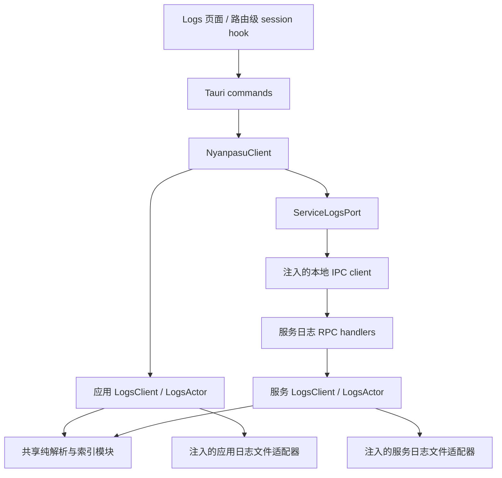

# Logs 页面接入应用与服务日志实施计划

日期：2026-09-11。状态：待实施；本文件不表示相关功能已经完成。

基线：主仓库 `705650033c13ae345b058c1a29a81b80017caf73`；runtime 子模块 `3d99071438ed133d0fdfb7f3db46c040870c4a3d`。

## 1. 目标与范围

在当前 Logs 页面提供「内核」「应用」「服务」三个来源。保留内核现有实时流；应用与服务读取各自已经落盘的 JSON 日志，支持历史分页和页面打开期间的秒级增量更新。没有存活的查看 session 后停止索引工作，经过宽限期释放索引、字符串池、文件句柄和任务。

本计划采用以下默认产品边界：

- 默认查看所选来源的当前日志文件，历史文件按需打开；不在应用启动时扫描全部历史日志。
- 不合并三个来源为一条时间线，不新增全文检索引擎，不修改日志写入级别、保留策略或服务目录权限。
- 服务日志指服务进程自身的日志，不是服务托管内核的日志归档。
- 内核的现有全局订阅保持原有生命周期；新增的 session 回收要求适用于应用、服务文件索引。
- 本期应用/服务搜索做服务端字面子串过滤和前端高亮；明确扫描进度，不把当前页面的高亮当作全历史搜索。
- 页面打开不会自动安装、启动或提权运行服务。服务不可用时只降级该来源。

## 2. 已确认的现状与问题

| 位置                                                     | 现状                                                                 | 实施影响                                        |
| -------------------------------------------------------- | -------------------------------------------------------------------- | ----------------------------------------------- |
| `backend/tauri/src/logging/indexer.rs`                   | Bump 中存放包含 `String` 的条目和普通 `Vec`，未析构；使用裸指针      | 修复释放语义，并让最终索引满足 `Send + 'static` |
| 同上                                                     | 毫秒时间戳映射到单一行号；时间范围被转换成连续行号范围               | 修复重复时间戳覆盖和时钟回退时的错误匹配        |
| 同上                                                     | 增量读取遇到半行可能丢失已提交位置；一行解析失败中止读取；缺少 TRACE | 重做行边界与提交语义，增加异常行覆盖            |
| `backend/tauri/src/logging/manager.rs`                   | 启动扫描、文件 watcher、Tauri 依赖与资源生命周期耦合                 | 复用索引经验，替换管理层；不能直接启用旧 setup  |
| `backend/tauri/src/setup.rs`                             | 旧 logging setup 当前被注释                                          | 新能力必须显式接入 composition root             |
| `backend/tauri/src/utils/init/logging.rs`                | 应用已有每日轮转 JSON 文件                                           | 通过注入的日志目录读取，无须改写日志生产链路    |
| runtime 的 `src/logging.rs`                              | 服务已有每日轮转 JSON 文件，目录受限                                 | 服务进程内读取，通过本地 IPC 返回有界结果       |
| runtime 的 `server/logger.rs`                            | 旧缓存只有有限写入块；retrieve 会清空                                | 不能作为完整、稳定游标的日志数据源              |
| `frontend/nyanpasu/src/pages/(main)/main/logs/index.tsx` | 现有虚拟列表和内核日志 hook；搜索只高亮                              | 复用列表，新增来源与真正的文件日志查询          |

服务自己的日志不应重新进入全局事件广播：现有架构曾移除该路径以避免日志产生新的广播日志。采用查询 RPC，同时处理查询请求自身的 tracing，避免每秒轮询制造新的日志。

## 3. 架构与所有权

建议在 runtime workspace 新增 `crates/nyanpasu-logging`，由主程序和服务共同依赖。纯索引、actor 生命周期和文件适配器分模块，避免两个进程分别实现解析和 session 语义。共享 crate 不依赖 Tauri。

职责分类：

- **纯服务**：JSON 行解析、索引插入、条件匹配、游标验证及结果投影。
- **Actor service**：`LogsActor` 拥有 session、索引、字符串池、增量任务与回收定时器；公开 `LogsClient` 普通异步方法。
- **Adapter / port**：日志文件目录枚举与区间读取、文件身份获取、时钟、服务 IPC。目录由 composition root 注入，不接收用户任意绝对路径。
- **边界**：Tauri commands 和服务路由只转换请求、调用 typed client、转换结果。`NyanpasuClient` 对外提供日志方法，不暴露 actor 地址或服务查找接口。

索引可被同一进程的多个 session 复用；筛选条件和游标属于请求，不复制整份索引。查询返回拥有所有权且大小受限的 DTO，不让 GUI 响应或缓存持有 arena、interner 或 actor 内部引用。

## 4. P0：先完成 benchmark 和协议冻结

### 4.1 字符串与集合选型关卡

不预先决定删除 Bump，也不预先决定引入 SmolStr。所有候选必须先满足正确析构和 `Send + 'static`，再比较性能。

| 候选              | 条目与字符串所有权                                                   | 需要验证的重点                               |
| ----------------- | -------------------------------------------------------------------- | -------------------------------------------- |
| 标准库基线        | 普通集合、条目 ID、拥有所有权的字符串                                | 分配成本及最简单实现的实际性能               |
| 标准库驻留        | `Vec<Entry>`、`TargetId`、每索引独立字符串表                         | 重复 target 去重收益、高基数成本             |
| `lasso::Rodeo`    | actor 独占 interner，条目仅存 symbol                                 | 插入/解析成本、池释放、symbol 生命周期       |
| `string-interner` | 先比较默认 backend，再按结果判断是否扩展                             | 内存与插入/查询之间的实际取舍                |
| `SmolStr`         | 正常析构的拥有者持有条目/字符串                                      | 23/24 字节边界、长 target；它本身不去重      |
| 安全 Bump 方案    | arena 存只读字符串字节或无析构字段；普通拥有者持有 postings/interner | 生命周期封装、释放、actor 可移动性及真实收益 |

`Bump::alloc(String/Vec/SmolStr)` 不能因为字符串只读就省略析构。长 `SmolStr` 仍拥有引用计数堆分配。保留 Bump 时，优先使用 `alloc_str` 或条目只保存 symbol；需要析构的对象必须由会正常 drop 的所有者管理。若使用 `bumpalo::boxed::Box`，Box 本身也必须被正常析构，不能再次埋入不会析构的 arena 对象。

不通过 `unsafe impl Send` 掩盖裸指针问题。若使用 `self_cell` 封装 owner/dependent，加入编译期 `Send + 'static` 断言并验证全部实际字段；`Bump: Send` 不等于借用 `&Bump` 的任意集合都是 Send。

只驻留高重复元数据（首先是 target），正文按文件偏移读取。interner 与可回收索引一起销毁，不使用进程全局字符串池。长时间运行时，池的保留范围必须与索引保留范围一致；必要时按有界段重建，不能只删条目却永久保留所有历史 target。

### 4.2 已有测量如何使用

前序独立 probe 的最终一组测量：Windows、i9-14900KF、release、固定逻辑 CPU、1 次预热加 9 轮交错运行取中位数；100 万条、128 种 64 字节 target。

| 完整方案                                 |     建索引 | 追加 1,000 条 |  存活分配量 |
| ---------------------------------------- | ---------: | ------------: | ----------: |
| 原结构 Bump + String，补全析构           | 177.099 ms |      0.189 ms | 207.819 MiB |
| 标准库树结构 + String + FxHash           | 187.700 ms |      0.216 ms | 241.733 MiB |
| Bump 只读字符串驻留 + self_cell + FxHash | 132.238 ms |      0.134 ms | 146.778 MiB |
| 标准库 Vec + TargetId + 默认 HashMap     |  91.082 ms |      0.083 ms |  98.096 MiB |

这些结果说明标准库方案不必然更慢，但不能把不同数据布局、hasher 和驻留方式的整体差异归因于 allocator。该 probe 没有比较 `lasso`、`string-interner`、`SmolStr`，也没有计入 JSON、文件读取、IPC、GUI；存活分配量不是 RSS。旧查询算法在这些布局上仍有相近开销，单换分配器不能解决查询问题。

P0 交付：

1. 将已有临时 probe、冻结的原索引参考、fixture 生成器、原始结果和环境说明归档为仓库内可复现的 benchmark；后续不依赖临时目录。
2. 先固定算法、字段和 hasher 比较字符串/分配，再单独比较布局与查询算法。
3. 覆盖 10 万/100 万条、低/高 target 基数、长短字符串、转义 JSON、多条件查询、无匹配查询、尾部读取、连续追加、销毁和重复开关。
4. 单独测量解析+索引、索引操作、分配计数和端到端延迟，避免计数 allocator 污染计时结论。
5. 选型记录必须附吞吐、p50/p95、峰值与存活内存、drop 后净分配结果。差距处于噪声或小于约 10% 时优先较简单实现；有稳定收益才承担额外生命周期复杂度。

验证：全部候选对同一 oracle 返回相同结果；正确释放；最终 actor state 编译通过 Send 检查。泄漏的旧实现只作为缺陷对照，不能作为可交付候选。

## 5. P1：修正共享索引与增量读取

### 数据与查询

- 用稳定条目 ID 替代裸指针关联。内存内 ID 与外部游标分开，字符串 symbol 不跨索引生命周期暴露。
- 时间索引保存重复时间戳的所有条目；时间过滤按真实时间判断，不假设文件时间单调。实时展示以文件写入顺序为准。
- 增加 TRACE；统一 `warning`/`warn`；未知级别保留为 Unknown，不中断后续日志。
- 保存文件身份、generation、字节区间和可解析的元数据。正文及结构化 fields 按页读取；不把全部正文长期放进索引。
- 查询尽量从选择性高的 posting 开始，按需要迭代和取交集，拿满页即停止；避免先构造全部匹配集合再分页。
- 关键词对 target 和正文做明确的大小写不敏感字面子串匹配，不接收正则。历史搜索限制每批扫描量，返回 continuation 和覆盖范围；增量搜索只扫描新增范围。

### 读取与生命周期正确性

- 仅在完整换行记录处理完成后推进 committed offset；文件尾半行保留到下一批。换行和 UTF-8 边界不完整时不丢失、不重复已提交记录。
- 完整坏行计入诊断并继续后续行；允许以 Unparsed 行查看受长度限制的原文。缺失时间不能伪造为写入时间参与正常时间过滤。
- 单行长度、批次读取字节数、分页条数和返回字节数都有上限；超长行报告截断/跳过原因，不无限缓存尾部。
- 识别追加、截断、同路径替换、每日轮转、删除和读取失败；改变 generation，拒绝旧游标。文件身份由平台适配器提供，不能只依赖路径和长度。
- Windows 文件读取允许合理的读写/删除共享，不因查看器阻挡日志轮转。历史文件消失时返回 FileGone，不 panic。
- 默认只索引所选文件。对大文件设置索引容量和文件扫描窗口上限；超限只保留明确标出的最近范围，旧范围通过显式历史请求加载，不能静默宣称全量。

P0 确定具体容量常量后在 P1 落地：以条目数、累计字符串字节和读取字节硬上限控制增长，并用实际分配/RSS验证。分配器缓存不要求立刻归还操作系统，但索引不得持有已释放 session 的资源。

验证：重复/倒退时间戳、所有等级、坏行、半行多次追加、Unicode、超长行、截断/替换/删除、游标失效和容量边界；随机数据与朴素逐行过滤 oracle 对照。保留原有正确用例，并把已发现的缺陷变成回归测试。

## 6. P2：session actor 与查询协议

### session 默认策略

| 参数/行为             | 默认方案                                                                  |
| --------------------- | ------------------------------------------------------------------------- |
| 增量刷新              | 活跃页面每 1 秒查询一次；同一文件最多一个更新任务，合并重复刷新请求       |
| session lease         | 45 秒；有效查询续租，包括没有新行的查询                                   |
| 页面退出/来源切换     | best-effort close；close 幂等                                             |
| 最后一个 session 结束 | 立即停止新增索引工作；保留缓存 30 秒后释放                                |
| 宽限期内重新打开      | 复用缓存并补读；旧回收定时器用 generation 检查，不能误删新 session 的索引 |
| 页面崩溃/close 丢失   | lease 到期后进入回收；最后一次续租后约 75 秒加有界在途工作时间完成释放    |
| 窗口隐藏/系统挂起     | 不假设浏览器定时器可靠；恢复后处理 SessionExpired 并重新打开              |

这些时间是本计划默认值，最终依据 P0/P6 数据调整。暂停自动滚动仍继续接收和续租；若未来提供暂停采集，应明确停止续租并释放资源。

不使用「后端 1 秒轮询 + 前端 1 秒轮询」串联制造额外延迟。查询触发合并后的文件刷新；初次建索引分批推进并立即返回 Building 状态。索引就绪后，普通增量查询在预算内先追到本次读取边界再返回；超预算返回进度，不能长期阻塞 actor 邮箱。

文件读取/解析在有界 worker 中执行，返回拥有所有权的批次；actor 串行提交索引。不通过 `Arc<Mutex<Index>>` 共享可变索引。任务携带 generation/cancellation，过期结果丢弃；关闭时取消并收束在途工作，不能只丢掉 JoinHandle。批次之间检查 lease 和取消信号。

### 最小 API

| facade 方法         | 请求重点                                          | 返回重点                                              |
| ------------------- | ------------------------------------------------- | ----------------------------------------------------- |
| `list_log_files`    | source                                            | 不透明文件 ID、日期、大小、可用状态；目录枚举不建索引 |
| `open_log_session`  | source、file ID/当前文件、打开请求 ID             | session ID、generation、Building/Ready、覆盖范围      |
| `query_logs`        | session、filters、Latest/Before/After 游标、limit | 行、扫描游标、查询边界、是否还有结果、索引进度、诊断  |
| `close_log_session` | session ID                                        | 幂等完成                                              |

文件 ID 和 session 均由后端验证；不接受客户端任意文件路径。Tauri 边界提供窗口/调用者上下文，避免仅凭用户输入的窗口名操作其他窗口 session。服务沿用现有本地 IPC 访问控制，并对会话数和请求大小设限。

游标必须包含文件 generation 和物理位置，不以时间戳或可漂移的 offset 页码定位。区分「最后返回行」和「已扫描到的位置」，无匹配时也推进扫描；同一请求重试不消费服务器游标。Before 加载旧记录，After 拉新记录，返回页内按文件顺序展示。更改筛选条件重置分页，旧响应不能混入新筛选结果。

第一版冷启动按批次建立所选范围索引，UI 展示进度；不承诺任意大文件瞬间可查。分页返回明确的覆盖范围和 snapshot 边界。读取正文前后检查文件身份，避免把旧偏移用于新文件。

协议定义 `Unavailable`、`Unsupported`、`Building`、`SessionExpired`、`CursorReset`、`FileGone` 等可恢复状态。日志 DTO 保留 typed 状态，不能依赖现有通用字符串错误在前端恢复成领域枚举。

验证：fake clock 测 lease/宽限期，无真实 sleep；覆盖多窗口共享、单窗口退出、全部退出、重复 open/close、迟到结果、宽限期重开、挂起恢复、关闭期间建索引，以及查询重试不漏行/重复消费。

## 7. P3：应用日志接入

主要修改：`backend/tauri/src/setup.rs`、`client/mod.rs`、新增 `client/logs.rs`、`ipc.rs`、`specta_export.rs`，以及相关 Cargo 依赖。

1. composition root 从注入的 `PathResolver::app_logs_dir()` 构建文件适配器和 LogsActor，将 typed client 注入 `NyanpasuClient`。
2. 文件 catalog 仅识别应用自己的日志命名，不递归索引目录内任意 `.log`。默认文件轮转后能切到新的当前文件；查看指定历史文件时不自动切换。
3. 增加四个 facade 方法和薄 Tauri commands，注册 Specta，生成 TypeScript bindings。
4. 新链路替代旧 logging manager；删除由本次替换产生的孤立模块/调用。不顺带迁移无关的旧 `core/logger.rs` 或日志 writer 初始化。
5. 应用退出时关闭 actor 和在途 worker；没有打开 Logs 页面时，仅有轻量 client/actor，不建立文件索引或运行刷新循环。

验证：用临时目录和真实 JSON fixture 经 facade 查询；应用追加/轮转可见；未开页面不扫描；关闭后资源释放。确认索引调试日志不会反复触发自身新增索引。

## 8. P4：服务日志 RPC 与兼容性

主要修改：runtime 的 `nyanpasu_ipc/src/api/log.rs`、`api/contract.rs`、`api/status.rs`、`client/shortcuts.rs`；`nyanpasu-service-runtime/src/server/{mod.rs,routing/mod.rs,routing/logs.rs}`；主程序增加 `ServiceLogsPort` 的 IPC 实现。

1. 在服务 composition root 注入真实服务日志目录，构建共享 LogsActor，将 LogsClient 放入 AppState，并纳入服务退出生命周期。
2. 在统一 `IpcOperation` 契约新增 catalog/open/query/close；沿用既有 envelope 和本地传输。添加日志查询特有的有限超时和响应上限，不修改所有服务操作的超时。
3. 主程序显式构造/注入 IPC client，不使用 `service_default()` 新增全局依赖。日志请求不排在安装、重启等长操作后面，也不调用 EnsureReady。
4. 在状态能力信息中增加可选日志查询协议版本（如 `log_query_version`，缺省表示不支持）。升级前的服务返回 Unsupported；不因缺少可选日志能力破坏正常内核控制。
5. 更新 `LogPathsInfo` 文档：路径仍不是授权，日志通过 RPC 查询。保持目录 ACL/0700，不使用 GUI 直接读服务目录的 fallback。
6. 保留未迁移的旧 inspect/retrieve 公共接口供现有调用者使用；新增功能不调用它们。不把排空缓存接口包装成新 session API。
7. 从正常日志查询路由移除会为每次成功轮询产生日志的 request tracing，保留有界错误诊断；禁止查询结果进入服务日志广播。

验证：真实 IPC round trip、旧服务缺能力、服务未运行、途中重启、token 失效、普通用户读取、路径越界拒绝、请求限额、客户端断开后的 TTL 回收。Windows 与 Unix 验证目录权限没有变化。

## 9. P5：GUI 与路由级 session

主要修改：Logs 页及 `_modules`、route search schema、`frontend/interface/src/ipc` 新 hook/导出、生成的 bindings，以及 Inlang 配置对应的各语言 messages。

1. 增加内核/应用/服务来源切换；应用和服务显示文件/日期选择、级别、时间范围、target 和关键词。来源与非敏感筛选可放 route search；session/token/cursor 不持久化进 URL。
2. 保留内核现有 `useClashLogs` 和全局 provider。新 hook 只在 Logs 路由顶层建立一个所选文件来源 session，子组件接收数据，避免父组件与 Viewer 各开一个。
3. 处理 React 重挂载、打开响应晚于卸载、切源竞态、服务重连；open 使用幂等请求 ID，晚到的 session 要关闭，旧响应按 source/session/generation 丢弃。
4. 每秒最多一个在途增量请求；失败退避，不由无限重试不断创建 session。返回焦点时校验并重开过期 session。
5. 复用虚拟列表和自动滚动。顶部加载更早页时保持滚动锚点；向上阅读时停止自动滚动并显示新日志计数，继续采集。
6. 行统一展示时间、级别、target、message；提供按需展开结构化字段、原始行和复制。Unknown/Unparsed 可见；日志内容作为文本渲染。
7. 应用/服务的「清空」明确为「清空当前显示」：记录当前查询边界为显示下限，后续轮询/重试不能恢复旧行；不删文件、不清其他 session 的共享索引。冷启动完成前禁用该操作。内核保留原来的清空语义。
8. 规范 `warning`/`warn` 并补 TRACE。内核当前搜索继续按高亮语义标注；应用/服务为过滤并高亮，显示历史搜索是否完成，不能把本批无匹配显示成全量无结果。
9. 显示 Loading/Building、无日志、服务未运行/不支持、文件消失、索引仅覆盖最近范围、查询失败等状态。只影响当前来源，错误后允许重试和切换。
10. GUI 缓存同时设条数和字节上限；退出清理该 session 的数据缓存及定时器。虚拟列表只减少 DOM，不能代替数据内存上限。

验证：用可控 IPC fake 覆盖切源、迟到响应、分页锚点、清空下限、筛选重置、重复时间戳、恢复 session 和错误状态；按现有脚本测试方式测试纯状态逻辑。浏览器验证深浅主题、窄屏、多语言、长消息和复制，另做真实 Tauri/服务联调。

## 10. P6：整体性能、释放与验收

以下是待验证的目标，不是已有性能结论：

- 在记录硬件/构建参数的基准环境，当前文件 10 万行、约 13 MiB 时，冷启动首屏 p95 目标不超过 2 秒；更大范围允许 Building 并提供进度。
- 索引已就绪、持续 1,000 行/秒、平均约 256 B、持续至少 60 秒时，从完整行落盘到 GUI 显示 p95 不超过 2 秒。分别统计 app/service；不以纯内存插入时间替代该指标。
- 空闲且没有 session 时不运行周期索引/扫描；无新增内容的活跃页面不得因为查询 tracing 而持续产生新日志。
- 同一文件多 session 共享索引，退出一个不影响其他窗口；最后一个关闭/过期后按约定时间释放索引和 interner。
- 重复打开/关闭至少 100 次：分配计数验证相关对象已释放，任务/句柄不增长；RSS 在预热后不呈线性增长。分开解释 allocator 保留页与真实泄漏。
- 大文件、高基数 target、无命中搜索和消费者落后时，内存、批次工作和响应体保持有界，并明确报告未覆盖范围。
- 输出内容、顺序、分页边界与朴素读取 oracle 一致；追加、轮转和重试不漏行，不把新旧文件混在同一 generation。

按最终 crate/test 名落地以下检查，不机械执行无关全仓重测：

- runtime：共享日志 crate 单测、service runtime 与 IPC 契约/集成测试；两个 workspace 分别做 Rust format/clippy。
- 主程序：日志 facade/adapter 测试，`export_typescript_bindings`，相关 Rust 检查和架构 ledger gate。
- 前端：`pnpm lint:ts:interface`、`pnpm lint:ts:nyanpasu`、受影响文件 Prettier/Oxlint、新增状态逻辑测试、`pnpm web:build`。
- 系统：Windows 普通用户连接服务；Unix 权限和轮转；真实应用写入、服务写入、关闭页面、窗口崩溃/挂起恢复。

## 11. 交付顺序与发布约束

| 阶段 | 依赖            | 可审查交付 / 退出条件                                                   |
| ---- | --------------- | ----------------------------------------------------------------------- |
| P0   | 无              | 可复现 benchmark、选型结论、容量常量和协议 DTO 定稿                     |
| P1   | P0              | 共享索引及缺陷回归；正确释放、Send、查询正确且性能符合结论              |
| P2   | P1              | LogsActor、文件适配器、session/游标协议；生命周期测试通过               |
| P3   | P2              | app facade/commands/bindings 接通，真实应用日志可查                     |
| P4   | P2              | 服务 RPC、能力探测、受限目录读取和重启恢复通过                          |
| P5   | P3、P4 协议稳定 | 三来源 GUI、路由级 hook、分页与状态处理通过                             |
| P6   | P3–P5           | 两端联调、秒级延迟、释放与资源上限报告                                  |
| 发布 | P6              | 发布匹配服务版本，主仓库 pin 已发布 runtime tag，验证实际下载的 sidecar |

实施功能时按仓库规则创建隔离 worktree。只复用主 checkout 的 sidecar/resources；不共享 target、node_modules 或前端 dist。Rust-only 验证准备独立 `frontendDist` 占位；GUI 验证先构建 interface，再构建应用。

runtime 是独立子模块：共享 crate、服务协议及服务二进制版本需要协调提交与发布。主仓库生产合并前应 pin 已发布 tag；更新相关版本/锁文件并验证 `scripts/check.ts` 下载到具有日志 RPC 的实际二进制。不能仅更新 gitlink 而仍下载旧服务。主程序面对旧服务保留来源不可用提示。

按可构建、可验收边界组织原子提交；benchmark 和最终实现分别说明目的。不把每个中间修补都做成独立最终提交，不将本次文档中的实施/发布步骤视为现在执行发布的授权。

## 12. 字符串方案参考

- [Bump 的 No Drop 说明](https://docs.rs/bumpalo/latest/bumpalo/struct.Bump.html#no-drops)：arena 释放不自动运行所分配对象的析构。
- [bumpalo Box](https://docs.rs/bumpalo/latest/bumpalo/boxed/struct.Box.html)：需要正常拥有和析构 Box 才能析构内部对象。
- [SmolStr](https://docs.rs/smol_str/0.3.6/smol_str/struct.SmolStr.html)：短字符串优化和长字符串共享不等同于内容驻留。
- [lasso Rodeo](https://docs.rs/lasso/latest/lasso/struct.Rodeo.html)：适合作为 actor 独占、生命周期局部的 interner 候选。
- [string-interner](https://docs.rs/string-interner/latest/string_interner/)：比较其 backend 的实际分配与查询成本。
- [self_cell](https://docs.rs/self_cell/1.3.0/self_cell/)：仅在 Bump 方案需要自引用封装且有测量收益时考虑。

P0 固定实际依赖版本与锁文件后再跑最终比较，不用不同版本的文档假设仓库中旧版本具有相同行为。
