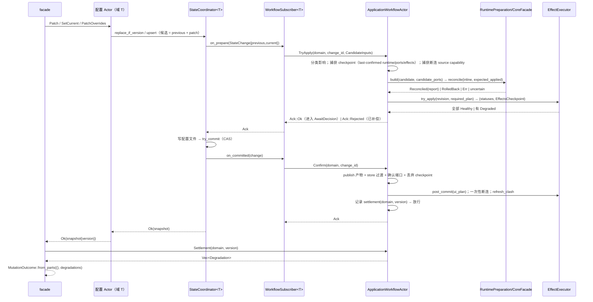
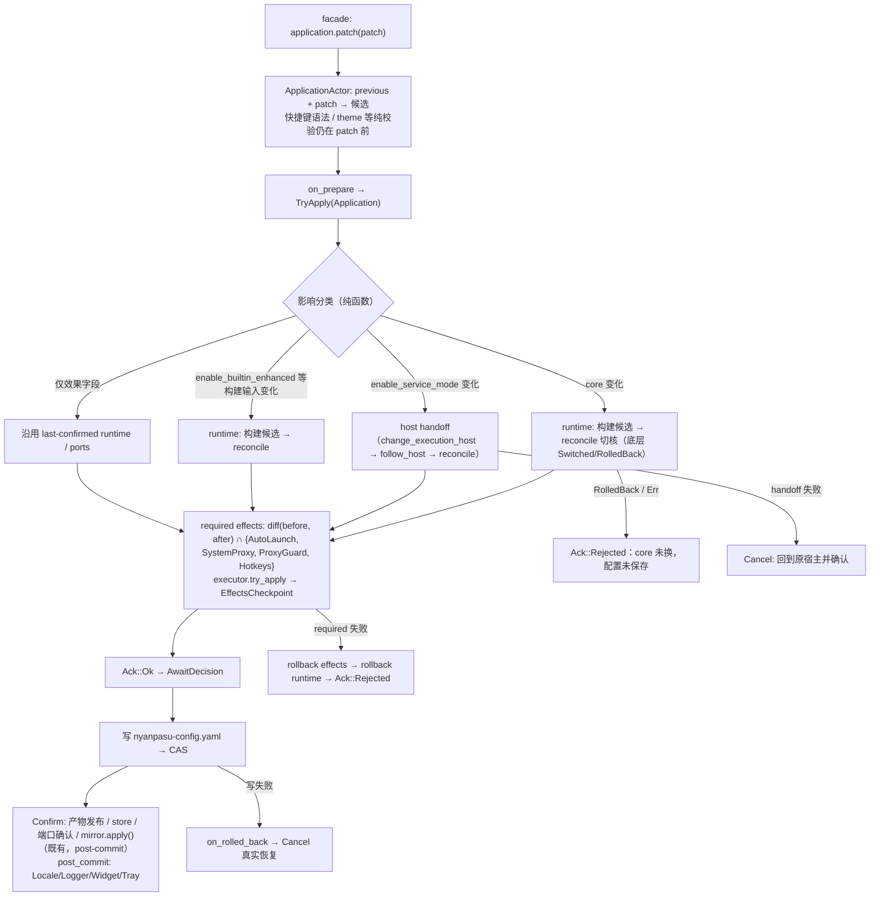
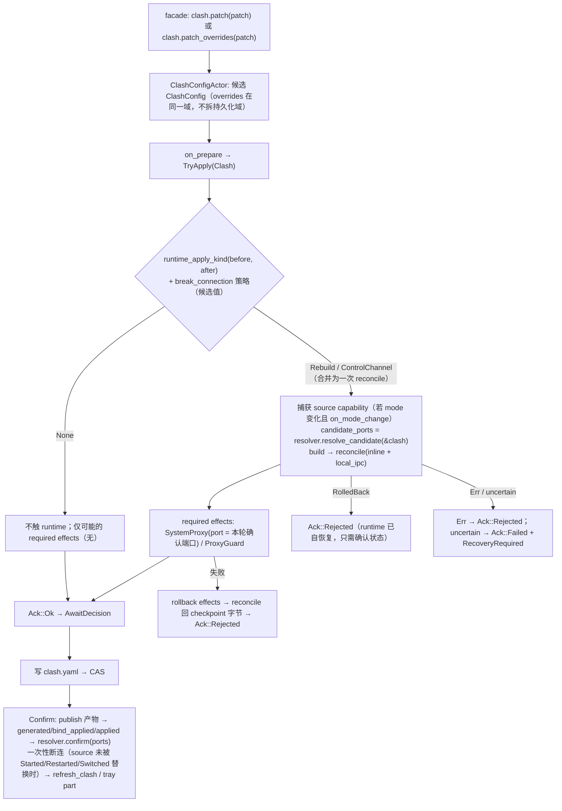
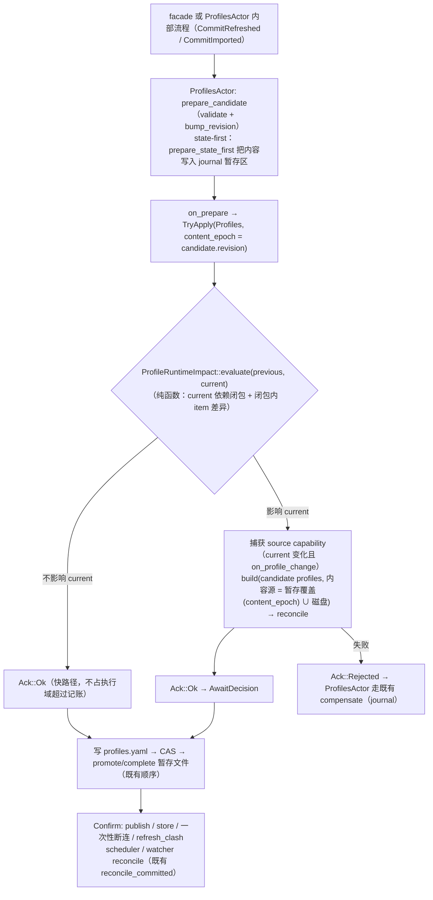

# ApplicationWorkflowActor 事务化（TCC 参与者）实施计划

> T2–T5 的决定等待、运行证据和目标身份契约以 [v2 计划](../../plan/2026-09-14-application-workflow-selective-tcc-v2.md) 及 [2026-09-19 审计修整](../../plan/2026-09-19-tcc-contract-audit.md) 为准。本文任务编号与 v2 不同，保留作历史方案记录。

日期：2026-09-14
状态：规划（未实施）
工作区：`G:/Programs/Rust/clash-nyanpasu`（直接在当前工作区实施，不另开 worktree）
参考：ChatGPT 讨论「分析PR编排流程」（两轮结论已核对进本文）；`docs/design/actor-migration-roadmap.md` §1.3 / §7.5 / §9

## 0. 基线与结论摘要

### 0.1 审核基线

| 对象                                        | 基线                                                  | 说明                                                                                                            |
| ------------------------------------------- | ----------------------------------------------------- | --------------------------------------------------------------------------------------------------------------- |
| `main`                                      | `260e743db`                                           | 工作区当前 HEAD；submodule gitlink 指向 `99dfd97ea`，工作树为 `028d3a02d`（rc.7，未提交的既有漂移，本计划不动） |
| 栈 A：#5249 → #5250                         | `feat/pr6-proxies-updater-interruption` @ `3f23543f5` | `ApplicationWorkflowActor`、profile/mode 编排、一次性断连、UpdaterActor                                         |
| 栈 B：#5266 → #5267 → #5268 → #5269 → #5270 | `feat/pr6-ui-effects` @ `85215762e`                   | `ApplicationEffectPlan`、`commit_and_reconcile`、SystemProxyActor、HotkeyActor、UI adapters                     |
| nyanpasu-state                              | `backend/nyanpasu-core/src/state/`                    | 已具备 prepare-ACK → persist → CAS commit → committed/rolled-back 通知                                          |

两条栈 `git merge-tree --write-tree` 只有 `scripts/architecture-ledger.snapshot.json` 文本冲突，但**语义上不能直接共存**：栈 A 把 `core_lifecycle` 客户端换成 `application_workflow`（`client/mod.rs`），栈 B 的 facade 仍调用 `self.inner.core_lifecycle.*`。集成基线需要一个修正提交（见 T0）。

### 0.2 问题陈述（为什么现在的两栈与 nyanpasu-state 事务模式不一致）

nyanpasu-state 的写入路径已经是 TCC 形状：

```text
候选状态
  → StateTransaction::prepare()            // 顺序/并行调用每个 StateAckSubscriber::on_prepare，Required 失败即回滚
  → effect_fn（写配置文件）                  // PersistentStateManager::upsert / replace_if_version
  → try_commit()（Arc::ptr_eq CAS 发布快照）
  → on_committed()                          // 提交后通知，不影响提交
失败 → _rollback() → on_rolled_back()       // 先释放写许可，再 best-effort 通知
```

- `coordinator.rs:316-379`（`with_pending_state_inner`）、`:211-299`（`with_pending_state_if_version`）
- `transaction.rs:225-331`（prepare）、`:384-434`（`try_commit`）、`:185-210`（`_rollback`）
- `ack.rs:142-169`（`StateAckSubscriber`：`on_prepare` / `on_committed` / `on_rolled_back`，`AckOptions` 默认 Required 30s）

三个配置域全部走这条路径：`ApplicationActor::commit` → `manager.upsert`（`state/application.rs:80-90`），`replace_prepared_if_version` → `replace_if_version`（`:96-113`）；`ClashConfigActor` 同构；`ProfilesActor::run_state_write` → `persist_candidate` → `replace_if_version`（`state/profiles/actor.rs:399-420`）。**但 `backend/tauri/src` 里没有任何 `StateAckSubscriber` 实现**：钩子存在，参与者为零。

于是两条栈各自在 state 事务**之外**手写了编排，且都是 commit-first：

| 位置                                                                  | 现状                                                                                                                        | 与 TCC 的偏差                                                                                                                      |
| --------------------------------------------------------------------- | --------------------------------------------------------------------------------------------------------------------------- | ---------------------------------------------------------------------------------------------------------------------------------- |
| 栈 B `client/effects/mod.rs:203-271` `commit_and_reconcile`           | 自建 `tokio::sync::Mutex` gate：采样 before → commit → 分配 `EffectRevision` → runtime apply → 采样 after → diff → dispatch | 第二套准入；commit 之后一切失败都变 `CommittedDegraded`（`runtime_rebuild_failed` / `control_channel_apply_failed` / effect 降级） |
| 栈 A `application_workflow/workflow.rs:72-76` `PatchRuntimeOverrides` | 在 workflow 操作**内部**调用 `clash.patch_overrides` 提交，再 `lifecycle.apply`                                             | 提交先于应用；apply 失败 → `config_reconcile_failed` 降级                                                                          |
| 栈 A `application_workflow/profiles.rs:47-56` `ActivateProfile`       | 操作内 `profiles.set_current` 提交后 build+apply                                                                            | 同上，`runtime_rebuild_failed` 降级                                                                                                |
| 栈 A `core_lifecycle/workflow.rs:131` `SelectCore`                    | `application.patch(core)` 提交后 reconcile                                                                                  | 失败返回 `Err`（不是降级）——三种失败表示并存                                                                                       |
| 栈 A `core_lifecycle/workflow.rs:143` `SetExecutionHost`              | `application.patch(enable_service_mode)` 提交后 handoff                                                                     | 失败 → `service_host_transition_failed` 降级                                                                                       |
| `core/actor_v2/facade.rs:192-201`                                     | 底层 `ReconcileOutcomeKind::RolledBack`（runtime 已干净恢复旧版本）被压平为不可重试 `Err(ApplyFailed)`                      | 「已恢复」与「真失败」不可区分，应用层无法据此做干净的 Cancel                                                                      |
| `client/ports.rs:45,142` + `core_lifecycle/adapters.rs:87`            | `SessionPortResolver::resolve()` 在 build 时即写共享缓存                                                                    | 候选端口在 apply 失败后仍被 effects 当作 active 端口（系统代理指向未生效端口）                                                     |
| 栈 B retry map（`effects/mod.rs:62-72,133-180`）                      | 只记 peripheral effect 的可重试降级                                                                                         | runtime apply 失败不入集合；再次保存相同值 `runtime_apply_kind == None`，跳过 apply                                                |

根因：**配置提交点在应用之前**。roadmap §1.3（`docs/design/actor-migration-roadmap.md:58-71`）明确写着「commit-first，但不伪装成回滚」，两栈是按该原则实现的。本计划是对 §1.3 的**政策修订**（见 §8），不是两栈的实现缺陷修补。

### 0.3 结论（一句话）

> 让 `ApplicationWorkflowActor` 成为三个配置域 state 事务的 **Required 参与者**：`on_prepare` = Try（用候选输入构建并应用 runtime + 必需系统效果，保留 checkpoint），`on_committed` = Confirm（发布、结算、提交后动作），`on_rolled_back` = Cancel（恢复 checkpoint）。配置能否提交由 nyanpasu-state 决定；能否应用、失败如何恢复由 workflow 决定。**不新建第二套事务引擎，不让 workflow 成为源配置的写入者。**

## 1. 目标语义

### 1.1 TCC 映射

| nyanpasu-state                    | ApplicationWorkflow | 内容                                                                                                                       |
| --------------------------------- | ------------------- | -------------------------------------------------------------------------------------------------------------------------- |
| `on_prepare(change)` → `Ack`      | `TryApply`          | 固定本轮输入 → 影响分类 → 捕获 checkpoint → 构建/应用 runtime → 应用必需效果 → `Ack::Ok` / `Ack::Rejected` / `Ack::Failed` |
| effect_fn（写文件）+ `try_commit` | （state 层）        | workflow 处于 `AwaitDecision`，执行域仍被本事务占用                                                                        |
| `on_committed(change)`            | `Confirm`           | 发布产物、store 过渡、确认端口、丢弃 checkpoint、提交后动作（UI/tray、一次性断连、advisory 效果）、记录 settlement、放行   |
| `on_rolled_back(change, reason)`  | `Cancel`            | 等待在途 Try 结束 → 恢复效果 → 恢复 runtime → 恢复端口 → 放行；恢复失败/未知 → `RecoveryRequired`                          |

### 1.2 失败矩阵（目标）

| 阶段                   | 内容                                                                   | 失败处理                              | 调用方看到                                       |
| ---------------------- | ---------------------------------------------------------------------- | ------------------------------------- | ------------------------------------------------ |
| Prepare（Try 之前）    | 参数校验、快捷键语法、profile 引用、runtime 构建、端口探测             | 拒绝，不提交                          | `Err(ApplyRejected{phase, code})`                |
| Required apply（Try）  | core reconcile / 宿主切换 / 系统代理 / PAC / guard / 自启 / 快捷键注册 | 补偿到 checkpoint，不提交             | `Err(ApplyRejected{...})`，配置读回仍是旧值      |
| Commit（写文件 / CAS） | 源配置持久化                                                           | 进入 Cancel 补偿                      | `Err(WriteConfig)` + 状态事件                    |
| Post-commit（Confirm） | UI/tray/locale/logger/widget、一次性断连、proxies cache 刷新           | 保留提交，报告 `CommittedDegraded`    | `MutationOutcome::CommittedDegraded`             |
| 恢复失败 / 结果未知    | Cancel 的任一步失败，或 runtime 结果 uncertain                         | 锁定 `RecoveryRequired`，拒绝后续变更 | 后续写入被 Rejected：「restart the application」 |

保留 §1.2 三态：Desired（已提交配置）/ Promoted（产物文件）/ Applied（核心确认）。区别是：**Promoted 与 Applied 的推进都发生在 Confirm，Try 只产生候选**。

### 1.3 什么不承诺

- 断电时多文件原子性（profiles 文件 + yaml + 产物）——沿用现有 journal；不新增 commit marker。
- Try 成功后、CAS 落盘前进程崩溃：runtime 已按候选运行而磁盘仍是旧配置。state 事务纯内存，没有参与者 journal。接受这一窗口：下次启动 `StartupReconcile` 按磁盘配置重建并 full effects，自行收敛。
- 外部程序写入的 profile 文件不可回滚——只固定本轮读取的内容。
- 进程切换、短暂断网等过渡对外可观察——保证的是可确认的补偿，不是隔离。

## 2. 架构

### 2.1 组件与依赖方向

```mermaid
flowchart TB
    IPC["Tauri commands / tray / hotkey pump"] --> F["NyanpasuClient (facade)"]
    F -->|patch / set_current / patch_overrides| A["ApplicationActor / ClashConfigActor / ProfilesActor<br/>各自 PersistentStateManager"]
    A -->|Required on_prepare / on_committed / on_rolled_back| S["ApplicationWorkflowSubscriber&lt;T&gt;<br/>(薄适配，三域各一)"]
    S --> W["ApplicationWorkflowActor<br/>单一执行域：Try / Confirm / Cancel + 非配置命令"]
    W -->|StateSnapshot 只读| A
    W --> P["RuntimePreparation + RuntimeBuildPort<br/>显式候选输入 + 候选端口（不写缓存）"]
    W --> C["CoreFacade / CoreManager<br/>reconcile(inline) / RolledBack / uncertain"]
    W --> E["ApplicationEffectExecutor<br/>try_apply / rollback / post_commit"]
    E --> SP["SystemProxyActor"]
    E --> HK["HotkeyActor"]
    E --> UI["locale / logger / tray / widget adapters"]
    F -->|Settlement(domain, version)| W
    F -->|直接命令：Stop/Recover/ReplaceBinary/Reconcile/Service*| W
    SS["SessionStateActor（窗口状态）"] -.->|不订阅| W
```

不变量（实现与评审都按此检查）：

1. **workflow 不持有任何配置 actor client**。它对配置的读取只经 `StateSnapshot<T>`（`coordinator.rs:75-77` `snapshot_handle()`，无锁、只见已提交值），对候选的读取只经 `StateChange<T>{previous, current}`。
2. **workflow 操作内部不写源配置**。`SelectCore` / `SetExecutionHost` / `PatchRuntimeOverrides` / `ActivateProfile` / `AutoActivateProfile` 作为 workflow 命令删除；写入回到 facade → 配置 actor，应用阶段由订阅触发。
3. **Try 不向正在等待 ACK 的配置 actor 发 RPC**（其 mailbox 在 `handle` 内 await 事务，`state/clash_config.rs:157-161`、`state/application.rs:140-148`、`state/profiles/actor.rs:1122-1129`）。这是 `ack.rs:129-140` 明示的死锁条件；由不变量 1 在类型层面杜绝。
4. **不注入 `NyanpasuClient` 到 workflow**（延续 `docs/plan/2026-09-13-runtime-apply-options.md:65`）。
5. `SessionState` 不参与事务（窗口位置每次拖动都会提交）。
6. **workflow 是每个域唯一的 Required 订阅者**。coordinator 默认 `NotifyStrategy::Parallel`（`coordinator.rs:23-30`），多个 Required 参与者之间没有顺序与部分中止控制；若将来要加第二个参与者，必须先切 Sequential 并重新评审。
7. `on_rolled_back` 只入队 `Cancel` 并等待有界回执，**不在回调内执行恢复**：`RollbackGuard::drop` 会用 `block_on_anywhere` 同步跑回滚通知（`transaction.rs:105-128`），回调里做 IO 会卡住 drop 所在线程。

### 2.2 为什么不是「workflow 作为唯一写入者」

ChatGPT 第一轮建议 workflow 拥有源配置提交；第二轮核对 state 层后改为参与者模型。本计划采纳参与者模型，理由：

- state 层已有 permit、CAS、prepare/commit/rollback、快照 MVCC，重做一遍是第二套事务引擎；
- 参与者模型下三个域的候选构造、验证、版本检查、文件 journal 全部原样复用；
- 等待环问题用「workflow 不写配置、不 RPC 配置 actor」两条规则即可根除，不需要跨 RPC permit。

代价（必须接受并在 T2 缓解）：一个域的事务在 Try 期间占住该域 actor 的 mailbox（最长到 ACK 超时）。因此 **facade 的读路径必须改为 `StateSnapshot` handle**，否则设置页在一次 runtime 重建期间会卡读。

### 2.3 nyanpasu-core 需要改什么

**不需要改代码。** 逐项核对：

| 需求                             | 现有能力                                                                                                                          | 结论                                                                                                                                                                               |
| -------------------------------- | --------------------------------------------------------------------------------------------------------------------------------- | ---------------------------------------------------------------------------------------------------------------------------------------------------------------------------------- |
| Try 能阻止提交                   | `Ack::Rejected` / `Ack::Failed` → `is_required_failure` → `_rollback`（`transaction.rs:262-321`）                                 | 够用                                                                                                                                                                               |
| 事务身份                         | `StateChange.id: StateChangeId`（= 下一版本号，`version.rs:45`；失败尝试不消耗 id）                                               | 用 `(domain, change.id)` 定位活动事务；不作全局事务 id                                                                                                                             |
| Try 超时                         | `AckOptions.timeout`（`ack_options()` 静态）                                                                                      | 三域订阅者设 180s（= `CALL_WAIT`）；超时 → `SubscriberFailed(TimedOut)` → `on_rolled_back` → Cancel 先等在途 Try 结束                                                              |
| Cancel 结果可观察                | `on_rolled_back -> ()`（best-effort，同样有超时）                                                                                 | 由 workflow 自己记录 settlement 并发布 `RecoveryRequired` 状态；调用方通过 facade 查询                                                                                             |
| 关闭期语义                       | `is_shutdown()` 会让订阅者被跳过                                                                                                  | **不实现** `is_shutdown`；关闭期 `on_prepare` 返回 `Ack::Rejected("shutting down")`，配置写入被拒绝而不是绕过应用                                                                  |
| 提交后动作失败不影响提交         | `on_committed` 结果只用于监控                                                                                                     | 符合 Confirm 语义                                                                                                                                                                  |
| Cancel 与下一次 Try 的互斥       | permit 在 fanout 之前就释放（`transaction.rs:189`、`:411-412`），互斥靠调用方的 `&mut`                                            | 域内由配置 actor 的 `handle` 串行保证（它 await 整个 `replace_if_version`，含 `on_rolled_back`）；跨域由 workflow 执行域保证（Cancel 期间不放行）                                  |
| Cancel 会发给投了 No 的参与者    | Parallel 模式下 `_rollback` 通知全部订阅者（`transaction.rs:280-299`）                                                            | Cancel 必须幂等：Try 已自行补偿的事务只做记账（§5.4 第 2 步）                                                                                                                      |
| 普通 `upsert` 路径无 recovery_fn | `with_pending_state_inner` 在 effect 成功后 CAS 失败不重写文件（`coordinator.rs:316-387`）；只有 `replace_if_version` 带 recovery | 单写者下 CAS 失败不可达，但 T8 顺手把 `ApplicationActor::commit` / `ClashConfigActor::commit` 从 `upsert` 改为 `replace_if_version(current_version, next)`，三域统一走带补偿的路径 |

只补一份文档：`backend/nyanpasu-core/src/state/ack.rs` 头注释增加「Required 参与者做真实副作用时的三条规则」（不 RPC 回源 actor、Try 可取消安全、Cancel 必须等在途 Try）。

## 3. 生命周期

### 3.1 事务状态机（扩展 #5250 的 active-operation）

```mermaid
stateDiagram-v2
    [*] --> Idle
    Idle --> Applying: TryApply(domain, change_id)（占用执行域）
    Idle --> Running: 非配置命令（Stop/Recover/ReplaceBinary/Reconcile/Service*）
    Running --> Idle: Completed
    Applying --> AwaitDecision: Try 成功 → Ack::Ok
    Applying --> Cancelling: Try 失败（已补偿）→ Ack::Rejected / Ack::Failed
    AwaitDecision --> Confirming: on_committed → Confirm
    AwaitDecision --> Cancelling: on_rolled_back → Cancel（写文件失败 / ACK 超时 / CAS 冲突）
    Confirming --> Idle: settlement 记录
    Cancelling --> Idle: 恢复确认
    Cancelling --> RecoveryRequired: 恢复失败 / 结果未知
    Applying --> RecoveryRequired: runtime 结果 uncertain
    RecoveryRequired --> RecoveryRequired: 新 TryApply → Ack::Rejected；只读与显式 Recover 允许
    RecoveryRequired --> Idle: 显式 Recover 确认一致
    Idle --> Closing: Close
    AwaitDecision --> Closing: Close（等待 decision 到达再关）
    Closing --> [*]: 恢复系统代理/快捷键/widget → 按策略停核 → Stopped
```

规则：

- `TryApply` 到达时若执行域被非配置命令占用（如二进制替换、dirty 重建），最多等待 `TRY_ADMISSION_WAIT`（建议 30s）；超过则 `Ack::Rejected("core busy")`，配置**不提交**，UI 提示稍后重试。这与 #5250 的 queue-full / shutting-down 在提交前拒绝一致。
- `Confirm` / `Cancel` / `Settlement` 是结算消息，不进 FIFO，只对活动事务生效；`(domain, change_id)` 不匹配的结算记录警告并忽略（对应「上一笔失败尝试的迟到 Cancel 不能误伤下一笔」）。
- 调用者超时 ≠ 操作失败 ≠ 放行（沿用 `mod.rs:577-589`）。ACK 超时会 drop `on_prepare` future，但 Try 在 tracked task 里继续；Cancel 必须先 `await` 该 task。
- `uncertain` 闩（`core_lifecycle/workflow.rs:26`、`mod.rs:244-254`）直接复用为 `RecoveryRequired`。

### 3.2 一次单域 patch 的时序（通用）



失败分支：`Ack::Rejected` → `SC` 回滚 → `on_rolled_back` → `Cancel`（Try 已补偿，只做记账放行）→ `A` 返回 `Err(PrepareAck{report})` → facade 映射为 `ClientError::ApplyRejected`。写文件失败 → `on_rolled_back` → `Cancel` 执行真实恢复。

## 4. 三类 patch 的流程

### 4.1 Application（`patch_app_config` / `select_core` / `set_execution_host` / 快捷键动作）



要点：

- `select_core` / `set_execution_host` 不再是 workflow 命令；facade 直接 `application.patch(...)`。换核回到 all-or-nothing（roadmap §1.3 曾把它列为允许补偿回滚的例外，现在与普通 patch 同一条路径，不再需要专门事务）。
- 宿主切换的 Try 预算大（UAC 可到 100s），Application 订阅者的 ACK 超时设为 180s。
- `enable_system_proxy` 等效果字段的 `after` 使用**候选 + 本轮确认的端口**（若 runtime 未变化则用 last-confirmed 端口），永远不用 resolver 缓存。
- 快捷键分发（`hotkey_action_pump`）走 facade 普通 patch，天然串行。

### 4.2 Clash（`patch_clash_config` / `patch_runtime_overrides`）



要点：

- 控制通道与 runtime 不再是两次独立事务：候选 Clash 同时决定 snapshot 与 `LocalIpcSettings`，交给同一次 `reconcile`（`PreparedRuntime` 已经这样交付）。`runtime_apply_kind` 只用于「是否需要触 runtime」，不再区分两种 apply 调用。
- `ReconcileOutcomeKind::RolledBack` 在 facade 层保留为独立结果（不再压成 `ApplyFailed`），Try 据此做「干净拒绝」。
- 断连策略从候选 `break_connection` 读取；「mode 值未变但重复提交」按 diff 视为无变化（决策 D-6）。

### 4.3 Profiles（选择 / 定义 / 元数据 / transforms / 远程刷新 / 导入）



要点：

- `affects_current` 现在是 `CommitReport` 里的事后信息（`run_state_write` 用 `AffectsRule` 按消息类型算）。Try 只拿得到 `StateChange<Profiles>`，因此新增纯服务 `ProfileRuntimeImpact::evaluate(before, after) -> bool`：`current_closure(before) != current_closure(after)`，或闭包内任一 item 在 before/after 不相等。它比 `AffectsRule` 保守（多算不少算）。
- 构建内容来源：state-first 操作在提交前只把新内容写到 journal 暂存区（`service/profile_file.rs:1596-1660`；`read_staged_resource` 在 `:748`）。Try 的构建必须能读到它：`FsProfileContentSource` 增加「暂存覆盖」——按 `(managed path, expected_revision == candidate.revision)` 优先读暂存资源，否则读磁盘。这样不改变 state-first / file-first 顺序，也不引入文件 MVCC。
- 「新建/导入成功 → 自动激活失败」保持两个成功边界：`create_profile` 提交成功后 facade 单独调 `profiles.set_current_if_none(uid)`，它是第二笔事务；失败不影响已提交的 `ProfileId`。
- 后台 `CommitRefreshed` 仍在 ProfilesActor 内提交，其 prepare 会触发 Try（构建用暂存内容）。它已带 URL / 定义指纹过期保护，不改。
- **本轮不做**（D-5，Phase 2）：`save_profile_file`（编辑器直接写盘）与 `ExternalFileChanged`（外部编辑）目前是「写盘/watch → dirty → reconcile」，不经事务。Phase 2 把它们改为「暂存 + Profiles 事务（bump_revision）」。在此之前这两条路径保留 dirty 重建。

## 5. 执行域内的三个阶段（实现细节）

### 5.1 `CandidateInputs`（Try 的唯一输入）

```rust
pub(super) struct CandidateInputs {
    pub changed: ConfigDomain,                 // Application | Clash | Profiles
    pub change_id: StateChangeId,
    pub app: Arc<NyanpasuAppConfig>,           // changed==Application 时为 change.current，否则 StateSnapshot 加载
    pub clash: Arc<ClashConfig>,
    pub profiles: Arc<Profiles>,
    pub previous: PreviousInputs,              // 对应三份 before（changed 域来自 change.previous）
    pub profiles_content_epoch: Option<u64>,   // changed==Profiles 时 = candidate.revision()
}
```

由 `ApplicationWorkflowSubscriber<T>::on_prepare` 组装：本域来自 `StateChange`，其余两域来自订阅者持有的 `StateSnapshot<_>`（组合根注入，`manager.snapshot_handle()`）。

### 5.2 Try

1. 若 `closing` → `Ack::Rejected("shutting down")`；若 `RecoveryRequired` → `Ack::Rejected("recovery required")`。
2. 占用执行域（等待 ≤ `TRY_ADMISSION_WAIT`）。
3. 影响分类（纯函数，可单测）：`RuntimeImpact::{None, Reconcile{reason}, SwitchCore, ChangeHost}` + `required_effects: ApplicationEffectPlan` + `interruption: Option<ConnectionScope>`。
4. 捕获 checkpoint：
   - `RuntimeCheckpoint`：last-confirmed `RuntimeSnapshot`（bytes、core、`LocalIpcSettings`、`AppliedConfigBinding`）与 `CoreIntent`（Stopped/Idle），来自 `RuntimeSnapshotStore.applied`（不是 `promoted`，不是 `pending`）；
   - `PortsCheckpoint`：`SessionPortResolver::confirmed()`；
   - 断连 source capability（`prepare_apply` 的既有逻辑，提交前捕获，一次性）。
5. runtime：`candidate_ports = resolver.resolve_candidate(&clash)`（不写缓存）→ `builder.build(revision, profiles, clash, app, candidate_ports, content_overlay)` → `CoreFacade::reconcile(core, doc, spec, local_ipc)`：
   - `Reconciled` → 记录 `ReconcileReport`（含 `applied` binding、effective config）；
   - `RolledBack` → 底层已恢复：`Ack::Rejected(core_rolled_back)`，无需应用层再恢复；
   - `Err` → `Ack::Rejected`；
   - uncertain（`outcome_uncertain()`）→ 闩 `RecoveryRequired` → `Ack::Failed`。
   - 用户显式 `StopCore` 后（`CoreIntent::Stopped`）的普通保存：不启动核心，`RuntimeImpact` 降为 `None`，但系统代理不得指向未确认端口（沿用「无运行实例时端口未解析 → `system_proxy_port_unresolved`」）。
6. required effects：`after = project(app, clash, confirmed_candidate_ports)`；`plan = diff(before, after).retain(required_kinds)`；`executor.try_apply(revision, plan) -> (Vec<EffectStatus>, EffectsCheckpoint)`。任一 required `Degraded`/timeout → `executor.rollback(checkpoint, revision+1)` → runtime 回滚（见 5.4）→ `Ack::Rejected`。
7. `Ack::Ok`；状态 → `AwaitDecision{op, checkpoint, report, post_commit}`。

### 5.3 Confirm

1. `builder.publish(snapshot)` → `store.generated` → `store.bind_applied` → `store.applied`（`client/runtime.rs:132-160` 的 id 守卫原样保留）。
2. `resolver.confirm(candidate_ports)`；`recovery.intent = Idle`（从 `apply_runtime` 内移到这里，`core_lifecycle/workflow.rs:442`）。
3. 提交后动作（每项独立超时，失败入 settlement 降级，不回滚）：一次性断连（`apply.rs:52-77` 的 `replaced` 栅栏原样保留）→ `executor.post_commit(ui_plan)`（Locale/Logger/Widget/Tray）→ `ui.refresh_clash()` / tray part。
4. 记录 `settlement[(domain, version)] = Vec<Degradation>`（有界环，复用 `completed` 的形状）；放行。

### 5.4 Cancel

1. 若 Try task 仍在途（ACK 超时场景），`await` 其完成，再按其结果决定。
2. 若 Try 已自行补偿（`Ack::Rejected` 路径）：只记账放行。
3. 否则（写文件失败 / CAS 冲突 / 超时后 Try 成功）：`executor.rollback(EffectsCheckpoint, new_revision)` → `CoreFacade::reconcile(checkpoint.bytes, expected_applied = report.applied.revision)`（底层再次 `RolledBack` 亦视为恢复成功）→ `resolver` 保持 confirmed 不变 → 断连 context 丢弃（未消费）。
4. 任一步 `Err`/uncertain → `RecoveryRequired`（发布状态事件；`on_rolled_back` 返回后配置 actor 把 `Err` 交还调用方）。

恢复顺序固定：暂停 guard → 恢复 core → 恢复代理/PAC/自启 → 恢复 guard → 恢复快捷键。不引入通用 DAG。

### 5.5 Effect owner 的 checkpoint 契约

依据栈 B 现状（`effects-stack` 审阅）：

| Owner                           | 现状                                                                                                             | 需要补的                                                                                                                                                                                                                                                                                                 |
| ------------------------------- | ---------------------------------------------------------------------------------------------------------------- | -------------------------------------------------------------------------------------------------------------------------------------------------------------------------------------------------------------------------------------------------------------------------------------------------------- |
| SystemProxy / PAC               | `capture_original` 只在首次启用捕获一次（`system_proxy/actor.rs:551`）；`Restore` 是退出恢复且永久关闭（`:694`） | 新消息 `Reconcile{..., checkpoint: true}` 返回 `SystemProxyCheckpoint{os_before, desired_before, pac_before}`；新消息 `Rollback{checkpoint, revision}`：写回 `os_before`、按 `pac_before` 恢复/清除 PAC、保持 actor 可用。PAC 第三方 url 只能清除不能恢复（记录为限制）。PAC 在 Try 内单次尝试、15s 预算 |
| 自启                            | `is_enabled` 每次写前已读但丢弃                                                                                  | 保存到 checkpoint；`set_enabled` 自逆                                                                                                                                                                                                                                                                    |
| Guard                           | 派生状态                                                                                                         | 重发上一份 `ProxyGuardDesired` 即恢复                                                                                                                                                                                                                                                                    |
| Hotkey                          | `registered` 为 OS 确认集合；无恢复消息                                                                          | `Rollback` = 用 `registered` 快照构造 `HotkeyBindings` 重新 `Reconcile`（新 revision）；重抓失败 → `RecoveryRequired` 降级而非无限重试                                                                                                                                                                   |
| Locale / Logger / Widget / Tray | 通知型或不可撤销                                                                                                 | 归入 post-commit，不进 Try                                                                                                                                                                                                                                                                               |

`ApplicationEffectsPort` 从 `{apply, shutdown}` 改为 `{try_apply, rollback, post_commit, shutdown}`；`apply` 的「不可失败」由 `try_apply` 的 `Vec<EffectStatus>` 表达（Try 据 `Degraded` 判定）。revision 单调分配器继续由 workflow 持有（compensating apply 必须携带更新的 revision，owner 拒绝旧 revision 的逻辑不变）。

### 5.6 端口：候选与确认分离

`SessionPortResolver`（`client/ports.rs`）拆成：

- `resolve_candidate(&clash) -> ResolvedPortBindings`：以 confirmed 为基线，只对策略指纹变化的字段探测，**不写缓存**；
- `confirm(bindings)`：Confirm 阶段写入；
- `confirmed() -> Option<ResolvedPortBindings>`：effects、`SelfProxyPortSource`、`session_ports()` 唯一读口。

## 6. 任务分解

每个任务 = 一个可构建、可独立评审的提交（或一组紧密提交）；验证判据写死。顺序即依赖顺序。

| #   | 任务                     | 改动要点                                                                                                                                                                                                                                                                                                                                                                                                                                                                                                                | 复用                                                                              | 验证判据                                                                                                                                                                                                                                                        |
| --- | ------------------------ | ----------------------------------------------------------------------------------------------------------------------------------------------------------------------------------------------------------------------------------------------------------------------------------------------------------------------------------------------------------------------------------------------------------------------------------------------------------------------------------------------------------------------- | --------------------------------------------------------------------------------- | --------------------------------------------------------------------------------------------------------------------------------------------------------------------------------------------------------------------------------------------------------------- |
| T0  | 集成基线                 | 在工作区从 `main` 建 `feat/pr6-application-workflow-tcc`，merge 栈 A 再 merge 栈 B；修正 facade 里 `core_lifecycle` → `application_workflow` 引用；重算 ledger snapshot                                                                                                                                                                                                                                                                                                                                                 | 两栈全部代码                                                                      | `cargo build`、`cargo test --lib`（≥ 535 + 栈 B 用例）、`pnpm typecheck`、`deno run -A scripts/architecture-ledger.ts --mode=gate` 全绿                                                                                                                         |
| T1  | 读路径脱离 actor mailbox | `ApplicationClient/ClashConfigClient/ProfilesClient` 增加 `snapshot() -> Arc<VersionedState<T>>`（持 `StateSnapshot`）；facade `get_app_config/get_clash_config/get_profiles` 与 `RuntimePreparation` 全部改用；`RuntimePreparation` 不再持有配置 client                                                                                                                                                                                                                                                                | `snapshot_handle()`                                                               | 新测试：一个域的 prepare ACK 挂起 5s 期间，`get_*` 在 10ms 内返回旧值                                                                                                                                                                                           |
| T2  | 影响分类纯服务           | `RuntimeImpact::classify(prev, cand)`（core / host / 构建输入 / `runtime_apply_kind`）；`ProfileRuntimeImpact::evaluate`；`required_kinds()`                                                                                                                                                                                                                                                                                                                                                                            | `plan.rs` 的 `runtime_apply_kind`、`ProfilesActor::current_closure`               | 纯值单测：每个单字段变化的分类；profiles 闭包内/外修改各一                                                                                                                                                                                                      |
| T3  | 端口候选/确认分离        | §5.6；`FsRuntimeBuildAdapter::build` 改为接收 `ResolvedPortBindings` 参数                                                                                                                                                                                                                                                                                                                                                                                                                                               | `ports.rs` 指纹逻辑                                                               | 回归：`resolve_candidate` 不改变 `confirmed()`；已有端口探测测试不变                                                                                                                                                                                            |
| T4  | Effect owner checkpoint  | §5.5 的 SystemProxy/Hotkey 消息与 executor `try_apply/rollback/post_commit`；`ApplicationEffectsPort` 新签名；mock 更新                                                                                                                                                                                                                                                                                                                                                                                                 | 栈 B owners、executor、status 协议、revision 单调                                 | owner 测试：apply→rollback 后 OS/注册集合与 checkpoint 相等；PAC 失败 → 回滚到 checkpoint 而非 fallback；Rollback 后 owner 仍接受下一次 Reconcile                                                                                                               |
| T5  | Workflow 事务骨架        | `Message::{TryApply, Confirm, Cancel, Settlement}`；状态机 §3.1；`TRY_ADMISSION_WAIT`；settlement 环；`ApplicationWorkflowSubscriber<T>`（三域）与 `ack_options() = required(180s)`；删除 `Command::{PatchRuntimeOverrides, ActivateProfile, AutoActivateProfile}` 与 `CoreCommand::{SelectCore, SetExecutionHost}`                                                                                                                                                                                                     | #5250 队列、tracked task、`OperationId`、`uncertain` 闩、`completed` 环、shutdown | actor 测试（fake ports）：Try→Confirm、Try→Cancel(写失败)、ACK 超时后 Try 成功再 Cancel、执行域被占用时 Rejected、迟到 Cancel 被忽略、Closing 期 Rejected                                                                                                       |
| T6  | Try/Confirm/Cancel 实体  | §5.2–5.4；`RuntimeCheckpoint` 来源 `store.applied`；`CoreFacade` 保留 `RolledBack` 为独立结果（`facade.rs:192-201` 改为 `ReconcileResult::RolledBack`）；`recovery.intent = Idle` 移到 Confirm                                                                                                                                                                                                                                                                                                                          | `apply.rs` 断连上下文、`apply_runtime` 拆成 build/reconcile/publish 三段          | fake-core 矩阵：Reconciled、RolledBack、Err、uncertain 四种底层结果 × Try/Cancel；publish 只在 Confirm 发生（Try 失败时产物文件字节不变）                                                                                                                       |
| T7  | 组合根与订阅注册         | `with_parts` 顺序：load managers → snapshot handles → spawn workflow → 构造订阅者 → `manager.add_subscriber` → spawn 配置 actors；`ApplicationClient::new` 等接收 `Vec<Box<dyn StateAckSubscriber<T>>>`                                                                                                                                                                                                                                                                                                                 | `PersistentStateManagerSetup`、`impl_state_manager_delegates!::add_subscriber`    | 启动期 init 事务不触发 Try（订阅在 load 之后注册）；启动 `StartupReconcile` 直接命令跑 full effects                                                                                                                                                             |
| T8  | Facade 换线              | 删除 `commit_and_reconcile`、`ApplicationEffects` gate、retry map、`reconcile_application_effects`；八个挂载点改为「直接写配置 → 查 settlement → `MutationOutcome`」；`select_core/set_execution_host/patch_runtime_overrides/activate_profile/auto-activate` 改为直接写配置；`PrepareAck` → `ClientError::ApplyRejected{phase, code, message}`（`ProfilesError::Persist` 改为携带 `PrepareReport` 的变体）；删除 profiles 提交后的 `rebuild_running_config`（仅 `ExternalFileChanged`/`save_profile_file` 保留 dirty） | `MutationOutcome`、`Degradation`、bindings                                        | facade 测试：栈 B 的 9 个 `client::effects::tests` 语义改写（`effect_failure_keeps_committed_config` → `required_effect_failure_rejects_commit`）；`export_typescript_bindings` 零漂移或有意变更；前端 `MutationCache` 对 `ApplyRejected` 展示「未保存 + 原因」 |
| T9  | Profiles 暂存覆盖        | `FsProfileContentSource` 暂存覆盖（按 `(path, expected_revision)`）；`RuntimeBuildPort::build` 增加 `content_epoch: Option<u64>`；`ProfileFileService` 暴露 `read_staged_for(path, revision)`                                                                                                                                                                                                                                                                                                                           | `read_staged_resource`、journal                                                   | 测试：state-first `ReplaceDefinition` 的 Try 构建读到新内容而磁盘仍是旧内容；Try 失败后 compensate 清理暂存                                                                                                                                                     |
| T10 | 关闭与恢复               | Closing 等待 `AwaitDecision` 结算；`shutdown_application_effects` 并入 workflow shutdown（先停 guard、再恢复代理、再停核）；`RecoveryRequired` 的显式 `Recover` 命令与 UI 事件                                                                                                                                                                                                                                                                                                                                          | #5250 shutdown、`uncertain`                                                       | 测试：事务执行中 Close → 等待结算后再恢复效果；uncertain 后新写入被拒且状态事件发布                                                                                                                                                                             |
| T11 | 文档与门禁               | roadmap §1.3 修订（§8）；`docs/superpowers/specs/2026-09-12-pr6-application-effects/design.md` 失败矩阵改写；`docs/plan/2026-09-13-runtime-apply-options.md` 标注被替代的决策；ledger snapshot；本文件补执行记录                                                                                                                                                                                                                                                                                                        | —                                                                                 | `verify-change` 文档同步检查通过                                                                                                                                                                                                                                |

Phase 2（独立 PR，D-5）：`save_profile_file` / `ExternalFileChanged` 事务化；legacy 三域 saga 随 PR-7a 删除（在此之前它的每个域提交各触发一次 Try，补偿提交是新的正向事务，语义正确但会多跑一次 reconcile——可接受）。

## 7. 决策项（需用户裁定；括号内为推荐）

| #   | 问题                                                        | 选项                                                                                                                                                                                                                      | 推荐                                                                                                                                 |
| --- | ----------------------------------------------------------- | ------------------------------------------------------------------------------------------------------------------------------------------------------------------------------------------------------------------------- | ------------------------------------------------------------------------------------------------------------------------------------ |
| D-0 | 事务边界（2026-09-14 对照 DeepSeek Harness 后新增，见 §12） | (B) 本计划正文：apply-first，Try 内真实应用 runtime/OS 效果并可回退；(C) prepare-heavy commit：提交前构建 + `/core/check` dry-run + 效果预检，提交后 runtime/OS 作为 tracked op reconcile，`desired/applied` 差距持续收敛 | **(C)**。理由与改动清单见 `docs/superpowers/reports/2026-09-14-deepseek-harness-state-model.md` §3–§4；采纳后本计划按该清单修订为 v2 |
| D-1 | 基线                                                        | (a) 叠在两栈之上、待两栈合入后 retarget；(b) 等两栈合入 main 再开工                                                                                                                                                       | (a)：两栈都 MERGEABLE，T0 只需一个修正提交；T8 会删除栈 B 的 `commit_and_reconcile`，PR 描述需说明                                   |
| D-2 | PAC 获取失败                                                | (a) required：回滚（配置不保存）；(b) advisory：fallback 直连代理 + 降级（栈 B 现状）                                                                                                                                     | (a)，单次 15s 预算；与「apply 出错优先回退」一致；UI 提示改为「PAC 不可用，未保存」                                                  |
| D-3 | 快捷键部分注册失败                                          | (a) required：回滚本次快捷键变更；(b) advisory                                                                                                                                                                            | (a)；只影响改了快捷键的那次 patch                                                                                                    |
| D-4 | 服务模式切换                                                | (a) 进 TCC（ACK 180s，失败回到原宿主）；(b) 保持直接命令 + commit-first                                                                                                                                                   | (a)；这是「服务变化遵循事务」的核心场景                                                                                              |
| D-5 | 文件内容编辑 / 外部修改                                     | Phase 2 单独 PR                                                                                                                                                                                                           | 同意则本计划范围到 T11 为止                                                                                                          |
| D-6 | 重复提交相同 mode 是否断连                                  | (a) diff 驱动：无变化不断连；(b) 保留 #5250「携带 mode 即断连」                                                                                                                                                           | (a)；参与者模型只看 `StateChange`，(b) 需要额外 hint 通道                                                                            |
| D-7 | Confirm 阶段 UI 效果失败                                    | 保持 `CommittedDegraded`（不回滚）                                                                                                                                                                                        | 是，不可撤销动作不进 Try                                                                                                             |

## 8. roadmap §1.3 修订稿

> ### 1.3 apply-first：Required 参与者决定能否提交
>
> 普通配置 mutation 采用：
>
> ```text
> validate → prepare（Required 参与者 Try：应用 runtime 与必需系统效果，保留 checkpoint）
>          → persist desired state → commit → Confirm（发布、结算、提交后动作）
> ```
>
> Try 失败或持久化失败 → Cancel 恢复到 checkpoint，配置**不提交**，调用方得到 `ApplyRejected`。提交后动作失败返回 `CommittedDegraded`，不回滚。恢复失败或结果未知 → `RecoveryRequired`，拒绝后续变更直至显式恢复。
>
> `change_core`、profile 自动激活等不再是「允许补偿回滚的例外」，它们与普通 patch 走同一条参与者路径。ack 驱动的不再只是 applied-state tracking，而是提交决定本身。

同时 §9 `DegradationPhase` 不新增变体（Specta 固定十个标签）；新增的是 `ClientError::ApplyRejected` 错误面。

## 9. 验收矩阵（自动化，fake adapters，不碰真实目录/系统代理）

| 场景                                         | 必须成立                                                                                                       |
| -------------------------------------------- | -------------------------------------------------------------------------------------------------------------- |
| 新端口解析成功，随后 build 或 reconcile 失败 | 配置未保存；`confirmed()` 未变；系统代理未被触碰                                                               |
| core apply 成功，PAC/系统代理失败            | core、代理、guard 都回到 checkpoint；owner 仍接受下一次 Reconcile；配置未保存                                  |
| Try 成功，yaml 写入失败                      | Cancel 真实恢复；`get_*` 仍是旧值                                                                              |
| Cancel 失败                                  | `RecoveryRequired`；下一次写入被 `Ack::Rejected`；状态事件发布                                                 |
| ACK 超时（Try 耗时 > 预算）                  | 配置回滚；Try 完成后被 Cancel；执行域直到 Cancel 结束才放行                                                    |
| 执行域被二进制替换占用                       | 新 patch 在 `TRY_ADMISSION_WAIT` 后 Rejected，配置未保存                                                       |
| 两个配置命令并发（不同域）                   | 串行；后者的 before = 前者 Confirm 后的快照；迟到的 Cancel 不影响后者                                          |
| `pending` 已确认应用但 inspection 缺失       | checkpoint 取 `applied`，不取更旧的 `promoted`/`pending`                                                       |
| 底层 `RolledBack`                            | Try `Ack::Rejected(core_rolled_back)`，不再执行应用层恢复；调用方看到拒绝而非成功                              |
| 事务执行中退出                               | Closing 等待结算；guard/effects 不在恢复后重装                                                                 |
| 导入成功、自动激活失败                       | `ProfileId` 保留；current 与 runtime 恢复                                                                      |
| 保存相同值                                   | Try 分类 `None`，`Ack::Ok` 快路径；不再有「runtime 失败后同值重试跳过 apply」的空洞（失败目标从未成为 before） |
| 读路径                                       | 任一域事务挂起期间，`get_*` 与 `session_ports()` 立即返回已提交值                                              |

## 10. 风险与缓解

| 风险                                          | 缓解                                                                    |
| --------------------------------------------- | ----------------------------------------------------------------------- |
| Try 期间配置 actor mailbox 被占               | T1 读路径改 snapshot；写入本就需串行                                    |
| ACK 超时 drop `on_prepare` future             | 订阅者只发消息并 await reply；Try 在 tracked task；Cancel 先 await task |
| 订阅者 `is_shutdown` 语义被误用               | 不实现；关闭期 `Ack::Rejected`                                          |
| 两栈合并后语义漂移（tray 重试记账、乱序保护） | T8 先证明所有入口已串行，再删 retry map；owner 侧 revision 拒旧逻辑保留 |
| Profiles 后台刷新与前台事务交错               | 同一 mailbox 串行；Try 用暂存覆盖，不读 live 文件的中间态               |
| 宿主切换回滚代价高                            | D-4 明确；Cancel 的回切失败进入 `RecoveryRequired` 而非重试循环         |
| ledger 门                                     | 每个任务重算 snapshot；`Config::*`/`::global()` 计数不得上升            |

## 11. 执行记录

（实施时逐任务填写：提交哈希、测试计数、偏离与原因。）

## 12. 2026-09-14 补充：DeepSeek Harness 对照

对 `deepseek-ai/deepseek-harness` 的源码级分析见 `docs/superpowers/reports/2026-09-14-deepseek-harness-state-model.md`。与本计划直接冲突的三条结论：

1. Harness 的提交点内不 await 外部世界（`publish()` 无 await；projection 单元必须同步）。本计划 §5.2 在 `on_prepare` 内 await runtime reload 与 OS 效果，是在配置 actor 的 `handle` 内做异步世界操作。
2. Harness 对外部副作用是「意图先写、执行、结果后写」（`tool/call` → `tool/result`），不回退外部世界；不确定结果命名为 `TOOL_OUTCOME_UNKNOWN` 并有确定性修复。
3. Harness 把所有能提前失败的事放在提交前（`setupAndPublish`：异步组装 → 同步 `commit()` 复验 → 落盘 → 同步发布）。

由此产生 D-0。若选 (C)，本计划按报告 §4 的清单修订：Try 缩为「构建候选 runtime + `/core/check` dry-run + 效果预检」，§5.5 owner checkpoint 契约整节删除，T4 改为校验端口接线，新增 reconcile 循环任务（`applied < desired` 时无视 diff 重 apply，有界重试，「还原」= 正向 patch）；roadmap §1.3 不反转，改为「prepare-heavy commit-first」。若选 (B)，本计划正文即为实施依据，但 §2.2 承认的 mailbox 占用与 §5.5 的 checkpoint 机制都要如实承担。
