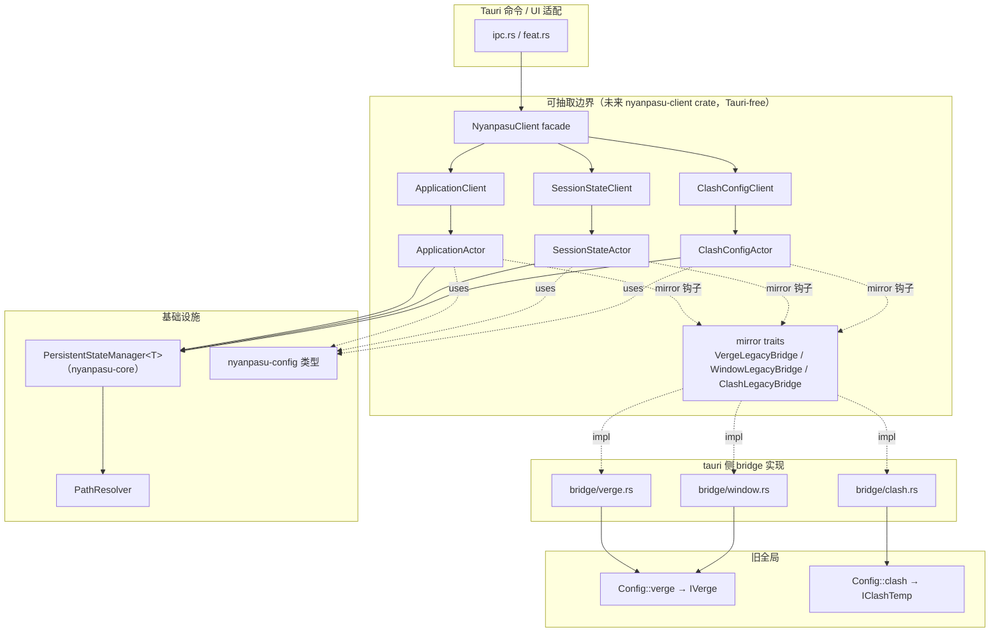
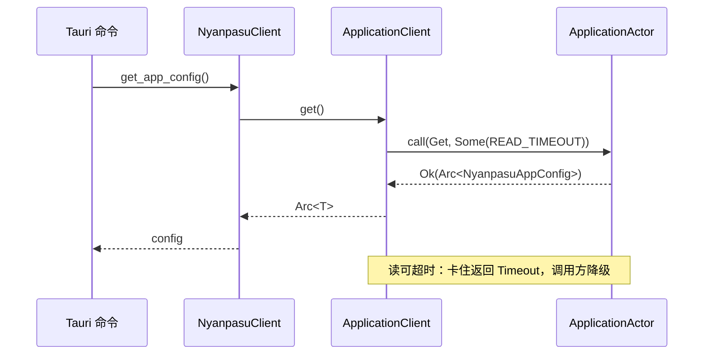
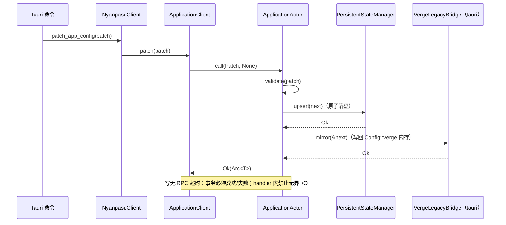
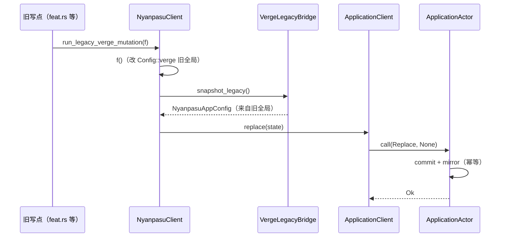

# 三 StateActor 迁移到 nyanpasu-config 设计文档

- **日期**: 2026-06-27
- **状态**: 已批准设计，待写实施计划
- **作者**: Jonson Petard（brainstorming with Claude）
- **关联**: 紧随 `migration 子系统 V2 + PathResolver`（PathResolver 已合并）

---

## 1. 摘要

将现有基于旧 `IVerge` 全局单例的单一 `StateActor`，迁移为持有 `nyanpasu-config` crate 三个配置域类型的**三个独立对等 ractor Actor**：

| 域                           | nyanpasu-config 类型 | Actor               | Client               |
| ---------------------------- | -------------------- | ------------------- | -------------------- |
| Application                  | `NyanpasuAppConfig`  | `ApplicationActor`  | `ApplicationClient`  |
| Session（窗口/会话恢复状态） | `PersistentState`    | `SessionStateActor` | `SessionStateClient` |
| Clash                        | `ClashConfig`        | `ClashConfigActor`  | `ClashConfigClient`  |

本 spec 是**基础设施 + 迁移策略**：建三 Actor、接入 `NyanpasuClient`、定义读写超时策略、产出旧调用网络分析文档。147 处旧全局调用通过文档化的 `TODO(actor-migration)` 双向桥保持可用，实际切换分阶段后续 PR。

遵循仓库 `CLAUDE.md`：无新全局单例、显式 DI、Actor 拥有可变状态、Tauri 隔离在适配器后、facade 不退化为 service locator、可迁移的破坏性改动优先于隐藏兼容层。

---

## 2. 目标 / 非目标

### 目标

- 三个独立对等 Actor，各自拥有一个 nyanpasu-config 域类型，串行化命令。
- 三个 typed client，由 `NyanpasuClient` facade 持有并暴露稳定 async 方法。
- 读写分离的 RPC 超时策略（写无超时、读可超时）。
- 过渡期双向桥：Actor 为 source of truth，旧全局保持一致且可读。
- 一份独立的「旧 IVerge 全局调用网络」分析文档，含字段映射表（覆盖率 100%）。
- 必要图表：模块/组件图 + 读/写/reseed 三张时序图。
- 设计为「可抽取边界」，为未来 `nyanpasu-client` crate 解耦预留。

### 非目标（明确范围外，分阶段后续）

- 实际切换全部 147 处旧调用、删除 `Config::verge()/clash()/...` 旧全局。
- 真正创建 `nyanpasu-client` crate（本轮只做 Tauri-free 边界，不移动 crate）。
- `profiles`、`runtime` 两个域的 Actor 化（维持现状）。
- 重写 `PersistentStateManager`、`PathResolver`、migration 子系统本身。

---

## 3. 锁定的架构决策

| #   | 决策项         | 结论                                                                                             |
| --- | -------------- | ------------------------------------------------------------------------------------------------ |
| D1  | 范围           | 基础设施 + 迁移策略；旧全局桥接，切换分阶段后续                                                  |
| D2  | 拓扑           | 三个独立对等 Actor + 三个 typed client（无父监督 actor，无跨 actor 同步环）                      |
| D3  | 过渡共存       | 双向桥：commit 后镜像写回旧全局 + 热点旧写点 reseed；各 Actor 只镜像自己字段                     |
| D4  | 持久化 DI      | 复用泛型 `PersistentStateManager<T>`，路径改注入 `PathResolver`（不再 `dirs::`）                 |
| D5  | 窗口域命名     | `SessionStateActor` / `SessionStateClient`（不改 nyanpasu-config 的 `PersistentState` 类型）     |
| D6  | crate 边界     | 本 spec 只做可抽取边界（`state/`+`client/` Tauri-free）；旧全局桥接实现隔离在 tauri 侧 `bridge/` |
| D7  | 落盘归属       | Actor 独占文件写；被 reseed 包住的旧写点 `save_file()` 改 no-op 并标 TODO                        |
| D8  | 一次性数据迁移 | 交给 migration V2 + PathResolver（窗口字段搬迁、clash overrides 提取），必须在 spawn 前完成      |
| D9  | 跨域编排       | 在 `NyanpasuClient` facade 上层顺序编排，禁止 Actor 直接调用另一个 Actor                         |

---

## 4. 现状（迁移起点）

### 4.1 nyanpasu-config（纯类型 crate）

- `NyanpasuAppConfig` — `nyanpasu-config/src/application/mod.rs:67`，38 字段，`#[derive(Patch)]` → `NyanpasuAppConfigPatch`。
- `PersistentState` — `nyanpasu-config/src/state/mod.rs:14`，含 `window_state: BTreeMap<WindowLabel, WindowState>`，→ `PersistentStatePatch`。
- `ClashConfig` — `nyanpasu-config/src/clash/config/mod.rs:27`，overrides + 端口策略，→ `ClashConfigPatch`。
- 三者均 `serde_yaml_ng` + `specta::Type` + `struct-patch`（`skip_serializing_none` / `double_option`）。**尚未接入 PathResolver**。

### 4.2 现有 Actor（仅一个真正管配置）

- `StateActor` — `backend/tauri/src/state/verge.rs:46`，拥有旧 `IVerge`（全 Optional 包装类型，`backend/tauri/src/config/nyanpasu/mod.rs:193`）。
- `StateActorState { manager: PersistentStateManager<IVerge>, mirror: VergeMirror }`，消息 `GetVerge/PatchVerge/ReplaceVerge`（均 `RpcReplyPort`）。
- `StateClient` — `backend/tauri/src/client/state.rs`，**读写统一 5s 超时**（`STATE_RPC_TIMEOUT`，line 16）。
- `VergeMirror` 钩子：commit 后写回 `Config::verge()` 旧全局（现有双向桥雏形，将扩到三域）。
- Clash / 窗口状态目前**无 Actor**：`Config::clash()` 是裸 `IClashTemp(Mapping)`；窗口几何内嵌在 `IVerge.window_size_state`。

### 4.3 facade 与 composition root

- `NyanpasuClient` — `backend/tauri/src/client/mod.rs:19`，当前仅持有 `StateClient` + ui sink。
- composition root：`backend/tauri/src/setup.rs` → `client::setup()`；`PathResolver`（`backend/tauri/src/utils/path.rs:39`）目前**仅 migration 子系统使用**，未提升到 composition root。

### 4.4 旧 IVerge 全局调用网络（分析文档原材料，已测绘）

147 处 / 27 文件：`Config::verge()` 84（57%）· `Config::clash()` 30（20%）· `Config::profiles()` 23（16%）· `Config::runtime()` 10（7%）。
热点模块：`feat.rs`、`ipc.rs`、`core/clash/core.rs`、`utils/resolve.rs`、`core/sysopt.rs`、`core/tray/`。约 28% 为写操作（`draft→patch→apply` 链）。

---

## 5. 目标模块结构

```text
backend/tauri/src/
├── state/                         # [可抽取边界 → 未来 nyanpasu-client crate；Tauri-free]
│   ├── application.rs             # ApplicationActor   (owns NyanpasuAppConfig)
│   ├── session_state.rs           # SessionStateActor  (owns PersistentState)
│   ├── clash_config.rs            # ClashConfigActor   (owns ClashConfig)
│   └── mirror.rs                  # Tauri-free trait 定义：*LegacyBridge（正反两向钩子）
├── client/                        # [可抽取边界；Tauri-free]
│   ├── application.rs             # ApplicationClient
│   ├── session_state.rs           # SessionStateClient
│   ├── clash_config.rs            # ClashConfigClient
│   └── mod.rs                     # NyanpasuClient（facade，持三 client + 注入三 bridge）
└── bridge/                        # [留在 tauri] 触碰 IVerge/IClashTemp/Config 的具体桥接实现
    ├── verge.rs                   # NyanpasuAppConfig ⇄ IVerge（应用字段）
    ├── window.rs                  # PersistentState   ⇄ IVerge.window_size_state
    └── clash.rs                   # ClashConfig       ⇄ IClashTemp（overrides 子集）
```

**边界规则**：`state/` 与 `client/` 只依赖 `nyanpasu-config` + `nyanpasu-core` + `ractor`，**禁止 import `tauri::*` 或 `crate::config::Config`**；一切旧全局耦合走注入的 `*LegacyBridge` trait，具体实现在 `bridge/`。未来抽 crate = 机械搬移 `state/`+`client/`。

---

## 6. 三个 Actor（同构）

每个 Actor 沿用现有 `Get/Patch/Replace` 三元组。以 Application 为例（其余同构，替换类型）：

```rust
// state/application.rs —— Tauri-free
enum ApplicationMessage {
    Get(RpcReplyPort<Result<Arc<NyanpasuAppConfig>>>),                 // 读
    Patch  { patch: NyanpasuAppConfigPatch,                            // 写（struct-patch）
             reply: RpcReplyPort<Result<Arc<NyanpasuAppConfig>>> },
    Replace{ state: NyanpasuAppConfig,                                 // 可信全量替换（reseed 用）
             reply: RpcReplyPort<Result<Arc<NyanpasuAppConfig>>> },
}

struct ApplicationState {
    manager: PersistentStateManager<NyanpasuAppConfig>,   // D4：路径来自注入的 PathResolver
    bridge:  Arc<dyn VergeLegacyBridge>,                  // D3：commit 后镜像钩子
}

struct ApplicationArgs {        // DI 边界：spawn 时注入全部依赖
    paths:   PathResolver,
    bridge:  Arc<dyn VergeLegacyBridge>,
    initial: NyanpasuAppConfig,
}
```

- **快照**返回 `Arc<T>`：读廉价、无锁共享。
- **State 持有可变状态于 actor 内部**，不经 `Arc<Mutex<_>>` 外泄（CLAUDE.md §8）。
- `SessionStateActor` 同构持有 `PersistentStateManager<PersistentState>` + `WindowLegacyBridge`；`ClashConfigActor` 持有 `PersistentStateManager<ClashConfig>` + `ClashLegacyBridge`。

---

## 7. RPC 超时策略（读写分离）

| 操作                   | RPC 调用                                  | 超时                        | 理由                   |
| ---------------------- | ----------------------------------------- | --------------------------- | ---------------------- |
| 读 `Get`               | `actor_ref.call(Get, Some(READ_TIMEOUT))` | **有**（每域常量，默认 5s） | 读卡住可降级/报错      |
| 写 `Patch` / `Replace` | `actor_ref.call(Patch, None)`             | **无**                      | 底层事务必须成功或失败 |

**写无超时的配套不变式（强制）**：写消息 handler 内**禁止无界外部 I/O**。落盘由 `PersistentStateManager` 原子写有界完成；镜像写回是内存操作；该路径**无网络**。若未来写路径引入可能挂起的操作（如网络请求），**超时责任在 handler/listener 内部自管**，绝不上抛到 RPC 层 —— 即「写若耗时过长，是 listener 没做 timeout 处理」，而非靠 RPC 超时兜底。

---

## 8. 双向桥（过渡期共存）

### 8.1 Mirror trait（Tauri-free 定义，tauri 侧实现）

```rust
// state/mirror.rs —— Actor 只依赖此 trait，绝不 import IVerge
pub trait VergeLegacyBridge: Send + Sync + 'static {
    fn mirror(&self, snap: &NyanpasuAppConfig) -> anyhow::Result<()>;  // 正向：写回 Config::verge() 内存
    fn snapshot_legacy(&self) -> anyhow::Result<NyanpasuAppConfig>;     // 反向：旧全局 → 新类型（reseed）
}
// 同理 WindowLegacyBridge（PersistentState ⇄ IVerge.window_size_state）
//      ClashLegacyBridge （ClashConfig   ⇄ IClashTemp overrides 子集）
```

`bridge/` 中实现（标 `TODO(actor-migration)`），各 Actor **只镜像自己字段**：App 写 verge 应用字段、Session 只写 `window_size_state`、Clash 只写 overrides 键 → 解决「App 与 Session 同写 `Config::verge()`」的字段归属。

### 8.2 两条数据流

- **正向镜像**：`Patch/Replace` → `PersistentStateManager` 原子落盘 → `bridge.mirror(&snap)` 写回旧全局内存副本，供未迁移的旧读者。
- **反向 reseed**（处理 ~28% 旧直写）：facade `run_legacy_verge_mutation(f)` → 跑旧闭包改旧全局 → `bridge.snapshot_legacy()` 转新类型 → `client.replace(state)` 覆盖 Actor → Actor 落盘 + 幂等再镜像。被包住的旧写点不再自己 `save_file()`（D7）；未包的零散写点暂忍并标 TODO。

---

## 9. 一次性落盘数据迁移（交给 migration V2）

genuinely-new 的跨文件搬迁，归 migration 子系统 V2 + PathResolver（非 Actor 懒加载）：

- `window_size_state` 从 `verge.yaml` **搬到** SessionState 文件；并确保 `NyanpasuAppConfig` 反序列化忽略/剥离该旧键。
- Clash overrides 从裸 `IClashTemp` Mapping **提取**成 typed `ClashConfig` 文件。

**顺序约束**：migration V2 在三个 Actor spawn **之前**跑完。Actor 初始加载只读自己的 typed 文件（缺失则默认或一次性从旧全局导入）。

---

## 10. NyanpasuClient facade + composition root

### 10.1 facade API（稳定 async 方法，示例）

```rust
client.get_app_config().await?;        client.patch_app_config(patch).await?;
client.get_clash_config().await?;      client.patch_clash_config(patch).await?;
client.get_session_state().await?;     client.patch_session_state(patch).await?;
client.run_legacy_verge_mutation(f).await?;   // 过渡期 reseed 入口
```

- 跨域操作在 facade 上层**顺序编排**两次 client 调用（D9，无跨 actor 同步环）。
- 仍是 facade 不是 service locator：**无** `resolve::<T>()` / `get_actor_ref` / `actor_registry`。

### 10.2 composition root 新流程（`client::setup` / `setup.rs`）

```text
1. 构造 PathResolver（从 migration 子系统提升到 composition root，单实例共享）  → verify: 单实例
2. 运行 migration V2 一次性落盘迁移（窗口搬迁 / clash 提取）                  → verify: 在 spawn 之前
3. spawn 三个 Actor（Args{ PathResolver 派生路径, bridge.mirror 钩子, 初始值 }）
4. 构造三个 client（各持 ActorRef）
5. 构造 NyanpasuClient（持三 client + 注入三 bridge 对象）
6. app.manage(NyanpasuClient)
```

---

## 11. 字段映射要求（防静默丢失）

`IVerge`（~40 字段）与 `NyanpasuAppConfig`（38）并非全等，存在 IVerge-only 字段。Actor 独占文件写后，未映射字段会被**静默丢弃**。

**强制**：分析文档须含一张字段映射表，每个 `IVerge` 字段 →〔App | Session | Clash | 显式丢弃〕，**覆盖率 100%**，并据此驱动 `bridge/` 双向转换与 migration 搬迁。该映射有对应的覆盖率单测。

---

## 12. 图表

### 12.1 模块 / 组件图



### 12.2 读时序（有超时）



### 12.3 写时序（无超时）



### 12.4 旧写 reseed 时序



---

## 13. 交付物与实施顺序

1. **`docs/architecture/legacy-iverge-call-network.md`（实施第 1 任务，先分析后实现）**：147 处调用清单（按 accessor/域/热点分组）+ IVerge 字段映射表（→App|Session|Clash|丢弃，覆盖率 100%）+ 分阶段切换批次建议。
2. `nyanpasu-config` 接入 PathResolver（如需）。
3. migration V2 增量：窗口搬迁 + clash overrides 提取。
4. `state/mirror.rs` trait + `bridge/` 三实现（双向 + reseed）。
5. 三 Actor（`application.rs` / `session_state.rs` / `clash_config.rs`）。
6. 三 client + `NyanpasuClient` facade 新方法。
7. composition root 改造（PathResolver 提升 + 顺序约束 + spawn 三 Actor）。
8. 替换旧 `StateActor`/`StateClient`，热点旧写点用 `run_legacy_*_mutation` 包住。
9. 测试 + 文档。

---

## 14. 测试策略

- **每 Actor**：mock `*LegacyBridge` + temp-dir `PersistentStateManager` spawn；断言 `Get/Patch/Replace`；断言写路径 `call(_, None)` 能完成；断言读路径在 actor 卡住时 `Some(timeout)` 返回错误（测试钩子，**不 sleep**）。
- **纯转换**：`bridge/` 双向 round-trip（`IVerge ⇄ NyanpasuAppConfig` 等）+ 字段映射覆盖率测试。
- **同步**：用 `RpcReplyPort` ack，不用 sleep（CLAUDE.md §13）。
- **mockable trait**：`*LegacyBridge` 兼容 `mockall::automock`。

---

## 15. 成功判据（可验证）

1. 三 Actor 经 composition root 编译 + spawn；`NyanpasuClient` 暴露 typed 方法，无 service-locator API。
2. 写 = `call(_, None)`、读 = `call(_, Some(_))` —— 有断言覆盖。
3. Actor commit 后旧全局仍可读且一致（bridge 测试通过）。
4. 字段映射表覆盖 100% IVerge 字段，无静默丢弃（覆盖率单测）。
5. 旧 IVerge 调用网络分析文档产出。
6. `cargo build` + `cargo test` 绿；现有行为冒烟保持。
7. `state/`+`client/` 不含 `tauri::*` / `crate::config::Config` import（可抽取边界成立）。

---

## 16. 风险与缓解

| 风险                                         | 缓解                                                          |
| -------------------------------------------- | ------------------------------------------------------------- |
| IVerge-only 字段静默丢失                     | 字段映射表 100% 覆盖 + 覆盖率单测（§11）                      |
| verge.yaml 双写（Actor vs 旧 `save_file()`） | D7：Actor 独占文件写；桥接点旧 save no-op                     |
| 未包的旧直写导致 Actor 快照变脏              | 热点写点 reseed；其余标 TODO 并在分析文档列入切换批次         |
| migration 与 spawn 顺序错乱                  | composition root 顺序约束（§10.2）+ 测试                      |
| 写无超时下 handler 真挂起                    | 不变式：写 handler 禁止无界 I/O；引入时内部自管 timeout（§7） |
| `nyanpasu-client` 边界被意外破坏             | 成功判据 #7：import 静态检查                                  |

---

## 17. 假设

- `profiles` / `runtime` 维持现状，不在本轮三 Actor 内。
- `NyanpasuAppConfig` 能与现有 `verge.yaml` 字段往返（除 `window_size_state` 外迁），由字段映射表逐项确认。
- migration V2 + PathResolver 接口稳定，足以承载本轮一次性落盘搬迁。
- 读超时默认 5s（沿用现 `STATE_RPC_TIMEOUT`），每域常量可独立调整。
