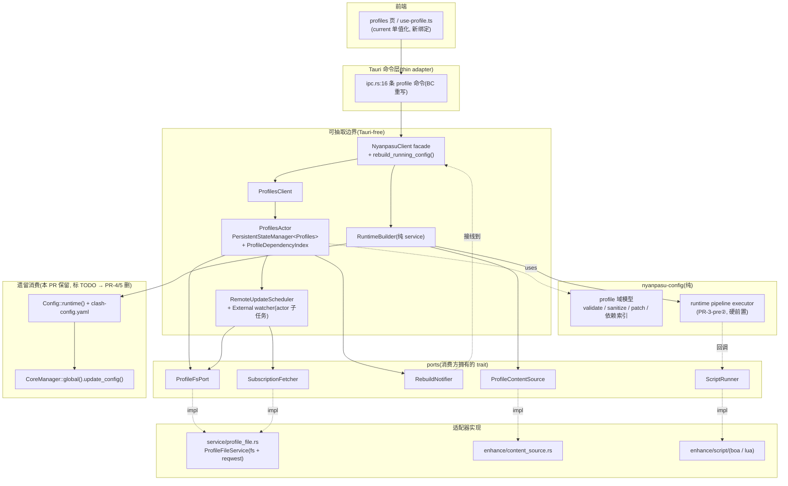
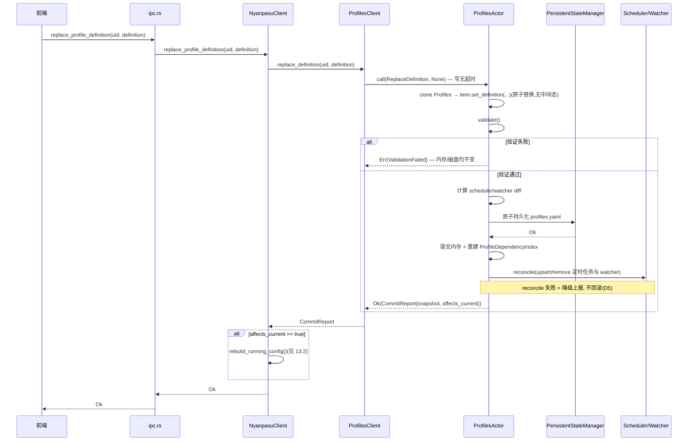
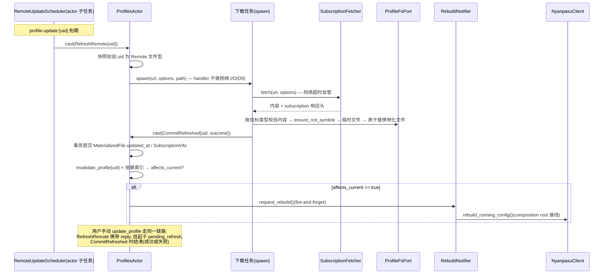
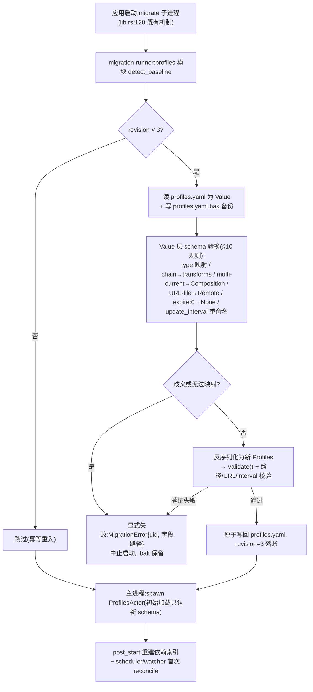
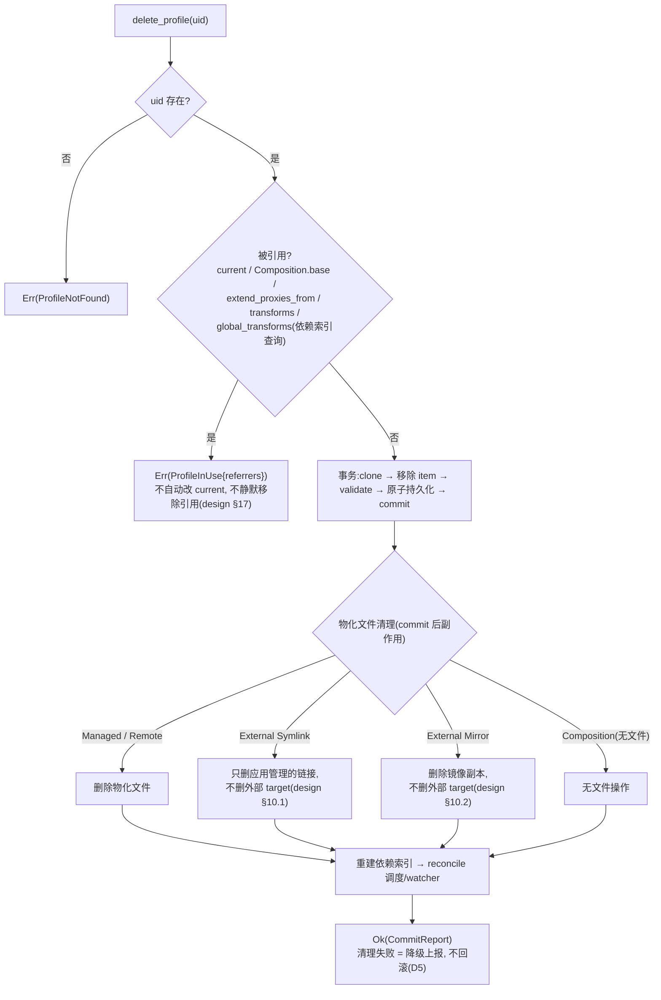

# PR-3(R-3) — profiles 域切换(tauri, BC)设计文档

- **日期**: 2026-07-04
- **状态**: 设计草案(待批准)
- **作者**: Jonson Petard(design with Claude)
- **基准**: 分支 `refactor/runtime-snapshot-store-v2` @ `d0b3cf6ac`(= main `b5b168627` + snapshot store v2)
- **路线图定位**: `docs/design/actor-migration-roadmap.md` §4.5(PR-3)
- **关联文档**:
  - `docs/design/profile-composition-clean-design.md` — profiles 域模型(已实施,#4840;下文以「design §N」引用)
  - `docs/design/profile-patch-interface.md` — 分层 patch 接口 + 事务流程(已实施)
  - `docs/design/profile-tauri-migration-guide.md` — 逐命令迁移指南(下文以「guide §N」引用)
  - `docs/design/profile-snapshot-store-migration.md` — snapshot store v2(PR-3-pre①)
  - `docs/superpowers/specs/2026-06-27-three-stateactors-nyanpasu-config-design.md` — PR-2b 蓝图(超时策略/边界规则沿用)

---

## 1. 摘要

将 tauri 的 profiles 域**一次性 BC 切换**到 `nyanpasu-config` 新域模型,不留新旧双轨:

1. **数据迁移**: migration V2 `profiles` 模块新增 revision 3,legacy `profiles.yaml` → clean schema(Value 层,强制 `.bak` 备份,歧义显式失败);
2. **状态归属**: 新建 `ProfilesActor` + `ProfilesClient`,拥有 `PersistentStateManager<Profiles>`,全部 mutation 走「clone→mutate→validate→原子持久化→commit→重建依赖索引→reconcile」事务;
3. **文件与订阅**: `ProfileFileService`(ports + 适配器)承接物化文件读写删与订阅下载;`RemoteUpdateScheduler` + External Symlink/Mirror watcher 作为 actor 子任务,取代 `ProfilesJobGuard`;
4. **IPC 全量 BC 重写**: 13 条 profile 命令 → 16 条新命令(`patch_profiles_config` 拆 2、`patch_profile` 拆 3),specta/TS 绑定与前端 UI 同 PR 适配;
5. **runtime 生成切换**: `enhance()` 替换为 `RuntimeBuilder`(纯 service)+ runtime pipeline executor(PR-3-pre② 产物);产物本 PR 仍写 `Config::runtime()`(全删留给 PR-4,控制半径);
6. **清算**: 删除 `backend/tauri/src/config/profile/**` 全目录、`Config::profiles()` accessor、`ProfilesBuilder`/`ProfileBuilder`、`ProfilesJobGuard`。

遵循 roadmap §1 三条铁律:运行期共存只在桥层(本 PR 仅新增台账 B8 一处)、数据兼容只走 migration V2、前端 BC 与后端同 PR 落地。

---

## 2. 目标 / 非目标

### 目标

- profiles 域状态由 `ProfilesActor` 独占拥有,`profiles.yaml` 由其独占写。
- 全部 13 条 profile IPC 命令迁移为 thin adapter,经 `NyanpasuClient` typed 方法调用。
- 引用保护删除(design §17)、分层 patch(design §15)、单值 `current` + `CompositionConfig`(design §14.3)语义全部落地。
- 订阅定时刷新与外部文件监听纳入 actor 事务后 reconcile(design §9/§10),消灭 `ProfilesJobGuard`。
- `enhance()` 消费 legacy `Profiles` 的路径彻底移除;运行配置由 executor 从新域快照派生。
- 前端 profiles 页在新 TS 绑定下全功能可用(`current` 单值化,多选交互改为最小 Composition 创建)。
- 编译期保证 legacy profiles 类型零残留。

### 非目标(明确范围外)

- 删除 `Config::runtime()` / `IRuntime` / `generate_file()`(→ PR-4)。
- `CoreManager` actor 化(→ PR-5);本 PR 经 `Config::runtime()` + `CoreManager::global().update_config()` 消费产物,标 TODO。
- verge/clash/session 三域切换(→ PR-2b 及其后续批次)。
- 前端 Composition 完整管理界面(本 PR 只做「多选创建 Composition」最小交互,完整界面后续迭代)。
- runtime pipeline executor 本体(→ PR-3-pre②,本 PR 的硬前置,见 §3 D7 与 §17 假设)。
- snapshot 持久化归档启用(`snapshot-persistence` feature 维持默认关闭)。

---

## 3. 锁定的架构决策

| #   | 决策项          | 结论                                                                                                                                                                                                                |
| --- | --------------- | ------------------------------------------------------------------------------------------------------------------------------------------------------------------------------------------------------------------- |
| D1  | 切换策略        | **一次性 BC 切换,不留双轨**:前端 TS/UI 同 PR 适配;不留 `*_v1` 命令别名(确实阻塞时按铁律 3 标 `TODO(actor-migration)` 并给删除条件——推翻 guide §7.2 的「先留别名」建议)                                              |
| D2  | 拓扑            | `ProfilesActor` 独立对等 actor(不并入三 StateActor,修正 C1);禁止跨 actor 同步环;跨域编排在 `NyanpasuClient` facade 上层顺序进行(沿用 PR-2b D9)                                                                      |
| D3  | 数据兼容        | 只走 migration V2 `profiles` revision 3(Value 层),在 migrate 子进程内、actor spawn **之前**完成;强制写 `profiles.yaml.bak`;任何歧义显式失败(带 uid + 字段路径),不静默丢弃                                           |
| D4  | 持久化          | `PersistentStateManager<Profiles>`(nyanpasu-core);索引文件路径 = `PathResolver::profiles_path()`,物化文件目录 = `PathResolver::app_profiles_dir()`;不使用 `dirs::`                                                  |
| D5  | 事务模型        | patch-interface §6 七步事务:clone→mutate→`validate()`→计算 scheduler/watcher diff→原子持久化→commit 内存→重建 `ProfileDependencyIndex` + reconcile;**commit 后副作用失败 = 降级结果,不回滚已持久化状态**            |
| D6  | 删除策略        | 引用保护(design §17):被 `current`/`base`/`extend_proxies_from`/`transforms`/`global_transforms` 引用者拒删,返回 `ProfileInUse{引用者}`;不再有旧「删 current 后自动激活第一个」行为                                  |
| D7  | runtime 生成    | `enhance()` → `RuntimeBuilder`(纯 service,组装 executor 输入)+ pipeline executor(PR-3-pre② 产物,**硬前置**,修正 C5);产物 `RuntimeArtifact` 本 PR 仍写入 `Config::runtime()` draft 并落 `clash-config.yaml`          |
| D8  | 订阅调度归属    | `RemoteUpdateScheduler` + External watcher 首选实现为 **ProfilesActor 子任务**(spawn 于 actor `post_start`,随 actor 生命周期);若实施中复杂度失控可升级为独立 actor(开放点 O1),两种形态对外协议不变                  |
| D9  | RPC 超时        | 沿用 PR-2b §7 读写分离:读 `call(Get, Some(PROFILES_READ_TIMEOUT))`(域内常量,默认 5s)、写 `call(_, None)`;**写 handler 禁无界 I/O**——订阅下载绝不在写 handler 内进行,由子任务下载完成后经内部消息提交(见 §8/图 13.4) |
| D10 | Tauri-free 边界 | `state/profiles.rs` + `client/profiles.rs` 禁止 import `tauri::*` / `crate::config::Config`;文件系统、HTTP、脚本运行走消费方拥有的窄 ports(§7);`view_profile` 的「打开文件」UI 行为留在 IPC 层                      |
| D11 | specta 导出     | 嵌套 tagged enum(`ProfileDefinition`/`ConfigDefinition`/`TransformDefinition`/`ProfileSource`)**逐 variant 单独命名导出**,规避 specta 2.x 递归内联限制;CI 检查 TS 产物 diff                                         |
| D12 | PR-2b 时序      | 非硬依赖:`RuntimeBuilder` 的 `ClashGuardOverrides`/tun 等取数点,PR-2b 已合则走 `ClashConfigClient`/`ApplicationClient`,否则暂读旧全局并标 `TODO(actor-migration)`(台账 B8,PR-2b 合并后即删)                         |
| D13 | uid 生成        | `ProfileId` 由服务端(actor 事务内)生成,碰撞安全;前端不再自造 uid                                                                                                                                                    |

---

## 4. 现状(迁移起点,实测锚点)

### 4.1 legacy profiles 面

- **类型**: `backend/tauri/src/config/profile/`(`profiles.rs:21` legacy `Profiles`,`ProfilesBuilder` 由 `derive_builder` 生成;`item/` 四变体、`builder.rs`、`item_type.rs`)。
- **全局访问**: `Config::profiles()`(`config/core.rs:42`),全仓 23 处 / 5 文件。
- **IPC 13 条**(`ipc.rs`): `get_profiles:102`、`enhance_profiles:128`、`import_profile:136`、`create_profile:175`、`reorder_profile:242`、`reorder_profiles_by_list:250`、`update_profile:258`、`delete_profile:265`、`patch_profiles_config:288`、`patch_profile:299`、`view_profile:345`、`read_profile_file:365`、`save_profile_file:382`。
- **facade 现状**: `NyanpasuClient::patch_profiles_config`(`client/mod.rs:80`)为 ACL 模式——内部仍委托 `Config::profiles()` draft + `CoreManager::global().update_config()`。
- **运行配置生成**: `enhance()`(`enhance/mod.rs:22`)直读 `Config::clash():24` / `Config::verge():27` / `Config::profiles():39`;builtin 脚本门控 `enhance/chain.rs:145`;`ChainTypeWrapper::try_from` `chain.rs:62`;产物经 `Config::generate()`(`config/core.rs:88`)写 runtime draft,`generate_file`(`:70`)落 `clash-config.yaml`。
- **定时订阅**: `ProfilesJob`/`ProfilesJobGuard`(`core/tasks/jobs/profiles.rs:49,55`),cron diff 式 `refresh()`(`:118`)。
- **手动时间戳**: `feat::update_profile`(`feat.rs:441` 附近)对 Local/Merge/Script 手工 patch `updated`。

### 4.2 新域模型(已合并,#4840)

`backend/nyanpasu-config/src/profile/` 全套齐备:`profiles.rs:12`(`Profiles`,`validate():128`、`sanitize_top_level():86`)、`definition.rs`、`source.rs`(`RemoteProfileOptions:106` + Patch)、`metadata.rs:6`(+ Patch)、`patch.rs`(分层 mutator + list-ops)、`dependency.rs:10`(`ProfileDependencyIndex`)、`path.rs`(`ManagedProfilePath`)、`id.rs`(`ProfileId`)。测试 7 组(round_trip/validation/sanitize/mutators/两 patch/dependency)。

### 4.3 runtime 模块(数据半已合,执行半待 PR-3-pre②)

- snapshot store v2(当前分支): `ConfigSnapshotsBuilder`(`runtime/snapshot.rs:354`)、`invalidate_profile`(`runtime/invalidation.rs:38`)、`SnapshotRebuild::FullCurrent`(`:21`)。
- **executor 尚不存在**——五种处理顺序(design §7.1–7.5)、三个 BuiltinStep 真实逻辑、`ProfileContentSource`/`ScriptRunner` ports、`RuntimeArtifact` 输出均为 PR-3-pre② 交付物,是本 PR 的硬前置。

### 4.4 migration V2(已合并,#4824)

- `core/migration/registry.rs:4` 注册 `profiles`/`app_config`/`storage` 三模块;`MigrationStep` trait(`mod.rs:83`,含 `revision`/`run`/`rollback`)。
- `modules/profiles.rs` 已有 revision 1(`profiles/null_value`,`:47`)、revision 2(`profiles/script_newtype`,`:114`)——**本 PR 新增 revision 3**。
- 端到端 fixture 测试样板: `runner.rs:367`(1.6.1→2.0)。

### 4.5 前端消费点(代表锚点)

- 生成绑定: `frontend/interface/src/ipc/bindings.ts:118`(`patch_profiles_config`)。
- hook: `frontend/interface/src/ipc/use-profile.ts:167`。
- `current` 多值消费: `frontend/nyanpasu/src/pages/(main)/main/profiles/$type/detail/_modules/active-button.tsx:21`(`data?.current?.find(...)`)。

---

## 5. 目标模块结构

```text
backend/tauri/src/
├── state/
│   ├── profiles.rs               # ProfilesActor(owns PersistentStateManager<Profiles>
│   │                             #   + ProfileDependencyIndex + scheduler/watcher 子任务句柄)
│   │                             # 消费方拥有的 ports: ProfileFsPort / SubscriptionFetcher / RebuildNotifier
│   └── ...                       # (PR-2b 三 actor,与本 PR 无文件重叠)
├── client/
│   ├── profiles.rs               # ProfilesClient(typed,读 Some(5s) / 写 None)
│   └── mod.rs                    # NyanpasuClient 新增 profiles 域方法 + rebuild_running_config()
├── service/
│   └── profile_file.rs           # ProfileFileService:ProfileFsPort + SubscriptionFetcher 具体实现
│                                 # (fs 原子写 / 符号链接检查 / YAML 规范化 / reqwest 下载)
├── enhance/                      # 重写为 RuntimeBuilder 适配层:
│   ├── mod.rs                    #   RuntimeBuilder(纯 service,组装 executor 输入,调 executor)
│   ├── content_source.rs         #   ProfileContentSource 适配器(读物化文件,PathResolver 派生)
│   └── script/                   #   ScriptRunner 适配器(收编现有 boa/lua runner)
└── core/migration/modules/
    └── profiles.rs               # + revision 3: legacy schema → clean schema

删除:
├── config/profile/**             # legacy 四变体 + builder + item_type + profiles
├── core/tasks/jobs/profiles.rs   # ProfilesJobGuard(职责移交 RemoteUpdateScheduler)
└── Config::profiles() accessor / ManagedState<Profiles> / client/mod.rs:80 旧 patch_profiles_config
```

**边界规则**(沿用 PR-2b §5): `state/profiles.rs` + `client/profiles.rs` 只依赖 `nyanpasu-config` + `nyanpasu-core` + `ractor` + ports;`ProfileFileService` 与 `enhance/` 适配器允许 fs/网络,但同样不依赖 `tauri::*`;`view_profile` 打开文件的 `AppHandle` 用法留在 `ipc.rs`。

---

## 6. ProfilesActor 设计

### 6.1 消息协议

```rust
// state/profiles.rs —— Tauri-free
pub enum ProfilesMessage {
    // ── 读(call(_, Some(PROFILES_READ_TIMEOUT))) ──
    Get(RpcReplyPort<Result<Arc<Profiles>, ProfilesError>>),

    // ── 写(call(_, None);全部走 §6.3 事务) ──
    Add        { item: NewProfileRequest, initial_file: Option<String>,
                 reply: RpcReplyPort<Result<CommitReport, ProfilesError>> },
    Delete     { uid: ProfileId, reply: RpcReplyPort<Result<CommitReport, ProfilesError>> },
    Reorder    { op: ReorderOp,  reply: RpcReplyPort<Result<CommitReport, ProfilesError>> },
    PatchMetadata      { uid: ProfileId, patch: ProfileMetadataPatch,      reply: ... },
    PatchRemoteOptions { uid: ProfileId, patch: RemoteProfileOptionsPatch, reply: ... },
    ReplaceDefinition  { uid: ProfileId, definition: ProfileDefinition,    reply: ... },
    SetCurrent         { current: Option<ProfileId>,                       reply: ... },
    SetGlobalTransforms{ ids: Vec<ProfileId>,                              reply: ... },
    Replace            { profiles: Profiles,                               reply: ... }, // 可信全量替换

    // ── 长任务触发(reply 挂起,下载在子任务内完成后经内部消息回填) ──
    RefreshRemote { uid: ProfileId, patch: Option<RemoteProfileOptionsPatch>,
                    reply: RpcReplyPort<Result<CommitReport, ProfilesError>> },

    // ── 内部消息(不出现在 client API) ──
    CommitRefreshed     { uid: ProfileId, outcome: RefreshOutcome },
    ExternalFileChanged { uid: ProfileId },
}

pub enum ReorderOp { Move { active: ProfileId, over: ProfileId }, ByList(Vec<ProfileId>) }

pub struct CommitReport {
    pub snapshot: Arc<Profiles>,
    pub affects_current: bool,     // 依赖索引判定:current 传递闭包是否被本次提交触及
}
```

### 6.2 State 与 Args(DI 边界)

```rust
pub struct ProfilesActorState {
    manager:  PersistentStateManager<Profiles>,   // D4:路径来自注入的 PathResolver
    index:    ProfileDependencyIndex,             // 派生数据,每次 commit 后全量重建(design §16)
    fs:       Arc<dyn ProfileFsPort>,             // 物化文件读/写/删/原子替换/链接检查
    fetcher:  Arc<dyn SubscriptionFetcher>,       // 订阅下载(网络超时自管)
    notifier: Arc<dyn RebuildNotifier>,           // 后台提交(定时/watcher)触发的重建通知
    scheduler: RemoteUpdateScheduler,             // 子任务:定时表 + watcher 句柄(D8)
    pending_refresh: HashMap<ProfileId, RpcReplyPort<...>>, // RefreshRemote 挂起的 reply
}

pub struct ProfilesActorArgs {
    pub paths:    PathResolver,
    pub fs:       Arc<dyn ProfileFsPort>,
    pub fetcher:  Arc<dyn SubscriptionFetcher>,
    pub notifier: Arc<dyn RebuildNotifier>,
    pub initial:  Profiles,        // migrate 子进程完成 revision 3 后加载
}
```

- 快照返回 `Arc<Profiles>`,读廉价无锁。
- `post_start`: 全量重建依赖索引 → scheduler 首次 reconcile(为每个 Remote 文件型 Profile upsert `profile-update:{uid}`,为每个 External binding 建 watcher)。
- **单一写者**: `profiles.yaml` 与全部托管物化文件的写入只发生在 actor 消息处理内或其派生子任务(经内部消息串行提交),天然取代旧 `Arc<RwLock<ProfilesJob>>`。

### 6.3 写事务(每条写消息同构)

```text
clone 当前 Profiles
→ 应用修改(patch.rs 分层 mutator:apply_metadata_patch / set_definition / set_current / list-ops …)
→ validate()(design §13.2;失败 → Err(ValidationFailed),内存/磁盘均不变)
→ 计算 scheduler/watcher diff(Remote 集合、External 集合前后对比)
→ manager 原子持久化 profiles.yaml
→ 提交内存快照
→ 重建 ProfileDependencyIndex
→ reconcile(upsert/remove 定时任务、建/拆 watcher;文件副作用:Add 写初始文件、Delete 清物化文件)
→ 回 CommitReport{snapshot, affects_current}
```

commit 之后的 reconcile / 文件清理失败**不回滚**已持久化状态,以降级错误(或 `CommitReport` 内 warning 字段,实施时定)上报(D5)。

### 6.4 运行配置重建的触发路径(避免跨 actor 环)

- **IPC 驱动的写**: actor 只返回 `CommitReport.affects_current`;由 `NyanpasuClient` facade 在调用侧判断并顺序调用 `rebuild_running_config()`(PR-2b D9 的 facade 编排,actor 不反向调用 facade)。
- **后台驱动的提交**(定时刷新、External watcher): actor 在 commit 后经注入的 `RebuildNotifier`(fire-and-forget 窄 port,composition root 把它接到 facade 的重建入口)发出通知。actor 自身不知道 facade 存在。

---

## 7. Ports 与 ProfileFileService

消费方(`state/profiles.rs`)拥有 trait 定义,`service/profile_file.rs` 提供具体实现;全部兼容 `mockall::automock`:

```rust
#[cfg_attr(test, mockall::automock)]
pub trait ProfileFsPort: Send + Sync + 'static {
    fn read(&self, path: &ManagedProfilePath) -> anyhow::Result<String>;
    fn write_atomic(&self, path: &ManagedProfilePath, content: &str) -> anyhow::Result<()>;
    fn remove(&self, path: &ManagedProfilePath) -> anyhow::Result<()>;
    /// Remote 更新器写入前防御:目标不得是意外符号链接(design §9 末段)
    fn ensure_not_symlink(&self, path: &ManagedProfilePath) -> anyhow::Result<()>;
    fn ensure_symlink(&self, path: &ManagedProfilePath, target: &ExternalProfilePath) -> anyhow::Result<()>;
}

#[cfg_attr(test, mockall::automock)]
pub trait SubscriptionFetcher: Send + Sync + 'static {
    /// 网络超时在实现内部自管(D9);返回内容 + 从响应头解析的 SubscriptionInfo
    async fn fetch(&self, url: &Url, options: &RemoteProfileOptions)
        -> anyhow::Result<FetchedSubscription>;
}

#[cfg_attr(test, mockall::automock)]
pub trait RebuildNotifier: Send + Sync + 'static {
    fn request_rebuild(&self);   // fire-and-forget;去抖由接收侧负责
}
```

`RemoteUpdateScheduler`(actor 子任务,D8)职责:

- 维护 `profile-update:{uid}` 定时表(间隔 = `update_interval_minutes`),到期向 actor `cast(RefreshRemote 内部触发)`;
- 维护 External Symlink/Mirror watcher(design §10):Symlink 监听 target 真实路径、变化即失效;Mirror 监听 target、变化后临时文件 + 校验 + 原子替换镜像副本;
- reconcile 幂等:每次 commit 后按 diff 增删任务/监听(design §9,测试 design §18 第 22 条)。

下载-提交分离(D9 关键):`RefreshRemote` handler 不做网络 I/O——把 reply 存入 `pending_refresh`,spawn 下载任务;任务完成后 `cast(CommitRefreshed)`,actor 在该消息内走 §6.3 事务(更新 `MaterializedFile.updated_at` / `SubscriptionInfo`)并结清挂起的 reply。下载失败同样经 `CommitRefreshed` 回错,不留悬挂 reply。

---

## 8. RuntimeBuilder(enhance 替换)

`RuntimeBuilder` 是纯 service:自身无状态、无全局读,所有输入显式传参;executor(PR-3-pre②)在 `nyanpasu-config` 内保持无 IO。

```rust
pub struct RuntimeBuildInput {
    pub profiles: Arc<Profiles>,                       // ProfilesClient 快照
    pub guard_overrides: ClashGuardOverrides,          // D12:ClashConfigActor 或旧全局(TODO, B8)
    pub finalize_params: FinalizeParams,               // tun / clash_fields / valid 等(来源同上)
    pub builtins: Vec<BuiltinTransform>,               // chain.rs:145 按 ClashCore bitflags 组装后传入
}
// RuntimeBuilder::build(input, content_source, script_runner) -> Result<RuntimeArtifact>
```

- `ProfileContentSource` 适配器按 `ManagedProfilePath` 读物化文件(`enhance/content_source.rs`);`ScriptRunner` 适配器收编现 `enhance/script/{js,lua,runner}.rs` 的 boa/lua 运行器。
- executor 按 design §7.1–7.5 五种顺序执行,经 `ConfigSnapshotsBuilder` 记录快照图,输出 `RuntimeArtifact { final_config, graph, step_logs, applied_fields }`——覆盖旧 `IRuntime{config, exists_keys, postprocessing_output}` 的全部消费(含前端 `get_postprocessing_output`)。
- **本 PR 的产物落点(D7)**: `Config::generate()`(`config/core.rs:88`)改为调用 `RuntimeBuilder`,产物仍写 `Config::runtime()` draft 并 `generate_file()` 落 `clash-config.yaml`,随后 `CoreManager::global().update_config()`。这两处旧全局消费各标:

```rust
// TODO(actor-migration): temporary bridge to Config::runtime()/CoreManager.
// Reason: runtime derivation cleanup is PR-4, core lifecycle is PR-5.
// Remove when: PR-4 lands RuntimeArtifact in SimpleStateManager; PR-5 lands CoreActor.
```

---

## 9. IPC 全量 BC 切换(13 → 16 条)

全部命令改为 thin adapter:解析 DTO → 调 `NyanpasuClient` → 映射域错误。`uid: String` 在边界解析为 `ProfileId`。

| 旧命令(锚点)                       | 新命令                                                                                          | facade 方法                                                                     | BC 要点                                                                                                                                               |
| ---------------------------------- | ----------------------------------------------------------------------------------------------- | ------------------------------------------------------------------------------- | ----------------------------------------------------------------------------------------------------------------------------------------------------- |
| `get_profiles`(`ipc.rs:102`)       | `get_profiles`                                                                                  | `get_profiles()`                                                                | 返回新 `Profiles`;TS 类型全换(§11)                                                                                                                    |
| `enhance_profiles`(`:128`)         | `enhance_profiles`                                                                              | `rebuild_running_config()`                                                      | 不再直调 `CoreManager::global()`                                                                                                                      |
| `import_profile`(`:136`)           | `import_profile`                                                                                | `add_profile(...)` (+ 条件 `activate_profile`)                                  | `RemoteProfileOptionsBuilder` → `RemoteProfileOptionsPatch`;自动激活条件 `current == None`                                                            |
| `create_profile`(`:175`)           | `create_profile`                                                                                | `add_profile(NewProfileRequest, file_data)`                                     | `ProfileBuilder` 四变体废弃;自动激活条件 = `ProfileDefinition::Config(_)`(含 Composition);uid 服务端生成(D13)                                         |
| `reorder_profile`(`:242`)          | `reorder_profile`                                                                               | `reorder_profile(active, over)`                                                 | `ReorderOp::Move`                                                                                                                                     |
| `reorder_profiles_by_list`(`:250`) | `reorder_profiles_by_list`                                                                      | `reorder_profiles_by_list(Vec<ProfileId>)`                                      | `ReorderOp::ByList`                                                                                                                                   |
| `update_profile`(`:258`)           | `update_profile`                                                                                | `refresh_profile(uid, patch)`                                                   | Remote:下载→校验→原子替换,`updated_at`/`subscription` 由更新器写入;非 Remote 文件型返回错误(旧「手工 patch updated」取消);`feat::update_profile` 删除 |
| `delete_profile`(`:265`)           | `delete_profile`                                                                                | `delete_profile(uid)`                                                           | **引用保护**(D6);文件清理按 binding 类型(图 13.5)                                                                                                     |
| `patch_profiles_config`(`:288`)    | **拆** `activate_profile` + `set_global_transforms`                                             | `activate_profile(Option<ProfileId>)` / `set_global_transforms(Vec<ProfileId>)` | `ProfilesBuilder` 废弃;`current` 单值;global_transforms 只收 Transform,违规 → `ValidationFailed`                                                      |
| `patch_profile`(`:299`)            | **拆** `patch_profile_metadata` + `patch_remote_profile_options` + `replace_profile_definition` | 同名三方法                                                                      | 分层 patch(design §15):metadata/options 稀疏 patch(`double_option` 三态),variant 切换走 definition 原子替换;variant 不匹配不再静默忽略 → 错误         |
| `view_profile`(`:345`)             | `view_profile`                                                                                  | `get_profile_materialized_path(uid)`                                            | 返回绝对路径由 IPC 层 `help::open_file`;Composition → `ProfileHasNoFile`                                                                              |
| `read_profile_file`(`:365`)        | `read_profile_file`                                                                             | `read_profile_file(uid)`                                                        | 分支按 `definition`(Config::File 规范化 / Overlay 原文 / Script 原文);Composition → `ProfileHasNoFile`                                                |
| `save_profile_file`(`:382`)        | `save_profile_file`                                                                             | `save_profile_file(uid, data)`                                                  | 仅 Local/Managed 可写;Remote(更新器独占)/External(外部编辑器负责)/Composition 拒绝                                                                    |

**域错误集**(IPC 边界映射为命令错误): `ProfileNotFound`、`ProfileInUse { referrers }`、`ProfileHasNoFile`、`ValidationFailed(Vec<ProfileValidationError>)`、`NotARemoteProfile`、`FileNotWritable { reason }`、`RefreshFailed { source }`。

---

## 10. migration V2 — `profiles` revision 3

注册于 `core/migration/modules/profiles.rs`(现 revision 1/2 之后),Value 层操作,规则 = guide §6 / design §14:

| 规则          | 内容                                                                                                                                                                                                                          |
| ------------- | ----------------------------------------------------------------------------------------------------------------------------------------------------------------------------------------------------------------------------- |
| 类型映射      | `local→Config/File(Local/Managed)`、`remote→Config/File(Remote)`、`merge→Transform/Overlay`、`script→Transform/Script`                                                                                                        |
| 字段移动      | 顶层 `chain→global_transforms`;`local/remote.chain→File.transforms`;`script_type→Script.runtime`;`file+updated→MaterializedFile{file, updated_at}`;`remote.url/option/extra→ProfileSource::Remote{url, option, subscription}` |
| 兼容细节      | `extra.expire: 0 → None`;`update_interval → update_interval_minutes`;旧 `file` 为 HTTP(S) URL → 按旧 type 定新定义、URL 入 `source.url`、生成 `ManagedProfilePath`(design §14.2)                                              |
| multi-current | 缺失/`[]`→`None`;`[a]`→`Some(a)`;`[a,b,c]`→新建 `CompositionConfig{base:Some(a), extend:[b,c]}`(碰撞安全 uid,名 "Combined Profile"),`current` 指向之;顺序原样保留;成员无法映射为 FileConfig → **显式失败**                    |
| 安全          | 迁移前写 `profiles.yaml.bak`;任何歧义返回 `MigrationError{uid, field_path}` 中止(D3);幂等可重入(revision 账本判定)                                                                                                            |
| 收尾          | 反序列化为新 `Profiles` → `validate()` + 路径/URL/interval 校验 → 原子写回(design §14.4)                                                                                                                                      |

时序保证:migrate 子进程(`lib.rs:120` 既有机制)在主进程 spawn `ProfilesActor` 之前完成 revision 3;actor 初始加载只读新 schema,新类型永不解析旧 wire 格式(铁律 2)。

---

## 11. specta/TS 绑定与前端改造(同 PR,BC)

| 旧 TS                              | 新 TS                                                                                            | 变更                                    |
| ---------------------------------- | ------------------------------------------------------------------------------------------------ | --------------------------------------- |
| `Profiles.current: string[]`       | `current: string \| null`                                                                        | 多值 → 单值                             |
| `Profiles.chain: string[]`         | `global_transforms: string[]`                                                                    | 重命名 + 只收 Transform                 |
| `Profiles.items: Profile[]`        | `items: ProfileItem[]`(uid 为字段,序列化仍为数组)                                                | 内存 IndexMap;重复 uid 反序列化报错     |
| `Profile` 四变体 union             | `ProfileItem{uid, metadata, definition}` + 逐 variant 命名导出(D11)                              | 完全重构                                |
| `ProfileBuilder`/`ProfilesBuilder` | `NewProfileRequest` / `ProfileMetadataPatch` / `RemoteProfileOptionsPatch` / `ProfileDefinition` | 按操作拆分;`ProfilesBuilder` 破坏性删除 |

前端改造(最小集):

1. `bindings.ts` 重新生成(命令集 13→16);`use-profile.ts:167` 等 hook 改调新命令;
2. `current` 单值化:`active-button.tsx:21` 一类 `current.find(...)` → `current === uid`;
3. 多选激活交互 → 「选中多个 File Config 时提示创建 Composition」的最小流程(完整 Composition 管理界面为后续迭代,非目标);
4. profile 编辑对话框按 definition 分支渲染(metadata / remote options / definition 替换三类操作分开提交)。

---

## 12. 组件图



---

## 13. 时序图与流程图

### 13.1 写事务时序(以 `replace_profile_definition` 为例,IPC 驱动)



### 13.2 激活 profile → 重建运行配置时序

```mermaid
sequenceDiagram
  participant FE as 前端
  participant IPC as ipc.rs
  participant NC as NyanpasuClient
  participant PC as ProfilesClient
  participant A as ProfilesActor
  participant RB as RuntimeBuilder
  participant EX as executor(nyanpasu-config)
  participant RT as Config::runtime()(legacy, TODO→PR-4)
  participant CM as CoreManager(legacy, TODO→PR-5)
  FE->>IPC: activate_profile(uid)
  IPC->>NC: activate_profile(Some(uid))
  NC->>PC: set_current(Some(uid))
  PC->>A: call(SetCurrent, None)
  A->>A: 事务:uid 必须存在且为 Config(File|Composition)
  A-->>PC: Ok(CommitReport{affects_current: true})
  NC->>PC: get() — call(Get, Some(5s))
  PC-->>NC: Arc<Profiles> 快照
  NC->>NC: 组装 RuntimeBuildInput(guard_overrides/tun/valid/builtins;<br/>PR-2b 未合则读旧全局, TODO 台账 B8)
  NC->>RB: build(input, content_source, script_runner)
  RB->>EX: 执行管线(design §7.1–7.5 五种顺序,<br/>GuardOverrides→WhitelistFieldFilter→Finalizing)
  EX-->>RB: RuntimeArtifact{final_config, graph, step_logs}
  RB-->>NC: RuntimeArtifact
  NC->>RT: 写 runtime draft + generate_file(clash-config.yaml)
  NC->>CM: update_config()
  CM-->>NC: Ok / 降级错误(不回滚 profiles 提交)
  NC-->>IPC: Ok
  IPC-->>FE: 事件:refresh_clash
```

### 13.3 Remote 订阅定时更新时序(后台驱动,下载-提交分离)



### 13.4 启动数据迁移流程图(migration V2 revision 3)



### 13.5 delete_profile 引用保护流程图



---

## 14. 可执行任务序列(交付顺序)

对应 roadmap §4.5 T3.1–T3.9,补充验证判据;顺序原则 = guide §7.1「最小增量、可独立验证」:

| #    | 任务                                                                                                                                                            | 关键落点                                            | 验证                                                                                                           |
| ---- | --------------------------------------------------------------------------------------------------------------------------------------------------------------- | --------------------------------------------------- | -------------------------------------------------------------------------------------------------------------- |
| T3.1 | tauri 引入 `nyanpasu-config` 依赖;specta 导出新类型(逐 variant 命名导出,D11)                                                                                    | `backend/tauri/Cargo.toml`、`lib.rs` specta builder | 编译通过;TS 产物生成且 CI diff 检查在位                                                                        |
| T3.2 | migration V2 `profiles` revision 3(§10 全规则;`.bak` + 歧义显式失败)                                                                                            | `core/migration/modules/profiles.rs`、fixtures      | fixtures 覆盖 guide §6 全规则 + design §18 第 24–27 条;幂等重入;仿 `runner.rs:367` 端到端                      |
| T3.3 | `ProfilesActor` + `ProfilesClient`(§6 全协议;事务/索引/reconcile)                                                                                               | `state/profiles.rs`、`client/profiles.rs`           | mock ports + tempdir spawn;断言写 `call(_,None)`、读 `call(_,Some)`;引用保护/重排/validate 失败不落盘;不 sleep |
| T3.4 | `ProfileFileService`(`ProfileFsPort`/`SubscriptionFetcher` 实现;原子替换 + 符号链接防御)                                                                        | `service/profile_file.rs`                           | 单测:原子写、`ensure_not_symlink` 拒绝、YAML 规范化                                                            |
| T3.5 | `RemoteUpdateScheduler` + External watcher(D8;下载-提交分离)                                                                                                    | `state/profiles.rs` 子任务                          | reconcile diff 测试(design §18 第 22 条);watcher 失效传导(第 23 条);挂起 reply 必结清                          |
| T3.6 | IPC 全量 BC 切换(§9 表)+ facade 方法 + 前端 TS/UI 适配(§11)                                                                                                     | `ipc.rs`、`client/mod.rs`、`frontend/`              | IPC 集成测试;前端 profiles 页冒烟(增删改查/激活/排序/编辑文件)                                                 |
| T3.7 | `enhance()` → `RuntimeBuilder` + executor 接线(§8;产物仍写 `Config::runtime()`,标 TODO B8)                                                                      | `enhance/` 重写                                     | 与旧 `enhance()` golden 对照 fixtures(同输入等价产物);`enhance_profiles` 行为不变                              |
| T3.8 | 删除 legacy:`config/profile/**`、`ManagedState<Profiles>`、`Config::profiles()`、`ProfilesBuilder`/`ProfileBuilder`、`ProfilesJobGuard`、`feat::update_profile` | 全仓                                                | 编译零引用;`grep -r "Config::profiles()"` 零命中                                                               |
| T3.9 | 全量测试 + 文档(roadmap 状态行、台账 B8 登记)                                                                                                                   | —                                                   | `cargo build` + `cargo test` 绿;前端 `pnpm build` 绿                                                           |

依赖关系:T3.2 与 T3.3–T3.5 可并行;T3.6 依赖 T3.3;T3.7 依赖 PR-3-pre② 合并;T3.8 必须最后(编译期清算)。

---

## 15. 测试策略

- **migration**: fixtures 覆盖 §10 每条规则,含真实旧格式样本(多 current、URL-file、expire:0、update_interval 别名、chain 双层);`.bak` 生成断言;歧义样本必须失败且错误含 uid + 字段路径;重入幂等。
- **actor**: mock `ProfileFsPort`/`SubscriptionFetcher`/`RebuildNotifier` + tempdir `PersistentStateManager` spawn;逐消息断言(含 `ValidationFailed` 不落盘、`ProfileInUse` 拒删、`CommitReport.affects_current` 正确性);同步用 `RpcReplyPort` ack,**不 sleep**(CLAUDE.md §13)。
- **scheduler/watcher**: reconcile 支持新增/修改/Local↔Remote 切换/删除(design §18 第 22 条);Symlink/Mirror 变化使依赖 Composition 失效(第 23 条);下载失败路径结清 reply。
- **RuntimeBuilder golden 对照**(最高风险项,guide §7.4): 旧 `enhance()` 行为 fixtures——单 current、multi-current(经 migration 转 Composition)、scoped chain、global chain、builtin 门控、HANDLE_FIELDS overlay、whitelist 过滤——断言新旧产物等价。
- **IPC 集成**: 16 条命令 happy path + 域错误映射(`ProfileHasNoFile`/`ProfileInUse`/`ValidationFailed`)。
- **前端**: 生成绑定编译通过;profiles 页 e2e 冒烟(导入/创建/激活/重排/编辑/删除/更新订阅)。

---

## 16. 成功判据(可验证)

1. `grep -rn "Config::profiles()" backend/tauri/src` 零命中;`config/profile/` 目录不存在;`ProfilesJobGuard`/`ProfilesBuilder`/`ProfileBuilder` 编译期零引用。
2. 旧 `profiles.yaml` 样本 → migrate 子进程 → 新 schema(`.bak` 在位)→ 应用启动 → 生成运行配置 → 核心可运行。
3. 16 条 IPC 命令全部 thin adapter;`state/profiles.rs` + `client/profiles.rs` 无 `tauri::*` / `crate::config::Config` import。
4. 写 = `call(_, None)`、读 = `call(_, Some(_))` 有断言覆盖;写 handler 无网络 I/O(下载-提交分离有测试)。
5. 引用保护、`ProfileHasNoFile`、validate-拒绝脏落盘均有测试。
6. RuntimeBuilder golden 对照全绿(与旧 `enhance()` 产物等价)。
7. 本 PR 新增的旧全局消费点仅 §8 所列两处(+ D12 取数点),全部带 `TODO(actor-migration)` 注释,台账 B8 登记。
8. `cargo build` + `cargo test` + 前端构建绿;profiles 页全功能冒烟通过。

---

## 17. 风险与缓解

| 风险                                                                                          | 缓解                                                                                  |
| --------------------------------------------------------------------------------------------- | ------------------------------------------------------------------------------------- |
| **executor 行为漂移**(旧 enhance 链语义复杂:HANDLE*FIELDS overlay、builtin 门控、use*\* 收尾) | T3.7 golden 对照 fixtures;PR-3-pre② 自带对照测试(T3p.6),本 PR 复用为回归              |
| **specta 嵌套 tagged enum TS 推导失败**                                                       | D11 逐 variant 命名导出;T3.1 先行落地并 CI 检查 TS diff,失败则最早暴露                |
| **前端 `current` 单值化改造量**                                                               | 最小交互先行(多选→建 Composition 提示);完整管理界面明确移出范围                       |
| **profiles 迁移不可逆**                                                                       | 强制 `.bak` + 歧义显式失败;migration 失败中止启动,用户数据不损                        |
| **写无超时下 handler 挂起**                                                                   | 不变式:写 handler 禁无界 I/O;订阅下载在子任务内自管超时(D9);挂起 reply 有结清测试     |
| **PR 半径失控**(runtime/core 一并动)                                                          | D7 明确:产物仍写 `Config::runtime()`,`CoreManager` 保持全局调用,只标 TODO;PR-4/5 分担 |
| **scheduler 与用户操作竞态**(刷新中删除 profile 等)                                           | 全部提交串行于 actor;`CommitRefreshed` 时 uid 已删则丢弃结果并结清 reply              |
| **PR-2b 未合时的取数点**                                                                      | D12/台账 B8:暂读旧全局 + TODO,PR-2b 合并后一处替换                                    |

---

## 18. 假设与开放问题

### 假设

- PR-3-pre②(runtime pipeline executor)已合并,`ProfileContentSource`/`ScriptRunner` ports 与 `RuntimeArtifact` 形态与 roadmap §4.4 一致。
- profiles 域模型(#4840)冻结;实施若需模型变更走 spec 勘误。
- migration V2 step/registry 接口稳定(`mod.rs:83` trait 不变)。
- PR-2b 可能未合并;D12 的桥接点是唯一时序敏感处。

### 开放问题(实施时确认)

| #   | 问题                                                                                                   | 倾向                                                                      |
| --- | ------------------------------------------------------------------------------------------------------ | ------------------------------------------------------------------------- |
| O1  | scheduler/watcher 形态:actor 子任务 vs 独立 actor                                                      | 子任务(D8);对外协议不变,可无痛升级                                        |
| O2  | `valid`/`enable_clash_fields` 的归属:executor `WhitelistFieldFilter` 吃掉多少、tauri finalize 保留多少 | 以 PR-3-pre② T3p.3 的「确定性、无 IO」准绳为准;本 PR 只传参不决策         |
| O3  | `import_profile` 下载首个订阅内容的执行位置(add 前在 IPC/facade 侧下载,还是 add 后走 RefreshRemote)    | add 后走 `RefreshRemote` 复用同一条下载-提交链路,失败时保留 item 并报降级 |
| O4  | `CommitReport` 是否携带 reconcile 降级 warning 列表                                                    | 携带(前端 toast 提示),实施时定字段形态                                    |

---

## 19. 勘误(2026-07-06,plan 阶段现状核对)

基准前移:main @ `356864d5`。T01–T06 逐卡 plan 以本节 + task.md 已同步的卡内契约为准;与正文冲突处本节胜出。

1. **硬前置与 D12 已落定**:PR-3-pre①(snapshot store v2,`ffd80168` #4868)、PR-3-pre②(executor,`356864d5` #4877)、PR-2b(三 StateActor,`95c4ca8a` #4869)均已合并。D12 走有利分支——RuntimeBuilder 取数直接来自 `ClashConfigClient`/`ApplicationClient`(facade 已有 `get_clash_config()`/`get_app_config()`,`client/mod.rs:181,147`),「暂读旧全局 + TODO 取数点」备选路径作废;台账 B8 仅余 §8 所列两处(`Config::runtime()` 写产物、`CoreManager::global().update_config()`),roadmap §5 B8 行同步作废登记。§17「PR-2b 未合时的取数点」风险行与 §18 假设第 4 条随之关闭。
2. **§8 executor 接口草图按实物修正**(`backend/nyanpasu-config/src/runtime/executor/`):入口 `execute(&RuntimePipelineInputs, &dyn ProfileContentSource, &dyn ScriptRunner) -> Result<RuntimeArtifact, RuntimePipelineError>`;输入 `RuntimePipelineInputs{ profiles, target: ExecutionTarget::{Selected|Bare}, guard: GuardInputs{ overrides: &ClashGuardOverrides, ports: ResolvedPortBindings }, whitelist_enabled, tun: TunParams{ enable, flavor: TunFlavor, windows_fake_ip_filter }, builtin_transforms: &[BuiltinTransform{ name, runtime, source }] }`——草图中的 `FinalizeParams` 聚合团不存在。`ScriptRunner` 为三方法形态(`run`/`eval_item_predicate`/`eval_item_expr`,`run` 返回 `ScriptRunOutcome{result, logs}`;executor 设计 §19 勘误①);`RuntimeArtifact.final_config` 为 `Arc<ConfigValue>`,specta 投影经 DTO 层 `to_json()`(executor 设计 D14)。端口解析(IO)、`TunFlavor` 推导(含 Premium+Mixed→Gvisor 降级)、`ClashCore` 门控 builtins、`cfg!(windows)` 传参均为调用方/RuntimeBuilder 职责;`ExecutionTarget::Bare` 覆盖 `current=None` 裸配置路径。§4.3 第 2 条「executor 尚不存在」的现状描述随之过时。
3. **T06/T07 契约同步**:task.md T06 卡 Consumes/Produces 已按实物改写(`RuntimeBuildInput` 改为携带 `Profiles`/`ClashConfig`/`NyanpasuAppConfig` 快照 + 预解析 `ResolvedPortBindings`);T07 台账检查判据改为「恰好两处 TODO」。

---

_本文档基于代码库实测锚点(2026-07-04)撰写;实施中若与 clean-design/patch-interface/roadmap 冲突,以 design 文档 + roadmap 勘误流程为准。_
