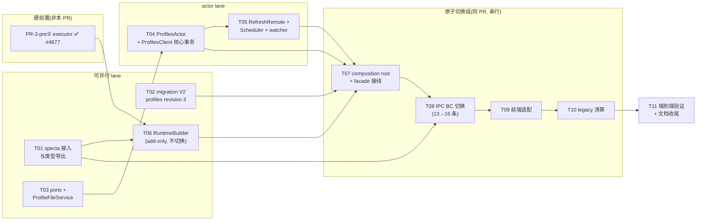

# PR-3(R-3) — profiles 域切换 任务拆解(task.md)

- **关联设计**: [`./design.md`](./design.md)(下文「design §N」均指该文件章节)
- **拆解目标**: 每个任务 = 一个可独立 plan、独立执行、独立过审的 commit 组(1–3 个 conventional commit);任务卡自带 scope、接口契约与验证判据,供后续用 `superpowers:writing-plans` 逐卡展开为 bite-sized plan(执行时配合 `superpowers:subagent-driven-development` 或 `executing-plans`)。
- **分支策略**: 单一 feature 分支(建议 `refactor/pr3-profiles-domain-switch`),任务按依赖序落 commit;T07–T10 为**原子切换组**(见 §4),必须同 PR 合并。
- **前置状态(2026-07-06 勘误)**: pre①(#4868)/pre②(#4877)/PR-2b(#4869)均已合并,基准 = main @ `356864d5`;executor 实物签名与 D12 落定见 design §19,T06/T07 卡已同步。

---

## 0. 全局约束(每张任务卡隐含,plan 时逐条带入)

1. CLAUDE.md 铁律:无新 `::global()` / 静态可变服务;依赖显式注入;Tauri 隔离在适配器后。
2. `state/profiles.rs` + `client/profiles.rs` **禁止** import `tauri::*` / `crate::config::Config`(design D10)。
3. RPC 超时:读 `call(_, Some(PROFILES_READ_TIMEOUT))`(5s 域内常量)、写 `call(_, None)`;写 handler 禁无界 I/O(design D9)。
4. 全部 mutation 走七步事务:clone→mutate→`validate()`→scheduler diff→原子持久化→commit→重建索引+reconcile;commit 后副作用失败 = 降级不回滚(design D5)。
5. 本 PR 允许的旧全局消费点仅:`Config::runtime()` 写产物、`CoreManager::global().update_config()` 两处(D12 已落定走 typed client,取数点不复存在——design §19)——全部标 `TODO(actor-migration)` 注释(格式见 design §8),台账 B8。
6. 测试不 sleep,同步用 `RpcReplyPort` ack;ports 兼容 `mockall::automock`。
7. 硬前置(2026-07-06 核对,**全部满足**):PR-3-pre①(snapshot store v2)已合并 `ffd80168`(#4868);PR-3-pre②(runtime pipeline executor)已合并 `356864d5`(#4877);PR-2b(三 StateActor)已合并 `95c4ca8a`(#4869)→ D12 走 typed client 分支(design §19)。T06 解除阻塞。
8. 中间态规则:每个 commit 必须 `cargo build` + `cargo test` 绿;「应用端到端可运行」只在原子切换组边界(T07 之前 / T10 之后)保证。

---

## 1. 任务依赖图



**并行性**: T01 / T02 / T03 三者零文件重叠,可同时开工;T06 依赖 P2+T01;T04→T05 串行(同文件);切换组 T07–T10 严格串行。

---

## 2. 任务总表

| #   | 任务                                | scope(一句话)                                                   | 建议 commit                                                                | 依赖            | design 锚点      |
| --- | ----------------------------------- | --------------------------------------------------------------- | -------------------------------------------------------------------------- | --------------- | ---------------- |
| T01 | specta 接入与类型导出               | tauri 依赖 nyanpasu-config,新类型逐 variant 导出 TS             | `feat(tauri): export nyanpasu-config profile types via specta`             | —               | §3 D11, §11      |
| T02 | migration profiles revision 3       | legacy profiles.yaml → clean schema(Value 层)                   | `feat(migration): add profiles revision 3 legacy-to-clean schema step`     | —               | §10, 图 13.4     |
| T03 | ports + ProfileFileService          | 三个窄 trait + fs/http 具体实现                                 | `feat(tauri): add profile fs/subscription ports and file service`          | —               | §7               |
| T04 | ProfilesActor + ProfilesClient      | 事务化状态归属 + 全部同步写消息                                 | `feat(tauri): add ProfilesActor with transactional profile state`          | T03             | §6, 图 13.1/13.5 |
| T05 | RefreshRemote + scheduler + watcher | 下载-提交分离、定时 reconcile、External 监听                    | `feat(tauri): add remote update scheduler and external watchers`           | T04             | §7, 图 13.3      |
| T06 | RuntimeBuilder(add-only)            | executor 输入组装 + golden 对照,不动调用点                      | `feat(tauri): add RuntimeBuilder over runtime pipeline executor`           | P2, T01         | §8, 图 13.2      |
| T07 | composition root + facade 接线      | spawn actor、facade 方法、rebuild 链路切换                      | `feat(tauri): wire ProfilesActor and RuntimeBuilder into composition root` | T02,T04,T05,T06 | §5, §6.4         |
| T08 | IPC BC 切换                         | 13 条旧命令 → 16 条 thin adapter                                | `feat(tauri)!: rewrite profile IPC commands against NyanpasuClient`        | T01, T07        | §9               |
| T09 | 前端适配                            | 新绑定 + current 单值化 + 最小 Composition 交互                 | `feat(frontend)!: adapt profiles UI to single current and new bindings`    | T08             | §11              |
| T10 | legacy 清算                         | 删 config/profile/\*\*、Config::profiles()、ProfilesJobGuard 等 | `refactor(tauri)!: remove legacy profiles types and accessors`             | T09             | §14 T3.8, §16    |
| T11 | 端到端验证 + 文档收尾               | e2e 冒烟、roadmap 状态行、台账 B8 登记                          | `docs: update actor migration roadmap for PR-3`                            | T10             | §15, §16         |

---

## 3. 任务卡

### T01 — specta 接入与类型导出

**目标**: tauri crate 依赖 `nyanpasu-config`,新 profile 域类型可生成 TS 绑定;旧代码零行为变化(add-only)。

**Files**:

- Modify: `backend/tauri/Cargo.toml`(加 `nyanpasu-config` workspace 依赖)
- Modify: `backend/tauri/src/lib.rs`(specta builder 注册新类型)
- Generated: `frontend/interface/src/ipc/bindings.ts`(仅新增类型,命令未变)

**Interfaces — Produces**(T08/T09 依赖):

- TS 侧实际导出的 PR-3 profile 域命名类型:`ProfileDocument`(`nyanpasu_config::profile::Profiles` 的 collision-safe 导出名;旧 `Profiles` 仍为 legacy profile DTO)、`ProfileItem`/`ProfileItem_Deserialize`/`ProfileItem_Serialize`、`ProfileMetadata`/`ProfileMetadata_Deserialize`/`ProfileMetadata_Serialize`、`ProfileDefinition`/`ProfileDefinition_Deserialize`/`ProfileDefinition_Serialize`、`ConfigDefinition`/`ConfigDefinition_Deserialize`/`ConfigDefinition_Serialize`、`FileConfig`/`FileConfig_Deserialize`/`FileConfig_Serialize`、`CompositionConfig`/`CompositionConfig_Deserialize`/`CompositionConfig_Serialize`、`TransformDefinition`/`TransformDefinition_Deserialize`/`TransformDefinition_Serialize`、`OverlayTransform`/`OverlayTransform_Deserialize`/`OverlayTransform_Serialize`、`ScriptTransform`/`ScriptTransform_Deserialize`/`ScriptTransform_Serialize`、`ScriptRuntime`、`ProfileSource`/`ProfileSource_Deserialize`/`ProfileSource_Serialize`、`LocalBinding`/`LocalBinding_Deserialize`/`LocalBinding_Serialize`、`ExternalMode`、`MaterializedFile`/`MaterializedFile_Deserialize`/`MaterializedFile_Serialize`、`ProfileRemoteOptions`(旧 `RemoteProfileOptions` 仍为 legacy DTO)、`ProfileSubscriptionInfo`(旧 `SubscriptionInfo` 仍为 legacy DTO)、`TransformOwner`、`CompositionMemberRole`。
- 透明 newtype 实际导出为命名别名:`ProfileId = string`、`ManagedProfilePath = string`、`ExternalProfilePath = string`。
- Patch / error 实际导出:`ProfileMetadataPatch`/`ProfileMetadataPatch_Deserialize`/`ProfileMetadataPatch_Serialize`、`RemoteProfileOptionsPatch`/`RemoteProfileOptionsPatch_Deserialize`/`RemoteProfileOptionsPatch_Serialize`、`ProfileValidationError`。`double_option` 三态字段通过 serialize/deserialize patch 形态保留。
- **维护注意(T01 审查发现)**: `ProfileDocument`/`ProfileRemoteOptions`/`ProfileSubscriptionInfo` 来自 `#[specta(remote = ...)]` mirror 结构(真实 struct 不再 derive `Type`)——域模型字段变更时必须**手动同步 mirror**,导出测试只断言类型名、不校验字段形状(漂移不会被编译或 CI 拦截);T08 plan 时评估补充字段形状断言。

**验证**:

- `cargo build -p clash-nyanpasu` 绿;TS 绑定生成命令成功且产物含全部命名类型
- CI TS diff 检查在位(绑定产物入库,diff 即 fail)
- 风险探针:specta 2.x 对嵌套 tagged enum 的推导问题**在本任务暴露**(design §17 风险 2)——若推导失败,方案调整只影响本卡

**单独 plan 时读**: design §11、D11;`backend/nyanpasu-config/src/profile/` 各类型的 serde/specta 属性。

---

### T02 — migration V2 `profiles` revision 3

**目标**: 注册 revision 3 step,把 legacy `profiles.yaml` 在 Value 层转换为 clean schema;`.bak` 备份;歧义显式失败;幂等重入。

**Files**:

- Modify: `backend/tauri/src/core/migration/modules/profiles.rs`(现 revision 1 `:47` / revision 2 `:114` 之后新增)
- Create: 迁移 fixtures(旧格式样本 YAML,建议随测试内联或 `tests/fixtures/`)

**规则清单**(全部来自 design §10,plan 时逐条转为测试):

- 类型映射四则;字段移动五组(`chain→global_transforms`、`local/remote.chain→File.transforms`、`script_type→runtime`、`file+updated→MaterializedFile`、`url/option/extra→ProfileSource::Remote`)
- `extra.expire:0→None`;`update_interval→update_interval_minutes`;URL-file→Remote(design §14.2)
- `local.symlinks: Some(target)` → `LocalBinding::External{target, mode: symlink}`(legacy field,guide §6 未列出;non-absolute target 显式失败)
- `remote.option` legacy defaults: absent key => `{with_proxy:false, self_proxy:true, 120}`;present missing fields => false/false;`update_interval == 0` 显式失败
- `option: null` 与 `URL 文件 + symlinks` 组合均显式失败(审查修复)
- multi-current:`[]→None`、`[a]→Some(a)`、`[a,b,c]→CompositionConfig{base:Some(a),extend:[b,c]}` + 碰撞安全 uid,顺序原样;成员无法映射 → **显式失败**(`MigrationError{uid, field_path}`)
- 收尾:反序列化为新 `Profiles` → `validate()` → 原子写回

**Interfaces — Produces**: revision 3 落账后,`profiles.yaml` 为新 schema(T07 spawn 前提);`MigrationStep` 实现遵循 `core/migration/mod.rs:83` trait(含 `rollback`)。

**验证**:

- fixtures 覆盖 design §10 全规则 + clean-design §18 第 24–27 条;幂等重入测试;`.bak` 生成断言
- 仿 `runner.rs:367` 的端到端样板(1.6.1 全量旧样本 → revision 3 → 新 schema 可 validate)
- `cargo test -p clash-nyanpasu migration` 绿

**单独 plan 时读**: design §10;guide §6;clean-design §14;`core/migration/{mod.rs, registry.rs, runner.rs:367, modules/profiles.rs}`。

---

### T03 — ports + ProfileFileService

**目标**: 定义消费方拥有的三个窄 trait 并提供具体实现;纯增量,无调用方。

**Files**:

- Create: `backend/tauri/src/state/profiles/ports.rs`(或 `state/profiles.rs` 内 mod;plan 时定,保持 Tauri-free)
- Create: `backend/tauri/src/service/profile_file.rs`(`ProfileFileService`)
- Modify: `backend/tauri/src/service/mod.rs` / `lib.rs`(模块声明)

**Interfaces — Produces**(T04/T05/T07 依赖,签名以此为准):

```rust
#[cfg_attr(test, mockall::automock)]
pub trait ProfileFsPort: Send + Sync + 'static {
    fn read(&self, path: &ManagedProfilePath) -> anyhow::Result<String>;
    fn write_atomic(&self, path: &ManagedProfilePath, content: &str) -> anyhow::Result<()>;
    /// Idempotent: removing a missing file succeeds.
    fn remove(&self, path: &ManagedProfilePath) -> anyhow::Result<()>;
    /// Read an External binding target for Mirror synchronization.
    fn read_external(&self, target: &ExternalProfilePath) -> anyhow::Result<String>;
    fn ensure_not_symlink(&self, path: &ManagedProfilePath) -> anyhow::Result<()>;
    fn ensure_symlink(&self, path: &ManagedProfilePath, target: &ExternalProfilePath) -> anyhow::Result<()>;
}
#[cfg_attr(test, mockall::automock)]
pub trait SubscriptionFetcher: Send + Sync + 'static {
    async fn fetch(&self, url: &Url, options: &RemoteProfileOptions) -> anyhow::Result<FetchedSubscription>;
}
#[cfg_attr(test, mockall::automock)]
pub trait RebuildNotifier: Send + Sync + 'static {
    fn request_rebuild(&self);
}
pub struct FetchedSubscription {
    pub content: String,
    pub filename: Option<String>,
    pub subscription: SubscriptionInfo,
}
#[cfg_attr(test, mockall::automock)]
pub trait SelfProxyPortSource: Send + Sync + 'static {
    fn mixed_port(&self) -> Option<u16>;
}
// ProfileFileService::new(paths: PathResolver, self_proxy_port: Arc<dyn SelfProxyPortSource>)
// — 同时 impl ProfileFsPort + SubscriptionFetcher;T07 composition root 提供 SelfProxyPortSource。
pub fn normalize_yaml_document(content: &str) -> anyhow::Result<String>;
```

**验证**:

- 单测(tempdir):原子写、`ensure_not_symlink` 对符号链接拒绝、YAML 规范化读、`fetch` 网络超时自管(mock http 或 feature-gate)
- `state/profiles/` 无 `tauri::*` / `crate::config` import(grep 断言)

**单独 plan 时读**: design §7、D9、D10;`utils/path.rs:40,94,99`(PathResolver);clean-design §9 末段(符号链接防御)。

---

### T04 — ProfilesActor + ProfilesClient(核心事务)

**目标**: profiles 状态归属 actor;全部**同步写消息**落地(Add/Delete/Reorder/PatchMetadata/PatchRemoteOptions/ReplaceDefinition/SetCurrent/SetGlobalTransforms/Replace)+ Get 读;七步事务 + 依赖索引 + `CommitReport`。**不含** RefreshRemote/scheduler/watcher(→T05,缩小审查半径)。

**Files**:

- Create: `backend/tauri/src/state/profiles.rs`(actor;若 T03 用了子目录则为 `state/profiles/mod.rs` + `actor.rs`)
- Create: `backend/tauri/src/client/profiles.rs`(`ProfilesClient`)
- Modify: `backend/tauri/src/state/mod.rs`、`client/mod.rs`(仅模块声明,facade 方法留给 T07)

**Interfaces — Consumes**: T03 三 trait + `PersistentStateManager<Profiles>`(`nyanpasu-core/src/state/manager/persistent_state.rs:128`)+ `nyanpasu-config` patch.rs 分层 mutator + `ProfileDependencyIndex`(`dependency.rs:10`)。

**Interfaces — Produces**(T05/T07/T08 依赖):

```rust
pub struct ProfilesClient { /* ActorRef 私有 */ }
impl ProfilesClient {
    pub async fn get(&self) -> Result<Arc<Profiles>, ProfilesError>;                    // call(_, Some(PROFILES_READ_TIMEOUT))
    pub async fn add(&self, req: NewProfileRequest, initial_file: Option<String>) -> Result<CommitReport, ProfilesError>;
    pub async fn delete(&self, uid: ProfileId) -> Result<CommitReport, ProfilesError>;  // 引用保护
    pub async fn reorder(&self, op: ReorderOp) -> Result<CommitReport, ProfilesError>;
    pub async fn patch_metadata(&self, uid: ProfileId, patch: ProfileMetadataPatch) -> Result<CommitReport, ProfilesError>;
    pub async fn patch_remote_options(&self, uid: ProfileId, patch: RemoteProfileOptionsPatch) -> Result<CommitReport, ProfilesError>;
    pub async fn replace_definition(&self, uid: ProfileId, definition: ProfileDefinition) -> Result<CommitReport, ProfilesError>;
    pub async fn set_current(&self, current: Option<ProfileId>) -> Result<CommitReport, ProfilesError>;
    pub async fn set_global_transforms(&self, ids: Vec<ProfileId>) -> Result<CommitReport, ProfilesError>;
    pub async fn replace(&self, profiles: Profiles) -> Result<CommitReport, ProfilesError>;
}
pub struct CommitReport { pub snapshot: Arc<Profiles>, pub affects_current: bool, pub warnings: Vec<String> }
pub struct NewProfileRequest { pub metadata: ProfileMetadata, pub definition: ProfileDefinition }  // uid 服务端生成(D13)
pub enum ReorderOp { Move { active: ProfileId, over: ProfileId }, ByList(Vec<ProfileId>) }
pub enum ProfilesError { ProfileNotFound, ProfileInUse { referrers: Vec<ProfileId> }, ProfileHasNoFile,
                         ValidationFailed(Vec<ProfileValidationError>), NotARemoteProfile,
                         FileNotWritable { reason: String }, RefreshFailed { message: String },
                         Persist(String), Rpc(String) }
pub const PROFILES_READ_TIMEOUT: Duration = Duration::from_secs(5);
pub struct ProfilesActorArgs { pub manager: PersistentStateManager<Profiles>,
                               pub fs: Arc<dyn ProfileFsPort>, pub fetcher: Arc<dyn SubscriptionFetcher>,
                               pub notifier: Arc<dyn RebuildNotifier> }
```

**2026-07-06 契约修正(T04 实物,下游以此为准)**:

- `ProfilesClient::new(profiles_path, fs, fetcher, notifier)` 是构造边界:若 `profiles_path` 存在则 `load()`;否则 `from_state(Profiles::default())`;随后立即 `validate()` fail-fast 再 spawn actor。`ProfilesActorArgs` 不含 `PathResolver` 或 `initial`。
- 所有写 handler 仍走 clone→mutate→`validate()`→持久化→commit+重建索引→post-commit 副作用→`CommitReport`;post-commit 文件副作用失败写入 `CommitReport.warnings`,不回滚已持久化状态。
- `ProfilesError::Persist(String)` 专指持久化/提交失败;`Rpc(String)` 仅表示 actor call/reply/timeout 层失败。
- Add 服务端生成 uid:`Config` 用 `c` 前缀、`Transform` 用 `t` 前缀,后接 `nanoid(11)`;忽略请求里的 materialized 路径并改写为规范 `{uid}.{ext}`。`FileConfig`/`OverlayTransform` 用 `.yaml`;`ScriptRuntime::JavaScript` 用 `.js`;`ScriptRuntime::Lua` 用 `.lua`。`ExternalMode::Symlink` 只做 post-commit `ensure_symlink`;Remote 与 Mirror 的初始内容同步由 T05 的 RefreshRemote/watcher reconcile 承接。
- **(2026-07-06 审查修复)materialization 元数据由服务端所有**:Add 一律重置 `updated_at = None`(Remote 另重置 `subscription = default`);`ReplaceDefinition` 同样把传入定义的路径改写为规范 `{uid}.{新类型 ext}`——source 槽位(Managed/External/Remote 判别 + 规范路径)不变时沿用旧存储的 materialized 元数据、忽略客户端传值;槽位变化时重置元数据,旧路径与新规范路径不同(或新定义无 source,如换成 Composition)时 post-commit `Remove` 清理孤儿文件,新引入 External Symlink 绑定时 post-commit `ensure_symlink`(与 Add 对齐)。
- **(2026-07-06 审查修复)错误形态**:`ProfileInUse { referrers, current: bool, global_transforms: bool }`(document 级引用不再以空列表歧义表达);新增 `InvalidReorderList { reason }`(ByList 长度不符/重复 uid),未知 uid 仍报 `ProfileNotFound`。
- **(2026-07-06 审查记录)** 真实文件事件冒烟测试 `external_watcher_smoke_mirror_real_file_event` 标 `#[ignore]`(CI 抖动;注入式测试保有覆盖);Mirror 同步在 actor handler 内做同步 fs I/O,target 位于网络盘时有阻塞风险——候选硬化项(spawn_blocking 化),T07 阶段评估。
- `affects_current` 判定表:

| 消息                                                                  | 规则                                                              |
| --------------------------------------------------------------------- | ----------------------------------------------------------------- |
| `Get`                                                                 | 不适用                                                            |
| `Add` / `Delete` / `Reorder` / `PatchMetadata` / `PatchRemoteOptions` | `false`                                                           |
| `SetCurrent`                                                          | before/after `current` 不同                                       |
| `SetGlobalTransforms`                                                 | before/after `global_transforms` 不同                             |
| `ReplaceDefinition`                                                   | before/after 当前闭包不同,或被替换 uid 在 before/after 当前闭包内 |
| `Replace`                                                             | `true`                                                            |

当前闭包 = `current` + 若 current 为 Composition 则含 base/extend 成员 + 这些 config 的 scoped transforms + `global_transforms`;`current == None` 时闭包仅为 `global_transforms`。

**验证**(mock ports + tempdir manager spawn,不 sleep):

- 每条消息 happy path;`ValidationFailed` 不落盘不改内存;`Delete` 五类引用全部拒绝(`ProfileInUse.referrers` 正确);`affects_current` 判定(改 current 传递闭包内/外各一例)
- 写路径 `call(_, None)`、读路径 `call(_, Some)` 有断言;Add 写初始文件、Delete 按 binding 清理(Managed 删 / Symlink 只删链接 / Mirror 删副本 / Composition 无操作)
- `cargo test -p clash-nyanpasu profiles` 绿

**单独 plan 时读**: design §6 全部、图 13.1/13.5;patch-interface §4–6;clean-design §13/§16/§17;PR-2b spec §6–7(actor 同构样板);现 `state/verge.rs`(消息/manager 用法参考)。

---

### T05 — RefreshRemote + RemoteUpdateScheduler + External watcher

**目标**: 订阅刷新与外部文件同步纳入 actor:下载-提交分离(`RefreshRemote` 挂起 reply → 子任务下载 → `CommitRefreshed` 串行提交)、定时表 reconcile、Symlink/Mirror watcher、后台提交经 `RebuildNotifier` 通知。

**Files**:

- Modify: `backend/tauri/src/state/profiles.rs`(新增消息 `RefreshRemote`/`CommitRefreshed`/`ExternalFileChanged`、`pending_refresh` 表、`post_start` 首次 reconcile、scheduler 子任务)
- Create(如拆文件): `backend/tauri/src/state/profiles/scheduler.rs`
- Modify: `backend/tauri/src/client/profiles.rs`(+`refresh(uid, Option<RemoteProfileOptionsPatch>) -> Result<CommitReport, ProfilesError>`)

**Interfaces — Consumes**: T04 全部(含 2026-07-06 契约修正:`CommitReport.warnings` 降级通道、`Persist` 错误、Add 规范路径与 Remote/Mirror 初始内容延后规则) + T03 `SubscriptionFetcher`/`ProfileFsPort`/`RebuildNotifier`。
**Interfaces — Produces**: `ProfilesClient::refresh(...)`(T07/T08 的 `update_profile` 链路);scheduler/watcher 对外不可见(actor 内部)。

**行为要点**(plan 时逐条转测试):

- handler 内零网络 I/O;下载任务超时自管(options 派生);失败路径必结清挂起 reply
- reconcile 幂等:新增/修改/Local↔Remote 切换/删除四类 diff(clean-design §18 第 22 条)
- watcher:Symlink 监听 target 真实路径、Mirror 变化→临时文件→校验→原子替换(design §7;clean-design §10)
- `CommitRefreshed` 时 uid 已被删除 → 丢弃结果、结清 reply(design §17 竞态行)
- 后台提交且 `affects_current` → `notifier.request_rebuild()` 恰好一次

**2026-07-06 契约补遗(T05 实物,下游以此为准)**:

- `ProfilesActorMessage::RefreshRemote { uid, patch, reply: Option<RpcReplyPort<Result<CommitReport, ProfilesError>>> }`:手动 `ProfilesClient::refresh(...)` 使用 `Some(reply)`;scheduler 后台刷新使用 `None`。`patch` 先以普通写事务更新 remote options,失败则立即结清 `Some(reply)`。
- 同一 uid 已有 `pending_refresh` 时,`Some(reply)` 返回 `ProfilesError::RefreshFailed { message: "refresh already in progress" }`;`None` 后台触发静默丢弃。所有已登记 pending 的路径必须在 success/failure/deleted race 中结清。
- `RefreshRemote` handler 不做网络 I/O:它快照 remote 参数、登记 pending reply,然后 `tokio::spawn` 执行 fetch/校验/`ensure_not_symlink`/`write_atomic`;子任务只回 cast `CommitRefreshed { uid, outcome }`,由 actor 串行提交 `updated_at` 与 `subscription`。
- `CommitRefreshed` 发现 uid 已删除时,若 outcome 为 success, best-effort 清理 `{uid}.yaml` / `{uid}.js` / `{uid}.lua` 三个可能 orphan;`Some(reply)` 以 `RefreshFailed { message: "profile deleted during refresh" }` 结清。
- 后台刷新(`reply == None`)只有在成功提交且 `CommitReport.affects_current` 时调用 `RebuildNotifier::request_rebuild()`;每次 background-driven commit 恰好一次。手动 refresh 的 reply 路径不在 actor 内直接 notify,由 T07 facade 按 `CommitReport` 统一编排。
- `RemoteUpdateScheduler` 为每个 remote uid 持有独立 tokio timer task;每次 committed write 后按 uid+interval diff add/remove/update。`post_start` 会 catch-up overdue remote: `updated_at == None` 视为 overdue,否则 `now - updated_at >= update_interval_minutes` 触发一次后台 refresh。
- `ExternalWatchers` 使用 `notify-debouncer-full` 按 External binding 建 watcher。Symlink 监听 canonicalized target(失败回退 raw target)且事件只 bump `updated_at`;Mirror 事件先 `ProfileFsPort::read_external`、按 profile definition 校验、`write_atomic` 到 managed materialization,再 bump `updated_at`。成功提交且影响 current 时 notify 恰好一次;读取/校验/写入失败只记录 warn,不改状态、不 notify。
- 测试入口保留 `#[cfg(test)]` client helper 直接 cast `ExternalFileChanged`,用于覆盖 handler 语义;真实 watcher smoke 使用 bounded `<=5s` 文件事件测试,当前未标 `#[ignore]`。

**验证**: mock fetcher 注入可控延迟/失败;watcher 用 tempdir 真实文件事件或注入触发;全程无 sleep(用消息 ack/通道)。

**单独 plan 时读**: design §7、图 13.3、D8/D9、§18 O1/O3;clean-design §9/§10;现 `core/tasks/jobs/profiles.rs:49-139`(被取代者的 cron diff 语义参考)。

---

### T06 — RuntimeBuilder(add-only,不切换调用点)

**目标**: 新建 `RuntimeBuilder` 纯 service + 两个 executor 适配器;golden 对照测试证明与旧 `enhance()` 产物等价。**本卡不改 `Config::generate()`、不删旧 enhance 逻辑**——行为切换在 T07,保证本卡纯增量、可独立回滚。

**Files**:

- Create: `backend/tauri/src/enhance/runtime_builder.rs`(`RuntimeBuilder` + `RuntimeBuildInput`)
- Create: `backend/tauri/src/enhance/content_source.rs`(`FsProfileContentSource: ProfileContentSource`,按 `ManagedProfilePath` 读物化文件)
- Modify: `backend/tauri/src/enhance/script/`(为现 boa/lua runner 加 `ScriptRunner` trait impl 包装,不动原逻辑)
- Create: golden fixtures(旧行为样本:单 current、multi-current→Composition、scoped chain、global chain、builtin 门控、HANDLE_FIELDS overlay、whitelist 过滤)

**Interfaces — Consumes**(2026-07-06 勘误,#4877 实物:`backend/nyanpasu-config/src/runtime/executor/{mod,ports,artifact}.rs`):

```rust
// executor 入口(mod.rs:196)
pub fn execute(inputs: &RuntimePipelineInputs<'_>, content: &dyn ProfileContentSource, runner: &dyn ScriptRunner)
    -> Result<RuntimeArtifact, RuntimePipelineError>;
pub struct RuntimePipelineInputs<'a> { pub profiles: &'a Profiles, pub target: ExecutionTarget,
    pub guard: GuardInputs<'a>, pub whitelist_enabled: bool, pub tun: TunParams,
    pub builtin_transforms: &'a [BuiltinTransform] }
pub enum ExecutionTarget { Selected(ProfileId), Bare }                     // Bare = current 为 None 的裸配置路径
pub struct GuardInputs<'a> { pub overrides: &'a ClashGuardOverrides, pub ports: ResolvedPortBindings }
pub struct ResolvedPortBindings { pub mixed_port: u16, pub port: Option<u16>,
    pub socks_port: Option<u16>, pub external_controller: Option<String> } // 端口探测 IO 不进 executor
pub struct TunParams { pub enable: bool, pub flavor: TunFlavor, pub windows_fake_ip_filter: bool }
pub enum TunFlavor { ClashRs, Standard { stack: TunStack } }               // 含 Premium+Mixed→Gvisor 降级,由调用方推导
pub struct BuiltinTransform { pub name: String, pub runtime: ScriptRuntime, pub source: String }
// ports.rs:ScriptRunner 三方法 run / eval_item_predicate / eval_item_expr;run 返回 ScriptRunOutcome{result, logs}
// artifact.rs:RuntimeArtifact { final_config: Arc<ConfigValue>, graph, step_logs: Vec<StepLog>, applied_fields }
```

另消费:`enhance/chain.rs:145` builtin 门控表(按 `ClashCore` bitflags 组装 `Vec<BuiltinTransform>`)。

**Interfaces — Produces**(T07 依赖;字段实名 plan 时锚定,变更回写本卡):

```rust
// RuntimeBuilder 职责 = 把域快照确定性地降解为 RuntimePipelineInputs:
// TunFlavor 推导(含 Premium+Mixed→Gvisor)、ClashCore 门控 builtins、cfg!(windows) 传参、
// current=None → ExecutionTarget::Bare。端口解析(IO)不在 builder 内,作为 ResolvedPortBindings 传入。
pub struct RuntimeBuildInput {
    pub profiles: Arc<Profiles>,               // ProfilesClient 快照
    pub clash: ClashConfig,                    // ClashConfigClient 快照(guard overrides/tun/enable_clash_fields)
    pub app: NyanpasuAppConfig,                // ApplicationClient 快照(core 选择 + builtin 开关)
    pub resolved_ports: ResolvedPortBindings,  // 调用方预解析(T07:composition/facade 侧)
}
impl RuntimeBuilder {
    pub fn build(input: &RuntimeBuildInput, content: &dyn ProfileContentSource, scripts: &dyn ScriptRunner)
        -> Result<RuntimeArtifact, RuntimeBuildError>;   // Validation(Vec<ProfileValidationError>) | Pipeline(RuntimePipelineError)
}
```

**2026-07-06 契约修正(T06 实物,下游以此为准)**:

- 落点实名:`enhance/runtime_builder.rs`(`RuntimeBuilder`/`RuntimeBuildInput`/`RuntimeBuildError` + `builtin_transforms_for(core)`/`derive_tun_flavor(core, stack)` 公开可测)、`enhance/content_source.rs`(`FsProfileContentSource::new(profiles_dir: PathBuf)`)、`enhance/script/adapter.rs`(`EnhanceScriptRunner::new()`,三方法 `ScriptRunner`,复用 `RunnerManager` + `create_lua_context`)。均从 `crate::enhance` 顶层 `pub use`。
- `build()` 前置 `profiles.validate()` 防御(executor 契约要求已验证输入)→ `RuntimeBuildError::Validation`。
- builtin 门控实现为切片匹配表(未给 tauri 引入 enumflags2);顺序与 gating 与 `chain.rs:170-175` 逐位一致,含 `clash_rs_comp` 不含 `ClashRsAlpha`、tun `ClashRs` 分支不含 Alpha 两处 legacy 怪癖(修复属行为变更,需另走勘误)。
- `TunStack` 实际路径 = `nyanpasu_config::clash::config::tun_stack::TunStack`。
- `EnhanceScriptRunner` 自持 current-thread runtime(`run` 同步阻塞)——**`RuntimeBuilder::build` 必须在阻塞上下文调用**(T07 统一 `spawn_blocking`);禁止在 async worker 线程直接调用。
- golden 现状:端到端不变量测试(真实 boa + 真实文件源:脚本生效/guard 端口注入/whitelist-off 保键/step_logs 锚定)+ executor 侧 PR-3-pre② parity 套件背书;**snapshot 期望文件套件列为 T07 pre-flight 跟进项**(多场景:Composition、global chain、builtin 门控、whitelist-on)。
- 评审处置(antigravity 2026-07-06;codex 后端故障,其评审延期):①"`block_on` 在 `spawn_blocking` 内 panic"判**误报**——tokio 仅在 async worker 线程禁止 `block_on`,blocking 池线程允许(`Handle::block_on` 官方文档模式、reqwest::blocking 同构先例),阻塞上下文契约见上条;②"每次 `run` 重建 `RunnerManager` 是性能回退"**不成立**——`JSRunner` 为 unit struct,boa `Context`(`Rc<RefCell<_>>`,!Send)legacy 同样每脚本新建,manager 仅空 HashMap;③BitFlags 门控为有意偏离(新域 `ClashCore` 无 `#[bitflags]` derive,跨 crate 改动超卡范围)——新增 core 变体时切片表需手工同步,由门控测试兜底;④**T07 加固项**:`ManagedProfilePath` 反序列化侧缺 `..` 组件拒绝(防御纵深),须用 `Component::ParentDir` 组件检查而非 `starts_with`(lexical 比较对未归一化路径无效)。

**验证**:

- golden 对照:同输入下 `RuntimeBuilder::build` 产物与旧 `enhance()` 等价(design §15「最高风险项」;PR-3-pre② T3p.6 fixtures 复用为回归)
- `RuntimeArtifact.step_logs` 能还原旧 `postprocessing_output` 消费需求
- 纯度断言:`runtime_builder.rs` 无 `Config::` / `tauri::` import(D12 取数不在本卡——输入全部显式传参)

**单独 plan 时读**: design §8/§19、图 13.2、D7/D12;`backend/nyanpasu-config/src/runtime/executor/`(实物:`mod.rs`/`ports.rs`/`artifact.rs`;`tests/{golden,parity}.rs` fixtures 可复用);`docs/superpowers/specs/2026-07-04-runtime-pipeline-executor-design.md` §19 勘误;`enhance/mod.rs:22-104`、`enhance/chain.rs:59-160`(旧语义源)。

---

### T06A — 评审加固 + golden 基线(add-only,排 T07 前;2026-07-06 增补)

**目标**: 落地 T06 评审处置遗留的三项加固,并在 `Config::generate()` 切换前锁定 RuntimeBuilder 行为基线。全部 add-only,不入 §4 原子切换组,可独立提交。

**内容**:

1. `ManagedProfilePath` 构造/反序列化拒绝 `..`:用 `Component::ParentDir` 组件检查(**不得**用 `Path::starts_with`——lexical 比较对未归一化路径无效,T06 评审处置④)。落点 `backend/nyanpasu-config`(路径类型),含拒绝用例单测。
2. Mirror 同步阻塞 I/O 加固:核实 T05 watcher Mirror 分支(`state/profiles/scheduler.rs`)的复制/校验是否已在阻塞线程执行;否则移入 `spawn_blocking`。plan 时以实测定改动量(可能为零改动 + 测试确认)。
3. RuntimeBuilder golden snapshot 文件套件(T06 附录跟进项):固定输入(样本 profiles + clash/app 快照 + 固定 `ResolvedPortBindings`)驱动 `RuntimeBuilder::build`,`final_config` 序列化 YAML 作为期望文件入库;场景至少覆盖 Composition、global chain、builtin 门控、whitelist-on。T07 切换后同套件必须仍绿。

**Interfaces — Consumes**: T06 `RuntimeBuilder`/`FsProfileContentSource`/`EnhanceScriptRunner` 实物。
**Interfaces — Produces**: golden 套件(T07 回归安全网);`ManagedProfilePath` 构造语义收紧(拒绝 `..`;T02 迁移生成的 `{uid}.{ext}` 形态路径不受影响)。

**验证**:

- `ManagedProfilePath::new("../evil")` 等含 `..` 组件的构造被拒(含反序列化路径)
- golden 套件可重复运行、期望文件稳定;`cargo test` 全绿

**单独 plan 时读**: T06 卡「2026-07-06 契约修正」评审处置条;`state/profiles/scheduler.rs`(Mirror 分支现状);`enhance/runtime_builder.rs` 现有测试(`base_input()` 可复用)。

**2026-07-06 执行修正(T06A 实物)**:

- 第 1 项按实物收缩:`..`/穿越拒绝防御与构造侧测试**原已在位**(nyanpasu-config path.rs:30-40/60-67 + validation.rs:166-171;T06 评审处置④的「反序列化侧缺失」表述与实物不符)——本卡实际交付 = profiles 文档反序列化面的回归钉测试(validation.rs 尾部)。
- golden 套件实名:`enhance/golden.rs` + `enhance/fixtures/golden/{composition_global_chain,builtin_mihomo,builtin_clash_rs,whitelist_on}.yaml`;重铸 `GOLDEN_BLESS=1 cargo test -p clash-nyanpasu golden_`;确定性 = 固定 `secret: golden-secret` + tun off。**T07 切换后本套件须原样全绿,改 fixtures = 行为回归须勘误。**
- Mirror 同步已移入 `spawn_blocking`(actor.rs `ExternalFileChanged` Mirror 分支;消息顺序不变,warn 日志逐字保留)。

**2026-07-07 评审处置(codex 79/100 + antigravity 98/100 APPROVE,无 Critical)**:

- Major(已修):golden builtin 两例经真 boa 执行,而 `boa_utils::set_logger` 为进程级全局(js.rs 注释自证非并发安全),与 `runtime_builder.rs` 日志断言 e2e 测试并行有窃取/漏失竞态 → js.rs 增 `BOA_LOGGER_LOCK` 在 `spawn_blocking` 闭包内串行整段 boa 执行(生产侧脚本本就经 actor 串行,无性能回退)。
- Suggestion(已采纳):`golden_input` 显式 `enable_clash_fields = false`,基线自文档化。
- Minor(遗留,记 T07 预备项):Mirror 失败三分支(读失败/校验失败/镜像写失败)缺「不 commit updated_at、不触发 rebuild」的断言钉。
- antigravity 2 条 Info(run_write 后置文件操作仍同步、golden 测试助手与 runtime_builder 测试重复)均记为未来事项,不入本卡。

---

### T07 — composition root + facade 接线(⚠️ 切换组起点)

**目标**: spawn `ProfilesActor` 进 composition root;`NyanpasuClient` 暴露全部 profiles 域方法 + `rebuild_running_config()`;`Config::generate()` 改调 RuntimeBuilder;`RebuildNotifier` 接线。**自本卡起应用进入 BC 中间态**(旧 IPC 仍在但底层已切换,见 §4)。

**Files**:

- Modify: `backend/tauri/src/setup.rs` / `client/mod.rs`(spawn 顺序:migration 子进程已完成 → 构造 ProfileFileService → spawn ProfilesActor → 构造 ProfilesClient → facade;`RebuildNotifier` 具体实现接到 facade 重建入口,注意用 `Weak`/channel 避免循环持有)
- Modify: `backend/tauri/src/config/core.rs:88`(`generate()` 改调 RuntimeBuilder;产物仍写 runtime draft + `generate_file`,两处标 `TODO(actor-migration)` B8)
- Modify: `backend/tauri/src/client/mod.rs`(新 facade 方法;旧 `patch_profiles_config:80` 本卡保留——删除在 T10)

**Interfaces — Consumes**: T02 revision 3 后的新 schema;T04 ProfilesClient 全部方法与 2026-07-06 契约修正(`CommitReport.warnings` 不代表事务失败,`affects_current` 按闭包规则触发 rebuild);T05 final refresh signature `ProfilesClient::refresh(uid: ProfileId, patch: Option<RemoteProfileOptionsPatch>) -> Result<CommitReport, ProfilesError>`;T06 `RuntimeBuilder`。

**Interfaces — Produces**(T08 依赖,方法名以此为准):

```rust
impl NyanpasuClient {
    pub async fn get_profiles(&self) -> Result<Arc<Profiles>>;
    pub async fn add_profile(&self, req: NewProfileRequest, initial_file: Option<String>) -> Result<ProfileId>; // 2026-07-06:返回服务端生成 uid(import 条件激活用)
    pub async fn import_profile(&self, url: Url, options: Option<RemoteProfileOptionsPatch>) -> Result<ProfileId>; // 2026-07-06 T08:add→首刷→条件激活的复合编排
    pub async fn delete_profile(&self, uid: ProfileId) -> Result<()>;
    pub async fn reorder_profile(&self, active: ProfileId, over: ProfileId) -> Result<()>;
    pub async fn reorder_profiles_by_list(&self, list: Vec<ProfileId>) -> Result<()>;
    pub async fn refresh_profile(&self, uid: ProfileId, patch: Option<RemoteProfileOptionsPatch>) -> Result<()>;
    pub async fn patch_profile_metadata(&self, uid: ProfileId, patch: ProfileMetadataPatch) -> Result<()>;
    pub async fn patch_remote_profile_options(&self, uid: ProfileId, patch: RemoteProfileOptionsPatch) -> Result<()>;
    pub async fn replace_profile_definition(&self, uid: ProfileId, definition: ProfileDefinition) -> Result<()>;
    pub async fn activate_profile(&self, uid: Option<ProfileId>) -> Result<()>;
    pub async fn set_global_transforms(&self, ids: Vec<ProfileId>) -> Result<()>;
    pub async fn get_profile_materialized_path(&self, uid: ProfileId) -> Result<PathBuf>;   // Composition → ProfileHasNoFile
    pub async fn read_profile_file(&self, uid: ProfileId) -> Result<String>;
    pub async fn save_profile_file(&self, uid: ProfileId, data: String) -> Result<()>;      // 仅 Local/Managed
    pub async fn rebuild_running_config(&self) -> Result<()>;   // 快照→RuntimeBuilder→runtime draft→CoreManager(TODO B8)
}
```

写方法内部统一模式:`CommitReport.affects_current == true` → 顺序调用 `rebuild_running_config()`(facade 编排,design §6.4)。

**验证**:

- 启动冒烟(顺序断言:migration 先于 spawn);`rebuild_running_config` 集成测试(mock 或真实 executor)
- 台账检查:本卡新增 TODO 注释恰好覆盖 design §8 所列两处(D12 已走 typed client 取数,无第三处;design §19)

**单独 plan 时读**: design §5/§6.4/§8、图 13.2;PR-2b spec §10.2(composition root 顺序样板);`setup.rs`/`lib.rs:120,362-398` 现状。

**2026-07-06 契约修正(现场盘点,下游以此为准)**:

- 接线简化(实物):`ProfileFileService::new(paths: PathResolver, self_proxy_port: Arc<dyn SelfProxyPortSource>)` 一个实例同时实现 `ProfileFsPort` + `SubscriptionFetcher`(`profile_file.rs:126/202`);`ProfilesClient::new(profiles_path: Utf8PathBuf, fs, fetcher, notifier)`(`client/profiles.rs:31`,`pub(crate)`)内部自行 spawn actor——无独立 spawn 步骤;T05 调度器/watcher 为 actor 生命周期内部细节,composition root 零额外接线。
- 本卡新增三个生产实现(盘点:全仓均无非测试实现):① `RebuildNotifier`(channel 接 facade 重建入口,接收侧去抖);② `SelfProxyPortSource`(D12:取 ClashConfig 快照 mixed port);③ 端口解析纯函数 `resolve_port_bindings(&ClashConfig, &NyanpasuAppConfig) -> ResolvedPortBindings`(random-port 等 legacy 语义 plan 时实测对齐)。
- 契约修正(§5.3,波及 T04 实物):`CommitReport` 增补 `created: Option<ProfileId>`(仅 Add 置值)——`import_profile` 条件自动激活需要服务端生成的 uid(`actor.rs:476` `generate_uid`);facade `add_profile` 改返 `Result<ProfileId>`(上方方法表 `Result<()>` 作废)。
- 文件三方法(`get_profile_materialized_path`/`read_profile_file`/`save_profile_file`)在 facade 层实现,不经 actor 消息:快照定位 + `ProfileFileService` 直读写(§9 BC 要点照旧:仅 Local/Managed 可写、Composition→`ProfileHasNoFile`);save 不自动 rebuild(维持 legacy:前端显式 `enhance_profiles`)。
- `generate()` 切换映射:`RuntimeArtifact→IRuntime` = `config←final_config`(ConfigValue→Mapping 投影)、`exists_keys←applied_fields`、`postprocessing_output←step_logs`(shape 转换 plan 时定,保持 `IRuntime` 对外 shape 与 `get_postprocessing_output` 返回类型不变);`rebuild_running_config()` 读完快照后全程 `spawn_blocking`(T06 附录阻塞契约),`FsProfileContentSource`/`EnhanceScriptRunner` 在闭包内每次构造。
- 连接中断(**用户决策 2026-07-06,有意偏离 legacy**):`rebuild_running_config()` 成功后统一调用 `ConnectionInterruptionService::on_profile_change()`(加 `TODO(actor-migration)` bridge 注释,其内读 `Config::verge()`)。legacy 仅 `patch_profiles_config_inner` 路径触发;新行为下删除当前 profile、订阅后台刷新、External 失效等 affects_current 提交同样触发。影响评估:`break_when_profile_change` 默认 false,仅影响显式开启用户,语义更贴近选项本意。台账判据由「恰好两处 TODO」改为「**恰好三处**」。
- 锚点修正:删「旧 `patch_profiles_config:80` 本卡保留」条——`NyanpasuClient` 无此方法(唯一同名物 `ipc.rs:284` 命令,归 T08);profiles 域作为 `NyanpasuClientInner` 第四成员(现 application/session_state/clash_config 三成员)。
- 迁移顺序现状已满足:`setup.rs:22-26` `run_pending()` 先于 client 构造,ProfilesClient 插入同一序列;存在双迁移机制(`lib.rs:120` 子进程 + `setup.rs` in-process),plan 时核实 rev3 实际生效路径。

**2026-07-06 执行修正(T07 实物,plan 期即发现)**:

- spec 缺口:`Config::generate()` 实有 6 个调用点(update_config/run_core:469/core.rs:561/feat.rs:279,339,363)+ `init_config` 首铸。处置:`generate()`/`init_config()` 删除;新增 `client/rebuild.rs` 再生成桥(FIXME 全局,oneshot 保序)供 update_config/core.rs:561/feat×3;run_core 内再生成删除(重启=应用当前 draft);首铸与端口回写移入 `resolve_setup`(client 取自 app state)。`CoreManager` 拆出 `apply_config()`(check+file+put),facade 经 `RunningCoreBridge` 适配器调用。
- 台账:新增 TODO/FIXME(actor-migration) 注释块恰好 7 处(regenerate draft 写入/LegacyCoreBridge×2/桥定义/resolve_setup 端口回写/enhance dead_code/update_config legacy 路径);「恰好三处」勘误作废。
- UI 事件走注入 `UiEventSink`(与 Handle 同 URI 同 payload,不占台账);`ClientSetupArgs` 增 `ui_sink`/`core` 两注入点。
- 端口:`SessionPortResolver`(pick_and_try_port + 指纹缓存,eager 首解析于核启动前)兼任 `SelfProxyPortSource`;legacy 镜像回写 mixed-port/external-controller,`prepare_external_controller_port` 双头解析删除。**T11 必查**:typed `overrides.secret` 与 legacy IClashTemp secret 的一致性(api 客户端 401 风险,本卡未回写 secret——字段私有)。
- 映射:exists_keys←applied_fields(artifact.rs §9.3);postprocessing 按 SnapshotNodeKey 变体表(Scoped→scopes[host]transforms[idx]]、Global→global[global_transforms[idx]]、BuiltinTransform→global[builtin 名]、其余→advice)。文件三方法 fs 直调为有意取舍(小 IO,与 legacy ipc 等同)。

**2026-07-07 评审处置(codex 49/100 NEEDS_IMPROVEMENT;antigravity 3 连败超时跳过;修复由 Claude 接管——codex 后端故障复发)**:

- Critical(已修,部分确认):再生成桥原从 typed 快照取数,而 legacy 副作用写者**先 draft 后 reseed**(`feat::patch_clash`/`patch_verge` tun+service 路径/`change_core`),regen 时 typed 落后一拍(旧端口/secret/核)。→ facade 增 `legacy_regen_inputs()`(读 legacy `latest()` 经 reseed 转换器 `typed_config_from_legacy_parts` 组装 clash/app 输入,**不动 typed actor**,discard 语义保真)+ `regenerate_runtime_for_legacy()`,REGEN_BRIDGE handler 切换至此;新 caller 的 `regenerate_runtime()` 仍走 typed 快照。分项核实:patch_clash **确认**(ipc:503 直调,无 reseed);change_core **确认**(reseed 在 mutation 完成后);patch_verge tun/service **确认**(桥内 mutation 先行);`patch_profiles_config_inner` **不修**——profiles 命令面 T08 整体重写(中间态不可运行属预期),桥内 profiles 仍取 typed actor。
- Major①(已修):`run_core_inner` 残留 `prepare_external_controller_port` 二次选端口(Random 策略核重启时会另选新口与 api 客户端脱节)→ 删除,端口所有权归 `SessionPortResolver`(`config/clash/mod.rs:105` 定义成为无调用者,T10 一并清)。
- Major②(部分补):新增回归钉 `legacy_regen_inputs_see_uncommitted_legacy_drafts`(draft mixed-port/clash_core 必须进桥输入);run_core_inner 不二次选口无法离核测试,以删除代码 + 注释锁定。
- Minor(已注):REGEN_BRIDGE first-install-wins 限制注释补记。
- **台账修正:7→8 处**(新增 `legacy_regen_inputs` 的 FIXME legacy-draft-aware 输入组装块)。

---

### T08 — IPC BC 切换(13 → 16 条)

**目标**: `ipc.rs` 全部 profile 命令重写为 thin adapter;新增/拆分命令注册进 specta builder 与 handler 列表;域错误 → 命令错误映射。

**Files**:

- Modify: `backend/tauri/src/ipc.rs:102-382`(13 条命令按 design §9 表逐条替换;`patch_profiles_config`/`patch_profile` 删除,5 条新命令加入)
- Modify: `backend/tauri/src/lib.rs`(command 注册表 + specta 导出)
- Modify: `backend/tauri/src/feat.rs:441` 附近(`feat::update_profile` 调用点改走 facade;函数本体删除在 T10)
- Generated: `frontend/interface/src/ipc/bindings.ts`(命令面变化——**自本 commit 起前端类型检查红,直至 T09**,见 §4)

**Interfaces — Consumes**: T07 全部 facade 方法。
**Interfaces — Produces**: 16 条命令名(前端 T09 依赖):`get_profiles / enhance_profiles / import_profile / create_profile / reorder_profile / reorder_profiles_by_list / update_profile / delete_profile / activate_profile / set_global_transforms / patch_profile_metadata / patch_remote_profile_options / replace_profile_definition / view_profile / read_profile_file / save_profile_file`。

**验证**:

- 每条命令 = 解析 DTO → facade → 错误映射,**零业务编排**(CLAUDE.md §12 形状检查)
- IPC 集成测试:happy path + `ProfileInUse`/`ProfileHasNoFile`/`ValidationFailed` 映射
- `grep -n "Config::profiles()" backend/tauri/src/ipc.rs` 零命中

**单独 plan 时读**: design §9 全表(每行含 BC 要点);guide §5(逐命令现状签名)。

**2026-07-06 契约修正(现场盘点)**:

- 注册表锚点:命令注册 + specta 导出在 `specta_export.rs`(`build_specta_builder()`,profiles 条目 53–66 行),非 lib.rs(lib.rs 仅 199/238/249 三处消费 builder)。
- `feat::update_profile` 实际在 `feat.rs:444-447`;调用者两处:`ipc.rs:255`(本卡改走 facade)+ `core/tasks/jobs/profiles.rs:33`(T10 随整文件删除,本卡不动)。
- `import_profile` 条件自动激活:用 facade `add_profile` 返回的 `ProfileId`(T07 契约修正),激活调 facade `activate_profile`;连接中断由 `rebuild_running_config()` 统一触发(T07 用户决策),命令层零编排。
- `patch_profiles_config_inner`(`ipc.rs:288-310`)随两条旧命令在本卡删除,不留 T10。
- 现状 13 条命令清单实测与本卡一致;16 条目标名单不变。

**2026-07-06 执行修正(T08 实物)**:

- import 编排收编 facade `import_profile`(add 占位名 → refresh 首次物化,失败回删 → current==None 激活);命名 BC:content-disposition 命名退役,fallback = url 末段(去 `.yaml`/`.yml`)/host。`ProfileSource::Remote.subscription` 为 `SubscriptionInfo`(非 `Option`),import 构造用 `SubscriptionInfo::default()`,Add 会覆写。
- `create_profile` 请求 DTO = `NewProfileRequest`(uid 服务端生成,D13);`NewProfileRequest` 补 derive `serde::Deserialize` + `specta::Type`(actor.rs,仅注解);自动激活在命令层按快照判定(`Config` 定义 + `current==None`)。
- `save_profile_file` 参数收紧为必填 `String`(legacy `Option::None` 分支为无操作)。
- `enhance_profiles` 不再显式 refresh_clash(rebuild 内 UiEventSink 同事件,避免双发)。
- facade import 测试注入**真实 `ProfileFileService`**(非 mock fs)+ mock fetcher:activate 触发的 rebuild 经 `FsProfileContentSource` 读磁盘物化文件,mock fs 不落盘会致 rebuild 失败(plan Step 1/2 的 mock-fs 写法与此冲突,已按实物调整,断言不变)。
- `specta_export.rs` 的 `export_typescript_bindings` 冻结测试:BC 切换后 legacy `Profiles`/`RemoteProfileOptions` 类型名退役(域文档/选项类型经 `#[specta(remote)]` 影子名 `ProfileDocument`/`ProfileRemoteOptions` 断言),断言名单去此两项。
- bindings.ts 导出移交 T09 首步:该冻结测试每次 `cargo test` 都会重生成 bindings.ts,但提交它会触发 pre-commit lint-staged 的前端 `tsc`(use-profile.ts 仍调旧命令)而失败——故本卡**不提交 bindings.ts**(测试后 `git checkout` 还原);T09 首步重生成 + 改 callers 同一 commit 落账(前端红形态见 §4)。
- 台账(TODO/FIXME(actor-migration),backend/tauri/src):20 → 18,净 −2(删 `ipc.rs` 的 get_profiles bridge + patch_profiles_config_inner bridge);本卡零新增。

**2026-07-07 评审处置(codex 持续宕机、antigravity 3 连败超时——本卡评审由 Claude 替补完成,外部双模型复审延期)**:

- Claude 独立对账:台账 18 ✓、`ipc.rs` 零 `Config::profiles()`/`ProfilesBuilder` ✓、specta 16 命令注册 ✓、actor.rs 仅 derive 注解 ✓;`import_profile` 失败语义(占位回删/条件激活)与薄适配器纪律逐条核过,无 Critical/Major。
- 执行报告揭露的 flaky 测试(T07 的 `legacy_regen_inputs_see_uncommitted_legacy_drafts`)根因 = legacy 全局单例非密闭(隔离跑时惰性加载宿主真实配置且反序列化失败;全量跑时与共享 draft 槽竞态,discard 可吞并发提交)→ 已修 `3b529c55`:`legacy_regen_inputs` 拆出纯转换半段 `legacy_regen_inputs_from` 直接测,生产包装 3 行保持 draft 可见的 `latest()` 读(注释锁定)。

**2026-07-07 T08 后端补审处置(codex 恢复后 68/100 NEEDS_IMPROVEMENT,无 Critical;4 Major + 测试缺口;修复 commit `bc2b296b`,纯后端、命令签名不变故 bindings/前端零改)**:

- **T8-M1 — `create_profile` 命令层编排**:**CONFIRMED**(ipc 读快照、判 Config-kind、命令层调 `activate_profile`,违 CLAUDE.md §12)。修:auto-activation 收编 facade `create_profile(request, initial_file) -> Result<ProfileId>`(镜像 `import_profile` 形态,内含 add + design §9 条件激活);ipc 变纯适配器(parse → facade → map);命令签名不变,前端无感。
- **T8-M2 — create 接受 remote 源可激活未物化壳**:**CONFIRMED**(actor Add 对 Remote 不下载,占位 `{uid}.yaml` 未写;current==None 时 create 会激活 → 提交后 rebuild 读缺失文件失败)。修:facade `create_profile` 前置拒绝 remote 源(`definition.source().is_remote()` → `ClientError::Custom`,指引走 `import_profile`)。
- **T8-M3 — import `was_empty` 竞态**:**CONFIRMED**(`was_empty` 在 await 首刷之前捕获,下载窗口内的并发选择会被刷后激活覆盖)。修:删 `was_empty`,首刷成功后**重读快照** `current.is_none()` 才激活。
- **T8-M4 — import 清理吞错**:**CONFIRMED**(`let _ = delete` 静默)。修:回删失败走 `tracing::warn!(uid, error, ...)`(降级效应模式,不改 all-or-nothing 观感)。
- **测试缺口(T8-m1)**:新增 3 例(`facade_import_failure_deletes_placeholder` 首刷失败回删占位;`facade_create_auto_activates_config_and_rejects_remote` 钉 auto-activation 规则 + remote 拒绝;`facade_import_does_not_steal_existing_current` 钉 T8-M3 非空 current 不激活)。M3 真正的下载窗口并发竞态无 test hook 难以确定性复现,以重读快照的代码不变式 + 上述非空 current 用例覆盖观察面。
- 复验全绿:后端包级 225 绿(+3);workspace 全绿;golden diff vs `ea863cd9` = 0;clippy 净;interface+nyanpasu tsc + `pnpm web:build` exit 0;bindings 稳定(命令签名未变,`cargo test` 后仅 `.serena` + 两后端文件);台账不变(18)。

**2026-07-07 SetCurrentIfNone 原子化处置(codex T08 补审 1 PARTIAL 收口,Medium;修复 commit `4dfdd88b`,纯后端、命令签名不变故 bindings/前端零改)**:

- **T8-M3 收口 — import/create 自动激活原子性**:T08 修复以「首刷后重读快照 + `current.is_none()` 才激活」覆盖非空 current,但读与激活仍是两次独立 actor RPC,下载窗口内落地的并发选择仍可能被覆盖(codex 判 PARTIAL/Medium)。根治:actor 新增 `SetCurrentIfNone { uid, reply }`,在**单条序列化消息**内判 `current.is_some()` 则回 `None`、否则复用 `run_write` 七步事务激活并回 `Some(report)`(不复制事务逻辑);typed client `set_current_if_none(uid) -> Result<Option<CommitReport>>`;`import_profile`/`create_profile` 组合改走此单条 RPC,`after_commit`/rebuild 仅在实际激活(`Some`)时触发。序列化消息处理使读-写免竞,并发 `SetCurrent` 不再能被覆盖。
- 三组组合测试改经新路径;`facade_import_does_not_steal_existing_current` 钉原子不偷占语义;新增 `set_current_if_none_only_activates_when_empty` 单测。包级 205 绿(+1);golden 原样;bindings 零漂移;台账不变。

---

### T09 — 前端适配

**目标**: 前端在新绑定下恢复类型检查绿 + profiles 页全功能;`current` 单值化;多选激活改为最小 Composition 创建交互。

**Files**(代表锚点,plan 时全量盘点):

- Regenerate: `frontend/interface/src/ipc/bindings.ts`
- Modify: `frontend/interface/src/ipc/use-profile.ts:167` 及同文件相关 hook(命令改名/拆分)
- Modify: `frontend/nyanpasu/src/pages/(main)/main/profiles/` 下 `current` 消费点(如 `active-button.tsx:21` 的 `current?.find(...)` → `current === uid`)
- Modify: profile 编辑对话框(metadata / remote options / definition 三类操作分开提交)
- Create: 「多选 File Config → 创建 Composition」最小交互(design §11 第 3 条;完整管理界面为非目标)

**Interfaces — Consumes**: T08 的 16 条命令 + T01 的 TS 类型。

**验证**:

- 前端类型检查 + 构建绿;profiles 页手动冒烟:导入/创建/激活/重排/编辑文件/删除(含被引用删除的错误 toast)/更新订阅
- 全仓 `patch_profiles_config` / `chain` 字段引用零残留(grep 前端源码)

**单独 plan 时读**: design §11;guide §7.2/§7.3(TS 破坏性变更表);现 profiles 页组件树。

**2026-07-06 契约修正(现场盘点)**:

- 前端锚点:`use-profile.ts` 唯一导出 hook 为 `useProfile`(内部消费 `getProfiles`/`viewProfile` + update/drop mutations);其余消费点仍按本卡原话 plan 时全量盘点。
- `postprocessing_output` 前端不感知:T07 映射保持 `IRuntime` 对外 shape,`get_postprocessing_output` 返回类型不变,本卡无此项工作。

**2026-07-07 执行修正(T09 实物)**:

- **命令面 16→17**:新增 `set_profile_valid_fields`(actor `SetValidFields` 消息,`AffectsRule::Always` → 恒 rebuild;`ProfilesClient::set_valid_fields` + facade `set_profile_valid_fields` + ipc + specta,全链)。design §9 表补一行。Task 0 单独 commit,后端包级 222 绿,台账不变(18,无新增 actor-migration 块)。
- **`NormalizedProfile` 崩塌层退役**:`useProfile` 直吐 `ProfileItem_Serialize`(扁平:`{uid, name, desc?, type:'config'|'transform', config|transform}`,**无嵌套 metadata**);判别 helpers `isConfigItem/isTransformItem/isRemoteItem/scopedTransformsOf` 从 `@nyanpasu/interface` 导出。**bindings 已导出同名 union 类型**(`export type * from './bindings'`),故 hook **不再重导出** `ProfileItem`/`ProfileDocument`/`NewProfileRequest`/`ProfileDefinition`/`ProfileMetadataPatch`/`RemoteProfileOptionsPatch` 别名(避免 TS2308 歧义);页面直用 bindings 具体 `_Serialize`(读)/`_Deserialize`(命令入参)类型。
- **mutation 拆解**:`upsert` → `activate`(current 单值)+ `setValidFields`;`patch` → `patchMetadata`/`patchRemoteOptions`/`replaceDefinition`。命令入参用 `_Deserialize` 变体(`with_proxy/self_proxy/update_interval_minutes` required-nullable)。
- **4-way ProfileType 分类法保留**(路由 `$type`/tab/header/navigate 深度依赖,collapse 风险大):`$type/_modules/utils.ts` 的 classifiers 从新域重派生(`isProxyProfile=isConfigItem`;JS/Lua/Merge 按 `item.transform.script?.runtime` / `item.transform.overlay`),`categoryProfiles` 保留 4 桶;`consts.ts` 删 `PROFILE_TYPES`(消费者 chain-profile-import/profiles-navigate 改用 categoryProfiles / 内联)。
- **chain 编辑器语义迁移**:`chian-editor-card` 编辑对象从 `profile.chain` 改为当前 config item 的 scoped `transforms`(`scopedTransformsOf`),Apply 走 `replaceDefinition`(File/Composition 皆重建定义、仅换 transforms、原子替换);DnD 两列骨架零改动。
- **create 三件**:local-profile-button 产 File Config `NewProfileRequest`(source `local/managed`,占位 `pending.yaml` 后端 Add 重写);remote-profile-button「手动 Remote」改走 URL 导入(`create({type:'url'})` → importProfile);chain-profile-import 按路由 type 产 Overlay/Script transform 定义 + 对应模板。
- **detail 编辑四件**:profile-name-editor→`patchMetadata`;update-option-editor→`patchRemoteProfileOptions`(读写走 remote source `option`);subscription-url-editor→`replaceDefinition`(URL 属定义,重建 Remote 定义换 url);subscription-card 读 remote source 的 `subscription`/`materialized.updated_at`/`option.update_interval_minutes`,刷新按钮 `update({option:null})` 纯刷新。
- **`deleteConnections(null)` 保留**(active-button,契约修正 5,与后端统一中断可能双断连,幂等)。
- **mutation-provider**:`'profiles'` 事件映射补 `RROFILES_QUERY_KEY`(前向兼容;当前 rebuild 走 `clash_config` 事件已间接覆盖)。
- **Composition 最小交互**:`create-composition-button.tsx` 为**自包含 modal**(toggle 多选 ≥2 File Config → `extend_proxies_from` → Composition `NewProfileRequest`),挂载于 `profiles-list` 的 profile tab。**偏离 plan 的「card grid 内多选态」**——自包含 modal 不动既有 DnD 列表,降风险且同样满足「最小交互」;完整管理界面(base 切换/成员编辑)仍为非目标。新 UI 文案用纯字符串("Create Composition"),避免新增 Paraglide 消息的编译依赖。
- **bindings.ts 本卡提交**(17 命令):Task 1 起 committed 版与冻结测试(`export_typescript_bindings`)输出一致,`cargo test` 后工作树不再漂移(仅 `.serena` 脏)。
- 出口判据全绿:interface tsc、nyanpasu tsc、`pnpm -F interface build`、`pnpm web:build` 均 exit 0;残留 grep(`patch_profiles_config`/`patchProfilesConfig`/`Profiles_Serialize`/`ProfileBuilder`/profile 链字段 `.chain`)零命中(唯一 `NormalizedProfile` 命中为退役注释;connections 页的 `.chains` 为 Clash 连接链概念,与 profile chain 无关,不在判据范围)。

**2026-07-07 T09 评审处置(codex 64/100 NEEDS_IMPROVEMENT,无 Critical;4 Major + 2 Minor;修复 commit `7335658f`/`4669d668`/`6c1194cd`/`69ce9144`)**:

- **Major 1 — 过滤态拖拽发部分列表 → InvalidReorderList**:**CONFIRMED**(actor `ReorderOp::ByList` 要求 `list.len() == items.len()`,`actor.rs:610`)。修:`profiles-list.tsx` onDragEnd 将过滤态重排结果按 uid 拼回全量 `profiles.items` 顺序(非过滤项位置不变),再发 `sort.mutate`。
- **Major 2 — remote 表单 name/desc 丢弃**:**CONFIRMED**(URL 导入后端按 url 派生名,表单 name/desc 未落)。修:`import_profile` ipc 返回 `Result<ProfileId>`(facade 已返回),再生 bindings(`importProfile` → `ProfileId`);`remote-profile-button` 导入成功后以 `patchMetadata` 落 name(及非空 desc)。三面同 commit(后端+bindings+前端),freshness 稳定。
- **Major 3 — URL 变更后旧内容仍被服务**:**CONFIRMED**(replaceDefinition 只换 url,物化文件仍旧内容,active rebuild 服务旧订阅)。plan Step 5 只提 replaceDefinition、未显式 defer;stale 为实缺陷。修:`subscription-url-editor` 在 replaceDefinition 成功后立即 `update({uid, option:null})`(refresh)重新物化新 url。
- **Major 4 — Composition 显示文件类操作**:**CONFIRMED**(Composition 无物化文件,ViewContent/OpenLocally → `ProfileHasNoFile`)。修:`action-card` 增 `hasMaterializedFile`(File config 有 `config.file` 或 Transform 项),门控 ViewContent/OpenLocally。
- **Minor 1 — `view()` 返回裸 envelope**:**CONFIRMED**。修:`use-profile.ts` 的 `view` 改 `async () => unwrapResult(await commands.viewProfile(uid))`,与 update/drop 一致。
- **Minor 2 — chain 编辑器 apply 失败吞错**:**CONFIRMED**(空 catch)。修:`chian-editor-card` catch 走 `message(...)` + `formatError`(与 profiles 页既有错误反馈模式一致)。
- 复验全绿:后端包级 222 绿;golden diff vs `d3f25eaa` = 0;clippy 净;interface+nyanpasu tsc + `pnpm web:build` exit 0;bindings.ts 稳定(`cargo test` 后仅 `.serena` 脏)。台账不变(18)。

---

### T10 — legacy 清算(切换组终点)

**目标**: 编译期保证 legacy profiles 面零残留。

**Files**:

- Delete: `backend/tauri/src/config/profile/**` 全目录
- Delete: `backend/tauri/src/core/tasks/jobs/profiles.rs`(`ProfilesJob`/`ProfilesJobGuard`)及其注册点
- Modify: `backend/tauri/src/config/core.rs:42`(删 `Config::profiles()` accessor + `ManagedState<Profiles>` 字段)
- Modify: `backend/tauri/src/client/mod.rs:80`(删旧 `patch_profiles_config` 方法)
- Modify: `backend/tauri/src/feat.rs`(删 `feat::update_profile` 本体)
- Modify: `backend/tauri/src/enhance/mod.rs`(删旧 `enhance()` 函数与 legacy chain 解析;`chain.rs` 中仅被旧路径使用的部分一并清理,builtin 表保留给 T06 适配器)

**验证**(design §16 判据 1):

- `grep -rn "Config::profiles()" backend/tauri/src` 零命中
- `grep -rn "config::profile::" backend/tauri/src` 零命中(新代码只 import `nyanpasu_config::profile::`)
- `ProfilesBuilder` / `ProfileBuilder` / `ProfilesJobGuard` 编译期零引用
- `cargo build` + `cargo test` 全绿

**单独 plan 时读**: design §14 T3.8、§16;T08/T09 完成后的实际残留清单(plan 时以 grep 现场盘点为准,不硬编码本卡文件列表)。

**2026-07-06 契约修正(现场盘点)**:

- 删「`client/mod.rs:80` 旧 `patch_profiles_config` 方法」条——该方法不存在(规划期误记);命令与 helper 已在 T08 删除,本卡仅 grep 核对零残留。
- 增补删除面:`enhance/utils.rs`——全仓唯一 `crate::config::profile` 直接 import(`utils.rs:5`),随旧 `enhance()` 清理一并处理。
- 切换面基数实测(2026-07-06):`Config::profiles()` 共 24 处(ipc 18 / feat 3 / enhance 1 / jobs 2)——T08 清 ipc 后本卡清余下 6 处;grep 判据不变。

**2026-07-07 执行修正(T10 实物;commit `51098a52`/`f9ad0698`/`c754138b`/`72e2a157`)**:

- **删除顺序(消费者先行,每步编译+测试绿)**:①`core/tasks/jobs/profiles.rs`(`ProfilesJob`/`ProfilesJobGuard`)+ `jobs/mod.rs` re-export + `core/tasks/mod.rs:24-30` 注册块;②`feat::update_profile` 本体 + 孤儿 `Borrow`/`config::profile::{builder,item}` import;③legacy enhance;④`config/profile/**` 全目录 + `Config::profiles()` accessor/字段/init。
- **legacy enhance 退役(Task 3)实测**:`enhance/{advice,field,tun}.rs` **全删**;`merge.rs` **全删**(plan 说「部分删保 create_lua_context」为基线误记——`create_lua_context` 实在 `script/lua/mod.rs`,adapter 用 script 版;`merge.rs` 全 legacy YAML merge,新 executor overlay 替代);`chain.rs` 仅存 `PostProcessingOutput`/`ScriptType`/`ScriptWrapper`(`PostProcessingOutput` 的 `ProfileUid` 内联为 `String`,解耦即将删除的 config::profile);`utils.rs` 仅存 `LogSpan`/`Logs`/`LogsExt`/`take_logs`(`take_logs` 为 script/lua 存活消费);`mod.rs` 删 `enhance()`+`use_include_all_proxy_groups`+`use_cache`+tests,re-export 收敛到 4 行。`script/lua/mod.rs` 两处 `crate::enhance::runner` 路径(旧 `script::*` glob 提供)改 `crate::enhance::script::runner`(编译器牵引,不重加 glob)。
- **`SubscriptionInfo` 迁址(非纯删)**:`config::profile::item::SubscriptionInfo` 实为 clash providers REST API 内联订阅用量类型(`ProxyProviderItem.subscription_info`,specta 导出,前端消费),非 profiles 域;随目录删除会破坏 `core/clash/api.rs`。→ 原样迁入 `core/clash/api.rs`(同名同形,3 测同迁);注释用 `//`(非 `///`)避免 specta doc 注入使 `bindings.ts` 漂移——最终 bindings **零变化**。
- **首铸路径修**(startup 关键):`utils/init/mod.rs:157` 首次写 `profiles.yaml` 的默认值由 legacy `Profiles::default()` 改 `nyanpasu_config::profile::Profiles::default()`(新 schema 明文,与 `ProfilesClient` 加载/migration 一致)。
- **migration rev-3 保留**:`core/migration/modules/profiles.rs` 全程 Value/`Mapping` 层操作(`is_clean_schema`/`migrate_profile_data`),零 `config::profile` 类型依赖——按 design D3 保留(on-disk legacy→clean 转换);仅删一 `#[ignore]` 遗留测试 `test_profile_parse_migrated_data`(用 legacy `Profiles` 解析已迁移数据,冗余无意义)。
- **advice**:legacy 配置分析建议随 enhance 退役(已接受 BC;新 `advice` 面 = executor Guard/Whitelist/Finalizing 日志,T11 前端复核)。
- **台账**:18 → 17,净 −1(删 `enhance/mod.rs:38` 的 legacy-enhance `FIXME(actor-migration)`)。profiles 域桥已在 T07/T08 清尽,余 17 皆 verge/clash/window/core/runtime 桥(PR-4/5/6 范围),本卡不动;本卡的「大幅下降」是 legacy **代码**(~4300 行:jobs 221 + feat 71 + enhance 2047 + config/profile ~2000),非桥注释。
- **验证**:§16 grep 三判据全零;golden fixtures byte-identical vs `35f26303`(diff 0)+ golden filter 绿;后端包级 204 绿(225→204,删 legacy merge/chain/cache/config-profile 单测,golden 回归网原样);workspace 全绿;clippy 净;`pnpm web:build` exit 0(前端未触,app 恢复端到端可构建,运行留 T11)。

**2026-07-07 T10 评审处置(codex APPROVE 93/100,无 Critical/Major;1 Minor + 1 Suggestion;修复 commit `d1486837`,纯后端、命令签名不变故 bindings/前端零改)**:

- **T10-Minor — `CoreManager::update_config` 迁移桥注释过期**:codex 基于 `35f26303`(切换组前 tip)审查,彼时注释仍写「pre-T08 callers(enhance_profiles/delete_profile ipc etc.)... Remove after T10」。核实:该注释**已由 commit `dc8b9777` 订正**(本轮 on-branch 修复,parent=`5829dc7b`,15:49;非本代理提交——系 team-lead 于共享 worktree 独立修复,与本代理提交无文件重叠),现文准确点名唯一残留调用链 `feat::patch_verge`(TUN/service)→ `update_core_config` → `update_config`、指引 `rebuild_running_config()`、移除条件「PR-4/5 迁 verge 特性流」,并保留 `FIXME(actor-migration)`——与评审诉求逐字吻合,故本代理**无需改码**(no-op)。附带:`client/mod.rs:670` 另一处过期注释(profiles 写者「T08 rewritten」)于本代理跟进轮 commit `5829dc7b` 一并订正(实为 T08 迁 IPC + T10 删除),非 codex 所指该条。
- **T10-Suggestion(接受)— 孤儿 `ConfigChangedNotifier` 清除**:核实 `notify_config_changed` 全 workspace 零 caller(trait 方法早带 `#[allow(dead_code)]`),自 profiles 迁移(T08/T10)链路退役后彻底孤立。删 `core/tasks/utils.rs` trait + `core/tasks/jobs/mod.rs` `JobsManager` impl + 随之孤儿的 `use anyhow::anyhow` / `utils::Result` import(编译器/grep 双证零消费);`JobsManager::setup` 仅注册 `EventsRotateJob` 不受影响。包级 205 绿;clippy 净;golden 原样;bindings 零漂移;台账不变(17)。

---

### T11 — 端到端验证 + 文档收尾

**目标**: 全链路验证 + 迁移账本更新,PR 提交就绪。

**内容**:

1. e2e 冒烟(design §16 判据 2):真实旧 `profiles.yaml` 样本 → migrate 子进程 → `.bak` 在位 → 应用启动 → 激活 profile → `clash-config.yaml` 生成 → 核心可运行;
2. 前端全功能冒烟复核(判据 8);
3. TODO 台账核对(判据 7):`grep -rn "TODO(actor-migration)" backend/tauri/src` 输出与 design §8/D12 清单一致;
4. 文档:`docs/design/actor-migration-roadmap.md` §2.1 状态行更新(PR-3 → 已实施)、§5 台账 B8 登记状态;guide 状态行标注「已实施」。

**验证**: `cargo build && cargo test` + 前端构建全绿;判据 1–8 逐条勾选留痕(PR 描述引用)。

**2026-07-06 契约修正(现场盘点)**:

- e2e 迁移路径:存在双迁移机制(`lib.rs:120` 子进程 + `setup.rs:22-26` in-process runner),plan 时核实 rev3 实际生效路径,e2e 步骤以实测为准;`.bak` 由 CLEAN_SCHEMA step 写入(design §10 安全行)。

**2026-07-07 T11 执行修正(e2e 验证 + 文档收尾;opus 子代理 t08-executor;tip `20cfbf3c`,全程本地未推送)**:

design §16 判据 1–8 逐条取证(全部在 tip `20cfbf3c`,当前 env 规则:`RUSTUP_TOOLCHAIN=nightly-2026-05-27`、无 `CARGO_TARGET_DIR`、G 盘默认 target):

- **判据 1(零残留)**:`Config::profiles(` / `crate::config::profile::`(限定 legacy 路径——裸 `config::profile::` 会误中合法的 `nyanpasu_config::profile::`)/ `ProfilesJob(Guard)` 在 `backend/tauri/src` 均 0 命中;`config/profile/` 目录不存在。
- **判据 2(迁移 e2e)——迁移+生成半由测试确定性取证,活体启动半移交用户清单(见下)**:`cargo test -p clash-nyanpasu --lib migration` **52 passed / 0 failed**,含 `core::migration::runner::tests::real_1_6_1_fixture_migrates_to_2_0_shape`(真实 1.6.1 legacy fixture → 2.0 形态端到端迁移)、`modules::profiles::tests::test_migrate_existing_data`(rev-3 legacy→clean)、`modules::typed_config::tests::*`(legacy verge/clash/window → typed application/clash-config/session-state)。rev-3 迁移 + `.bak` 语义、typed 首铸均经测试钉死。「启动→激活→生成→**核心可运行**」的活体观测因涉及在用户真机拉起真实 clash/mihomo 核心(outward,不可逆),按 plan 保障条 C.2 移交用户手动清单。
- **判据 3(纯度)**:`tauri::|crate::config::Config` 在 `state/profiles` + `client/profiles.rs` 0 命中。
- **判据 4/5(读写断言/引用保护)**:`cargo test -p clash-nyanpasu --lib client::profiles::` **32 passed / 0 failed / 1 ignored**(含引用保护、下载-提交分离、`validation_failure_leaves_disk_untouched`、`replace_definition_is_atomic`、`set_current_rejects_missing_and_transform_targets`、新增 `set_current_if_none_only_activates_when_empty`);`state::profiles::` 1 passed。
- **判据 6(golden)**:`cargo test -p clash-nyanpasu --lib golden_` **5 passed / 0 failed**(`enhance::golden::*` ×4 + `runtime_builder::tests::golden_selected_file_with_script_transform_end_to_end`;plan 原记 4 条,实为 5)。golden fixtures byte-identical(`git status` 除 `.serena` 外净)。
- **判据 7(台账)**:`(TODO|FIXME)(actor-migration)` 在 `backend/tauri/src` **17 处**(与账本 17 一致),逐处枚举:`bridge/clash.rs:18`、`bridge/mod.rs:23`、`bridge/verge.rs:{88,193,253}`、`bridge/window.rs:18`、`client/core_bridge.rs:{20,27}`、`client/mod.rs:{638,708}`、`client/rebuild.rs:44`、`core/clash/core.rs:596`、`core/hotkey.rs:199`、`feat.rs:110`、`ipc.rs:353`、`lib.rs:279`、`utils/resolve.rs:153`——全属 verge/clash/window/core/runtime 桥(PR-4/5/6 范围),profiles 域零残留。
- **判据 8(构建面)**:`cargo build -p clash-nyanpasu`(lib+bin)**exit 0**(1m02s,app 端到端可构建);`cargo test -p clash-nyanpasu --lib` 全量 **205 passed**;`pnpm -F interface build` + `pnpm web:build` **绿**。

**契约修正 1–3 实测**:

1. **rev-3 迁移生效路径 + `.bak`**:双机制并存(`lib.rs` 子进程 + `setup.rs` in-process runner);`registry.rs` 注册 `modules::profiles::MIGRATOR`,`detect_baseline` 遇 legacy 文件返 0 → `setup.rs`(client 构造前)路径必然生效;`.bak` 由 CLEAN_SCHEMA step 写 `profiles.yaml.bak`。哪条路径**先**落 `.bak` 属活体时序观测,移交用户清单。
2. **判据 7 台账**:17 处(上枚举),roadmap §5 B8 行同步引用本枚举。
3. **secret 一致性(挂账①)静态处置**:api 客户端 secret 读自 `Config::clash().data().get_client_info()`(`core/clash/api.rs:410`);运行时生成经 `legacy_regen_inputs()` 读 `Config::clash().latest()`(`client/mod.rs:648-653`)——**同一 legacy IClashTemp 源**;composition root `sync_legacy_mirrors`(`client/mod.rs:107`)启动时把 typed clash config 镜像入 legacy,故 api 读到的即镜像后的 typed secret。静态无发散证据(单一 secret 源)。残留:typed→legacy 镜像是否逐字段搬运 `secret`(尤其新装随机 uuid 首铸)、以及 401/200 终局需活体核心 + api 调用确认,移交用户清单。

**§16-2 活体半 + 前端全功能 = 用户手动验证清单(pending user manual verification)**:

> 隔离启动准备(已核实,供用户或后续执行):无环境变量式配置目录覆盖;隔离机制 = **便携模式**——在可执行体同目录放 `.config/PORTABLE` 空标记(`target/debug/.config/PORTABLE`),则 `app_config_dir` 解析为 `target/debug/.config/clash-nyanpasu/`(构建树内,绝不触宿主 `%APPDATA%\Clash Nyanpasu`)。默认 `enable_system_proxy=false`(`config/nyanpasu/mod.rs:460`)、`enable_tun_mode=false`(`config/draft.rs:86`),启动不改系统代理/TUN。

- [ ] 隔离目录放 legacy 样本 `profiles.yaml`(含 `current`、chain、remote item、local item 旧 schema)+ `profiles/` 旧物化文件;启动应用 → `profiles.yaml` 变 rev-3 clean schema、`profiles.yaml.bak` 在位、窗口起、日志无 panic。
- [ ] `clash-config.yaml` 生成且含 guard 注入 `mixed-port`(值 = SessionPortResolver 解析);核心进程在跑(日志 `run core` / 任务管理器)。
- [ ] UI 切换激活另一 profile → `clash-config.yaml` 重写、核心 api 收 put(日志)、连接不中断。
- [ ] 连接/代理面板数据正常(api 200)——**secret 一致性活体确认**;若 401/空,回 plan 契约修正 3 最小修复(resolve_setup 回写 secret 至 IClashTemp,单独 commit)。
- [ ] 日志/后处理输出面板显示 executor 阶段日志(scoped/global/builtin 键位)——**advice BC 活体确认**。
- [ ] Task 2 前端全功能:导入订阅(名称 = url 末段 fallback)、新建 Local(current 空时自动激活)、单值 current 切换、拖拽重排、编辑(metadata 改名 / remote interval / definition 原子替换三类分开)、文件编辑(Remote 只读拒写 toast / Composition 无文件提示)、删除(被引用弹 `ProfileInUse`)、手动+到期自动订阅刷新、多选 File Config → 创建 Composition 最小交互。

**PR-3 BC 清单(供 PR 描述汇编;未推送,发布属用户决策)**:

- IPC 命令面 **13 → 17 条**(T08 重写 13→16 + T09 补第 17 条 `set_profile_valid_fields`),profile 命令全部为 thin adapter(签名见 T08/T09 卡)。
- profiles `current` **单值化**——旧多选激活 → 单值 `current` + 最小 Composition 创建交互(T09)。
- 域模型 BC:`chain` → `transforms`(Overlay/Script);`ProfileItem` 扁平化(无嵌套 metadata);`ProfileDefinition` = Config/Transform 二分。
- import 命名:content-disposition 退役,fallback = url 末段(去 `.yaml`/`.yml`)/host。
- 文件写入参数收紧(Remote 只读拒写;Composition 无独立文件)。
- advice 面 BC:legacy 配置分析建议退役 → executor 阶段日志(Guard/Whitelist/Finalizing),前端渲染见用户清单。
- on-disk BC:`profiles.yaml` rev-3 迁移(新 clean schema),真实旧数据首启自动迁移 + `.bak`(自 T02 起中间态,整分支单 PR 合入无实害)。
- 连接中断处理挂全量 rebuild(用户决策项,记录待定)。

**评审缺口 + 遗留**:

- **antigravity(前端视角评审)全日宕机**——T08/T09/T11 前端视角外部评审缺席,记为已知评审缺口(codex 后端评审已覆盖 T07–T10)。
- **孤儿 `ConfigChangedNotifier` 已清除**(commit `d1486837`,非遗留):原属 T10 codex Suggestion,经核实全 workspace 零 caller,team-lead 明确接受删除;技术上略超「严格既存死代码」范围,post-hoc 接受在案。
- **codex T05/T06 评审延期**项仍挂账(其后端故障期未复审;后续可补)。

**2026-07-07 T11 评审处置(codex 83/100 NEEDS_IMPROVEMENT → 修复;全部为文档一致性,无代码问题;Claude 直接修复)**:

- Major①(已修):roadmap §5 收尾行「B8 归零」与实物矛盾(client/mod.rs:708 仍存 B8 runtime draft 写入 TODO,B8 表行本就记有残余)→ 改述为「B8 输入装配面归零」并点名两处残余桥(runtime draft 写入 + CoreManager apply,PR-4/5 清偿)。
- Major②(已修):迁移指南头部「已实施」与正文规划期口径(「本期零改动/后期迭代」:11/:17/:21)及 :731 旧命令别名建议矛盾 → 头部重分类为**历史设计材料**(正文按撰写期口径原样保留,注明所列"未完成"已全部落地);:731 加执行期勘误(别名建议未采纳,按 §11 走原子切换)。
- Minor①(已修):判据 1 的 `config::profile::` grep 会误中合法 `nyanpasu_config::profile::` → 限定为 `crate::config::profile::`。
- Minor②(已修):T09 出口判据「`.chain` 零命中」被 connections 页 `.chains`(Clash 连接链概念)反证 → 限定为 profile 链字段。
- 顺带更正 BC 清单命令面终态 13→17(原记 13→16 漏 T09 第 17 条)。

---

## 4. 原子切换组说明(T07–T10)

- **T07 之前**: 每个任务 add-only 或纯 migration step,应用行为不变,任意顺序可独立合入 commit。
- **T07–T10 之间为 BC 中间态**:
  - T07 落地后,运行配置生成链路已切换,但旧 IPC 命令仍消费 legacy 类型——**若此时真实运行且 profiles.yaml 已被 revision 3 迁移,旧命令失读**。因此本组期间只要求「编译 + 测试绿」,不要求应用端到端可运行;
  - T08 落地后前端类型检查红,直至 T09 完成——这是铁律 3(前端 BC 同 PR)的预期形态;
  - **本组四卡必须在同一 PR 内连续完成后再请求 review/merge**,不得单独合入 main。
- **T10 之后**: 应用恢复端到端可运行,进入 T11 验证。
- **2026-07-06 叙事修正**:「T07 之前应用行为不变」仅对空数据/新装成立——T02 落地后,真实旧数据启动即被 rev3 迁移(`detect_baseline` 遇 legacy 文件返 0),legacy 读取失效,BC 中间态(真实数据可运行性)实际自 T02 开始。整分支单 PR 合入前提下无实害;开发者中途跑真机需知。

## 5. 执行建议

1. **逐卡出 plan**: 每张卡以「本卡 + design.md 对应章节 + 卡内 Interfaces 契约」为输入,用 `superpowers:writing-plans` 展开为 bite-sized plan(TDD、每步一动作、含完整代码);卡与卡之间只通过 Interfaces 契约耦合,plan 之间不需要互读。
2. **推荐排程**: 先并行 T01/T02/T03(+ T06 若 PR-3-pre② 已合),再 T04→T05,最后一口气完成切换组 T07–T10 + T11。(2026-07-06 增补:T01–T06 已执行完毕;T06A 加固卡排 T07 前,不入原子组。)
3. **契约变更规则**: 实施中若需改动任务卡 Produces 签名,先改本文件对应卡(及下游 Consumes),再改代码——本文件是跨卡契约的唯一权威。

---

## 6. 2026-07-11 PR #4889 双模型复审处置(codex 55/100 NEEDS_IMPROVEMENT + antigravity 91/100 REQUEST_CHANGES;修复随本节同 commit)

**已修(6 项,均经现场核实 CONFIRMED)**:

- **C-M1 运行配置重建无串行化**:actor 只保证提交序,慢构建可用旧快照晚写覆盖新 runtime draft。修:`NyanpasuClientInner.rebuild_gate`(tokio Mutex)串行「快照→构建→draft 写入→core apply」整段(rebuild_running_config / regenerate_runtime / regenerate_runtime_for_legacy);快照在闸门内读取,最后写入者必反映最新状态。
- **C-M2(前半)`CommitReport.warnings` 降级通道被 facade 丢弃**:T04 契约明言 warnings 不代表事务失败,但 facade 原样丢弃。修:`after_commit` 逐条 `tracing::warn`;import 失败清理路径同样记录 delete 报告的 warnings(此前只覆盖 `Err`,真正的文件删除失败以 Ok+warning 形态返回)。
- **C-M3 刷新提交与 `ReplaceDefinition` 无版本一致性**:下载任务捕获旧 URL 且在提交检查前就写盘,旧订阅响应可覆盖新 URL 的文件与元数据。修:文件写入移入 `CommitRefreshed` 提交段,提交前比对当前定义 URL == 下载发起 URL,不符则丢弃(`RefreshFailed: changed during refresh`);删除期间不再产生孤儿文件(旧清扫逻辑移除);`same_slot` 增加 Remote URL 等值判定,URL 变更重置 updated_at/subscription。回归钉 `refresh_commit_is_fenced_when_url_changed_mid_download`。
- **C-M4(前半)端口指纹整体重探测**:任一端口字段变更即重探全部端口,而运行核正占用未变更端口(Fixed 策略自撞报「不可用」,AllowFallback 静默漂移)。修:`SessionPortResolver` 按字段复用缓存 pick,仅重探变更字段。回归钉 `unchanged_fields_are_not_reprobed_while_core_occupies_them`。
- **C-Min1 订阅内容校验退化**:legacy(remote.rs)要求 `proxies`/`proxy-providers`,新链路只查 YAML mapping,`{}` 可被持久化并自动激活。修:`validate_fetched_content` Config 分支恢复 legacy 键校验(测试 fixture 同步)。
- **A-Major i18n/a11y/导入错误语义**:composition 创建 UI 硬编码英文、选中态无辅助技术语义、导入后改名失败误报「创建失败」且不关窗(重试会重复导入)。修:新增 5 个 message key(en/zh-cn/zh-tw/ru),候选按钮加 `aria-pressed`,增 min-members 提示;`remote-profile-button` 的 patchMetadata 失败降为 warning 并照常关窗。

**驳回(1 项)**:

- **A-Critical 拖拽重排「状态竞态致列表损坏」**:REFUTED——`onDragEnd` 闭包内 `filteredProfiles` 与 `profiles?.items` 派生自同一渲染快照(评审误认后者为「最新查询数据」),两者自洽;且 actor `ByList` 校验长度+去重+全量排列,陈旧列表被 `InvalidReorderList` 拒绝。最坏情形 = 陈旧请求报错,不存在「复活已删项/静默丢项」的数据损坏。

**待用户决策(1 项)**:

- **C-M5 `run_core_inner` 仍 `Config::clash().reload()` 但重启不再 regenerate**:「重启=应用当前 draft」为 2026-07-07 明确决策,reload 现为半死代码(只影响后续 regen 输入,且可能吞未提交 draft)。选项:pr3f 删 reload / restart 路径走 regen 桥。

**2026-07-11 用户决策与处置:**

- **C-M2(后半):** 本次维持现状;「committed/degraded」IPC 结果模型延至 PR-4 讨论。
- **C-Min2:** 已处置——恢复 `profile-update-interval` 小时→分钟解析,仅首次导入且用户未显式设置 interval 时由 actor 在成功提交事务内采纳;manual/scheduled refresh 忽略建议。

**知悉不修(本 PR)**:C-M4 后半(端口生命周期编排 stop→resolve→mirror→start 与 legacy sysproxy/API 镜像回写时机,PR-4);A-Minor 空列表早退、chain 编辑器后台刷新重置本地顺序、query cache 存闭包(均 pre-existing 模式);C-Suggestion 并发 rebuild/HoldingFetcher+Replace/降级可观察三测试与 URL 协议白名单(挂账)。

**第 2 轮复审(antigravity APPROVE 100/100,含对拖拽驳回的独立确认;codex 61/100 余 3 Major)与处置**:

- **R2-M3 external-controller host-only 变更仍重探端口**:CONFIRMED,已修——host 与 port strategy 分开比较,host 变更复用缓存 pick 仅重格式化 `host:port`;回归钉 `external_host_change_keeps_port_pick`。
- **R2-M2 URL fence 不识别同 URL 定义变化/ABA**:部分接受——提交段增加**按当前定义的内容复校验**(封堵 Overlay→Config 同 URL 的校验洞);URL ABA 与同 URL 选项变更为已知残余(内容仍来自正确 URL,等价于稍早完成的下载),接受;完整 definition generation fence 挂账。
- **R2-Suggestion 提交段同步写阻塞 actor mailbox**:已修——`spawn_blocking` + handler await(与 mirror sync 同模式,消息序不变)。
- **R2-M1 rebuild gate 未覆盖 legacy runtime 直写**(`feat::patch_clash` 的 `Config::runtime().latest().patch_config` / `change_core` 的 runtime apply/discard):属 legacy 写者路径,pre-existing 且为 PR-4/5 迁移对象(runtime 镜像本身即 TODO B8);gate 的边界=新管线内部串行,**记录不修**。
- **R2-Minor 测试缺口**:已补 validate 正反钉(`config_content_requires_proxies_key`/`overlay_content_needs_only_a_mapping`)与 external host-only 钉;并发 rebuild 顺序、真实 HoldingFetcher→ReplaceDefinition fence 测试仍挂账。
