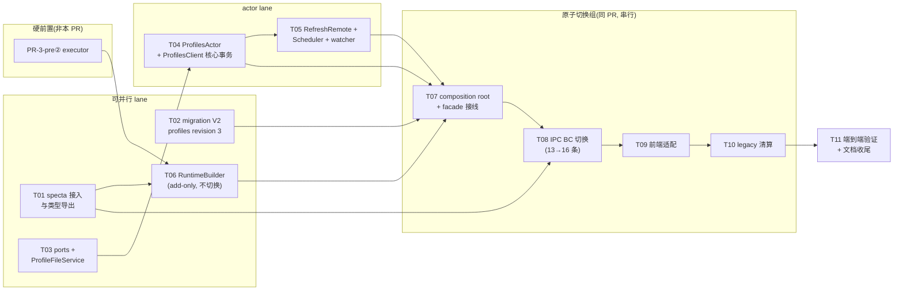

# PR-3(R-3) — profiles 域切换 任务拆解(task.md)

- **关联设计**: [`./design.md`](./design.md)(下文「design §N」均指该文件章节)
- **拆解目标**: 每个任务 = 一个可独立 plan、独立执行、独立过审的 commit 组(1–3 个 conventional commit);任务卡自带 scope、接口契约与验证判据,供后续用 `superpowers:writing-plans` 逐卡展开为 bite-sized plan(执行时配合 `superpowers:subagent-driven-development` 或 `executing-plans`)。
- **分支策略**: 单一 feature 分支(建议 `refactor/pr3-profiles-domain-switch`),任务按依赖序落 commit;T07–T10 为**原子切换组**(见 §4),必须同 PR 合并。

---

## 0. 全局约束(每张任务卡隐含,plan 时逐条带入)

1. CLAUDE.md 铁律:无新 `::global()` / 静态可变服务;依赖显式注入;Tauri 隔离在适配器后。
2. `state/profiles.rs` + `client/profiles.rs` **禁止** import `tauri::*` / `crate::config::Config`(design D10)。
3. RPC 超时:读 `call(_, Some(PROFILES_READ_TIMEOUT))`(5s 域内常量)、写 `call(_, None)`;写 handler 禁无界 I/O(design D9)。
4. 全部 mutation 走七步事务:clone→mutate→`validate()`→scheduler diff→原子持久化→commit→重建索引+reconcile;commit 后副作用失败 = 降级不回滚(design D5)。
5. 本 PR 允许的旧全局消费点仅:`Config::runtime()` 写产物、`CoreManager::global().update_config()`、D12 取数点——全部标 `TODO(actor-migration)` 注释(格式见 design §8),台账 B8。
6. 测试不 sleep,同步用 `RpcReplyPort` ack;ports 兼容 `mockall::automock`。
7. 硬前置:**PR-3-pre②(runtime pipeline executor)已合并**;PR-3-pre①(snapshot store v2,当前分支)已合并。未满足时 T06 及其下游全部阻塞。
8. 中间态规则:每个 commit 必须 `cargo build` + `cargo test` 绿;「应用端到端可运行」只在原子切换组边界(T07 之前 / T10 之后)保证。

---

## 1. 任务依赖图



**并行性**: T01 / T02 / T03 三者零文件重叠,可同时开工;T06 依赖 P2+T01;T04→T05 串行(同文件);切换组 T07–T10 严格串行。

---

## 2. 任务总表

| #   | 任务                                | scope(一句话)                                                   | 建议 commit                                                                | 依赖            | design 锚点      |
| --- | ----------------------------------- | --------------------------------------------------------------- | -------------------------------------------------------------------------- | --------------- | ---------------- |
| T01 | specta 接入与类型导出               | tauri 依赖 nyanpasu-config,新类型逐 variant 导出 TS             | `feat(tauri): export nyanpasu-config profile types via specta`             | —               | §3 D11, §11      |
| T02 | migration profiles revision 3       | legacy profiles.yaml → clean schema(Value 层)                   | `feat(migration): add profiles revision 3 legacy-to-clean schema step`     | —               | §10, 图 13.4     |
| T03 | ports + ProfileFileService          | 三个窄 trait + fs/http 具体实现                                 | `feat(tauri): add profile fs/subscription ports and file service`          | —               | §7               |
| T04 | ProfilesActor + ProfilesClient      | 事务化状态归属 + 全部同步写消息                                 | `feat(tauri): add ProfilesActor with transactional profile state`          | T03             | §6, 图 13.1/13.5 |
| T05 | RefreshRemote + scheduler + watcher | 下载-提交分离、定时 reconcile、External 监听                    | `feat(tauri): add remote update scheduler and external watchers`           | T04             | §7, 图 13.3      |
| T06 | RuntimeBuilder(add-only)            | executor 输入组装 + golden 对照,不动调用点                      | `feat(tauri): add RuntimeBuilder over runtime pipeline executor`           | P2, T01         | §8, 图 13.2      |
| T07 | composition root + facade 接线      | spawn actor、facade 方法、rebuild 链路切换                      | `feat(tauri): wire ProfilesActor and RuntimeBuilder into composition root` | T02,T04,T05,T06 | §5, §6.4         |
| T08 | IPC BC 切换                         | 13 条旧命令 → 16 条 thin adapter                                | `feat(tauri)!: rewrite profile IPC commands against NyanpasuClient`        | T01, T07        | §9               |
| T09 | 前端适配                            | 新绑定 + current 单值化 + 最小 Composition 交互                 | `feat(frontend)!: adapt profiles UI to single current and new bindings`    | T08             | §11              |
| T10 | legacy 清算                         | 删 config/profile/\*\*、Config::profiles()、ProfilesJobGuard 等 | `refactor(tauri)!: remove legacy profiles types and accessors`             | T09             | §14 T3.8, §16    |
| T11 | 端到端验证 + 文档收尾               | e2e 冒烟、roadmap 状态行、台账 B8 登记                          | `docs: update actor migration roadmap for PR-3`                            | T10             | §15, §16         |

---

## 3. 任务卡

### T01 — specta 接入与类型导出

**目标**: tauri crate 依赖 `nyanpasu-config`,新 profile 域类型可生成 TS 绑定;旧代码零行为变化(add-only)。

**Files**:

- Modify: `backend/tauri/Cargo.toml`(加 `nyanpasu-config` workspace 依赖)
- Modify: `backend/tauri/src/lib.rs`(specta builder 注册新类型)
- Generated: `frontend/interface/src/ipc/bindings.ts`(仅新增类型,命令未变)

**Interfaces — Produces**(T08/T09 依赖):

- TS 侧命名类型:`Profiles`、`ProfileItem`、`ProfileDefinition` 及其逐 variant 命名导出(`FileConfig`/`CompositionConfig`/`OverlayTransform`/`ScriptTransform`/`ProfileSourceLocal`/`ProfileSourceRemote`…,具体命名 plan 时定,原则 = design D11:嵌套 tagged enum 不内联递归)
- `ProfileMetadataPatch` / `RemoteProfileOptionsPatch` 的 TS 形态(`double_option` 三态字段)

**验证**:

- `cargo build -p clash-nyanpasu` 绿;TS 绑定生成命令成功且产物含全部命名类型
- CI TS diff 检查在位(绑定产物入库,diff 即 fail)
- 风险探针:specta 2.x 对嵌套 tagged enum 的推导问题**在本任务暴露**(design §17 风险 2)——若推导失败,方案调整只影响本卡

**单独 plan 时读**: design §11、D11;`backend/nyanpasu-config/src/profile/` 各类型的 serde/specta 属性。

---

### T02 — migration V2 `profiles` revision 3

**目标**: 注册 revision 3 step,把 legacy `profiles.yaml` 在 Value 层转换为 clean schema;`.bak` 备份;歧义显式失败;幂等重入。

**Files**:

- Modify: `backend/tauri/src/core/migration/modules/profiles.rs`(现 revision 1 `:47` / revision 2 `:114` 之后新增)
- Create: 迁移 fixtures(旧格式样本 YAML,建议随测试内联或 `tests/fixtures/`)

**规则清单**(全部来自 design §10,plan 时逐条转为测试):

- 类型映射四则;字段移动五组(`chain→global_transforms`、`local/remote.chain→File.transforms`、`script_type→runtime`、`file+updated→MaterializedFile`、`url/option/extra→ProfileSource::Remote`)
- `extra.expire:0→None`;`update_interval→update_interval_minutes`;URL-file→Remote(design §14.2)
- multi-current:`[]→None`、`[a]→Some(a)`、`[a,b,c]→CompositionConfig{base:Some(a),extend:[b,c]}` + 碰撞安全 uid,顺序原样;成员无法映射 → **显式失败**(`MigrationError{uid, field_path}`)
- 收尾:反序列化为新 `Profiles` → `validate()` → 原子写回

**Interfaces — Produces**: revision 3 落账后,`profiles.yaml` 为新 schema(T07 spawn 前提);`MigrationStep` 实现遵循 `core/migration/mod.rs:83` trait(含 `rollback`)。

**验证**:

- fixtures 覆盖 design §10 全规则 + clean-design §18 第 24–27 条;幂等重入测试;`.bak` 生成断言
- 仿 `runner.rs:367` 的端到端样板(1.6.1 全量旧样本 → revision 3 → 新 schema 可 validate)
- `cargo test -p clash-nyanpasu migration` 绿

**单独 plan 时读**: design §10;guide §6;clean-design §14;`core/migration/{mod.rs, registry.rs, runner.rs:367, modules/profiles.rs}`。

---

### T03 — ports + ProfileFileService

**目标**: 定义消费方拥有的三个窄 trait 并提供具体实现;纯增量,无调用方。

**Files**:

- Create: `backend/tauri/src/state/profiles/ports.rs`(或 `state/profiles.rs` 内 mod;plan 时定,保持 Tauri-free)
- Create: `backend/tauri/src/service/profile_file.rs`(`ProfileFileService`)
- Modify: `backend/tauri/src/service/mod.rs` / `lib.rs`(模块声明)

**Interfaces — Produces**(T04/T05/T07 依赖,签名以此为准):

```rust
#[cfg_attr(test, mockall::automock)]
pub trait ProfileFsPort: Send + Sync + 'static {
    fn read(&self, path: &ManagedProfilePath) -> anyhow::Result<String>;
    fn write_atomic(&self, path: &ManagedProfilePath, content: &str) -> anyhow::Result<()>;
    fn remove(&self, path: &ManagedProfilePath) -> anyhow::Result<()>;
    fn ensure_not_symlink(&self, path: &ManagedProfilePath) -> anyhow::Result<()>;
    fn ensure_symlink(&self, path: &ManagedProfilePath, target: &ExternalProfilePath) -> anyhow::Result<()>;
}
#[cfg_attr(test, mockall::automock)]
pub trait SubscriptionFetcher: Send + Sync + 'static {
    async fn fetch(&self, url: &Url, options: &RemoteProfileOptions) -> anyhow::Result<FetchedSubscription>;
}
#[cfg_attr(test, mockall::automock)]
pub trait RebuildNotifier: Send + Sync + 'static {
    fn request_rebuild(&self);
}
pub struct FetchedSubscription { pub content: String, pub subscription: SubscriptionInfo }
// ProfileFileService::new(paths: PathResolver, http: reqwest::Client) — 同时 impl ProfileFsPort + SubscriptionFetcher
```

**验证**:

- 单测(tempdir):原子写、`ensure_not_symlink` 对符号链接拒绝、YAML 规范化读、`fetch` 网络超时自管(mock http 或 feature-gate)
- `state/profiles/` 无 `tauri::*` / `crate::config` import(grep 断言)

**单独 plan 时读**: design §7、D9、D10;`utils/path.rs:40,94,99`(PathResolver);clean-design §9 末段(符号链接防御)。

---

### T04 — ProfilesActor + ProfilesClient(核心事务)

**目标**: profiles 状态归属 actor;全部**同步写消息**落地(Add/Delete/Reorder/PatchMetadata/PatchRemoteOptions/ReplaceDefinition/SetCurrent/SetGlobalTransforms/Replace)+ Get 读;七步事务 + 依赖索引 + `CommitReport`。**不含** RefreshRemote/scheduler/watcher(→T05,缩小审查半径)。

**Files**:

- Create: `backend/tauri/src/state/profiles.rs`(actor;若 T03 用了子目录则为 `state/profiles/mod.rs` + `actor.rs`)
- Create: `backend/tauri/src/client/profiles.rs`(`ProfilesClient`)
- Modify: `backend/tauri/src/state/mod.rs`、`client/mod.rs`(仅模块声明,facade 方法留给 T07)

**Interfaces — Consumes**: T03 三 trait + `PersistentStateManager<Profiles>`(`nyanpasu-core/src/state/manager/persistent_state.rs:128`)+ `nyanpasu-config` patch.rs 分层 mutator + `ProfileDependencyIndex`(`dependency.rs:10`)。

**Interfaces — Produces**(T05/T07/T08 依赖):

```rust
pub struct ProfilesClient { /* ActorRef 私有 */ }
impl ProfilesClient {
    pub async fn get(&self) -> Result<Arc<Profiles>, ProfilesError>;                    // call(_, Some(PROFILES_READ_TIMEOUT))
    pub async fn add(&self, req: NewProfileRequest, initial_file: Option<String>) -> Result<CommitReport, ProfilesError>;
    pub async fn delete(&self, uid: ProfileId) -> Result<CommitReport, ProfilesError>;  // 引用保护
    pub async fn reorder(&self, op: ReorderOp) -> Result<CommitReport, ProfilesError>;
    pub async fn patch_metadata(&self, uid: ProfileId, patch: ProfileMetadataPatch) -> Result<CommitReport, ProfilesError>;
    pub async fn patch_remote_options(&self, uid: ProfileId, patch: RemoteProfileOptionsPatch) -> Result<CommitReport, ProfilesError>;
    pub async fn replace_definition(&self, uid: ProfileId, definition: ProfileDefinition) -> Result<CommitReport, ProfilesError>;
    pub async fn set_current(&self, current: Option<ProfileId>) -> Result<CommitReport, ProfilesError>;
    pub async fn set_global_transforms(&self, ids: Vec<ProfileId>) -> Result<CommitReport, ProfilesError>;
    pub async fn replace(&self, profiles: Profiles) -> Result<CommitReport, ProfilesError>;
}
pub struct CommitReport { pub snapshot: Arc<Profiles>, pub affects_current: bool }
pub struct NewProfileRequest { pub metadata: ProfileMetadata, pub definition: ProfileDefinition }  // uid 服务端生成(D13)
pub enum ReorderOp { Move { active: ProfileId, over: ProfileId }, ByList(Vec<ProfileId>) }
pub enum ProfilesError { ProfileNotFound, ProfileInUse { referrers: Vec<ProfileId> }, ProfileHasNoFile,
                         ValidationFailed(Vec<ProfileValidationError>), NotARemoteProfile,
                         FileNotWritable { reason: String }, RefreshFailed { message: String }, Rpc(String) }
pub const PROFILES_READ_TIMEOUT: Duration = Duration::from_secs(5);
pub struct ProfilesActorArgs { pub paths: PathResolver, pub fs: Arc<dyn ProfileFsPort>,
                               pub fetcher: Arc<dyn SubscriptionFetcher>, pub notifier: Arc<dyn RebuildNotifier>,
                               pub initial: Profiles }
```

**验证**(mock ports + tempdir manager spawn,不 sleep):

- 每条消息 happy path;`ValidationFailed` 不落盘不改内存;`Delete` 五类引用全部拒绝(`ProfileInUse.referrers` 正确);`affects_current` 判定(改 current 传递闭包内/外各一例)
- 写路径 `call(_, None)`、读路径 `call(_, Some)` 有断言;Add 写初始文件、Delete 按 binding 清理(Managed 删 / Symlink 只删链接 / Mirror 删副本 / Composition 无操作)
- `cargo test -p clash-nyanpasu profiles` 绿

**单独 plan 时读**: design §6 全部、图 13.1/13.5;patch-interface §4–6;clean-design §13/§16/§17;PR-2b spec §6–7(actor 同构样板);现 `state/verge.rs`(消息/manager 用法参考)。

---

### T05 — RefreshRemote + RemoteUpdateScheduler + External watcher

**目标**: 订阅刷新与外部文件同步纳入 actor:下载-提交分离(`RefreshRemote` 挂起 reply → 子任务下载 → `CommitRefreshed` 串行提交)、定时表 reconcile、Symlink/Mirror watcher、后台提交经 `RebuildNotifier` 通知。

**Files**:

- Modify: `backend/tauri/src/state/profiles.rs`(新增消息 `RefreshRemote`/`CommitRefreshed`/`ExternalFileChanged`、`pending_refresh` 表、`post_start` 首次 reconcile、scheduler 子任务)
- Create(如拆文件): `backend/tauri/src/state/profiles/scheduler.rs`
- Modify: `backend/tauri/src/client/profiles.rs`(+`refresh(uid, Option<RemoteProfileOptionsPatch>) -> Result<CommitReport, ProfilesError>`)

**Interfaces — Consumes**: T04 全部 + T03 `SubscriptionFetcher`/`ProfileFsPort`/`RebuildNotifier`。
**Interfaces — Produces**: `ProfilesClient::refresh(...)`(T07/T08 的 `update_profile` 链路);scheduler/watcher 对外不可见(actor 内部)。

**行为要点**(plan 时逐条转测试):

- handler 内零网络 I/O;下载任务超时自管(options 派生);失败路径必结清挂起 reply
- reconcile 幂等:新增/修改/Local↔Remote 切换/删除四类 diff(clean-design §18 第 22 条)
- watcher:Symlink 监听 target 真实路径、Mirror 变化→临时文件→校验→原子替换(design §7;clean-design §10)
- `CommitRefreshed` 时 uid 已被删除 → 丢弃结果、结清 reply(design §17 竞态行)
- 后台提交且 `affects_current` → `notifier.request_rebuild()` 恰好一次

**验证**: mock fetcher 注入可控延迟/失败;watcher 用 tempdir 真实文件事件或注入触发;全程无 sleep(用消息 ack/通道)。

**单独 plan 时读**: design §7、图 13.3、D8/D9、§18 O1/O3;clean-design §9/§10;现 `core/tasks/jobs/profiles.rs:49-139`(被取代者的 cron diff 语义参考)。

---

### T06 — RuntimeBuilder(add-only,不切换调用点)

**目标**: 新建 `RuntimeBuilder` 纯 service + 两个 executor 适配器;golden 对照测试证明与旧 `enhance()` 产物等价。**本卡不改 `Config::generate()`、不删旧 enhance 逻辑**——行为切换在 T07,保证本卡纯增量、可独立回滚。

**Files**:

- Create: `backend/tauri/src/enhance/runtime_builder.rs`(`RuntimeBuilder` + `RuntimeBuildInput`/`FinalizeParams`)
- Create: `backend/tauri/src/enhance/content_source.rs`(`FsProfileContentSource: ProfileContentSource`,按 `ManagedProfilePath` 读物化文件)
- Modify: `backend/tauri/src/enhance/script/`(为现 boa/lua runner 加 `ScriptRunner` trait impl 包装,不动原逻辑)
- Create: golden fixtures(旧行为样本:单 current、multi-current→Composition、scoped chain、global chain、builtin 门控、HANDLE_FIELDS overlay、whitelist 过滤)

**Interfaces — Consumes**: PR-3-pre② 交付的 `ProfileContentSource`/`ScriptRunner` ports 与 executor 入口、`RuntimeArtifact`;`enhance/chain.rs:145` builtin 门控表(组装为 `Vec<BuiltinTransform>` 传参)。
**Interfaces — Produces**(T07 依赖):

```rust
pub struct RuntimeBuildInput { pub profiles: Arc<Profiles>, pub guard_overrides: ClashGuardOverrides,
                               pub finalize_params: FinalizeParams, pub builtins: Vec<BuiltinTransform> }
impl RuntimeBuilder {
    pub fn build(input: RuntimeBuildInput, content: &dyn ProfileContentSource, scripts: &dyn ScriptRunner)
        -> Result<RuntimeArtifact>;
}
```

**验证**:

- golden 对照:同输入下 `RuntimeBuilder::build` 产物与旧 `enhance()` 等价(design §15「最高风险项」;PR-3-pre② T3p.6 fixtures 复用为回归)
- `RuntimeArtifact.step_logs` 能还原旧 `postprocessing_output` 消费需求
- 纯度断言:`runtime_builder.rs` 无 `Config::` / `tauri::` import(D12 取数不在本卡——输入全部显式传参)

**单独 plan 时读**: design §8、图 13.2、D7/D12;roadmap §4.4(executor 交付形态);`enhance/mod.rs:22-104`、`enhance/chain.rs:59-160`(旧语义源)。

---

### T07 — composition root + facade 接线(⚠️ 切换组起点)

**目标**: spawn `ProfilesActor` 进 composition root;`NyanpasuClient` 暴露全部 profiles 域方法 + `rebuild_running_config()`;`Config::generate()` 改调 RuntimeBuilder;`RebuildNotifier` 接线。**自本卡起应用进入 BC 中间态**(旧 IPC 仍在但底层已切换,见 §4)。

**Files**:

- Modify: `backend/tauri/src/setup.rs` / `client/mod.rs`(spawn 顺序:migration 子进程已完成 → 构造 ProfileFileService → spawn ProfilesActor → 构造 ProfilesClient → facade;`RebuildNotifier` 具体实现接到 facade 重建入口,注意用 `Weak`/channel 避免循环持有)
- Modify: `backend/tauri/src/config/core.rs:88`(`generate()` 改调 RuntimeBuilder;产物仍写 runtime draft + `generate_file`,两处标 `TODO(actor-migration)` B8)
- Modify: `backend/tauri/src/client/mod.rs`(新 facade 方法;旧 `patch_profiles_config:80` 本卡保留——删除在 T10)

**Interfaces — Produces**(T08 依赖,方法名以此为准):

```rust
impl NyanpasuClient {
    pub async fn get_profiles(&self) -> Result<Arc<Profiles>>;
    pub async fn add_profile(&self, req: NewProfileRequest, initial_file: Option<String>) -> Result<()>;
    pub async fn delete_profile(&self, uid: ProfileId) -> Result<()>;
    pub async fn reorder_profile(&self, active: ProfileId, over: ProfileId) -> Result<()>;
    pub async fn reorder_profiles_by_list(&self, list: Vec<ProfileId>) -> Result<()>;
    pub async fn refresh_profile(&self, uid: ProfileId, patch: Option<RemoteProfileOptionsPatch>) -> Result<()>;
    pub async fn patch_profile_metadata(&self, uid: ProfileId, patch: ProfileMetadataPatch) -> Result<()>;
    pub async fn patch_remote_profile_options(&self, uid: ProfileId, patch: RemoteProfileOptionsPatch) -> Result<()>;
    pub async fn replace_profile_definition(&self, uid: ProfileId, definition: ProfileDefinition) -> Result<()>;
    pub async fn activate_profile(&self, uid: Option<ProfileId>) -> Result<()>;
    pub async fn set_global_transforms(&self, ids: Vec<ProfileId>) -> Result<()>;
    pub async fn get_profile_materialized_path(&self, uid: ProfileId) -> Result<PathBuf>;   // Composition → ProfileHasNoFile
    pub async fn read_profile_file(&self, uid: ProfileId) -> Result<String>;
    pub async fn save_profile_file(&self, uid: ProfileId, data: String) -> Result<()>;      // 仅 Local/Managed
    pub async fn rebuild_running_config(&self) -> Result<()>;   // 快照→RuntimeBuilder→runtime draft→CoreManager(TODO B8)
}
```

写方法内部统一模式:`CommitReport.affects_current == true` → 顺序调用 `rebuild_running_config()`(facade 编排,design §6.4)。

**验证**:

- 启动冒烟(顺序断言:migration 先于 spawn);`rebuild_running_config` 集成测试(mock 或真实 executor)
- 台账检查:本卡新增 TODO 注释恰好覆盖 design §8 所列两处 + D12 取数点

**单独 plan 时读**: design §5/§6.4/§8、图 13.2;PR-2b spec §10.2(composition root 顺序样板);`setup.rs`/`lib.rs:120,362-398` 现状。

---

### T08 — IPC BC 切换(13 → 16 条)

**目标**: `ipc.rs` 全部 profile 命令重写为 thin adapter;新增/拆分命令注册进 specta builder 与 handler 列表;域错误 → 命令错误映射。

**Files**:

- Modify: `backend/tauri/src/ipc.rs:102-382`(13 条命令按 design §9 表逐条替换;`patch_profiles_config`/`patch_profile` 删除,5 条新命令加入)
- Modify: `backend/tauri/src/lib.rs`(command 注册表 + specta 导出)
- Modify: `backend/tauri/src/feat.rs:441` 附近(`feat::update_profile` 调用点改走 facade;函数本体删除在 T10)
- Generated: `frontend/interface/src/ipc/bindings.ts`(命令面变化——**自本 commit 起前端类型检查红,直至 T09**,见 §4)

**Interfaces — Consumes**: T07 全部 facade 方法。
**Interfaces — Produces**: 16 条命令名(前端 T09 依赖):`get_profiles / enhance_profiles / import_profile / create_profile / reorder_profile / reorder_profiles_by_list / update_profile / delete_profile / activate_profile / set_global_transforms / patch_profile_metadata / patch_remote_profile_options / replace_profile_definition / view_profile / read_profile_file / save_profile_file`。

**验证**:

- 每条命令 = 解析 DTO → facade → 错误映射,**零业务编排**(CLAUDE.md §12 形状检查)
- IPC 集成测试:happy path + `ProfileInUse`/`ProfileHasNoFile`/`ValidationFailed` 映射
- `grep -n "Config::profiles()" backend/tauri/src/ipc.rs` 零命中

**单独 plan 时读**: design §9 全表(每行含 BC 要点);guide §5(逐命令现状签名)。

---

### T09 — 前端适配

**目标**: 前端在新绑定下恢复类型检查绿 + profiles 页全功能;`current` 单值化;多选激活改为最小 Composition 创建交互。

**Files**(代表锚点,plan 时全量盘点):

- Regenerate: `frontend/interface/src/ipc/bindings.ts`
- Modify: `frontend/interface/src/ipc/use-profile.ts:167` 及同文件相关 hook(命令改名/拆分)
- Modify: `frontend/nyanpasu/src/pages/(main)/main/profiles/` 下 `current` 消费点(如 `active-button.tsx:21` 的 `current?.find(...)` → `current === uid`)
- Modify: profile 编辑对话框(metadata / remote options / definition 三类操作分开提交)
- Create: 「多选 File Config → 创建 Composition」最小交互(design §11 第 3 条;完整管理界面为非目标)

**Interfaces — Consumes**: T08 的 16 条命令 + T01 的 TS 类型。

**验证**:

- 前端类型检查 + 构建绿;profiles 页手动冒烟:导入/创建/激活/重排/编辑文件/删除(含被引用删除的错误 toast)/更新订阅
- 全仓 `patch_profiles_config` / `chain` 字段引用零残留(grep 前端源码)

**单独 plan 时读**: design §11;guide §7.2/§7.3(TS 破坏性变更表);现 profiles 页组件树。

---

### T10 — legacy 清算(切换组终点)

**目标**: 编译期保证 legacy profiles 面零残留。

**Files**:

- Delete: `backend/tauri/src/config/profile/**` 全目录
- Delete: `backend/tauri/src/core/tasks/jobs/profiles.rs`(`ProfilesJob`/`ProfilesJobGuard`)及其注册点
- Modify: `backend/tauri/src/config/core.rs:42`(删 `Config::profiles()` accessor + `ManagedState<Profiles>` 字段)
- Modify: `backend/tauri/src/client/mod.rs:80`(删旧 `patch_profiles_config` 方法)
- Modify: `backend/tauri/src/feat.rs`(删 `feat::update_profile` 本体)
- Modify: `backend/tauri/src/enhance/mod.rs`(删旧 `enhance()` 函数与 legacy chain 解析;`chain.rs` 中仅被旧路径使用的部分一并清理,builtin 表保留给 T06 适配器)

**验证**(design §16 判据 1):

- `grep -rn "Config::profiles()" backend/tauri/src` 零命中
- `grep -rn "config::profile::" backend/tauri/src` 零命中(新代码只 import `nyanpasu_config::profile::`)
- `ProfilesBuilder` / `ProfileBuilder` / `ProfilesJobGuard` 编译期零引用
- `cargo build` + `cargo test` 全绿

**单独 plan 时读**: design §14 T3.8、§16;T08/T09 完成后的实际残留清单(plan 时以 grep 现场盘点为准,不硬编码本卡文件列表)。

---

### T11 — 端到端验证 + 文档收尾

**目标**: 全链路验证 + 迁移账本更新,PR 提交就绪。

**内容**:

1. e2e 冒烟(design §16 判据 2):真实旧 `profiles.yaml` 样本 → migrate 子进程 → `.bak` 在位 → 应用启动 → 激活 profile → `clash-config.yaml` 生成 → 核心可运行;
2. 前端全功能冒烟复核(判据 8);
3. TODO 台账核对(判据 7):`grep -rn "TODO(actor-migration)" backend/tauri/src` 输出与 design §8/D12 清单一致;
4. 文档:`docs/design/actor-migration-roadmap.md` §2.1 状态行更新(PR-3 → 已实施)、§5 台账 B8 登记状态;guide 状态行标注「已实施」。

**验证**: `cargo build && cargo test` + 前端构建全绿;判据 1–8 逐条勾选留痕(PR 描述引用)。

---

## 4. 原子切换组说明(T07–T10)

- **T07 之前**: 每个任务 add-only 或纯 migration step,应用行为不变,任意顺序可独立合入 commit。
- **T07–T10 之间为 BC 中间态**:
  - T07 落地后,运行配置生成链路已切换,但旧 IPC 命令仍消费 legacy 类型——**若此时真实运行且 profiles.yaml 已被 revision 3 迁移,旧命令失读**。因此本组期间只要求「编译 + 测试绿」,不要求应用端到端可运行;
  - T08 落地后前端类型检查红,直至 T09 完成——这是铁律 3(前端 BC 同 PR)的预期形态;
  - **本组四卡必须在同一 PR 内连续完成后再请求 review/merge**,不得单独合入 main。
- **T10 之后**: 应用恢复端到端可运行,进入 T11 验证。

## 5. 执行建议

1. **逐卡出 plan**: 每张卡以「本卡 + design.md 对应章节 + 卡内 Interfaces 契约」为输入,用 `superpowers:writing-plans` 展开为 bite-sized plan(TDD、每步一动作、含完整代码);卡与卡之间只通过 Interfaces 契约耦合,plan 之间不需要互读。
2. **推荐排程**: 先并行 T01/T02/T03(+ T06 若 PR-3-pre② 已合),再 T04→T05,最后一口气完成切换组 T07–T10 + T11。
3. **契约变更规则**: 实施中若需改动任务卡 Produces 签名,先改本文件对应卡(及下游 Consumes),再改代码——本文件是跨卡契约的唯一权威。
