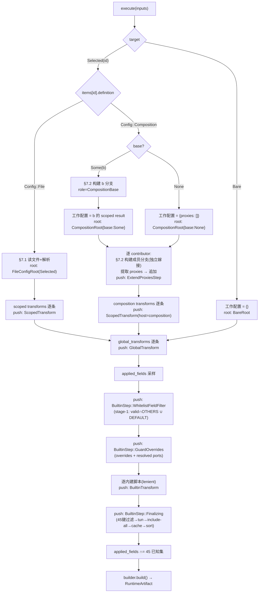
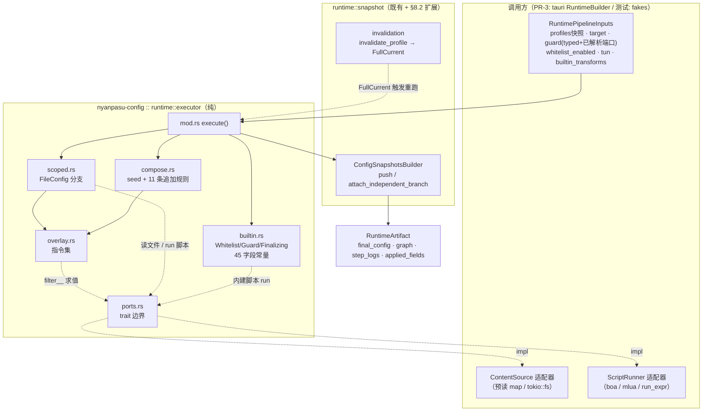
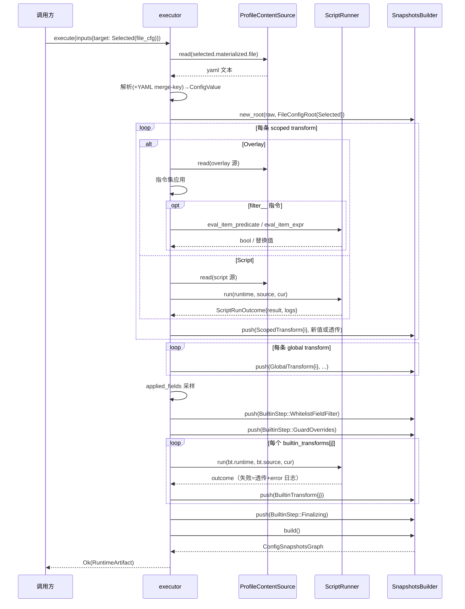
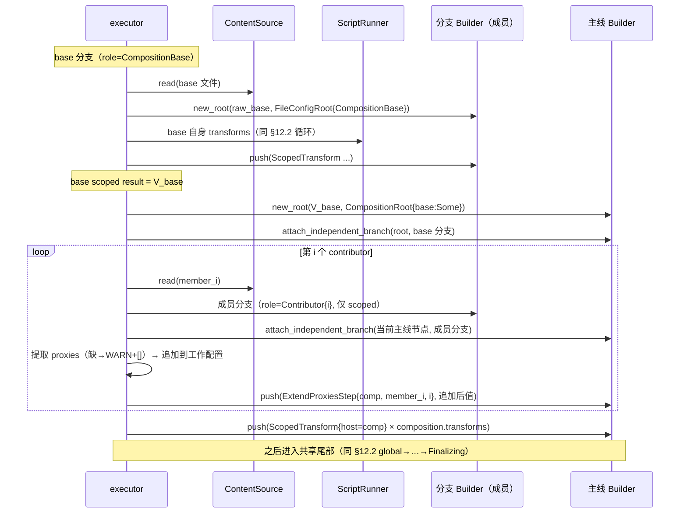
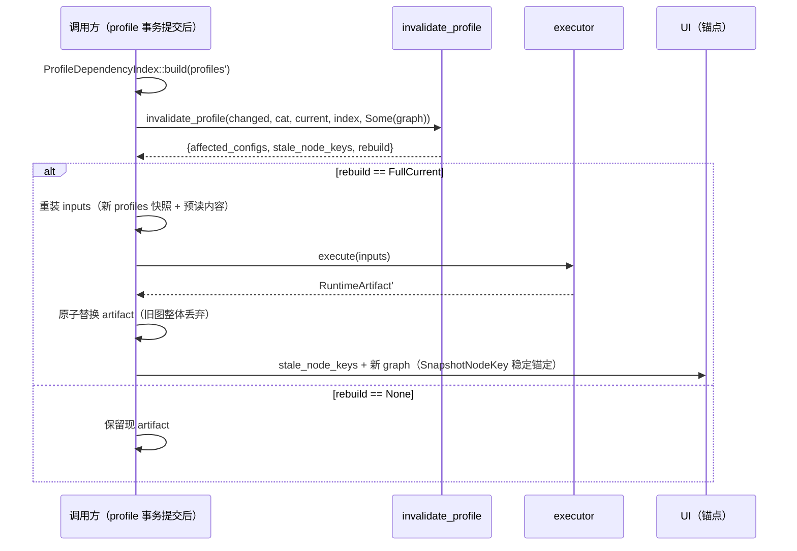
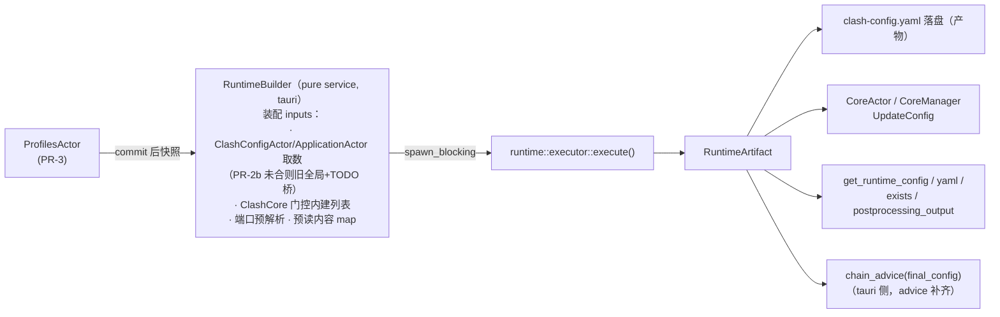

# PR-3-pre② — Runtime Pipeline Executor 设计（纯执行半，nyanpasu-config）

- **日期**: 2026-07-04
- **状态**: 设计稿（待批准；批准后按 writing-plans 拆实施计划）
- **作者**: Jonson Petard（design task with Claude）
- **上游依据**: `docs/design/actor-migration-roadmap.md` §4.4（T3p.1–T3p.6，修正 C5：executor 是 PR-3 的硬前置）
- **规范语义来源**: `docs/design/profile-composition-clean-design.md` §6.1 / §7.1–7.5 / §18
- **基底**: 分支 `refactor/runtime-snapshot-store-v2` @ `d0b3cf6ac`（PR-3-pre① snapshot store v2）
- **行为对照基线**: `backend/tauri/src/enhance/`（实测测绘 2026-07-04，逐条 `file:line`）

---

## 1. 摘要

`nyanpasu-config` 的 runtime 模块目前只有「数据结构半」：`ConfigSnapshotsBuilder` 自述是 "Pure recorder for the pipeline executor"（`runtime/snapshot.rs:351-353`），`BuiltinStepKind` 只是 tag（`snapshot.rs:70-76`），**没有任何代码读 profile 内容、应用 Overlay、跑 JS/Lua、合并 proxies、过滤 whitelist**。本设计补上「执行半」：

> 给定 `Profiles` 快照 + 文件内容（经 port 注入）+ Clash 域守卫参数，**纯地、确定地**执行 clean-design §7.1–7.5 的五种处理顺序与最终阶段，产出 `RuntimeArtifact { final_config, graph, step_logs, applied_fields }`。

执行器是 **pure service**（CLAUDE.md §8）：无 IO、无 Tauri、无 actor、无全局；文件读取与脚本执行经两个 crate 内 trait port（`ProfileContentSource` / `ScriptRunner`）由调用方注入。它是 PR-3（profiles 域切换）的硬前置——profiles.yaml 一旦迁到新 schema，旧 `enhance()`（直读 legacy `Profiles`，`enhance/mod.rs:38-76`）立即失读。

**范围内的唯一 tauri 无关缝隙**：为记录内建增强脚本与 bare 模式，`OperatorTag`/`SnapshotNodeKey` 需要一次受控扩展（§8.2，wire 前向兼容，缓存契约兜底）。

---

## 2. 目标 / 非目标

### 目标

1. 五种处理顺序（§7.1–7.5）的完整纯实现，逐步经 `ConfigSnapshotsBuilder::push / attach_independent_branch` 录制。
2. `extend_proxies_from` 11 条追加规则的逐条落实（clean-design §7.5）。
3. 三个 BuiltinStep 的真实逻辑：`WhitelistFieldFilter` / `GuardOverrides` / `Finalizing`，语义与旧 `enhance()` 等价（对照台账 §13）。
4. 内建增强脚本建模为**调用方组装的有序参数列表**，executor 不含任何 `ClashCore` 判断。
5. 输出 `RuntimeArtifact`，完整覆盖旧 `IRuntime { config, exists_keys, postprocessing_output }` 三元组的消费需求（`config/runtime.rs:19-26`）。
6. bare 模式（`current = None`）：复刻旧「无激活配置仍产出可用运行配置」的行为（旧路径实测见 §4.3）。
7. 与失效机制集成：`invalidate_profile` → `SnapshotRebuild::FullCurrent` → 重跑 executor，`SnapshotNodeKey` 锚点跨重建稳定。
8. 确定性不变式：相同输入 + 相同 port 应答 ⇒ 逐字节相同的 artifact（消除旧实现两处 `HashSet` 顺序不确定性，§13 #1/#2）。

### 非目标（明确范围外）

- tauri 侧接线：`RuntimeBuilder` 装配、boa/lua runner 适配、`enhance()` 替换、IPC 改造 —— 全部归 PR-3（roadmap T3.7）。
- `Config::runtime()` / `IRuntime` 删除、artifact 存放点 —— 归 PR-4。
- Pipeline IR、StepId、GUI preview/diff、Script 静态分析（clean-design §3 既有推迟项）。
- 增量子树重建（失效策略已锁定整图 `FullCurrent`，`runtime/invalidation.rs:14-22`）。
- `advice`（`enhance/advice.rs` 的 `chain_advice`）：纯分析 + Tauri 对话框副作用，不属于配置生成，留在 tauri 侧对 `final_config` 调用（§9.3）。
- 脚本引擎本体（boa/mlua 不进 `nyanpasu-config` 依赖）。

---

## 3. 锁定的架构决策

| #   | 决策项           | 结论                                                                                                                                                                                                                                                                                                                                             |
| --- | ---------------- | ------------------------------------------------------------------------------------------------------------------------------------------------------------------------------------------------------------------------------------------------------------------------------------------------------------------------------------------------ |
| D1  | 形态             | pure service：同步、顺序、无 IO/时钟/随机；文件与脚本经 port 注入                                                                                                                                                                                                                                                                                |
| D2  | ports            | `ProfileContentSource`（按 `ManagedProfilePath` 读文本）+ `ScriptRunner`（整配置变换 `run` + Overlay `filter__` 所需的两个 item 级 Lua 求值方法，§6.2；roadmap T3p.1 勘误：仅 `run` 不够，实测 `use_merge` 内嵌 per-item Lua，`enhance/merge.rs:62-97`）                                                                                         |
| D3  | 内建脚本         | `&[BuiltinTransform { name, runtime, source }]` 由调用方按 `ClashCore` bitflags 预门控、按序传入（旧门控表 `enhance/chain.rs:170-175`）；executor 零核类型知识                                                                                                                                                                                   |
| D4  | 最终阶段节点划分 | 4 类节点：`WhitelistFieldFilter`（旧 stage-1 过滤）→ `GuardOverrides`（旧 HANDLE 覆盖）→ `BuiltinTransform`×N（旧内建脚本）→ `Finalizing`（旧 stage-2 过滤 + tun + include-all + cache + sort 复合单节点）。顺序依据旧实测 `enhance/mod.rs:107→110→121→146-150`；snapshot.rs 演示测试中的 Guard→Whitelist 顺序为非规范演示，随本 PR 修正（§8.3） |
| D5  | tag 扩展         | 新增 `OperatorTag::BareRoot` 与 `OperatorTag::BuiltinTransform`；`GlobalTransform` / `BuiltinStep` / `BuiltinTransform` 的 `selected_profile_id` 改为 `Option<ProfileId>`（bare 模式复用同一条尾部管线）。`SnapshotNodeKey` 同步。wire 前向兼容 + 缓存严格解码契约兜底（§8.2）                                                                   |
| D6  | guard 输入       | typed：`&ClashGuardOverrides`（serde 序列化取 kebab-case 键）+ `ResolvedPortBindings`（端口/external-controller 由**调用方**预解析——`PortStrategy::pick_and_try_port` 带 socket 探测 IO，绝不进 executor）                                                                                                                                       |
| D7  | 错误策略         | 双层：**结构性失败 strict**（选中/base/contributor 的 Config 文件读取或解析失败 → typed error，调用方保留上一份 artifact 降级）；**变换级失败 lenient**（Overlay/Script/内建脚本失败 → 该节点值透传 + error 日志锚定于节点，管线继续；复刻旧 `process_chain` 语义，`enhance/utils.rs:114-119`）                                                  |
| D8  | 日志             | `StepLogEntry { level: Log\|Info\|Warn\|Error, message }`（serde lowercase，1:1 对齐旧 `LogSpan`/`Logs`，`enhance/utils.rs:18-38`）；按 `SnapshotNodeKey` 锚定为 `Vec<StepLog>`，不引入 StepId                                                                                                                                                   |
| D9  | applied_fields   | = 全局变换后节点的顶层键（小写、保持插入序）∩ 45 已知字段集，`IndexSet<String>`；覆盖旧 `exists_keys` 语义（含「无条件相交」怪癖），修复其 `HashSet` 乱序（`enhance/mod.rs:155-157`）                                                                                                                                                            |
| D10 | Overlay 语义     | 全量复刻旧 `use_merge` 指令集（`prepend__/append__/override__/filter__` + 裸键深合并），含「指令键小写化、裸键保留大小写」的不对称怪癖（`merge.rs:248,310-312`），parity 优先、修复留待后续独立提案                                                                                                                                              |
| D11 | 组合宽容化       | `extend_proxies_from` 成员缺 `proxies` 键 → 记 WARN + 视为空列表；工作配置缺 `proxies` → 建空列表再追加。旧 `merge_profiles` 在此**直接 panic**（`enhance/utils.rs:83-84` 双 `unwrap`），故意差异 #3                                                                                                                                             |
| D12 | 并发             | 不并发。旧 scoped chains 经 `join_all` 并发只是性能优化（结果按 `IndexMap` 序收集，语义顺序无关）；纯执行器按声明序串行，输出等价。调用方可整体 `spawn_blocking`（§10.3）                                                                                                                                                                        |
| D13 | 解析契约         | Config/Overlay 文件：YAML 文本 → `serde_yaml_ng::Value` → **应用 `<<:` merge key** → `ConfigValue::try_from`（拒绝非字符串键与 YAML tag）。复刻旧 `read_merge_mapping`（`utils/help.rs:45-57`）；strict 差异见 §13 #8                                                                                                                            |
| D14 | artifact 序列化  | `RuntimeArtifact` 不整体 derive `specta::Type`（`ConfigValue` 无 specta）；graph/step_logs/applied_fields 各自可序列化，`final_config` 经 `to_json()` 投影，DTO 组装归 PR-3/PR-4                                                                                                                                                                 |

---

## 4. 现状（迁移起点，全部实测）

### 4.1 nyanpasu-config runtime 模块（执行半缺失）

- `ConfigSnapshotsBuilder`：`new_root(root_value, tag)` / `push(tag, value) -> NodeId`（主线追加并推进游标）/ `attach_independent_branch(parent_id, branch)`（嫁接独立分支，分支根强制 `Independent` + `Full` keyframe，主线游标不动）/ `build_stored()` / `build()`（`snapshot.rs:354-485`）。
- `OperatorTag` 六变体：`FileConfigRoot{profile_id, role}` / `CompositionRoot{profile_id, base}` / `ExtendProxiesStep{composition_id, contributor_profile_id, contributor_index}` / `ScopedTransform{host, role, transform, kind, step_index}` / `GlobalTransform{selected, transform, kind, step_index}` / `BuiltinStep{selected, step}`（`snapshot.rs:79-113`）；`node_key()` 纯派生语义位置键 `SnapshotNodeKey`（丢弃展示性字段，跨重建稳定，`snapshot.rs:115-162`）。
- `ConfigExecutionRole`：`Selected` / `CompositionBase{composition_id}` / `CompositionContributor{composition_id, contributor_index}`（`snapshot.rs:55-67`）。
- 五种处理顺序的**录制形态已由测试锁定**（builder 模拟，非执行）：`snapshot.rs:1444-1741`——本设计的录制契约（§8.1）与其逐一对齐。
- 失效：`invalidate_profile(changed, category, current, index, graph) -> SnapshotInvalidation{affected_configs, stale_node_keys, rebuild: None|FullCurrent}`（`invalidation.rs:38-78`），沿 base/extend 两表传递闭包。
- 值模型 `ConfigValue`：结构共享（容器 `Arc` 包裹，路径更新只克隆 spine）、保序、custom serde；`try_from(serde_json/serde_yaml_ng::Value)`、`to_json()`、`set_path/remove_path`（`runtime/value/mod.rs:14-52`、`value/path.rs`）。
- 持久化 feature `snapshot-persistence` 默认关闭；archive v2 严格解码，**任何解码失败 = cache miss 重建**（契约注释 `snapshot.rs:945-959`）。

### 4.2 profile / clash 域输入面（#4840 已合并）

- `Profiles { current: Option<ProfileId>, global_transforms: Vec<ProfileId>, valid: Vec<String>, items: IndexMap<ProfileId, ProfileItem> }`（`profile/profiles.rs:12-30`；`valid` 默认 `["dns","unified-delay","tcp-concurrent"]`，`:423-429`）。
- `ConfigDefinition::File(FileConfig{source, transforms})` / `Composition(CompositionConfig{base: Option<ProfileId>, extend_proxies_from, transforms})`（`profile/definition.rs:15-51`）；`TransformDefinition::Overlay(OverlayTransform{source})` / `Script(ScriptTransform{source, runtime: JavaScript|Lua})`（`:54-96`）。
- **三种来源统一物化**：`ProfileSource::materialized() -> &MaterializedFile{ file: ManagedProfilePath, .. }`（`profile/source.rs:34-47,93-104`）——executor 只经 `ManagedProfilePath` 读内容，不区分 Local/Remote/Symlink/Mirror。
- `Profiles::validate()` 已保证：current 是 Config、transforms 全是 Transform、composition 成员是直接 FileConfig、无自引用/重复 contributor 等（`profiles.rs:128`, 错误集 `:223-293`）。executor 以「已验证快照」为前置，仍防御性返回 typed error 而非 panic。
- Clash 域：`ClashConfig { overrides: ClashGuardOverrides, enable_tun_mode, enable_clash_fields, external_controller, mixed_port, socks_port, http_port, tun_stack, .. }`（`clash/config/mod.rs:27-59`）。`ClashGuardOverrides` 私有字段 `{log_level, allow_lan, mode, secret, unified_delay*, tcp_concurrent*, ipv6}`（kebab-case 序列化，`clash/config/overrides/mod.rs:57-67`；`*` 为 `default-meta` 门控）。**端口是策略类型，解析带 socket 探测 IO**（`clash_strategy/port.rs:58-65`）→ D6。
- App 域仅两个相关输入：`core: ClashCore`（bitflags 五变体，`application/clash_core.rs:24-35`）与 `enable_builtin_enhanced: bool`（`application/mod.rs:129`）——两者只被**调用方**用于组装 `BuiltinTransform` 列表（D3）。

### 4.3 旧 `enhance()` 实测流程（行为对照基线）

`backend/tauri/src/enhance/mod.rs:22-160`，唯一调用点 `Config::generate()`（`config/core.rs:89`）：

```text
 1. clash_config = IClashTemp.0 克隆                          (mod.rs:24)
 2. verge 读 4 项: clash_core / enable_tun / enable_builtin
    / enable_filter(enable_clash_fields)                      (mod.rs:26-35)
 3. profiles 读: current 集 + scoped chains + global chain
    + valid; 文件同步 IO + rayon 并行读                        (mod.rs:38-76)
 4. valid = use_valid_fields(valid)
          = (valid∩OTHERS, 小写) ++ DEFAULT                    (field.rs:67-77)
 5. scoped chains 并发执行(join_all), 链内严格串行              (mod.rs:83-88)
 6. merge_profiles: 首个全量, 其余仅追加 proxies(缺键 panic!)   (utils.rs:72-89)
 7. global chain 串行                                          (mod.rs:102)
 8. exists_keys = use_keys(config)  ← 过滤前快照, 小写保序      (mod.rs:106)
 9. 【stage-1 过滤】whitelist(valid), enable_filter 门控        (mod.rs:107)
10. 【守卫覆盖】HANDLE_FIELDS 9 键从 clash_config 无条件插入,
    绕过 stage-1 白名单                                        (mod.rs:110-116)
11. clash_fields = 45 全集(DEFAULT++HANDLE++OTHERS)            (mod.rs:118)
12. 【内建脚本】enable_builtin 门控, 按核 bitflags 过滤, 串行,
    错误吞掉+透传, 日志被丢弃((res, _))                        (mod.rs:121-144)
13. 【stage-2 过滤】whitelist(clash_fields 45), 同门控          (mod.rs:146)
14. use_tun → use_include_all_proxy_groups → use_cache
    → use_sort                                                (mod.rs:147-150)
15. advice::chain_advice(&config) → 仅产日志(含对话框副作用)     (mod.rs:152)
16. exists_keys ∩= clash_fields — 无条件、经 HashSet 乱序       (mod.rs:155-157)
17. 返回 (config, exists_keys, PostProcessingOutput)
```

关键常量（`enhance/field.rs:4-56`，共 45 键）：

- `HANDLE_FIELDS`（9）：`mode, port, socks-port, mixed-port, allow-lan, log-level, ipv6, secret, external-controller`
- `DEFAULT_FIELDS`（5）：`proxies, proxy-groups, proxy-providers, rules, rule-providers`
- `OTHERS_FIELDS`（31）：`dns, tun, ebpf, hosts, script, profile, payload, tunnels, auto-redir, experimental, interface-name, routing-mark, redir-port, tproxy-port, iptables, external-ui, bind-address, authentication, tls, sniffer, geox-url, listeners, sub-rules, geodata-mode, unified-delay, tcp-concurrent, enable-process, find-process-mode, skip-auth-prefixes, external-controller-tls, global-client-fingerprint`

链条目语义（`enhance/utils.rs:92-127`）：Merge（`use_merge` 永不失败，只产 WARN，`merge.rs:242-318`）；Script 失败 → `logs.error` + 配置**透传**。链引用解析失败（文件缺失等）→ 条目**静默丢弃**（`utils.rs:11-16` 双 `filter_map`）。

**bare 路径实测**（`current` 为空）：`current_mappings` 空 → `merge_profiles` fold 零次 → 空 Mapping → global chain 照跑 → 守卫 9 键插入 → 内建 → tun/cache/sort ⇒ 产出可用裸配置。启动时 `Config::init_config()` 无条件 `generate()`（`config/core.rs:52`），此路径真实存在，必须保留。

`use_tun` 键级语义（`enhance/tun.rs:26-109`）：见 §7.4 Finalizing 表。`use_sort`：已知键按 `HANDLE++OTHERS++DEFAULT` 固定序重排；`enable_filter == false` 时未知键经 `HashSet::difference` **乱序**追尾（`field.rs:115-147`）。

### 4.4 输出消费面（artifact 必须覆盖）

- `IRuntime { config: Option<Mapping>, exists_keys: Vec<String>, postprocessing_output }`（`config/runtime.rs:19-26`）；写入点唯一：`Config::generate()`（`core.rs:87-98`）；落盘 `generate_file` → `clash-config.yaml`（`core.rs:70-85`）。
- IPC 四条（`ipc.rs:400-443`，注册 `lib.rs:213-216`）：`get_runtime_config`（JSON）/ `get_runtime_yaml` / `get_runtime_exists`（注意：**不是** `get_runtime_exists_keys`，roadmap T3p.5 笔误）/ `get_postprocessing_output`。
- `PostProcessingOutput { scopes: IndexMap<ProfileUid, IndexMap<ProfileUid, Logs>>, global: IndexMap<ProfileUid, Logs>, advice: Logs }`（`enhance/chain.rs:21-31`），`Logs = Vec<(LogSpan, String)>`，`LogSpan ∈ {Log, Info, Warn, Error}`（serde lowercase，`utils.rs:18-38`）。
- `enhance()` 的 7 个间接触发点与 4 个 `generate_file` 调用点（PR-3/PR-4 切换清单，见 roadmap）。

---

## 5. 目标模块结构

```text
backend/nyanpasu-config/src/runtime/
├── mod.rs                    # + pub mod executor;
├── snapshot.rs               # 受控扩展: BareRoot / BuiltinTransform 变体、
│                             #   selected_profile_id: Option 化（§8.2）
├── invalidation.rs           # 仅适配 tag 变更（两个 match 臂），策略不动
├── value/                    # 不动
└── executor/
    ├── mod.rs                # RuntimePipelineInputs / ExecutionTarget /
    │                         #   execute() 入口 + 五顺序编排 + 共享尾部
    ├── ports.rs              # ProfileContentSource / ScriptRunner /
    │                         #   ScriptRunOutcome / PortError
    ├── scoped.rs             # scoped FileConfig 分支构建
    │                         #   （parse + 自身 transforms；三种 role 复用）
    ├── compose.rs            # composition seed + proxies 提取/追加（11 条规则）
    ├── overlay.rs            # Overlay 指令集全量语义（旧 use_merge 对位）
    ├── builtin.rs            # Whitelist / Guard / Finalizing 三步实现
    │                         #   + 45 字段常量 + tun/include-all/cache/sort
    ├── artifact.rs           # RuntimeArtifact / StepLog / StepLogEntry / StepLogLevel
    ├── error.rs              # RuntimePipelineError
    └── tests/                # 仿 profile/tests 形态
        ├── mod.rs
        ├── orders.rs         # 五顺序 golden（§6.1 YAML 示例）
        ├── overlay.rs        # 指令集表驱动
        ├── builtin.rs        # 三步 + tun 矩阵
        ├── compose.rs        # 11 条规则逐条
        ├── invalidation.rs   # 失效→FullCurrent→重建集成
        ├── parity.rs         # 旧 enhance() 对照 fixtures（无脚本路径）
        └── fixtures/*.yaml   # include_str! 引入
```

**边界规则**：`executor/` 只依赖 `crate::{profile, clash::config, runtime::{snapshot, value}}` + `serde/serde_json/serde_yaml_ng/indexmap/thiserror/tracing`。禁止：`tokio`、文件/网络 IO、`std::time`、随机数、`port_scanner`、boa/mlua。CI 验证同成功判据 #7。

---

## 6. 输入模型（ports + 参数，完整签名）

### 6.1 输入结构

```rust
// executor/mod.rs
pub struct RuntimePipelineInputs<'a> {
    /// 已通过 Profiles::validate() 的快照。
    pub profiles: &'a Profiles,
    pub target: ExecutionTarget,
    pub guard: GuardInputs<'a>,
    /// ClashConfig.enable_clash_fields —— 门控两段白名单过滤与 sort 的已知键约束。
    pub whitelist_enabled: bool,
    pub tun: TunParams,
    /// 调用方已按 ClashCore bitflags 门控并排序（D3）。
    pub builtin_transforms: &'a [BuiltinTransform],
}

pub enum ExecutionTarget {
    /// Profiles.current 已解析出的选中 Config。
    Selected(ProfileId),
    /// current = None：复刻旧「裸配置」路径（§4.3）。
    Bare,
}

pub struct GuardInputs<'a> {
    /// 序列化后取 kebab-case 顶层键值对整体插入（D6）。
    pub overrides: &'a ClashGuardOverrides,
    /// 调用方预解析（端口探测 IO 不进 executor）。
    pub ports: ResolvedPortBindings,
}

/// 与旧 HANDLE_FIELDS 中 4 个端口类键对位（§7.4 映射表）。
pub struct ResolvedPortBindings {
    pub mixed_port: u16,
    pub port: Option<u16>,        // HTTP 端口（旧键 "port"）
    pub socks_port: Option<u16>,
    pub external_controller: Option<String>,  // "host:port"
}

pub struct TunParams {
    pub enable: bool,
    pub flavor: TunFlavor,
    /// 平台条件作为输入（调用方传 cfg!(windows)），executor 跨平台确定（§7.4）。
    pub windows_fake_ip_filter: bool,
}

/// 调用方从 (core, ClashConfig.tun_stack) 派生，含 Premium+Mixed→Gvisor 降级
/// （旧 tun.rs:58-60 的核知识留在调用方，executor 零核类型）。
pub enum TunFlavor {
    ClashRs,                       // device-id/auto-route 分支（tun.rs:44-50）
    Standard { stack: TunStack },  // stack/dns-hijack/auto-route/auto-detect-interface 分支
}

pub struct BuiltinTransform {
    pub name: Arc<str>,            // 如 "verge_hy_alpn"，进 tag 与日志锚点
    pub runtime: ScriptRuntime,
    pub source: Arc<str>,
}
```

不单列 `valid` 参数：白名单步骤直接读 `profiles.valid`（域内数据不重复注入）。

### 6.2 Ports

```rust
// executor/ports.rs
pub type PortError = Box<dyn std::error::Error + Send + Sync + 'static>;

/// 按物化路径读文本。调用方可用「预读内容 map」实现，使 executor 全程零阻塞。
pub trait ProfileContentSource {
    fn read(&self, path: &ManagedProfilePath) -> Result<String, PortError>;
}

/// 镜像旧 ProcessOutput = (Result<Mapping>, Logs)：失败也返回日志（parity，D8）。
pub struct ScriptRunOutcome {
    pub result: Result<ConfigValue, PortError>,
    pub logs: Vec<StepLogEntry>,
}

pub trait ScriptRunner {
    /// 整配置变换（Script transform / 内建脚本）。对位旧 process_honey。
    fn run(&self, runtime: ScriptRuntime, source: &str, config: &ConfigValue) -> ScriptRunOutcome;

    /// Overlay `filter__` 的 item 级 Lua 谓词（旧 run_expr 布尔用法 / `when`）。
    fn eval_item_predicate(&self, expr: &str, item: &ConfigValue) -> Result<bool, PortError>;

    /// Overlay `filter__` 的 `when + expr` 变体：以 item 为输入求值出替换值。
    fn eval_item_expr(&self, expr: &str, item: &ConfigValue) -> Result<ConfigValue, PortError>;
}
```

**port 契约（写入 rustdoc，PR-3 适配器义务）**：

1. `run` 必须**保序返回**（旧 Lua runner 的 `correct_original_mapping_order` 是正确性步骤——mihomo dns policy 依赖字典序，`script/lua.rs:55-105`；boa 路径经 JSON 往返天然保序）。
2. `run` 的临时文件、模块加载器（https import、`nyan:` 内建包）、`spawn_blocking` 等全部是适配器内部事务（`script/js.rs:202-277`）；executor 对其不可见。
3. 两个 `eval_*` 方法今日仅 Lua 语义（旧 `use_merge` 硬编码 Lua，`merge.rs:63`），签名不带 runtime 参数；未来扩展再议。
4. 同一输入必须给出同一应答（确定性责任划界，§10.2）。

### 6.3 tauri 侧适配草图（PR-3 上下文，非本 PR 交付）

- `ProfileContentSource` ⇒ 预读 map：`RuntimeBuilder` 先异步收集所有需要的 `ManagedProfilePath`（selected/base/contributors + 全部被引用 transforms），`tokio::fs` 批量读入 `HashMap<ManagedProfilePath, String>`，再进 `spawn_blocking` 同步执行整条管线。
- `ScriptRunner` ⇒ 适配现有 `RunnerManager`/boa/mlua（`enhance/script/`），`eval_*` 适配 `run_expr`。

---

## 7. 管线语义

### 7.1 顺序分派（clean-design §7.1–7.5 → 执行）

| 场景                     | 触发条件                                        | 管线                                                                                                                                        |
| ------------------------ | ----------------------------------------------- | ------------------------------------------------------------------------------------------------------------------------------------------- |
| ① FileConfig-as-current  | `target=Selected(id)`，`ConfigDefinition::File` | 读文件→解析→scoped transforms→**共享尾部**                                                                                                  |
| ② FileConfig-as-member   | 被 ③/④ 递归调用（base 或 contributor）          | 读文件→解析→scoped transforms→返回 scoped result；**不跑** global/尾部（§7.2 铁律）                                                         |
| ③ Composition with base  | `Composition{base: Some(b)}`                    | ② 构建 b（role=CompositionBase）→以其 scoped result 为工作配置→逐 contributor：② 构建→提取 proxies→追加→composition transforms→**共享尾部** |
| ④ Composition clean-seed | `Composition{base: None}`                       | 工作配置 = `{proxies: []}`（最小 seed，不隐式注入其他字段）→同 ③ 的 contributor/transforms→**共享尾部**                                     |
| ⑤ Bare                   | `target=Bare`                                   | 工作配置 = `{}`→**共享尾部**（global transforms 照跑，复刻旧路径 §4.3）                                                                     |

**共享尾部**（唯一一次，只作用于最终被选中的工作配置）：

```text
global_transforms（逐条）
→ applied_fields 采样（此刻顶层键，小写，保序）
→ WhitelistFieldFilter（stage-1: (valid∩OTHERS 小写) ∪ DEFAULT；whitelist_enabled 门控）
→ GuardOverrides（overrides 序列化键值 + ResolvedPortBindings 无条件插入）
→ BuiltinTransform × N（lenient）
→ Finalizing（stage-2 45 键过滤〔同门控〕→ tun → include-all → cache → sort）
→ applied_fields ∩= 45 已知集（无条件，parity）
```

### 7.2 `extend_proxies_from` 11 条规则 → 实现对位

| 规则（clean-design §7.5）                       | 实现                                                                                      |
| ----------------------------------------------- | ----------------------------------------------------------------------------------------- |
| 1/2 base Some→scoped base 起步；None→clean seed | `compose.rs`：工作配置初值                                                                |
| 3/4 保留工作配置全部字段与已有 proxies          | 只 append，不触碰其他键                                                                   |
| 5 按声明序处理成员                              | `for (idx, id) in extend_proxies_from.iter().enumerate()`                                 |
| 6 成员先完成解析 + 自身 transforms              | 复用 `scoped.rs`（role=CompositionContributor{idx}）                                      |
| 7 只提取 `proxies`                              | `member.get("proxies")`；缺键/非数组 → WARN + 空列表（D11）                               |
| 8 依次追加                                      | `working.proxies.extend(member_proxies)`；工作配置缺 `proxies` 键 → 建 `[]` 再追加（D11） |
| 9 不合并其他字段                                | 无其他键操作                                                                              |
| 10 不去重/不覆盖/不重命名                       | 原样 extend                                                                               |
| 11 重复节点交给下游 Clash 校验                  | executor 不做去重                                                                         |

### 7.3 Transform 应用语义

**Script**（`TransformDefinition::Script`）：`ContentSource.read(source.materialized().file)` → `ScriptRunner::run(runtime, source_text, current)`。`result: Ok` → 采用新配置；`Err` → error 日志 + 透传（D7）。transform 源文件读取失败同为 lenient（error 日志 + 透传节点；旧行为是**静默不进链**，改进见 §13 #6）。

**Overlay**（`TransformDefinition::Overlay`，= 旧 Merge 链条目，`enhance/merge.rs` 全量对位）：

| 指令                       | 语义（全部路径支持 `.` 嵌套 + 数字段索引，`merge.rs:27-48`）                                                                                                                                                                                               |
| -------------------------- | ---------------------------------------------------------------------------------------------------------------------------------------------------------------------------------------------------------------------------------------------------------- |
| `prepend__x` / `prepend-x` | 目标须存在且为序列：`splice(0..0)`；否则 WARN 跳过                                                                                                                                                                                                         |
| `append__x` / `append-x`   | 同上但 `extend` 尾插                                                                                                                                                                                                                                       |
| `override__x`              | 路径存在→整体替换；**不存在不创建**，WARN                                                                                                                                                                                                                  |
| `filter__x`                | 目标须存在且为序列。过滤值：字符串→Lua 谓词逐项 `retain`（求值错误 = 移除该项，parity）；序列→递归多过滤器；映射 `when`+`expr`→真值项替换为 `eval_item_expr` 结果；`when`+`override`→字面替换;`when`+`merge`→逐键深合并；`when`+`remove`→按点路径/索引删除 |
| 裸键                       | `override_recursive`：既有值为映射→逐键深合并（保留未提及兄弟键）；标量/**序列**→整体替换；缺失→插入                                                                                                                                                       |
| 大小写                     | 指令键整体小写化（含路径段），裸键保留原大小写——不对称怪癖**原样保留**（D10）                                                                                                                                                                              |
| 失败模型                   | 永不中断：一切异常路径 = WARN 日志 + 该键跳过（`merge.rs:242-318`）                                                                                                                                                                                        |

`when`/`expr` 求值错误路径以 `merge.rs` 逐行为准在实施时锁定（golden 测试固化），本表为当前最佳读解（开放问题 #1）。

### 7.4 三个 BuiltinStep 的真实逻辑（`builtin.rs`）

**WhitelistFieldFilter**（旧 stage-1，`field.rs:67-95`）：

- 列表 = `(profiles.valid 逐项小写 ∩ OTHERS_FIELDS) ∪ DEFAULT_FIELDS`；`HANDLE_FIELDS` 永不在内（守卫字段不许来自 profile 输出——这是白名单在 Guard **之前**的原因，D4）。
- `whitelist_enabled == false` → 整步 no-op（节点仍录制，changed_fields 为空）。

**GuardOverrides**（旧 mod.rs:110-116 的 HANDLE 覆盖）：

| 旧 HANDLE 键（9）                                   | 新来源                                                                                                     |
| --------------------------------------------------- | ---------------------------------------------------------------------------------------------------------- |
| `mode, log-level, allow-lan, ipv6, secret`          | `ClashGuardOverrides` 序列化键                                                                             |
| `mixed-port, port, socks-port, external-controller` | `ResolvedPortBindings`（`port`/`socks-port`/`external-controller` 为 `None` 时不插键）                     |
| —（新增）`unified-delay, tcp-concurrent`            | `ClashGuardOverrides`（`default-meta` 门控）——**故意差异 #5**：域类型接管这两个 app 拥有的开关，无条件强制 |

插入 = 顶层键无条件覆盖（绕过 stage-1 白名单，parity）。

**Finalizing**（复合单节点，旧 mod.rs:146-150）：

1. stage-2 过滤：45 全集，`whitelist_enabled` 门控。
2. `tun`（`tun.rs:26-109` 对位）：`!enable && 无 tun 键` → 不动；否则 `tun.enable = enable`（覆盖写）；enable 时按 `TunFlavor` 追加缺省键（仅缺键补，`append!` 语义）——`ClashRs`: `device-id:"dev://utun1989", auto-route:true`；`Standard{stack}`: `stack:<str>, dns-hijack:["any:53"], auto-route:true, auto-detect-interface:true`——再作 dns 收尾：`dns.enable=true`（覆盖写）+ 缺键补 `enhanced-mode:"fake-ip"`、`fake-ip-range:"198.18.0.1/16"`、`nameserver:[114.114.114.114,223.5.5.5,8.8.8.8]`、`fallback:[]`，`windows_fake_ip_filter` 时补 `fake-ip-filter:[dns.msftncsi.com,www.msftncsi.com,www.msftconnecttest.com]`。
3. include-all（`mod.rs:163-248` 对位）：收集 `proxies[].name` + `proxy-providers` 键；对 `include-all: true` 的 proxy-group 重写 `proxies` 为「全部收集名 + 原有未重复项」并删 `include-all` 键。
4. cache（`mod.rs:250-261` 对位）：缺 `profile` 键则插 `{store-selected: true, store-fake-ip: false}`；已存在不合并。
5. sort（`field.rs:115-147` 对位）：已知键按 `HANDLE++OTHERS++DEFAULT` 固定序重排；未知键（仅 `!whitelist_enabled` 时存在）**保持原相对序**追尾（修复旧 HashSet 乱序，故意差异 #2）。

### 7.5 决策流程图（顺序分派 + 共享尾部）



（§7.2 成员子流程：`ContentSource.read` → 解析 → 自身 transforms 逐条 `push: ScopedTransform(role=member)` → 返回分支 builder + 末值；**绝不**执行 global/尾部。）

---

## 8. 快照图录制契约

### 8.1 逐步录制规则（与 `snapshot.rs:1444-1741` 既有 builder 模拟测试对齐）

| 管线时刻                                 | builder 调用                                                                                              | tag                                                                                                  | baseline                    |
| ---------------------------------------- | --------------------------------------------------------------------------------------------------------- | ---------------------------------------------------------------------------------------------------- | --------------------------- |
| 选中 FileConfig 解析完                   | `new_root(raw, ..)`                                                                                       | `FileConfigRoot{id, Selected}`                                                                       | Independent（根强制）       |
| bare 起步                                | `new_root({}, ..)`                                                                                        | `BareRoot`（新）                                                                                     | Independent                 |
| composition 起步                         | `new_root(seed_or_base_result, ..)`                                                                       | `CompositionRoot{id, base}`                                                                          | Independent                 |
| base 分支                                | 子 builder 整体 `attach_independent_branch(root, ..)`                                                     | 分支内 `FileConfigRoot{b, CompositionBase}` + `ScopedTransform`                                      | 分支根强制 Independent+Full |
| 第 i 个 contributor 分支                 | `attach_independent_branch(当前主线节点, ..)` → 随后 `push(ExtendProxiesStep{comp, member, i}, 追加后值)` | 同上（role=Contributor{i}）                                                                          | 同上                        |
| 每条 scoped/composition/global transform | `push(tag, 变换后值)`；lenient 失败时值 = 透传前值                                                        | `ScopedTransform{host, role, transform, kind, i}` / `GlobalTransform{selected?, transform, kind, i}` | Parent                      |
| 白名单/守卫/收尾                         | `push`                                                                                                    | `BuiltinStep{selected?, step}`                                                                       | Parent                      |
| 每个内建脚本                             | `push`                                                                                                    | `BuiltinTransform{selected?, name, i}`（新）                                                         | Parent                      |

不变式：主线 = 单链；分支只经 `attach_independent_branch` 嫁接（`current` 游标不动，`snapshot.rs:424-427`）；同一 `SnapshotNodeKey` 在一张图中唯一（尾部四类步各至多一次 + 内建脚本以 `step_index` 区分）。

### 8.2 `OperatorTag` / `SnapshotNodeKey` 受控扩展（D5）

```rust
// runtime/snapshot.rs 变更
pub enum OperatorTag {
    // ... 既有六变体，其中两个字段 Option 化：
    GlobalTransform { selected_profile_id: Option<ProfileId>, /* 余下不变 */ },
    BuiltinStep     { selected_profile_id: Option<ProfileId>, step: BuiltinStepKind },
    // 新增：
    /// current = None 的裸配置管线根。
    BareRoot,
    /// 内建增强脚本步骤（旧 BuiltinChain{name} 在 v2 重做中被移除，此处按新模型补回）。
    BuiltinTransform {
        selected_profile_id: Option<ProfileId>,
        name: Arc<str>,        // 展示性；node_key() 丢弃
        step_index: u32,
    },
}
// SnapshotNodeKey 同步新增 BareRoot / BuiltinTransform{selected_profile_id, step_index}
// 并对 GlobalTransform/Builtin 两键做同样 Option 化。
```

理由与备选：

- 内建脚本必须有节点——step*logs 锚定（旧实现丢日志是缺陷，`mod.rs:133` 的 `(res, *)`）+ 未来 UI 图展示。**备选 A**（塞进 `BuiltinStepKind`）破坏其 `Copy`/位置键语义，涟漪更大；**备选 B**（伪 `ProfileId`复用`GlobalTransform`）污染失效扫描的 profile 引用语义（`invalidation.rs:125-158`）——均否决。
- bare 模式四类尾部节点与 `GlobalTransform` 都携带 `selected_profile_id`，`Option` 化是唯一不复制管线的方案（备选「PR-3 侧复制最终阶段」= 逻辑漂移温床，否决）。
- **wire 影响**：新增变体不影响旧档解码；`ProfileId → Option<ProfileId>` 在 serde 下前向兼容（旧值直接落 `Some`）；即便有边角失配，archive v2 严格解码 + 「解码失败 = cache miss 重建」契约兜底（`snapshot.rs:945-959`），且 feature 默认关闭、crate 尚无消费者。**不 bump `SNAPSHOT_ARCHIVE_VERSION`**。
- 连带适配：`node_key()` 两臂 + 两新臂；`invalidation.rs::tag_references_any_profile` 的 `GlobalTransform`/`BuiltinStep` 臂改 `Option` 判定并补两新臂（`BareRoot` 不引用任何 profile；`BuiltinTransform` 仅引用 `selected`）。

### 8.3 既有演示测试勘误

`snapshot.rs:1444-1523`（`selected_file_config_processing_order_is_scoped_global_builtin`）演示序为 Guard→Whitelist→Finalizing，与本设计的规范序（Whitelist→Guard→内建→Finalizing，依据旧实测 §4.3 第 9/10/12/13 步）不符。该测试是 builder 机械演示、非语义规范；随本 PR 把演示序改为规范序，避免误导后续读者（改动仅测试内 tag 顺序，属于本次变更的直接收尾）。

---

## 9. 输出模型

### 9.1 类型

```rust
// executor/artifact.rs
#[derive(Debug, Clone, Copy, PartialEq, Eq, Serialize, Deserialize, specta::Type)]
#[serde(rename_all = "lowercase")]
pub enum StepLogLevel { Log, Info, Warn, Error }   // 1:1 旧 LogSpan（utils.rs:18-25）

#[derive(Debug, Clone, PartialEq, Serialize, Deserialize, specta::Type)]
pub struct StepLogEntry { pub level: StepLogLevel, pub message: String }

#[derive(Debug, Clone, PartialEq, Serialize, Deserialize, specta::Type)]
pub struct StepLog { pub key: SnapshotNodeKey, pub entries: Vec<StepLogEntry> }

pub struct RuntimeArtifact {
    pub final_config: Arc<ConfigValue>,        // 主线末节点值；serde 经 to_json() 投影（D14）
    pub graph: ConfigSnapshotsGraph,           // 已物化，UI/前端可直接消费
    pub step_logs: Vec<StepLog>,               // 仅含非空条目节点，按录制序
    pub applied_fields: IndexSet<String>,      // D9
}
```

### 9.2 错误

```rust
// executor/error.rs —— 仅结构性失败（D7）；变换级失败进 step_logs 不进 Err
#[derive(Debug, thiserror::Error)]
pub enum RuntimePipelineError {
    #[error("selected profile {0} not found")]
    SelectedProfileNotFound(ProfileId),
    #[error("selected profile {0} is not a Config")]
    SelectedProfileNotConfig(ProfileId),
    #[error("composition {composition} member {member} invalid: {reason}")]
    CompositionMemberInvalid { composition: ProfileId, member: ProfileId, reason: String },
    #[error("read profile {profile} content at {path}: {source}")]
    ContentSource { profile: ProfileId, path: ManagedProfilePath, #[source] source: PortError },
    #[error("parse profile {profile} as config: {message}")]
    ParseProfile { profile: ProfileId, message: String },   // YAML 解析 / merge-key / ConfigValue 转换
    #[error(transparent)]
    Snapshot(#[from] SnapshotBuildError),
}
```

strict 面 = 选中/base/contributor 的 **Config 文件**读取与解析；transform 源文件与脚本执行 = lenient。`Snapshot(..)` 属实现级不变式破坏（理论不可达，防御保留）。

### 9.3 旧消费面覆盖映射（PR-3/PR-4 接线表）

| 旧消费                                                                                | 来源                         | 新来源                                                                                                                   |
| ------------------------------------------------------------------------------------- | ---------------------------- | ------------------------------------------------------------------------------------------------------------------------ |
| `IRuntime.config` / `get_runtime_config` / `get_runtime_yaml` / `generate_file` 落盘  | `Mapping`                    | `artifact.final_config.to_json()` / YAML 序列化                                                                          |
| `IRuntime.exists_keys` / `get_runtime_exists`                                         | `Vec<String>`（乱序）        | `artifact.applied_fields`（确定序）                                                                                      |
| `PostProcessingOutput.scopes[profile][chain_uid]`                                     | scoped 链日志                | `step_logs` 中 `SnapshotNodeKey::ScopedTransform{host_profile_id, ..}` 分组（按 tag 的 `transform_profile_id` 取链 uid） |
| `PostProcessingOutput.global[chain_uid]`                                              | 全局链日志                   | `SnapshotNodeKey::GlobalTransform` 节点分组                                                                              |
| 内建脚本日志                                                                          | **旧被丢弃**（`mod.rs:133`） | `SnapshotNodeKey::BuiltinTransform` 节点（新能力）                                                                       |
| `PostProcessingOutput.advice`                                                         | `chain_advice(&config)`      | 不入 executor；tauri 侧对 `final_config` 调用（非目标）                                                                  |
| `IRuntime::patch_config`（allow-lan/ipv6/log-level/mode 四键热补，`runtime.rs:6-17`） | 直改 runtime 全局            | PR-4：四键并入 `GuardInputs.overrides` 重建（roadmap §4.6 ④）                                                            |

---

## 10. 错误策略、确定性与纯度

### 10.1 失败矩阵

| 失败点                             | 策略                           | 旧行为                             | 依据                                                           |
| ---------------------------------- | ------------------------------ | ---------------------------------- | -------------------------------------------------------------- |
| 选中 Config 文件读/解析失败        | **strict** `Err`               | 静默跳过→退化成裸配置              | 调用方保留上一份 artifact 降级，比静默换配置更可诊断（§13 #4） |
| base / contributor 文件读/解析失败 | **strict** `Err`               | `merge_profiles` panic 或静默缺席  | 显式组合不许静默丢节点（§13 #3）                               |
| Overlay/Script 源文件读失败        | lenient：节点透传 + error 日志 | 链条目静默消失（`utils.rs:11-16`） | 图上可见失败（§13 #6）                                         |
| Script 执行失败                    | lenient：透传 + error 日志     | 同（`utils.rs:114-119`）           | parity                                                         |
| Overlay 指令异常                   | lenient：该键 WARN 跳过        | 同（`merge.rs`）                   | parity                                                         |
| 内建脚本失败                       | lenient：透传 + error 日志     | 同但日志被丢（`mod.rs:136-141`）   | parity + 日志保留                                              |
| 成员缺 `proxies`                   | lenient：WARN + 空列表         | **panic**（`utils.rs:83-84`）      | D11                                                            |
| 图录制失败                         | strict（不变式破坏）           | N/A                                | 防御                                                           |

### 10.2 确定性不变式（强制，有测试）

- executor 内禁止：时钟、随机、环境读取、平台 `cfg`（平台差异一律参数化，如 `windows_fake_ip_filter`）、`HashSet`/`HashMap` **迭代**决定输出顺序（容器一律 `IndexMap`/`IndexSet`/`Vec`）。
- 契约：`inputs` 相等 + ports 应答逐调用相等 ⇒ `RuntimeArtifact` 完全相等（含 graph 节点 id、键、日志序）。
- port 侧不纯（JS 的 https import、缓存,`boa_utils/module/combine.rs:35-64`）是既有产品行为，属适配器责任域；契约以「相同应答」为界（风险表 R5）。

### 10.3 阻塞模型

executor 全同步。`ScriptRunner::run` 在 tauri 适配器内部封装 boa 的 `spawn_blocking` 需要时，推荐**整条 `execute()` 包进一个 `spawn_blocking`**（§6.3），避免逐脚本跨线程往返。

---

## 11. 失效集成（重建闭环）

调用方（PR-3 的 ProfilesActor commit 钩子 / `rebuild_running_config`）：

1. profile 事务提交 → `ProfileDependencyIndex::build(&profiles)`。
2. `invalidate_profile(&changed, category, current.as_ref(), &index, Some(&stored_graph))`。
3. `rebuild == FullCurrent` → 重新装配 inputs → `execute()` → 原子替换 artifact；`stale_node_keys` 交 UI 做锚点淡出。
4. `rebuild == None` → 不动（图仍新鲜）。

executor 自身不持图、不判断失效——它是被 `FullCurrent` 触发的无状态重建函数。`SnapshotNodeKey` 的跨重建稳定性（`snapshot.rs:163-165`）保证 UI 锚点在 3 后仍对得上，有专项测试（§15 T7）。

---

## 12. 图表

### 12.1 组件 / 端口图



### 12.2 时序图 ①：选中 FileConfig 全程（§7.1）



### 12.3 时序图 ②：Composition with base（§7.3，分支嫁接细节）



（clean-seed 变体 §7.4：`new_root({proxies: []}, CompositionRoot{base: None})`，无 base 分支，其余同上。）

### 12.4 时序图 ③：失效 → FullCurrent → 重建（§11）



### 12.5 上下文图：PR-3 消费拓扑（非本 PR 交付，定位用）



---

## 13. 与旧 `enhance()` 的故意差异台账

parity 是默认；**只有**下表条目允许输出不同，golden/parity 测试按此表放行：

| #   | 差异                                | 旧行为（证据）                                   | 新行为                                                      | 理由                                                                      |
| --- | ----------------------------------- | ------------------------------------------------ | ----------------------------------------------------------- | ------------------------------------------------------------------------- |
| 1   | `exists_keys`/`applied_fields` 顺序 | `HashSet` 乱序（`mod.rs:155-157`）               | `IndexSet` 首见序                                           | 确定性（D9）                                                              |
| 2   | sort 后未知键顺序                   | `HashSet::difference` 乱序（`field.rs:130-144`） | 原相对序                                                    | 确定性                                                                    |
| 3   | 组合成员缺 `proxies`                | **panic**（`utils.rs:83-84`）                    | WARN + 空列表                                               | D11；崩溃不是语义                                                         |
| 4   | 选中/成员 Config 文件坏             | 静默跳过 → 退化配置                              | strict `Err`，调用方保上一份 artifact                       | 可诊断降级                                                                |
| 5   | `unified-delay`/`tcp-concurrent`    | 仅经 profile+valid 白名单路径                    | 进 GuardOverrides 无条件强制（meta 门控）                   | 域类型接管 app 拥有开关（D6）                                             |
| 6   | transform 源文件缺失                | 链条目静默消失（`utils.rs:11-16`）               | 节点在图、透传 + error 日志                                 | 可见性                                                                    |
| 7   | 内建脚本日志                        | 丢弃（`mod.rs:133`）                             | `BuiltinTransform` 节点锚定保留                             | 新能力                                                                    |
| 8   | YAML tag / 非字符串键               | `Mapping` 容忍                                   | `ConfigValue` 解析 strict `Err`（`value/convert.rs:10-17`） | 值模型契约；风险 R4 缓解                                                  |
| 9   | bare 模式 global transforms 的 tag  | 无图概念                                         | `GlobalTransform{selected: None}`（行为照跑）               | D5                                                                        |
| 10  | scoped 链执行                       | 跨 profile 并发（`join_all`）                    | 串行                                                        | 输出等价，纯化（D12）                                                     |
| 11  | `use_lowercase`                     | 死代码未被调用（`field.rs:97-113`）              | 不移植                                                      | 实测无调用点                                                              |
| 12  | advice                              | 管线内产出（含对话框副作用）                     | 不入 executor，tauri 补                                     | 非目标                                                                    |
| 13  | tun 期间二次读 verge                | `tun.rs:41` 重读全局                             | 参数一次注入                                                | 纯化，同快照内语义一致                                                    |
| 14  | 守卫键缺省                          | 旧 guard 文件**缺**某 HANDLE 键 → 运行配置无该键 | typed `ClashGuardOverrides` 恒有默认值 → 恒插入             | migration V2 提取（roadmap T2.4）保证实际值延续；typed 域不表达「键缺失」 |

（Overlay 指令键小写化不对称、`filter__` 错误移除项、`override__` 不创建路径、cache 不合并已有 `profile` 键、stage-1 排除 HANDLE 等怪癖 **原样保留**，不在差异表——它们是 parity 的一部分。）

---

## 14. 交付物与实施顺序

对位 roadmap T3p.1–T3p.6；每项独立可验收，建议按序（T2 依赖 T1 的类型，T4–T6 依赖 T2/T3）：

| #   | 任务                                                                                                                                                                                                                                                                    | 落点                                                             | 验证                                                                                                                                                          |
| --- | ----------------------------------------------------------------------------------------------------------------------------------------------------------------------------------------------------------------------------------------------------------------------- | ---------------------------------------------------------------- | ------------------------------------------------------------------------------------------------------------------------------------------------------------- |
| T1  | **tag 扩展**：`BareRoot`/`BuiltinTransform` 变体 + `GlobalTransform`/`BuiltinStep` 的 `selected` Option 化；`node_key()`/`SnapshotNodeKey`/`invalidation.rs` 两臂适配；§8.3 演示测试改规范序                                                                            | `runtime/snapshot.rs`、`runtime/invalidation.rs`                 | 全部既有 serde 往返/失效测试绿 + 新变体往返测试 + 旧 v2 档解码仍过（`snapshot-persistence` 测试）                                                             |
| T2  | **ports + 类型骨架**（T3p.1/T3p.5）：`ports.rs`/`artifact.rs`/`error.rs`/`inputs`；`MapContentSource`、`FakeScriptRunner`（`#[cfg(test)]`，脚本按预置应答表回放）                                                                                                       | `executor/{ports,artifact,error}.rs`、`executor/mod.rs` 类型部分 | 编译 + fake 注入单测                                                                                                                                          |
| T3  | **Overlay 指令集**（T3p.2 一部分）：`overlay.rs` 全指令 + 怪癖 + WARN 模型；`filter__` 经 `eval_*` port                                                                                                                                                                 | `executor/overlay.rs`                                            | 表驱动测试逐指令（含大小写不对称、嵌套路径、数字索引、`when+expr/override/merge/remove` 五变体、错误路径对照 `merge.rs` 逐行）                                |
| T4  | **scoped 分支 + 组合**（T3p.2）：`scoped.rs`（解析契约 D13 + 三 role）+ `compose.rs`（11 条规则 + D11 宽容化）+ 五顺序编排与录制契约（§8.1）                                                                                                                            | `executor/{scoped,compose}.rs`、`mod.rs` 编排                    | 11 条规则逐条单测 + 图形状断言（对齐 `snapshot.rs:1545-1655` 形态：root.next=[base 分支, member0 分支, extend0]…）                                            |
| T5  | **三 BuiltinStep + 内建脚本步**（T3p.3/T3p.4）：`builtin.rs` 45 常量 + 四步实现 + tun 矩阵 + bare 尾部复用                                                                                                                                                              | `executor/builtin.rs`                                            | 白名单两段语义、guard 键映射表（§7.4）、tun 全矩阵（enable×flavor×windows 标志）、include-all/cache/sort 移植测试（含 `mod.rs:263-367` 两个旧测试的对位迁移） |
| T6  | **五顺序 golden**（T3p.6 前半）：clean-design §6.1 YAML 示例做 fixtures，跑 ①–⑤ 全场景断言 final_config + graph + step_logs                                                                                                                                             | `executor/tests/{orders,fixtures}`                               | golden 全绿；确定性测试（跑两遍 artifact 全等）                                                                                                               |
| T7  | **失效集成 + 锚点稳定**（T3p.6 中）：改 contributor 内容 → `FullCurrent` → 重建 → 断言新值 + `SnapshotNodeKey` 集与旧图可对齐                                                                                                                                           | `executor/tests/invalidation.rs`                                 | 集成测试绿                                                                                                                                                    |
| T8  | **旧行为 parity fixtures**（T3p.6 后半）：无脚本路径（overlay/组合/守卫/收尾）的输入-期望对；期望值一次性用旧 `enhance()` 经**临时本地 harness 离线生成（harness 不入库，`backend/tauri` 提交面零改动）**，仅 fixtures YAML 提交到 nyanpasu-config 侧；含 bare 模式对照 | `executor/tests/parity.rs` + fixtures                            | 差异仅落在 §13 台账内；**含脚本的端到端 parity 显式移交 PR-3**（真实 boa/mlua 只在 tauri 侧存在）——在 PR-3 任务清单挂钩 T3.7                                  |
| T9  | 文档收尾：roadmap §4.4 勘误（§16 清单）+ 本 spec 状态行更新                                                                                                                                                                                                             | `docs/design/actor-migration-roadmap.md`、本文件                 | git diff review                                                                                                                                               |

统一验证：`cargo test -p nyanpasu-config` 全绿；`cargo test -p nyanpasu-config --features snapshot-persistence` 全绿。

---

## 15. 测试策略

- **纯值测试为主**：一切输入显式构造（`Profiles` 字面量 + `MapContentSource` + `FakeScriptRunner` 应答表），无 tempdir、无 sleep、无 tokio（CLAUDE.md §13）。
- **fake ScriptRunner**：`run` 按 `(runtime, source)` 查表返回预置 `ScriptRunOutcome`（含失败样例）；`eval_*` 同理。真实引擎 parity 归 PR-3。
- **golden**（T6）：§6.1 完整示例（remote a/b、composition `all-subscriptions`、clean-seed `clean-subscriptions`、overlay/script transforms、global-fix）驱动五顺序。
- **图形状**：录制契约逐场景断言 `stored.nodes[..].next` 拓扑与 baseline（对齐既有 builder 模拟测试的期望形态）。
- **确定性**：同 inputs 双跑全等（含 graph 与日志序）。
- **失效闭环**（T7）+ **parity**（T8）如上。
- 覆盖 clean-design §18 第 17–21 条（顺序类）与第 25 条（clean-seed 场景）在 executor 侧的对应义务。

## 16. 成功判据（可验证）

1. 五种处理顺序 + bare 模式全部经 `execute()` 产出 artifact，golden 测试锁定。
2. 11 条追加规则逐条有测试；组合宽容化（D11）有失败样例测试。
3. 三 BuiltinStep + 内建脚本步语义与 §7.4 表逐键一致；tun 矩阵全绿。
4. `RuntimeArtifact` 四字段覆盖 §9.3 映射表全部旧消费（映射表进 rustdoc）。
5. 录制契约成立：每图单根单链主线、分支独立嫁接、`SnapshotNodeKey` 图内唯一且跨重建稳定（专项测试）。
6. 失效闭环集成测试绿（`FullCurrent` → 重建 → 锚点对齐）。
7. 纯度静态检查：`executor/` 无 `tokio`/`std::fs`/`std::net`/`std::time`/`rand`/`cfg(target_os` 引用（grep 断言即可）；无新增全局。
8. parity fixtures 差异 ⊆ §13 台账；台账外差异 = 测试失败。
9. `cargo test -p nyanpasu-config`（含 `--features snapshot-persistence`）全绿；`backend/tauri` **零改动**（本 PR 与 PR-2b 零文件重叠，可并行）。

## 17. 风险与缓解

| #   | 风险                                                                              | 缓解                                                                          |
| --- | --------------------------------------------------------------------------------- | ----------------------------------------------------------------------------- |
| R1  | **executor 行为漂移**（guide §7.4 列为最高风险）：白名单两段/守卫绕过/怪癖众多    | §4.3 十七步实测基线 + §13 封闭差异台账 + T8 parity fixtures；台账外差异即红   |
| R2  | Overlay `filter__` 错误路径读解偏差                                               | T3 实施时对照 `merge.rs` 逐行锁定，golden 固化（开放问题 #1）                 |
| R3  | tag wire 变更破坏旧缓存                                                           | 前向兼容分析（§8.2）+ 严格解码=重建契约 + feature 默认关 + 零消费者现状       |
| R4  | 存量 profile 含 YAML tag/非字符串键 → strict 解析失败                             | 差异 #8 显式化；PR-3 迁移期对真实用户样本跑冒烟；错误信息带 profile id + 原因 |
| R5  | JS 脚本网络 import 使「相同输入≠相同输出」                                        | 确定性契约以 port 应答为界（§10.2）；适配器缓存行为归 PR-3 文档               |
| R6  | ClashRsAlpha 不吃 `clash_rs_comp` 的旧门控疑似 bug（`chain.rs:174` 仅 `ClashRs`） | executor 无关（列表调用方组装）；作为疑点移交 PR-3 决策：复刻或修复           |
| R7  | bare 模式 tag Option 化涟漪超预期                                                 | T1 独立成任务先行落地，全量既有测试回归后再动 executor                        |

## 18. 假设与开放问题

**假设**

1. `serde_yaml_ng::Value` 提供 `apply_merge`（对位旧 `<<:` 处理）；若无，等价 merge-key 解析实现进 `scoped.rs` 解析步（T4 首件事核实）。
2. executor 输入的 `Profiles` 已 `validate()`；违约走防御性 typed error，不 panic。
3. PR-2b 与本 PR 并行不冲突（零文件重叠，roadmap §4.1 已确认）。
4. 前端对 `exists`/日志的消费按集合/分组语义处理，顺序变化（差异 #1/#2）无 UI 影响。

**开放问题**

1. `filter__` 的 `when`/`expr` 求值错误的逐分支行为 —— T3 对照源码锁定后回填 §7.3 表。
2. 45 字段常量是否随 mihomo 新字段扩充（如 `tun` 新键）——本轮 verbatim 移植，扩充另开小 PR（常量单点维护在 `builtin.rs`）。
3. `StepLogLevel` 是否需要 `Other(String)` 兜底 —— 旧 `LogSpan` 封闭四级，暂不需要；PR-3 若接第三方 runner 再议。

## 19. roadmap 勘误清单（随 T9 回写 `actor-migration-roadmap.md` §4.4）

1. T3p.1 的 `ScriptRunner` 单方法签名不够：Overlay `filter__` 需要 item 级求值方法 ×2（本 spec §6.2）。
2. T3p.2 「tag 用新六变体」→ 实为**八变体**（+`BareRoot`、+`BuiltinTransform`，两字段 Option 化，§8.2）。
3. T3p.5 提及的 `get_runtime_exists_keys` 实名为 `get_runtime_exists`（`ipc.rs:433-436`）。
4. T3p.3 的 Finalizing 决策已裁定：stage-2 过滤 + tun + include-all + cache + sort 全部入 executor（皆确定无 IO）；advice 除外（§2 非目标）。
5. 补充遗漏工作项：bare 模式（`current=None`）是 executor 显式目标（§2 目标 6）。
