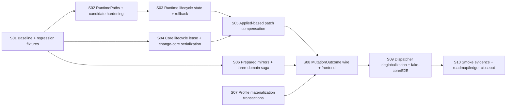

# PR-4S — PR-1～PR-4 稳定化门任务拆解（task.md）

- **关联设计：** [`./design.md`](./design.md)；下文 `design §N` 均指该文件。
- **任务定位：** roadmap v3 的单一硬前置 Task `R4S`。内部拆成 S01～S10 commit group，全部属于同一 atomic PR；任何子集都不能单独宣告稳定化完成。
- **分支建议：** `fix/pr4s-actor-migration-stabilization`
- **基线：** `main @ 9886aacc750b691d6abc893808ddaaf9dfb6a538`（`fix(proxy): resolve provider-owned proxies (#4954)`）；S01 基线冻结提交为 `daf872d9`；S02 RuntimePaths/candidate hardening 为 `807f1733`；S03 RuntimeLifecycleState/rollback snapshot、S04 CoreLifecycleLease / 统一 lifecycle mutex / change_core lease span / updater stop-swap-restart、S05 Applied-based patch compensation、S06 prepared mirrors / Application→Session→Clash version-checked saga、S07 profile materialization transactions / durable `Profiles.revision` / import fetch-before-commit / startup+periodic reconcile、S08 `MutationOutcome` wire / Specta / frontend / import 终态协议、S09 instance-owned `RebuildCoordinator` + test-only `fake-core` process matrix 均已在工作区实现并验证（均未单独 merge）。S10 仍 pending；**不得**宣告 PR-4S 完成。`REGEN_BRIDGE`/OnceCell first-install-wins 已删除，不再是 full-suite red contract。
- **建议 PR 标题：** `fix(tauri)!: close PR1-4 actor-migration consistency and regression gaps (PR-4S)`

---

## 0. 全局约束

1. 无新 `::global()`、mutable static service、service locator。
2. 固定锁顺序：`patch_gate → rebuild_gate → CoreLifecycleLease → short runtime-store write`。
3. Actor/client/pure service 禁止 import Tauri；Tauri、OS、FS、process 只在 adapter。
4. 普通 config mutation：commit-first + committed-degraded；不做通用 desired rollback。
5. all-or-nothing operation 必须有 prepare/commit/compensate/failure matrix。
6. 所有测试路径来自 TempDir 注入；禁止真实用户 dirs。
7. Actor 并发测试禁止 sleep；使用 barrier、oneshot、RPC ack 或 test hook。
8. 每个 commit group 均需 build/test 绿；但 wire 切换 S08～S09 作为原子小组一起合并。
9. 所有 compatibility residual 必须带规范 `TODO(actor-migration)`、原因和删除条件。
10. PR 合并前，四个 PR-4 unresolved review finding 必须 resolved 或以明确代码 disposition 关闭。

---

## 1. 依赖图



### 并行 lane

- S02、S04、S06、S07 可在 S01 后并行；
- S03 依赖 S02；
- S05 依赖 S03+S04；
- S08 必须等待 S05+S06+S07；
- S08/S09 是行为切换组；
- S10 只在完整实现后执行。

---

## 2. 任务总表

| ID  | 任务                                       | Scope                                                                                                                                                                                                                   | 建议 commit                                                                      | Design           |
| --- | ------------------------------------------ | ----------------------------------------------------------------------------------------------------------------------------------------------------------------------------------------------------------------------- | -------------------------------------------------------------------------------- | ---------------- |
| S01 | 基线、故障注入接口与回归 fixtures          | 固化当前缺陷和既有回归，不改生产行为                                                                                                                                                                                    | `test: pin PR1-4 migration regressions and failure contracts`                    | §1, §8           |
| S02 | RuntimePaths 与 candidate 安全             | 路径全注入、私有随机 candidate、cleanup                                                                                                                                                                                 | `refactor(tauri): inject runtime paths and harden candidate files`               | §6.1–6.2         |
| S03 | RuntimeLifecycleState 与 rollback snapshot | promoted/applied/revision/hash；完整恢复                                                                                                                                                                                | `fix(tauri): track promoted and applied runtime revisions`                       | §4, §6.4–6.5     |
| S04 | CoreLifecycleLease                         | 统一 run/restart/change-core 锁域                                                                                                                                                                                       | `fix(core): serialize core lifecycle through an exclusive lease`                 | §6.3, §6.6       |
| S05 | Patch gate 与 Applied compensation         | **已完成**：Applied Set/Remove、revision fence、private candidate direct apply、thin IPC                                                                                                                                | `fix(tauri): compensate runtime patches from applied state`                      | §6.7             |
| S06 | Prepared mirror 与三域 saga                | **已完成**：prepared mirrors、manager-level CAS、ordered saga/reverse compensation、structured `PartialCommit`                                                                                                          | `fix(state): make legacy mirrors prepared and cross-domain patches compensating` | §6.8–6.9         |
| S07 | Profile materialization transaction        | **已完成**：durable `Profiles.revision`、state-first/file-first/cleanup/reconcile、import fetch-before-commit、startup+periodic recovery、crate-internal degradation                                                    | `fix(profile): make profile state and materialization recoverable`               | §6.10            |
| S08 | MutationOutcome wire                       | **已完成**：公共 `MutationOutcome` / IPC / Specta / frontend；import 终态协议；facade 合并 S07 degradations + 粗粒度 rebuild；H1/H2 committed-degraded                                                                  | `feat(ipc)!: expose structured committed-degraded mutation outcomes`             | §6.11, §9        |
| S09 | Dispatcher 与 fake-core                    | **已完成**：删除 `REGEN_BRIDGE`/OnceCell；instance-owned capacity-1 coalescing `RebuildCoordinator`；Weak worker；direct typed requests；shutdown + production exit；test-only env+real-argv `fake-core` process matrix | `refactor(tauri): remove process-global rebuild handler and add fake-core tests` | §6.12–6.13, §8.5 |
| S10 | 验收与文档收尾                             | 三平台 smoke、review disposition、roadmap ledger                                                                                                                                                                        | `docs: close PR-4S stabilization gate`                                           | §13              |

---

## 3. 任务卡

## S01 — 基线、故障注入接口与回归 fixtures

**状态：** 已完成（`daf872d9` 固化 failure contracts / 初版 ledger 报告脚本）。不得将 PR-4S 整体标为完成；S10 仍 pending。

**目标：** 先用测试复现/冻结缺陷，避免后续重构掩盖行为。

**Files：**

- Create: test-support failure toggles / fixtures；
- Modify: migration profiles/typed-config tests；
- Modify: specta export tests；
- Modify: runtime/core/profile actor tests；
- Create: architecture ledger initial script（只报告，不先 fail）。

**必须先红的测试：**

1. `change_core` rollback 窗口并发 restart 可进入；
2. rollback product restore 后 runtime store 仍指向新核；
3. actor mirror 失败后 state version 已增长；
4. three-domain patch 第二域失败留下第一域新值；
5. profile add 文件失败仍返回成功/留下 state；
6. remote refresh metadata persist 失败后文件仍为新值；
7. 单测解析到真实 runtime product 路径；
8. compensation 无法 remove 新键或错误使用 promoted；
9. REGEN bridge 第二 client 使用第一 client handler。

**既有回归 fixtures：**

- #4893 IPv6 migration；
- #4916 local profile import；
- #4917/#4920 remote/wire shapes；
- #4921 mixed-port immediate effect；
- PR-4 五项 smoke 的可自动化部分。

**验证：** 测试名称和 failure reason 与 design failure matrix 一一对应；不通过修改断言来“修绿”。

---

## S02 — RuntimePaths 与 candidate hardening

**状态：** 已完成（`807f1733`）。RuntimePaths 注入、candidate hardening、TempDir isolation 已落地；S03 已在其上构建。

**目标：** runtime 产品和候选路径全部由 composition root 注入，候选文件满足私有、随机、可清理要求。

**Files：**

- Create/Modify: `client/runtime_paths.rs` 或 `client/runtime.rs`；
- Modify: `ClientSetupArgs`、`setup.rs`；
- Modify: runtime publisher/core adapter/boot fallback；
- Delete: runtime path 对 `utils::dirs` 的直接依赖；
- Modify: tests 使用 TempDir。

**接口：**

```rust
RuntimePaths::new(product, candidate_dir)
CandidateFile::create(&RuntimePaths, bytes)
CandidateFile::path/hash/cleanup
```

**实现要求：**

- candidate_dir 非 symlink/reparse point；
- random name + `create_new`；
- Unix 0600；
- hash；
- Drop cleanup；
- startup stale cleanup；
- product promote 后 hash 校验。

**验证：**

- 所有 runtime tests 写 TempDir；
- candidate collision、symlink、cleanup、stale cleanup、permission tests；
- architecture ledger 对 test 中真实 dirs 命中为 0。

---

## S03 — RuntimeLifecycleState 与 rollback snapshot

**状态：** 已完成（工作区已验证；PR-4S 整体未完成）。落地：`RuntimeSnapshot` / `RuntimeLifecycleState { promoted, applied }` / `RuntimeTransactionSnapshot`；revision/core/hash 绑定；四读 IPC 读 Promoted；`change_core` 捕获 transaction snapshot 并按 product → Promoted → old-core restart → Applied 恢复。残差留给后续 lane：S05 Applied-based compensation；promote-ok/store-publish-fail 的 `RuntimePublish` degradation + reconcile 仍按 design §6.4 作为后续 hardening；Applied owner 仍在 facade，PR-5b 迁入 CoreActor。S04 统一 lifecycle lease 已完成。

**目标：** 显式区分 promoted/applied，并修复深层 rollback read-model 失真。

**Files：**

- Modify: `client/runtime.rs`；
- Modify: `client/mod.rs` rebuild publication；
- Modify: `client/rebuild.rs` change-core；
- Modify: runtime IPC reads；
- Modify: specta only if public health type exposed。

**接口：**

```rust
RuntimeSnapshot { revision, target_core, product_sha256, ... }
RuntimeLifecycleState { promoted, applied }
RuntimeTransactionSnapshot { product, lifecycle, selected_core }
```

**行为：**

- check/promote 成功 → promoted 更新；
- apply/restart 成功 → applied 更新；
- apply 失败 → applied 保旧；
- rollback product restore → promoted 恢复；
- old core restart 成功 → applied 恢复；
- 四读 IPC 读 promoted。

**验证：**

- 所有失败分支断言 product hash、promoted、applied；
- 深层 rollback 回归测试转绿；
- `applied` 不得在仅 check/promote 时前进。

---

## S04 — CoreLifecycleLease 与 change-core serialization

**状态：** 已完成（工作区已验证；PR-4S 整体未完成）。落地：`CoreLifecyclePort`/`CoreLifecycleLease`（`client/core_bridge.rs`）；`CoreManager::lifecycle_lock` 统一 run/restart/stop/check/apply/recover 锁域，public 方法 `begin_lifecycle` + `*_with_lease` 拆分；`change_core` 全程持有 `rebuild_gate + lease` 至 rollback 结束；updater `replace_core` stop/swap/restart 在同一 lease 内完成；验证 `s04_concurrent_restart_waits_until_change_core_rollback_completes`（barrier/oneshot，无 sleep）。S05 Applied-based compensation 已依赖本锁域；S09 fake-core 进程级 matrix 已完成。`CoreManager::global()` 仍在 legacy adapter/updater 内临时桥接，PR-5 删除。

**目标：** 所有核心生命周期操作共享同一互斥域，消除换核 rollback 期间并发 restart。

**Files：**

- Create: `CoreLifecyclePort/CoreLifecycleLease` trait；
- Relocate/Modify: Legacy CoreManager adapter；
- Modify: `CoreManager` inner/public method split；
- Modify: `client/rebuild.rs`；
- Modify: `ipc::restart_sidecar`、startup/recover 调用链。

**要求：**

- `begin()` 获得与 `CoreManager::run_core()` 相同的锁；
- lease 内调用 unlocked inner，不重入锁；
- change-core 全程持有 rebuild gate + lease；
- direct run/recover 也必须等待 lease；
- 锁顺序注释和测试固定。

**验证：**

- barrier 并发测试，不 sleep；
- restart 在 rollback 结束前不能进入；
- recover/backoff 不产生死锁；
- fixed-port 旧核占用 scenario 先作为 fake adapter test 固化。

---

## S05 — Patch gate 与 Applied-based compensation

**状态：** 已完成（工作区已验证；PR-4S 整体未完成）。S03 的 `lifecycle.applied` 与 S04 的统一 lifecycle lease 已用于 D6：instance-owned `clash_patch_gate` 串行化 API-first patch、desired persist、rebuild/check/promote、apply/restart 与 compensation。S06/S07/S08/S09 已完成；S10 仍 pending。

**目标：** 修复 D6 补偿读取错误状态、不能删除新键和并发覆盖问题。

**Files：**

- Modify: `client/runtime.rs` compensation model；
- Modify: `NyanpasuClientInner` 加 `clash_patch_gate`；
- Move: IPC business orchestration 到 facade method；
- Modify: `ipc.rs` 保持 thin adapter；
- Modify: `feat::patch_clash` 阻塞链。

**接口：**

```rust
PatchCompensationPlan {
    expected_applied_revision,
    ops: Vec<PatchCompensationOp>,
}
```

**已实现语义：**

- previous 来自 Applied `RuntimeSnapshot`；snapshot 保存 hash 对应的 exact product bytes，补偿不从 YAML mapping 重序列化；
- absent old key → explicit `Remove`；`Set` / `Remove` 是 transport-independent plan，删除不使用 JSON `null`；
- expected Applied revision 不匹配则拒绝 stale compensation；
- instance-owned patch gate 内按 `patch_gate → rebuild_gate → CoreLifecycleLease` 保序，补偿处于 rebuild/lifecycle exclusion；
- 恢复为 Applied bytes 创建私有 candidate 并 direct apply；不 promote 或覆盖 product；最终可保留 `Promoted = P3`、`Applied = P1`；
- IPC 仅解析 mapping 并调用 facade；不直接调用 core API 或与 `feat` 组成第二套业务编排。

**验证：** green。

- set→rollback；
- newly-added key→remove；
- no applied snapshot；
- concurrent patch revision conflict；
- lifecycle waiter 在 compensation restore 期间不能进入；
- exact Applied bytes/identity 保留，P3 product 不被 P1 恢复覆盖；
- apply degraded 后下一 patch 仍以真实 Applied 为基准。

---

## S06 — Prepared mirrors 与 version-checked three-domain saga

**状态：** 已完成（工作区已验证；PR-4S 整体未完成）。落地：fallible prepare-before-persist / infallible in-memory apply-after-persist；manager-level expected-version CAS（actor 消息 `ReplacePreparedIfVersion`）；Application→Session→Clash ordered saga 与 reverse compensation；structured `PartialCommit`；finalizer/legacy-state uncertainty。S07/S08/S09 已完成；S10 仍 pending。

**目标：** 消灭 typed commit 后 mirror error 和 legacy patch 的部分提交。

**Files：**

- Modify: `state/mirror.rs`；
- Modify: `bridge/verge.rs`, `bridge/window.rs`, `bridge/clash.rs`；
- Modify: three typed actors/clients；
- Modify: LegacyVergeBridge patch/replace flow。

**已实现 Prepared mirror：**

- `prepare(next) -> Result<Box<dyn PreparedLegacyMirror>>` 在 persistence 前完成全部 conversion/serialization；失败则 manager state/version 与 legacy projection 均不变；
- `PreparedTypedReplace<T>` 同时携带 next typed state 与 prepared mirror；
- actor persist 成功后的 `apply()` 无 `Result`，仅更新内存 projection，不做 IO。

**已实现 Saga：**

- actor 消息 `ReplacePreparedIfVersion { expected_version, prepared }`；expected-version CAS 由 manager/coordinator 在 persistence effect 前执行；
- 读取三个 snapshot+version，并在首次 commit 前 prepare 全部 forward/rollback mirrors；
- 固定 Application → Session → Clash commit；
- commit/CAS 失败后按已提交域逆序 compensation，第三域失败时为 Session → Application；每次补偿以 committed version 为 expected version，避免覆盖并发 typed update；
- `PartialCommit { primary_error, committed_domains, compensated_domains, failed_compensations }` 结构化记录结果；`CompensationFailure` 区分 `Conflict`、`Error`、`LegacyStateUncertain`；
- legacy finalizer/state 不确定时，即使 typed reverse compensation 全部成功，仍返回 `PartialCommit` 并触发 reconciliation。

**后续清算归属：PR-7a。**

- `PrepareReplace`、`ReplacePreparedIfVersion` 和 `PreparedTypedReplace<T>` 是为 legacy mirror 与 `IVerge` 三域 saga 引入的过渡协议，不得演化成长期通用事务框架；
- PR-7a 在最后一个 legacy `IVerge` production caller 迁出后，先删除 saga/finalizer 与 forward/rollback bookkeeping，再删除 `state/mirror.rs` 和三个 actor/client 的 prepared-replace 消息及方法；
- manager/coordinator 的 `replace_if_version` CAS primitive 独立保留或删除：存在非 legacy 条件写入时，将 actor API 简化为直接携带 typed state 的 `ReplaceIfVersion { expected_version, state }`；不存在 production caller 时删除 actor/client conditional API；
- PR-7a 验收要求 `PreparedLegacyMirror`、`PreparedTypedReplace`、`PrepareReplace`、`ReplacePreparedIfVersion` 和 `apply_legacy_verge_*_saga` 均无运行时代码命中，不允许用新 wrapper 延续兼容层。

**验证：** green。

- mirror prepare failure 零提交，apply 无 `Result`；
- manager-level CAS success/conflict/persistence failure/version monotonic；
- 第二/第三域失败与 reverse compensation 顺序；
- concurrent typed update conflict 不被补偿覆盖；
- compensation conflict/error 明确列出 domain；
- finalizer uncertainty 保留 structured `PartialCommit`；
- 并发 interleaving 使用 oneshot/mpsc channel 与 release barrier，无 sleep。

---

## S07 — Profile materialization transaction

**状态：** 已完成（工作区已验证；PR-4S 整体未完成）。落地：durable server-owned `Profiles.revision`（≠ manager MVCC）；state-first / file-first / cleanup / reconcile 协议与操作映射；**remote import actor-owned fetch-before-commit**；启动 + actor-owned 周期 recovery；crate-internal `ProfileDegradation`；superseded state-first journal 修正规则。S08 公共 wire 已完成；S09 已完成；S10 仍 pending。

**目标：** 使 Profiles 状态和物化文件在失败时可恢复，warning 可观察；import 取消安全且无空壳占位。

**Files：**

- Modify: `nyanpasu-config` `Profiles.revision` / `bump_revision`；
- Modify: `state/profiles/actor.rs`、`ports.rs`；
- Modify: `service/profile_file.rs` journal/cleanup/reconcile；
- Modify: `client/profiles.rs` / startup wiring；
- Modify: deterministic profile materialization + import cancellation tests。

**已实现协议：**

- **state-first**：`prepare(next) → state CAS → promote → complete/compensate`；
- **file-first**：`prepare(next) → promote → state CAS → complete/compensate`；
- **cleanup**：`prepare(next) → state CAS → activate → retry`（active path / hash reuse fence）；
- **reconcile**：`reconcile(loaded profiles)` 启动先于 ready，并由 actor 周期 cast `ReconcileMaterializations`；
- **import fetch-before-commit**：`validate → in-memory PendingImport → fetch/validate → CommitImported`；成功才一次 state-first（真实 bytes）；取消/失败零 state/file。

**操作映射：**

- Add / ReplaceDefinition → state-first（slot 变化附 resource；旧 path 可附 cleanup）；
- **Remote import** → actor-owned fetch-before-commit，成功后一次 state-first + 既有 materialization journal recovery；**禁止** `add empty placeholder → refresh → delete`；
- Remote refresh（手动/定时）/ External Mirror → **file-first 不变**；
- Delete → state commit 为权威 + durable cleanup；prepare-cleanup 失败则不提交删除；
- symlink/reparse point 拒绝意外写穿。

**Import 硬约束：**

- 校验与 fetch 发生在任何 durable placeholder 之前；`PendingImport` 仅内存；
- 取消发生在 durable commit 开始前 → 丢弃结果，零 state/file，无 delete compensation；
- 成功路径复用既有 state-first journal / reconcile；**不**新增 import journal / schema / field heuristics；
- auto-activation 不在 S07 actor 内完成（见 S08 post-commit 降级）。

**Durable revision：**

- journal 使用 `Profiles.revision`，不是 `PersistentStateManager` MVCC version；
- 每次 forward / compensating state commit 前 `bump_revision()`。

**已修正 superseded state-first 规则：**

- 当 `revision > journal` 且 path 仍 active、target 仍 pre-promote：只 `compensate`，**永不 promote**；
- target 已匹配 journal hash 时：`StatePromoting` 可 `complete`，`StatePrepared` 可 `discard`。

**Outcome：** crate-internal `ProfileDegradation{Cleanup|Reconcile, JournalInvalid|MaterializationDeferred|CleanupDeferred}`；S08 已映射公共 `MutationOutcome`。

**验证：** green。

- 每阶段 failure injection（prepare 零提交、promote/compensate compound、complete deferred、cleanup deferred）；
- crash journal fixture（state-promoting / file-promoted / uncommitted file-prepared / compensating）；
- superseded state-first compensate-never-promote；
- cleanup retry + fence；
- no orphan success state；
- remote stale fence 保持；
- startup reconcile before client ready；
- **import cancellation / restart / materialization（deterministic）：** happy path 真实 bytes；fetch 失败零 item 且无 delete compensation；caller abort 于成功/失败 fetch 途中零 durable；client drop/restart 无残留；promote 失败不提交；零 interval 在 fetch 前拒绝；显式 interval/pinned name 权威。

---

## S08 — MutationOutcome wire 与前端原子切换

**状态：** 已完成（工作区已验证；PR-4S 整体未完成）。S09 已完成；S10 仍 pending。不得将 PR-4S 标为完成；S08/S09 单独完成不构成稳定化关闭。

**目标：** 统一 mutation success/degraded 语义，并把 profile/materialization/runtime warnings 交付前端；固定 import 终态 wire。

**落地：**

- 公共终态 wire：`MutationOutcome<T> { Applied | CommittedDegraded }` + `Degradation { phase, code, message, retryable }` + snake_case `DegradationPhase`；无 `_v1` / 无 `RebuildOutcome`。
- create/import → `MutationOutcome<ProfileId>`；其余 profile mutation → `MutationOutcome<()>`。
- facade 合并 S07 profile degradations（内部 Cleanup/Reconcile → public `ProfileMaterialization`；codes `journal_invalid` / `materialization_deferred` / `cleanup_deferred`）与 post-commit rebuild degradation。
- **H1 retained-forward：** promote 失败且 compensating state CAS 失败 → `Ok(CommittedDegraded)`，forward head / real uid 可恢复。
- **H2 auto-activation（post-commit only）：** create/import 共用 facade `try_auto_activate_if_none` / `set_current_if_none`；`Ok(None)` 保持 Applied；hard failure → `SystemEffect` / `profile_auto_activation_failed`，**保留**已提交 `ProfileId`。激活失败不得抹掉已提交 uid。
- **Import 终态协议（facade + actor）：**
  - actor-owned fetch-before-commit；任何 durable placeholder 前完成 validation + fetch；
  - cancel before durable commit → discard，零 state/file；
  - success → 一次 state-first commit（真实 bytes + 既有 materialization journal recovery）；
  - **不**新增 import journal/schema/field heuristics；
  - **不**再使用 `add empty placeholder → refresh → delete compensation`；
  - pre-commit 失败 → 普通 `Err`（非 `CommittedDegraded`）；post-commit materialization/rebuild/auto-activation 降级才进 `committed_degraded`；
  - manual/scheduled remote refresh 保持 file-first 语义不变。
- **Runtime phase fidelity disposition：** rebuild 错误面不透明 → 仅粗粒度真实 `RuntimeBuild` / `runtime_rebuild_failed`；**延期** Check/Promote/Publish/Apply 分相位精度，禁止伪精度；非 S09 工作。
- 前端：`unwrapResult` 穷尽 `T`；`MutationCache` success 识别 `committed_degraded` 并仍 invalidate；en/zh-cn/zh-tw/ru/ko phase/code 本地化。
- Specta freeze + bindings freshness contract。

**Wire：**

```text
{ status: "applied", value }
{ status: "committed_degraded", value, degradations: [...] }
```

**验证真相：**

- focused S08 tests / build / clippy 通过（wire serde、facade merge、H1/H2、import cancellation-safe、Specta freeze、frontend path）。
- facade import：下载成功后条件激活；显式 interval 压过 server suggestion；零 interval 在 fetch 前拒绝；fetch 失败 commits nothing；不窃取已有 current；auto-activation hard failure 保留 ProfileId 为 `committed_degraded`。
- full workspace green **不得**在 S10 最终 QA 前宣称。历史 `REGEN_BRIDGE` two-client isolation red contract 已由 S09 关闭；network 类 flaky 与 PR-5/6 residual global-state rebuild 失败须如实记录。
  - 上述**不**构成 S08/S09 未关闭，也**不**允许宣告 PR-4S 完成。
- five-locale keys 与 bindings freshness 已验证；TS typecheck/build 覆盖 S08 wire 路径。

---

## S09 — Dispatcher 去全局化、fake-core 与完整 E2E

**状态：** 已完成（工作区已验证；PR-4S 整体未完成）。S10 仍 pending。不得将 PR-4S 标为完成。

**目标：** service graph 可独立创建/销毁；以真实子进程故障注入验证生命周期。

**落地：**

- **删除** process-global `REGEN_BRIDGE` / `OnceCell` first-install-wins 与无界 channel。历史 “S09 `REGEN_BRIDGE` two-client isolation 是唯一稳定 full-suite red contract” 陈述**作废**。
- **instance-owned capacity-1 coalescing `RebuildCoordinator`**（`backend/tauri/src/client/rebuild.rs`）：
  - dirty `mpsc` 容量 1；`try_send` 满则 coalesce；
  - receiver-side coalesce window（shutdown-responsive）；
  - request/reply regeneration **直接** typed facade 方法，无进程静态 dispatcher；
  - worker 仅捕获 **`Weak`** client graph，upgrade 后 `rebuild_running_config()`；
  - **`shutdown().await`** 等待 worker；in-flight rebuild 允许完成；post-shutdown dirty 空操作；`Drop` 仅 best-effort；
  - 生产 exit：`cleanup_processes` 从 Tauri managed state 取 `NyanpasuClient` 并在 core/widget teardown 前 `client.shutdown().await`。
- **Coordinator isolation / paused-time tests：**
  - `s09_two_client_graphs_are_independent`；
  - `s09_clones_share_one_coordinator`；
  - `s09_legacy_call_sites_use_supplied_client`；
  - coalesce / shutdown / dirty-during-shutdown 用 `tokio::time::pause/advance`（无 sleep 排序）。
- **test-only `fake-core` package（最终协议 disposition）**：
  - 取代早期 illustrative CLI flags（`--check-ok/--start-fail/...`）；
  - **real argv** + **`FAKE_CORE_*` env** + **TCP READY/RELEASE** + 动态 hold/http 端口 + exact `PUT`/`PATCH /configs` 状态注入 + 严格 env + `ScopedChild`；
  - workspace member + tauri **dev-dependency** only；`publish = false`；**never packaged** as production sidecar/resource。
- **`cfg(test)` `ProcessCoreLifecycleAdapter`**（`client/process_core_bridge.rs`）：
  - TempDir `RuntimePaths`；
  - 禁止 `CoreManager::global()` / real sidecar / 真实用户目录。
- **process matrix（工作区已验证；非 full workspace green 宣称）：**
  - check fail → product/Promoted/Applied 不变；
  - immediate start fail → 无 child leak；
  - apply HTTP 500 after promote → Promoted 新、Applied 旧/None；
  - fixed-port hold conflict + stop 后释放；
  - lifecycle lease serialization（barrier/oneshot）；
  - clean stop / `ScopedChild` reap；
  - two graph PID/port/path isolation；
  - process-level `change_core` new-start failure + old-core rollback success。
- **prebuild / discovery：** 跨 crate 须 `cargo build -p fake-core`（或 `cargo test -p fake-core`）；`CARGO_BIN_EXE_fake-core` 仅同包 integration test 设置；`NYANPASU_FAKE_CORE` → current_exe profile sibling → target profile；错误含 `PREBUILD_COMMAND`。
- **平台限制：** std-only 跨平台协议；Windows service-mode / TUN 权限路径留给 S10 手工 smoke。
- **PR-5/6 residuals：** legacy `Config` / `CoreManager::global()` 仍存在；`change_core` 等路径仍可触碰 legacy desired-state mirrors——**不是** full graph desired-state isolation。S09 `shutdown` 只拆 rebuild worker，不停止 desired-state actors / system proxy / OS resources。

**Files（已落地）：**

- Delete/Modify: `REGEN_BRIDGE`/OnceCell 移除；
- Create/Modify: `RebuildCoordinator` + `NyanpasuClient::shutdown` + production `cleanup_processes`；
- Create: `backend/fake-core` package + protocol tests；
- Create: `cfg(test)` `process_core_bridge` matrix。

**验证真相：**

- focused S09 coordinator + process matrix 工作区已验证；
- **不得**因 S09 完成宣称 `cargo test --workspace --all-features` 全绿；
- S10 仍负责 ledger CI gate、三平台 smoke/evidence、final review disposition、PR-4S closeout。

---

## S10 — Smoke evidence、review disposition 与 roadmap closeout

**状态：** pending。S01～S09 工作区已验证**不**关闭 PR-4S。

**目标：** 将“代码完成”转为可审计验收完成。

**交付：**

1. PR-4 四个 unresolved review finding disposition 表；
2. PR-4 五项 smoke 以及 design §13.2 新增 smoke 记录；
3. Windows/macOS/Linux build、core version、步骤、日志/artifact；
4. architecture ledger 由报告模式改为 CI gate；
5. roadmap 状态/数字/依赖图更新（含 S09 residual ledger）；
6. PR-4 spec §12 addendum：哪些决策被 PR-4S 修正；
7. residual TODO ledger，明确 PR-5/6 owner（含 legacy `Config`/`CoreManager` global 非 full desired-state isolation）；
8. full test/build commands 和结果记录（**仅此处**可宣称 full workspace green）。

**禁止：** 仅在 PR 描述打勾但不附证据；禁止因 S09 完成提前宣告 PR-4S 关闭。

---

## 4. PR-4 review finding disposition（必须完成）

| Finding                                  | 当前判断                                                               | PR-4S 处置                                                                                                                                                              |
| ---------------------------------------- | ---------------------------------------------------------------------- | ----------------------------------------------------------------------------------------------------------------------------------------------------------------------- |
| createProfile `undefined` review comment | typed error 实际 throw，但 helper 返回类型不穷尽，易掩盖未来 wire 漂移 | **S08 已关闭**：`unwrapResult` exhaustive `T` + Specta/bindings freeze；wire drift 不再坍缩为 `undefined`                                                               |
| rollback test 写真实用户 runtime path    | 有效 correctness/test-isolation finding                                | S02 全路径注入并删除真实路径访问                                                                                                                                        |
| change_core 与 run_core 锁域竞态         | S04 已关闭：统一 lifecycle lease + barrier 并发测试                    | 已由 S04 代码 + `s04_concurrent_restart_waits_until_change_core_rollback_completes` 处置；S09 已补齐 fake-core 进程级 matrix（含 process-level `change_core` rollback） |
| product rollback 未恢复 runtime store    | S03 已关闭：transaction snapshot 同步恢复 product/Promoted/Applied     | 已由 S03 代码 + rollback 分支测试处置；S04 已补齐 lease 串行                                                                                                            |

所有 thread 在代码合并前必须 resolve；延期不接受。

---

## 5. 最终验收 checklist

### 架构

- [ ] no new global/static service
- [ ] RuntimePaths injected everywhere
- [ ] promoted/applied revisions visible
- [x] one lifecycle lease covers all core mutations（S04 + S09 process matrix 工作区已验证）
- [x] mirror prepare before persist; apply infallible（S06 工作区已验证）
- [x] three-domain patch saga version-checked（S06：manager-level CAS + Application→Session→Clash + reverse compensation）
- [x] profile materialization recoverable（S07：state-first/file-first/cleanup/reconcile + durable `Profiles.revision` + import fetch-before-commit；S08 已公开 wire）
- [x] dispatcher test-resettable/deglobalized（S09：`REGEN_BRIDGE`/OnceCell 删除；instance-owned `RebuildCoordinator`；two-client/clone isolation + explicit shutdown）
- [ ] Tauri commands thin

### 正确性

- [x] change-core concurrent restart blocked（S04 barrier + S09 process-level lease/change_core matrix）
- [x] rollback restores product/promoted/applied/core（S03 + S04 lease span + S09 process-level change_core rollback）
- [x] D6 supports Applied-based Set/Remove and revision conflict（S05；exact bytes/private candidate direct apply；tests green）
- [x] no ghost Err after typed commit（S06：fallible prepare-before-persist；infallible apply-after-persist）
- [x] no silent partial domain commit（S06：version-checked saga + structured `PartialCommit` / finalizer uncertainty）
- [x] profile file failure not returned as naked success（S07 state-first promote/compensate；crate-internal degradation）
- [x] remote refresh metadata failure restores old file（S07 file-first compensate；manual/scheduled only）
- [x] remote import cancellation-safe（S07/S08：fetch-before-commit；cancel/fail 零 state/file；成功一次 state-first 真实 bytes；无 placeholder delete；auto-activation 仅 post-commit 降级）
- [x] public `MutationOutcome` / IPC / Specta / frontend wire（S08 已完成；H1/H2 + coarse rebuild；full runtime phase fidelity 延期）

### 测试

- [ ] zero test access to real user dirs
- [x] no sleep-based S04-S09 actor concurrency / materialization / wire / import-cancel / coordinator / process-matrix tests（barrier/oneshot/mpsc + paused-time + deterministic journal fixtures）
- [x] S07 failure/crash/cleanup/fence/import-cancel tests green（含 superseded state-first compensate-never-promote）
- [x] S08 focused wire/facade/frontend/import contracts green
- [x] S09 coordinator isolation + fake-core process matrix green（focused/S09 路径；**非** full workspace green 宣称）
- [ ] regression fixtures #4893/#4916/#4917/#4920/#4921 green
- [ ] Windows/macOS/Linux CI green
- [x] bindings freshness green（S08 Specta freeze；拒绝 `RebuildOutcome` / legacy status tags）

### 证据

- [ ] PR-4 review threads resolved
- [ ] manual smoke records attached
- [ ] roadmap ledger generated and current
- [ ] residual TODO owner/removal condition complete

只有全部勾选后，roadmap 才能把 PR-4S 标为完成并解锁 PR-5a。S01～S09 工作区已验证不构成关闭条件；S10 仍 pending。
