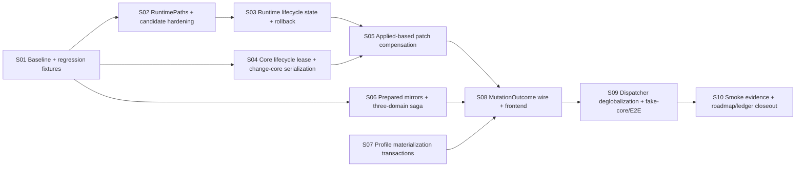

# PR-4S — PR-1～PR-4 稳定化门任务拆解（task.md）

- **关联设计：** [`./design.md`](./design.md)；下文 `design §N` 均指该文件。
- **任务定位：** roadmap v3 的单一硬前置 Task `R4S`。内部拆成 S01～S10 commit group，全部属于同一 atomic PR；任何子集都不能单独宣告稳定化完成。
- **分支建议：** `fix/pr4s-actor-migration-stabilization`
- **基线：** `main @ 9886aacc750b691d6abc893808ddaaf9dfb6a538`（`fix(proxy): resolve provider-owned proxies (#4954)`）。S01 `daf872d9`；S02 `807f1733`；S03～S09 均已在工作区实现并验证；**S10 / PR-4S 稳定化门 COMPLETE**（2026-07-18）。证据包：E-01…E-11 maintainer-attested PASS；review Path A；target-tip CI run [29635372676](https://github.com/libnyanpasu/clash-nyanpasu/actions/runs/29635372676)；cleanup-tip CI run [29638274786](https://github.com/libnyanpasu/clash-nyanpasu/actions/runs/29638274786) **SUCCESS** @ `8909566c0bb759f562d420af4b9672469920fc21`（权威 [`./smoke-evidence.md`](./smoke-evidence.md) **Q-18…Q-20**）；residual ledger + local QA。**PR-5a 已解锁**。不宣称 actor migration 全量完成或 residual 清零（PR-5/6/7 残差仍在）。`REGEN_BRIDGE`/OnceCell first-install-wins 已删除。
- **建议 PR 标题：** `fix(tauri)!: close PR1-4 actor-migration consistency and regression gaps (PR-4S)`
- **语义权威：** 协议/语义细节以 design §6.7–6.13、§8.5、§9、§13 为准；finding 卷宗与 Path A 证据以 [`./review-disposition.md`](./review-disposition.md) 为准。本文件只保留执行状态、落地卡片与验收 checklist。

---

## 0. 全局约束

1. 无新 `::global()`、mutable static service、service locator。
2. 固定锁顺序：`patch_gate → rebuild_gate → CoreLifecycleLease → short runtime-store write`。
3. Actor/client/pure service 禁止 import Tauri；Tauri、OS、FS、process 只在 adapter。
4. 普通 config mutation：commit-first + committed-degraded；不做通用 desired rollback。
5. all-or-nothing operation 必须有 prepare/commit/compensate/failure matrix。
6. 所有测试路径来自 TempDir 注入；禁止真实用户 dirs。
7. Actor 并发测试禁止 sleep；使用 barrier、oneshot、RPC ack 或 test hook。
8. 每个 commit group 均需 build/test 绿；但 wire 切换 S08～S09 作为原子小组一起合并。
9. 所有 compatibility residual 必须带规范 `TODO(actor-migration)`、原因和删除条件。
10. PR 合并前，四个 PR-4 review finding **各自**必须具备 Path A（GitHub thread 实际 resolve 且可发现证据）或 Path B（显式 maintainer disposition：signed/dated 记录 + 理由）；仅代码/test disposition **不**关闭 review gate。禁止 silent deferral；任一 finding 未完成 Path A/B 前 review gate 保持 OPEN。

---

## 1. 依赖图

### 并行 lane

- S02、S04、S06、S07 可在 S01 后并行；
- S03 依赖 S02；
- S05 依赖 S03+S04；
- S08 必须等待 S05+S06+S07；
- S08/S09 是行为切换组；
- S10 只在完整实现后执行。

---

## 2. 任务总表

| ID  | 任务                                       | Scope                                                                                                                                                                                                                                  | 建议 commit                                                                      | Design           |
| --- | ------------------------------------------ | -------------------------------------------------------------------------------------------------------------------------------------------------------------------------------------------------------------------------------------- | -------------------------------------------------------------------------------- | ---------------- |
| S01 | 基线、故障注入接口与回归 fixtures          | 固化当前缺陷和既有回归，不改生产行为                                                                                                                                                                                                   | `test: pin PR1-4 migration regressions and failure contracts`                    | §1, §8           |
| S02 | RuntimePaths 与 candidate 安全             | 路径全注入、私有随机 candidate、cleanup                                                                                                                                                                                                | `refactor(tauri): inject runtime paths and harden candidate files`               | §6.1–6.2         |
| S03 | RuntimeLifecycleState 与 rollback snapshot | promoted/applied/revision/hash；完整恢复                                                                                                                                                                                               | `fix(tauri): track promoted and applied runtime revisions`                       | §4, §6.4–6.5     |
| S04 | CoreLifecycleLease                         | 统一 run/restart/change-core 锁域                                                                                                                                                                                                      | `fix(core): serialize core lifecycle through an exclusive lease`                 | §6.3, §6.6       |
| S05 | Patch gate 与 Applied compensation         | **已完成**：Applied Set/Remove、revision fence、private candidate direct apply、thin IPC                                                                                                                                               | `fix(tauri): compensate runtime patches from applied state`                      | §6.7             |
| S06 | Prepared mirror 与三域 saga                | **已完成**：prepared mirrors、manager-level CAS、ordered saga/reverse compensation、structured `PartialCommit`                                                                                                                         | `fix(state): make legacy mirrors prepared and cross-domain patches compensating` | §6.8–6.9         |
| S07 | Profile materialization transaction        | **已完成**：durable `Profiles.revision`、state-first/file-first/cleanup/reconcile、import fetch-before-commit、startup+periodic recovery、crate-internal degradation                                                                   | `fix(profile): make profile state and materialization recoverable`               | §6.10            |
| S08 | MutationOutcome wire                       | **已完成**：公共 `MutationOutcome` / IPC / Specta / frontend；import 终态协议；facade 合并 S07 degradations + 粗粒度 rebuild；H1/H2 committed-degraded                                                                                 | `feat(ipc)!: expose structured committed-degraded mutation outcomes`             | §6.11, §9        |
| S09 | Dispatcher 与 fake-core                    | **已完成**：删除 `REGEN_BRIDGE`/OnceCell；instance-owned capacity-1 coalescing `RebuildCoordinator`；Weak worker；direct typed requests；shutdown + production exit；test-only env+real-argv `fake-core` process matrix                | `refactor(tauri): remove process-global rebuild handler and add fake-core tests` | §6.12–6.13, §8.5 |
| S10 | 验收与文档收尾                             | **COMPLETE**：E-01…E-11 PASS（attested）；Path A；tip CI 29635372676；cleanup-tip CI 29638274786 **SUCCESS** @ `8909566c…`（`smoke-evidence.md` **Q-18…Q-20**）；residual ledger owners 齐；**PR-5a unlocked**；PR-5/6/7 residual 仍存 | `docs: close PR-4S stabilization gate`                                           | §13              |

---

## 3. 任务卡

## S01 — 基线、故障注入接口与回归 fixtures

**状态：** 已完成（`daf872d9` 固化 failure contracts / 初版 ledger 报告脚本）。S10 / PR-4S 稳定化门随后已 COMPLETE（见 S10）。

**目标：** 先用测试复现/冻结缺陷，避免后续重构掩盖行为。

**Files：** test-support failure toggles / fixtures；migration profiles/typed-config、specta export、runtime/core/profile actor tests；architecture ledger initial script（只报告，不先 fail）。

**必须先红的测试：**

1. `change_core` rollback 窗口并发 restart 可进入；
2. rollback product restore 后 runtime store 仍指向新核；
3. actor mirror 失败后 state version 已增长；
4. three-domain patch 第二域失败留下第一域新值；
5. profile add 文件失败仍返回成功/留下 state；
6. remote refresh metadata persist 失败后文件仍为新值；
7. 单测解析到真实 runtime product 路径；
8. compensation 无法 remove 新键或错误使用 promoted；
9. REGEN bridge 第二 client 使用第一 client handler。

**既有回归 fixtures：** #4893 IPv6 migration；#4916 local profile import；#4917/#4920 remote/wire shapes；#4921 mixed-port immediate effect；PR-4 五项 smoke 的可自动化部分。

**验证：** 测试名称和 failure reason 与 design failure matrix 一一对应；不通过修改断言来“修绿”。

---

## S02 — RuntimePaths 与 candidate hardening

**状态：** 已完成（`807f1733`）。RuntimePaths 注入、candidate hardening、TempDir isolation 已落地；S03 已在其上构建。

**目标：** runtime 产品和候选路径全部由 composition root 注入，候选文件满足私有、随机、可清理要求。

**Files：** `client/runtime_paths.rs` / `client/runtime.rs`；`ClientSetupArgs`、`setup.rs`；runtime publisher/core adapter/boot fallback；删除 runtime path 对 `utils::dirs` 的直接依赖；tests 使用 TempDir。

**接口：** `RuntimePaths::new(product, candidate_dir)`；`CandidateFile::create/path/hash/cleanup`。

**实现要求：** candidate_dir 非 symlink/reparse point；random name + `create_new`；Unix 0600；hash；Drop cleanup；startup stale cleanup；product promote 后 hash 校验。

**验证：** 所有 runtime tests 写 TempDir；candidate collision、symlink、cleanup、stale cleanup、permission tests；architecture ledger 对 test 中真实 dirs 命中为 0。

---

## S03 — RuntimeLifecycleState 与 rollback snapshot

**状态：** 已完成（工作区已验证）。S10 / PR-4S 稳定化门随后已 COMPLETE（见 S10）。落地：`RuntimeSnapshot` / `RuntimeLifecycleState { promoted, applied }` / `RuntimeTransactionSnapshot`；revision/core/hash 绑定；四读 IPC 读 Promoted；`change_core` 捕获 transaction snapshot 并按 product → Promoted → old-core restart → Applied 恢复。

**目标：** 显式区分 promoted/applied，并修复深层 rollback read-model 失真。

**Files：** `client/runtime.rs`；`client/mod.rs` rebuild publication；`client/rebuild.rs` change-core；runtime IPC reads；specta only if public health type exposed。

**行为：** check/promote 成功 → promoted 更新；apply/restart 成功 → applied 更新；apply 失败 → applied 保旧；rollback product restore → promoted 恢复；old core restart 成功 → applied 恢复；四读 IPC 读 promoted。selected core 由 `Config::verge().discard()` 在 rollback rebuild 前恢复（非 `RuntimeTransactionSnapshot` 字段）。

**验证：** 所有失败分支断言 product hash、promoted、applied；深层 rollback 回归测试转绿；`applied` 不得在仅 check/promote 时前进。

**残差/后续：** promote-ok/store-publish-fail 的 `RuntimePublish` degradation + reconcile 仍按 design §6.4 作为后续 hardening；Applied owner 仍在 facade，PR-5b 迁入 CoreActor。

---

## S04 — CoreLifecycleLease 与 change-core serialization

**状态：** 已完成（工作区已验证）。S10 / PR-4S 稳定化门随后已 COMPLETE（见 S10）。落地：`CoreLifecyclePort`/`CoreLifecycleLease`（`client/core_bridge.rs`）；`CoreManager::lifecycle_lock` 统一 run/restart/stop/check/apply/recover 锁域，public 方法 `begin_lifecycle` + `*_with_lease` 拆分；`change_core` 全程持有 `rebuild_gate + lease` 至 rollback 结束；updater `replace_core` stop/swap/restart 在同一 lease 内完成；验证 `s04_concurrent_restart_waits_until_change_core_rollback_completes`（barrier/oneshot，无 sleep）。S09 fake-core 进程级 matrix 已覆盖 process-level lease/change_core。

**目标：** 所有核心生命周期操作共享同一互斥域，消除换核 rollback 期间并发 restart。

**Files：** `CoreLifecyclePort`/`CoreLifecycleLease`；Legacy CoreManager adapter；`CoreManager` inner/public method split；`client/rebuild.rs`；`ipc::restart_sidecar`、startup/recover 调用链。

**要求：** `begin()` 获得与 `CoreManager::run_core()` 相同的锁；lease 内调用 unlocked inner，不重入锁；change-core 全程持有 rebuild gate + lease；direct run/recover 也必须等待 lease；锁顺序注释和测试固定。

**验证：** barrier 并发测试，不 sleep；restart 在 rollback 结束前不能进入；recover/backoff 不产生死锁；fixed-port 旧核占用 scenario 先作为 fake adapter test 固化。

**残差/后续：** `CoreManager::global()` 仍在 legacy adapter/updater 内临时桥接，PR-5 删除。

---

## S05 — Patch gate 与 Applied-based compensation

**状态：** 已完成（工作区已验证）。S10 / PR-4S 稳定化门随后已 COMPLETE（见 S10）。

**目标：** 修复 D6 补偿读取错误状态、不能删除新键和并发覆盖问题。

**Design：** design §6.7

**落地（impl card）：**

- instance-owned `clash_patch_gate` 串行化 API-first patch → desired persist → rebuild/check/promote → apply/restart → compensation
- `PatchCompensationPlan { expected_applied_revision, ops }`；previous 来自 Applied snapshot exact product bytes（非 YAML 重序列化）
- absent old key → explicit `Remove`；`Set`/`Remove` transport-independent；删除不用 JSON `null`
- expected Applied revision 不匹配 → 拒绝 stale compensation
- 锁序 `patch_gate → rebuild_gate → CoreLifecycleLease`；恢复为 Applied bytes 的私有 candidate direct apply（不 promote / 不覆盖 product）
- IPC thin adapter：只解析 mapping 并调 facade，无第二套业务编排

**验证：**

- set→rollback；newly-added key→remove；no applied snapshot；concurrent patch revision conflict green
- lifecycle waiter 在 compensation restore 期间不能进入
- exact Applied bytes/identity 保留；apply degraded 后下一 patch 仍以真实 Applied 为基准

---

## S06 — Prepared mirrors 与 version-checked three-domain saga

**状态：** 已完成（工作区已验证）。S10 / PR-4S 稳定化门随后已 COMPLETE（见 S10）。

**目标：** 消灭 typed commit 后 mirror error 和 legacy patch 的部分提交。

**Design：** design §6.8–6.9

**落地（impl card）：**

- fallible `prepare(next) -> Result<PreparedLegacyMirror>` before persist；persist 后 infallible in-memory `apply()`（无 `Result`、无 IO）
- `PreparedTypedReplace<T>` 同时携带 next typed state 与 prepared mirror
- manager-level expected-version CAS：`ReplacePreparedIfVersion`（actor 消息）
- Application → Session → Clash ordered commit；失败后逆序 compensation（第三域失败：Session → Application）
- structured `PartialCommit` + `CompensationFailure { Conflict | Error | LegacyStateUncertain }`
- finalizer/legacy-state uncertainty → 即使 typed reverse 全成功仍返回 `PartialCommit` 并 reconcile

**验证：**

- prepare failure 零提交；CAS success/conflict/persistence failure/version monotonic green
- 第二/第三域失败与 reverse compensation 顺序；concurrent typed update 不被补偿覆盖
- finalizer uncertainty 保留 structured `PartialCommit`；并发用 oneshot/mpsc + barrier，无 sleep

**残差/后续：** prepared-replace / saga 协议归 PR-7a 清算（见 design §6.8–6.9）；不得演化成长期通用事务框架。

---

## S07 — Profile materialization transaction

**状态：** 已完成（工作区已验证）。S10 / PR-4S 稳定化门随后已 COMPLETE（见 S10）。

**目标：** Profiles 状态与物化文件失败可恢复；import 取消安全且无空壳占位。

**Design：** design §6.10

**落地（impl card）：**

- durable server-owned `Profiles.revision`（≠ manager MVCC）；每次 forward/compensating commit 前 `bump_revision()`
- state-first / file-first / cleanup / reconcile 协议 + 操作映射（Add/ReplaceDefinition state-first；remote refresh/external mirror file-first；Delete state-authoritative + durable cleanup）
- **remote import actor-owned fetch-before-commit**：validate → in-memory `PendingImport` → fetch → 成功才一次 state-first（真实 bytes）；取消/失败零 state/file；禁止 placeholder→refresh→delete
- startup + actor-owned periodic `ReconcileMaterializations`；crate-internal `ProfileDegradation`
- superseded state-first：`revision > journal` 且 path 仍 active、target 仍 pre-promote → 只 compensate，**永不 promote**

**验证：**

- 每阶段 failure injection / crash journal fixture / superseded compensate-never-promote green
- cleanup retry + fence；no orphan success state；startup reconcile before client ready
- import cancellation/restart/materialization deterministic matrix green

---

## S08 — MutationOutcome wire 与前端原子切换

**状态：** 已完成（工作区已验证）。S10 / PR-4S 稳定化门随后已 COMPLETE（见 S10）。

**目标：** 统一 mutation success/degraded 语义；固定 import 终态 wire 并交付前端。

**Design：** design §6.11、§9

**落地（impl card）：**

- 公共 `MutationOutcome<T> { Applied | CommittedDegraded }` + `Degradation { phase, code, message, retryable }`；无 `_v1` / 无 `RebuildOutcome`
- create/import → `MutationOutcome<ProfileId>`；其余 profile mutation → `MutationOutcome<()>`
- facade 合并 S07 degradations（→ public `ProfileMaterialization`）与 post-commit coarse rebuild（`RuntimeBuild` / `runtime_rebuild_failed`）
- **H1 retained-forward**；**H2 auto-activation post-commit only**（激活失败保留已提交 `ProfileId`）
- import 终态：fetch-before-commit；pre-commit fail → `Err`；post-commit 降级 → `committed_degraded`
- 前端 `unwrapResult` 穷尽 `T`；`MutationCache` 识别 `committed_degraded` 仍 invalidate；en/zh-cn/zh-tw/ru/ko 本地化；Specta freeze + bindings freshness

**验证：**

- focused wire/facade/H1/H2/import/Specta/frontend path green
- five-locale keys + bindings freshness 已验证
- full workspace green 仅在 S10 最终 QA 证据包下宣称（local Q + tip/cleanup-tip CI；见 `smoke-evidence.md`）

**残差/后续：** full runtime phase fidelity（Check/Promote/Publish/Apply）延期；禁止伪精度。

---

## S09 — Dispatcher 去全局化、fake-core 与完整 E2E

**状态：** 已完成（工作区已验证）。S10 / PR-4S 稳定化门随后已 COMPLETE（见 S10）。

**目标：** service graph 可独立创建/销毁；以真实子进程故障注入验证生命周期。

**Design：** design §6.12–6.13、§8.5

**落地（impl card）：**

- 删除 process-global `REGEN_BRIDGE` / `OnceCell` first-install-wins 与无界 channel
- instance-owned capacity-1 coalescing `RebuildCoordinator`（`client/rebuild.rs`）：dirty `mpsc` 容量 1；Weak worker；direct typed facade requests；`shutdown().await`；生产 exit 在 core teardown 前 `client.shutdown().await`
- coordinator isolation tests：two-client independent；clones share one；legacy call sites use supplied client；coalesce/shutdown 用 paused-time（无 sleep）
- test-only `fake-core`（real argv + `FAKE_CORE_*` env + TCP READY/RELEASE；dev-dep only；never packaged）
- `cfg(test)` `ProcessCoreLifecycleAdapter`（TempDir `RuntimePaths`；禁止 `CoreManager::global()` / real sidecar / 真实用户目录）
- process matrix：check fail / start fail / apply 500 after promote / fixed-port hold / lease serialization / ScopedChild / two-graph isolation / process-level `change_core` rollback

**验证：**

- focused S09 coordinator + process matrix 工作区已验证
- **不得**因 S09 完成宣称 `cargo test --workspace --all-features` 全绿

**残差/后续：** legacy `Config` / `CoreManager::global()` 与 desired-state isolation 归 PR-5/6；Windows service-mode / TUN 权限路径的手工 smoke 已由 maintainer 于 2026-07-18 对 E-09…E-11 出具 PASS 证明（权威见 [`./smoke-evidence.md`](./smoke-evidence.md)；raw fields 未保留）；S09 `shutdown` 只拆 rebuild worker。

---

## S10 — Smoke evidence、review disposition 与 roadmap closeout

**状态：** **COMPLETE**（2026-07-18）。S01～S09 实现 + 下列证据包关闭 PR-4S 稳定化门并**解锁 PR-5a**。不宣称 actor migration 全量完成，也不宣称 residual 清零（PR-5/6/7 残差仍在；见 [`./residual-ledger.md`](./residual-ledger.md)）。

**目标：** 将“代码完成”转为可审计验收完成。

**交付：**

1. PR-4 四个 review finding disposition 表 + **thread-gate Path A 已完成**：`#4932` 四 thread 均由 authenticated actor `4o3F` 于 2026-07-18 resolve，API `isResolved: true`（见 [`./review-disposition.md`](./review-disposition.md)）；
2. PR-4 五项 smoke 以及 design §13.2 新增 smoke 记录：**已完成** — maintainer `4o3F` 于 2026-07-18 证明 E-01…E-11 **全部 PASS**；权威 [`./smoke-evidence.md`](./smoke-evidence.md)；raw fields **未保留**（`not captured`）；
3. Windows/macOS/Linux build / 步骤 / CI artifact：**target-tip** run [29635372676](https://github.com/libnyanpasu/clash-nyanpasu/actions/runs/29635372676) success @ `10c837cd…`；**cleanup-tip** run [29638274786](https://github.com/libnyanpasu/clash-nyanpasu/actions/runs/29638274786) **SUCCESS** @ `8909566c0bb759f562d420af4b9672469920fc21`（Windows/macOS/Linux lint/build/unit 全绿；权威 [`./smoke-evidence.md`](./smoke-evidence.md) **Q-18…Q-20**）；手工 smoke E-01…E-11 PASS (attested)；
4. architecture ledger CI gate：**已实现** + tip CI 证据已齐（见上；gate/snapshot/`pnpm lint` 集成）；
5. roadmap / residual closeout 包：**已完成（稳定化门语义）** — residual owners/removal conditions 见 [`./residual-ledger.md`](./residual-ledger.md)；PR-4S 状态以本文件 + `design.md` 为准；**PR-5a unlocked**；不迁移/不清零 PR-5/6/7 residual；
6. PR-4 review disposition + smoke 证据链：见 `review-disposition.md` / `smoke-evidence.md`（含哪些决策由 PR-4S 修正的执行摘要）；
7. residual TODO ledger：**已完成文档化**（[`./residual-ledger.md`](./residual-ledger.md) R-01…R-18 + S09 capability residuals；owner 与删除条件齐全；**残差仍存在**）；
8. full test/build commands 和结果记录：**已完成** — local Q-01…Q-17 + tip Q-09…Q-11 + cleanup-tip **Q-18…Q-20**（权威 [`./smoke-evidence.md`](./smoke-evidence.md)）。

**关闭条件（已满足）：** review Path A + E-01…E-11 attested PASS + target-tip CI + cleanup-tip CI SUCCESS + residual ledger 文档化 + local QA 记录。

**明确非宣称：** actor migration 未完成；`Config`/`CoreManager` globals 与 PR-5/6/7 residual **未**清零。

---

## 4. PR-4 review finding disposition（必须完成）

完整 finding 卷宗、thread URL 与 Path A 证据见 [`./review-disposition.md`](./review-disposition.md)。下表仅保留执行摘要。

| Finding                                  | 当前判断                                                               | PR-4S code/test 处置                                                                                                                                                    | Thread-gate         |
| ---------------------------------------- | ---------------------------------------------------------------------- | ----------------------------------------------------------------------------------------------------------------------------------------------------------------------- | ------------------- |
| createProfile `undefined` review comment | typed error 实际 throw，但 helper 返回类型不穷尽，易掩盖未来 wire 漂移 | **S08 代码已落地**：`unwrapResult` exhaustive `T` + Specta/bindings freeze；wire drift 不再坍缩为 `undefined`                                                           | **CLOSED / Path A** |
| rollback test 写真实用户 runtime path    | 有效 correctness/test-isolation finding                                | S02 全路径注入并删除真实路径访问                                                                                                                                        | **CLOSED / Path A** |
| change_core 与 run_core 锁域竞态         | S04 代码已落地：统一 lifecycle lease + barrier 并发测试                | 已由 S04 代码 + `s04_concurrent_restart_waits_until_change_core_rollback_completes` 处置；S09 已补齐 fake-core 进程级 matrix（含 process-level `change_core` rollback） | **CLOSED / Path A** |
| product rollback 未恢复 runtime store    | S03 代码已落地：transaction snapshot 同步恢复 product/Promoted/Applied | 已由 S03 代码 + rollback 分支测试处置；S04 已补齐 lease 串行                                                                                                            | **CLOSED / Path A** |

**Thread-gate closeout（四 finding 各自独立；本轮全部 Path A）：**

- **Path A** — GitHub thread 实际 resolve（`isResolved: true` + 可发现 resolve 证据）；或
- **Path B** — 显式 maintainer disposition（signed/dated 记录于 `review-disposition.md` 或链接 issue/PR comment，含理由）。

**证据（2026-07-18）：** PR `#4932` 四 thread 均由 authenticated actor `4o3F` resolve，GraphQL/API `isResolved: true`。代码/test disposition **不**自动 resolve thread；本轮关闭路径为 **Path A**，非 silent deferral。**Review thread-gate 已满足**。连同 E-01…E-11 attested PASS、residual ledger、local QA、target-tip CI 与 cleanup-tip CI **Q-18…Q-20 SUCCESS**，S10 / PR-4S 稳定化门已 **COMPLETE**；**PR-5a unlocked**。

---

## 5. 最终验收 checklist

### 架构

- [ ] no new global/static service
- [ ] RuntimePaths injected everywhere
- [ ] promoted/applied revisions visible
- [x] one lifecycle lease covers all core mutations（S04 + S09 process matrix 工作区已验证）
- [x] mirror prepare before persist; apply infallible（S06 工作区已验证）
- [x] three-domain patch saga version-checked（S06：manager-level CAS + Application→Session→Clash + reverse compensation）
- [x] profile materialization recoverable（S07：state-first/file-first/cleanup/reconcile + durable `Profiles.revision` + import fetch-before-commit；S08 已公开 wire）
- [x] dispatcher test-resettable/deglobalized（S09：`REGEN_BRIDGE`/OnceCell 删除；instance-owned `RebuildCoordinator`；two-client/clone isolation + explicit shutdown）
- [ ] Tauri commands thin

### 正确性

- [x] change-core concurrent restart blocked（S04 barrier + S09 process-level lease/change_core matrix）
- [x] rollback restores product/promoted/applied/core（S03 + S04 lease span + S09 process-level change_core rollback）
- [x] D6 supports Applied-based Set/Remove and revision conflict（S05；exact bytes/private candidate direct apply；tests green）
- [x] no ghost Err after typed commit（S06：fallible prepare-before-persist；infallible apply-after-persist）
- [x] no silent partial domain commit（S06：version-checked saga + structured `PartialCommit` / finalizer uncertainty）
- [x] profile file failure not returned as naked success（S07 state-first promote/compensate；crate-internal degradation）
- [x] remote refresh metadata failure restores old file（S07 file-first compensate；manual/scheduled only）
- [x] remote import cancellation-safe（S07/S08：fetch-before-commit；cancel/fail 零 state/file；成功一次 state-first 真实 bytes；无 placeholder delete；auto-activation 仅 post-commit 降级）
- [x] public `MutationOutcome` / IPC / Specta / frontend wire（S08 已完成；H1/H2 + coarse rebuild；full runtime phase fidelity 延期）

### 测试

- [ ] zero test access to real user dirs
- [x] no sleep-based S04-S09 actor concurrency / materialization / wire / import-cancel / coordinator / process-matrix tests（barrier/oneshot/mpsc + paused-time + deterministic journal fixtures）
- [x] S07 failure/crash/cleanup/fence/import-cancel tests green（含 superseded state-first compensate-never-promote）
- [x] S08 focused wire/facade/frontend/import contracts green
- [x] S09 coordinator isolation + fake-core process matrix green（focused/S09 路径；**非** full workspace green 宣称）
- [ ] regression fixtures #4893/#4916/#4917/#4920/#4921 green
- [x] Windows/macOS/Linux CI green（target-tip `10c837cd…` run [29635372676](https://github.com/libnyanpasu/clash-nyanpasu/actions/runs/29635372676) success；**cleanup-tip** `8909566c0bb759f562d420af4b9672469920fc21` run [29638274786](https://github.com/libnyanpasu/clash-nyanpasu/actions/runs/29638274786) **SUCCESS**；lint/build/unit 三平台全绿；cleanup 权威 [`./smoke-evidence.md`](./smoke-evidence.md) **Q-18…Q-20**）
- [x] bindings freshness green（S08 Specta freeze；拒绝 `RebuildOutcome` / legacy status tags）

### 证据

- [x] PR-4 review thread-gate closed（**每个** finding 已完成 Path A：`#4932` 四 thread 由 `4o3F` 于 2026-07-18 resolve，API `isResolved: true`；见 `review-disposition.md`）
- [x] manual smoke records attached（E-01…E-11 **全部 PASS (maintainer-attested)** by `4o3F` on 2026-07-18；权威 [`./smoke-evidence.md`](./smoke-evidence.md)；raw commit/build/os/app/core/log fields **not captured** / 未保留）
- [x] architecture ledger target-tip CI evidence attached（gate mode / snapshot / Ubuntu `pnpm lint` 集成；tip `10c837cd…`；run [29635372676](https://github.com/libnyanpasu/clash-nyanpasu/actions/runs/29635372676) success）
- [x] roadmap / residual closeout package current for PR-4S gate（[`./residual-ledger.md`](./residual-ledger.md) + 本文件 S10 COMPLETE；**不**宣称 migration/residual 清零）
- [x] residual TODO owner/removal condition complete（[`./residual-ledger.md`](./residual-ledger.md) R-01…R-18 + S09 capability residuals；owner 与删除条件齐全；**残差仍属 PR-5/6/7**）
- [x] cleanup-tip CI run [29638274786](https://github.com/libnyanpasu/clash-nyanpasu/actions/runs/29638274786) finished and recorded — **SUCCESS** @ `8909566c0bb759f562d420af4b9672469920fc21`；Windows/macOS/Linux lint/build/unit 全绿；权威 [`./smoke-evidence.md`](./smoke-evidence.md) **Q-18…Q-20**
- [x] S10 / PR-4S final closeout recorded — **COMPLETE**；**PR-5a unlocked**

**PR-4S 稳定化门 verdict（2026-07-18）：COMPLETE。** 关闭依据：Path A + E-01…E-11 attested PASS + target-tip CI + cleanup-tip CI Q-18…Q-20 SUCCESS + residual ledger 文档化 + local QA。**PR-5a 已解锁。**

架构/测试 checklist 中仍未勾选项（若有）表示持续不变量或非本 closeout 独证条目，**不**否定稳定化门关闭；**不**宣称 actor migration 完成或 residual 清零。
