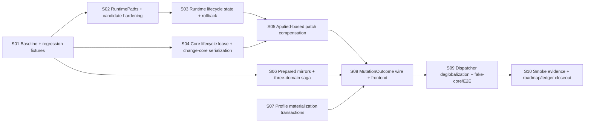

# PR-4S — PR-1～PR-4 稳定化门任务拆解（task.md）

- **关联设计：** [`./design.md`](./design.md)；下文 `design §N` 均指该文件。
- **任务定位：** roadmap v3 的单一硬前置 Task `R4S`。内部拆成 S01～S10 commit group，全部属于同一 atomic PR；任何子集都不能单独宣告稳定化完成。
- **分支建议：** `fix/pr4s-actor-migration-stabilization`
- **基线：** `main @ 429045202`；开始实现时 rebase 并重新运行 architecture ledger。
- **建议 PR 标题：** `fix(tauri)!: close PR1-4 actor-migration consistency and regression gaps (PR-4S)`

---

## 0. 全局约束

1. 无新 `::global()`、mutable static service、service locator。
2. 固定锁顺序：`patch_gate → rebuild_gate → CoreLifecycleLease → short runtime-store write`。
3. Actor/client/pure service 禁止 import Tauri；Tauri、OS、FS、process 只在 adapter。
4. 普通 config mutation：commit-first + committed-degraded；不做通用 desired rollback。
5. all-or-nothing operation 必须有 prepare/commit/compensate/failure matrix。
6. 所有测试路径来自 TempDir 注入；禁止真实用户 dirs。
7. Actor 并发测试禁止 sleep；使用 barrier、oneshot、RPC ack 或 test hook。
8. 每个 commit group 均需 build/test 绿；但 wire 切换 S08～S09 作为原子小组一起合并。
9. 所有 compatibility residual 必须带规范 `TODO(actor-migration)`、原因和删除条件。
10. PR 合并前，四个 PR-4 unresolved review finding 必须 resolved 或以明确代码 disposition 关闭。

---

## 1. 依赖图



### 并行 lane

- S02、S04、S06、S07 可在 S01 后并行；
- S03 依赖 S02；
- S05 依赖 S03+S04；
- S08 必须等待 S05+S06+S07；
- S08/S09 是行为切换组；
- S10 只在完整实现后执行。

---

## 2. 任务总表

| ID  | 任务                                       | Scope                                                  | 建议 commit                                                                      | Design       |
| --- | ------------------------------------------ | ------------------------------------------------------ | -------------------------------------------------------------------------------- | ------------ |
| S01 | 基线、故障注入接口与回归 fixtures          | 固化当前缺陷和既有回归，不改生产行为                   | `test: pin PR1-4 migration regressions and failure contracts`                    | §1, §8       |
| S02 | RuntimePaths 与 candidate 安全             | 路径全注入、私有随机 candidate、cleanup                | `refactor(tauri): inject runtime paths and harden candidate files`               | §6.1–6.2     |
| S03 | RuntimeLifecycleState 与 rollback snapshot | promoted/applied/revision/hash；完整恢复               | `fix(tauri): track promoted and applied runtime revisions`                       | §4, §6.4–6.5 |
| S04 | CoreLifecycleLease                         | 统一 run/restart/change-core 锁域                      | `fix(core): serialize core lifecycle through an exclusive lease`                 | §6.3, §6.6   |
| S05 | Patch gate 与 Applied compensation         | set/remove compensation、revision conflict             | `fix(tauri): compensate runtime patches from applied state`                      | §6.7         |
| S06 | Prepared mirror 与三域 saga                | 消灭 ghost Err 和 silent partial commit                | `fix(state): make legacy mirrors prepared and cross-domain patches compensating` | §6.8–6.9     |
| S07 | Profile materialization transaction        | add/replace/refresh/delete 的恢复协议                  | `fix(profile): make profile state and materialization recoverable`               | §6.10        |
| S08 | MutationOutcome wire                       | 统一 phase/code degradation 与前端                     | `feat(ipc)!: expose structured committed-degraded mutation outcomes`             | §6.11, §9    |
| S09 | Dispatcher 与 fake-core                    | bounded/coalescing、可销毁 service graph、进程故障注入 | `refactor(tauri): remove process-global rebuild handler and add fake-core tests` | §6.12, §8.5  |
| S10 | 验收与文档收尾                             | 三平台 smoke、review disposition、roadmap ledger       | `docs: close PR-4S stabilization gate`                                           | §13          |

---

## 3. 任务卡

## S01 — 基线、故障注入接口与回归 fixtures

**目标：** 先用测试复现/冻结缺陷，避免后续重构掩盖行为。

**Files：**

- Create: test-support failure toggles / fixtures；
- Modify: migration profiles/typed-config tests；
- Modify: specta export tests；
- Modify: runtime/core/profile actor tests；
- Create: architecture ledger initial script（只报告，不先 fail）。

**必须先红的测试：**

1. `change_core` rollback 窗口并发 restart 可进入；
2. rollback product restore 后 runtime store 仍指向新核；
3. actor mirror 失败后 state version 已增长；
4. three-domain patch 第二域失败留下第一域新值；
5. profile add 文件失败仍返回成功/留下 state；
6. remote refresh metadata persist 失败后文件仍为新值；
7. 单测解析到真实 runtime product 路径；
8. compensation 无法 remove 新键或错误使用 promoted；
9. REGEN bridge 第二 client 使用第一 client handler。

**既有回归 fixtures：**

- #4893 IPv6 migration；
- #4916 local profile import；
- #4917/#4920 remote/wire shapes；
- #4921 mixed-port immediate effect；
- PR-4 五项 smoke 的可自动化部分。

**验证：** 测试名称和 failure reason 与 design failure matrix 一一对应；不通过修改断言来“修绿”。

---

## S02 — RuntimePaths 与 candidate hardening

**目标：** runtime 产品和候选路径全部由 composition root 注入，候选文件满足私有、随机、可清理要求。

**Files：**

- Create/Modify: `client/runtime_paths.rs` 或 `client/runtime.rs`；
- Modify: `ClientSetupArgs`、`setup.rs`；
- Modify: runtime publisher/core adapter/boot fallback；
- Delete: runtime path 对 `utils::dirs` 的直接依赖；
- Modify: tests 使用 TempDir。

**接口：**

```rust
RuntimePaths::new(product, candidate_dir)
CandidateFile::create(&RuntimePaths, bytes)
CandidateFile::path/hash/cleanup
```

**实现要求：**

- candidate_dir 非 symlink/reparse point；
- random name + `create_new`；
- Unix 0600；
- hash；
- Drop cleanup；
- startup stale cleanup；
- product promote 后 hash 校验。

**验证：**

- 所有 runtime tests 写 TempDir；
- candidate collision、symlink、cleanup、stale cleanup、permission tests；
- architecture ledger 对 test 中真实 dirs 命中为 0。

---

## S03 — RuntimeLifecycleState 与 rollback snapshot

**目标：** 显式区分 promoted/applied，并修复深层 rollback read-model 失真。

**Files：**

- Modify: `client/runtime.rs`；
- Modify: `client/mod.rs` rebuild publication；
- Modify: `client/rebuild.rs` change-core；
- Modify: runtime IPC reads；
- Modify: specta only if public health type exposed。

**接口：**

```rust
RuntimeSnapshot { revision, target_core, product_sha256, ... }
RuntimeLifecycleState { promoted, applied }
RuntimeTransactionSnapshot { product, lifecycle, selected_core }
```

**行为：**

- check/promote 成功 → promoted 更新；
- apply/restart 成功 → applied 更新；
- apply 失败 → applied 保旧；
- rollback product restore → promoted 恢复；
- old core restart 成功 → applied 恢复；
- 四读 IPC 读 promoted。

**验证：**

- 所有失败分支断言 product hash、promoted、applied；
- 深层 rollback 回归测试转绿；
- `applied` 不得在仅 check/promote 时前进。

---

## S04 — CoreLifecycleLease 与 change-core serialization

**目标：** 所有核心生命周期操作共享同一互斥域，消除换核 rollback 期间并发 restart。

**Files：**

- Create: `CoreLifecyclePort/CoreLifecycleLease` trait；
- Relocate/Modify: Legacy CoreManager adapter；
- Modify: `CoreManager` inner/public method split；
- Modify: `client/rebuild.rs`；
- Modify: `ipc::restart_sidecar`、startup/recover 调用链。

**要求：**

- `begin()` 获得与 `CoreManager::run_core()` 相同的锁；
- lease 内调用 unlocked inner，不重入锁；
- change-core 全程持有 rebuild gate + lease；
- direct run/recover 也必须等待 lease；
- 锁顺序注释和测试固定。

**验证：**

- barrier 并发测试，不 sleep；
- restart 在 rollback 结束前不能进入；
- recover/backoff 不产生死锁；
- fixed-port 旧核占用 scenario 先作为 fake adapter test 固化。

---

## S05 — Patch gate 与 Applied-based compensation

**目标：** 修复 D6 补偿读取错误状态、不能删除新键和并发覆盖问题。

**Files：**

- Modify: `client/runtime.rs` compensation model；
- Modify: `NyanpasuClientInner` 加 `clash_patch_gate`；
- Move: IPC business orchestration 到 facade method；
- Modify: `ipc.rs` 保持 thin adapter；
- Modify: `feat::patch_clash` 阻塞链。

**接口：**

```rust
PatchCompensationPlan {
    expected_applied_revision,
    ops: Vec<PatchCompensationOp>,
}
```

**要求：**

- previous 来自 applied；
- absent old key → Remove；
- expected revision 不匹配则拒绝 stale compensation；
- patch/rebuild/apply/compensate 在 patch gate 内保序；
- IPC 不直接调用 core API + feat 编排两套业务逻辑。

**验证：**

- set→rollback；
- newly-added key→remove；
- no applied snapshot；
- concurrent patch conflict；
- apply degraded 后下一 patch 仍以真实 applied 为基准。

---

## S06 — Prepared mirrors 与 version-checked three-domain saga

**目标：** 消灭 typed commit 后 mirror error 和 legacy patch 的部分提交。

**Files：**

- Modify: `state/mirror.rs`；
- Modify: `bridge/verge.rs`, `bridge/window.rs`, `bridge/clash.rs`；
- Modify: three typed actors/clients；
- Modify: LegacyVergeBridge patch/replace flow。

**Prepared mirror：**

- `prepare(next) -> Box<dyn PreparedLegacyMirror>`；
- prepare 期间完成全部 serialization/conversion；
- actor persist 后 `apply()` 不可失败且不做 IO。

**Saga：**

- 新消息 `ReplaceIfVersion`；
- 读三个 snapshot+version；
- 全部 prevalidate/prepare；
- Application→Session→Clash；
- 失败逆序 compensation；
- compensation conflict → `PartialCommit` + critical degradation。

**验证：**

- mirror prepare fail 零提交；
- apply 无 Result；
- 第二/第三域失败；
- concurrent typed update version conflict；
- compensation fail 明确列出 domain。

---

## S07 — Profile materialization transaction

**目标：** 使 Profiles 状态和物化文件在失败时可恢复，warning 可观察。

**Files：**

- Modify: `state/profiles/actor.rs`；
- Modify: profile ports/service；
- Modify: `client/profiles.rs`；
- Create: staging/cleanup journal 类型和 startup reconcile；
- Modify: profile tests。

**操作规则：**

- Add：stage → persist → rename；rename fail 则 version-checked state rollback；
- ReplaceDefinition：prepare new → persist → finalize → cleanup old；
- Refresh：stage/capture old → promote → persist metadata；persist fail 恢复 old；
- Delete：state commit 为权威；cleanup fail 入 persistent queue + degraded；
- symlink/reparse point 必须拒绝意外写穿。

**Outcome：** 所有 warnings 转为 typed degradation，不只 tracing。

**验证：**

- 每个阶段 failure injection；
- crash journal fixture；
- cleanup retry；
- no orphan success state；
- remote stale fence 保持。

---

## S08 — MutationOutcome wire 与前端原子切换

**目标：** 统一 mutation success/degraded 语义，并把 profile/materialization/runtime warnings 交付前端。

**Files：**

- Create/Modify: outcome domain types；
- Modify: facade mutation APIs；
- Modify: profile/runtime IPC；
- Modify: `specta_export.rs`；
- Generated: `bindings.ts`；
- Modify: interface hooks、MutationCache、toast i18n。

**Wire：**

```text
{ status: "applied", value }
{ status: "committed_degraded", value, degradations: [...] }
```

**要求：**

- 不保留 `_v1` aliases；
- `unwrapResult` 穷尽返回 T；
- phase/code 本地化；message 仅详细展示/日志；
- create/import/update/delete/reorder/activate/patch 一致；
- frontend mutation 仍 invalidate committed state。

**验证：**

- Specta union 逐字冻结；
- TS typecheck/build；
- five-locale keys；
- applied/degraded/error 三类前端路径。

---

## S09 — Dispatcher 去全局化、fake-core 与完整 E2E

**目标：** service graph 可独立创建/销毁；以真实子进程故障注入验证生命周期。

**Files：**

- Modify/Delete: `REGEN_BRIDGE`/OnceCell；
- Create: `RebuildCoordinator`；
- Modify: remaining legacy call sites 接受 facade/port；
- Create: test-only fake-core binary；
- Create: integration tests。

**Coordinator：**

- background dirty signal 容量 1/coalescing；
- request/reply 直接 facade method；
- shutdown；
- 多 client graph 互不影响。

**Fake-core：** check/start/apply failure、barrier、port hold、日志、退出码。

**验证：**

- two-client isolation；
- burst bounded；
- shutdown 后无悬挂 task；
- change-core/restart/apply failure matrix 使用 fake process 通过。

---

## S10 — Smoke evidence、review disposition 与 roadmap closeout

**目标：** 将“代码完成”转为可审计验收完成。

**交付：**

1. PR-4 四个 unresolved review finding disposition 表；
2. PR-4 五项 smoke 以及 design §13.2 新增 smoke 记录；
3. Windows/macOS/Linux build、core version、步骤、日志/artifact；
4. architecture ledger 由报告模式改为 CI gate；
5. roadmap 状态/数字/依赖图更新；
6. PR-4 spec §12 addendum：哪些决策被 PR-4S 修正；
7. residual TODO ledger，明确 PR-5/6 owner；
8. full test/build commands 和结果记录。

**禁止：** 仅在 PR 描述打勾但不附证据。

---

## 4. PR-4 review finding disposition（必须完成）

| Finding                                  | 当前判断                                                               | PR-4S 处置                                                  |
| ---------------------------------------- | ---------------------------------------------------------------------- | ----------------------------------------------------------- |
| createProfile `undefined` review comment | typed error 实际 throw，但 helper 返回类型不穷尽，易掩盖未来 wire 漂移 | S08 将 `unwrapResult` 改为 exhaustive `T`，加 contract test |
| rollback test 写真实用户 runtime path    | 有效 correctness/test-isolation finding                                | S02 全路径注入并删除真实路径访问                            |
| change_core 与 run_core 锁域竞态         | 有效 P2 correctness finding                                            | S04 lifecycle lease + barrier test                          |
| product rollback 未恢复 runtime store    | 有效 P2 correctness finding                                            | S03 transaction snapshot 同步恢复                           |

所有 thread 在代码合并前必须 resolve；延期不接受。

---

## 5. 最终验收 checklist

### 架构

- [ ] no new global/static service
- [ ] RuntimePaths injected everywhere
- [ ] promoted/applied revisions visible
- [ ] one lifecycle lease covers all core mutations
- [ ] mirror prepare before persist; apply infallible
- [ ] three-domain patch saga version-checked
- [ ] profile materialization recoverable
- [ ] dispatcher test-resettable/deglobalized
- [ ] Tauri commands thin

### 正确性

- [ ] change-core concurrent restart blocked
- [ ] rollback restores product/promoted/applied/core
- [ ] D6 supports remove and revision conflict
- [ ] no ghost Err after typed commit
- [ ] no silent partial domain commit
- [ ] profile file failure not returned as naked success
- [ ] remote refresh metadata failure restores old file

### 测试

- [ ] zero test access to real user dirs
- [ ] no sleep-based actor concurrency tests
- [ ] fake-core failure matrix green
- [ ] regression fixtures #4893/#4916/#4917/#4920/#4921 green
- [ ] Windows/macOS/Linux CI green
- [ ] bindings freshness green

### 证据

- [ ] PR-4 review threads resolved
- [ ] manual smoke records attached
- [ ] roadmap ledger generated and current
- [ ] residual TODO owner/removal condition complete

只有全部勾选后，roadmap 才能把 PR-4S 标为完成并解锁 PR-5a。
