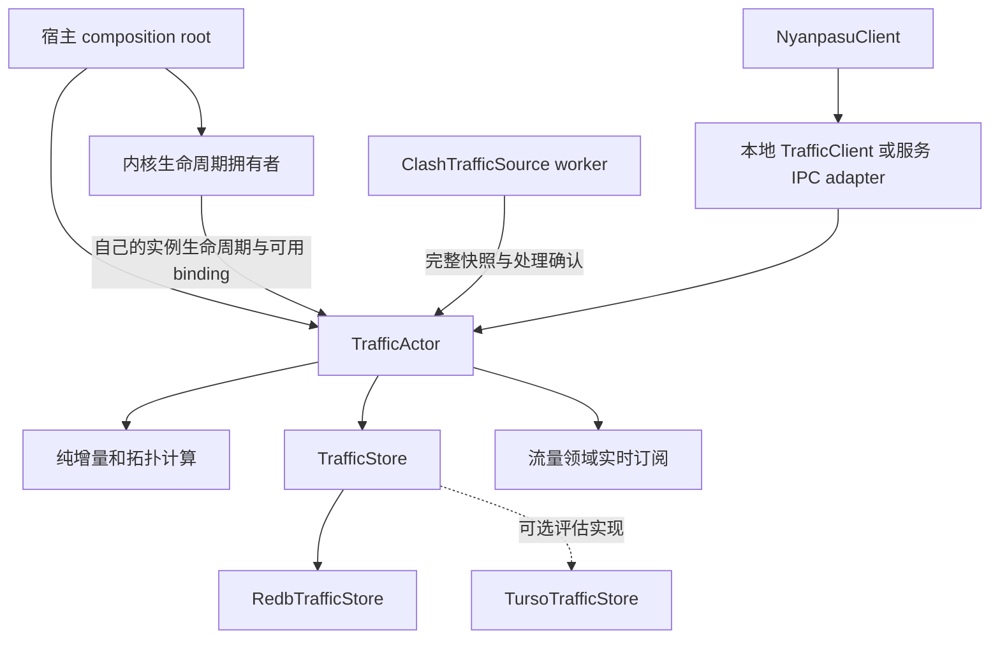

# 内核会话级连接历史与流量统计设计

**日期：** 2026-09-30

**状态：** 后端实施与 leader review 已完成；验证结果、未执行验收及发行边界见 [tasks.md](./tasks.md)。

**源码基线：** 主仓库 `9c16aba1c`，runtime 子模块 `c62514a`。

**实施计划：** [tasks.md](./tasks.md)。

**权威顺序：** 用户当前要求 > 适用的 `AGENTS.md` > 本设计 > 实施计划。

## 1. 目标与范围

新增独立后端领域库 `nyanpasu-traffic`，以一个真实内核进程从启动到退出作为 session，持续记录观测到的连接及流量。连接页、规则页、拓扑页和未来流量统计页共享同一套事实、累计值和查询口径。

| 需求               | 本阶段后端交付                                                                  |
| ------------------ | ------------------------------------------------------------------------------- |
| 查看已关闭连接     | 保存连接详情、最后观测计数、关闭检测时间和原因，支持分页与过滤                  |
| 规则流量反查       | 规则归因键对应的 session 上传/下载累计量、实时速率、关联连接                    |
| 历史拓扑           | 保存当时报告的逻辑路径，查询实时和历史节点/边/路径统计                          |
| 流量统计板块       | session 总览、进程/规则/目标/出口分组、排行、分钟趋势和明细下钻                 |
| 内存可控、数据落盘 | 活跃状态驻内存，历史与累计索引落盘，redb 页缓存显式设限                         |
| 后续更换数据库     | 领域 `TrafficStore` trait，首个生产实现为 redb，替换时不改 actor 或应用查询语义 |
| 服务模式连续记录   | 采集与数据库 owner 运行在实际承载内核的宿主中，不依赖桌面进程存在               |

原后端实施阶段不实现新页面、图表、报表导出、跨 session 合并、云同步、Turso adapter、内核补丁或精确计费。允许必要的现有消费链迁移和生成类型更新，保证替换 owner 后现有功能继续工作；这不等于实现历史页面。

用户在后端实施完成后追加了独立 Sol agent 的双 store 对照评估：新增 `turso-store` 可选 feature 下的本地 `TursoTrafficStore`，不改变默认 redb 组合。该追加工作的验证、方法和结果见 [store-benchmark.md](./store-benchmark.md)。不提供 redb/Turso 文件迁移或生产切换配置。

“历史”首先指当前 session 内已发生的数据。停止后保留最近一个结束的 session 供查询；新 session 建立成功后旧 session 才按保留策略清理。默认不承诺长期跨 session 档案。

## 2. 已核对的现状与变更边界

| 位置                                                                                                                    | 当前行为                                                                                          | 本设计中的变化                                                 |
| ----------------------------------------------------------------------------------------------------------------------- | ------------------------------------------------------------------------------------------------- | -------------------------------------------------------------- |
| [core/clash/ws.rs](../../../../backend/tauri/src/core/clash/ws.rs)                                                      | `StreamsActor` 同时拥有 connections/logs/traffic/memory；摘要历史 32 帧；明细仅最新帧且按订阅生成 | 迁出连接及流量职责；保留日志/内存领域的采集                    |
| [connection_rates.rs](../../../../backend/tauri/src/core/clash/connection_rates.rs)                                     | 相邻快照计算速率，消失的连接被丢弃                                                                | 将有用的纯计算迁入新库，增加累计入账、关闭检测和质量状态       |
| [connection_details.rs](../../../../backend/tauri/src/core/clash/connection_details.rs)                                 | Tauri 管理 webview 订阅生命周期                                                                   | 留在边界；改订阅 `TrafficClient`，不承担存储                   |
| [client/clash_streams.rs](../../../../backend/tauri/src/client/clash_streams.rs)                                        | facade 代理 `StreamsClient`                                                                       | 增加 traffic facade，迁移调用方，不形成服务定位器              |
| [actor_v2/api.rs](../../../../backend/tauri/src/core/actor_v2/api.rs)                                                   | capability 校验完整 controller binding，变化会撤销                                                | 保留控制接口边界；不能把 capability 的变化当作 session 变化    |
| [core-manager/state.rs](../../../../backend/nyanpasu-runtime/crates/nyanpasu-core-manager/src/state.rs)                 | `CoreStatus.instance_id` 区分实际进程；epoch/config revision 含义不同                             | session 使用真实 instance ID，不能只使用 PID、epoch 或连接地址 |
| [core-manager/snapshot.rs](../../../../backend/nyanpasu-runtime/crates/nyanpasu-core-manager/src/snapshot.rs)           | effective config 通知是合并更新的 `watch`，不是提交日志                                           | 仅用作可用归因上下文，不承诺完整配置历史                       |
| [service-runtime/server/mod.rs](../../../../backend/nyanpasu-runtime/crates/nyanpasu-service-runtime/src/server/mod.rs) | 服务构造 manager 和 IPC 状态                                                                      | 构造服务端 traffic owner、存储与查询 adapter                   |
| [topology.ts](<../../../../frontend/nyanpasu/src/pages/(main)/main/topology/_modules/topology.ts>)                      | 从当前连接计算进程/规则/组链/出口四层拓扑                                                         | 新后端提供同口径历史投影；布局仍属 UI                          |

本设计明确取代 [2026-09-29 设计](../2026-09-29-stream-proxies-payload/design.md) 中“后端不保留明细历史”的决定。继续保留其“UI 明细按需、只推最新帧、摘要不含完整连接列表”的性能边界。不修改该历史文档来伪装原始决定。

## 3. 分层、依赖与运行位置

### 3.1 新库结构

```text
backend/nyanpasu-runtime/crates/nyanpasu-traffic/
  src/
    lib.rs
    model.rs          session、连接、查询、质量与错误类型
    actor.rs          TrafficActor 和 typed message
    client.rs         TrafficClient 的普通 async API
    accounting.rs     纯增量、归因和时间桶计算
    topology.rs       纯逻辑路径投影
    ports.rs          TrafficSource、TrafficStore、Clock
    adapters/
      clash.rs        clash-api 数据源
      redb.rs         RedbTrafficStore，redb-store feature
  tests/              契约、生命周期、查询、真实 adapter 测试
```

分类：`TrafficActor` 是 actor service；增量与拓扑计算是 pure services；Clash、redb、时钟、宿主生命周期和 IPC 是 adapters/ports。

新库不依赖 Tauri、`nyanpasu-ipc`、应用 facade 或 core manager。宿主同时依赖 core manager 和 traffic 库，负责把生命周期变成领域输入。`clash-api` 只在数据源 adapter 使用；序列化模型和 trait 不暴露数据库类型或 controller 凭据。需要导出类型时使用可选的 `specta` feature。



`TrafficActor` 不向 `CoreActor`、配置 actor 或 `StreamsActor` 同步反查。生命周期拥有者下发自己的 slice；配置上下文也只能来自其拥有者，不能经由兄弟 actor 转发。composition root 显式注入依赖，不增加 registry、全局 singleton 或动态 service lookup。图中的纯函数调用与存储调用都在单次消息处理内完成，不代表另起后台任务。

### 3.2 宿主一致性

- 本地模式：应用的 composition root 在启动内核前准备 traffic owner，与本地 manager 共用应用根 cancellation token。
- 服务模式：服务 composition root 创建 owner；桌面端通过 IPC 获取结果，不能再直接采集相同内核的 connections 流。
- 数据库仅由所属宿主打开。服务账户和本地用户各自拥有独立存储目录；不能让桌面直接打开服务的 redb 文件。
- UI 退出、IPC 断开不结束服务端 session。宿主切换引起真实进程替换时，开始新 session；不拼接成一个伪连续 session。
- 控制内核启动不能被磁盘错误无限阻塞：记录不可用必须暴露为 degraded，不能把它伪装成空统计或成功记录。

### 3.3 生命周期输入的完整性

现有 `CoreStatus` 的 `watch` 可合并快速变化，仅靠轮询最新状态会漏掉短命实例。实施时在生命周期拥有者的真实启动/退出路径提供有序、带 instance ID 的通知；traffic actor 就绪后才挂接，通知仅携带该 owner 的状态，不读取流量回执内容。

每个实际实例都建立 session 元数据；若实例退出前 controller 从未可用，保留“无采样/覆盖不完整”session。允许使用最新状态做首次对账和重连恢复，但不能把 `watch` 称为完整生命周期日志。生命周期发布不等待整个采集流结束，禁止 manager → traffic → manager 的请求环。

## 4. 与现有 connections WS actor 的协作

采用职责迁移，不采用 `StreamsActor` 和 `TrafficActor` 各自维护统计的双 owner 方案。

1. 从 `StreamsActor` 迁出 `/connections` worker、前次连接计数、速率计算和流量发布职责。
2. `TrafficActor` 管理该 worker 的启动、重连、取消和退出；保留“一份采样等待一次处理确认”的现有交付模式。
3. 采集入口始终提交完整快照，与 UI receiver 数量、实时图表暂停或 webview 生命周期无关。
4. 历史写入不经过 `watch`/broadcast；这些可以合并/丢帧的通道仅用于下游实时展示。
5. 提交成功后，由同一个 traffic owner 发布摘要及可选明细，统一携带 `(session_id, revision)`。
6. `StreamsActor` 保留日志和内存；不得订阅再转发 traffic 数据。Tauri boundary 可分别订阅两个领域，但不能伪造一个有原子保证的跨领域 sequence。

默认请求 1 秒采样，沿用当前连接流频率。source 在完整帧接收时附带单调时间和墙钟时间；速率用接收时间间隔，不能使用数据库提交结束时间作为采样时刻。背压只能限制应用侧未处理采样，不会让内核快照变成无损连接事件流。

`/connections` 的全局累计字段作为入账基准。第一版不额外订阅 `/traffic` 进行入账；现有速率卡片迁移为相邻全局计数的采样速率。若以后保留内核原生 `/traffic` 速率，它必须标注来源，仅作展示，不能与 connections 的字节数重复累计。

现有 recording/clear-history API 需逐一迁移：它们最多控制实时展示缓存，不能隐式停止 session 记录或清空累计账。没有 UI 订阅时，省略明细 DTO 克隆和 IPC 序列化，但仍进行采集及落盘。

## 5. session 与连接生命周期

### 5.1 session 身份

`SessionId` 与 `(HostId, instance_id)` 唯一关联。`HostId` 由 composition root 提供，区分本地/服务的存储命名空间；不能用 controller URL、secret、PID 或配置版本作为实例身份。

| 事件                                     | 行为                                                         |
| ---------------------------------------- | ------------------------------------------------------------ |
| 新的真实 instance ID                     | 创建新 session；旧实例结束独立封存                           |
| 同实例 WS 重连/controller 或 secret 改变 | 同 session 重新绑定，增加 source generation，记录采样间隙    |
| 同实例配置更新                           | 不换 session；后续归因携带新的可用上下文                     |
| 内核退出/崩溃                            | 封存 session，活跃连接记录为因实例结束而关闭，计数不臆测补齐 |
| 只有 controller 不可达                   | 标记 stale，不能推断所有连接关闭                             |
| 中途附着到已运行内核                     | 建立或恢复该实例的 session，标记 late attach，记录可观测起点 |

进程启动时间、首个采样时间、最后采样时间、停止检测时间分别保存。无法获取的真实启动/退出时刻为可选字段，不能用第一次看到它的时间冒充。

源消息包含 instance ID 和 source generation。旧 worker 的迟到样本/断线通知不得影响新 binding；实例切换也不能清除其他实例已提交的历史。若 graceful switch 中旧实例仍在 drain，按实例管理仍存活的采集 worker，旧实例真实退出后封存；不混入新 session。公开查询默认选当前实例，旧实例不因暂时失去“当前”身份而被删除。

### 5.2 连接状态

主键为 `(session_id, connection_id)`。记录至少包含：原始开始时间、首次/最后观测时间、原始 metadata、rule/payload、chains/providerChains、累计计数、已入账计数、状态和归因质量。

连接状态为 `Active` 或 `Closed`，另带观测新鲜度；`Closed` 包含检测时间、`MissingFromSnapshot`/`CoreExited` 等原因和 `final_counters_exact = false`。缺失 metadata 不丢弃连接，使用明确的 unknown 维度。

只有成功解码且有效的完整快照才能判断连接消失。错误、无效帧、断流不是空列表。`connections: null` 按协议是有效的空列表。非法负计数帧不参与入账或关闭检测，记录质量异常。

Closed 历史不常驻活跃内存表。例外是完整快照明确再次报告同 session 内的同 ID：仅恢复这些 ID 的已入账基线，最新状态改为 Active，保留重现标记并避免重复累计或增加唯一连接数。连接记录表达最新状态与持久化质量证据，不提供全部开闭事件的回放日志。连接关闭命令的成功只代表控制操作成功，不代表已经拿到最终字节数。

## 6. 流量模型与计算口径

### 6.1 三种值严格分开

| 值                    | 含义                                                |
| --------------------- | --------------------------------------------------- |
| `core_reported_bytes` | 到最后成功采样为止，内核全局计数得到的累计量        |
| `attributed_bytes`    | 按连接已观测计数增量归因的累计量                    |
| `current_rate`        | 连续有效采样间的字节增量/实际单调时间间隔，单位 B/s |

这些值都不是网卡物理字节或运营商计费口径。上传/下载始终分别保存。session 总量只计一次；按进程、规则、出口等维度查询是同一流量的不同投影，不能跨维度相加。

`first_sample_at = None` 表示尚无成功采样，累计值的初始零不能解释为测得零消耗；短命实例即使已结束也可能处于这种覆盖状态。调用方结合首次/末次采样时间、freshness 和质量标记解释累计值。

对两次连续有效观测的同一连接，入账增量为 `current - last_accounted`。首次发现连接时，把其当前非负累计计数入账一次，但首个速率为 unknown，不假定它全部发生在最后一秒。第一份全局计数也记录其累计值，同时标记此前时间分布不可知。

计数回退不使用 saturating subtraction 悄悄掩盖：标记 counter reset，开启该计数的新连续区段，将新非负计数作为新区段已观察到的字节一次入账；回退期间缺失量不可恢复，速率重建基线。负值/溢出作为无效数据报告，不能转换为巨大无符号数。全局和连接计数分别跟踪 reset，不能假定同步归零。

`core_reported_bytes - attributed_bytes` 只在同方向、同 session、同观测范围下对比，返回差额方向与数值。不得把负差额截成零来伪造守恒；重置、取样非原子性或归因范围差异均需展示质量标记。正差额描述为未归因差额，不武断宣称全是某一种短连接流量。

### 6.2 缺口、停止与恢复

断线保留已提交的连接基线。重连后仍存在的同 ID 连接可以补记累计增量；这些字节的时间分布未知，不能变成重连瞬间速率。新的速率从下一对连续采样恢复。断线期间结束且未被观测的连接无法恢复。

停止时若 controller 仍可用，可由 source adapter 尝试最后快照，其网络 deadline 属于 adapter；不能阻止内核停机或声称这是精确结束事件。最终报告带最后采样时间、gap、late attach、counter reset 等质量信息。

实时 `None` 表示未知/过期，`Some(0)` 才表示有效观测下的零速率。兼容当前展示字段时，只能在边界投影为零并同时携带 freshness，领域内不能抹平区别。

### 6.3 归因维度与规则身份

最小维度：进程（优先规范化可用路径，保留显示名）、来源、目标 host/IP、协议、规则类型/payload、有序逻辑路径、出口。保留原始证据，规范化是纯计算，不进行隐式 DNS、GeoIP、文件或网络访问。

规则键不是配置行号。记录 reported rule/payload 和首次归因时可用的配置上下文标识；该上下文只说明观测时可用的版本，不能证明连接建立时命中的版本。重复规则标记 ambiguous；RULE-SET 只到 provider 粒度。API 未报告的 rule index 不得推导成确定事实。规则页可查询报告键的合计，也可按已知上下文细分。

配置上下文只保存去除 secret 的规则/节点身份信息及版本标识，不把完整 effective config 写入统计库。配置变更后不得用当前规则文本重解释旧记录。

若连接 metadata 后来补全，保留连接最新详情；已入账字节仍保留原先维度，后续增量使用新维度。报告归因区段，避免把全部历史字节无依据地重写到新进程/新路径。

### 6.4 拓扑

沿用当前四层含义：`进程或来源 → 规则 → 组链 → 出口`。`chains` 表示内核逻辑选择链，不宣称物理网络跳点。保留原始顺序，由纯投影函数解释。

累计路径/边统计源于入账增量，不依赖当前活跃列表。每条路径的字节可出现在多个边上，但所有边之和不是 session 总流量。同一连接在不同归因区段可能经过不同路径，路径计数不能相加当作唯一连接数；唯一连接计数需按 ID 去重或返回不同的明确指标。

实时边速率来自当前有效采样，历史边字节来自持久化汇总。查询返回后端聚合结果和可用于连接下钻的维度过滤条件，不把历史所有 connection IDs 塞进每个节点。

### 6.5 时间窗口

第一版提供整个 session 累计及 UTC 对齐的 1 分钟桶，不提供秒级历史重放。窗口为 `[from, to)`，分钟查询要求边界对齐并返回实际覆盖范围。

连续采样的增量按采样结束时间归入分钟桶，明确为 observation-time 估算；不假装知道每个字节发生的精确时刻。首次累计、重连跨缺口补账、reset 区段的未知时间分布单独保存为 `time_unallocated`，包含可知的观测区间；不均匀摊派进分钟桶。

session 累计包含已入账的 time-unallocated 字节。趋势返回桶值和未知时间分布说明，因此桶之和不一定等于 session 累计。任意窗口无法确定分布的部分返回“不确定”，不能包装为精确窗口总量。明细筛选的连接开始/结束时间与流量发生窗口是不同过滤条件。

## 7. 存储 port 与一致性

### 7.1 接口形状

采用 object-safe async trait（实现使用 `async_trait`），以 `Arc<dyn TrafficStore>` 显式注入。以下展示主要领域方法；完整签名及恢复基线的单条/批量读取见 [ports.rs](../../../../backend/nyanpasu-runtime/crates/nyanpasu-traffic/src/ports.rs)：

```rust
#[async_trait::async_trait]
pub trait TrafficStore: Send + Sync + 'static {
    async fn recover(&self, host: HostId) -> Result<RecoveryState, StoreError>;
    async fn begin_session(&self, session: NewSession) -> Result<SessionRecord, StoreError>;
    async fn commit_observation(&self, batch: ObservationCommit) -> Result<CommitReceipt, StoreError>;
    async fn committed_position(&self, session: SessionId) -> Result<CommittedPosition, StoreError>;
    async fn finish_session(&self, end: SessionEnd) -> Result<CommitReceipt, StoreError>;
    async fn session(&self, id: SessionId) -> Result<SessionRecord, StoreError>;
    async fn latest_session(&self, host: HostId) -> Result<Option<SessionRecord>, StoreError>;
    async fn query_connections(&self, query: ConnectionsQuery) -> Result<ConnectionPage, StoreError>;
    async fn query_usage(&self, query: UsageQuery) -> Result<UsageResult, StoreError>;
    async fn query_topology(&self, query: TopologyQuery) -> Result<TopologyResult, StoreError>;
    async fn prune(&self, policy: RetentionPolicy) -> Result<PruneReport, StoreError>;
    async fn flush(&self) -> Result<(), StoreError>;
}
```

构造/open/close 数据库由 adapter 生命周期管理，不暴露通用 SQL/KV 执行、redb table handle 或任意事务回调。`ObservationCommit` 已包含纯服务计算出的领域变化，adapter 不重新实现归因算法。

### 7.2 原子与幂等

- 每个 session 有单调递增 observation sequence；批次包含期望前序位置、批次摘要及当前序号。
- 连接更新、归因区段、汇总、分钟桶、质量事件、counter baseline、sequence 在同一事务提交。
- 最新已提交序号的同内容重试返回 receipt；同序号不同内容返回 conflict；跳号/前序不匹配拒绝。串行 owner 对每个实例同时只保留一个待核实批次，不会在该实例的后续批次提交后重试更早批次；早于当前位置的请求明确返回 stale/conflict。adapter 只需保留当前提交与封存回执，不能为每秒采样无限追加回执日志。
- `finish_session` 也必须幂等，不得重复关闭/重复加账；不能封存仍有未解决提交结果的 session。
- 持久化成功后 actor 才替换自身 baseline、递增发布版本。累计查询和已发布版本均指向已提交位置。
- 不同查询操作每次使用一致读；不承诺不同时间发出的多个查询天然是同一个快照。

成功 receipt 承诺宿主进程重启后可恢复该提交，redb adapter 使用满足此契约的提交持久性设置。未来 adapter 不得在仅写入进程内缓存时返回同等成功。电源故障的保证仍受文件系统和设备影响，不宣称超出数据库自身持久性模型。

Turso adapter 也必须通过这些契约测试，使用事务和唯一约束实现同等语义；“支持 SQL”不自动代表已满足 port。追加评估实现与 redb 共用基础契约，并增加 adapter 专项测试；完整验证边界见对照报告。数据库替换不包含旧文件的自动格式迁移。

### 7.3 错误与提交不确定性

错误区分 unavailable、capacity exhausted、corrupt/incompatible schema、conflict 和 unknown commit outcome。事务已确定未提交时，可以保持旧 baseline，随后接收较新的完整累计快照；中间已经关闭的连接可能无法补回，须记录 gap。

结果不确定时，每个存活实例仅保留当前这一份待核实批次，查询 committed position/摘要，或以完全相同批次重试；不得先推进 baseline 或用同序号提交不同内容。graceful drain 期间不同实例有独立 session 账目，可各持有一份待核实批次。actor 每次消息完成一次恢复步骤，不建立重试队列、不在 handler 内无限循环等待数据库恢复。恢复期间读者仍能读最后提交数据，状态显示 degraded。

一次失败对应一个有界状态和错误，不把整段原始采样排队留在内存。宿主退出时若仍无法落盘，报告失败；下次依据持久化位置恢复，不能声称未落盘部分已保存。

### 7.4 redb 实现

采用宿主专用存储目录和独立 traffic 数据库，避免与 jobs/config 共用事务域。第一版可用一个包含 session 命名空间的数据库文件，schema version 写入 meta；数据库目录和缓存大小由 composition root 显式传入。默认页缓存预算 32 MiB，属于页缓存预算而非进程 RSS 硬限制。

逻辑表/索引至少包含：

| 类别               | 内容                                                         |
| ------------------ | ------------------------------------------------------------ |
| meta/sessions      | schema、session、生命周期、已提交位置、完整性                |
| connections        | 连接记录、最后计数、状态、归因区段                           |
| connection indexes | session+首次观测顺序；状态、规则、进程、目标、出口到连接主键 |
| usage facts        | 归因维度组合的累计增量汇总，支持过滤后的投影                 |
| time buckets       | 分钟桶及维度汇总；未知时间分布单独记载                       |
| topology           | 路径/节点/边的累计值与去重需要的索引                         |

精确物理 key 编码由 adapter 决定。索引跟记录同事务更新。使用相同序列化版本做 round-trip 测试，不直接依赖 clash wire 类型的反序列化形状来读取库内对象。

当前实现的 schema 为 2，不兼容的旧 schema 显式返回错误。七种分组的完整累计保存在 group totals 中；每个 session、每种分组另持久化最多 500 项排行，与查询最大 limit 一致，同事务更新。无过滤的 Session top-N 查询读取该有界排行，`other` 用会话已归因总量扣除返回项计算，保持完整对账。累计只增，因此未入榜项仅需在自身累计更新时重新比较；排序使用确定性的并列规则。带其他过滤或时间窗口的查询仍按对应查询路径执行，不宣称所有组合查询都已有专用索引。

redb open/读/写/维护操作在阻塞执行边界运行；actor 等待整个调用，取消调用方不取消已开始的操作。`JoinError` 的 panic 必须继续传播为 panic，不能变成普通 StoreError。adapter 内不新增无界写入队列或后台事务合并器。

## 8. actor 协议、资源与退出

启动参数包含 source、store、clock、宿主身份和根 cancellation token；采样间隔及网络 deadline 由注入的 source 配置。第一版采用 §10 的固定保留策略，不新增尚无使用需求的策略配置界面。公开的是 `TrafficClient`，raw ActorRef 不离开 actor/application internals。

领域消息包括 `InstanceStarted`、`ControllerBound`、`ObserveConnections`、`SourceDisconnected`、`InstanceExited`、各类查询及存储恢复通知。采样/查询/落盘操作需要真实结果，用 request/reply；生命周期输入按有序通知接收。每条消息处理整个命令，不增加内部 scheduler、优先级或 admission queue。

内存保存：活跃连接基线、当前速率、必要的活跃归因信息、有限质量状态，以及每个存活实例至多一个待核实批次。其占用随同时存活实例和活跃连接数变化。已关闭连接、全部历史目标、路径和累计维度不在内存无限累计。历史排行由持久化索引/扫描完成，不先加载整个 session。

查询必须分页/限定输出规模。复杂扫描虽然可使用恒定或受限内存，仍会占用 actor；压测须证明常用查询不会长期压住采集。过宽查询返回显式 `QueryTooBroad`，不偷偷返回截断的“完整合计”。不要为解决性能先加入第二套 actor 内队列；有实测证据后再评估存储读路径。

根 token 取消后拒绝新工作。已经开始的提交运行到终态，owner 在 `post_stop` 中停止/回收自己的采样任务，记录 collector 停止状态，flush 并关闭自己的存储资源。没有全局 shutdown phase 或预算。内核正常停止是业务生命周期消息，不取消整个 traffic owner，因为结束后的 session 仍需查询。若退出清理时未收到可确认的内核退出事件，只记录采集中断，重启后对账；不能把 collector 停止等同于 `CoreExited`。

宿主正常退出时，取消后的新查询、采样、Start/Bind 均被拒绝；已经拥有的实例随后产生的真实 Exited 是既有资源的清理通知，仍可完成封存。宿主须等待自身 core supervisor 交付这些终态通知，再 drain 并 join traffic owner；不能用高优先级 stop 信号抢在已入 mailbox 的 Exited 前结束 actor。这是宿主所拥有资源的依赖清理，不增加全局阶段、预算或第二队列。宿主异常崩溃后，无法确认的实例仍标记 lifecycle unknown，不猜测退出时间或自动删除其历史。

## 9. 查询 API 与对账能力

`NyanpasuClient` 暴露 `get_traffic_session`、`query_traffic_connections`、`query_traffic_usage`、`query_traffic_topology`、`subscribe_traffic_summary` 和按需活跃连接订阅。应用 API 不提供 `get_store` 或 `get_actor_ref`。

历史查询明确携带 session；单独的当前/最近保留会话查询帮助调用方取得 ID，随后分页与聚合始终使用该 ID，不能在多页查询中途悄悄切到新内核。已停止且没有新会话时，最近保留会话仍可发现。返回值的 `QueryMeta.session` 包含 committed revision、首次/末次采样时间、freshness 和质量标记，用这些字段表达观测覆盖；不另外序列化重复的 coverage DTO。第一版只整 session 清理，查询成功表示该 session 的已提交观测记录完整保留，已清理 session 返回 NotFound；没有部分裁剪的 retention DTO。未来引入部分裁剪时必须按 §10 扩展返回契约，不能沿用此完整保留语义。

第一版支持有限枚举的过滤和排序，不做任意查询语言：状态、规则归因键、进程键、目标键、出口/路径、协议、连接开始时间；usage 的 scope 为 session 或分钟窗口，group-by 为上述受支持维度。规则/路径过滤可用于明细下钻。历史任意 JSON 字段全文检索不在本阶段。

连接页默认 limit 100，最大 500；按不可变首次观测顺序和 connection ID 做 keyset cursor。cursor 绑定 session、过滤、排序和首屏高水位，后续新连接不混入本轮翻页。每页自身一致；已有活跃记录的状态/计数仍可变化，所以跨页不是冻结快照。裁剪导致 cursor 失效时返回明确错误。

usage/topology 单次查询在一致读内计算汇总和排行，返回全部匹配集合的总量与 top-N/分页结果，区分 `other` 与 unknown。拓扑 top-N 合并不能损失字节，也不能把重复路径计为新的唯一连接。输出规模限制与完整性信息随结果返回。

`TopologyQuery` 明确区分 `Live`、`Session` 和 `MinuteWindow`：Live 只投影活跃连接，Session 包含已关闭连接，MinuteWindow 按时间桶投影流量并携带未知时间分布。实时速率属于 actor 的当前状态，不持久化为“最后一个永不过期的速度”。`TrafficActor` 在查询 handler 内将同 committed revision 的实时投影与 store 历史结果组合；已结束 session 无实时速度，断流是 stale。内核计数和连接归因的更新时间范围分别返回，不能用不同 revision 的结果假装原子一致。

后端基础设施必须支持“总量 → 某规则/进程/出口 → 关联连接”的查询链。后续页面负责展示，不能自行用保留的几帧 WS 数据重新算 session 账。

新流量 API 的字节/计数在 Rust 使用检查过的整数运算；IPC 用明确十进制字符串表达长期累计整数，避免超过 JavaScript 安全整数后损坏数据。旧展示 DTO 的数值投影仅属迁移边界，不用作账目输入。

## 10. 保留策略、磁盘空间与恢复

默认保护所有尚未确认结束的 session、当前选中的 session，以及最近一个结束的 session。成功建立或封存会话后清理其余已结束会话；graceful drain 中的实例不在清理对象内。选择变更与下一次清理之间可暂留上一份受保护会话，不把该策略描述为磁盘硬上限。默认完整保留当前 session 的已关闭连接和一分钟桶，不自动淘汰历史明细。

因此磁盘用量随连接数、高基数归因维度、运行时间增长。这是默认语义，不把“页缓存 32 MiB”描述成数据库大小上限。所有历史记录完整保留与无限运行下固定磁盘上限不能同时保证。

port 提供明确 retention 操作，第一版实现上述 session 清理。当前 session 的 TTL、最大明细数、自动降采样作为后续策略，不默认启用；未来启用必须同时返回最早明细/桶时间、裁剪计数和可查询维度范围，且不能减少独立保留的累计量。高基数汇总本身也会增长，不能承诺只删明细就一定满足硬上限。

磁盘满或不可写进入 degraded，保留已提交数据并停止宣称新数据已记录，不以缓存淘汰伪装成功。删除记录后空闲页可复用，文件不一定立即变小；文件压缩/替换只能在没有活跃事务的维护边界执行，adapter 负责具体机制。

使用注入的应用/服务缓存目录，不能依赖 `TempDir` 析构删除正式 session；`tempfile` 仅用于测试和明确的临时维护文件。启动时恢复已提交 baseline：同一仍存活 instance 可继续同 session 并标记 gap；确认实例已结束后封存 orphan session。无法确认时先标记 lifecycle unknown，不能仅因 UI 重启删除。

本阶段不保证宿主崩溃期间的连续采样；崩溃前已成功提交的数据可恢复。schema 不兼容/损坏不能静默删库重建，返回诊断状态，由显式维护动作处理。

## 11. 服务 IPC、应用迁移与安全边界

服务新增版本化 traffic 查询与订阅接口；现有 core control 协议保持其责任边界。IPC 模型位于 `nyanpasu-ipc`，服务 routes 调用 TrafficClient，本地 facade 调用同样领域方法。领域库不能反向依赖 IPC。

查询使用 typed request/response，订阅只推最新实时结果与采集状态，不传数据库路径、secret 或完整 effective config。连接详情可能含进程路径、域名、IP，沿用本地 socket/pipe 的授权边界，存储目录权限由宿主 adapter 设置；默认没有上传或远端连接。

新增可检测的 traffic protocol capability（参照已有日志查询能力），旧服务返回 Unsupported，不能默默启用桌面采集并声称服务端连续历史可用。IPC deadline 留在 IPC client 层，in-process actor RPC 不增加 timeout。

现有 frontend bindings/provider 允许进行必要迁移：连接/流量从新订阅读取，logs/memory 从剩余 stream 读取；网速小组件也迁移。删除迁移后无调用方的旧连接计数、重复 WS worker 和混合 sequence 假设。若有暂时保留的外部协议形状，必须按 `TODO(actor-migration)` 写明真实阻碍与删除条件，不能用它长期保存第二份 owner。

runtime 为子模块且服务是独立分发二进制。发布需要 service/runtime 版本一致、IPC capability 已实现，主仓库 gitlink 指向包含功能的正式 runtime release；不能只更新客户端类型却仍下载旧 sidecar。发布/推送不由本次文档工作执行。

## 12. 验证与完成标准

| 场景                                | 必须成立的结果                                             |
| ----------------------------------- | ---------------------------------------------------------- |
| 两次采样后连接消失                  | 仍可查询记录；规则/路径累计量不下降；关闭时间明确为检测值  |
| 没有任何 UI 订阅                    | 同样采集并落盘；不序列化全量 UI 明细                       |
| 首次连接、重复样本、提交重试        | 每段字节只入账一次；未知速率不伪装成瞬时流量               |
| 断线后同 ID 再出现                  | 补累计不重复入账；速率重建；缺口时间分布未知               |
| 快速启停、controller 变化、进程替换 | session 身份正确；旧 generation 不污染新状态               |
| graceful switch/drain               | 旧实例按自身生命周期结束，不混入新实例或提前清理           |
| 规则重复、RULE-SET、配置热更新      | 归因粒度/歧义可见；历史规则和路径不被现配置覆盖            |
| 全局与连接总数不一致                | 差额和质量原因可见，不强制把数据凑平                       |
| redb 提交失败/结果不确定/重启       | 原子、幂等、持久化进度一致，未提交数据不假装成功           |
| 长期运行、很多唯一目标              | 内存不随全部历史线性增长；磁盘增长/保留语义如实暴露        |
| 服务中关闭并重开桌面                | 服务继续记录；可查退出期间已关闭连接                       |
| 多页查询和裁剪                      | cursor 范围明确，不串 session，失效可检测                  |
| fake 与 redb store                  | 同一套领域契约测试通过；无 redb feature 时领域库可编译测试 |

测试使用 fake source、clock、store 和显式采样确认，不用 sleep 猜 actor 是否完成。性能实验至少覆盖高活跃连接数、长 session、高基数维度、分页/排行与采集并发，记录采样处理延迟、提交延迟、RSS、数据库增长和输出大小；没有测量结果前不声称固定吞吐能力。

实现完成的门槛是：本地与服务模式都提供同语义查询；旧连接采集 owner 已移除；现有实时消费无回归；上述故障与对账测试通过。仅完成 redb 落盘或只有新 crate 而没有宿主/IPC 接线，不算功能交付。

## 13. 外部协议依据

以下为本设计讨论时核对的 mihomo 上游实现；分支链接会变化，实现时仍需以项目实际配套的内核版本做 integration test。

- [connections 路由](https://github.com/MetaCubeX/mihomo/blob/Meta/hub/route/connections.go)：HTTP 完整快照、WS interval 采样。
- [TrackerInfo](https://github.com/MetaCubeX/mihomo/blob/Meta/tunnel/statistic/tracker.go)：连接累计计数、规则和路径字段，连接关闭后移出 manager。
- [Manager](https://github.com/MetaCubeX/mihomo/blob/Meta/tunnel/statistic/manager.go)：全局计数、当前连接集合，不提供已关闭连接最终计数的补发日志。
- [RuleSet](https://github.com/MetaCubeX/mihomo/blob/Meta/rules/provider/rule_set.go)：payload 指向 provider 名称，不能据此定位 provider 内的具体命中条目。
